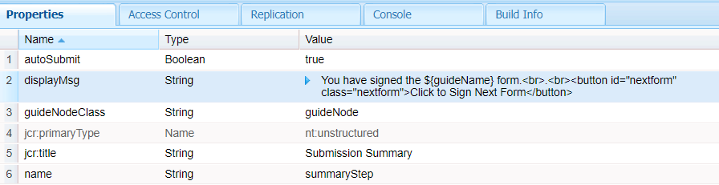

# Samenvattingsstap aanpassen

De component Samenvattingsstap wordt gebruikt om de samenvatting van uw formulierverzending weer te geven met een koppeling om het ondertekende formulier te downloaden. De samenvattingsstap wordt doorgaans in het laatste deelvenster van het formulier geplaatst.
Voor dit gebruiksgeval hebben wij een nieuwe component gecreeerd die op uit de uit component van de doosSamenvatting wordt gebaseerd en het vermogen uitgebreid om douaneclib te omvatten.

Deze component wordt geïdentificeerd door het label Meerdere formulieren ondertekenen

Het volgende het schermschot toont de nieuwe component die werd gecreeerd om het bericht na de het ondertekenen ceremonie te tonen


De nieuwe component is gebaseerd op de overzichtscomponent van het vak.


Er is een knop toegevoegd waarmee u naar het volgende formulier kunt navigeren voor ondertekening


De summary.jsp heeft de volgende code. Er wordt verwezen naar de clientbibliotheek die wordt aangeduid door de categorie-id **getnextform**

```java
<%--
  Guide Summary Component
--%>
<%@include file="/libs/fd/af/components/guidesglobal.jsp"%>
<%@include file="/libs/fd/afaddon/components/summary/summary.jsp"%>
<ui:includeClientLib categories="getnextform"/>
```

## Assets

De aangepaste overzichtscomponent kan [hier gedownload](assets/custom-summary-step.zip)

## Volgende stappen

[Het volgende formulier ophalen voor ondertekening](./create-client-lib.md)