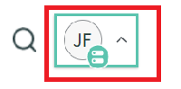

# AEM Forms integreren met [!DNL ServiceNow]

Gebeurtenissen maken en weergeven in [!DNL ServiceNow] met gebruik van het formuliergegevensmodel in AEM Forms.

## Vereisten

* [!DNL ServiceNow] account.
* Vertrouwd met [ het creëren van gegevensbronnen ](https://experienceleague.adobe.com/docs/experience-manager-learn/forms/ic-web-channel-tutorial/parttwo.html)
* Vertrouwd met [ Model van de Gegevens van de Vorm ](https://experienceleague.adobe.com/docs/experience-manager-65/forms/form-data-model/create-form-data-models.html)

## Voorbeeld-Assets

De voorbeeldelementen die bij dit artikel worden geleverd, zijn onder andere:

* Configuratie van cloudservice
* Waggerbestanden om een incident te maken en alles op te halen   incidenten
* Formuliergegevensmodel gebaseerd op de wagerbestanden
* Aangepast formulier om [!DNL ServiceNow] -incidenten te maken en weer te geven

## De elementen op uw server implementeren

* Download de [ steekproefactiva ](assets/service-now.zip)
* Importeer de activa in AEM gebruikend [ pakketmanager ](http://localhost:4502/crx/packmgr/index.jsp)
* Het kwikbestand dat voor deze integratie wordt gebruikt, bevindt zich onder de map ```/conf/9957/settings/cloudconfigs/fdm``` in de crx-opslagplaats
* Bewerk de [ CreateIncident de dienstconfiguratie van de wolk ](http://localhost:4502/mnt/overlay/fd/fdm/gui/components/admin/fdmcloudservice/properties.html?item=%2Fconf%2F9957%2Fsettings%2Fcloudconfigs%2Ffdm%2Fcreateincident) om uw instantie aan te passen ServiceNow.
* Bewerk de [ GetAllIncidents de dienstconfiguratie van de wolk ](http://localhost:4502/mnt/overlay/fd/fdm/gui/components/admin/fdmcloudservice/properties.html?item=%2Fconf%2F9957%2Fsettings%2Fcloudconfigs%2Ffdm%2Fgetallincidents) om uw instantie aan te passen ServiceNow. U zult de gastheer, de gebruikersbenaming en het wachtwoord moeten veranderen om uw ServiceNow instantiegeloofsbrieven aan te passen.

## Toegangsreferenties van ServiceNow-instantie

* Klik op uw gebruikersprofiel
  

* Klik op Instantiewachtwoord beheren
* De details van de instantie worden hieronder weergegeven
  

## Integratie testen

* [ open de Aangepaste Vorm ](http://localhost:4502/content/dam/formsanddocuments/create-incident-in-service-now/jcr:content?wcmmode=disabled)
* Voer enkele waarden in het veld Beschrijving en opmerkingen in en klik op de knop Incident maken
* De incident-id van het nieuwe incident moet in het tekstveld worden ingevuld en in de onderstaande tabel moeten alle incidenten worden vermeld.
