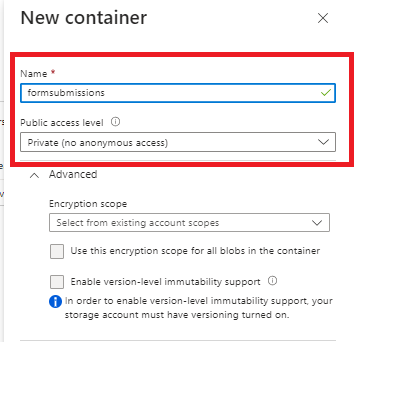

# Formulierverzendingen opslaan in Azure Storage

Dit artikel laat zien hoe u REST-oproepen kunt maken om verzonden AEM Forms-gegevens op te slaan in Azure Storage.
Als u verzonden formuliergegevens wilt opslaan in Azure Storage, moet u de volgende stappen uitvoeren.

>[!NOTE]
>De code in dit artikel werkt niet met op kerncomponenten gebaseerde adaptieve formulieren. [&#x200B; het gelijkwaardige artikel voor kern op component gebaseerde adaptieve vorm is hier beschikbaar &#x200B;](https://experienceleague.adobe.com/docs/experience-manager-learn/forms/prefill-form-with-data-attachments/introduction.html?lang=nl-NL)


## Azure Storage-account maken

[&#x200B; Login aan uw Azure portalaccount en creeer een opslagrekening &#x200B;](https://learn.microsoft.com/en-us/azure/storage/common/storage-account-create?tabs=azure-portal#create-a-storage-account-1). Geef uw opslagaccount een betekenisvolle naam, klik op Revisie en klik vervolgens op Maken. Hiermee maakt u uw opslagaccount met alle standaardwaarden. In het kader van dit artikel hebben we onze opslagaccount `aemformstutorial` genoemd.


## Container maken

Het volgende wat we moeten doen is een container maken om de gegevens van formulierverzendingen op te slaan.
Klik op de pagina met opslagaccounts op de menuoptie Containers aan de linkerkant en maak een container met de naam `formssubmissions` . Zorg ervoor dat het openbare toegangsniveau aan privé wordt geplaatst


## SAS maken op de container

Wij zullen ons van de Gedeelde Handtekening van de Toegang of SAS Methode van vergunning maken om met de Azure container van de Opslag in wisselwerking te staan.
Navigeer naar de container in de opslagaccount, klik op de ellips en selecteer de optie Generate SAS (SAS genereren), zoals weergegeven in de schermafbeelding

Zorg ervoor dat u de juiste machtigingen en de juiste einddatum opgeeft, zoals in de onderstaande schermafbeelding wordt weergegeven, en klik op SAS-token en URL genereren. Kopieer de Blob SAS-token en Blob SAS url. Wij zullen deze twee waarden gebruiken om onze HTTP- vraag te maken


## De BLOB SAS-token en opslag-URI opgeven

Om de code generischer te maken, kunnen de twee eigenschappen worden gevormd gebruikend de configuratie OSGi zoals hieronder getoond. _&#x200B;**aemformstutorial**&#x200B;_ is de naam van de opslagrekening, _&#x200B;**formsubmission**&#x200B;_ is de container waarin de gegevens zullen worden opgeslagen.
Zorg dat / aan het einde van de opslaguri staat en dat het SAS-token begint met?


## PUT-aanvraag maken

De volgende stap bestaat uit het maken van een PUT-aanvraag om de ingediende formuliergegevens op te slaan in Azure Storage. Elke formulierverzending moet worden geïdentificeerd met een unieke BLOB-id. De unieke BLOB-id wordt gewoonlijk in uw code gemaakt en ingevoegd in de URL van de PUT-aanvraag.
Hier volgt de gedeeltelijke URL van het PUT-verzoek. De `aemformstutorial` is de naam van de opslagaccount, de ingevulde gegevens zijn de container waarin de gegevens met een unieke BLOB-id worden opgeslagen. De rest van de URL blijft ongewijzigd.
https://aemformstutorial.blob.core.windows.net/formsubmissions/blobid/sastoken
Hieronder vindt u een functie die wordt geschreven om de verzonden formuliergegevens op te slaan in Azure Storage met behulp van een PUT-aanvraag. Let op het gebruik van de containernaam en de uuid in de URL. U kunt een OSGi-service of een verkoopserver maken met de onderstaande voorbeeldcode en de formulierverzendingen opslaan in Azure Storage.

```java
 public String saveFormDatainAzure(String formData) {
    log.debug("in SaveFormData!!!!!" + formData);
    String sasToken = azurePortalConfigurationService.getSASToken();
    String storageURI = azurePortalConfigurationService.getStorageURI();
    log.debug("The SAS Token is " + sasToken);
    log.debug("The Storage URL is " + storageURI);
    org.apache.http.impl.client.CloseableHttpClient httpClient = HttpClientBuilder.create().build();
    UUID uuid = UUID.randomUUID();
    String putRequestURL = storageURI + uuid.toString();
    putRequestURL = putRequestURL + sasToken;
    HttpPut httpPut = new HttpPut(putRequestURL);
    httpPut.addHeader("x-ms-blob-type", "BlockBlob");
    httpPut.addHeader("Content-Type", "text/plain");

    try {
        httpPut.setEntity(new StringEntity(formData));

        CloseableHttpResponse response = httpClient.execute(httpPut);
        log.debug("Response code " + response.getStatusLine().getStatusCode());
        if (response.getStatusLine().getStatusCode() == 201) {
            return uuid.toString();
        }
    } catch (IOException e) {
        log.error("Error: " + e.getMessage());
        throw new RuntimeException(e);
    }
    return null;

}
```

## Opgeslagen gegevens in de container verifiëren


## De oplossing testen

* [De aangepaste OSGi-bundel implementeren](./assets/SaveAndFetchFromAzure.core-1.0.0-SNAPSHOT.jar)

* [Het aangepaste aangepaste formuliersjabloon en de paginacomponent die aan de sjabloon zijn gekoppeld importeren](./assets/store-and-fetch-from-azure.zip)

* [Het adaptieve voorbeeldformulier importeren](./assets/bank-account-sample-form.zip)

* [&#x200B; specificeer de aangewezen waarden in de Azure Portal Configuratie gebruikend de OSGi configuratieconsole &#x200B;](https://experienceleague.adobe.com/docs/experience-manager-learn/forms/some-useful-integrations/store-form-data-in-azure-storage.html?lang=nl-NL#provide-the-blob-sas-token-and-storage-uri)

* [&#x200B; Voorproef en voorlegt de vorm BankAccount &#x200B;](http://localhost:4502/content/dam/formsanddocuments/azureportalstorage/bankaccount/jcr:content?wcmmode=disabled)

* Controleer of de gegevens zijn opgeslagen in de Azure-opslagcontainer van uw keuze. Kopieer de blob-id.
* [&#x200B; Voorproef de vorm BankAccount &#x200B;](http://localhost:4502/content/dam/formsanddocuments/azureportalstorage/bankaccount/jcr:content?wcmmode=disabled&amp;guid=dba8ac0b-8be6-41f2-9929-54f627a649f6) en specificeer identiteitskaart van de Blob als begeleide parameter in URL voor de vorm die met de gegevens van Azure opslag moet worden vooraf bevolkt

