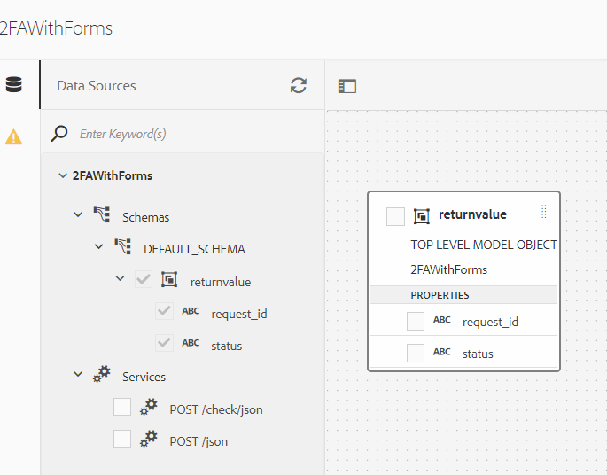

# Gebruikers verifiëren met hun mobiele telefoonnummers

SMS Two Factor Authentication (Dual Factor Authentication) is een veiligheidsverificatieprocedure, die wordt geactiveerd door een gebruiker die zich aanmeldt bij een website, software of toepassing. Tijdens het aanmeldingsproces wordt de gebruiker automatisch een SMS-bericht naar zijn mobiele nummer gestuurd dat een unieke numerieke code bevat.

Er zijn een aantal organisaties die deze service aanbieden en zolang deze beschikken over goed gedocumenteerde REST API&#39;s kunt u AEM Forms eenvoudig integreren met de mogelijkheden voor gegevensintegratie van AEM Forms. Voor deze zelfstudie heb ik [Nexmo](https://developer.nexmo.com/verify/overview) om het geval van gebruik van SMS 2FA aan te tonen.

De volgende stappen werden gevolgd om SMS 2FA met AEM Forms uit te voeren gebruikend de dienst van Nexmo Verify.

## Ontwikkelaarsaccount maken

Een ontwikkelaarsaccount maken met [Nexmo](https://dashboard.nexmo.com/sign-in). Noteer de API-sleutel en de API-beveiligingssleutel. Deze toetsen zijn nodig om REST API&#39;s van de Nexmo-service aan te roepen.

## Swagger/OpenAPI-bestand maken

De OpenAPI-specificatie (voorheen Swagger Specification) is een API-beschrijvingsindeling voor REST API&#39;s. Met een OpenAPI-bestand kunt u de volledige API beschrijven, inclusief:

* Beschikbare eindpunten (/gebruikers) en verrichtingen op elk eindpunt (GET /users, POST /users)
* Operatieparameters Invoer en uitvoer voor elke bewerkingsverificatiemethode
* Contactgegevens, licentie, gebruiksvoorwaarden en andere informatie.
* API-specificaties kunnen worden geschreven in YAML of JSON. De indeling is gemakkelijk te leren en kan zowel voor mensen als voor machines worden gelezen.

Als u uw eerste wagger/OpenAPI-bestand wilt maken, volgt u de [OpenAPI-documentatie](https://swagger.io/docs/specification/2-0/basic-structure/)

>[!NOTE]
> AEM Forms biedt ondersteuning voor OpenAPI Specification versie 2.0 (fka Swagger).

Gebruik de [wageneditor](https://editor.swagger.io/) om uw wagerbestand te maken om de bewerkingen te beschrijven die OTP-code verzenden en verifiëren die met SMS is verzonden. Het wagerbestand kan in JSON- of YAML-indeling worden gemaakt. Het voltooide wagerbestand kan worden gedownload van [hier](assets/two-factore-authentication-swagger.zip)

## Gegevensbron maken

Om AEM/AEM Forms met derdetoepassingen te integreren, moeten wij [gegevensbron maken](https://experienceleague.adobe.com/docs/experience-manager-learn/forms/ic-web-channel-tutorial/parttwo.html) in de configuratie van cloudservices.

## Formuliergegevensmodel maken

AEM Forms-gegevensintegratie biedt een intuïtieve gebruikersinterface voor het maken van en werken met [formuliergegevensmodellen](https://experienceleague.adobe.com/docs/experience-manager-65/forms/form-data-model/create-form-data-models.html). Een formuliergegevensmodel is gebaseerd op gegevensbronnen voor gegevensuitwisseling.
Het ingevulde formuliergegevensmodel kan [hier gedownload](assets/sms-2fa-fdm.zip)

## Adaptief formulier maken

Integreer de aanroepen van de POST van het formuliergegevensmodel met het aangepaste formulier om te controleren welk mobiele telefoonnummer de gebruiker in het formulier heeft ingevoerd. U kunt zelf een adaptief formulier maken en de POST-aanroeping van het formuliergegevensmodel gebruiken om OTP-code te verzenden en te verifiëren naar wens.

Voer de volgende stappen uit als u de voorbeeldbestanden met uw API-toetsen wilt gebruiken:

* [Het formuliergegevensmodel downloaden](assets/sms-2fa-fdm.zip) en importeren in AEM [pakketbeheer](http://localhost:4502/crx/packmgr/index.jsp)
* Download het voorbeeldadaptieve formulier dat u kunt [hier gedownload](assets/sms-2fa-verification-af.zip). In dit voorbeeldformulier worden de serviceaanroepen van het formuliergegevensmodel gebruikt die als onderdeel van dit artikel worden aangeboden.
* Het formulier importeren in AEM van de [UI Forms en Document](http://localhost:4502/aem/forms.html/content/dam/formsanddocuments)
* Open het formulier in de bewerkingsmodus. De regeleditor voor het volgende veld openen

* Bewerk de regel die aan het veld is gekoppeld. Geef uw juiste API-sleutels op
* Het formulier opslaan
* [Een voorbeeld van het formulier bekijken](http://localhost:4502/content/dam/formsanddocuments/sms-2fa-verification/jcr:content?wcmmode=disabled) en test de functionaliteit
