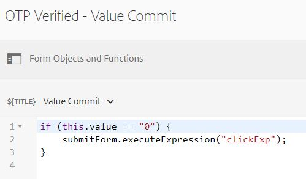

# Het MyAccountForm maken

Het formulier **MyAccountForm** wordt gebruikt om het gedeeltelijk ingevulde adaptieve formulier op te halen nadat de gebruiker de toepassings-id en het mobiele nummer dat aan de toepassings-id is gekoppeld, heeft geverifieerd.


Wanneer de gebruiker de toepassings-id invoert en op de knop **FetchApplication** wordt het mobiele nummer dat aan de toepassings-id is gekoppeld, opgehaald uit de database met de functie Ophalen van het formuliergegevensmodel.

In dit formulier wordt gebruikgemaakt van de aanroep van de POST van het formuliergegevensmodel om het mobiele nummer te verifiëren met OTP. De verzendactie van het formulier wordt geactiveerd nadat het mobiele nummer met de volgende code is geverifieerd. De gebeurtenis click van de verzendknop met de naam **submitForm**.

>[!NOTE]
> U moet de API-sleutel en de specifieke API-beveiligingswaarden opgeven voor uw [Nexmo](https://dashboard.nexmo.com/) account in de betreffende velden van het MyAccountForm




Dit formulier is gekoppeld aan een aangepaste verzendactie waarmee de formulierverzending wordt doorgestuurd naar het servlet dat is geïnstalleerd op **/bin/renderaf**

```java
com.adobe.aemds.guide.utils.GuideSubmitUtils.setForwardPath(slingRequest,"/bin/renderaf",null,null);
```

De code in het servlet gemonteerd op **/bin/renderaf** stuurt de aanvraag door om de opslagbijlagen een adaptief formulier te geven dat vooraf is ingevuld met de opgeslagen gegevens.


* Het MyAccountForm kan [hier gedownload](assets/my-account-form.zip)

* Voorbeeldformulieren zijn gebaseerd op [aangepaste adaptieve formuliersjabloon](assets/custom-template-with-page-component.zip) die in AEM moeten worden geïmporteerd om de voorbeeldformulieren correct te kunnen weergeven.

* [Aangepaste verzendhandler](assets/custom-submit-my-account-form.zip) die zijn gekoppeld aan het verzenden van het MyAccountForm-formulier, moet worden geïmporteerd in AEM.

## Volgende stappen

[Test de oplossing door de steekproefactiva op te stellen](./deploy-this-sample.md)
