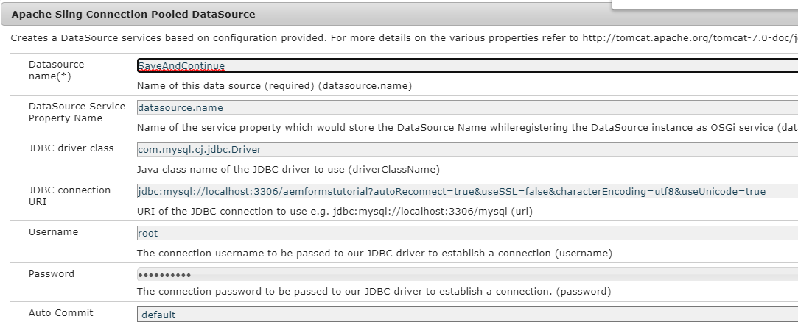

# Source van gegevens configureren

Er zijn vele manieren waarmee AEM integratie met externe database mogelijk maakt. Één van de gemeenschappelijkste &amp; standaardpraktijk van gegevensbestandintegratie is door Apache Te gebruiken die Verbinding Gepoolde eigenschappen van de Configuratie DataSource door [ configMgr ](http://localhost:4502/system/console/configMgr) ruilt.
De eerste stap is de aangewezen [ bestuurders MySql ](https://mvnrepository.com/artifact/mysql/mysql-connector-java) in AEM te downloaden en op te stellen.
Maak Apache Sling Connection Pooled DataSource en geef de eigenschappen op die zijn opgegeven in de onderstaande schermafbeelding. Het databaseschema wordt als onderdeel van deze zelfstudie-elementen aan u verstrekt.

Het gegevensbestand heeft één lijst genoemd formdata met de 3 kolommen zoals aangetoond in het scherm-schot hieronder.

Het sql- dossier om het schema tot stand te brengen kan [ van hier ](assets/form-data-db.sql) worden gedownload. U zult dit dossier gebruikend MySql werkbank moeten invoeren om het schema en de lijst tot stand te brengen.

>[!NOTE]
>Gelieve te zorgen u uw gegevensbron **SaveAndContinue** noemt. De voorbeeldcode gebruikt de naam om verbinding te maken met de database.

| Eigenschapnaam | Waarde |
| ------------------------|---------------------------------------|
| Naam gegevensbron | `SaveAndContinue` |
| JDBC-stuurprogramma, klasse | `com.mysql.cj.jdbc.Driver` |
| JDBC-verbindingsuri | `jdbc:mysql://localhost:3306/aemformstutorial` |
