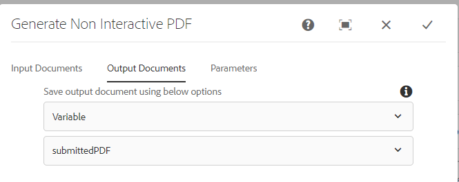

# Workflow voor het beoordelen en goedkeuren van de ingediende PDF

De laatste en laatste stap bestaat uit het maken van AEM workflow die een statische of niet-interactieve PDF voor controle en goedkeuring genereert. De workflow wordt geactiveerd via een AEM Launcher die op het knooppunt `/content/formsubmissions` is geconfigureerd.

In de volgende schermafbeelding worden de stappen weergegeven die bij de workflow horen.


## Niet-interactieve stap voor PDF-workflow genereren

Hier worden de XDP-sjabloon en de gegevens die met de sjabloon moeten worden samengevoegd, opgegeven. De gegevens die moeten worden samengevoegd, zijn de verzonden gegevens van de PDF. Deze verzonden gegevens worden opgeslagen onder het knooppunt ```/content/formsubmissions```


De gegenereerde PDF wordt toegewezen aan de werkstroomvariabele `submittedPDF` .



### De gegenereerde pdf ter controle en goedkeuring toewijzen

De taakwerkstroomcomponent toewijzen wordt hier gebruikt om de gegenereerde PDF toe te wijzen voor revisie en goedkeuring. De variabele `submittedPDF` wordt gebruikt op het tabblad Forms en Documenten van de werkstroomcomponent Taak toewijzen.


## Volgende stappen

[De middelen in uw omgeving implementeren](./deploy-assets.md)