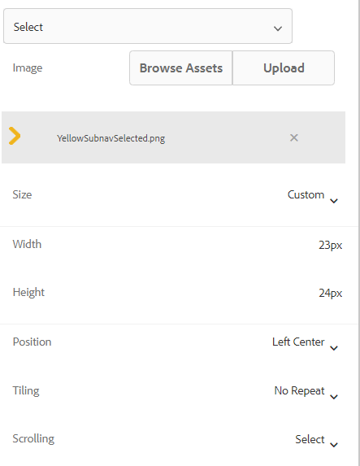

# Pictogrammen toevoegen om actieve en voltooide tabbladen aan te geven

Als u een adaptief formulier hebt met linkertabnavigatie, kunt u pictogrammen weergeven om de status van de tab aan te geven. U wilt bijvoorbeeld een pictogram weergeven om het actieve tabblad en het actieve pictogram aan te geven om het voltooide tabblad aan te geven, zoals in de onderstaande schermafbeelding wordt getoond.

## Een adaptief formulier maken

Een eenvoudig adaptief formulier op basis van de sjabloon Standaard en het thema Canvas 3.0 is gebruikt om het voorbeeldformulier te maken.
De [&#x200B; pictogrammen die in dit artikel &#x200B;](assets/icons.zip) worden gebruikt kunnen van hier worden gedownload.

## De standaardstatus opmaken

Het formulier openen in de bewerkingsmodus
Zorg ervoor dat u zich in de stijllaag bevindt en selecteer een willekeurig tabblad (bijvoorbeeld het tabblad Algemeen).
U bevindt zich in de standaardstatus wanneer u de stijleditor voor de tab opent, zoals wordt weergegeven in de onderstaande schermafbeelding

CSS-eigenschappen instellen voor de standaardstatus zoals hieronder wordt weergegeven

| Categorie | Eigenschapnaam | Waarde van eigenschap |
|:---|:---|:---|
| Afmetingen en positie | Breedte | 50 px |
| Tekst | Dikte lettertype | Vet |
| Tekst | Kleur | #FFF |
| Tekst | Lijnhoogte | 3 |
| Tekst | Tekst uitlijnen | Links |
| Achtergrond | Kleur | #056dae |

Uw wijzigingen opslaan

## De actieve status opmaken

Zorg ervoor dat u de status Actief hebt en maak de volgende CSS-eigenschappen op

| Categorie | Eigenschapnaam | Waarde van eigenschap |
|:---|:---|:---|
| Afmetingen en positie | Breedte | 50 px |
| Tekst | Dikte lettertype | Vet |
| Tekst | Kleur | #FFF |
| Tekst | Lijnhoogte | 3 |
| Tekst | Tekst uitlijnen | Links |
| Achtergrond | Kleur | #056dae |

De achtergrondafbeelding opmaken zoals wordt weergegeven in de onderstaande schermafbeelding

Sla uw wijzigingen op.

## De bezochte staat opmaken

Zorg ervoor dat u in de bezochte staat bent en stijl de volgende eigenschappen

| Categorie | Eigenschapnaam | Waarde van eigenschap |
|:---|:---|:---|
| Afmetingen en positie | Breedte | 50 px |
| Tekst | Dikte lettertype | Vet |
| Tekst | Kleur | #FFF |
| Tekst | Lijnhoogte | 3 |
| Tekst | Tekst uitlijnen | Links |
| Achtergrond | Kleur | #056dae |

De achtergrondafbeelding opmaken zoals wordt weergegeven in de onderstaande schermafbeelding

Uw wijzigingen opslaan

Bekijk een voorbeeld van het formulier en test of de pictogrammen werken zoals u had verwacht.
