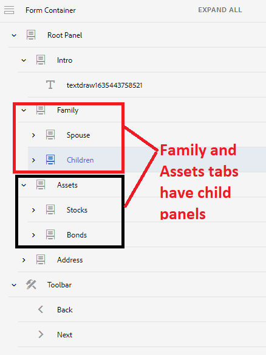

# Navigatietabels met meerdere deelvensters

Wanneer uw formulier navigatietabels links heeft en een van de tabbladen meerdere deelvensters bevat, kunt u de titel van de onderliggende deelvensters verbergen en toch tussen de tabbladen en de onderliggende deelvensters van deze tabbladen navigeren

## Adaptief formulier maken

Maak een adaptief formulier met de volgende structuur. Het hoofddeelvenster bevat onderliggende deelvensters die links als tabbladen worden weergegeven. Sommige van deze &quot;**tabs**&quot; hebt extra onderliggende deelvensters. Het tabblad Familie heeft bijvoorbeeld twee onderliggende deelvensters: Echtgenote en Onderliggende deelvensters.

Er wordt ook een werkbalk toegevoegd onder de FormContainer met de knoppen Vorige en Volgende




Standaard worden in dit formulier alle deelvensters aan de linkerkant weergegeven en wordt vervolgens van de ene tab naar de andere gegaan wanneer u op de volgende knop klikt.

Om dit standaardgedrag te veranderen, moeten wij het volgende doen

>[!VIDEO](https://video.tv.adobe.com/v/338369?quality=12&learn=on)


Voeg de volgende code toe de klikgebeurtenis van **Volgende** knop met de code-editor

```javascript
window.guideBridge.setFocus(null, 'nextItemDeep', true);
```

Voeg de volgende code toe de klikgebeurtenis van **Vorige** knop met de code-editor

```javascript
window.guideBridge.setFocus(null, 'prevItemDeep', true);
```

Met de bovenstaande code kunt u gemakkelijk navigeren tussen de tabbladen en de onderliggende deelvensters van elk tabblad.

## De titel van onderliggende deelvensters verbergen

Met de stijleditor kunt u de titel van de onderliggende tabbladen verbergen.

>[!VIDEO](https://video.tv.adobe.com/v/338370?quality=12&learn=on)

>[!NOTE]
>
>De in dit artikel beschreven mogelijkheid werkt niet op het laatste tabblad. Als het tabblad Adres bijvoorbeeld onderliggende deelvensters bevat, werkt deze functionaliteit niet.
