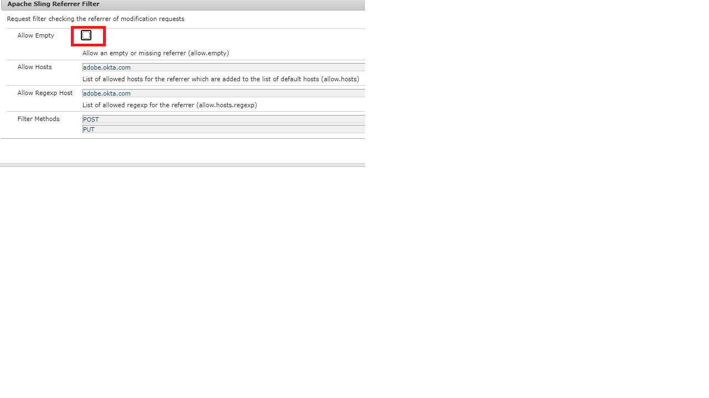

# Verifiëren voor AEM auteur met OKTA

> Zie [SAML 2.0-verificatie](https://experienceleague.adobe.com/docs/experience-manager-learn/cloud-service/authentication/saml-2-0.html) voor instructies over hoe te opstelling OKTA met AEM as a Cloud Service.

De eerste stap bestaat uit het configureren van uw app op de OKTA-portal. Nadat uw app is goedgekeurd door uw OKTA-beheerder, hebt u toegang tot het IdP-certificaat en een Single Sign on URL. Hieronder ziet u de instellingen die gewoonlijk worden gebruikt voor de registratie van nieuwe toepassingen.

* **Toepassingsnaam:** Dit is uw toepassingsnaam. Geef uw toepassing een unieke naam.
* **SAML-ontvanger:** Na authentificatie van OKTA, is dit URL die op uw AEM instantie met de reactie SAML zou worden geraakt. SAML de authentificatiemanager onderschept normaal al URL&#39;s met / saml_login maar het zou verkieslijk zijn om het na uw toepassingswortel toe te voegen.
* **SAML-publiek**: Dit is de domein-URL van uw toepassing. Gebruik geen protocol (http of https) in het domein-URL.
* **SAML-naam-id:** Selecteer E-mail in de vervolgkeuzelijst.
* **Omgeving**: Kies de juiste omgeving.
* **Attributen**: Dit zijn de attributen u over de gebruiker in de reactie van SAML krijgt. Geef ze op naar wens.

## Het OKTA-certificaat (IdP) toevoegen aan het AEM Trust Store

Aangezien de beweringen van SAML worden gecodeerd, moeten wij het certificaat IdP (OKTA) aan de AEM vertrouwensopslag toevoegen, om veilige communicatie tussen OKTA en AEM toe te staan.
[Vertrouwensopslag initialiseren](http://localhost:4502/libs/granite/security/content/truststore.html), als deze nog niet is geïnitialiseerd.
Onthoud het wachtwoord voor de vertrouwde opslag. Dit wachtwoord moeten we later tijdens dit proces gebruiken.

* Navigeren naar [Global Trust Store](http://localhost:4502/libs/granite/security/content/truststore.html).
* Klik op Certificaat toevoegen uit CER-bestand. Voeg het IdP-certificaat toe dat door OKTA is opgegeven en klik op Verzenden.

  >[!NOTE]
  >
  >Wijs het certificaat niet toe aan gebruikers

Als u het certificaat toevoegt aan de vertrouwde opslag, krijgt u de certificaatalias zoals in de onderstaande schermafbeelding wordt getoond. De naam van de alias kan in uw geval anders zijn.

**Noteer het alias van het certificaat. U hebt dit in de latere stappen nodig.**

### SAML-verificatiehandler configureren

Navigeren naar [configMgr](http://localhost:4502/system/console/configMgr).
Zoek en open &quot;Adobe granite SAML 2.0 Authentication Handler&quot;.
Verstrek de volgende eigenschappen zoals hieronder gespecificeerd zijn de belangrijkste eigenschappen die moeten worden gespecificeerd:

* **pad** - Dit is het pad waar de verificatiehandler wordt geactiveerd.
* **IdP URL**:Dit is uw IdP-URL die wordt geleverd door OKTA
* **IdP-certificaatalias**:Dit is de alias die u hebt gekregen toen u het IdP-certificaat aan AEM vertrouwde opslag toevoegde
* **Entiteit-id van serviceprovider**:Dit is de naam van uw AEM Server
* **Wachtwoord sleutelarchief**:Dit is het vertrouwensopslagwachtwoord dat u hebt gebruikt
* **Standaardomleiding**:Dit is de URL waarnaar een geslaagde verificatie moet worden omgeleid
* **Kenmerk gebruikersnaam**:uid
* **Codering gebruiken**:false
* **CRX-gebruikers automatisch maken**:true
* **Toevoegen aan groepen**:true
* **Standaardgroepen**:oktausers(Dit is de groep waaraan de gebruikers worden toegevoegd. U kunt elke bestaande groep opgeven (AEM)
* **NamedIDPopolicy**: Geeft beperkingen op aan de naam-id die moet worden gebruikt om het gevraagde onderwerp weer te geven. De volgende gemarkeerde tekenreeks kopiëren en plakken **urn:oasis:names:tc:SAML:2.0:nameidformat:emailAddress**
* **Gesynchroniseerde kenmerken** - Dit zijn de attributen die van bevestiging SAML in AEM profiel worden opgeslagen

### Filter Apache Sling Reference configureren

Navigeren naar [configMgr](http://localhost:4502/system/console/configMgr).
Zoek en open &quot;Apache Sling Referrer Filter&quot;.Stel de volgende eigenschappen in zoals hieronder opgegeven:

* **Lege waarden toestaan**: false
* **Hosts toestaan**: IdP&#39;s hostname (dit is anders in uw geval)
* **Regexp-host toestaan**: hostnaam van idP (dit is anders in uw geval) Schermafbeelding van de eigenschappen van de Verwijzing van de Filter van de Verkenner van de Verkoper

#### Logboekregistratie voor FOUTOPSPORING configureren voor de OKTA-integratie

Wanneer vestiging de integratie OKTA op AEM, kan het nuttig zijn om de DEBUG- logboeken voor AEM de manager van de Authentificatie van SAML te herzien. Om het logboekniveau aan DEBUG te plaatsen, creeer een nieuwe Sling Logger configuratie via de Console van het Web AEM OSGi.

Vergeet niet dit logger in het werkgebied en de productie te verwijderen of uit te schakelen om logruis te verminderen.

Wanneer vestiging de integratie OKTA op AEM, kan het nuttig zijn om DEBUG logboeken voor AEM de manager van de Authentificatie van SAML te herzien. Om het logboekniveau aan DEBUG te plaatsen, creeer een nieuwe Sling Logger configuratie via de Console van het Web AEM OSGi.
**Vergeet niet dit logger in het werkgebied en de productie te verwijderen of uit te schakelen om logruis te verminderen.**
* Navigeren naar [configMgr](http://localhost:4502/system/console/configMgr)

* Zoek en open &quot;Apache Sling Logging Logger Configuration&quot;
* Maak een logger met de volgende configuratie:
   * **Logboekniveau**: Foutopsporing
   * **Logbestand**: logs/saml.log
   * **Aanmelder**: com.adobe.granite.auth.saml
* Klik op Opslaan om uw instellingen op te slaan

#### Uw OKTA-configuratie testen

Afmelden van uw AEM-instantie. Probeer de koppeling te openen. U moet OKTA SSO in actie zien.
