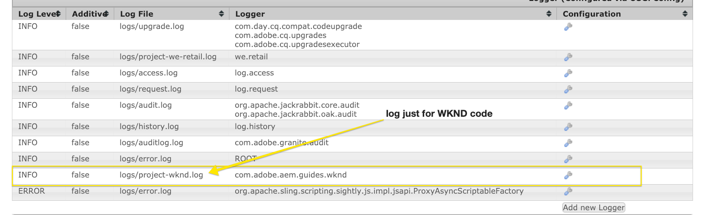

# Een lokale AEM ontwikkelomgeving instellen

Handleiding voor het opzetten van een lokale ontwikkeling voor Adobe Experience Manager, AEM. Omvat belangrijke onderwerpen van lokale installatie, Apache Maven, geïntegreerde ontwikkelomgevingen en het zuiveren/het oplossen van problemen. Ontwikkeling met **[!DNL Eclipse IDE],[!DNL CRXDE Lite],[!DNL Visual Studio Code]en[!DNL IntelliJ]** wordt besproken.

## Overzicht

Het opzetten van een lokale ontwikkelomgeving is de eerste stap bij het ontwikkelen voor Adobe Experience Manager of AEM. Neem de tijd om een ontwikkelomgeving voor kwaliteit in te stellen om uw productiviteit te verhogen en betere code te schrijven, sneller. We kunnen een AEM lokale ontwikkelingsomgeving onderverdelen in vier gebieden:

* Lokale AEM
* [!DNL Apache Maven] project
* Geïntegreerde ontwikkelomgevingen (IDE)
* Problemen oplossen

## Lokale AEM installeren

Wanneer we verwijzen naar een lokale AEM, hebben we het over een kopie van Adobe Experience Manager die wordt uitgevoerd op de persoonlijke machine van een ontwikkelaar. ***Alle*** AEM ontwikkeling zou moeten beginnen door code tegen een lokale AEM instantie te schrijven en in werking te stellen.

Als u nog geen ervaring hebt met AEM, kunt u twee standaardmodi installeren: ***Auteur*** en ***Publiceren***. De ***auteur*** - [runmode](https://helpx.adobe.com/experience-manager/6-5/sites/deploying/using/configure-runmodes.html) is de omgeving die digitale marketers gebruiken om inhoud te maken en te beheren. Wanneer het ontwikkelen van **het grootste** deel van de tijd zult u code aan een instantie van de Auteur opstellen. Hierdoor kunt u nieuwe pagina&#39;s maken en componenten toevoegen en configureren. AEM Sites is een WYSIWYG-ontwerpend CMS en daarom kunnen de meeste CSS en JavaScript worden getest op basis van een ontwerpinstantie.

Het is ook *kritieke* testcode tegen een lokale ***Publish*** instantie. De instantie ***Publiceren*** is de AEM omgeving waarmee bezoekers van uw website communiceren. Terwijl de instantie ***Publiceren*** de zelfde technologiestapel zoals de instantie van de ***Auteur*** is, zijn er één of ander belangrijk onderscheid met configuraties en toestemmingen. Code moet *altijd* worden getest op basis van een lokale ***publicatie*** -instantie voordat deze wordt bevorderd naar omgevingen op een hoger niveau.

### Stappen

1. Controleer of [Java](https://downloads.experiencecloud.adobe.com/content/software-distribution/en/general.html) is geïnstalleerd.
   * Voorkeur voor [Java JDK 11](https://experience.adobe.com/#/downloads/content/software-distribution/en/general.html?1_group.propertyvalues.property=.%2Fjcr%3Acontent%2Fmetadata%2Fdc%3AsoftwareType&amp;1_group.propertyvalues.operation=equals&amp;1_group.propertyvalues.0_values=software-type%3Atooling&amp;orderby=%40jcr%3Acontent%2Fjcr%3AlastModified&amp;orderby.sort=desc&amp;layout=list p.offset=0&amp;p.limit=14) voor AEM 6.5+
   * [Java JDK 8](https://www.oracle.com/technetwork/java/javase/downloads/index.html#JDK8) voor AEM versies ouder dan AEM 6.5
2. Haal een kopie op van de [AEM QuickStart Jar en a [!DNL license.properties]](https://helpx.adobe.com/experience-manager/6-5/sites/deploying/using/deploy.html#GettingtheSoftware).
3. Maak als volgt een mapstructuur op uw computer:

   ```plain
   ~/aem-sdk
       /author
       /publish
   ```

4. Wijzig de naam van de [!DNL QuickStart] JAR in ***naam-auteur-p4502.jar*** en plaats deze onder de `/author` map. Voeg het ***[!DNL license.properties]*** bestand onder de `/author` map toe.
5. Maak een kopie van de [!DNL QuickStart] JAR, wijzig de naam in ***name-publish-p4503.jar*** en plaats deze onder de `/publish` directory. Voeg een kopie van het ***[!DNL license.properties]*** bestand toe onder de `/publish` map.

   ```plain
   ~/aem-sdk
       /author
           + aem-author-p4502.jar
           + license.properties
       /publish
           + aem-publish-p4503.jar
           + license.properties
   ```

6. Dubbelklik op het bestand ***aem-signer-p4502.jar*** om de instantie **Auteur** te installeren. Hiermee wordt de auteurinstantie gestart, die wordt uitgevoerd op poort **4502** op de lokale computer.

   Dubbelklik op het bestand ***aem-publish-p4503.jar*** om de instantie **Publish** te installeren. Hierdoor wordt de instantie Publish gestart, die wordt uitgevoerd op poort **4503** op de lokale computer.

   >[!NOTE]
   >
   >Afhankelijk van de hardware van uw ontwikkelcomputer kan het moeilijk zijn om zowel een **Auteur als een Publish** instantie tezelfdertijd in werking te stellen. Zelden moet u allebei gelijktijdig op een lokale opstelling in werking stellen.

   Zie Een AEM [instantie](https://helpx.adobe.com/experience-manager/6-5/sites/deploying/using/deploy.html)implementeren en onderhouden voor meer informatie.

## Apache Maven installeren

***[!DNL Apache Maven]*** is een hulpmiddel om de bouwstijl te beheren en procedure voor op Java-Gebaseerde projecten op te stellen. AEM is een op Java gebaseerd platform en [!DNL Maven] is de standaardmanier om code voor een AEM project te beheren. Wanneer wij ***AEM Maven Project*** of enkel uw ***AEM Project*** zeggen, verwijzen wij naar een Maven project dat alle *douanecode* voor uw plaats omvat.

Alle AEM projecten moeten worden opgebouwd uit de meest recente versie van de **[!DNL AEM Project Archetype]**: [https://github.com/Adobe-Marketing-Cloud/aem-project-archetype](https://github.com/Adobe-Marketing-Cloud/aem-project-archetype). Het [!DNL AEM Project Archetype] zal tot een laarzentrekker van een AEM project met één of andere steekproefcode en inhoud leiden. Het omvat [!DNL AEM Project Archetype] ook **[!DNL AEM WCM Core Components]** gevormd om op uw project worden gebruikt.

>[!CAUTION]
>
>Wanneer het beginnen van een nieuw project is het beste praktijken om de recentste versie van archetype te gebruiken. Houd in mening dat er veelvoudige versies van archetype zijn en niet alle versies compatibel met vroegere versies van AEM.

### Stappen

1. Apache [Maven downloaden](https://maven.apache.org/download.cgi)
2. Installeer [Apache Maven](https://maven.apache.org/install.html) en controleer of de installatie is toegevoegd aan de opdrachtregel `PATH`.
   * [!DNL macOS] gebruikers kunnen Maven installeren met [Homebrew](https://brew.sh/)
3. Verifieer dat geïnstalleerd door een nieuwe terminal van de bevellijn te openen en het volgende uit te voeren **[!DNL Maven]** is:

   ```shell
   $ mvn --version
   Apache Maven 3.3.9
   Maven home: /Library/apache-maven-3.3.9
   Java version: 1.8.0_111, vendor: Oracle Corporation
   Java home: /Library/Java/JavaVirtualMachines/jdk1.8.0_111.jdk/Contents/Home/jre
   Default locale: en_US, platform encoding: UTF-8
   ```

4. Voeg het **[!DNL adobe-public]** profiel toe aan het bestand [!DNL Maven] settings.xml [om het automatisch](https://maven.apache.org/settings.html) **[!DNL repo.adobe.com]** aan het gemaakte constructieproces toe te voegen.

5. Maak een bestand met de naam `settings.xml` at `~/.m2/settings.xml` als dit nog niet bestaat.

6. Voeg het **[!DNL adobe-public]** profiel aan het `settings.xml` dossier toe dat op [de instructies hier](https://repo.adobe.com/)wordt gebaseerd.

   Hieronder `settings.xml` wordt een voorbeeld weergegeven. *Opmerking: de naamgevingsconventie van`settings.xml`en de plaatsing onder de`.m2`map van de gebruiker is belangrijk.*

   ```xml
   <settings xmlns="https://maven.apache.org/SETTINGS/1.0.0"
     xmlns:xsi="https://www.w3.org/2001/XMLSchema-instance"
     xsi:schemaLocation="https://maven.apache.org/SETTINGS/1.0.0
                         https://maven.apache.org/xsd/settings-1.0.0.xsd">
   <profiles>
    <!-- ====================================================== -->
    <!-- A D O B E   P U B L I C   P R O F I L E                -->
    <!-- ====================================================== -->
        <profile>
            <id>adobe-public</id>
            <activation>
                <activeByDefault>true</activeByDefault>
            </activation>
            <properties>
                <releaseRepository-Id>adobe-public-releases</releaseRepository-Id>
                <releaseRepository-Name>Adobe Public Releases</releaseRepository-Name>
                <releaseRepository-URL>https://repo.adobe.com/nexus/content/groups/public</releaseRepository-URL>
            </properties>
            <repositories>
                <repository>
                    <id>adobe-public-releases</id>
                    <name>Adobe Public Repository</name>
                    <url>https://repo.adobe.com/nexus/content/groups/public</url>
                    <releases>
                        <enabled>true</enabled>
                        <updatePolicy>never</updatePolicy>
                    </releases>
                    <snapshots>
                        <enabled>false</enabled>
                    </snapshots>
                </repository>
            </repositories>
            <pluginRepositories>
                <pluginRepository>
                    <id>adobe-public-releases</id>
                    <name>Adobe Public Repository</name>
                    <url>https://repo.adobe.com/nexus/content/groups/public</url>
                    <releases>
                        <enabled>true</enabled>
                        <updatePolicy>never</updatePolicy>
                    </releases>
                    <snapshots>
                        <enabled>false</enabled>
                    </snapshots>
                </pluginRepository>
            </pluginRepositories>
        </profile>
   </profiles>
    <activeProfiles>
        <activeProfile>adobe-public</activeProfile>
    </activeProfiles>
   </settings>
   ```

7. Controleer of het profiel **adobe-public** actief is door de volgende opdracht uit te voeren:

   ```shell
   $ mvn help:effective-settings
   ...
   <activeProfiles>
       <activeProfile>adobe-public</activeProfile>
   </activeProfiles>
   <pluginGroups>
       <pluginGroup>org.apache.maven.plugins</pluginGroup>
       <pluginGroup>org.codehaus.mojo</pluginGroup>
   </pluginGroups>
   </settings>
   [INFO] ------------------------------------------------------------------------
   [INFO] BUILD SUCCESS
   [INFO] ------------------------------------------------------------------------
   [INFO] Total time:  0.856 s
   ```

   Als u het **[!DNL adobe-public]** niet ziet, geeft dit aan dat in het `~/.m2/settings.xml` bestand niet naar de Adobe-repo wordt verwezen. Ga terug naar de vorige stappen en controleer of het bestand settings.xml verwijst naar het Adobe-repo.

## Een geïntegreerde ontwikkelomgeving instellen

Een geïntegreerde ontwikkelomgeving of IDE is een toepassing waarin een teksteditor, syntaxisondersteuning en buildtools worden gecombineerd. Afhankelijk van het type van ontwikkeling u doet, zou één winde boven een andere kunnen verkiezen. Ongeacht winde, zal het belangrijk zijn om code aan een lokale AEM instantie periodiek te kunnen ***duwen*** om het te testen. Het zal ook belangrijk zijn om configuraties van een lokale AEM instantie af en toe in uw AEM project te ***trekken*** om aan een bron-controle beheerssysteem zoals Git voort te zetten.

Hieronder staan een paar populairdere IDEs die met AEM ontwikkeling met overeenkomstige video&#39;s worden gebruikt die de integratie met een lokale AEM instantie tonen.

### [!DNL Eclipse] IDE

De **[[!DNL Eclipse] IDE](https://www.eclipse.org/ide/)** is een van de populairste IDE&#39;s voor Java-ontwikkeling, grotendeels omdat het opensource en ***gratis*** is! Adobe beschikt over een insteekmodule, **[[!DNL AEM Developer Tools]](https://eclipse.adobe.com/aem/dev-tools/)**, [!DNL Eclipse] waarmee u de ontwikkeling kunt vereenvoudigen met een handige GUI voor het synchroniseren van code met een lokale AEM-instantie. De [!DNL Eclipse] winde wordt geadviseerd voor ontwikkelaars nieuw om grotendeels te AEM wegens de steun GUI door [!DNL AEM Developer Tools].

#### Installatie en installatie

1. Download en installeer [!DNL Eclipse] winde voor [!DNL Java EE Developers]: [https://www.eclipse.org](https://www.eclipse.org/)
1. Volg de instructies om de [!DNL AEM Developer Tools] plug-in te installeren: [https://eclipse.adobe.com/aem/dev-tools/](https://eclipse.adobe.com/aem/dev-tools/)

>[!VIDEO](https://video.tv.adobe.com/v/25906?quality=12&learn=on)

* 00:30 - Geweven project importeren
* 01:24 - Bouw en stel broncode met Maven op
* 04:33 - Pushcodewijzigingen met AEM Developer Tool
* 10:55 - Draai codewijzigingen door AEM Developer Tool
* 13:12 - De geïntegreerde foutopsporingsgereedschappen van Eclipse gebruiken

### IntelliJ IDEA

De **[IntelliJ IDEA](https://www.jetbrains.com/idea/)** is een krachtige IDE voor professionele ontwikkeling van Java. [!DNL IntelliJ IDEA] er zijn twee kleveringen , een ***gratis*** [!DNL Community] editie en een commerciële ( betaalde ) [!DNL Ultimate] versie . De gratis [!DNL Community] versie van [!DNL IntellIJ IDEA] is voldoende voor meer AEM ontwikkeling, maar de [!DNL Ultimate] capaciteitenset [wordt](https://www.jetbrains.com/idea/download)uitgebreid.

#### [!DNL Installation and Setup]

1. Download en installeer de [!DNL IntelliJ IDEA]: [https://www.jetbrains.com/idea/download](https://www.jetbrains.com/idea/download)
1. Installeren [!DNL Repo] (opdrachtregelprogramma): [https://github.com/Adobe-Marketing-Cloud/tools/tree/master/repo](https://github.com/Adobe-Marketing-Cloud/tools/tree/master/repo#installation)

>[!VIDEO](https://video.tv.adobe.com/v/26089/?quality=12&learn=on)

* 00:00 - Maven-project importeren
* 05:47 - Bouw en stel broncode met Maven op
* 08:17 - Push changes with Repo
* 14:39 - Pull changes with Repo
* 17:25 - Het gebruiken van de geïntegreerde het zuiveren hulpmiddelen van IntelliJ IDEA

### [!DNL Visual Studio Code]

**[De Code](https://code.visualstudio.com/)** van Visual Studio is snel een favoriet hulpmiddel voor ***front-end ontwikkelaars*** met verbeterde steun JavaScript, [!DNL Intellisense], en browser het zuiveren steun geworden. **[!DNL Visual Studio Code]** is opensource, gratis, met veel krachtige extensies. [!DNL Visual Studio Code] kan worden ingesteld op integratie met AEM met behulp van een **[repo](https://github.com/Adobe-Marketing-Cloud/tools/tree/master/repo#integration-into-visual-studio-code)-programma voor Adobe.** Er zijn ook verschillende door de gemeenschap ondersteunde extensies die kunnen worden geïnstalleerd om met AEM te integreren.

[!DNL Visual Studio Code] is een goede keuze voor front-end ontwikkelaars die vooral CSS/LESS- en JavaScript-code schrijven om AEM clientbibliotheken te maken. Dit hulpmiddel kan niet de beste keus voor nieuwe AEM ontwikkelaars zijn aangezien de knoopdefinities (dialogen, componenten) allen in ruwe XML zullen moeten uitgeven. Er zijn verschillende Java-extensies beschikbaar voor [!DNL Visual Studio Code], maar als u vooral werkt met Java-ontwikkeling [!DNL Eclipse IDE] of [!DNL IntelliJ] hiervoor de voorkeur heeft.

#### Belangrijke koppelingen

* [**De Code van**](https://code.visualstudio.com/Download) Visual Studio van de download ****
* **[repo](https://github.com/Adobe-Marketing-Cloud/tools/tree/master/repo#integration-into-visual-studio-code)** - FTP-achtig gereedschap voor JCR-inhoud
* **[Geavanceerd](https://aemfed.io/)** - Verhoog uw AEM front-end workflow
* **[AEM Sync](https://marketplace.visualstudio.com/items?itemName=Yinkai15.aemsync)** - Community supported* extension for Visual Studio Code

>[!VIDEO](https://video.tv.adobe.com/v/25907?quality=12&learn=on)

* 00:30 - Geweven project importeren
* 00:53 - bouw en stel broncode met Maven op
* 04:03 - Push code changes with Repo command line tool
* 08:29 - Pull code changes with Repo command line tool
* 10:40 - Push code changes with aemfed tool
* 14:24 - Problemen oplossen, Clientbibliotheken opnieuw samenstellen

### [!DNL CRXDE Lite]

[CRXDE Lite](https://helpx.adobe.com/experience-manager/6-4/sites/developing/using/developing-with-crxde-lite.html) is een browserweergave van de AEM repository. [!DNL CRXDE Lite] is ingesloten in AEM en stelt een ontwikkelaar in staat standaardontwikkelingstaken uit te voeren, zoals het bewerken van bestanden, het definiëren van componenten, dialoogvensters en sjablonen. [!DNL CRXDE Lite] is ***niet*** bedoeld om een volledige ontwikkelomgeving te zijn maar is zeer efficiënt als het zuiveren hulpmiddel. [!DNL CRXDE Lite] is nuttig wanneer het uitbreiden van of eenvoudig begrip van productcode buiten uw codebasis. [!DNL CRXDE Lite] biedt een krachtige weergave van de opslagplaats en een manier om machtigingen effectief te testen en te beheren.

[!DNL CRXDE Lite] zou altijd samen met andere IDEs moeten worden gebruikt om code te testen en te zuiveren maar nooit als primair ontwikkelingshulpmiddel. Er is beperkte syntaxisondersteuning, geen automatische functionaliteit en beperkte integratie met bronbeheersystemen.

>[!VIDEO](https://video.tv.adobe.com/v/25917?quality=12&learn=on)

## Problemen oplossen

***Help!*** Mijn code werkt niet! Net als bij alle andere ontwikkelingen zullen er tijden zijn (waarschijnlijk veel) waarin uw code niet naar behoren werkt. AEM is een krachtig platform, maar met veel kracht... komt tot grote complexiteit. Hieronder volgen een paar basispunten op hoog niveau voor het oplossen van problemen en het volgen van problemen (maar ver van een volledige lijst van dingen die verkeerd kunnen gaan):

### Codeimplementatie verifiëren

Een goede eerste stap, wanneer het ontmoeten van een kwestie moet verifiëren dat de code met succes aan AEM is opgesteld en geïnstalleerd.

1. **Controleer[!UICONTROL Package Manager]** of het codepakket is geüpload en geïnstalleerd: [http://localhost:4502/crx/packmgr/index.jsp](http://localhost:4502/crx/packmgr/index.jsp). Controleer de tijdstempel om te controleren of het pakket onlangs is geïnstalleerd.
1. Als u incrementele bestandsupdates uitvoert met een gereedschap zoals [!DNL Repo] of [!DNL AEM Developer Tools], **controleert u[!DNL CRXDE Lite]** of het bestand naar de lokale AEM-instantie is geduwd en of de bestandsinhoud wordt bijgewerkt: [http://localhost:4502/crx/de/index.jsp](http://localhost:4502/crx/de/index.jsp)
1. **Controleer of de bundel is geüpload** als u problemen met Java-code in een OSGi-bundel ziet. Open de [!UICONTROL Adobe Experience Manager Web Console]: [http://localhost:4502/system/console/bundles](http://localhost:4502/system/console/bundles) en zoek naar uw bundel. Zorg ervoor dat de bundel een **[!UICONTROL Active]** status heeft. Zie hieronder voor meer informatie met betrekking tot het oplossen van problemen een bundel in een **[!UICONTROL Installed]** staat.

#### Logbestanden controleren

AEM is een chatplatform en registreert veel nuttige informatie in **error.log**. De **error.log** kan worden gevonden waar AEM is geïnstalleerd: &lt; `aem-installation-folder>/crx-quickstart/logs/error.log`.

Een handige techniek voor het bijhouden van problemen is het toevoegen van loginstructies in uw Java-code:

```java
import org.slf4j.Logger;
import org.slf4j.LoggerFactory;
...

public class MyClass {
    private final Logger log = LoggerFactory.getLogger(getClass());

    ...

    String myVariable = "My Variable";

    log.debug("Debug statement of myVariable {}", myVariable);

    log.info("Info statement of myVariable {}", myVariable);
}
```

Standaard is **error.log** geconfigureerd voor het vastleggen van *[!DNL INFO]* instructies. Als u het logboekniveau wilt veranderen kunt u dit doen door te gaan [!UICONTROL Log Support]: [http://localhost:4502/system/console/slinglog](http://localhost:4502/system/console/slinglog). Het kan ook zijn dat het bestand **error.log** te vol zit. U kunt het gebruiken [!UICONTROL Log Support] om logboekverklaringen voor enkel een gespecificeerd pakket van Java te vormen. Dit is een beste praktijk voor projecten, om de kwesties van de douanecode van OTB AEM platformkwesties gemakkelijk te scheiden.



#### Bundel bevindt zich in de status Geïnstalleerd {#bundle-active}

Alle bundels (met uitzondering van fragmenten) moeten zich in een **[!UICONTROL Active]** toestand bevinden. Als u de codebundel in een [!UICONTROL Installed] staat ziet, is er een kwestie die moet worden opgelost. Meestal is dit een afhankelijkheidskwestie:


In het bovenstaande schermafbeelding [!DNL WKND Core bundle] is het een [!UICONTROL Installed] staat. Dit komt omdat de bundel een andere versie van verwacht `com.adobe.cq.wcm.core.components.models` dan beschikbaar op de AEM instantie is.

Een handig gereedschap dat u kunt gebruiken is de [!UICONTROL Dependency Finder]: [http://localhost:4502/system/console/depfinder](http://localhost:4502/system/console/depfinder). Voeg de naam van het Java-pakket toe om te controleren welke versie beschikbaar is op het AEM:


Als u doorgaat met het bovenstaande voorbeeld, kunt u zien dat de versie die op de AEM-instantie is geïnstalleerd, **12,2** is ten opzichte van **12,6** die de bundel verwachtte. Van daar kunt u achterwaarts werken en zien of passen de [!DNL Maven] gebiedsdelen op AEM de [!DNL Maven] gebiedsdelen in het AEM project aan. In het bovenstaande voorbeeld is [!DNL Core Components] v2.2.0 **op de AEM-instantie geïnstalleerd, maar de codebundel is gemaakt met een afhankelijkheid van** v2.2.2 ****, vandaar de reden voor de afhankelijkheidskwestie.

#### Registratie van verkoopmodellen verifiëren {#osgi-component-sling-models}

AEM componenten moeten altijd worden ondersteund door een script [!DNL Sling Model] om alle bedrijfslogica in te kapselen en ervoor te zorgen dat het HTML-renderscript schoon blijft. Als u problemen ondervindt waarbij het verkoopmodel niet kan worden gevonden, is het handig om het model [!DNL Sling Models] vanaf de console te controleren: [http://localhost:4502/system/console/status-slingmodels](http://localhost:4502/system/console/status-slingmodels). Dit zal u vertellen als uw het Verkopen Model is geregistreerd en welk middeltype (de componentenweg) het aan verbonden is.


Toont de registratie van een [!DNL Sling Model], `BylineImpl` die aan een type van componentenmiddel van gebonden is `wknd/components/content/byline`.

#### CSS- of JavaScript-problemen

Voor de meeste problemen met CSS en JavaScript is het gebruik van de ontwikkelingstools van de browser de meest effectieve manier om problemen op te lossen. Om het probleem bij het ontwikkelen tegen een AEM instantie van de auteur te beperken, is het nuttig om de pagina &quot;zoals Gepubliceerd&quot;te bekijken.


Open het [!UICONTROL Page Properties] menu en klik [!UICONTROL View as Published]. Dit zal de pagina zonder de AEM redacteur en met een vraagparameter openen die aan **wcmmode=disabled** wordt geplaatst. Dit zal effectief de AEM auteursUI onbruikbaar maken en het oplossen van problemen/het zuiveren front-end kwesties veel gemakkelijker maken.

Een ander vaak ondervonden probleem bij het ontwikkelen van front-end code is oud of verouderd CSS/JS wordt geladen. Als eerste stap moet u ervoor zorgen dat de browsergeschiedenis is gewist en zo nodig een incognitobrowser of een nieuwe sessie starten.

#### Fouten opsporen in clientbibliotheken

Met verschillende methoden van categorieën en insluitingen om meerdere clientbibliotheken op te nemen, kan het lastig zijn problemen op te lossen. AEM stelt verschillende hulpmiddelen beschikbaar om hierbij te helpen. Een van de belangrijkste hulpmiddelen is [!UICONTROL Rebuild Client Libraries] die AEM dwingen om eventuele LESS-bestanden opnieuw te compileren en CSS te genereren.

* [Grijsstructuurbibliotheken](http://localhost:4502/libs/granite/ui/content/dumplibs.html) - Hiermee worden alle clientbibliotheken weergegeven die in de AEM zijn geregistreerd. &lt;host>/libs/granite/ui/content/dumplibs.html
* [Uitvoer](http://localhost:4502/libs/granite/ui/content/dumplibs.test.html) testen - Hiermee kan een gebruiker de verwachte HTML-uitvoer van clientlib op basis van een categorie bekijken. &lt;host>/libs/granite/ui/content/dumplibs.test.html
* [Validatie](http://localhost:4502/libs/granite/ui/content/dumplibs.validate.html) van afhankelijkheden voor bibliotheken - markeert eventuele afhankelijkheden of ingesloten categorieën die niet kunnen worden gevonden. &lt;host>/libs/granite/ui/content/dumplibs.validate.html
* [Client-bibliotheken](http://localhost:4502/libs/granite/ui/content/dumplibs.rebuild.html) opnieuw samenstellen: hiermee kan een gebruiker AEM dwingen alle clientbibliotheken opnieuw samen te stellen of de cache van clientbibliotheken ongeldig maken. Dit hulpmiddel is vooral effectief wanneer het ontwikkelen met LESS aangezien dit AEM kan dwingen om geproduceerde CSS opnieuw te compileren. Over het algemeen is het effectiever om de Pagina&#39;s ongeldig te maken en dan een pagina uit te voeren verfrist zich tegenover het herbouwen van alle bibliotheken. &lt;host>/libs/granite/ui/content/dumplibs.rebuild.html


>[!NOTE]
>
>Als u het geheime voorgeheugen constant moet invalideren gebruikend het [!UICONTROL Rebuild Client Libraries] hulpmiddel kan het waard zijn om eenmalig rebuild van alle cliëntbibliotheken te doen. Dit kan ongeveer 15 minuten in beslag nemen, maar in de toekomst worden problemen met het in cache plaatsen meestal opgelost.
