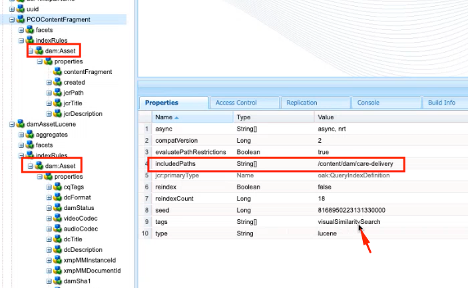
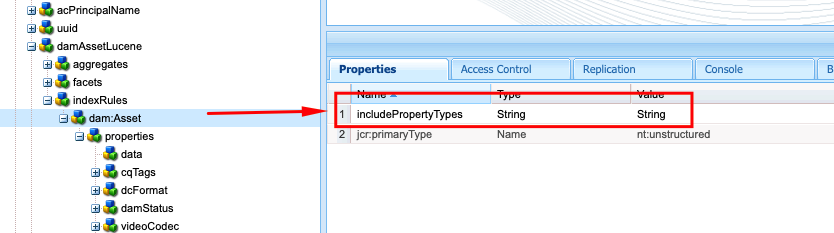

# Indexeren van beste praktijken in AEM

Leer meer over het indexeren van beste praktijken in Adobe Experience Manager (AEM). Apache [ Jackrabbit Oak ](https://jackrabbit.apache.org/oak/docs/query/query.html) bevoegdheden het inhoudsonderzoek in AEM en het volgende zijn zeer belangrijke punten:

- AEM biedt verschillende indexen om de zoek- en queryfunctionaliteit te ondersteunen, bijvoorbeeld `damAssetLucene` , `cqPageLucene` en meer.
- Alle indexdefinities worden opgeslagen in de gegevensopslagruimte onder het knooppunt `/oak:index` .
- AEM as a Cloud Service ondersteunt alleen Oak Lucene-indexen.
- De configuratie van de index zou in de AEM projectcodebase moeten worden beheerd en worden opgesteld gebruikend de pijpleidingen van Cloud Manager CI/CD.
- Als de veelvoudige indexen voor een bepaalde vraag beschikbaar zijn, wordt de **index met de laagste geschatte kosten gebruikt**.
- Als er geen index beschikbaar is voor een bepaalde query, wordt de inhoudsstructuur doorlopen om de overeenkomende inhoud te zoeken. De standaardlimiet via `org.apache.jackrabbit.oak.query.QueryEngineSettingsService` is echter slechts 10.000 knooppunten te doorlopen.
- De resultaten van een vraag worden **gefiltreerd minstens** om ervoor te zorgen dat de huidige gebruiker toegang heeft gelezen. Dit betekent dat de vraagresultaten kleiner kunnen zijn dan het aantal geïndexeerde knopen.
- Het opnieuw indexeren van de repository na wijzigingen in de indexdefinitie vergt tijd en hangt af van de grootte van de repository.

Om een efficiënte en correcte onderzoeksfunctionaliteit te hebben die niet de prestaties van de AEM instantie beïnvloedt, is het belangrijk om de het indexeren beste praktijken te begrijpen.

## Aangepaste versus OTB-index

Soms moet u aangepaste indexen maken ter ondersteuning van uw zoekvereisten. Volg echter onderstaande richtlijnen voordat u aangepaste indexen maakt:

- Begrijp de onderzoeksvereisten en controleer als de indexen OOTB de onderzoeksvereisten kunnen steunen. Het Hulpmiddel van de Prestaties van de Vraag van het gebruik **, beschikbaar bij [ lokale SDK ](http://localhost:4502/libs/granite/operations/content/diagnosistools/queryPerformance.html) en AEMCS via Developer Console of `https://author-pXXXX-eYYYY.adobeaemcloud.com/ui#/aem/libs/granite/operations/content/diagnosistools/queryPerformance.html?appId=aemshell`.**

- Bepaal een optimale vraag, gebruik [ optimaliserend vragen ](https://experienceleague.adobe.com/en/docs/experience-manager-cloud-service/content/operations/query-and-indexing-best-practices) stroomdiagram en [ JCR de Controle van de Vraag Sheet ](https://experienceleague.adobe.com/docs/experience-manager-65/assets/JCR_query_cheatsheet-v1.1.pdf?lang=en) voor verwijzing.

- Als de OOTB-indexen de zoekvereisten niet ondersteunen, hebt u twee opties. Nochtans, herzie de [ Uiteinden voor het Creëren van Efficiënte Indexen ](https://experienceleague.adobe.com/en/docs/experience-manager-65/content/implementing/deploying/practices/best-practices-for-queries-and-indexing)
   - Pas de OOTB-index aan: voorkeursoptie omdat u deze eenvoudig kunt onderhouden en upgraden.
   - Volledig aangepaste index: alleen als de bovenstaande optie niet werkt.

### De OOTB-index aanpassen

- In **AEMCS**, wanneer het aanpassen van het OTB indexgebruik **\ &lt;OOTBIndexName>-\ &lt;productVersion>-douane- \ &lt;customVersion>** noemende overeenkomst. Bijvoorbeeld `cqPageLucene-custom-1` of `damAssetLucene-8-custom-1` . Zo kunt u de aangepaste indexdefinitie samenvoegen wanneer de OTB-index wordt bijgewerkt. Zie [ Veranderingen in uit-van-de-Doos Indexen ](https://experienceleague.adobe.com/en/docs/experience-manager-cloud-service/content/operations/indexing) voor meer details.

- In **AEM 6.X**, werkt het bovengenoemde noemen _niet_, echter werkt eenvoudig de index OTB met noodzakelijke eigenschappen in de `indexRules` knoop bij.

- Kopieer altijd de nieuwste OOTB-indexdefinitie van de AEM-instantie met behulp van CRX DE Package Manager (/crx/packmgr/), wijzig de naam en voeg aanpassingen toe in het XML-bestand.

- Sla indexdefinitie op in het AEM project op `ui.apps/src/main/content/jcr_root/_oak_index` en implementeer deze met Cloud Manager CI/CD-leidingen. Zie [ het Opstellen van de Definities van de Index van de Douane ](https://experienceleague.adobe.com/en/docs/experience-manager-cloud-service/content/operations/indexing) voor meer details.

### Volledig aangepaste index

Het maken van een volledig aangepaste index moet de laatste optie zijn en alleen als de bovenstaande optie niet werkt.

- Gebruik **\&lt;prefix> wanneer u een volledig aangepaste index maakt.\&lt;customIndexName>-\&lt;version>-douane- \ &lt;customVersion>** noemende overeenkomst. Bijvoorbeeld `wknd.adventures-1-custom-1` . Zo voorkomt u naamconflicten. Hier is `wknd` het voorvoegsel en `adventures` de aangepaste indexnaam. Deze conventie is zowel van toepassing op AEM 6.X als op AEMCS en helpt bij de voorbereiding op toekomstige migratie naar AEMCS.

- AEMCS steunt slechts indexen van Lucene, zodat om voor toekomstige migratie aan AEMCS voor te bereiden, gebruik altijd indexen van Lucene. Zie [ Indexen van Lucene vs Indexen van het Bezit ](https://experienceleague.adobe.com/en/docs/experience-manager-65/content/implementing/deploying/practices/best-practices-for-queries-and-indexing) voor meer details.

- Maak geen aangepaste index op hetzelfde knooppunttype als de OOTB-index. Pas in plaats daarvan de OOTB-index aan met de benodigde eigenschappen in het knooppunt `indexRules` . Maak bijvoorbeeld geen aangepaste index voor het knooppunttype `dam:Asset` , maar pas de OOTB `damAssetLucene` -index aan. _het is een gemeenschappelijke worteloorzaak van prestaties en functionele kwesties_ geweest.

- Vermijd ook het toevoegen van meerdere knooppunttypen, bijvoorbeeld `cq:Page` en `cq:Tag` onder het knooppunt indexeringsregels (`indexRules` ). Maak in plaats daarvan afzonderlijke indexen voor elk type knooppunt.

- Zoals vermeld in bovenstaande sectie, sla indexdefinitie in het AEM project bij `ui.apps/src/main/content/jcr_root/_oak_index` op en stel het op gebruikend Cloud Manager CI/CD pijpleidingen. Zie [ het Opstellen van de Definities van de Index van de Douane ](https://experienceleague.adobe.com/en/docs/experience-manager-cloud-service/content/operations/indexing) voor meer details.

- De richtlijnen voor indexdefinitie zijn:
   - Het knooppunttype (`jcr:primaryType`) zou `oak:QueryIndexDefinition` moeten zijn
   - Het indextype (`type`) moet `lucene` zijn
   - De eigenschap async (`async`) moet `async,nrt` zijn
   - Gebruik `includedPaths` en vermijd de eigenschap `excludedPaths` . Stel `queryPaths` altijd in op dezelfde waarde als `includedPaths` value.
   - Gebruik de eigenschap `evaluatePathRestrictions` om de padbeperking in te stellen op `true` .
   - Gebruik de eigenschap `tags` om de index te labelen en geef tijdens het opvragen de waarde van deze tags op om de index te gebruiken. De algemene querysyntaxis is is `<query> option(index tag <tagName>)` .

  ```xml
  /oak:index/wknd.adventures-1-custom-1
      - jcr:primaryType = "oak:QueryIndexDefinition"
      - type = "lucene"
      - compatVersion = 2
      - async = ["async", "nrt"]
      - includedPaths = ["/content/wknd"]
      - queryPaths = ["/content/wknd"]
      - evaluatePathRestrictions = true
      - tags = ["customAdvSearch"]
  ...
  ```

### Voorbeelden

Om de beste praktijken te begrijpen, herzien enkele voorbeelden.

#### Onjuist gebruik van eigenschap tags

Onder de afbeelding ziet u een aangepaste en OOTB-indexdefinitie, waarbij de eigenschap `tags` wordt gemarkeerd. Beide indexen gebruiken dezelfde `visualSimilaritySearch` -waarde.


##### Analyse

Dit is een onjuist gebruik van de eigenschap `tags` op de aangepaste index. De Oak-query-engine selecteert de aangepaste index boven de OOTB-indexoorzaak van de laagste geschatte kosten.

De juiste manier is om de OOTB-index aan te passen en de benodigde eigenschappen toe te voegen in het knooppunt `indexRules` . Zie [ Aanpassen van de index OOTB ](#customize-the-ootb-index) voor meer details.

#### Index op het knooppunttype `dam:Asset`

Onder de afbeelding ziet u een aangepaste index voor het knooppunttype `dam:Asset` , waarbij de eigenschap `includedPaths` is ingesteld op een specifiek pad.



##### Analyse

Als u op Assets een uitgebreide zoekopdracht uitvoert, worden onjuiste resultaten geretourneerd, waardoor de aangepaste index lagere geschatte kosten heeft.

Maak geen aangepaste index voor het knooppunttype `dam:Asset` , maar pas de OOTB `damAssetLucene` -index aan met de benodigde eigenschappen in het knooppunt `indexRules` .

#### Meerdere knooppunttypen onder indexeringsregels

Onder de afbeelding ziet u een aangepaste index met meerdere knooppunttypen onder het knooppunt `indexRules` .


##### Analyse

Het wordt afgeraden meerdere knooppunttypen toe te voegen in één index, maar het is niet verstandig knooppunttypen in dezelfde index te indexeren als de knooppunttypen nauw verwant zijn, bijvoorbeeld `cq:Page` en `cq:PageContent` .

Een geldige oplossing is om de OOTB `cqPageLucene` - en `damAssetLucene` -index aan te passen en de benodigde eigenschappen toe te voegen onder het bestaande knooppunt `indexRules` .

#### Geen eigenschap `queryPaths`

Onder de afbeelding ziet u een aangepaste index (niet alleen volgens de naamgevingsconventie) zonder de eigenschap `queryPaths` .


##### Analyse

Stel `queryPaths` altijd in op dezelfde waarde als `includedPaths` value. Stel de eigenschap `evaluatePathRestrictions` ook in op `true` als u de padbeperking wilt afdwingen.

#### Vragen met indextag

Onder de afbeelding ziet u een aangepaste index met de eigenschap `tags` en hoe u deze kunt gebruiken tijdens het opvragen van informatie.


```
/jcr:root/content/dam//element(*,dam:Asset)[(jcr:content/@contentFragment = 'true' and jcr:contains(., '/content/sitebuilder/test/mysite/live/ja-jp/mypage'))]order by @jcr:created descending option (index tag assetPrefixNodeNameSearch)
```

##### Analyse

Toont aan hoe te om niet-tegenstrijdige en correcte `tags` bezitswaarde op de index te plaatsen en het te gebruiken terwijl het vragen. De algemene querysyntaxis is is `<query> option(index tag <tagName>)` . Zie ook {de Markering van de Index van de Optie van 0} Vraag ](https://jackrabbit.apache.org/oak/docs/query/query-engine.html#query-option-index-tag)[

#### Aangepaste index

Onder de afbeelding ziet u een aangepaste index met het knooppunt `suggestion` voor het bereiken van de geavanceerde zoekfunctionaliteit.


##### Analyse

Het is een geldig gebruiksgeval om een douaneindex voor de [ geavanceerde onderzoek ](https://jackrabbit.apache.org/oak/docs/query/lucene.html#advanced-search-features) functionaliteit tot stand te brengen. De indexnaam moet echter volgen op **\&lt;prefix>.\&lt;customIndexName>-\&lt;version>-douane- \ &lt;customVersion>** noemende overeenkomst.

## Optimalisatie indexeren door Apache Tika uit te schakelen

AEM gebruikt [ Tika van Apache ](https://tika.apache.org/) voor _het halen van meta-gegevens en tekstinhoud uit dossier_ types zoals PDF, Word, Excel, en meer. De geëxtraheerde inhoud wordt opgeslagen in de opslagplaats en geïndexeerd door de Oak Lucene-index.

Soms hebben gebruikers de mogelijkheid om te zoeken binnen de inhoud van een bestand/middel niet nodig. In dergelijke gevallen kunt u de indexprestaties verbeteren door de Apache-trojka uit te schakelen. De voordelen zijn:

- Snellere indexering
- Vermindering indexgrootte
- Minder hardwaregebruik

>[!CAUTION]
>
>Voordat u de Apache Tika uitschakelt, moet u ervoor zorgen dat de zoekvereisten niet de mogelijkheid vereisen om te zoeken binnen de inhoud van een element.


### Uitschakelen op mime-type

Ga als volgt te werk om Apache Tika op mime-type uit te schakelen:

- Voeg het knooppunt `tika` van `nt:unstructured` type toe onder de definitie van een aangepaste index of OOBT-index. In het volgende voorbeeld is het mime-type PDF uitgeschakeld voor OOTB `damAssetLucene` -index.

```xml
/oak:index/damAssetLucene
    - jcr:primaryType = "oak:QueryIndexDefinition"
    - type = "lucene"
    ...
    <tika jcr:primaryType="nt:unstructured">
        <config.xml/>
    </tika>
```

- Voeg de `config.xml` toe met de volgende details onder het knooppunt `tika` .

```xml
<properties>
  <parsers>
    <parser class="org.apache.tika.parser.EmptyParser">
      <mime>application/pdf</mime>
      <!-- Add more mime types to disable -->
  </parsers>
</properties>
```

- Om de opgeslagen index te verfrissen, plaats het `refresh` bezit aan `true` onder de knoop van de indexdefinitie, zie [ Eigenschappen van de Definitie van de Index ](https://jackrabbit.apache.org/oak/docs/query/lucene.html#index-definition:~:text=Defaults%20to%2010000-,refresh,-Optional%20boolean%20property) voor meer details.

In de volgende afbeelding ziet u de OOTB `damAssetLucene` -index met het `tika` node- en `config.xml` -bestand waarmee de PDF en andere mime-typen worden uitgeschakeld.


### Volledig uitschakelen

Volg onderstaande stappen om Apache Tika volledig uit te schakelen:

- Voeg de eigenschap `includePropertyTypes` toe op `/oak:index/<INDEX-NAME>/indexRules/<NODE-TYPE>` en stel de waarde in op `String` . In de onderste afbeelding wordt bijvoorbeeld de eigenschap `includePropertyTypes` toegevoegd voor het `dam:Asset` knooppunttype van de index OOBT `damAssetLucene` .



- Voeg `data` toe met eigenschappen onder het knooppunt `properties` , controleer of dit het eerste knooppunt boven de eigenschapdefinitie is. Zie bijvoorbeeld de onderstaande afbeelding:

```xml
/oak:index/<INDEX-NAME>/indexRules/<NODE-TYPE>/properties/data
    - jcr:primaryType = "nt:unstructured"
    - type = "String"
    - name = "jcr:data"
    - nodeScopeIndex = false
    - propertyIndex = false
    - analyze = false
```


- Wijzig de index van de bijgewerkte indexdefinitie door de eigenschap `reindex` in te stellen op `true` onder het indexdefinitieknooppunt.

## Nuttige gereedschappen

Laten we enkele gereedschappen bekijken die u kunnen helpen de indexen te definiëren, te analyseren en te optimaliseren.

### Gereedschap Index maken

Het ](https://oakutils.appspot.com/generate/index) hulpmiddelhulp van de Generator van de Definitie van de Index van 0} Oak **om de indexdefinitie** te produceren die op de inputvragen wordt gebaseerd. [ Het is een goed beginpunt om een aangepaste index te maken.

### Gereedschap Index analyseren

De ](https://oakutils.appspot.com/analyze/index) hulpmiddelhulp van de Analysator van de Definitie van de Index [ **om de indexdefinitie** te analyseren en aanbevelingen te verstrekken om de indexdefinitie te verbeteren.

### Gereedschap Query-prestaties

Het Hulpmiddel van de Prestaties van de Vraag OTB _beschikbaar bij [ lokale SDK ](http://localhost:4502/libs/granite/operations/content/diagnosistools/queryPerformance.html) en AEMCS via Developer Console of `https://author-pXXXX-eYYYY.adobeaemcloud.com/ui#/aem/libs/granite/operations/content/diagnosistools/queryPerformance.html?appId=aemshell` hulp **om de vraagprestaties**en [ JCR de Cheat Sheet van de Vraag te analyseren ](https://experienceleague.adobe.com/docs/experience-manager-65/assets/JCR_query_cheatsheet-v1.1.pdf?lang=en) om de optimale vraag te bepalen._

### Problemen met gereedschappen en tips oplossen

De meeste van de onderstaande opties zijn van toepassing voor AEM 6.X en lokale probleemoplossing.

- Indexbeheer beschikbaar op `http://host:port/libs/granite/operations/content/diagnosistools/indexManager.html` voor het ophalen van indexinformatie zoals type, laatst bijgewerkt, grootte.

- Gedetailleerde logboekregistratie van Oak-query&#39;s en aan indexering gerelateerde Java™-pakketten zoals `org.apache.jackrabbit.oak.plugins.index` , `org.apache.jackrabbit.oak.query` en `com.day.cq.search` via `http://host:port/system/console/slinglog` voor probleemoplossing.

- JMX MBean van _IndexStats_ type beschikbaar bij `http://host:port/system/console/jmx` voor het krijgen van indexinfo als status, vooruitgang, of statistieken met betrekking tot asynchrone indexering. Het verstrekt ook _FailingIndexStats_, als er geen resultaten hier zijn, betekent dat geen indexen corrupt zijn. AsyncIndexerService markeert om het even welke index die (configureerbaar) niet bijwerkt 30 minuten als corrupt en houdt op indexerend hen. Als een vraag niet verwachte resultaten geeft, is het nuttig voor ontwikkelaars om dit te controleren alvorens met het opnieuw indexeren te werk te gaan aangezien het opnieuw indexeren computerduur en tijdrovend is.

- JMX MBean van _LuceneIndex_ type beschikbaar bij `http://host:port/system/console/jmx` voor de statistieken van de Index van Lucene zoals grootte, aantal documenten per indexdefinitie.

- JMX MBean van _QueryState_ type beschikbaar bij `http://host:port/system/console/jmx` voor de Statistieken van de Vraag van Oak met inbegrip van langzame en populaire vragen met details zoals vraag, uitvoeringstijd.

## Aanvullende bronnen

Raadpleeg de volgende documentatie voor meer informatie:

- [ de Vragen van Oak en het Indexeren ](https://experienceleague.adobe.com/en/docs/experience-manager-65/content/implementing/deploying/deploying/queries-and-indexing)
- [ Vraag en het Indexeren Beste Praktijken ](https://experienceleague.adobe.com/en/docs/experience-manager-cloud-service/content/operations/query-and-indexing-best-practices)
- [ Beste praktijken voor Vragen en het Indexeren ](https://experienceleague.adobe.com/en/docs/experience-manager-65/content/implementing/deploying/practices/best-practices-for-queries-and-indexing)

