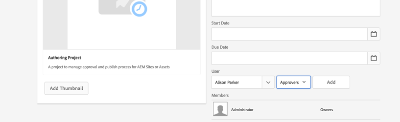

# Projecten ontwikkelen in AEM

Dit is een zelfstudie over ontwikkeling die laat zien hoe u zich kunt ontwikkelen voor [!DNL AEM Projects].  In deze zelfstudie maken we een aangepaste projectsjabloon die kan worden gebruikt om nieuwe projecten te maken binnen AEM voor het beheer van workflows en taken voor het schrijven van inhoud.

>[!VIDEO](https://video.tv.adobe.com/v/16904?quality=12&learn=on)

*Deze video geeft een korte demo van de voltooide workflow die in de onderstaande zelfstudie is gemaakt.*

## Inleiding {#introduction}

[[!DNL AEM Projects]](https://helpx.adobe.com/experience-manager/6-5/sites/authoring/using/projects.html) is een functie van AEM die is ontworpen om het eenvoudiger te maken om alle workflows en taken die aan het maken van inhoud zijn gekoppeld, te beheren en te groeperen als onderdeel van een AEM Sites- of middelenimplementatie.

AEM projecten worden geleverd met verschillende [OOTB-projectsjablonen](https://helpx.adobe.com/experience-manager/6-5/sites/authoring/using/projects.html#ProjectTemplates). Wanneer het creëren van een nieuw project, kunnen de auteurs van deze beschikbare malplaatjes kiezen. De grote AEM implementaties met unieke bedrijfsvereisten zullen de malplaatjes van het douaneProject willen tot stand brengen, die aan hun behoeften worden aangepast. Door een malplaatje van het douaneproject tot stand te brengen kunnen de ontwikkelaars het projectdashboard vormen, in douanewerkschema&#39;s, koppelen en extra bedrijfsrollen voor een project tot stand brengen. We zullen de structuur van een projectsjabloon bekijken en een voorbeeldsjabloon maken.


## Instellen

Deze zelfstudie doorloopt de code die nodig is om een aangepaste projectsjabloon te maken. U kunt de [bijgevoegd pakket](./assets/develop-aem-projects/projects-tasks-guide.ui.apps-0.0.1-SNAPSHOT.zip) naar een lokale omgeving om de zelfstudie te volgen. U kunt tot het volledige Maven project ook toegang hebben dat op wordt ontvangen [GitHub](https://github.com/Adobe-Marketing-Cloud/aem-guides/tree/feature/projects-tasks-guide).

* [Pakket met voltooide zelfstudies](./assets/develop-aem-projects/projects-tasks-guide.ui.apps-0.0.1-SNAPSHOT.zip)
* [Volledige gegevensopslagruimte voor code op GitHub](https://github.com/Adobe-Marketing-Cloud/aem-guides/tree/feature/projects-tasks-guide)

Deze zelfstudie gaat uit van enige basiskennis van [Ontwikkelingspraktijken AEM](https://helpx.adobe.com/experience-manager/6-5/sites/developing/using/the-basics.html) en enige kennis van [AEM Maven project instellen](https://helpx.adobe.com/experience-manager/6-5/sites/developing/using/ht-projects-maven.html). Alle vermelde code is bedoeld als referentie en mag alleen worden geïmplementeerd op een [instantie voor lokale ontwikkeling AEM](https://helpx.adobe.com/experience-manager/6-5/sites/deploying/using/deploy.html#GettingStarted).

## Structuur van een projectsjabloon

Projectsjablonen moeten onder broncontrole worden geplaatst en moeten onder de toepassingsmap onder /apps blijven. In het ideale geval moeten ze in een submap worden geplaatst met de naamgevingsconventie van **&#42;/projects/templates/**&lt;my-template>. Door na deze noemende overeenkomst te plaatsen zullen om het even welke nieuwe douanesjablonen automatisch beschikbaar worden aan auteurs wanneer het creëren van een project. De configuratie van beschikbare projectsjablonen is ingesteld op: **/content/projects/jcr:content** knoop door **cq:allowedTemplates** eigenschap. Dit is standaard een reguliere expressie: **/(apps|libs)/.&#42;/projects/templates/.&#42;**

De wortelknoop van een Malplaatje van het Project zal hebben **jcr:primaryType** van **cq:sjabloon**. Onder het basisknooppunt van er zijn 3 knooppunten: **gadgets**, **rollen**, en **workflows**. Deze knooppunten zijn allemaal **nt:ongestructureerd**. Onder het hoofdknooppunt kan ook een bestand miniatuur.png staan dat wordt weergegeven wanneer u de sjabloon selecteert in de wizard Project maken.

De volledige nodestructuur:

```shell
/apps/<my-app>
    + projects (nt:folder)
         + templates (nt:folder)
              + <project-template-root> (cq:Template)
                   + gadgets (nt:unstructured)
                   + roles (nt:unstructured)
                   + workflows (nt:unstructured)
```

### Hoofdmap projectsjabloon

De wortelknoop van het projectmalplaatje is van type **cq:sjabloon**. Op dit knooppunt kunt u eigenschappen configureren **jcr:titel** en **jcr:beschrijving** dat wordt getoond in de Create Tovenaar van het Project. Er is ook een eigenschap die **wizard** dat naar een formulier verwijst dat de eigenschappen van het project vult. De standaardwaarde van: **/libs/cq/core/content/projects/wizard/steps/defaultproject.html** zou in de meeste gevallen fijn moeten werken, aangezien het de gebruiker toestaat om de basiseigenschappen van het Project te bevolken en groepsleden toe te voegen.

*&#42;Merk op de Create Tovenaar van het Project niet Sling POST servlet gebruikt. In plaats daarvan worden waarden naar een aangepaste servlet gepost:**com.adobe.cq.projects.impl.servlet.ProjectServlet**. Hiermee moet rekening worden gehouden bij het toevoegen van aangepaste velden.*

Een voorbeeld van een douanetovenaar kan voor het Malplaatje van het Project van de Vertaling worden gevonden: **/libs/cq/core/content/projects/wizard/translationproject/default project**.

### Gadgets {#gadgets}

Er zijn geen extra eigenschappen op deze knoop maar de kinderen van de gadget knoopcontrole die de Tegels van het Project het dashboard van het Project bevolken wanneer een nieuw Project wordt gecreeerd. [Projectblokken](https://helpx.adobe.com/experience-manager/6-5/sites/authoring/using/projects.html#ProjectTiles) (ook wel gadgets of pods genoemd) zijn eenvoudige kaarten die de werkplek van een project vullen. Een volledige lijst met voetbtegels vindt u onder: **/libs/cq/gui/components/projects/admin/pod. **Projecteigenaars kunnen altijd tegels toevoegen/verwijderen nadat een project is gemaakt.

### Rollen {#roles}

Er zijn 3 [standaardrollen](https://helpx.adobe.com/experience-manager/6-5/sites/authoring/using/projects.html#UserRolesinaProject) voor elk project: **Waarnemers**, **Editors**, en **Eigenaars**. Door kindknopen onder de rolknoop toe te voegen kunt u extra bedrijfsspecifieke Rollen van het Project voor het malplaatje toevoegen. U kunt deze rollen aan specifieke werkschema&#39;s dan verbinden verbonden aan het project.

### Workflows {#workflows}

Één de meest verleidelijke redenen voor het creëren van een Malplaatje van het douaneproject is dat het u de capaciteit geeft om de beschikbare werkschema&#39;s voor gebruik met het project te vormen. Dit kan OTB-workflows of aangepaste workflows zijn. Onder de **workflows** knooppunt daar moet een **modellen** node (ook `nt:unstructured`) en onderliggende knooppunten hieronder geeft u de beschikbare workflowmodellen op. De eigenschap **modelId **wijst naar het workflowmodel onder /etc/workflow en de eigenschap **wizard** verwijst naar het dialoogvenster dat wordt gebruikt bij het starten van de workflow. Een groot voordeel van Projecten is de capaciteit om een douanedialoog (tovenaar) toe te voegen om bedrijfsspecifieke meta-gegevens bij het begin van het werkschema te vangen die verdere acties binnen het werkschema kunnen drijven.

```shell
<projects-template-root> (cq:Template)
    + workflows (nt:unstructured)
         + models (nt:unstructured)
              + <workflow-model> (nt:unstructured)
                   - modelId = points to the workflow model
                   - wizard = dialog used to start the workflow
```

## Een projectsjabloon maken {#creating-project-template}

Aangezien wij hoofdzakelijk kopiëren/knopen vormen zullen wij CRXDE Lite gebruiken. In uw lokale AEM openen [CRXDE Lite](http://localhost:4502/crx/de/index.jsp).

1. Begin door een nieuwe omslag onder te creëren `/apps/&lt;your-app-folder&gt;` benoemd `projects`. Een andere map maken onder de naam `templates`.

   ```shell
   /apps/aem-guides/projects-tasks/
                       + projects (nt:folder)
                                + templates (nt:folder)
   ```

1. Om dingen gemakkelijker te maken zullen wij onze douanemalplaatje van het bestaande Eenvoudige malplaatje van het Project beginnen.

   1. Het knooppunt kopiëren en plakken **/libs/cq/core/content/projects/templates/default** onder de *sjablonen* map gemaakt in Stap 1.

   ```shell
   /apps/aem-guides/projects-tasks/
                + templates (nt:folder)
                     + default (cq:Template)
   ```

1. U moet nu een pad hebben zoals **/apps/aem-guides/projects-tasks/projects/templates/authoring-project**.

   1. Bewerk de **jcr:titel** en **jcr:beschrijving** eigenschappen van de auteur-project knoop aan de waarden van de douanetitel en van de beschrijving.

      1. Laat de **wizard** eigenschap die naar de standaardprojecteigenschappen verwijst.

   ```shell
   /apps/aem-guides/projects-tasks/projects/
            + templates (nt:folder)
                 + authoring-project (cq:Template)
                      - jcr:title = "Authoring Project"
                      - jcr:description = "A project to manage approval and publish process for AEM Sites or Assets"
                      - wizard = "/libs/cq/core/content/projects/wizard/steps/defaultproject.html"
   ```

1. Voor dit projectmalplaatje willen wij gebruik maken van Taken.
   1. Een nieuwe toevoegen **nt:ongestructureerd** knooppunt onder authoring-project/gadgets **taken**.
   1. Tekenreekseigenschappen toevoegen aan het taakknooppunt voor **cardWeight** = &quot;100&quot;, **jcr:titel**=&quot;Taken&quot;, en **sling:resourceType**=&quot;cq/gui/components/projects/admin/pod/taskpod&quot;.

   Nu de [Taken](https://experienceleague.adobe.com/docs/#Tasks) wordt standaard weergegeven wanneer een nieuw project wordt gemaakt.

   ```shell
   ../projects/templates/authoring-project
       + gadgets (nt:unstructured)
            + team (nt:unstructured)
            + asset (nt:unstructured)
            + work (nt:unstructured)
            + experiences (nt:unstructured)
            + projectinfo (nt:unstructured)
            ..
            + tasks (nt:unstructured)
                 - cardWeight = "100"
                 - jcr:title = "Tasks"
                 - sling:resourceType = "cq/gui/components/projects/admin/pod/taskpod"
   ```

1. We voegen een aangepaste rol fiatteur toe aan ons projectsjabloon.

   1. Onder het projectmalplaatje (creatie-project) voegt de knoop een nieuw toe **nt:ongestructureerd** knooppunt met label **rollen**.
   1. Nog een toevoegen **nt:ongestructureerd** knoop geëtiketteerde fiatvers als kind van de rolknoop.
   1. Tekenreeks-eigenschappen toevoegen **jcr:titel** = &quot;**Fiatteurs**&quot;, **rolecglas** =&quot;**eigenaar**&quot;, **rolid**=&quot;**fiatteurs**&quot;.
      1. De naam van het knooppunt fiatteurs en jcr:title en roleid kunnen elke tekenreekswaarde zijn (zolang roleid uniek is).
      1. **rolecglas** beheerst de toestemmingen die voor die rol worden toegepast die op worden gebaseerd [3 OOTB-rollen](https://docs.adobe.com/docs/en/aem/6-3/author/projects.html#User%20Roles%20in%20a%20Project): **eigenaar**, **editor**, en **waarnemer**.
      1. In het algemeen geldt dat als de aangepaste rol meer een leidinggevende rol is, de roleclas **eigenaar;** als het een specifiekere ontwerprol is, zoals Fotograaf of Designer, **editor** roleclas moet voldoende zijn. Het grote verschil tussen **eigenaar** en **editor** is dat de projecteigenaars de projecteigenschappen kunnen bijwerken en nieuwe gebruikers aan het project toevoegen.

   ```shell
   ../projects/templates/authoring-project
       + gadgets (nt:unstructured)
       + roles (nt:unstructured)
           + approvers (nt:unstructured)
                - jcr:title = "Approvers"
                - roleclass = "owner"
                - roleid = "approver"
   ```

1. Door het Eenvoudige malplaatje van het Project te kopiëren zult u 4 gevormde werkschema&#39;s OOTB krijgen. Elk knooppunt onder workflows/modellen verwijst naar een specifieke workflow en een wizard voor begindialoogvenster voor die workflow. Later in deze zelfstudie maken we een aangepaste workflow voor dit project. Verwijder voorlopig de knooppunten onder workflow(en):

   ```shell
   ../projects/templates/authoring-project
       + gadgets (nt:unstructured)
       + roles (nt:unstructured)
       + workflows (nt:unstructured)
            + models (nt:unstructured)
               - (remove ootb models)
   ```

1. Om het voor inhoudsauteurs gemakkelijk te maken om het Malplaatje van het Project te identificeren kunt u een douaneminiatuur toevoegen. De aanbevolen grootte is 319x319 pixels.
   1. Maak in CRXDE Lite een nieuw bestand op hetzelfde niveau als gadgets, rollen en workflowknooppunten met de naam **miniatuur.png**.
   1. Opslaan en vervolgens naar het dialoogvenster `jcr:content` en dubbelklik op de knop `jcr:data` eigenschap (klik niet op &#39;view&#39;).
      1. Hiermee wordt u gevraagd een bewerking uit te voeren `jcr:data` en kunt u een aangepaste miniatuur uploaden.

   ```shell
   ../projects/templates/authoring-project
       + gadgets (nt:unstructured)
       + roles (nt:unstructured)
       + workflows (nt:unstructured)
       + thumbnail.png (nt:file)
   ```

Voltooide XML-representatie van het projectsjabloon:

```xml
<?xml version="1.0" encoding="UTF-8"?>
<jcr:root xmlns:sling="http://sling.apache.org/jcr/sling/1.0" xmlns:cq="http://www.day.com/jcr/cq/1.0" xmlns:jcr="http://www.jcp.org/jcr/1.0" xmlns:nt="http://www.jcp.org/jcr/nt/1.0"
    jcr:description="A project to manage approval and publish process for AEM Sites or Assets"
    jcr:primaryType="cq:Template"
    jcr:title="Authoring Project"
    ranking="{Long}1"
    wizard="/libs/cq/core/content/projects/wizard/steps/defaultproject.html">
    <jcr:content
        jcr:primaryType="nt:unstructured"
        detailsHref="/projects/details.html"/>
    <gadgets jcr:primaryType="nt:unstructured">
        <team
            jcr:primaryType="nt:unstructured"
            jcr:title="Team"
            sling:resourceType="cq/gui/components/projects/admin/pod/teampod"
            cardWeight="60"/>
        <tasks
            jcr:primaryType="nt:unstructured"
            jcr:title="Tasks"
            sling:resourceType="cq/gui/components/projects/admin/pod/taskpod"
            cardWeight="100"/>
        <work
            jcr:primaryType="nt:unstructured"
            jcr:title="Workflows"
            sling:resourceType="cq/gui/components/projects/admin/pod/workpod"
            cardWeight="80"/>
        <experiences
            jcr:primaryType="nt:unstructured"
            jcr:title="Experiences"
            sling:resourceType="cq/gui/components/projects/admin/pod/channelpod"
            cardWeight="90"/>
        <projectinfo
            jcr:primaryType="nt:unstructured"
            jcr:title="Project Info"
            sling:resourceType="cq/gui/components/projects/admin/pod/projectinfopod"
            cardWeight="100"/>
    </gadgets>
    <roles jcr:primaryType="nt:unstructured">
        <approvers
            jcr:primaryType="nt:unstructured"
            jcr:title="Approvers"
            roleclass="owner"
            roleid="approvers"/>
    </roles>
    <workflows
        jcr:primaryType="nt:unstructured"
        tags="[]">
        <models jcr:primaryType="nt:unstructured">
        </models>
    </workflows>
</jcr:root>
```

## Het testen van het malplaatje van het douaneproject

Nu kunnen wij ons Malplaatje van het Project testen door een nieuw Project te creëren.

1. U zou het douanemalplaatje als één van de opties voor projectverwezenlijking moeten zien.

   

1. Na het selecteren van het douanemalplaatje klik &quot;daarna&quot;en merk op dat wanneer het bevolken van de Leden van het Project u hen als rol kunt toevoegen Approver.

   

1. Klik op Maken om het maken van het project te voltooien op basis van de aangepaste sjabloon. U zult op het dashboard van het Project opmerken dat de Tegel van Taken en de andere tegels die onder gadgets worden gevormd automatisch verschijnen.

   


## Waarom workflow?

Traditioneel AEM workflows die rond een goedkeuringsproces worden gecentreerd, hebben workflowstappen van deelnemers gebruikt. AEM Inbox omvat detail rond Taken en Werkschema en verbeterde integratie met AEM Projecten. Deze eigenschappen maken het gebruiken van de het processtappen van de Taak van Projecten creëren een aantrekkelijkere optie.

### Waarom taken?

Het gebruiken van een Stap van de Aanmaak van de Taak over de traditionele stappen van de Deelnemer biedt een paar voordelen aan:

* **Begindatum en Vervaldatum** - maakt het voor auteurs gemakkelijk om hun tijd te beheren, maakt de nieuwe functie van het Kalender gebruik van deze data.
* **Prioriteit** - dankzij de ingebouwde prioriteiten Low, Normal en High kunnen auteurs prioriteiten stellen voor het werk
* **Verbonden opmerkingen** - als auteurs aan een taak werken, kunnen zij commentaren verlaten die samenwerking verhogen
* **Zichtbaarheid** - De tegels van de taak en de meningen met Projecten staan managers toe om te bekijken hoe de tijd wordt besteed
* **Projectintegratie** - Taken zijn al geïntegreerd met projectrollen en dashboards

Als de stappen van de Deelnemer, kunnen de Taken dynamisch worden toegewezen en worden verpletterd. Taakmetagegevens zoals Titel, Prioriteit kunnen ook dynamisch worden ingesteld op basis van eerdere acties, zoals in de volgende zelfstudie.

Terwijl de Taken sommige voordelen over de Stappen van de Deelnemer hebben zij extra overheadkosten dragen, en zijn niet zo nuttig buiten een Project. Bovendien moet al dynamisch gedrag van Taken worden gecodeerd gebruikend manuscripten ecma die zijn eigen beperkingen hebben.

## Voorschriften voor het gebruik van hoofdletters en kleine letters {#goals-tutorial}


In het bovenstaande diagram worden de vereisten op hoog niveau voor onze workflow voor monstergoedkeuring beschreven.

De eerste stap bestaat uit het maken van een taak om het bewerken van een stuk inhoud te voltooien. De aanvrager van de workflow kan de eerste taak kiezen.

Zodra de eerste taak volledig is zal toegewezen drie opties hebben om het werkschema te verpletteren:

**Normaal ** - het normale verpletteren leidt tot een taak die aan de groep van de fiatteur van het Project wordt toegewezen om te herzien en goed te keuren. De prioriteit van de taak is Normaal en de vervaldatum is vijf dagen vanaf het tijdstip waarop deze wordt gemaakt.

**Rush** - het snel verpletteren leidt ook tot een taak die aan de groep van de Fiatteur van het Project wordt toegewezen. Prioriteit van de taak is Hoog en de vervaldatum is slechts 1 dag.

**Weglaten** - in deze voorbeeldworkflow kan de eerste deelnemer de goedkeuringsgroep omzeilen. (ja dit zou het doel van een &quot;Goedkeuring&quot;werkschema kunnen verslaan maar het staat ons toe om extra verpletterende mogelijkheden te illustreren)

De Approver Groep kan de inhoud goedkeuren of het terugsturen naar de aanvankelijke toegewezen voor herwerk. Als een nieuwe taak wordt teruggestuurd voor een nieuwe taak, wordt er een nieuwe taak gemaakt met het label &#39;Terugsturen voor opnieuw werken&#39;.

In de laatste stap van de workflow wordt gebruikgemaakt van de processtap Pagina/element activeren en wordt de lading gerepliceerd.

## Het workflowmodel maken

1. Navigeer in het menu AEM Start naar Extra -> Workflow -> Modellen. Klik op &#39;Maken&#39; in de rechterbovenhoek om een nieuw workflowmodel te maken.

   Geef het nieuwe model een titel: &quot;Workflow voor inhoudsgoedkeuring&quot; en een URL-naam: &quot;workflow voor inhoudsgoedkeuring&quot;.

   

   Voor meer informatie over [hier gelezen workflows maken](https://helpx.adobe.com/experience-manager/6-5/sites/developing/using/workflows-models.html).

1. Aangepaste workflows kunt u het beste groeperen in een eigen map onder /etc/workflow/modellen. Maak in CRXDE Lite een nieuwe **&#39;nt:folder&#39;** onder /etc/workflow/modellen genoemd **&quot;amplijnen&quot;**. Door een submap toe te voegen, zorgt u ervoor dat aangepaste workflows niet per ongeluk worden overschreven tijdens upgrades of Service Pack-installaties.

   &#42;Houd er rekening mee dat het belangrijk is om de map of aangepaste workflows nooit onder submappen van het pad te plaatsen, zoals /etc/workflow/models/dam of /etc/workflow/models/projects, omdat de volledige submap ook kan worden overschreven door upgrades of servicepacks.

   

   Locatie van het workflowmodel in 6.3

   >[!NOTE]
   >
   >Als AEM 6.4+ wordt gebruikt, is de locatie van de workflow gewijzigd. Zie [hier voor meer informatie .](https://helpx.adobe.com/experience-manager/6-5/sites/developing/using/workflows-best-practices.html#LocationsWorkflowModels)

   Als AEM 6.4+ wordt gebruikt, wordt het workflowmodel onder `/conf/global/settings/workflow/models`. Herhaal bovenstaande stappen met de /conf folder en voeg een subfolder genoemd toe `aem-guides` en verplaatst u `content-approval-workflow` eronder.

   
Locatie van workflowmodel in 6.4+

1. De introductie in AEM 6.3 is de mogelijkheid werkstroomfasen toe te voegen aan een bepaalde werkstroom. De fasen worden aan de gebruiker weergegeven vanuit het Postvak In op het tabblad Workflowinfo. Het toont de gebruiker het huidige werkgebied in het werkschema evenals de stadia voorafgaand aan en na het.

   Als u de fasen wilt configureren, opent u het dialoogvenster Pagina-eigenschappen vanuit de Sidekick. Het vierde tabblad heet &quot;Stages&quot;. Voeg de volgende waarden toe om de drie fasen van deze workflow te configureren:

   1. Inhoud bewerken
   1. Goedkeuring
   1. Publiceren

   

   Configureer de werkstroomfasen in het dialoogvenster Pagina-eigenschappen.

   

   De werkstroomvoortgangsbalk zoals deze wordt weergegeven in het AEM Inbox.

   U kunt desgewenst een **Afbeelding** naar de Pagina-eigenschappen die wordt gebruikt als de workflowminiatuur wanneer gebruikers deze selecteren. Afbeeldingsafmetingen moeten 319x319 pixels zijn. Een **Beschrijving** naar Pagina-eigenschappen worden ook weergegeven wanneer een gebruiker de workflow selecteert.

1. Het workflowproces Projecttaak maken is ontworpen om een taak te maken als een stap in de workflow. Pas na het voltooien van de taak gaat de workflow verder. Een krachtig aspect van de stap van de Taak van het Project creëren is dat het werkschema meta-gegevens waarden kan lezen en die gebruiken om de taak dynamisch tot stand te brengen.

   Verwijder eerst de Stap van de Deelnemer die standaard wordt gemaakt. Van de Sidekick in het componentenmenu breid uit **Projecten** subkop en slepen en neerzetten **&quot;Projecttaak maken&quot;** op het model.

   Dubbelklik op de stap Projecttaak maken om het workflowdialoogvenster te openen. Configureer de volgende eigenschappen:

   Dit tabblad wordt veel gebruikt voor alle stappen in het workflowproces en we stellen de Titel en Beschrijving in (deze zijn niet zichtbaar voor de eindgebruiker). Het belangrijke bezit dat wij zullen plaatsen is het Werkschemastadium aan **Inhoud bewerken** in de keuzelijst.

   ```shell
   Common Tab
   -----------------
       Title = "Start Task Creation"
       Description = "This the first task in the Workflow"
       Workflow Stage = "Edit Content"
   ```

   Het workflowproces Projecttaak maken is ontworpen om een taak te maken als een stap in de workflow. Met het tabblad Taak kunnen we alle waarden van de taak instellen. In ons geval willen we dat de ontvanger dynamisch is, dus laten we hem leeg. De overige eigenschapswaarden:

   ```shell
   Task Tab
   -----------------
       Name* = "Edit Content"
       Task Priority = "Medium"
       Description = "Edit the content and finalize for approval. Once finished submit for approval."
       Due In - Days = "2"
   ```

   Het verpletterende lusje is een facultatieve dialoog die beschikbare acties voor de gebruiker kan specificeren die de taak voltooit. Deze handelingen zijn alleen tekenreekswaarden en worden opgeslagen in de metagegevens van de workflow. Deze waarden kunnen door manuscripten en/of processtappen later in het werkschema worden gelezen om de werkschema dynamisch &quot;te leiden&quot;. Op basis van de [workflowdoelstellingen](#goals-tutorial) Er worden drie acties aan dit tabblad toegevoegd:

   ```shell
   Routing Tab
   -----------------
       Actions =
           "Normal Approval"
           "Rush Approval"
           "Bypass Approval"
   ```

   Dit lusje staat ons toe om een pre-Create Manuscript van de Taak te vormen waar wij kunnen programmatically diverse waarden van de Taak beslissen alvorens het wordt gecreeerd. U kunt het script verwijzen naar een extern bestand of een kort script rechtstreeks in het dialoogvenster insluiten. In ons geval wijzen we het script voor het maken van taken naar een extern bestand. In Stap 5 zullen wij dat manuscript tot stand brengen.

   ```shell
   Advanced Settings Tab
   -----------------
      Pre-Create Task Script = "/apps/aem-guides/projects/scripts/start-task-config.ecma"
   ```

1. In de vorige stap hebben we verwezen naar een Pre-Create Taakscript. Wij zullen nu dat manuscript tot stand brengen waarin wij de Ontvanger van de Taak zullen plaatsen die op de waarde van een werkschemagegeven wordt gebaseerd &quot;**cessionaris**&quot;. De **&quot;ontvanger&quot;** waarde wordt ingesteld wanneer de workflow wordt uitgeschakeld. We zullen ook de metagegevens van de workflow lezen om de prioriteit van de taak dynamisch te kiezen door het lezen van de opdracht &quot;**taskPriority&quot;** De waarde van de metagegevens van de workflow en de **&quot;taskdueDate&quot; **om dynamisch in te stellen wanneer de eerste taak moet worden uitgevoerd.

   Voor organisatorische doeleinden hebben we onder onze toepassingsmap een map gemaakt voor al onze projectgerelateerde scripts: **/apps/adobe-guides/projects-tasks/projects/scripts**. Een nieuw bestand maken onder de naam van deze map **&quot;start-task-config.ecma&quot;**. &#42;De nota zorgt ervoor de weg aan uw begin-taak-config.ecma- dossier de weg aanpast die op het Geavanceerde Lusje van Montages in Stap 4 wordt geplaatst.

   Voeg het volgende toe als de inhoud van het bestand:

   ```
   // start-task-config.ecma
   // Populate the task using values stored as workflow metadata originally posted by the start workflow wizard
   
   // set the assignee based on start workflow wizard
   var assignee = workflowData.getMetaDataMap().get("assignee", Packages.java.lang.String);
   task.setCurrentAssignee(assignee);
   
   //Set the due date for the initial task based on start workflow wizard
   var dueDate = workflowData.getMetaDataMap().get("taskDueDate", Packages.java.util.Date);
   if (dueDate != null) {
       task.setProperty("taskDueDate", dueDate);
   }
   
   //Set the priority based on start workflow wizard
   var taskPriority = workflowData.getMetaDataMap().get("taskPriority", "Medium");
   task.setProperty("taskPriority", taskPriority);
   ```

1. Navigeer terug naar de workflow voor goedkeuring van inhoud. Sleep de **OF Splitsen** component (gevonden in de Sidekick onder de categorie &#39;Werkstroom&#39;) onder de categorie **Taak starten** Stap. Selecteer in het dialoogvenster Algemeen het keuzerondje voor 3 vertakkingen. De OR Split leest de metagegevenswaarde van de workflow **&quot;lastTaskAction&quot;** om de route van het werkschema te bepalen. De **&quot;lastTaskAction&quot;** het bezit wordt geplaatst aan één van de waarden van het Verpletterende Lusje dat in Stap 4 wordt gevormd. Vul voor elk tabblad Vertakking de opties in **Script** tekstgebied met de volgende waarden:

   ```
   function check() {
   var lastAction = workflowData.getMetaDataMap().get("lastTaskAction","");
   
   if(lastAction == "Normal Approval") {
       return true;
   }
   
   return false;
   }
   ```

   ```
   function check() {
   var lastAction = workflowData.getMetaDataMap().get("lastTaskAction","");
   
   if(lastAction == "Rush Approval") {
       return true;
   }
   
   return false;
   }
   ```

   ```
   function check() {
   var lastAction = workflowData.getMetaDataMap().get("lastTaskAction","");
   
   if(lastAction == "Bypass Approval") {
       return true;
   }
   
   return false;
   }
   ```

   &#42;Nota wij doen een directe gelijke van het Koord om de route te bepalen zodat is het belangrijk dat de waarden die in de manuscripten van de Tak worden geplaatst de waarden van de Route aanpassen die in Stap 4 worden geplaatst.

1. Sleep een andere &quot;**Projecttaak maken**&quot; ga op het model aan uiterst links (Tak 1) onder OF spleet. Vul het dialoogvenster met de volgende eigenschappen in:

   ```
   Common Tab
   -----------------
       Title = "Approval Task Creation"
       Description = "Create a an approval task for Project Approvers. Priority is Medium."
       Workflow Stage = "Approval"
   
   Task Tab
   ------------
       Name* = "Approve Content for Publish"
       Task Priority = "Medium"
       Description = "Approve this content for publication."
       Days = "5"
   
   Routing Tab - Actions
   ----------------------------
       "Approve and Publish"
       "Send Back for Revision"
   ```

   Aangezien dit de Normale route van de Goedkeuring is, wordt de prioriteit van de taak geplaatst aan Middel. Daarnaast geven we de groep fiatteurs vijf dagen om de taak te voltooien. De toegewezen persoon wordt leeg gelaten op het tabblad Taak aangezien wij dit dynamisch zullen toewijzen op het tabblad Geavanceerde instellingen. We geven de groep fiatteurs twee mogelijke routes bij het uitvoeren van deze taak: **&quot;Goedkeuren en publiceren&quot;** als zij de inhoud goedkeuren en deze kan worden gepubliceerd en **&quot;Terug voor revisie verzenden&quot;** als er problemen zijn die de oorspronkelijke editor moet verhelpen. De fiatteur kan commentaren verlaten die de originele redacteur zal zien of is het werkschema teruggekeerd aan hem/haar.

Eerder in deze zelfstudie hebben we een projectsjabloon gemaakt dat een rol van fiatteurs bevatte. Telkens als een nieuw Project van dit Malplaatje wordt gecreeerd wordt een project-specifieke Groep gecreeerd voor de rol Approvers. Enkel als een Stap van de Deelnemer kan een Taak slechts aan een Gebruiker of een Groep worden toegewezen. We willen deze taak toewijzen aan de projectgroep die overeenkomt met de groep fiatteurs. Alle werkschema&#39;s die van binnen een Project worden gelanceerd zullen meta-gegevens hebben die de Rollen van het Project aan de specifieke groep van het Project in kaart brengen.

De volgende code kopiëren en plakken in de **Script** tekstgebied van het tabblad **Geavanceerde instellingen **tab. Deze code zal de werkschemameta-gegevens lezen en zal de taak aan de groep Approvers van het Project toewijzen. Als het niet de waarde van de fiatversgroep kan vinden zal het terug vallen om de taak aan de groep van Beheerders toe te wijzen.

```
var projectApproverGrp = workflowData.getMetaDataMap().get("project.group.approvers","administrators");

task.setCurrentAssignee(projectApproverGrp);
```

1. Sleep een andere &quot;**Projecttaak maken**&quot; stap op aan het model aan de middentak (Tak 2) onder OF spleet. Vul het dialoogvenster met de volgende eigenschappen in:

   ```
   Common Tab
   -----------------
       Title = "Rush Approval Task Creation"
       Description = "Create a an approval task for Project Approvers. Priority is High."
       Workflow Stage = "Approval"
   
   Task Tab
   ------------
       Name* = "Rush Approve Content for Publish"
       Task Priority = "High"
       Description = "Rush approve this content for publication."
       Days = "1"
   
   Routing Tab - Actions
   ----------------------------
       "Approve and Publish"
       "Send Back for Revision"
   ```

   Aangezien dit de route van de Goedkeuring van Rusland is wordt de prioriteit van de taak geplaatst aan Hoog. Daarnaast geven we de groep fiatteurs slechts één dag om de taak te voltooien. De toegewezen persoon wordt leeg gelaten op het tabblad Taak aangezien wij dit dynamisch zullen toewijzen op het tabblad Geavanceerde instellingen.

   Wij kunnen het zelfde manuscriptfragment zoals in Stap 7 opnieuw gebruiken om te bevolken **Script** tekstgebied op de tab** Geavanceerde instellingen **. Kopiëren en de onderstaande code plakken:

   ```
   var projectApproverGrp = workflowData.getMetaDataMap().get("project.group.approvers","administrators");
   
   task.setCurrentAssignee(projectApproverGrp);
   ```

1. Sleep een component** Geen bewerking** naar de vertakking uiterst rechts (vertakking 3). De component Geen bewerking voert geen handeling uit en wordt onmiddellijk uitgevoerd, omdat de oorspronkelijke editor de goedkeuringsstap wil omzeilen. Technisch gezien konden wij deze Tak zonder enige werkschemastappen verlaten, maar als beste praktijken zullen wij een Geen stap van de Verrichting toevoegen. Dit maakt het aan andere ontwikkelaars duidelijk wat het doel van Tak 3 is.

   Dubbelklik op de workflowstap en configureer de titel en beschrijving:

   ```
   Common Tab
   -----------------
       Title = "Bypass Approval"
       Description = "Placeholder step to indicate that the original editor decided to bypass the approver group."
   ```

   

   Het model van het Werkschema zou als dit moeten kijken nadat alle drie takken in OF verdeeld zijn gevormd.

1. Aangezien de groep fiatteurs de optie heeft de werkstroom voor verdere revisies terug te sturen naar de oorspronkelijke editor, vertrouwen we op de **Ga naar** stap om de laatste uitgevoerde actie te lezen en de werkstroom aan het begin te leiden of het te laten verdergaan.

   Sleep en zet de component Goto Step (gevonden in de Sidekick onder Workflow) onder OF spleet waar deze opnieuw wordt samengevoegd. Dubbelklik op de volgende eigenschappen en configureer deze in het dialoogvenster:

   ```
   Common Tab
   ----------------
       Title = "Goto Step"
       Description = "Based on the Approver groups action route the workflow to the beginning or continue and publish the payload."
   
   Process Tab
   ---------------
       The step to go to. = "Start Task Creation"
   ```

   Het laatste stuk dat wij zullen vormen is het Manuscript als deel van Goto processtap. De scriptwaarde kan worden ingesloten via het dialoogvenster of worden geconfigureerd om te wijzen naar een extern bestand. Het Goto-script moet een **function check()** en retourneert true als de workflow naar de opgegeven stap moet gaan. Als er false worden geretourneerd, gaat de workflow verder.

   Als de groep met fiatteurs de optie **&quot;Terug voor revisie verzenden&quot;** actie (gevormd in Stap 7 en 8) dan willen wij het werkschema aan terug **&quot;Taak maken starten&quot;** stap.

   Voeg op het tabblad Proces het volgende fragment toe aan het tekstgebied Script:

   ```
   function check() {
   var lastAction = workflowData.getMetaDataMap().get("lastTaskAction","");
   
   if(lastAction == "Send Back for Revision") {
       return true;
   }
   
   return false;
   }
   ```

1. Voor het publiceren van de lading gebruiken wij de knoop **Pagina/element activeren** Processtap. Deze processtap vereist weinig configuratie en zal de nuttige lading van het werkschema aan de replicatierij voor activering toevoegen. Wij zullen de stap onder de stap van de Goto toevoegen en op deze manier kan het slechts worden bereikt als de groep Approver de inhoud voor publicatie heeft goedgekeurd of de originele redacteur de route van de Goedkeuring van de Bypass koos.

   Sleep de **Pagina/element activeren** De stap van het proces (die in de Sidekick onder Werkschema WCM wordt gevonden) onder Goto Stap in het model.

   

   Hoe moet het workflowmodel eruitzien nadat u de stap Ga naar hebt toegevoegd en de stap Pagina/element activeren hebt geactiveerd.

1. Als de Approver groep de inhoud voor herziening terugstuurt willen wij de originele redacteur het weten. Dit kunnen we bereiken door de eigenschappen voor het maken van taken dynamisch te wijzigen. We zullen de laatste eigenschapswaarde van ActionSelected van **&quot;Terug voor revisie verzenden&quot;**. Als die waarde aanwezig is, zullen wij de titel en de beschrijving wijzigen om erop te wijzen dat deze taak het resultaat van inhoud is die voor herziening wordt teruggestuurd. We zullen ook de prioriteit bijwerken voor **&quot;Hoog&quot;** zodat het het eerste punt is de redacteur aan werkt. Tot slot zullen wij de taak vervaldatum aan één dag plaatsen vanaf wanneer het werkschema voor revisie werd teruggestuurd.

   Begin vervangen `start-task-config.ecma` script (gemaakt in Stap 5) met het volgende:

   ```
   // start-task-config.ecma
   // Populate the task using values stored as workflow metadata originally posted by the start workflow wizard
   
   // set the assignee based on start workflow wizard
   var assignee = workflowData.getMetaDataMap().get("assignee", Packages.java.lang.String);
   task.setCurrentAssignee(assignee);
   
   //Set the due date for the initial task based on start workflow wizard
   var dueDate = workflowData.getMetaDataMap().get("taskDueDate", Packages.java.util.Date);
   if (dueDate != null) {
       task.setProperty("taskDueDate", dueDate);
   }
   
   //Set the priority based on start workflow wizard
   var taskPriority = workflowData.getMetaDataMap().get("taskPriority", "Medium");
   task.setProperty("taskPriority", taskPriority);
   
   var lastAction = workflowData.getMetaDataMap().get("lastTaskAction","");
   
   //change the title and priority if the approver group sent back the content
   if(lastAction == "Send Back for Revision") {
     var taskName = "Review and Revise Content";
   
     //since the content was rejected we will set the priority to High for the revison task
     task.setProperty("taskPriority", "High"); 
   
     //set the Task name (displayed as the task title in the Inbox) 
     task.setProperty("name", taskName);
     task.setProperty("nameHierarchy", taskName);
   
     //set the due date of this task 1 day from current date
     var calDueDate = Packages.java.util.Calendar.getInstance();
     calDueDate.add(Packages.java.util.Calendar.DATE, 1);
     task.setProperty("taskDueDate", calDueDate.getTime());
   
   }
   ```

## De wizard &quot;Startworkflow&quot; maken {#start-workflow-wizard}

Wanneer u een workflow uit een project verwijdert, moet u een wizard opgeven om de workflow te starten. De standaardwizard: `/libs/cq/core/content/projects/workflowwizards/default_workflow` Hiermee kan de gebruiker een workflowtitel, een startopmerking en een payload-pad voor de workflow invoeren. Er zijn ook verschillende andere voorbeelden: `/libs/cq/core/content/projects/workflowwizards`.

Het maken van een aangepaste wizard kan zeer krachtig zijn, omdat u essentiële informatie kunt verzamelen voordat de workflow start. De gegevens worden opgeslagen als onderdeel van de metagegevens van de werkstroom en werkstroomprocessen kunnen dit lezen en het gedrag dynamisch wijzigen op basis van de ingevoerde waarden. We maken een aangepaste wizard die de eerste taak dynamisch op basis van een beginwaarde van de wizard toewijst.

1. In CRXDE-Lite zullen wij een subomslag onder creëren `/apps/aem-guides/projects-tasks/projects` map genaamd &quot;wizards&quot;. Kopieer de standaardwizard van: `/libs/cq/core/content/projects/workflowwizards/default_workflow` onder de nieuwe wizards omslag en noem het anders aan **inhouds-goedkeuring-start**. Het volledige pad moet nu zijn: `/apps/aem-guides/projects-tasks/projects/wizards/content-approval-start`.

   De standaardwizard is een wizard met twee kolommen en de eerste kolom bevat Titel, Beschrijving en Miniatuur van het workflowmodel geselecteerd. De tweede kolom bevat velden voor de titel van de workflow, Opmerking starten en Pad loonbelasting. De wizard is een standaardaanraakinterface-formulier en maakt gebruik van de standaard [Graniet UI-formuliercomponenten](https://experienceleague.adobe.com/docs/) om de velden te vullen.

   

1. Er wordt een extra veld aan de wizard toegevoegd dat wordt gebruikt om de toewijzing van de eerste taak in de workflow in te stellen (zie [Het workflowmodel maken](#create-workflow-model): Stap 5).

   Beneath `../content-approval-start/jcr:content/items/column2/items` een nieuw knooppunt van het type maken `nt:unstructured` benoemd **&quot;assign&quot;**. Wij zullen de component van de Plukker van de Gebruiker van Projecten gebruiken (die van wordt gebaseerd [Graniet-gebruikerskiezercomponent](https://experienceleague.adobe.com/docs/)). Met dit formulierveld kunt u eenvoudig de selectie van gebruikers en groepen beperken tot gebruikers die tot het huidige project behoren.

   Hieronder ziet u de XML-weergave van de **toewijzen** knooppunt:

   ```xml
   <assign
       granite:class="js-cq-project-user-picker"
       jcr:primaryType="nt:unstructured"
       sling:resourceType="cq/gui/components/projects/admin/userpicker"
       fieldLabel="Assign To"
       hideServiceUsers="{Boolean}true"
       impersonatesOnly="{Boolean}true"
       showOnlyProjectMembers="{Boolean}true"
       name="assignee"
       projectPath="${param.project}"
       required="{Boolean}true"/>
   ```

1. Er wordt ook een prioritair selectieveld toegevoegd dat de prioriteit van de eerste taak in de workflow bepaalt (zie [Het workflowmodel maken](#create-workflow-model): Stap 5).

   Beneath `/content-approval-start/jcr:content/items/column2/items` een nieuw knooppunt van het type maken `nt:unstructured` benoemd **prioriteit**. We gebruiken de [Graniet UI-component selecteren](https://experienceleague.adobe.com/docs/experience-manager-release-information/aem-release-updates/previous-updates/aem-previous-versions.html) om het formulierveld te vullen.

   Onder de **prioriteit** knooppunt waaraan we een **items** knooppunt van **nt:ongestructureerd**. Onder de **items** Voeg nog drie knooppunten toe om de selectieopties voor Hoog, Normaal en Laag te vullen. Elk knooppunt is van het type **nt:ongestructureerd** en moet een **text** en **value** eigenschap. Zowel de tekst als de waarde moeten dezelfde waarde hebben:

   1. Hoog
   1. Normaal
   1. Laag

   Voeg voor het knooppunt Medium een extra Booleaanse eigenschap toe met de naam &quot;**selected&quot;** met een waarde ingesteld op **true**. Zo weet u zeker dat Medium de standaardwaarde in het selectieveld is.

   Hieronder ziet u een XML-representatie van de nodestructuur en -eigenschappen:

   ```xml
   <priority
       jcr:primaryType="nt:unstructured"
       sling:resourceType="granite/ui/components/coral/foundation/form/select"
       fieldLabel="Task Priority"
       name="taskPriority">
           <items jcr:primaryType="nt:unstructured">
               <high
                   jcr:primaryType="nt:unstructured"
                   text="High"
                   value="High"/>
               <medium
                   jcr:primaryType="nt:unstructured"
                   selected="{Boolean}true"
                   text="Medium"
                   value="Medium"/>
               <low
                   jcr:primaryType="nt:unstructured"
                   text="Low"
                   value="Low"/>
               </items>
   </priority>
   ```

1. De aanvrager van de workflow kan de vervaldatum van de eerste taak instellen. We gebruiken de [Graniet UI DatePicker](https://experienceleague.adobe.com/docs/) formulierveld om deze invoer vast te leggen. We voegen ook een verborgen veld toe met een [TypeHint](https://sling.apache.org/documentation/bundles/manipulating-content-the-slingpostservlet-servlets-post.html#typehint) om ervoor te zorgen dat de invoer wordt opgeslagen als een eigenschap van het type Date in het JCR.

   Twee toevoegen **nt:ongestructureerd** knooppunten met de volgende eigenschappen die hieronder in XML worden vertegenwoordigd:

   ```xml
   <duedate
       granite:rel="project-duedate"
       jcr:primaryType="nt:unstructured"
       sling:resourceType="granite/ui/components/coral/foundation/form/datepicker"
       displayedFormat="YYYY-MM-DD HH:mm"
       fieldLabel="Due Date"
       minDate="today"
       name="taskDueDate"
       type="datetime"/>
   <duedatetypehint
       jcr:primaryType="nt:unstructured"
       sling:resourceType="granite/ui/components/coral/foundation/form/hidden"
       name="taskDueDate@TypeHint"
       type="datetime"
       value="Calendar"/>
   ```

1. U kunt de volledige code voor het dialoogvenster van de wizard Start weergeven [hier](https://github.com/Adobe-Marketing-Cloud/aem-guides/blob/master/projects-tasks-guide/ui.apps/src/main/content/jcr_root/apps/aem-guides/projects-tasks/projects/wizards/content-approval-start/.content.xml).

## De workflow en de projectsjabloon verbinden {#connecting-workflow-project}

Het laatste wat we moeten doen, is ervoor zorgen dat het workflowmodel beschikbaar is om van binnen een van de Projecten te worden afgevoerd. Om dit te doen, moeten wij het Malplaatje van het Project opnieuw bezoeken wij in Deel 1 van deze reeks creeerden.

De configuratie van het Werkschema is een gebied van een Malplaatje van het Project dat de beschikbare werkschema&#39;s specificeert die met dat project moeten worden gebruikt. De configuratie is ook verantwoordelijk voor het specificeren van de Tovenaar van het Werkschema van het Begin wanneer het schoppen van het werkschema (dat wij in [vorige stappen)](#start-workflow-wizard). De configuratie van het Werkschema van een Malplaatje van het Project is &quot;levend&quot;betekenend dat het bijwerken van de werkschemaconfiguratie nieuwe gecreeerde Projecten evenals bestaande Projecten zal uitvoeren die het malplaatje gebruiken.

1. In CRXDE-Lite navigeer aan het auteursprojectmalplaatje vroeger werd gecreeerd bij `/apps/aem-guides/projects-tasks/projects/templates/authoring-project/workflows/models`.

   Onder de modelknoop voeg een nieuwe knoop toe genoemd **inhoudsgoedkeuring** met een knooppunttype van **nt:ongestructureerd**. Voeg de volgende eigenschappen toe aan het knooppunt:

   ```xml
   <contentapproval
       jcr:primaryType="nt:unstructured"
       modelId="/etc/workflow/models/aem-guides/content-approval-workflow/jcr:content/model"
       wizard="/apps/aem-guides/projects-tasks/projects/wizards/content-approval-start.html"
   />
   ```

   >[!NOTE]
   >
   >Als AEM 6.4 wordt gebruikt, is de locatie van de workflow gewijzigd. Wijs de `modelId` eigenschap naar de locatie van het workflowmodel van de runtime onder `/var/workflow/models/aem-guides/content-approval-workflow`
   >
   >
   >Zie [Hier vindt u meer informatie over de wijziging in de locatie van de workflow.](https://helpx.adobe.com/experience-manager/6-5/sites/developing/using/workflows-best-practices.html#LocationsWorkflowModels)

   ```xml
   <contentapproval
       jcr:primaryType="nt:unstructured"
       modelId="/var/workflow/models/aem-guides/content-approval-workflow"
       wizard="/apps/aem-guides/projects-tasks/projects/wizards/content-approval-start.html"
   />
   ```

1. Zodra het werkschema van de Goedkeuring van de Inhoud aan het Malplaatje van het Project is toegevoegd zou het beschikbaar moeten zijn om van de Tegel van het Werkschema van het project af te schoppen. Ga door en start en speel rond met de verschillende routines die we hebben gecreëerd.

## Ondersteunende materialen

* [Voltooid lespakket downloaden](./assets/develop-aem-projects/projects-tasks-guide.ui.apps-0.0.1-SNAPSHOT.zip)
* [Volledige gegevensopslagruimte voor code op GitHub](https://github.com/Adobe-Marketing-Cloud/aem-guides/tree/feature/projects-tasks-guide)
* [Documentatie AEM projecten](https://helpx.adobe.com/experience-manager/6-5/sites/authoring/using/projects.html)
