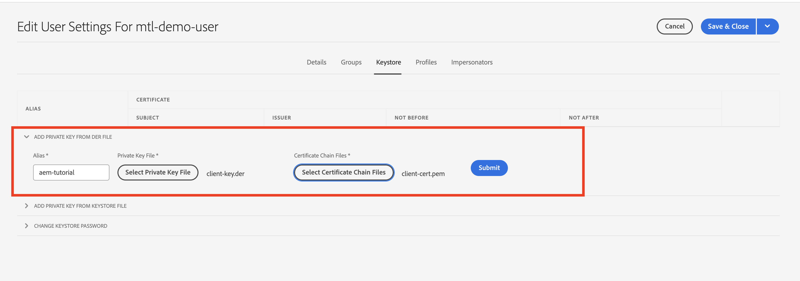
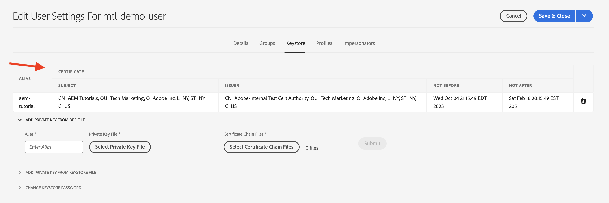

# Wederzijdse de authentificatie van de Veiligheid van de Laag van het Vervoer (mTLS) van AEM

Leer hoe te om vraag HTTPS van AEM aan Web APIs te maken die de Wederzijdse authentificatie van de Veiligheid van de Laag van het Vervoer (mTLS) vereisen.

>[!VIDEO](https://video.tv.adobe.com/v/3424855?quality=12&learn=on)

Met de mTLS- of bidirectionele TLS-verificatie wordt de beveiliging van het TLS-protocol verbeterd doordat **zowel de client als de server om elkaar te verifiëren**. Voor deze verificatie worden digitale certificaten gebruikt. Het wordt algemeen gebruikt in scenario&#39;s waar de sterke veiligheid en identiteitscontrole kritiek zijn.

Wanneer u probeert een HTTPS-verbinding te maken met een web-API waarvoor mTLS-verificatie is vereist, mislukt de verbinding standaard met de fout:

```
javax.net.ssl.SSLHandshakeException: Received fatal alert: certificate_required
```

Dit probleem doet zich voor wanneer de client geen certificaat voor verificatie presenteert.

Leer hoe te met succes APIs roepen die mTLS authentificatie door te gebruiken vereisen [Apache HttpClient](https://hc.apache.org/httpcomponents-client-4.5.x/index.html) en **AEM KeyStore en TrustStore**.


## HttpClient en laden AEM KeyStore-materiaal

Op hoog niveau zijn de volgende stappen vereist om een met mTLS beveiligde API van AEM aan te roepen.

### AEM genereren van certificaten

Vraag het AEM certificaat aan door samen te werken met het beveiligingsteam van uw organisatie. Het beveiligingsteam geeft of vraagt de certificaatgerelateerde details, zoals sleutel, CSR (Certificate signing Request) en het gebruik van CSR, als het certificaat is uitgegeven.

Voor demo-doeleinden genereert u de certificaatgerelateerde details, zoals sleutel, CSR (Certificate Signing Request). In het onderstaande voorbeeld wordt een zelfondertekende CA gebruikt om het certificaat uit te geven.

- Eerst genereert u het certificaat van de interne certificeringsinstantie (CA).

  ```shell
  # Create an internal Certification Authority (CA) certificate
  openssl req -new -x509 -days 9999 -keyout internal-ca-key.pem -out internal-ca-cert.pem
  ```

- Genereer het AEM certificaat.

  ```shell
  # Generate Key
  openssl genrsa -out client-key.pem
  
  # Generate CSR
  openssl req -new -key client-key.pem -out client-csr.pem
  
  # Generate certificate and sign with internal Certification Authority (CA)
  openssl x509 -req -days 9999 -in client-csr.pem -CA internal-ca-cert.pem -CAkey internal-ca-key.pem -CAcreateserial -out client-cert.pem
  
  # Verify certificate
  openssl verify -CAfile internal-ca-cert.pem client-cert.pem
  ```

- Converteer de AEM Private Key naar de indeling DER AEM KeyStore vereist de persoonlijke sleutel in de indeling DER.

  ```shell
  openssl pkcs8 -topk8 -inform PEM -outform DER -in client-key.pem -out client-key.der -nocrypt
  ```

>[!TIP]
>
>De zelfondertekende CA-certificaten worden alleen gebruikt voor ontwikkelingsdoeleinden. Voor productie, gebruik een vertrouwde op Instantie van het Certificaat (CA) om het certificaat uit te geven.


### Certificaatuitwisseling

Als u een zelfondertekende CA voor het AEM certificaat gebruikt, zoals hierboven, verzendt u het certificaat of het certificaat van de interne certificeringsinstantie (CA) naar de API-provider.

Als de API-provider een zelfondertekend CA-certificaat gebruikt, ontvangt u het certificaat of het certificaat van de interne certificeringsinstantie (CA) van de API-provider.

### Certificaat importeren

Voer de volgende stappen uit om AEM certificaat te importeren:

1. Aanmelden bij **AEM auteur** als **beheerder**.

1. Navigeren naar **AEM Auteur > Gereedschappen > Beveiliging > Gebruikers > Een bestaande gebruiker maken of selecteren**.

   

   Voor demo-doeleinden, een nieuwe gebruiker genoemd `mtl-demo-user` wordt gemaakt.

1. Als u het dialoogvenster **Gebruikerseigenschappen**, klikt u op de gebruikersnaam.

1. Klikken **Keystore** en klik vervolgens op **Keystore maken** knop. Dan in **Wachtwoord voor toegang sleutelarchief instellen** , stelt u een wachtwoord in voor het sleutelarchief van deze gebruiker en klikt u op Opslaan.

   

1. In het nieuwe scherm, onder **PRIVATE SLEUTEL UIT DER-BESTAND TOEVOEGEN** voert u de volgende stappen uit:

   1. Alias invoeren

   1. Importeer de hierboven gegenereerde AEM Private Key in DER-indeling.

   1. Importeer de bovenstaande certificaatkettingbestanden.

   1. Klik op Verzenden

      

1. Controleer of het certificaat is geïmporteerd.

   

Als de API-provider een zelfondertekend CA-certificaat gebruikt, importeert u het ontvangen certificaat in AEM TrustStore, volgt u de stappen van [hier](https://experienceleague.adobe.com/docs/experience-manager-learn/foundation/security/call-internal-apis-having-private-certificate.html#httpclient-and-load-aem-truststore-material).

En als AEM een zelfondertekend CA-certificaat gebruikt, vraagt u de API-provider om dit te importeren.

### Prototypische mTLS API-aanroepcode met gebruik van HttpClient

Java™-code bijwerken zoals hieronder. Te gebruiken `@Reference` aantekening om AEM te krijgen `KeyStoreService` de dienst de roepende code moet een component OSGi/dienst, of een het Verdelen Model (en `@OsgiService` wordt daar gebruikt).


```java
...

// Get AEM's KeyStoreService reference
@Reference
private com.adobe.granite.keystore.KeyStoreService keyStoreService;

...

// Get AEM KeyStore using KeyStoreService
KeyStore aemKeyStore = getAEMKeyStore(keyStoreService, resourceResolver);

if (aemKeyStore != null) {

    // Create SSL Context
    SSLContextBuilder sslbuilder = new SSLContextBuilder();

    // Load AEM KeyStore material into above SSL Context with keystore password
    // Ideally password should be encrypted and stored in OSGi config
    sslbuilder.loadKeyMaterial(aemKeyStore, "admin".toCharArray());

    // If API provider cert is self-signed, load AEM TrustStore material into above SSL Context
    // Get AEM TrustStore
    KeyStore aemTrustStore = getAEMTrustStore(keyStoreService, resourceResolver);
    sslbuilder.loadTrustMaterial(aemTrustStore, null);

    // Create SSL Connection Socket using above SSL Context
    SSLConnectionSocketFactory sslsf = new SSLConnectionSocketFactory(
            sslbuilder.build(), NoopHostnameVerifier.INSTANCE);

    // Create HttpClientBuilder
    HttpClientBuilder httpClientBuilder = HttpClientBuilder.create();
    httpClientBuilder.setSSLSocketFactory(sslsf);

    // Create HttpClient
    CloseableHttpClient httpClient = httpClientBuilder.build();

    // Invoke API
    closeableHttpResponse = httpClient.execute(new HttpGet(MTLS_API_ENDPOINT));

    // Code that reads response code and body from the 'closeableHttpResponse' object
    ...
} 

/**
 * Returns the AEM KeyStore of a user. In this example we are using the
 * 'mtl-demo-user' user.
 * 
 * @param keyStoreService
 * @param resourceResolver
 * @return AEM KeyStore
 */
private KeyStore getAEMKeyStore(KeyStoreService keyStoreService, ResourceResolver resourceResolver) {

    // get AEM KeyStore of 'mtl-demo-user' user, you can create a user or use an existing one. 
    // Then create keystore and upload key, certificate files.
    KeyStore aemKeyStore = keyStoreService.getKeyStore(resourceResolver, "mtl-demo-user");

    return aemKeyStore;
}

/**
 * 
 * Returns the global AEM TrustStore
 * 
 * @param keyStoreService OOTB OSGi service that makes AEM based KeyStore
 *                         operations easy.
 * @param resourceResolver
 * @return
 */
private KeyStore getAEMTrustStore(KeyStoreService keyStoreService, ResourceResolver resourceResolver) {

    // get AEM TrustStore from the KeyStoreService and ResourceResolver
    KeyStore aemTrustStore = keyStoreService.getTrustStore(resourceResolver);

    return aemTrustStore;
}

...
```

- Injecteer de OOTB `com.adobe.granite.keystore.KeyStoreService` De dienst OSGi in uw component OSGi.
- De AEM KeyStore van de gebruiker ophalen met `KeyStoreService` en `ResourceResolver`de `getAEMKeyStore(...)` methode doet dat.
- Als de API-provider een zelfondertekend CA-certificaat gebruikt, krijgt u de algemene AEM TrustStore, de `getAEMTrustStore(...)` methode doet dat.
- Een object maken van `SSLContextBuilder`, zie Java™ [API-details](https://javadoc.io/static/org.apache.httpcomponents/httpcore/4.4.8/index.html?org/apache/http/ssl/SSLContextBuilder.html).
- De AEM KeyStore van de gebruiker laden in `SSLContextBuilder` gebruiken `loadKeyMaterial(final KeyStore keystore,final char[] keyPassword)` methode.
- Het keystore wachtwoord is het wachtwoord dat toen het creëren van keystore werd geplaatst, zou het in OSGi config moeten worden opgeslagen, zie [Geheime configuratiewaarden](https://experienceleague.adobe.com/docs/experience-manager-cloud-service/content/implementing/deploying/configuring-osgi.html#secret-configuration-values).

## Wijzigingen in JVM-sleutelarchief vermijden

Een conventionele benadering om mTLS APIs met privé certificaten effectief aan te halen impliceert het wijzigen van JVM Keystore. Dit wordt bereikt door de persoonlijke certificaten te importeren met behulp van de Java™ [sleutelgereedschap](https://docs.oracle.com/en/java/javase/11/tools/keytool.html#GUID-5990A2E4-78E3-47B7-AE75-6D1826259549) gebruiken.

Deze methode is echter niet afgestemd op best practices op het gebied van beveiliging en AEM biedt een superieure optie via het gebruik van de **Gebruikersspecifieke sleutelwinkels en Global TrustStore** en [KeyStoreService](https://javadoc.io/doc/com.adobe.aem/aem-sdk-api/latest/com/adobe/granite/keystore/KeyStoreService.html).

## Oplossingspakket

Het voorbeeldproject Node.js dat in de video is gedemodeerd, kan worden gedownload van [hier](assets/internal-api-call/REST-APIs.zip).

De AEM servlet-code is beschikbaar in de projecten van het WKND-project `tutorial/web-api-invocation` vertakking, [zie](https://github.com/adobe/aem-guides-wknd/tree/tutorial/web-api-invocation/core/src/main/java/com/adobe/aem/guides/wknd/core/servlets).
