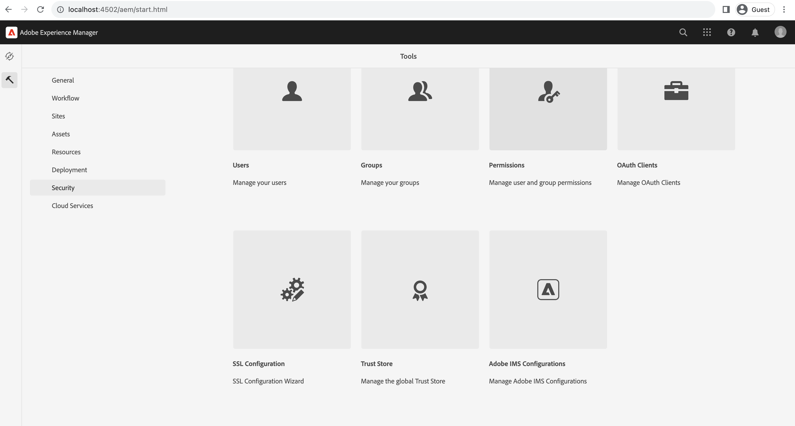

# De SSL-wizard in AEM gebruiken

Leer hoe u SSL in Adobe Experience Manager instelt om deze via HTTPS uit te voeren met behulp van de ingebouwde SSL-wizard.

>[!VIDEO](https://video.tv.adobe.com/v/17993?quality=12&learn=on)


>[!NOTE]
>
>Voor beheerde omgevingen is het het beste voor de IT-afdeling om CA-vertrouwde certificaten en sleutels te leveren.
>
>Zelfondertekende certificaten mogen alleen worden gebruikt voor ontwikkelingsdoeleinden.

## De wizard SSL-configuratie gebruiken

Navigeren naar __AEM Auteur > Hulpmiddelen > Veiligheid > SSL Configuratie__ en opent u de __wizard SSL-configuratie__.



### Opslagreferenties maken

Een _sleutelarchief_ in verband met de `ssl-service` systeemgebruiker en een globaal _Trust Store_, gebruikt u de __Referenties opslaan__ stap wizard.

1. Voer het wachtwoord in en bevestig het wachtwoord voor de __sleutelarchief__ in verband met de `ssl-service` systeemgebruiker.
1. Voer het wachtwoord in en bevestig het wachtwoord voor de globale __Trust Store__. Het is een vertrouwde opslag voor het hele systeem. Als dit al gebeurt, wordt het ingevoerde wachtwoord genegeerd.

   

### Persoonlijke sleutel en certificaat uploaden

Als u het gereedschap _persoonlijke sleutel_ en _SSL-certificaat_, gebruikt u de __Sleutel en certificaat__ stap wizard.

Meestal levert uw IT-afdeling het CA-vertrouwde certificaat en de sleutel, maar het zelfondertekende certificaat kan worden gebruikt voor __ontwikkeling__ en __testen__ doeleinden.

Als u het zelfondertekende certificaat wilt maken of downloaden, raadpleegt u de [Zelfondertekende persoonlijke sleutel en certificaat](#self-signed-private-key-and-certificate).

1. Upload de __Persoonlijke sleutel__ in de indeling DER (Distinguished Encoding Rules). In tegenstelling tot PEM bevatten DER-gecodeerde bestanden geen onbewerkte tekstinstructies zoals `-----BEGIN CERTIFICATE-----`
1. De bijbehorende bestanden uploaden __SSL-certificaat__ in de `.crt` gebruiken.

   

### SSL-verbindingsgegevens bijwerken

Als u het dialoogvenster _hostnaam_ en _poort_ gebruiken __SSL-connector__ stap wizard.

1. Werk de __Hostnaam HTTPS__ waarde, moet deze overeenkomen met de `Common Name (CN)` van het certificaat.
1. Werk de __HTTPS-poort__ waarde.

   

### De SSL-instelling controleren

1. Klik op de knop __Ga naar HTTPS-URL__ knop.
1. Als u een ondertekend certificaat gebruikt, ziet u `Your connection is not private` fout.

   

## Zelfondertekende persoonlijke sleutel en certificaat

De volgende ZIP bevat: [!DNL DER] en [!DNL CRT] bestanden die vereist zijn voor het lokaal instellen AEM SSL en die alleen bestemd zijn voor lokale ontwikkeling.

De [!DNL DER] en [!DNL CERT] bestanden worden geleverd voor een gebruiksgemak en gegenereerd met de stappen die worden beschreven in de sectie Persoonlijke sleutel genereren en Zelfondertekend certificaat hieronder.

Indien nodig is de certificaatwoordgroep **admin**.

Deze localhost - persoonlijke sleutel en zelfondertekend certificate.zip (verloopt in juli 2028)

[Het certificaatbestand downloaden](assets/use-the-ssl-wizard/certificate.zip)

### Persoonlijke sleutel en zelfondertekende certificaatgeneratie

In de video hierboven worden de installatie en configuratie van SSL op een AEM auteurinstantie met zelfondertekende certificaten weergegeven. De onderstaande opdrachten [[!DNL OpenSSL]](https://www.openssl.org/) U kunt een persoonlijke sleutel en certificaat genereren voor gebruik in stap 2 van de wizard.

```shell
### Create Private Key
$ openssl genrsa -aes256 -out localhostprivate.key 4096

### Generate Certificate Signing Request using private key
$ openssl req -sha256 -new -key localhostprivate.key -out localhost.csr -subj '/CN=localhost'

### Generate the SSL certificate and sign with the private key, will expire one year from now
$ openssl x509 -req -extfile <(printf "subjectAltName=DNS:localhost") -days 365 -in localhost.csr -signkey localhostprivate.key -out localhost.crt

### Convert Private Key to DER format - SSL wizard requires key to be in DER format
$ openssl pkcs8 -topk8 -inform PEM -outform DER -in localhostprivate.key -out localhostprivate.der -nocrypt
```
