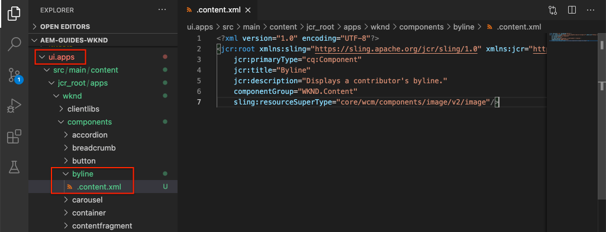
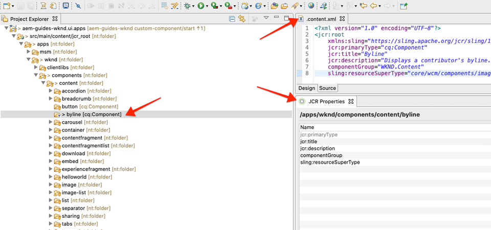
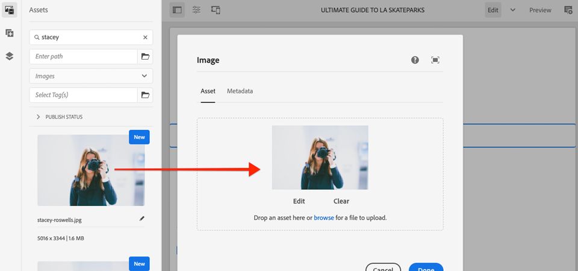
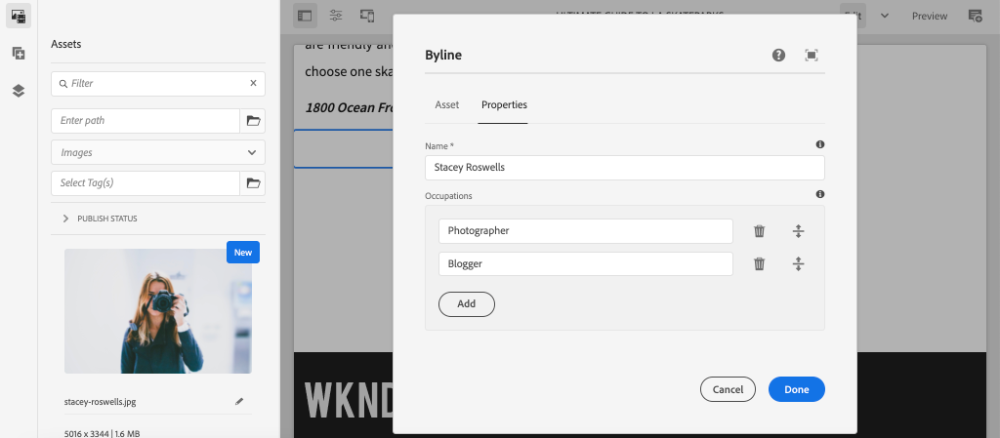
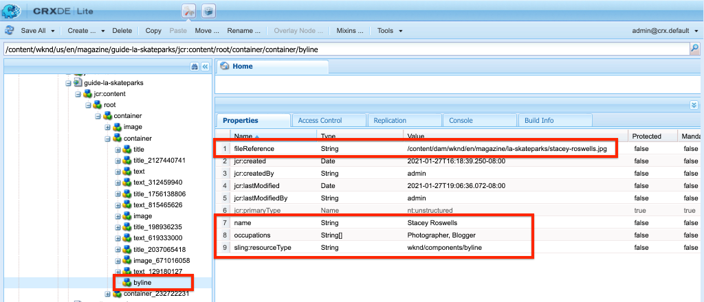
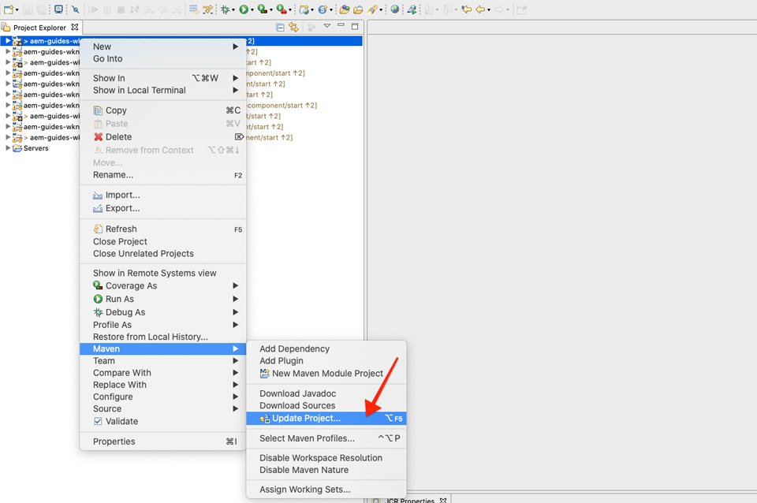

# Aangepaste component {#custom-component}

Deze zelfstudie behandelt de verwezenlijking van begin tot eind van een douane AEM Component van de Bodline die inhoud toont authored in een Dialoog, en verkent het ontwikkelen van een het Verzamelen Model om bedrijfslogica in te kapselen die HTML van de component bevolkt.

## Vereisten {#prerequisites}

Controleer de vereiste gereedschappen en instructies voor het instellen van een [lokale ontwikkelomgeving](overview.md#local-dev-environment).

### Starter-project

>[!NOTE]
>
> Als u in vorige delen van het leerprogramma hebt gevolgd, zult u opmerken dat het Project van de Aanzet voor dit hoofdstuk de implementatie versnelt. Het bevat nog een paar sjablonen en nog veel meer inhoud. Als bonus geeft u de vrijheid om de nieuwe inhoud en andere gebieden van de implementatie te verkennen, buiten de ontwikkeling van aangepaste componenten.

Bekijk de basislijncode waarop de zelfstudie is gebaseerd:

1. Clone the [github.com/adobe/aem-guides-wknd](https://github.com/adobe/aem-guides-wknd) repository.
1. De `custom-component/start` vertakking uitchecken

   ```shell
   $ git clone git@github.com:adobe/aem-guides-wknd.git ~/code/aem-guides-wknd
   $ cd ~/code/aem-guides-wknd
   $ git checkout custom-component/start
   ```

1. Stel codebasis aan een lokale AEM instantie op gebruikend uw Maven vaardigheden:

   ```shell
   $ cd ~/code/aem-guides-wknd
   $ mvn clean install -PautoInstallSinglePackage
   ```

U kunt de gebeëindigde code op [GitHub](https://github.com/adobe/aem-guides-wknd/tree/custom-component/solution) altijd bekijken of de code plaatselijk controleren door aan de tak te schakelen `custom-component/solution`.

## Doelstelling

1. Begrijp hoe te om een douane AEM component te bouwen
1. Leer om bedrijfslogica met het Verkopen Modellen in te kapselen
1. Begrijp hoe te om een het Verdelen Model van binnen een Manuscript van HTML te gebruiken

## Wat u gaat maken {#byline-component}

>[!VIDEO](https://video.tv.adobe.com/v/30181/?quality=12&learn=on)

In dit deel van de WKND-zelfstudie wordt een Byline-component gemaakt die wordt gebruikt om geschreven informatie over de auteur van een artikel weer te geven.


*Zichtbaar ontwerp van de component Byline die door het WKND-ontwerpteam wordt geleverd*

De implementatie van de component Byline bevat een dialoogvenster waarin de inhoud van de bylijn wordt verzameld en een aangepast Sling-model waarmee de volgende byline-inhoud wordt opgehaald:

* Naam
* Afbeelding
* Beroep

voor weergave door een HTML-script, dat de HTML rendert die de browser uiteindelijk weergeeft.


*Decomatie van Byline-component*

## Byline-component maken {#create-byline-component}

Maak eerst de knooppuntstructuur van de component Byline en definieer een dialoogvenster. Dit vertegenwoordigt de Component in AEM en bepaalt impliciet het middeltype van de component door zijn plaats in JCR.

In het dialoogvenster wordt de interface weergegeven waarmee auteurs van inhoud kunnen werken. Voor deze implementatie wordt de **Image** -component van de WCM Core-component gebruikt om het maken en renderen van de afbeelding van de Byline af te handelen, zodat deze wordt ingesteld als de afbeelding van onze component `sling:resourceSuperType`.

### Component Node maken {#create-component-node}

1. Navigeer in de module **ui.apps** naar `/apps/wknd/components/content` en maak een nieuw knooppunt met de naam **byline** van het type `cq:Component`.

   

1. Voeg de volgende eigenschappen toe aan de `cq:Component` knoop van de component Byline.

   ```plain
   jcr:title = Byline
   jcr:description = Displays a contributor's byline.
   componentGroup = WKND.Content
   sling:resourceSuperType =  core/wcm/components/image/v2/image
   ```

   

   Dit resulteert in deze `.content.xml` XML:

   ```xml
   <?xml version="1.0" encoding="UTF-8"?>
   <jcr:root
       xmlns:sling="https://sling.apache.org/jcr/sling/1.0" xmlns:jcr="https://www.jcp.org/jcr/1.0"
       jcr:primaryType="cq:Component"
       jcr:title="Byline"
       jcr:description="Displays a contributor's byline."
       componentGroup="WKND.Content"
       sling:resourceSuperType="core/wcm/components/image/v2/image"/>
   ```

### HTML-script maken {#create-the-htl-script}

1. Voeg onder het `byline` knooppunt een nieuw bestand toe `byline.html`dat verantwoordelijk is voor de HTML-presentatie van de component. Het noemen van het dossier het zelfde als de `cq:Component` knoop is belangrijk aangezien het standaardmanuscript het Sling wordt zal gebruiken om dit middeltype terug te geven.

1. Voeg de volgende code aan toe `byline.html`.

   ```xml
   <!--/* byline.html */-->
   <div data-sly-use.placeholderTemplate="core/wcm/components/commons/v1/templates.html">
   </div>
   <sly data-sly-call="${placeholderTemplate.placeholder @ isEmpty=true}"></sly>
   ```

`byline.html` wordt later [](#byline-htl)herzien, zodra het het Verkopen Model wordt gecreeerd. De huidige staat van het HTML- dossier staat de component toe om in een leeg staat, in de Redacteur van de Pagina van de Plaatsen van AEM te tonen wanneer het wordt gesleept en op de pagina gelaten vallen.

### De definitie van het dialoogvenster maken {#create-the-dialog-definition}

Definieer vervolgens een dialoogvenster voor de component Byline met de volgende velden:

* **Naam**: Een tekstveld waarin de naam van de contribuant wordt weergegeven.
* **Afbeelding**: een verwijzing naar het biobeeld van de contribuant.
* **Beroep**: een lijst van beroepen die aan de contribuant worden toegeschreven. De beroepen moeten alfabetisch in oplopende volgorde (a tot en met z) worden gesorteerd.

1. Onder het `byline` componentknooppunt maakt u een nieuw knooppunt met de naam `cq:dialog` van het type `nt:unstructured`.
1. Werk het `cq:dialog` bij met de volgende XML. Het is het gemakkelijkst om de volgende XML in de XML te openen `.content.xml` en te kopiëren/plakken.

   ```xml
   <?xml version="1.0" encoding="UTF-8"?>
   <jcr:root xmlns:sling="http://sling.apache.org/jcr/sling/1.0" xmlns:jcr="http://www.jcp.org/jcr/1.0"
           xmlns:nt="http://www.jcp.org/jcr/nt/1.0"
           jcr:primaryType="nt:unstructured"
           jcr:title="Byline"
           sling:resourceType="cq/gui/components/authoring/dialog">
       <content
               jcr:primaryType="nt:unstructured"
               sling:resourceType="granite/ui/components/coral/foundation/container">
           <items jcr:primaryType="nt:unstructured">
               <tabs
                       jcr:primaryType="nt:unstructured"
                       sling:resourceType="granite/ui/components/coral/foundation/tabs"
                       maximized="{Boolean}false">
                   <items jcr:primaryType="nt:unstructured">
                       <asset
                               jcr:primaryType="nt:unstructured"
                               sling:hideResource="{Boolean}false"/>
                       <metadata
                               jcr:primaryType="nt:unstructured"
                               sling:hideResource="{Boolean}true"/>
                       <properties
                               jcr:primaryType="nt:unstructured"
                               jcr:title="Properties"
                               sling:resourceType="granite/ui/components/coral/foundation/container"
                               margin="{Boolean}true">
                           <items jcr:primaryType="nt:unstructured">
                               <columns
                                       jcr:primaryType="nt:unstructured"
                                       sling:resourceType="granite/ui/components/coral/foundation/fixedcolumns"
                                       margin="{Boolean}true">
                                   <items jcr:primaryType="nt:unstructured">
                                       <column
                                               jcr:primaryType="nt:unstructured"
                                               sling:resourceType="granite/ui/components/coral/foundation/container">
                                           <items jcr:primaryType="nt:unstructured">
                                               <name
                                                       jcr:primaryType="nt:unstructured"
                                                       sling:resourceType="granite/ui/components/coral/foundation/form/textfield"
                                                       emptyText="Enter the contributor's name to display."
                                                       fieldDescription="The contributor's name to display."
                                                       fieldLabel="Name"
                                                       name="./name"
                                                       required="{Boolean}true"/>
                                               <occupations
                                                       jcr:primaryType="nt:unstructured"
                                                       sling:resourceType="granite/ui/components/coral/foundation/form/multifield"
                                                       fieldDescription="A list of the contributor's occupations."
                                                       fieldLabel="Occupations"
                                                       required="{Boolean}false">
                                                   <field
                                                           jcr:primaryType="nt:unstructured"
                                                           sling:resourceType="granite/ui/components/coral/foundation/form/textfield"
                                                           emptyText="Enter an occupation"
                                                           name="./occupations"/>
                                               </occupations>
                                           </items>
                                       </column>
                                   </items>
                               </columns>
                           </items>
                       </properties>
                   </items>
               </tabs>
           </items>
       </content>
   </jcr:root>
   ```

   Deze knoopdefinities gebruiken [het Verspreiden Samenvoegen](https://sling.apache.org/documentation/bundles/resource-merger.html) van het Middel om te controleren welke dialooglusjes van de `sling:resourceSuperType` component, in dit geval de component **van het Beeld van de** Componenten van de Kern worden geërft.

   

### Het dialoogvenster Beleid maken {#create-the-policy-dialog}

Na de zelfde benadering zoals met de verwezenlijking van de Dialoog, creeer een dialoog van het Beleid (die vroeger als Dialoog van het Ontwerp wordt bekend) om ongewenste gebieden in de configuratie van het Beleid te verbergen die van de component van het Beeld van de Componenten van de Kern wordt geërft.

1. Onder het `byline` knooppunt maakt u een nieuw knooppunt met de naam `cq:Component` van het type `cq:design_dialog` `nt:unstructured`.
1. Werk het `cq:design_dialog` bij met de volgende XML. U kunt de onderliggende XML het gemakkelijkst openen `.content.xml` en kopiëren/plakken.

   ```xml
   <?xml version="1.0" encoding="UTF-8"?>
   <jcr:root xmlns:sling="http://sling.apache.org/jcr/sling/1.0" xmlns:granite="http://www.adobe.com/jcr/granite/1.0" xmlns:cq="http://www.day.com/jcr/cq/1.0" xmlns:jcr="http://www.jcp.org/jcr/1.0" xmlns:nt="http://www.jcp.org/jcr/nt/1.0"
       jcr:primaryType="nt:unstructured"
       jcr:title="Byline"
       sling:resourceType="cq/gui/components/authoring/dialog">
       <content
               jcr:primaryType="nt:unstructured">
           <items jcr:primaryType="nt:unstructured">
               <tabs
                       jcr:primaryType="nt:unstructured">
                   <items jcr:primaryType="nt:unstructured">
                       <properties
                               jcr:primaryType="nt:unstructured">
                           <items jcr:primaryType="nt:unstructured">
                               <content
                                       jcr:primaryType="nt:unstructured">
                                   <items jcr:primaryType="nt:unstructured">
                                       <decorative
                                               jcr:primaryType="nt:unstructured"
                                               sling:hideResource="{Boolean}true"/>
                                       <altValueFromDAM
                                               jcr:primaryType="nt:unstructured"
                                               sling:hideResource="{Boolean}true"/>
                                       <titleValueFromDAM
                                               jcr:primaryType="nt:unstructured"
                                               sling:hideResource="{Boolean}true"/>
                                       <displayCaptionPopup
                                               jcr:primaryType="nt:unstructured"
                                               sling:hideResource="{Boolean}true"/>
                                       <disableUuidTracking
                                               jcr:primaryType="nt:unstructured"
                                               sling:hideResource="{Boolean}true"/>
                                   </items>
                               </content>
                           </items>
                       </properties>
                       <features
                               jcr:primaryType="nt:unstructured">
                           <items jcr:primaryType="nt:unstructured">
                               <content
                                       jcr:primaryType="nt:unstructured">
                                   <items jcr:primaryType="nt:unstructured">
                                       <accordion
                                               jcr:primaryType="nt:unstructured">
                                           <items jcr:primaryType="nt:unstructured">
                                               <orientation
                                                       jcr:primaryType="nt:unstructured"
                                                       sling:hideResource="{Boolean}true"/>
                                               <crop
                                                       jcr:primaryType="nt:unstructured"
                                                       sling:hideResource="{Boolean}true"/>
                                           </items>
                                       </accordion>
                                   </items>
                               </content>
                           </items>
                       </features>
                   </items>
               </tabs>
           </items>
       </content>
   </jcr:root>
   ```

   De basis voor het voorafgaande de dialoogvakje **XML van het** Beleid werd verkregen van de component [van het Beeld van de Componenten van de](https://github.com/adobe/aem-core-wcm-components/blob/master/content/src/content/jcr_root/apps/core/wcm/components/image/v2/image/_cq_design_dialog/.content.xml)Kern.

   Net als in de configuratie van de Dialoog, wordt de [Verschuivende Fusie](https://sling.apache.org/documentation/bundles/resource-merger.html) van het Middel gebruikt om irrelevante gebieden te verbergen die anders van de `sling:resourceSuperType`, zoals gezien door de knoopdefinities met `sling:hideResource="{Boolean}true"` bezit worden geërft.

### De code implementeren {#deploy-the-code}

1. Implementeer de bijgewerkte codebasis naar een lokale AEM met behulp van uw Maven-vaardigheden:

   ```shell
   $ cd ~/code/aem-guides-wknd
   $ mvn clean install -PautoInstallPackage
   ```

### De component aan een pagina toevoegen {#add-the-component-to-a-page}

Om dingen eenvoudig te houden en zich op AEM componentenontwikkeling te concentreren, zullen wij de component Byline in zijn huidige staat aan een pagina van het Artikel toevoegen om te verifiëren de `cq:Component` knoopdefinitie wordt opgesteld en correct, AEM erkent de nieuwe componentendefinitie en de de dialoogwerken van de component voor creatie.

Omdat wij de component Byline aan de Groep [van de Component van **WKND.Content** , via het](#create-component-node)bezit `/apps/wknd/components/content/byline@componentGroup=WKND.Content` toevoegden, is het automatisch beschikbaar aan om het even welke Container **van de** Lay-out waarvan het **Beleid** de **** WKND.Content componentengroep toestaat, die de Container van de Lay-out van de Pagina van het Artikel is.

#### De component naar de pagina slepen {#drag-and-drop-the-component-onto-the-page}

1. **Bewerk** de artikelpagina op **AEM > Sites > WKND Site > Master taal > Engels > Tijdschrift > Ultimate Guide to LA Skateparks**.
1. Sleep vanuit de linkerzijbalk een **naamregelcomponent** naar de **onderkant** van de container voor lay-out van de geopende artikelpagina.

   

#### Auteur van de component {#author-the-component}

AEM auteurs configureren componenten en schrijven ze samen via de dialoogvensters. Op dit punt in de ontwikkeling van de component Byline zijn de dialoogvensters inbegrepen voor het verzamelen van de gegevens, nochtans is de logica om de geschreven inhoud terug te geven nog niet toegevoegd.

1. Zorg ervoor dat de **linkerzijbalk open** en zichtbaar is en dat de **Asset Finder** is geselecteerd.

   

1. Selecteer de tijdelijke aanduiding voor de **component** Byline, die op zijn beurt de actiebalk weergeeft en op het **moersleutelpictogram** tikt om het dialoogvenster te openen.

   

1. Open de linkerzijbalk terwijl het dialoogvenster geopend is en het eerste tabblad (element) actief is. Sleep een afbeelding vanuit de zoekfunctie naar de dropzone Afbeelding. Zoek naar &quot;stapey&quot; om Stacey Roswells biopicture te vinden die in het WKND ui.content pakket wordt verstrekt.

   **[stackey-roswells.jpg](assets/custom-component/stacey-roswells.jpg)**

   

1. Nadat u een afbeelding hebt toegevoegd, klikt u op het tabblad **Eigenschappen** om de **naam** en de **beroepen** in te voeren.

   Wanneer het ingaan van beroepen, ga hen in **omgekeerde alfabetische** orde in zodat is de alfabetiserende bedrijfslogica die wij in het Sling Model zullen uitvoeren duidelijk.

   Tik op de knop **Gereed** rechtsonder om de wijzigingen op te slaan.

   

1. Nadat u het dialoogvenster hebt opgeslagen, navigeert u naar [CRXDE Lite](http://localhost:4502/crx/de/index.jsp#/content/wknd/language-masters/en/magazine/guide-la-skateparks/jcr:content/root/responsivegrid/responsivegrid/byline) en controleert u hoe de inhoud van de component is opgeslagen op het inhoudsknooppunt van de byline-component onder de AEM pagina.

   Zoek het inhoudknooppunt van de component Byline onder het `jcr:content/root/responsivegrid/responsivegrid` knooppunt, d.w.z. `/content/wknd/language-masters/en/magazine/guide-la-skateparks/jcr:content/root/responsivegrid/responsivegrid/byline`.

   Merk de bezitsnamen op `name`, `occupations`, en `fileReference` worden opgeslagen op de **bylineknoop**.

   Ook, merk op de `sling:resourceType` van de knoop wordt geplaatst aan `wknd/components/content/byline` welke is wat deze inhoudsknoop aan de de componentenimplementatie van de Naamregel bindt.

   

   */content/wknd/language-masters/nl/magazine/guide-la-skateparks/jcr:content/root/responsivegrid/responsivegrid/byline*

## Byline Sling Model maken {#create-sling-model}

Daarna, zullen wij een het Verkopen Model tot stand brengen om als gegevensmodel te handelen en de bedrijfslogica voor de component van de Byline te huisvesten.

Sling-modellen zijn annotaties die worden aangedreven door Java &quot;POJO&#39;s&quot; (Plain Old Java Objects) en die het gemakkelijker maken om gegevens van de JCR aan Java-variabelen toe te wijzen en die een aantal andere problemen bieden bij het ontwikkelen in de context van AEM.

### GeMaven afhankelijkheden controleren {#maven-dependency}

Het Byline Sling-model is gebaseerd op verschillende Java API&#39;s die door AEM worden geleverd. Deze API&#39;s worden beschikbaar gesteld via de API&#39;s `dependencies` die worden vermeld in het POM-bestand van de `core` module.

1. Open het onderliggende `pom.xml` bestand `<src>/aem-guides-wknd/core/pom.xml`.
1. Zoek de afhankelijkheid van de map in de sectie `uber-jar` Afhankelijkheden van het pombestand:

   ```xml
   ...
       <dependency>
           <groupId>com.adobe.aem</groupId>
           <artifactId>uber-jar</artifactId>
           <classifier>apis</classifier>
       </dependency>
   ...
   ```

   De [uber-jar](https://docs.adobe.com/content/help/en/experience-manager-65/developing/devtools/ht-projects-maven.html#experience-manager-api-dependencies) bevat alle openbare Java API&#39;s die door AEM worden weergegeven. Er is geen versie opgegeven in het `core/pom.xml` bestand. De versie wordt in plaats daarvan gehandhaafd in de hoofdpom van de moederreactor die zich aan de basis van het project bevindt `aem-guides-wknd/pom.xml`.

1. Zoek de afhankelijkheid voor `core.wcm.components.core`:

   ```xml
    <!-- Core Component Dependency -->
       <dependency>
           <groupId>com.adobe.cq</groupId>
           <artifactId>core.wcm.components.core</artifactId>
       </dependency>
   ```

   Dit zijn alle openbare API&#39;s van Java die worden weergegeven door AEM Core Components. AEM Core Components is een project dat buiten AEM wordt onderhouden en heeft daarom een aparte releasecyclus. Daarom is het een afhankelijkheid die afzonderlijk moet worden opgenomen en **niet** in de uber-jar wordt opgenomen.

   Net als de uber-jar blijft de versie voor deze afhankelijkheid behouden in het Parent-reactorpomabestand op `aem-guides-wknd/pom.xml`.

   Later in deze zelfstudie gebruiken we de klasse Core Component Image om de afbeelding weer te geven in de component Byline. Het is noodzakelijk om de afhankelijkheid van de Component van de Kern te hebben om ons het Verkopen Model te bouwen en te compileren.

### Byline-interface {#byline-interface}

Maak een openbare Java-interface voor de naamregel. `Byline.java` bepaalt de openbare methodes nodig om het manuscript van `byline.html` HTML te drijven.

1. Maak een nieuwe Java-interface in de `aem-guides-wknd.core` module eronder `src/main/java,` door met de rechtermuisknop op het `Byline.java` pakket > Nieuw > Interface `com.adobe.aem.guides.wknd.core.models` **** te klikken. Ga **Byline** als interfacenaam in, en klik Afwerking.

   

1. Werk de update `Byline.java` met de volgende methoden uit:

   ```java
   package com.adobe.aem.guides.wknd.core.models;
   
   import java.util.List;
   
   /**
   * Represents the Byline AEM Component for the WKND Site project.
   **/
   public interface Byline {
       /***
       * @return a string to display as the name.
       */
       String getName();
   
       /***
       * Occupations are to be sorted alphabetically in a descending order.
       *
       * @return a list of occupations.
       */
       List<String> getOccupations();
   
       /***
       * @return a boolean if the component has enough content to display.
       */
       boolean isEmpty();
   }
   ```

   De eerste twee methodes stellen de waarden voor de **naam** en de **beroepen** voor de component van de Band bloot.

   De `isEmpty()` methode wordt gebruikt om te bepalen als de component om het even welke inhoud heeft om terug te geven of als het wacht om worden gevormd.

   Er is geen methode voor de afbeelding. [we zullen bekijken waarom dat later](#tackling-the-image-problem)is .

### Bylineimplementatie {#byline-implementation}

`BylineImpl.java` is de implementatie van het het Verdelen Model dat de eerder bepaalde `Byline.java` interface uitvoert. De volledige code voor `BylineImpl.java` vindt u onder aan deze sectie.

1. Maak in de `core` module hieronder `src/main/java`een nieuw klassebestand met de naam **BylineImpl.java** door met de rechtermuisknop op het `com.adobe.aem.guides.wknd.core.models.impl` pakket te klikken en **Nieuw > Klasse** te selecteren.

   Voer voor de naam **BylineImpl** in. Voeg de interface **** Byline toe als het uitvoeren interface.

   

1. Open `BylineImpl.java`. Deze wordt automatisch gevuld met alle methoden die in de interface zijn gedefinieerd `Byline.java`. Voeg de annotaties van het Sling Model toe door `BylineImpl.java` de volgende annotaties op klasseniveau bij te werken. Deze `@Model(..)`annotatie verandert de klasse in een Sling Model.

   ```java
   import org.apache.sling.api.SlingHttpServletRequest;
   import org.apache.sling.models.annotations.Model;
   import org.apache.sling.models.annotations.DefaultInjectionStrategy;
   ...
   @Model(
           adaptables = {SlingHttpServletRequest.class},
           adapters = {Byline.class},
           resourceType = {BylineImpl.RESOURCE_TYPE},
           defaultInjectionStrategy = DefaultInjectionStrategy.OPTIONAL
   )
   public class BylineImpl implements Byline {
       protected static final String RESOURCE_TYPE = "wknd/components/content/byline";
       ...
   }
   ```

   Laten we deze annotatie en de bijbehorende parameters bekijken:

   * De `@Model` annotatie registreert BylineImpl als het Verschilderen Model wanneer het aan AEM wordt opgesteld.
   * De `adaptables` parameter specificeert dat dit model door het verzoek kan worden aangepast.
   * Met de `adapters` parameter kan de implementatieklasse worden geregistreerd onder de interface Byline. Hierdoor kan het HTML-script het Sling Model via de interface aanroepen (in plaats van de impl rechtstreeks). [Meer informatie over adapters vindt u hier](https://sling.apache.org/documentation/bundles/models.html#specifying-an-alternate-adapter-class-since-110).
   * De `resourceType` punten aan het de componentenmiddeltype van de Byline (vroeger gecreeerd) en hulp om het correcte model op te lossen als er veelvoudige implementaties zijn. [Meer details over het associëren van een modelklasse met een middeltype kunnen hier](https://sling.apache.org/documentation/bundles/models.html#associating-a-model-class-with-a-resource-type-since-130)worden gevonden.

### Implementatie van de methoden van het verkoopmodel {#implementing-the-sling-model-methods}

#### getName() {#implementing-get-name}

De eerste methode die wij zullen aanpakken is `getName()` die eenvoudig de waarde terugkeert die aan de JCR van de byline inhoudsknoop onder het bezit wordt opgeslagen `name`.

Hiervoor wordt de annotatie `@ValueMapValue` Verkoopmodel gebruikt om de waarde in een Java-veld te injecteren met behulp van ValueMap van de resource van het verzoek.

```java
...
import org.apache.sling.models.annotations.injectorspecific.ValueMapValue;
...
public class BylineImpl implements Byline {
    ...

    @ValueMapValue
    private String name;

    ...
    @Override
    public String getName() {
        return name;
    }
    ...
}
```

Omdat de JCR-eigenschap dezelfde naam heeft als het Java-veld (beide &#39;name&#39; zijn), wordt deze koppeling `@ValueMapValue` automatisch opgelost en wordt de waarde van de eigenschap in het Java-veld ingevoegd.

#### getOccupations() {#implementing-get-occupations}

De volgende methode die moet worden geïmplementeerd, is `getOccupations()`. Deze methode verzamelt alle beroepen die in het bezit JCR worden opgeslagen `occupations` en keert een gesorteerde (alfabetische) inzameling van hen terug.

Met dezelfde techniek die in `getName()` de eigenschapswaarde wordt beschreven, kunt u het veld Sling Model injecteren.

Zodra de JCR-eigenschapswaarden beschikbaar zijn in het Sling Model via het geïnjecteerde Java-veld `occupations`, kan de sorteerbedrijfslogica in de `getOccupations()` methode worden toegepast.

```java
import java.util.ArrayList;
import java.util.Collections;
...

public class BylineImpl implements Byline {
    ...
    @ValueMapValue
    private List<String> occupations;
    ...
    public List<String> getOccupations() {
        if (occupations != null) {
            Collections.sort(occupations);
            return new ArrayList<String>(occupations);
        } else {
            return Collections.emptyList();
        }
    }
    ...
}
...
```

#### isEmpty() {#implementing-is-empty}

De laatste openbare methode is `isEmpty()` die bepaalt wanneer de component zich &quot;authored genoeg&quot;zou moeten overwegen om terug te geven.

Voor deze component, hebben wij bedrijfsvereisten die verklaren dat alle drie gebieden, naam, beeld en beroepen moeten worden ingevuld *alvorens* de component kan worden teruggegeven.

```java
import org.apache.commons.lang3.StringUtils;
...
public class BylineImpl implements Byline {
    ...
    @Override
    public boolean isEmpty() {
        if (StringUtils.isBlank(name)) {
            // Name is missing, but required
            return true;
        } else if (occupations == null || occupations.isEmpty()) {
            // At least one occupation is required
            return true;
        } else if (/* image is not null, logic to be determined */) {
            // A valid image is required
            return true;
        } else {
            // Everything is populated, so this component is not considered empty
            return false;
        }
    }
    ...
}
```

#### Het probleem van de &quot;afbeelding&quot; aanpakken {#tackling-the-image-problem}

Het controleren van de naam en de beslagvoorwaarden zijn triviaal (en Apache Commons Lang3 verstrekt altijd handige [klasse StringUtils](https://commons.apache.org/proper/commons-lang/apidocs/org/apache/commons/lang3/StringUtils.html) ), echter, is het onduidelijk hoe de **aanwezigheid van het Beeld** kan worden bevestigd aangezien de component van het Beeld van de Componenten van de Kern wordt gebruikt om het beeld te oppervlakte.

Er zijn twee manieren om dit aan te pakken:

1. Controleer of de eigenschap `fileReference` JCR is omgezet in een element.
1. Zet deze bron om in een Core Component Image Sling Model en zorg ervoor dat de `getSrc()` methode niet leeg is.

   We zullen kiezen voor de **tweede** aanpak. De eerste aanpak is waarschijnlijk voldoende, maar in deze zelfstudie zal deze laatste worden gebruikt om andere kenmerken van Sling Models te verkennen.

1. Maak een methode van het type private waarmee de afbeelding wordt opgehaald. Deze methode blijft privé, omdat we het afbeeldingsobject niet in de HTML zelf hoeven weer te geven en de enige methode die wordt gebruikt om het object te besturen `isEmpty().`

   De volgende methode van het type private voor `getImage()`:

   ```java
   import com.adobe.cq.wcm.core.components.models.Image;
   ...
   private Image getImage() {
       Image image = null;
       // Figure out how to populate the image variable!
       return image;
   }
   ```

   Zoals hierboven vermeld, zijn er nog twee manieren om het **afbeeldingsmodel** te verkrijgen:

   De eerste toepassing gebruikt de `@Self` aantekening, om het huidige verzoek automatisch aan te passen aan de Component van de Kern `Image.class`

   ```java
   @Self
   private Image image;
   ```

   Het tweede gebruik de [Apache Sling ModelFactory](https://sling.apache.org/apidocs/sling10/org/apache/sling/models/factory/ModelFactory.html) OSGi dienst, die een zeer handige dienst is, en helpt ons Sling Models van andere types in code van Java tot stand brengen.

   We zullen kiezen voor de tweede aanpak.

   >[!NOTE]
   >
   >In een implementatie in de praktijk `@Self` heeft de benadering &#39;One&#39; de voorkeur, aangezien het de eenvoudigere, elegantere oplossing is. In deze zelfstudie gebruiken we de tweede aanpak, omdat deze vereist dat we meer facetten van Sling Models verkennen die bijzonder nuttig zijn: complexere componenten!

   Aangezien Sling Models Java POJO&#39;s zijn, en niet OSGi Services, `@Reference` kunnen de gebruikelijke OSGi-injectieannotaties **niet** worden gebruikt, in plaats daarvan bieden Sling Models een speciale **[@OSGiService](https://sling.apache.org/documentation/bundles/models.html#injector-specific-annotations)** -annotatie die vergelijkbare functionaliteit biedt.

1. Update `BylineImpl.java` om de `OSGiService` annotatie voor injectie op te nemen `ModelFactory`:

   ```java
   import org.apache.sling.models.factory.ModelFactory;
   import org.apache.sling.models.annotations.injectorspecific.OSGiService;
   ...
   public class BylineImpl implements Byline {
       ...
       @OSGiService
       private ModelFactory modelFactory;
   }
   ```

   Met het `ModelFactory` beschikbare model, kan een Model van de Verkoop van het Beeld van de Component van de Kern tot stand worden gebracht gebruikend:

   ```java
   modelFactory.getModelFromWrappedRequest(SlingHttpServletRequest request, Resource resource, java.lang.Class<T> targetClass)
   ```

   Nochtans, vereist deze methode zowel een verzoek als een middel, nog niet beschikbaar in het het Verdelen Model. Om deze te verkrijgen worden meer verkoopmodelannotaties gebruikt!

   Om de huidige aanvraag op te halen, kan de **[@Self](https://sling.apache.org/documentation/bundles/models.html#injector-specific-annotations)** -annotatie worden gebruikt om de `adaptable` (die in de code `@Model(..)` `SlingHttpServletRequest.class`as is gedefinieerd) in een Java-klasseveld te injecteren.

1. Voeg de **@Self** -annotatie toe om het **SlingHttpServletRequest-verzoek** op te halen:

   ```java
   import org.apache.sling.models.annotations.injectorspecific.Self;
   ...
   @Self
   private SlingHttpServletRequest request;
   ```

   Vergeet niet dat het gebruik van `@Self Image image` het model voor het instellen van afbeeldingen van de kerncomponent hierboven een optie was - de `@Self` annotatie probeert het aanpasbare object te injecteren (in ons geval een SlingHttpServletRequest) en zich aan te passen aan het type annotatieveld. Aangezien het model voor het instellen van kerncomponentafbeeldingen kan worden aangepast aan SlingHttpServletRequest-objecten, zou dit hebben gewerkt en is het minder code dan onze meer verkennende aanpak.

   Nu hebben wij de variabelen nodig geïnjecteerd om ons model van het Beeld via ModelFactory API te concretiseren. We gebruiken de annotatie **[@PostConstruct](https://sling.apache.org/documentation/bundles/models.html#postconstruct-methods)** van het Sling-model om dit object te verkrijgen nadat het Sling-model is geïnstantieerd.

   `@PostConstruct` is ongelooflijk nuttig en handelt in een zelfde hoedanigheid als aannemer, echter, wordt het aangehaald nadat de klasse wordt geconcretiseerd en alle geannoteerde gebieden van Java worden geïnjecteerd. Terwijl andere annotaties van het Model van het Sling aan de klassengebieden van Java (variabelen) annoteert, `@PostConstruct` annoteert een ongeldige, nulparametermethode, typisch genoemd `init()` (maar kan om het even wat worden genoemd).

1. Methode **@PostConstruct** toevoegen:

   ```java
   import javax.annotation.PostConstruct;
   ...
   public class BylineImpl implements Byline {
       ...
       private Image image;
   
       @PostConstruct
       private void init() {
           image = modelFactory.getModelFromWrappedRequest(request,
                                                           request.getResource(),
                                                           Image.class);
       }
       ...
   }
   ```

   Herinner me, zijn het Verdelen Modellen **NIET** OSGi Services, zodat is het veilig om klassenstaat te handhaven. Hiermee wordt de klassestatus Sling Model vaak `@PostConstruct` afgeleid en ingesteld voor later gebruik, vergelijkbaar met wat een normale constructor doet.

   Merk op dat als de `@PostConstruct` methode een uitzondering werpt, het Verschuivende Model niet zal concretiseren (het zal ongeldig zijn).

1. **getImage()** kan nu worden bijgewerkt om het afbeeldingsobject te retourneren.

   ```java
   /**
       * @return the Image Sling Model of this resource, or null if the resource cannot create a valid Image Sling Model.
   */
   private Image getImage() {
       return image;
   }
   ```

1. Laten we teruggaan naar `isEmpty()` en de implementatie voltooien:

   ```java
   @Override
   public boolean isEmpty() {
       ...
       } else if (getImage() == null || StringUtils.isBlank(getImage().getSrc())) {
           // A valid image is required
           return true;
       } else {
       ...
   }
   ```

   Nota veelvoudige vraag aan `getImage()` is niet problematisch aangezien de geïnitialiseerde `image` klassenvariabele terugkeert en niet aanhaalt `modelFactory.getModelFromWrappedRequest(...)` die niet onnodig duur is, maar het waard is het roepen onnodig te vermijden.

1. Het uiteindelijke `BylineImpl.java` moet er als volgt uitzien:

   ```java
   package com.adobe.aem.guides.wknd.core.models.impl;
   
   import java.util.ArrayList;
   import java.util.Collections;
   import java.util.List;
   
   import javax.annotation.PostConstruct;
   
   import org.apache.commons.lang3.StringUtils;
   import org.apache.sling.api.SlingHttpServletRequest;
   import org.apache.sling.models.annotations.DefaultInjectionStrategy;
   import org.apache.sling.models.annotations.Model;
   import org.apache.sling.models.annotations.injectorspecific.OSGiService;
   import org.apache.sling.models.annotations.injectorspecific.Self;
   import org.apache.sling.models.annotations.injectorspecific.ValueMapValue;
   import org.apache.sling.models.factory.ModelFactory;
   
   import com.adobe.aem.guides.wknd.core.models.Byline;
   import com.adobe.cq.wcm.core.components.models.Image;
   
   @Model(
           adaptables = {SlingHttpServletRequest.class},
           adapters = {Byline.class},
           resourceType = {BylineImpl.RESOURCE_TYPE},
           defaultInjectionStrategy = DefaultInjectionStrategy.OPTIONAL
   )
   public class BylineImpl implements Byline {
       protected static final String RESOURCE_TYPE = "wknd/components/content/byline";
   
       @Self
       private SlingHttpServletRequest request;
   
       @OSGiService
       private ModelFactory modelFactory;
   
       @ValueMapValue
       private String name;
   
       @ValueMapValue
       private List<String> occupations;
   
       private Image image;
   
       @PostConstruct
       private void init() {
           image = modelFactory.getModelFromWrappedRequest(request, request.getResource(), Image.class);
       }
   
       @Override
       public String getName() {
           return name;
       }
   
       @Override
       public List<String> getOccupations() {
           if (occupations != null) {
               Collections.sort(occupations);
               return new ArrayList<String>(occupations);
           } else {
               return Collections.emptyList();
           }
       }
   
       @Override
       public boolean isEmpty() {
           final Image image = getImage();
   
           if (StringUtils.isBlank(name)) {
               // Name is missing, but required
               return true;
           } else if (occupations == null || occupations.isEmpty()) {
               // At least one occupation is required
               return true;
           } else if (image == null || StringUtils.isBlank(image.getSrc())) {
               // A valid image is required
               return true;
           } else {
               // Everything is populated, so this component is not considered empty
               return false;
           }
       }
   
       /**
       * @return the Image Sling Model of this resource, or null if the resource cannot create a valid Image Sling Model.
       */
       private Image getImage() {
           return image;
       }
   }
   ```

## Naamregel HTL {#byline-htl}

In de `ui.apps` module, open `/apps/wknd/components/content/byline/byline.html` wij in de vroegere opstelling van de Component van de AEM creeerden.

```html
<div data-sly-use.placeholderTemplate="core/wcm/components/commons/v1/templates.html">
</div>
<sly data-sly-call="${placeholderTemplate.placeholder @ isEmpty=false}"></sly>
```

Laten we bekijken wat dit HTML-script tot nu toe doet:

* De `placeholderTemplate` punten aan placeholder van de Componenten van de Kern, die toont wanneer de component niet volledig wordt gevormd. Dit wordt in de AEM Sites Page Editor weergegeven als een vak met de componenttitel, zoals hierboven in de `cq:Component`eigenschap `jcr:title` van de pagina is gedefinieerd.

* De `data-sly-call="${placeholderTemplate.placeholder @ isEmpty=false}` code laadt de `placeholderTemplate` hierboven gedefinieerde waarde en geeft een booleaanse waarde (momenteel gecodeerd als `false`) door aan de plaatsaanduidingssjabloon. Wanneer `isEmpty` waar (true), wordt het grijze vak weergegeven door de sjabloon voor plaatsaanduidingen. Anders wordt er niets weergegeven.

### Byline HTML bijwerken

1. Werk **byline.html** bij met de volgende skelet-HTML-structuur:

   ```xml
   <div data-sly-use.placeholderTemplate="core/wcm/components/commons/v1/templates.html"
       class="cmp-byline">
           <div class="cmp-byline__image">
               <!-- Include the Core Components Image Component -->
           </div>
           <h2 class="cmp-byline__name"><!-- Include the name --></h2>
           <p class="cmp-byline__occupations"><!-- Include the occupations --></p>
   </div>
   <sly data-sly-call="${placeholderTemplate.placeholder @ isEmpty=true}"></sly>
   ```

   Let op: de CSS-klassen volgen de naamgevingsconventie [BEM](https://getbem.com/naming/). Hoewel het gebruik van BEM-conventies niet verplicht is, wordt BEM aanbevolen omdat het wordt gebruikt in CSS-klassen voor kerncomponenten en doorgaans resulteert in schone, leesbare CSS-regels.

#### Instantiëren van objecten van het Sling Model in HTML {#instantiating-sling-model-objects-in-htl}

De blokinstructie [](https://github.com/adobe/htl-spec/blob/master/SPECIFICATION.md#221-use) Use wordt gebruikt om Sling Model-objecten te instantiëren in het HTML-script en deze toe te wijzen aan een HTML-variabele.

`data-sly-use.byline="com.adobe.aem.guides.wknd.models.Byline"` gebruikt de interface Byline (com.adobe.aem.guides.wknd.models.Byline) die door BylineImpl wordt uitgevoerd en past het huidige SlingHttpServletRequest aan het aan, en het resultaat wordt opgeslagen in een de veranderlijke naam van HTML byline ( `data-sly-use.<variable-name>`).

1. Werk buiten bij `div` om naar het Model van het Verzamelen van de **Byline** door zijn openbare interface te verwijzen:

   ```xml
   <div data-sly-use.byline="com.adobe.aem.guides.wknd.core.models.Byline"
       data-sly-use.placeholderTemplate="core/wcm/components/commons/v1/templates.html"
       class="cmp-byline">
       ...
   </div>
   ```

#### Methoden van het verkoopmodel openen {#accessing-sling-model-methods}

HTML leent vanuit JSTL en gebruikt dezelfde verkorting van namen van Java getter-methoden.

Bijvoorbeeld, kan het aanhalen van de `getName()` methode van het Model van de Wijzerplaat van de Byline aan `byline.name`, op dezelfde manier in plaats van worden ingekort `byline.isEmpty`, dit aan `byline.empty`. Het gebruiken van volledige methodenamen, `byline.getName` of `byline.isEmpty`, werkt eveneens. Let op: de methoden `()` worden nooit gebruikt om methoden in HTML aan te roepen (vergelijkbaar met JSTL).

Java-methoden die een parameter vereisen, **kunnen niet** worden gebruikt in HTML. Dit is door ontwerp om de logica in HTML eenvoudig te houden.

1. De naam van de Byline kan aan de component worden toegevoegd door de methode op het Model van het Sling van de Byline aan te halen, of in HTML: `getName()` `${byline.name}`.

   Werk de `h2` tag bij:

   ```xml
   <h2 class="cmp-byline__name">${byline.name}</h2>
   ```

#### HTML-expressieopties gebruiken {#using-htl-expression-options}

[Opties voor](https://github.com/adobe/htl-spec/blob/master/SPECIFICATION.md#12-available-expression-options) HTL-expressies fungeren als modifiers voor inhoud in HTML en variëren van datumnotatie tot i18n-vertaling. Expressies kunnen ook worden gebruikt om lijsten of arrays met waarden met elkaar te verbinden. Dit is wat nodig is om de beroepen in een door komma&#39;s gescheiden indeling weer te geven.

Expressies worden toegevoegd via de `@` operator in de HTML-expressie.

1. Als u de lijst met beroepen wilt samenvoegen met &quot;, &quot;, wordt de volgende code gebruikt:

   ```html
   <p class="cmp-byline__occupations">${byline.occupations @ join=', '}</p>
   ```

#### De tijdelijke aanduiding voorwaardelijk weergeven {#conditionally-displaying-the-placeholder}

De meeste HTML-scripts voor AEM Components gebruiken het **placeholder-paradigma** om auteurs een visuele aanwijzing te geven **dat een component onjuist is ontworpen en niet wordt weergegeven in AEM Publish**. De conventie om dit besluit te sturen is een methode op het steunen van het Model van de Scheef van de component in ons geval uit te voeren: `Byline.isEmpty()`.

`isEmpty()` wordt aangeroepen op het Byline Sling-model en het resultaat (of eerder het negatieve resultaat via de `!` operator) wordt opgeslagen naar een HTML-variabele met de naam `hasContent`:

1. Werk buitenste bij `div` om een genoemde variabele van HTML te bewaren `hasContent`:

   ```html
    <div data-sly-use.byline="com.adobe.aem.guides.wknd.core.models.Byline"
         data-sly-use.placeholderTemplate="core/wcm/components/commons/v1/templates.html"
         data-sly-test.hasContent="${!byline.empty}"
         class="cmp-byline">
         ...
   </div>
   ```

   Let op het gebruik van `data-sly-test`, het HTL- `test` blok is interessant omdat het beide een HTML-variabele instelt EN het HTML-element waarop het zich bevindt rendert/niet rendert, gebaseerd op het feit of het resultaat van de HTML-expressie waar of niet is. Als het HTML-element &#39;true&#39; is, wordt het anders niet gerenderd.

   Deze HTML-variabele `hasContent` kan nu opnieuw worden gebruikt om de tijdelijke aanduiding voorwaardelijk weer te geven of te verbergen.

1. Werk de voorwaardelijke aanroep naar de `placeholderTemplate` onderkant van het bestand bij met het volgende:

   ```html
   <sly data-sly-call="${placeholderTemplate.placeholder @ isEmpty=!hasContent}"></sly>
   ```

#### De afbeelding weergeven met behulp van kerncomponenten {#using-the-core-components-image}

Het HTML-script voor `byline.html` is nu bijna voltooid en bevat alleen de afbeelding.

```html
<!--/* current progress of byline.html */-->
<div data-sly-use.byline="com.adobe.aem.guides.wknd.core.models.Byline"
     data-sly-use.placeholderTemplate="core/wcm/components/commons/v1/templates.html"
     data-sly-test.hasContent="${!byline.empty}"
     class="cmp-byline">
    <div class="cmp-byline__image">
        <!-- Include the Core Components Image component -->
    </div>
    <h2 class="cmp-byline__name">${byline.name}</h2>
    <p class="cmp-byline__occupations">${byline.occupations @ join=', '}</p>
</div>
<sly data-sly-call="${placeholderTemplate.placeholder @ isEmpty=!hasContent}"></sly>
```

Aangezien wij `sling:resourceSuperType` de component van het Beeld van de Component van de Kern gebruiken om het ontwerp van het beeld te verstrekken, kunnen wij de component van het Beeld van de Component van de Kern ook gebruiken om het beeld terug te geven!

Voor dit, moeten wij het huidige bylinemiddel omvatten, maar forceer het middeltype van de component van het Beeld van de Componenten van de Kern, gebruikend middeltype `core/wcm/components/image/v2/image`. Dit is een krachtig patroon voor hergebruik van componenten. Hiervoor wordt het `data-sly-resource` blok van HTL gebruikt.

1. Vervang de klasse `div` door de volgende `cmp-byline__image` klasse:

   ```html
   <div class="cmp-byline__image"
       data-sly-resource="${ '.' @ resourceType = 'core/wcm/components/image/v2/image' }"></div>
   ```

   Dit `data-sly-resource`, omvatte het huidige middel via de relatieve weg `'.'`, en dwingt de opneming van het huidige middel (of het middel van de bylineinhoud) met het middeltype van `core/wcm/components/image/v2/image`.

   Het middeltype van de Component van de Kern wordt gebruikt direct, en niet via een volmacht, omdat dit een in-manuscriptgebruik is, en het nooit aan onze inhoud voortduurt.

2. Voltooid `byline.html` hieronder:

   ```html
   <div data-sly-use.byline="com.adobe.aem.guides.wknd.core.models.Byline"
       data-sly-use.placeholderTemplate="core/wcm/components/commons/v1/templates.html"
       data-sly-test.hasContent="${!byline.empty}"
       class="cmp-byline">
       <div class="cmp-byline__image"
            data-sly-resource="${ '.' @ resourceType = 'core/wcm/components/image/v2/image' }">
       </div>
           <h2 class="cmp-byline__name">${byline.name}</h2>
           <p class="cmp-byline__occupations">${byline.occupations @ join=','}</p>
   </div>
   <sly data-sly-call="${placeholderTemplate.placeholder @ isEmpty=!hasContent}"></sly>
   ```

3. Implementeer de basis van de code naar een lokale AEM-instantie. Aangezien de belangrijkste veranderingen in POM dossiers werden aangebracht, voer een volledige Gemaakt bouwstijl van de wortelfolder van het project uit.

   >[!WARNING]
   >
   > Merk op dat het WKND project opstelling dusdanig is dat om het even welke veranderingen in JCR `ui.content` zal beschrijven, daarom willen wij ervoor zorgen wij slechts het `ui.apps` project opstellen om de component te vermijden die van de Byline aan de artikelpagina eerder wordt toegevoegd.

   ```shell
   $ cd ~/code/aem-guides-wknd/ui.apps
   $ mvn -PautoInstallPackage clean install
   ...
   Package imported.
   Package installed in 338ms.
   [INFO] ------------------------------------------------------------------------
   [INFO] BUILD SUCCESS
   [INFO] ------------------------------------------------------------------------
   ```

#### De niet-opgemaakte component Byline bekijken {#reviewing-the-unstyled-byline-component}

1. Nadat u de update hebt geïmplementeerd, navigeert u naar de [Ultimate Guide naar de ](http://localhost:4502/editor.html/content/wknd/language-masters/en/magazine/guide-la-skateparks.html) pagina LA Skateparks of waar u de Byline-component eerder in het hoofdstuk hebt toegevoegd.

1. De **afbeelding**, de **naam** en de **beroepen** worden nu weergegeven en er wordt een naamloze, maar werkende Byline-component weergegeven.

   

#### De registratie van het verkoopmodel bekijken {#reviewing-the-sling-model-registration}

In de statusweergave [van Sling Models van de](http://localhost:4502/system/console/status-slingmodels) AEM webconsole worden alle geregistreerde Sling Models in AEM weergegeven. Het Byline Sling-model kan worden gevalideerd als geïnstalleerd en herkend door deze lijst te herzien.

Als de **BylineImpl** niet in deze lijst wordt getoond, dan is er waarschijnlijk een kwestie met de aantekeningen van het het Verzenden Model of het Verschilderen Model niet werd toegevoegd aan het geregistreerde pakket van Modellen van de Verkoop (com.adobe.aem.guides.wknd.core.models) in het kernproject.


*http://localhost:4502/system/console/status-slingmodels*

## Byline-stijlen {#byline-styles}

De component Byline moet worden opgemaakt om te worden uitgelijnd met het creatieve ontwerp voor de component Byline. Dit zal worden bereikt door SCSS te gebruiken, dat AEM steun via het subproject **ui.frontend** Maven verleent.

Na het stileren, zou de component Byline het volgende esthetische moeten aannemen.


*Ontwerp van een byline-component zoals gedefinieerd door het WKND-creatieve team*

### Een standaardstijl toevoegen

Standaardstijlen toevoegen voor de component Byline. In het kader van het project **ui.frontend** `/src/main/webpack/components/content`:

1. Maak een nieuwe map met de naam `byline`.
1. Maak een nieuwe map onder de `byline` map met de naam `scss`.
1. Maak een nieuw bestand onder de `byline/scss` map `byline.scss`.
1. Maak een nieuwe map onder de `byline/scss` map met de naam `styles`.
1. Maak een nieuw bestand onder de `byline/scss/styles` map `default.scss`.

   

1. Begin door **byline.scss** te vullen om de standaardstijl op te nemen:

   ```scss
    /* WKND Byline styles */
   @import 'styles/default';
   ```

1. Voeg de Byline implementaties CSS (die als SCSS worden geschreven) in toe `default.scss`:

   ```scss
   .cmp-byline {
       $imageSize: 60px;
   
       .cmp-byline__image {
           float: left;
   
       /* This class targets a Core Component Image CSS class */
       .cmp-image__image {
           width: $imageSize;
           height: $imageSize;
           border-radius: $imageSize / 2;
           object-fit: cover;
           }
       }
   
       .cmp-byline__name {
           font-size: $font-size-large;
           font-family: $font-family-serif;
           padding-top: 0.5rem;
           margin-left: $imageSize + 25px;
           margin-bottom: .25rem;
           margin-top:0rem;
       }
   
       .cmp-byline__occupations {
           margin-left: $imageSize + 25px;
           color: $gray;
           font-size: $font-size-xsmall;
           text-transform: uppercase;
       }
   }
   ```

1. Open het bestand `main.scss` in het project **ui.frontend** onder `/src/main/webpack/site` en voeg de volgende regel toe in de `/* Components */` sectie:

   ```scss
   @import '../components/content/byline/scss/byline.scss';
   ```

1. Bouw en compileer de `ui.frontend` module gebruikend NPM:

   ```shell
    $ cd ~/code/aem-guides-wknd/ui.frontend
    $ npm run dev
   ```

1. Bouw en stel het `ui.apps` project, dat het `ui.frontend` project, aan een lokale AEM instantie zal omvatten gebruikend Maven:

   ```shell
    $ cd ~/code/aem-guides-wknd/ui.apps
    $ mvn clean install -PautoInstallPackage
   ```

   >[!TIP]
   >
   >Mogelijk moet u de cache van de browser wissen om ervoor te zorgen dat CSS niet wordt weergegeven en moet u de pagina vernieuwen met de component Byline om de volledige stijl te verkrijgen.

## Samen plaatsen {#putting-it-together}

Hieronder ziet de volledig ontworpen en gestileerde Byline-component er als volgt uit op de AEM pagina.


Bekijk de video hieronder voor een snelle doorlichting van wat in deze zelfstudie is ingebouwd.

>[!VIDEO](https://video.tv.adobe.com/v/30174/?quality=12&learn=on)

## Gefeliciteerd! {#congratulations}

Gefeliciteerd, u hebt zojuist een geheel nieuwe aangepaste component gemaakt met Adobe Experience Manager!

### Volgende stappen {#next-steps}

Ga verder met het leren over AEM componentontwikkeling door te verkennen hoe u JUnit-tests voor de Java-code Byline schrijft om ervoor te zorgen dat alles correct is ontwikkeld en geïmplementeerde bedrijfslogica correct en volledig is.

* [Eenheidstests of AEM-onderdelen schrijven](unit-testing.md)

Bekijk de gebeëindigde code op [GitHub](https://github.com/adobe/aem-guides-wknd) of herzie en stel plaatselijk de code bij de schakelaar van de Git in `custom-component/solution`.

1. Clone the [github.com/adobe/aem-guides-wknd](https://github.com/adobe/aem-guides-wknd) repository.
1. De `custom-component/solution` vertakking uitchecken

## Problemen oplossen {#troubleshooting}

### Ontbrekende bronmappen

Als de `src/main/java` bronmap niet wordt weergegeven in Eclipse, kunt u de mappen toevoegen door met de rechtermuisknop op de bron te klikken en mappen voor hoofd en Java toe te voegen. Nadat u de mappen hebt toegevoegd, wordt het `src/main/java` pakket weergegeven.

### Onopgeloste pakketten



>[!NOTE]
>
> Als u pakketinvoer voor sommige van de nieuwe gebiedsdelen hebt onopgelost die aan het kernproject worden toegevoegd, probeer bijgesteld het aem-gidsen-wint gemaven project, dat beurtelings alle subprojecten zal bijwerken. U kunt dit doen door met de rechtermuisknop te klikken **a-guides-wint > Geweven > Project** bijwerken.
