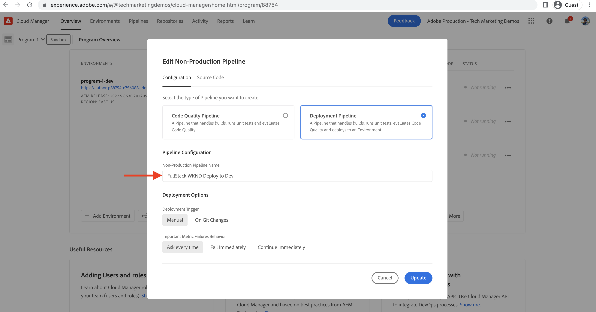

# Implementeren met behulp van de front-end pijplijn

In dit hoofdstuk, creëren wij en stellen een front-end pijpleiding in de Manager van de Adobe Cloud in werking. De bestanden worden alleen samengesteld op basis van `ui.frontend` en zet hen aan ingebouwde CDN in as a Cloud Service AEM op. Op die manier wordt de  `/etc.clientlibs` gebaseerde front-end levering van resources.

## Doelstellingen {#objectives}

* Creeer en stel een front-end pijpleiding in werking.
* Controleren of front-end resources NIET worden geleverd vanuit `/etc.clientlibs` maar van een nieuwe hostnaam die begint met `https://static-`

## Het gebruiken van de front-end pijpleiding

>[!VIDEO](https://video.tv.adobe.com/v/3409420/)

## Vereisten {#prerequisites}

Dit is een meerdelige zelfstudie en er wordt aangenomen dat de stappen die worden beschreven in het dialoogvenster [Standaard AEM project bijwerken](./update-project.md) zijn voltooid.

Zorg ervoor dat u [rechten om pijpleidingen te maken en te implementeren in Cloud Manager](https://experienceleague.adobe.com/docs/experience-manager-cloud-manager/content/requirements/users-and-roles.html?lang=en#role-definitions) en [toegang tot een AEM as a Cloud Service omgeving](https://experienceleague.adobe.com/docs/experience-manager-cloud-service/content/implementing/using-cloud-manager/manage-environments.html).

## Bestaande pijpleiding hernoemen

De naam van de bestaande pijpleiding wijzigen vanuit __Distribueren naar Dev__ tot  __FullStack WKND-implementatie voor Dev__ door naar de __Configuratie__ tabs __Naam niet-productiepijpleiding__ veld. Dit moet het uitdrukkelijk maken of een pijpleiding volledig-stapel of front-end door enkel zijn naam te bekijken is.

Ook in de __Broncode__ , zorgt u ervoor dat de waarden in de velden Opslagplaats en Git Branch correct zijn en dat de vertakking de wijzigingen in uw eerstelijns pijpleidingcontract bevat.

## Een front-end pijplijn maken

Naar __ALLEEN__ bouwen en de front-end middelen van `ui.frontend` voert u de volgende stappen uit:

1. In de interface van Cloud Manager gaat u van de __Pijpleidingen__ sectie, klikt u op __Toevoegen__ selecteert u vervolgens __Niet-productiepijpleiding toevoegen__ (of __Productiepijpleiding toevoegen__) gebaseerd op de AEM as a Cloud Service omgeving waarin u wilt implementeren.

1. In de __Niet-productiepijpleiding toevoegen__ als onderdeel van de __Configuratie__ stappen selecteert u de __Implementatiepijp__ optie, naam geven als __FrontEnd WKND-implementatie naar Dev__ en klik op __Doorgaan__

1. Als onderdeel van het __Broncode__ stappen selecteert u de __Code frontend__ en kiest u de omgeving uit __In aanmerking komende implementatieomgevingen__. In de __Broncode__ de sectie zorgt ervoor dat de waarden van de het gebiedswaarden van de Opslagplaats en van de Tak van het Bewaarplaats correct zijn en de tak uw voorste-eindveranderingen van het pijpleidingscontract heeft.
en __belangrijkste__ voor de __Codelocatie__ veld de waarde is `/ui.frontend` en ten slotte klikt u op __Opslaan__.

## Implementatiereeks

* Voer de nieuwe naam eerst uit __FullStack WKND-implementatie voor Dev__ pijpleiding om de KND clientlib dossiers uit de AEM bewaarplaats te verwijderen. En het belangrijkste is de AEM voor het front-end pijpleidingscontract door toe te voegen __Configureren__ bestanden (`SiteConfig`, `HtmlPageItemsConfig`).

>[!WARNING]
>
>Na, __FullStack WKND-implementatie voor Dev__ voltooiing van de pijpleiding u zult hebben __ongestipt__ WKND-site, die mogelijk beschadigd lijkt. Gelieve te plannen voor een stroomonderbreking of op te stellen tijdens oneven uren, is dit een eenmalig onderbreking u voor tijdens de aanvankelijke schakelaar van het gebruiken van één enkele full-stack pijpleiding aan de front-end pijpleiding moet plannen.

* Als laatste voert u de __FrontEnd WKND-implementatie naar Dev__ pijpleiding om slechts te bouwen `ui.frontend` en stel direct de front-end middelen aan CDN op.

>[!IMPORTANT]
>
>U merkt dat de __ongestipt__ De WKND-site is weer normaal en dit keer __FrontEnd__ de pijpleiding uitvoerde veel sneller dan de full-stack pijpleiding.

## Stijlwijzigingen en nieuw leveringsparadigma controleren

* Open de WKND-site op een willekeurige pagina en u kunt de tekstkleur bekijken __Adobe rood__ en de front-end (CSS, JS) dossiers worden geleverd van CDN. De hostnaam van de resourceaanvraag begint met `https://static-pXX-eYY.p123-e456.adobeaemcloud.com/$HASH_VALUE$/theme/site.css` en ook de site.js of andere statische bronnen waarnaar u verwijst in het dialoogvenster `HtmlPageItemsConfig` bestand.

>[!TIP]
>
>De `$HASH_VALUE$` hier is hetzelfde als wat je ziet in de __FrontEnd WKND-implementatie naar Dev__  pijpleiding __HASH INHOUD__ veld. AEM wordt op de hoogte gebracht van de CDN-URL van de front-end bron. De waarde wordt opgeslagen bij `/conf/wknd/sling:configs/com.adobe.cq.wcm.core.components.config.HtmlPageItemsConfig/jcr:content` krachtens __prefixPath__ eigenschap.

## Gefeliciteerd! {#congratulations}

Gefeliciteerd, creeerde u, in werking stelde, en verifieerde de voorste-Eind pijpleiding die slechts bouwt en de module &quot;ui.frontend&quot;van het project van Plaatsen WKND opstelt. Nu kan uw front-end team snel het ontwerp en front-end gedrag van de site doorlopen, buiten de levenscyclus van het volledige AEM project.

## Volgende stappen {#next-steps}

In het volgende hoofdstuk: [Overwegingen](considerations.md), zult u de gevolgen voor het front-end en back-end ontwikkelingsproces evalueren.
