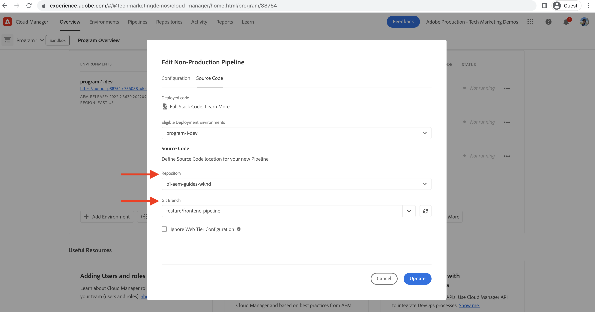

# Implementeren met behulp van de front-end pijplijn

In dit hoofdstuk, creëren en leiden wij een front-end pijpleiding in Adobe Cloud Manager. De toepassing bouwt alleen de bestanden van de module `ui.frontend` en implementeert deze naar de ingebouwde CDN in AEM as a Cloud Service. Op die manier kunt u zich verplaatsen van de op `/etc.clientlibs` gebaseerde front-end resources levering.

## Doelstellingen {#objectives}

* Creeer en stel een front-end pijpleiding in werking.
* Controleren of front-end bronnen NIET worden geleverd vanuit `/etc.clientlibs` maar vanuit een nieuwe hostnaam die begint met `https://static-`

## Het gebruiken van de front-end pijpleiding

>[!VIDEO](https://video.tv.adobe.com/v/3409420?quality=12&learn=on)

## Vereisten {#prerequisites}

Dit is een meerdelig leerprogramma en men veronderstelt dat de stappen in het [ StandaardProject van AEM van de Update ](./update-project.md) worden geschetst zijn voltooid.

Verzeker u [ voorrechten hebt om, pijpleidingen in Cloud Manager ](https://experienceleague.adobe.com/docs/experience-manager-cloud-manager/content/requirements/users-and-roles.html?lang=en#role-definitions) te creëren en op te stellen en [ toegang tot een milieu van AEM as a Cloud Service ](https://experienceleague.adobe.com/docs/experience-manager-cloud-service/content/implementing/using-cloud-manager/manage-environments.html).

## Bestaande pijpleiding hernoemen

Wijzig de bestaande pijpleiding van __opstellen aan Dev__ aan __FullStack WKND opstellen aan Dev__ door naar het __van de Configuratie__ lusje __niet-Productie van de Pijpleiding van de Configuratie__ gebied te gaan. Dit moet het uitdrukkelijk maken of een pijpleiding volledig-stapel of front-end door enkel zijn naam te bekijken is.

Ook in het __lusje van de Code van Source__, zorg ervoor dat de het gebiedswaarden van de Tak van de Bewaarplaats en van de Plaats correct zijn en de tak uw front-end pijpleidingscontractveranderingen heeft.

## Een front-end pijplijn maken

__SLECHTS__ bouwt en stelt de front-end middelen van de `ui.frontend` module op, voert de volgende stappen uit:

1. In Cloud Manager UI, van de __sectie 0} Pijpleidingen {, klik__ toevoegen __knoop, dan uitgezocht__ voeg niet-Productiepijpleiding __toe (of__ voeg de Pijpleiding van de Productie __toe) die op het milieu van AEM as a Cloud Service wordt gebaseerd u wilt opstellen aan.__

1. In __voeg de dialoog van de Pijpleiding van de Niet-Productie__ toe, als deel van de __3} stappen van de Configuratie, selecteer de__ Optie van de Pijpleiding van de Plaatsing __, noem het als__ Op te stellen FrontEnd WKND __, en klik__ gaat __verder__

1. Als deel van de __stappen van de Code van 0} Source, selecteer de__ Voorste optie van de Code van het Eind __, en kies het milieu van__ In aanmerking komende Milieu&#39;s van de Plaatsing __.__ In de __sectie van de Code van Source__ zorgt ervoor dat de het gebiedswaarden van de Tak van de Bewaarplaats en van het Git correct zijn en de tak uw voorste veranderingen van het pijpleidingscontract heeft.
En __het belangrijkst__ voor het __gebied van de Plaats van de Code__ is de waarde `/ui.frontend` en tenslotte, klik __sparen__.

## Implementatiereeks

* Eerst in werking stelt nieuw anders genoemd __FullStack WKND opstelt om__ pijpleiding te ontwikkelen om de KND clientlib dossiers uit de bewaarplaats van AEM te verwijderen. En het belangrijkst bereidt AEM voor het front-end pijpleidingscontract voor door __het Sling config__ dossiers (`SiteConfig`, `HtmlPageItemsConfig`) toe te voegen.

>[!WARNING]
>
>Na, zal het __FullStack WKND opstellen om__ pijpleidingsvoltooiing te ontwikkelen u een __niet gestileerde__ Plaats hebben WKND, die gebroken kan lijken. Gelieve te plannen voor een stroomonderbreking of op te stellen tijdens oneven uren, is dit een eenmalig onderbreking u voor tijdens de aanvankelijke schakelaar van het gebruiken van één enkele full-stack pijpleiding aan de front-end pijpleiding moet plannen.

* Tot slot stel __FrontEnd WKND in werking stelt om__ pijpleiding te ontwikkelen om slechts `ui.frontend` module te bouwen en de front-end middelen direct aan CDN op te stellen.

>[!IMPORTANT]
>
>U merkt dat de __ongestileerde__ plaats WKND terug naar normaal is en deze tijd __3} pijpleiding FrontEnd {was veel sneller dan de volledig-stapelpijpleiding.__

## Stijlwijzigingen en nieuw leveringsparadigma controleren

* Open om het even welke pagina van de Plaats WKND en u kunt de tekstkleur zien ons __Rood Adobe__ en de front-end middelen (CSS, JS) dossiers worden geleverd van CDN. De hostnaam van de bronaanvraag begint met `https://static-pXX-eYY.p123-e456.adobeaemcloud.com/$HASH_VALUE$/theme/site.css` en op dezelfde manier met site.js of andere statische bronnen waarnaar u verwijst in het `HtmlPageItemsConfig` -bestand.

>[!TIP]
>
>`$HASH_VALUE$` hier is het zelfde als wat u in __FrontEnd WKND ziet opstellen aan Dev__ 3} HASH van de INHOUD van de pijpleiding {__gebied.__ AEM wordt op de hoogte gebracht van CDN URL van het front-end middel, wordt de waarde opgeslagen bij `/conf/wknd/sling:configs/com.adobe.cq.wcm.core.components.config.HtmlPageItemsConfig/jcr:content` onder __prefixPath__ bezit.

## Gefeliciteerd! {#congratulations}

Gefeliciteerd, creeerde u, in werking stelde, en verifieerde de voorste-Eind pijpleiding die slechts bouwt en de module &quot;ui.frontend&quot;van het project van Plaatsen WKND opstelt. Nu kan uw front-end team snel het ontwerp en front-end gedrag van de site doorlopen, buiten de volledige levenscyclus van het AEM-project.

## Volgende stappen {#next-steps}

In het volgende hoofdstuk, [ Overwegingen ](considerations.md), zult u het effect op het front-end en back-end ontwikkelingsproces herzien.
