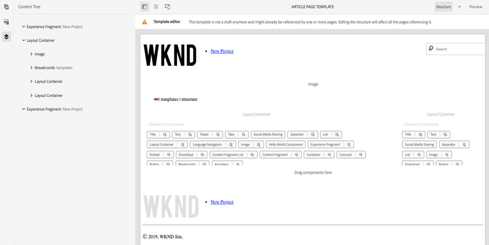
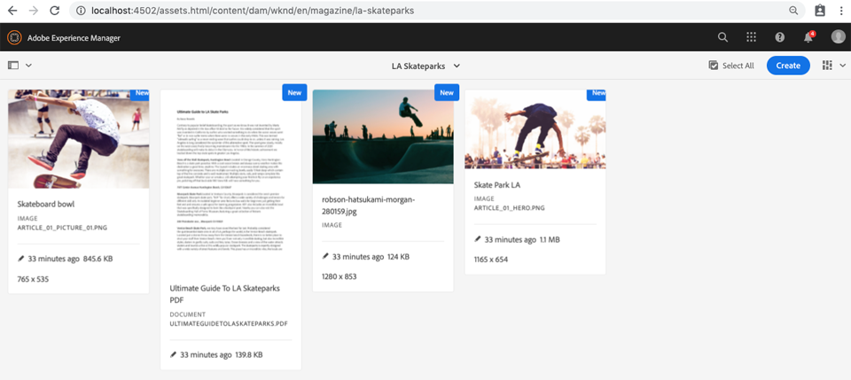

# Pagina&#39;s en sjablonen {#pages-and-template}

In dit hoofdstuk onderzoeken we de relatie tussen een component van de basispagina en bewerkbare sjablonen. Op basis van bepaalde modellen van [AdobeXD](https://www.adobe.com/products/xd.html)maken we een niet-opgemaakte artikelsjabloon. In het proces om het malplaatje uit te bouwen, zijn de Componenten van de Kern en de geavanceerde beleidsconfiguraties van de Bewerkbare Malplaatjes behandeld.

## Vereisten {#prerequisites}

Controleer de vereiste gereedschappen en instructies voor het instellen van een [lokale ontwikkelomgeving](overview.md#local-dev-environment).

### Starter-project

Bekijk de basislijncode waarop de zelfstudie is gebaseerd:

1. Clone the [github.com/adobe/aem-guides-wknd](https://github.com/adobe/aem-guides-wknd) repository.
1. Bekijk de `pages-templates/start` vertakking.

   ```shell
   $ git clone git@github.com:adobe/aem-guides-wknd.git ~/code/aem-guides-wknd
   $ cd ~/code/aem-guides-wknd
   $ git checkout pages-templates/start
   ```

1. Stel codebasis aan een lokale AEM instantie op gebruikend uw Maven vaardigheden:

   ```shell
   $ cd ~/code/aem-guides-wknd
   $ mvn clean install -PautoInstallSinglePackage
   ```

U kunt de gebeëindigde code op [GitHub](https://github.com/adobe/aem-guides-wknd/tree/pages-templates/solution) altijd bekijken of de code plaatselijk controleren door aan de tak te schakelen `pages-templates/solution`.

## Doelstelling

1. Inspect a page design created in Adobe XD and map it to Core Components.
1. Begrijp de details van Bewerkbare Malplaatjes en hoe het beleid kan worden gebruikt om korrelige controle van paginainhoud af te dwingen.
1. Leer hoe sjablonen en pagina&#39;s zijn gekoppeld

## Wat u gaat maken {#what-you-will-build}

In dit gedeelte van de zelfstudie maakt u een nieuwe artikelpaginasjabloon die u kunt gebruiken om nieuwe artikelpagina&#39;s te maken en deze uit te lijnen met een gemeenschappelijke structuur. Het sjabloon voor artikelpagina wordt gebaseerd op ontwerpen en een UI-kit die in AdobeXD wordt gemaakt. Dit hoofdstuk is alleen gericht op het opbouwen van de structuur of het skelet van de sjabloon. Er worden geen stijlen geïmplementeerd, maar de sjabloon en pagina&#39;s zijn functioneel.


## UI-planning met Adobe XD {#adobexd}

In de meeste gevallen begint de planning voor een nieuwe website met modellen en statische ontwerpen. [Adobe XD](https://www.adobe.com/products/xd.html) is een ontwerpprogramma waarmee gebruikers een ervaring kunnen opbouwen. Vervolgens inspecteren we een UI-kit en -modellen om de structuur van het sjabloon voor artikelpagina te helpen plannen.

>[!VIDEO](https://video.tv.adobe.com/v/30214/?quality=12&learn=on)

Download het [WKND-artikelontwerpbestand](https://github.com/adobe/aem-guides-wknd/releases/download/aem-guides-wknd-0.0.2/AEM_UI-kit-WKND-article-design.xd).

## Een kop- en voettekst maken met ervaringsfragmenten {#experience-fragments}

Bij het maken van algemene inhoud, zoals een kop- of voettekst, wordt vaak gebruikgemaakt van een [ervaringsfragment](https://docs.adobe.com/content/help/en/experience-manager-learn/sites/experience-fragments/experience-fragments-feature-video-use.html). Ervaar Fragments, laat ons toe om veelvoudige componenten te combineren om één enkel, verwijzing-able, component tot stand te brengen. De Fragments van de ervaring hebben het voordeel om multi-plaatsbeheer te steunen en staat ons toe om verschillende kopballen/footers per scène te beheren.

Vervolgens wordt het ervaringsfragment bijgewerkt dat wordt gebruikt als kop- en voettekst om het WKND-logo toe te voegen.

>[!VIDEO](https://video.tv.adobe.com/v/30215/?quality=12&learn=on)

>[!NOTE]
>
> Ziet de Fragmenten van uw Ervaring verschillend dan in de video? Probeer hen te schrappen en de basis van de startprojectcode opnieuw te installeren.

Hieronder ziet u de stappen op hoog niveau die in de bovenstaande video worden uitgevoerd.

1. Werk de koptekst van het fragment van de Ervaring bij in [http://localhost:4502/editor.html/content/experience-fragments/wknd/us/en/site/header/master.html](http://localhost:4502/editor.html/content/experience-fragments/wknd/us/en/site/header/master.html) om het WKND Donkere embleem te omvatten.

   

   *WKND Donker logo*

1. Werk de koptekst van het fragment van de Ervaring bij [http://localhost:4502/editor.html/content/experience-fragments/wknd/us/en/site/footer/master.html](http://localhost:4502/editor.html/content/experience-fragments/wknd/us/en/site/footer/master.html) om het embleem van het Licht van WKND te omvatten.

   

   *WKND Light-logo*

## De sjabloon voor artikelpagina maken

Wanneer u een pagina maakt, moet u een sjabloon selecteren die wordt gebruikt als basis voor het maken van de nieuwe pagina. De sjabloon definieert de structuur van de resulterende pagina, de initiële inhoud en de toegestane componenten.

Er zijn drie hoofdgebieden van [Bewerkbare sjablonen](https://docs.adobe.com/content/help/en/experience-manager-65/developing/platform/templates/page-templates-editable.html):

1. **Structuur** - definieert componenten die deel uitmaken van de sjabloon. Deze kunnen niet worden bewerkt door auteurs van inhoud.
1. **Eerste inhoud** - definieert componenten waarmee de sjabloon begint. Deze kunnen worden bewerkt en/of verwijderd door makers van inhoud
1. **Beleid** - bepaalt configuraties op hoe de componenten zich zullen gedragen en welke optiesauteurs beschikbaar zullen hebben.

Het volgende wat we gaan doen, is het maken van het sjabloon voor artikelpagina. Dit zal in een lokale instantie van AEM voorkomen.

>[!VIDEO](https://video.tv.adobe.com/v/30217/?quality=12&learn=on)

Hieronder ziet u de stappen op hoog niveau die in de bovenstaande video worden uitgevoerd.

1. Navigeer naar de map WKND Sites Template: **Gereedschappen** > **Algemeen** > **Sjablonen** > **WKND-site**
1. Een nieuwe sjabloon maken met de sjabloon Sjabloon voor lege **WKND-site** met een titel van **artikelpaginasjabloon**
1. In de modus **Structuur** configureert u de sjabloon zo dat deze de volgende elementen bevat:

   * Ervaar fragmentkoptekst
   * Afbeelding
   * Broodkruimel
   * Container - 8 kolommen breed bureaublad, 12 kolommen breed tablet, mobiel
   * Container - 4 kolommen breed, 12 kolommen breed tablet, mobiel
   * Ervaring met voettekst fragment

   

   *Structuur - Artikelpaginamplate*

1. Schakel over naar de modus **Oorspronkelijke inhoud** en voeg de volgende componenten toe als startinhoud:

   * **Hoofdcontainer**
      * Titel - standaardgrootte van H1
      * Titel - *&quot;Op naam van auteur&quot;* met een grootte van H4
      * Tekst - leeg
   * **Zijcontainer**
      * Titel - *&quot;Dit artikel delen&quot;* met de grootte H5
      * Delen van sociale media
      * Scheidingsteken
      * Downloaden
      * Lijst

   

   *Oorspronkelijke inhoud - artikelpaginasjabloon*

1. Werk de eigenschappen **van de** eerste pagina bij om het delen van gebruikers voor zowel **Facebook** als **Pinterest** in te schakelen.
1. Upload een afbeelding naar de eigenschappen van de **artikelpaginasjabloon** , zodat deze gemakkelijk kan worden herkend:

   

   *Miniatuur van artikelpaginasjabloon*

1. Schakel de sjablonen voor **artikelpaginasjablonen** in de map [WKND-sitesjablonen](http://localhost:4502/libs/wcm/core/content/sites/templates.html/conf/wknd/settings/wcm/templates)in.

## Een artikelpagina maken

Nu we een sjabloon hebben, maken we een nieuwe pagina met die sjabloon.

1. Download het volgende ZIP-pakket, [WKND-PagesTemplates-DAM-Assets.zip](assets/pages-templates/WKND-PagesTemplates-DAM-Assets.zip) , en installeer het via [CRX Package Manager](http://localhost:4502/crx/packmgr/index.jsp).

   Met het bovenstaande pakket worden verschillende onderliggende afbeeldingen en elementen geïnstalleerd die u kunt gebruiken `/content/dam/wknd/en/magazine/la-skateparks` om een artikelpagina in latere stappen te vullen.

   *Afbeeldingen en elementen in het bovenstaande pakket zijn gratis licenties, met dank aan[Unsplash.com](https://unsplash.com/).*

   

1. Maak een nieuwe pagina onder **WKND** > **US** > **en**, genaamd **Magazine**. Gebruik de sjabloon voor de **inhoudspagina** .

   Deze pagina zal wat structuur aan onze plaats toevoegen en ons toestaan om de component Breadcrumb in actie te zien.

1. Maak vervolgens een nieuwe pagina onder **WKND** > **US** > **en** > **Magazine**. Gebruik de sjabloon **Artikelpagina** . Gebruik een titel van de **ultieme gids voor LA Skateparks** en een naam van **guide-la-skateparks**.

   

1. Vul de pagina met inhoud in zodat deze overeenkomt met de modellen die worden geïnspecteerd in [UI-planning met het AdobeXD](#adobexd) -gedeelte. Hier [](assets/pages-templates/la-skateparks-copy.txt)kunt u voorbeeldtekst voor artikelen downloaden. U zou iets gelijkaardig aan dit moeten kunnen tot stand brengen:

   

   >[!NOTE]
   >
   > De component Image boven aan de pagina kan worden bewerkt, maar niet worden verwijderd. De component breadcrumb wordt op de pagina weergegeven, maar kan niet worden bewerkt of verwijderd.

## Inspect de nodestructuur {#node-structure}

Op dit punt is de artikelpagina duidelijk niet-opgemaakt. De basisstructuur is echter aanwezig. Vervolgens bekijken we de knooppuntstructuur van de artikelpagina om een beter inzicht te krijgen in de rol van de sjabloon en de component van de pagina die verantwoordelijk zijn voor het weergeven van de inhoud.

We kunnen dit doen met het CRXDE-Lite-gereedschap op een lokale AEM.

1. Open [CRXDE-Lite](http://localhost:4502/crx/de/index.jsp#/content/wknd/us/en/magazine/guide-la-skateparks/jcr%3Acontent) en gebruik de boomnavigatie om aan te navigeren `/content/wknd/us/en/magazine/guide-la-skateparks`.

1. Klik op het `jcr:content` knooppunt onder de `la-skateparks` pagina en bekijk de eigenschappen:

   

   Let op de waarde voor `cq:template`, welke verwijst naar `/conf/wknd/settings/wcm/templates/article-page`, het sjabloon voor artikelpagina dat u eerder hebt gemaakt.

   Let ook op de waarde van `sling:resourceType`, waarnaar `wknd/components/structure/page`wordt verwezen. Dit is de paginacomponent die door het AEM projectarchetype wordt gecreeerd en is verantwoordelijk voor het teruggeven van pagina die op het malplaatje wordt gebaseerd.

1. Vouw het onderliggende `jcr:content` knooppunt uit `/content/wknd/us/en/magazine/guide-la-skateparks/jcr:content` en bekijk de hiërarchie van het knooppunt:

   

   U zou elk van de knopen aan componenten moeten kunnen losjes in kaart brengen die werden authored. Kijk of u de verschillende containers voor lay-out kunt identificeren die worden gebruikt door de knooppunten te inspecteren die vooraf zijn ingesteld `responsivegrid`.

1. Controleer vervolgens de paginacomponent bij `/apps/wknd/components/structure/page`. De componenteigenschappen weergeven in CRXDE Lite:

   

   De paginacomponent bevindt zich onder een map met de naam **structure**. Dit is een conventie die overeenkomt met de structuurmodus van de Sjablooneditor en die wordt gebruikt om aan te geven dat de paginacomponent niet iets is waarmee auteurs rechtstreeks zullen werken.

   Er zijn slechts 2 HTML-scripts `customfooterlibs.html` en `customheaderlibs.html` onder de paginacomponent. Hoe geeft deze component de pagina weer?

   Noteer de `sling:resourceSuperType` eigenschap en de waarde van `core/wcm/components/page/v2/page`. Met deze eigenschap kan de paginacomponent van de WKND alle functionaliteit van de pagina-component Core Component overnemen. Dit is het eerste voorbeeld van iets genoemd het Patroon van de Component van de [Volmacht](https://docs.adobe.com/content/help/en/experience-manager-core-components/using/developing/guidelines.html#ProxyComponentPattern). Meer informatie vindt u [hier.](https://docs.adobe.com/content/help/en/experience-manager-core-components/using/developing/guidelines.html).

1. Inspect een andere component binnen de componenten WKND, de `Breadcrumb` component die bij wordt gevestigd: `/apps/wknd/components/content/breadcrumb`. U ziet dat dezelfde `sling:resourceSuperType` eigenschap kan worden gevonden, maar deze keer verwijst deze naar `core/wcm/components/breadcrumb/v2/breadcrumb`. Dit is een ander voorbeeld van het gebruiken van het de componentenpatroon van de Volmacht om een Component van de Kern te omvatten. In feite, zijn alle componenten in de WKND codebasis volmachten van AEM Componenten van de Kern (behalve onze beroemde component HelloWorld). Het is aan te raden zoveel mogelijk van de functionaliteit van Core Components te proberen en opnieuw te gebruiken *voordat* u aangepaste code schrijft.

1. Controleer vervolgens de pagina Core Component bij `/apps/core/wcm/components/page/v2/page` gebruik van CRXDE Lite:

   

   U ziet dat er nog veel meer scripts onder deze pagina staan. De pagina Core Component bevat veel functionaliteit. Deze functionaliteit is opgedeeld in meerdere scripts voor eenvoudiger onderhoud en leesbaarheid. U kunt de opname van de HTML-scripts traceren door de `page.html` pagina te openen en te zoeken `data-sly-include`:

   ```html
   <!--/* /apps/core/wcm/components/page/v2/page/page.html */-->
   <!DOCTYPE HTML>
   <html data-sly-use.page="com.adobe.cq.wcm.core.components.models.Page" lang="${page.language}"
           data-sly-use.head="head.html"
           data-sly-use.footer="footer.html"
           data-sly-use.redirect="redirect.html">
       <head data-sly-call="${head.head @ page = page}"></head>
       <body class="${page.cssClassNames}">
           <sly data-sly-test.isRedirectPage="${page.redirectTarget && (wcmmode.edit || wcmmode.preview)}"
               data-sly-call="${redirect.redirect @ redirectTarget = page.redirectTarget}"></sly>
           <sly data-sly-test="${!isRedirectPage}">
               <sly data-sly-include="body.socialmedia_begin.html"></sly>
               <sly data-sly-include="body.html"></sly>
               <sly data-sly-call="${footer.footer @ page = page}"></sly>
               <sly data-sly-include="body.socialmedia_end.html"></sly>
           </sly>
       </body>
   </html>
   ```

   De andere reden om HTML in veelvoudige manuscripten uit te breken is de volmachtscomponenten toe te staan om individuele manuscripten met voeten te treden om douanebedrijfslogica uit te voeren. De manuscripten van HTML, `customfooterlibs.html` en `customheaderlibs.html`, worden gecreeerd voor het expliciete doel dat door het uitvoeren van projecten moet worden met voeten getreden.

   Als u dit artikel [leest, kunt u meer weten over de manier waarop de bewerkbare sjabloon invloed heeft op de rendering van de](https://docs.adobe.com/content/help/en/experience-manager-65/developing/platform/templates/page-templates-editable.html#resultant-content-pages)inhoudspagina.

1. Inspect de andere Core Component, zoals de Breadcrumb op `/apps/core/wcm/components/breadcrumb/v2/breadcrumb`. Bekijk het `breadcrumb.html` manuscript om te begrijpen hoe de prijsverhoging voor de component Breadcrumb uiteindelijk wordt geproduceerd.

## Configuraties opslaan naar bronbeheer {#configuration-persistence}

In veel gevallen, vooral aan het begin van een AEM project is het waardevol om configuraties, zoals malplaatjes en verwant inhoudsbeleid, aan broncontrole voort te zetten. Dit zorgt ervoor dat alle ontwikkelaars tegen de zelfde reeks inhoud en configuraties werken en extra consistentie tussen milieu&#39;s kunnen verzekeren. Wanneer een project een bepaald ontwikkelingsniveau heeft bereikt, kan het beheren van sjablonen worden overgedragen aan een speciale groep van energiegebruikers.

Momenteel behandelen wij de malplaatjes als andere stukken van code en synchroniseren neer het Malplaatje **van de Pagina van het** Artikel als deel van het project. Tot nu toe hebben we code **geduwd** van ons AEM project naar een lokale instantie van AEM. Het sjabloon voor **artikelpagina** is rechtstreeks gemaakt op een lokaal AEM, dus we moeten de sjabloon **ophalen** of importeren in ons AEM project. De module **ui.content** is voor dit specifieke doel opgenomen in het AEM project.

De volgende paar stappen zullen plaatsvinden gebruikend winde van de Verduistering, maar zouden kunnen doen gebruikend om het even welke winde die u hebt gevormd om inhoud van een lokaal geval van AEM te **trekken** of in te voeren.

1. In winde van de Verduistering, zorg ervoor dat een server de verbindende AEM het hulpmiddelstop van het ontwikkelaarshulpmiddel aan de lokale instantie van AEM is begonnen en dat de module **ui.content** aan de configuratie van de Server is toegevoegd.

   

1. Breid de module **ui.content** in de ontdekkingsreiziger van het Project uit. Vouw de `src` map uit (de map met het pictogram voor kleine handjes) en navigeer naar `/conf/wknd/settings/wcm/templates`.

1. [!UICONTROL Right+Click] het `templates` knooppunt en selecteer **Importeren vanaf server...**:

   

   Bevestig het dialoogvenster **Importeren uit opslagplaats** en klik op **Voltooien**. U moet nu de map `article-page-template` onder de `templates` map zien.

1. Herhaal de stappen voor het importeren van inhoud, maar selecteer het knooppunt **policy** in `/conf/wknd/settings/wcm/policies`.

   

1. Inspect het `filter.xml` bestand op `src/main/content/META-INF/vault/filter.xml`.

   ```xml
   <!--ui.content filter.xml-->
   <?xml version="1.0" encoding="UTF-8"?>
   <workspaceFilter version="1.0">
       <filter root="/conf/wknd" mode="merge"/>
       <filter root="/content/wknd" mode="merge"/>
       <filter root="/content/dam/wknd" mode="merge"/>
       <filter root="/content/experience-fragments/wknd" mode="merge"/>
   </workspaceFilter>
   ```

   Het `filter.xml` bestand identificeert de paden van knooppunten die samen met het pakket worden geïnstalleerd. Let op het `mode="merge"` bij elk van de filters dat aangeeft dat bestaande inhoud niet wordt gewijzigd, alleen nieuwe inhoud wordt toegevoegd. Aangezien de inhoudsauteurs deze wegen kunnen bijwerken, is het belangrijk dat een codeplaatsing **geen** inhoud overschrijft. Raadpleeg de documentatie [bij](https://jackrabbit.apache.org/filevault/filter.html) FileVault voor meer informatie over het werken met filterelementen.

   Vergelijk `ui.content/src/main/content/META-INF/vault/filter.xml` en `ui.apps/src/main/content/META-INF/vault/filter.xml` om de verschillende knopen te begrijpen die door elke module worden beheerd.

   >[!WARNING]
   >
   > Om verenigbare plaatsingen voor de plaats van de Verwijzing te verzekeren WKND zijn sommige takken van het project opstelling dusdanig dat om het even welke veranderingen in JCR `ui.content` zal beschrijven. Dit is door ontwerp, d.w.z. voor de Tak van de Oplossing, aangezien de code/de stijlen voor specifiek beleid zullen worden geschreven.

## Gefeliciteerd! {#congratulations}

Je hebt zojuist een nieuwe sjabloon en pagina met Adobe Experience Manager Sites gemaakt.

### Volgende stappen {#next-steps}

Op dit punt is de artikelpagina duidelijk niet-opgemaakt. Volg de zelfstudie [Client-Side Libraries en Front-end Workflow](client-side-libraries.md) om de beste werkwijzen te leren voor het opnemen van CSS en Javascript om globale stijlen op de site toe te passen en een speciale front-end build te integreren.

Bekijk de gebeëindigde code op [GitHub](https://github.com/adobe/aem-guides-wknd) of herzie en stel plaatselijk de code bij de schakelaar van de Git in `pages-templates/solution`.

1. Clone the [github.com/adobe/aem-wknd-guides](https://github.com/adobe/aem-guides-wknd) repository.
1. Bekijk de `pages-templates/solution` vertakking.
