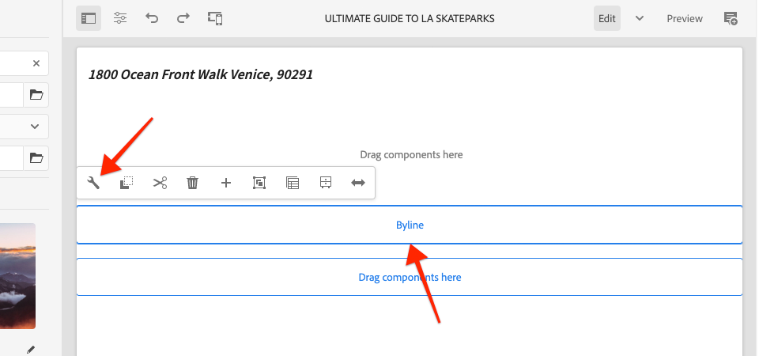

# Aangepaste component {#custom-component}

Deze zelfstudie behandelt de verwezenlijking van begin tot eind van een douane AEM Component van de Bodline die inhoud toont authored in een Dialoog, en verkent het ontwikkelen van een het Verzamelen Model om bedrijfslogica in te kapselen die HTML van de component bevolkt.

## Vereisten {#prerequisites}

Controleer de vereiste gereedschappen en instructies voor het instellen van een [lokale ontwikkelomgeving](overview.md#local-dev-environment).

### Starter-project

>[!NOTE]
>
> Als u met succes het vorige hoofdstuk voltooide kunt u het project hergebruiken en de stappen overslaan voor het uitchecken van het starterproject.

Bekijk de basislijncode waarop de zelfstudie is gebaseerd:

1. Ontdek de `tutorial/custom-component-start`-vertakking van [GitHub](https://github.com/adobe/aem-guides-wknd)

   ```shell
   $ cd aem-guides-wknd
   $ git checkout tutorial/custom-component-start
   ```

1. Stel codebasis aan een lokale AEM instantie op gebruikend uw Maven vaardigheden:

   ```shell
   $ mvn clean install -PautoInstallSinglePackage
   ```

   >[!NOTE]
   >
   > Als u AEM 6.5 of 6.4 gebruikt, voegt u het `classic`-profiel toe aan alle Maven-opdrachten.

   ```shell
   $ mvn clean install -PautoInstallSinglePackage -Pclassic
   ```

U kunt de gebeëindigde code op [GitHub](https://github.com/adobe/aem-guides-wknd/tree/tutorial/custom-component-solution) altijd bekijken of de code plaatselijk controleren door aan de tak `tutorial/custom-component-solution` te schakelen.

## Doelstelling

1. Begrijp hoe te om een douane AEM component te bouwen
1. Leer om bedrijfslogica met het Verkopen Modellen in te kapselen
1. Begrijp hoe te om een het Verdelen Model van binnen een Manuscript van HTML te gebruiken

## Wat u gaat maken {#byline-component}

In dit deel van de WKND-zelfstudie wordt een Byline-component gemaakt die wordt gebruikt om geschreven informatie over de auteur van een artikel weer te geven.


*Byline-component*

De implementatie van de component Byline bevat een dialoogvenster waarin de inhoud van de bylijn wordt verzameld en een aangepast Sling-model waarmee de volgende byline-inhoud wordt opgehaald:

* Naam
* Afbeelding
* Beroep

## Byline-component maken {#create-byline-component}

Maak eerst de knooppuntstructuur van de component Byline en definieer een dialoogvenster. Dit vertegenwoordigt de Component in AEM en bepaalt impliciet het middeltype van de component door zijn plaats in JCR.

In het dialoogvenster wordt de interface weergegeven waarmee auteurs van inhoud kunnen werken. Voor deze implementatie wordt de AEM WCM Core-component **Image** gebruikt om het maken en renderen van de afbeelding van de Byline af te handelen, zodat deze wordt ingesteld als `sling:resourceSuperType` van onze component.

### Componentdefinitie maken {#create-component-definition}

1. Navigeer in de module **ui.apps** naar `/apps/wknd/components` en maak een nieuwe map met de naam `byline`.
1. Voeg onder de map `byline` een nieuw bestand met de naam `.content.xml` toe

   

1. Vul het `.content.xml`-bestand met het volgende:

   ```xml
   <?xml version="1.0" encoding="UTF-8"?>
       <jcr:root xmlns:sling="http://sling.apache.org/jcr/sling/1.0" xmlns:cq="http://www.day.com/jcr/cq/1.0" xmlns:jcr="http://www.jcp.org/jcr/1.0"
       jcr:primaryType="cq:Component"
       jcr:title="Byline"
       jcr:description="Displays a contributor's byline."
       componentGroup="WKND Sites Project - Content"
       sling:resourceSuperType="core/wcm/components/image/v2/image"/>
   ```

   Het bovenstaande XML-bestand bevat de definitie voor de component, inclusief de titel, beschrijving en groep. De `sling:resourceSuperType` verwijst naar `core/wcm/components/image/v2/image`, de [Core Image Component](https://experienceleague.adobe.com/docs/experience-manager-core-components/using/components/image.html).

### HTML-script maken {#create-the-htl-script}

1. Voeg onder de map `byline` een nieuw bestand `byline.html` toe, dat verantwoordelijk is voor de HTML-presentatie van de component. Het is belangrijk het bestand dezelfde naam te geven als de map, omdat dit het standaardscript Sling wordt dat wordt gebruikt om dit brontype te renderen.

1. Voeg de volgende code aan `byline.html` toe.

   ```html
   <!--/* byline.html */-->
   <div data-sly-use.placeholderTemplate="core/wcm/components/commons/v1/templates.html">
   </div>
   <sly data-sly-call="${placeholderTemplate.placeholder @ isEmpty=true}"></sly>
   ```

`byline.html` wordt later [ ](#byline-htl)herzien, zodra het het Verkopen Model wordt gecreeerd. De huidige staat van het HTML- dossier staat de component toe om in een leeg staat, in de Redacteur van de Pagina van de Plaatsen van AEM te tonen wanneer het wordt gesleept en op de pagina gelaten vallen.

### De definitie van het dialoogvenster maken {#create-the-dialog-definition}

Definieer vervolgens een dialoogvenster voor de component Byline met de volgende velden:

* **Naam**: Een tekstveld waarin de naam van de contribuant wordt weergegeven.
* **Afbeelding**: een verwijzing naar het biobeeld van de contribuant.
* **Beroep**: een lijst van beroepen die aan de contribuant worden toegeschreven. De beroepen moeten alfabetisch in oplopende volgorde (a tot en met z) worden gesorteerd.

1. Onder de `byline` omslag, creeer een nieuwe omslag genoemd `_cq_dialog`.
1. Voeg hieronder `byline/_cq_dialog` een nieuw bestand met de naam `.content.xml` toe. Dit is de XML-definitie voor het dialoogvenster. Voeg de volgende XML toe:

   ```xml
   <?xml version="1.0" encoding="UTF-8"?>
   <jcr:root xmlns:sling="http://sling.apache.org/jcr/sling/1.0" xmlns:cq="http://www.day.com/jcr/cq/1.0" xmlns:jcr="http://www.jcp.org/jcr/1.0" xmlns:nt="http://www.jcp.org/jcr/nt/1.0"
           jcr:primaryType="nt:unstructured"
           jcr:title="Byline"
           sling:resourceType="cq/gui/components/authoring/dialog">
       <content
               jcr:primaryType="nt:unstructured"
               sling:resourceType="granite/ui/components/coral/foundation/container">
           <items jcr:primaryType="nt:unstructured">
               <tabs
                       jcr:primaryType="nt:unstructured"
                       sling:resourceType="granite/ui/components/coral/foundation/tabs"
                       maximized="{Boolean}false">
                   <items jcr:primaryType="nt:unstructured">
                       <asset
                               jcr:primaryType="nt:unstructured"
                               sling:hideResource="{Boolean}false"/>
                       <metadata
                               jcr:primaryType="nt:unstructured"
                               sling:hideResource="{Boolean}true"/>
                       <properties
                               jcr:primaryType="nt:unstructured"
                               jcr:title="Properties"
                               sling:resourceType="granite/ui/components/coral/foundation/container"
                               margin="{Boolean}true">
                           <items jcr:primaryType="nt:unstructured">
                               <columns
                                       jcr:primaryType="nt:unstructured"
                                       sling:resourceType="granite/ui/components/coral/foundation/fixedcolumns"
                                       margin="{Boolean}true">
                                   <items jcr:primaryType="nt:unstructured">
                                       <column
                                               jcr:primaryType="nt:unstructured"
                                               sling:resourceType="granite/ui/components/coral/foundation/container">
                                           <items jcr:primaryType="nt:unstructured">
                                               <name
                                                       jcr:primaryType="nt:unstructured"
                                                       sling:resourceType="granite/ui/components/coral/foundation/form/textfield"
                                                       emptyText="Enter the contributor's name to display."
                                                       fieldDescription="The contributor's name to display."
                                                       fieldLabel="Name"
                                                       name="./name"
                                                       required="{Boolean}true"/>
                                               <occupations
                                                       jcr:primaryType="nt:unstructured"
                                                       sling:resourceType="granite/ui/components/coral/foundation/form/multifield"
                                                       fieldDescription="A list of the contributor's occupations."
                                                       fieldLabel="Occupations"
                                                       required="{Boolean}false">
                                                   <field
                                                           jcr:primaryType="nt:unstructured"
                                                           sling:resourceType="granite/ui/components/coral/foundation/form/textfield"
                                                           emptyText="Enter an occupation"
                                                           name="./occupations"/>
                                               </occupations>
                                           </items>
                                       </column>
                                   </items>
                               </columns>
                           </items>
                       </properties>
                   </items>
               </tabs>
           </items>
       </content>
   </jcr:root>
   ```

   Deze definities van dialoogknooppunten gebruiken [Sling Resource Merger](https://sling.apache.org/documentation/bundles/resource-merger.html) om te bepalen welke dialooglusjes van de `sling:resourceSuperType` component, in dit geval **de component van het Beeld van de Componenten van de Kern** worden geërft.

   

### Het dialoogvenster Beleid maken {#create-the-policy-dialog}

Na de zelfde benadering zoals met de verwezenlijking van de Dialoog, creeer een dialoog van het Beleid (die vroeger als Dialoog van het Ontwerp wordt bekend) om ongewenste gebieden in de configuratie van het Beleid te verbergen die van de component van het Beeld van de Componenten van de Kern wordt geërft.

1. Onder de `byline` omslag, creeer een nieuwe omslag genoemd `_cq_design_dialog`.
1. Onder `byline/_cq_design_dialog` creeer een nieuw dossier genoemd `.content.xml`. Werk het bestand bij met het volgende: met de volgende XML. Het is het eenvoudigst om `.content.xml` te openen en de onderstaande XML erin te kopiëren/plakken.

   ```xml
   <?xml version="1.0" encoding="UTF-8"?>
   <jcr:root xmlns:sling="http://sling.apache.org/jcr/sling/1.0" xmlns:granite="http://www.adobe.com/jcr/granite/1.0" xmlns:cq="http://www.day.com/jcr/cq/1.0" xmlns:jcr="http://www.jcp.org/jcr/1.0" xmlns:nt="http://www.jcp.org/jcr/nt/1.0"
       jcr:primaryType="nt:unstructured"
       jcr:title="Byline"
       sling:resourceType="cq/gui/components/authoring/dialog">
       <content
               jcr:primaryType="nt:unstructured">
           <items jcr:primaryType="nt:unstructured">
               <tabs
                       jcr:primaryType="nt:unstructured">
                   <items jcr:primaryType="nt:unstructured">
                       <properties
                               jcr:primaryType="nt:unstructured">
                           <items jcr:primaryType="nt:unstructured">
                               <content
                                       jcr:primaryType="nt:unstructured">
                                   <items jcr:primaryType="nt:unstructured">
                                       <decorative
                                               jcr:primaryType="nt:unstructured"
                                               sling:hideResource="{Boolean}true"/>
                                       <altValueFromDAM
                                               jcr:primaryType="nt:unstructured"
                                               sling:hideResource="{Boolean}true"/>
                                       <titleValueFromDAM
                                               jcr:primaryType="nt:unstructured"
                                               sling:hideResource="{Boolean}true"/>
                                       <displayCaptionPopup
                                               jcr:primaryType="nt:unstructured"
                                               sling:hideResource="{Boolean}true"/>
                                       <disableUuidTracking
                                               jcr:primaryType="nt:unstructured"
                                               sling:hideResource="{Boolean}true"/>
                                   </items>
                               </content>
                           </items>
                       </properties>
                       <features
                               jcr:primaryType="nt:unstructured">
                           <items jcr:primaryType="nt:unstructured">
                               <content
                                       jcr:primaryType="nt:unstructured">
                                   <items jcr:primaryType="nt:unstructured">
                                       <accordion
                                               jcr:primaryType="nt:unstructured">
                                           <items jcr:primaryType="nt:unstructured">
                                               <orientation
                                                       jcr:primaryType="nt:unstructured"
                                                       sling:hideResource="{Boolean}true"/>
                                               <crop
                                                       jcr:primaryType="nt:unstructured"
                                                       sling:hideResource="{Boolean}true"/>
                                           </items>
                                       </accordion>
                                   </items>
                               </content>
                           </items>
                       </features>
                   </items>
               </tabs>
           </items>
       </content>
   </jcr:root>
   ```

   De basis voor het voorafgaande **Beleidsdialoog** XML werd verkregen van [de component van het Beeld van de Componenten van de Kern ](https://github.com/adobe/aem-core-wcm-components/blob/master/content/src/content/jcr_root/apps/core/wcm/components/image/v2/image/_cq_design_dialog/.content.xml).

   Net als in de configuratie van de Dialoog, [Sling Resource Merger](https://sling.apache.org/documentation/bundles/resource-merger.html) wordt gebruikt om irrelevante gebieden te verbergen die anders van `sling:resourceSuperType`, zoals gezien door de knoopdefinities met `sling:hideResource="{Boolean}true"` bezit worden geërft.

### De code implementeren {#deploy-the-code}

1. Implementeer de bijgewerkte codebasis naar een lokale AEM met behulp van uw Maven-vaardigheden:

   ```shell
   $ cd aem-guides-wknd
   $ mvn clean install -PautoInstallSinglePackage
   ```

## De component aan een pagina toevoegen {#add-the-component-to-a-page}

Om dingen eenvoudig te houden en zich op AEM componentenontwikkeling te concentreren, zullen wij de component Byline in zijn huidige staat aan een pagina van het Artikel toevoegen om te verifiëren de `cq:Component` knoopdefinitie wordt opgesteld en correct, AEM erkent de nieuwe componentendefinitie en de de dialoogwerken van de component voor creatie.

### Een afbeelding toevoegen aan de AEM Assets

Eerst uploadt u een voorbeeldkop die u naar AEM Assets hebt genomen om de afbeelding te vullen met de component Byline.

1. Navigeer naar de map LA Skateparks in AEM Assets: [http://localhost:4502/assets.html/content/dam/wknd/en/magazine/la-skateparks](http://localhost:4502/assets.html/content/dam/wknd/en/magazine/la-skateparks).

1. Upload de hoofdopname voor **[stack-roswells.jpg](assets/custom-component/stacey-roswells.jpg)** naar de map.

   

### Auteur van de component {#author-the-component}

Voeg vervolgens de component Byline toe aan een pagina in AEM. Omdat wij de component Byline aan **WKND Project van Plaatsen - Inhoud** de Groep van de Component, via de `ui.apps/src/main/content/jcr_root/apps/wknd/components/byline/.content.xml` definitie toevoegden, is het automatisch beschikbaar aan om het even welke **Container** wiens **Beleid** het **Project van de Plaatsen van WKND - Inhoud** componentengroep toelaat, die de Artikel Pagina s Layout Container is.

1. Navigeer naar het artikel LA Skatepark op: [http://localhost:4502/editor.html/content/wknd/us/en/magazine/guide-la-skateparks.html](http://localhost:4502/editor.html/content/wknd/us/en/magazine/guide-la-skateparks.html)

1. Sleep vanuit de linkerzijbalk een **Bylinecomponent** naar **onder** van de container met lay-out van de geopende artikelpagina.

   

1. Zorg ervoor dat de **linkerzijbalk open** en zichtbaar is en dat **Asset Finder** is geselecteerd.

   

1. Selecteer de tijdelijke aanduiding **Naamregelcomponent**, die op zijn beurt de actiebalk weergeeft en op het pictogram **moersleutel** tikt om het dialoogvenster te openen.

   

1. Open de linkerzijbalk terwijl het dialoogvenster geopend is en het eerste tabblad (element) actief is. Sleep een afbeelding vanuit de zoekfunctie naar de dropzone Afbeelding. Zoek naar &quot;stapey&quot; om Stacey Roswells biopicture te vinden die in het WKND ui.content pakket wordt verstrekt.

   

1. Nadat u een afbeelding hebt toegevoegd, klikt u op het tabblad **Eigenschappen** om de **Naam** en **Bewerkingen** in te voeren.

   Wanneer het ingaan van beroepen, ga hen in **omgekeerde alfabetische** orde in zodat wordt de alfabetiserende bedrijfslogica die wij in het het Verdelen Model zullen uitvoeren duidelijk.

   Tik op de knop **Done** rechtsonder om de wijzigingen op te slaan.

   

   AEM auteurs configureren componenten en schrijven ze samen via de dialoogvensters. Op dit punt in de ontwikkeling van de component Byline zijn de dialoogvensters inbegrepen voor het verzamelen van de gegevens, nochtans is de logica om de geschreven inhoud terug te geven nog niet toegevoegd. Daarom wordt alleen de tijdelijke aanduiding weergegeven.

1. Nadat u het dialoogvenster hebt opgeslagen, navigeert u naar [CRXDE Lite](http://localhost:4502/crx/de/index.jsp#/content/wknd/us/en/magazine/guide-la-skateparks/jcr%3Acontent/root/container/container/byline) en controleert u hoe de inhoud van de component is opgeslagen op het knooppunt met inhoud van de bylinecomponent onder de AEM pagina.

   Zoek het inhoudknooppunt van de component Byline onder de pagina LA Skate Parks, d.w.z `/content/wknd/us/en/magazine/guide-la-skateparks/jcr:content/root/container/container/byline`.

   Merk op de bezitsnamen `name`, `occupations`, en `fileReference` worden opgeslagen op **byline knoop**.

   Ook, merk `sling:resourceType` van de knoop aan `wknd/components/content/byline` wordt geplaatst die is wat deze inhoudsknoop aan de de componentenimplementatie van de Byline bindt.

   

## Byline Sling Model maken {#create-sling-model}

Daarna, zullen wij een het Verkopen Model tot stand brengen om als gegevensmodel te handelen en de bedrijfslogica voor de component van de Byline te huisvesten.

Sling-modellen zijn annotaties die worden aangedreven door Java &quot;POJO&#39;s&quot; (Plain Old Java Objects) en die het gemakkelijker maken om gegevens van de JCR aan Java-variabelen toe te wijzen en die een aantal andere problemen bieden bij het ontwikkelen in de context van AEM.

### GeMaven afhankelijkheden controleren {#maven-dependency}

Het Byline Sling-model is gebaseerd op verschillende Java API&#39;s die door AEM worden geleverd. Deze API&#39;s worden beschikbaar gesteld via de `dependencies` in het POM-bestand van de module `core`. Het project dat voor dit leerprogramma wordt gebruikt is gebouwd voor AEM als Cloud Service. Het is echter uniek omdat het achterwaarts compatibel is met AEM 6.5/6.4. Daarom zijn zowel gebiedsdelen voor Cloud Service als AEM 6.x inbegrepen.

1. Open het `pom.xml` bestand onder `<src>/aem-guides-wknd/core/pom.xml`.
1. Vind de gebiedsdeel voor `aem-sdk-api` - **AEM als Cloud Service slechts**

   ```xml
   <dependency>
       <groupId>com.adobe.aem</groupId>
       <artifactId>aem-sdk-api</artifactId>
   </dependency>
   ```

   De [aem-sdk-api](https://experienceleague.adobe.com/docs/experience-manager-cloud-service/implementing/developing/aem-as-a-cloud-service-sdk.html?lang=en#building-for-the-sdk) bevat alle openbare Java API&#39;s die door AEM worden blootgesteld. `aem-sdk-api` wordt door gebrek gebruikt wanneer het bouwen van dit project. De versie blijft behouden in de bovenliggende reactorpom die zich in de hoofdmap van het project op `aem-guides-wknd/pom.xml` bevindt.

1. Zoek de afhankelijkheid voor `uber-jar` - **AEM 6.5/6.4 Alleen**

   ```xml
   ...
       <dependency>
           <groupId>com.adobe.aem</groupId>
           <artifactId>uber-jar</artifactId>
           <classifier>apis</classifier>
       </dependency>
   ...
   ```

   De `uber-jar` wordt alleen opgenomen wanneer het profiel `classic` wordt aangeroepen, d.w.z. `mvn clean install -PautoInstallSinglePackage -Pclassic`. Nogmaals, dit is uniek voor dit project. In een echt project, dat van het AEM Archieftype van het Project wordt geproduceerd zal `uber-jar` het gebrek zijn als de gespecificeerde versie van AEM 6.5 of 6.4 is.

   De [uber-jar](https://experienceleague.adobe.com/docs/experience-manager-65/developing/devtools/ht-projects-maven.html#experience-manager-api-dependencies) bevat alle openbare API&#39;s van Java die door AEM 6.x worden blootgesteld. De versie blijft behouden in de bovenliggende reactorpom die zich aan de basis van het project bevindt `aem-guides-wknd/pom.xml`.

1. Zoek de afhankelijkheid voor `core.wcm.components.core`:

   ```xml
    <!-- Core Component Dependency -->
       <dependency>
           <groupId>com.adobe.cq</groupId>
           <artifactId>core.wcm.components.core</artifactId>
       </dependency>
   ```

   Dit zijn alle openbare API&#39;s van Java die worden weergegeven door AEM Core Components. AEM Core Components is een project dat buiten AEM wordt onderhouden en heeft daarom een aparte releasecyclus. Daarom is het een afhankelijkheid die afzonderlijk moet worden opgenomen en **niet** inbegrepen met `uber-jar` of `aem-sdk-api` is.

   Net als de uber-jar blijft de versie voor deze afhankelijkheid behouden in het Parent-reactorpomabestand op `aem-guides-wknd/pom.xml`.

   Later in deze zelfstudie gebruiken we de klasse Core Component Image om de afbeelding weer te geven in de component Byline. Het is noodzakelijk om de afhankelijkheid van de Component van de Kern te hebben om ons het Verkopen Model te bouwen en te compileren.

### Byline-interface {#byline-interface}

Maak een openbare Java-interface voor de naamregel. `Byline.java` bepaalt de openbare methodes nodig om het manuscript van  `byline.html` HTML te drijven.

1. Maak in de module `aem-guides-wknd.core` onder `core/src/main/java/com/adobe/aem/guides/wknd/core/models` een nieuw bestand met de naam `Byline.java`

   

1. `Byline.java` bijwerken met de volgende methoden:

   ```java
   package com.adobe.aem.guides.wknd.core.models;
   
   import java.util.List;
   
   /**
   * Represents the Byline AEM Component for the WKND Site project.
   **/
   public interface Byline {
       /***
       * @return a string to display as the name.
       */
       String getName();
   
       /***
       * Occupations are to be sorted alphabetically in a descending order.
       *
       * @return a list of occupations.
       */
       List<String> getOccupations();
   
       /***
       * @return a boolean if the component has enough content to display.
       */
       boolean isEmpty();
   }
   ```

   De eerste twee methodes stellen de waarden voor **name** en **bezetations** voor de component van de Naamregel bloot.

   De `isEmpty()` methode wordt gebruikt om te bepalen als de component om het even welke inhoud heeft om terug te geven of als het om wacht worden gevormd.

   Er is geen methode voor de afbeelding. [We zullen bekijken waarom dat later](#tackling-the-image-problem) is.

1. Java-pakketten die openbare Java-klassen bevatten, in dit geval een Sling Model, moeten zijn versioned met behulp van het `package-info.java`-bestand van het pakket.

Aangezien in het Java-pakket `com.adobe.aem.guides.wknd.core.models` van de WKND-bron wordt aangegeven dat de versie van `2.0.0` is en dat er een vaste openbare interface en methoden worden toegevoegd, moet de versie worden verhoogd tot `2.1.0`. Open het bestand op `core/src/main/java/com/adobe/aem/guides/wknd/core/models/package-info.java` en werk `@Version("2.0.0")` bij naar `@Version("2.1.0")`.

    &quot;
    @Version(&quot;2.1.0&quot;)
    pakket com.adobe.aem.guides.wknd.core.models;
    
    import org.osgi.annotation.versioning.Version;
    &quot;

Wanneer de bestanden in dit pakket worden gewijzigd, moet de pakketversie [semantisch worden aangepast. ](https://semver.org/) Als dat niet het geval is, detecteert het Maven-project [bnd-baseline-maven-plugin](https://github.com/bndtools/bnd/tree/master/maven/bnd-baseline-maven-plugin) een ongeldige pakketversie en wordt de gebouwde versie verbroken. Gelukkig meldt de Maven-plug-in bij een storing de ongeldige versie van het Java-pakket en de versie die deze moet hebben. Pas de `@Version("...")`-declaratie in het negeren van de `package-info.java` van het Java-pakket bijgewerkt naar de versie die door de plug-in wordt aanbevolen om deze te herstellen.

### Bylineimplementatie {#byline-implementation}

`BylineImpl.java` is de implementatie van het het Verdelen Model dat de eerder bepaalde  `Byline.java` interface uitvoert. De volledige code voor `BylineImpl.java` vindt u onder aan deze sectie.

1. Maak een nieuwe map met de naam `impl` onder `core/src/main/java/com/adobe/aem/guides/core/models`.
1. Maak in de map `impl` een nieuw bestand `BylineImpl.java`.

   

1. Open `BylineImpl.java`. Specificeer dat het de `Byline` interface uitvoert. Gebruik de auto-volledige eigenschappen van winde of werk manueel het dossier bij om de methodes te omvatten nodig om de `Byline` interface uit te voeren:

   ```java
   package com.adobe.aem.guides.wknd.core.models.impl;
   import java.util.List;
   import com.adobe.aem.guides.wknd.core.models.Byline;
   
   public class BylineImpl implements Byline {
   
       @Override
       public String getName() {
           // TODO Auto-generated method stub
           return null;
       }
   
       @Override
       public List<String> getOccupations() {
           // TODO Auto-generated method stub
           return null;
       }
   
       @Override
       public boolean isEmpty() {
           // TODO Auto-generated method stub
           return false;
       }
   }
   ```

1. Voeg de annotaties van het Sling Model toe door `BylineImpl.java` met de volgende klasse-vlakke annotaties bij te werken. Deze `@Model(..)`annotatie is wat van de klasse een Sling Model verandert.

   ```java
   import org.apache.sling.api.SlingHttpServletRequest;
   import org.apache.sling.models.annotations.Model;
   import org.apache.sling.models.annotations.DefaultInjectionStrategy;
   ...
   @Model(
           adaptables = {SlingHttpServletRequest.class},
           adapters = {Byline.class},
           resourceType = {BylineImpl.RESOURCE_TYPE},
           defaultInjectionStrategy = DefaultInjectionStrategy.OPTIONAL
   )
   public class BylineImpl implements Byline {
       protected static final String RESOURCE_TYPE = "wknd/components/content/byline";
       ...
   }
   ```

   Laten we deze annotatie en de bijbehorende parameters bekijken:

   * De `@Model`-annotatie registreert BylineImpl als een Sling Model wanneer deze wordt geïmplementeerd op AEM.
   * De `adaptables` parameter specificeert dat dit model door het verzoek kan worden aangepast.
   * Met de parameter `adapters` kan de implementatieklasse worden geregistreerd onder de interface Byline. Hierdoor kan het HTML-script het Sling Model via de interface aanroepen (in plaats van de impl rechtstreeks). [Meer informatie over adapters vindt u hier](https://sling.apache.org/documentation/bundles/models.html#specifying-an-alternate-adapter-class-since-110).
   * `resourceType` richt aan het de componentenmiddeltype van de Byline (vroeger gecreeerd) en helpt om het correcte model op te lossen als er veelvoudige implementaties zijn. [Meer details over het associëren van een modelklasse met een middeltype kunnen hier](https://sling.apache.org/documentation/bundles/models.html#associating-a-model-class-with-a-resource-type-since-130) worden gevonden.

### Implementatie van de methoden van het verkoopmodel {#implementing-the-sling-model-methods}

#### getName() {#implementing-get-name}

De eerste methode die wij zullen aanpakken is `getName()` die eenvoudig de waarde terugkeert die aan de JCR van de byline inhoudsknoop onder het bezit `name` wordt opgeslagen.

Hiervoor wordt de annotatie `@ValueMapValue` Sling Model gebruikt om de waarde in een Java-veld te injecteren met de ValueMap van de bron van het verzoek.


```java
import org.apache.sling.models.annotations.injectorspecific.ValueMapValue;

public class BylineImpl implements Byline {
    ...
    @ValueMapValue
    private String name;

    ...
    @Override
    public String getName() {
        return name;
    }
    ...
}
```

Omdat de JCR-eigenschap dezelfde naam heeft als het Java-veld (beide zijn &quot;name&quot;), lost `@ValueMapValue` deze koppeling automatisch op en injecteert de waarde van de eigenschap in het Java-veld.

#### getOccupations() {#implementing-get-occupations}

De volgende te implementeren methode is `getOccupations()`. Deze methode verzamelt alle beroepen die in het bezit JCR `occupations` worden opgeslagen en keert een gesorteerde (alfabetische) inzameling van hen terug.

Met dezelfde techniek die in `getName()` wordt verkend, kan de eigenschapswaarde in het gebied van het het Verzamelen Model worden geïnjecteerd.

Zodra de JCR-eigenschapswaarden beschikbaar zijn in het Sling Model via het ingespoten Java-veld `occupations`, kan de sorteerbedrijfslogica worden toegepast in de `getOccupations()`-methode.


```java
import java.util.ArrayList;
import java.util.Collections;
  ...

public class BylineImpl implements Byline {
    ...
    @ValueMapValue
    private List<String> occupations;
    ...
    @Override
    public List<String> getOccupations() {
        if (occupations != null) {
            Collections.sort(occupations);
            return new ArrayList<String>(occupations);
        } else {
            return Collections.emptyList();
        }
    }
    ...
}
  ...
```


#### isEmpty() {#implementing-is-empty}

De laatste openbare methode is `isEmpty()` die bepaalt wanneer de component zich &quot;authored genoeg&quot;zou moeten overwegen om terug te geven.

Voor deze component, hebben wij bedrijfsvereisten die verklaren dat alle drie gebieden, naam, beeld en beroepen *vóór* moeten worden ingevuld de component kan worden teruggegeven.


```java
import org.apache.commons.lang3.StringUtils;
  ...
public class BylineImpl implements Byline {
    ...
    @Override
    public boolean isEmpty() {
        if (StringUtils.isBlank(name)) {
            // Name is missing, but required
            return true;
        } else if (occupations == null || occupations.isEmpty()) {
            // At least one occupation is required
            return true;
        } else if (/* image is not null, logic to be determined */) {
            // A valid image is required
            return true;
        } else {
            // Everything is populated, so this component is not considered empty
            return false;
        }
    }
    ...
}
```


#### Het probleem van de &quot;afbeelding&quot; aanpakken {#tackling-the-image-problem}

Als u de naam- en bezettingsvoorwaarden controleert, zijn deze eenvoudig (en de klasse Apache Commons Lang3 biedt de altijd handige [StringUtils](https://commons.apache.org/proper/commons-lang/apidocs/org/apache/commons/lang3/StringUtils.html)). Het is echter niet duidelijk hoe de **aanwezigheid van de afbeelding** kan worden gevalideerd omdat de component Core Components Image wordt gebruikt om de afbeelding te laten overlopen.

Er zijn twee manieren om dit aan te pakken:

Controleer of de JCR-eigenschap `fileReference` wordt omgezet in een element. ** ORConvert dit middel in een Model van het Afgeven van het Beeld van de Component van de Kern en zorg ervoor de  `getSrc()` methode niet leeg is.

Wij kiezen voor de **second**-benadering. De eerste aanpak is waarschijnlijk voldoende, maar in deze zelfstudie zal deze laatste worden gebruikt om andere kenmerken van Sling Models te verkennen.

1. Maak een methode van het type private waarmee de afbeelding wordt opgehaald. Deze methode blijft privé omdat wij niet het voorwerp van het Beeld in HTML zelf moeten blootstellen, en zijn slechts gebruikt om `isEmpty().` te drijven

   De volgende methode van het type private voor `getImage()`:

   ```java
   import com.adobe.cq.wcm.core.components.models.Image;
   ...
   private Image getImage() {
       Image image = null;
       // Figure out how to populate the image variable!
       return image;
   }
   ```

   Zoals hierboven vermeld, zijn er nog twee manieren om het **afbeeldingsmodel** op te halen:

   De eerste gebruikt de `@Self` aantekening, om het huidige verzoek aan `Image.class` van de Component van de Kern automatisch aan te passen

   ```java
   @Self
   private Image image;
   ```

   De tweede toepassing gebruikt de [Apache Sling ModelFactory](https://sling.apache.org/apidocs/sling10/org/apache/sling/models/factory/ModelFactory.html) OSGi-service, die een zeer handige service is en ons helpt bij het maken van Sling Models van andere typen in Java-code.

   We zullen kiezen voor de tweede aanpak.

   >[!NOTE]
   >
   >In een implementatie in de praktijk, is de benadering &quot;Één&quot;, gebruikend `@Self` verkieslijk aangezien het de eenvoudigere, elegantere oplossing is. In deze zelfstudie gebruiken we de tweede aanpak, omdat deze vereist dat we meer facetten van Sling Models verkennen die bijzonder nuttig zijn: complexere componenten!

   Aangezien Sling Models Java POJO&#39;s zijn en geen OSGi Services, kunnen de gebruikelijke OSGi-injectieannotaties `@Reference` **niet** worden gebruikt, in plaats daarvan bieden Sling Models een speciale **[@OSGiService](https://sling.apache.org/documentation/bundles/models.html#injector-specific-annotations)** annotatie die vergelijkbare functionaliteit biedt.

1. Update `BylineImpl.java` om de `OSGiService`-annotatie op te nemen om de `ModelFactory` te injecteren:

   ```java
   import org.apache.sling.models.factory.ModelFactory;
   import org.apache.sling.models.annotations.injectorspecific.OSGiService;
   ...
   public class BylineImpl implements Byline {
       ...
       @OSGiService
       private ModelFactory modelFactory;
   }
   ```

   Met `ModelFactory` beschikbaar, kan een Model van de Verzameling van het Beeld van de Component van de Kern tot stand worden gebracht gebruikend:

   ```java
   modelFactory.getModelFromWrappedRequest(SlingHttpServletRequest request, Resource resource, java.lang.Class<T> targetClass)
   ```

   Nochtans, vereist deze methode zowel een verzoek als een middel, nog niet beschikbaar in het het Verdelen Model. Om deze te verkrijgen worden meer verkoopmodelannotaties gebruikt!

   Om het huidige verzoek te krijgen kan de **[@Self](https://sling.apache.org/documentation/bundles/models.html#injector-specific-annotations)** aantekening worden gebruikt om `adaptable` (die in `@Model(..)` als `SlingHttpServletRequest.class` wordt bepaald, in een de klassengebied van Java te injecteren.

1. Voeg de **@Self**-annotatie toe om de **SlingHttpServletRequest-aanvraag** op te halen:

   ```java
   import org.apache.sling.models.annotations.injectorspecific.Self;
   ...
   @Self
   private SlingHttpServletRequest request;
   ```

   Vergeet niet dat het gebruik van `@Self Image image` om het Core Component Image Sling Model te injecteren hierboven een optie was - de `@Self`-annotatie probeert het aanpasbare object te injecteren (in ons geval een SlingHttpServletRequest) en zich aan te passen aan het type annotatieveld. Aangezien het model voor het instellen van kerncomponentafbeeldingen kan worden aangepast aan SlingHttpServletRequest-objecten, zou dit hebben gewerkt en is het minder code dan onze meer verkennende aanpak.

   Nu hebben wij de variabelen nodig geïnjecteerd om ons model van het Beeld via ModelFactory API te concretiseren. We gebruiken de annotatie **[@PostConstruct](https://sling.apache.org/documentation/bundles/models.html#postconstruct-methods)** om dit object te verkrijgen nadat het Sling-model is geïnstantieerd.

   `@PostConstruct` is ongelooflijk nuttig en handelt in een zelfde hoedanigheid als aannemer, echter, wordt het aangehaald nadat de klasse wordt geconcretiseerd en alle geannoteerde gebieden van Java worden geïnjecteerd. Terwijl andere annotaties van het Model van het Sling aan de klassengebieden van Java (variabelen) annoteert, `@PostConstruct` een leegte, nulparametermethode annoteert, typisch genoemd `init()` (maar kan om het even wat worden genoemd).

1. Voeg **@PostConstruct** methode toe:

   ```java
   import javax.annotation.PostConstruct;
   ...
   public class BylineImpl implements Byline {
       ...
       private Image image;
   
       @PostConstruct
       private void init() {
           image = modelFactory.getModelFromWrappedRequest(request,
                                                           request.getResource(),
                                                           Image.class);
       }
       ...
   }
   ```

   Herinner me, zijn het Verdelen Modellen **NOT** OSGi de Diensten, zodat is het veilig om klassenstaat te handhaven. Met `@PostConstruct` wordt vaak de klassestatus Sling Model voor later gebruik afgeleid en ingesteld, vergelijkbaar met wat een normale constructor doet.

   Merk op dat als de `@PostConstruct` methode een uitzondering werpt, het het Verdelen Model niet zal concretiseren (het zal ongeldig zijn).

1. **getImage()** kan nu worden bijgewerkt om het afbeeldingsobject te retourneren.

   ```java
   /**
       * @return the Image Sling Model of this resource, or null if the resource cannot create a valid Image Sling Model.
   */
   private Image getImage() {
       return image;
   }
   ```

1. Laten we teruggaan naar `isEmpty()` en de implementatie voltooien:

   ```java
   @Override
   public boolean isEmpty() {
      final Image componentImage = getImage();
   
       if (StringUtils.isBlank(name)) {
           // Name is missing, but required
           return true;
       } else if (occupations == null || occupations.isEmpty()) {
           // At least one occupation is required
           return true;
       } else if (componentImage == null || StringUtils.isBlank(componentImage.getSrc())) {
           // A valid image is required
           return true;
       } else {
           // Everything is populated, so this component is not considered empty
           return false;
       }
   }
   ```

   Noteer meervoudige aanroepen van `getImage()` zijn geen probleem omdat de geïnitialiseerde `image` klassenvariabele wordt geretourneerd en `modelFactory.getModelFromWrappedRequest(...)` niet wordt aangeroepen, wat niet te duur is, maar het onnodig aanroepen waard is.

1. De uiteindelijke `BylineImpl.java` moet er als volgt uitzien:


   ```java
   package com.adobe.aem.guides.wknd.core.models.impl;
   
   import java.util.ArrayList;
   import java.util.Collections;
   import java.util.List;
   import javax.annotation.PostConstruct;
   import org.apache.commons.lang3.StringUtils;
   import org.apache.sling.api.SlingHttpServletRequest;
   import org.apache.sling.models.annotations.DefaultInjectionStrategy;
   import org.apache.sling.models.annotations.Model;
   import org.apache.sling.models.annotations.injectorspecific.OSGiService;
   import org.apache.sling.models.annotations.injectorspecific.Self;
   import org.apache.sling.models.annotations.injectorspecific.ValueMapValue;
   import org.apache.sling.models.factory.ModelFactory;
   import com.adobe.aem.guides.wknd.core.models.Byline;
   import com.adobe.cq.wcm.core.components.models.Image;
   
   @Model(
           adaptables = {SlingHttpServletRequest.class},
           adapters = {Byline.class},
           resourceType = {BylineImpl.RESOURCE_TYPE},
           defaultInjectionStrategy = DefaultInjectionStrategy.OPTIONAL
   )
   public class BylineImpl implements Byline {
       protected static final String RESOURCE_TYPE = "wknd/components/content/byline";
   
       @Self
       private SlingHttpServletRequest request;
   
       @OSGiService
       private ModelFactory modelFactory;
   
       @ValueMapValue
       private String name;
   
       @ValueMapValue
       private List<String> occupations;
   
       private Image image;
   
       @PostConstruct
       private void init() {
           image = modelFactory.getModelFromWrappedRequest(request, request.getResource(), Image.class);
       }
   
       @Override
       public String getName() {
           return name;
       }
   
       @Override
       public List<String> getOccupations() {
           if (occupations != null) {
               Collections.sort(occupations);
               return new ArrayList<String>(occupations);
           } else {
               return Collections.emptyList();
           }
       }
   
       @Override
       public boolean isEmpty() {
           final Image componentImage = getImage();
   
           if (StringUtils.isBlank(name)) {
               // Name is missing, but required
               return true;
           } else if (occupations == null || occupations.isEmpty()) {
               // At least one occupation is required
               return true;
           } else if (componentImage == null || StringUtils.isBlank(componentImage.getSrc())) {
               // A valid image is required
               return true;
           } else {
               // Everything is populated, so this component is not considered empty
               return false;
           }
       }
   
       /**
       * @return the Image Sling Model of this resource, or null if the resource cannot create a valid Image Sling Model.
       */
       private Image getImage() {
           return image;
       }
   }
   ```


## Naamregel HTL {#byline-htl}

Open `/apps/wknd/components/byline/byline.html` in de module `ui.apps` die we hebben gemaakt in de eerdere set-up van de AEM Component.

```html
<div data-sly-use.placeholderTemplate="core/wcm/components/commons/v1/templates.html">
</div>
<sly data-sly-call="${placeholderTemplate.placeholder @ isEmpty=false}"></sly>
```

Laten we bekijken wat dit HTML-script tot nu toe doet:

* `placeholderTemplate` wijst naar placeholder van de Componenten van de Kern, die toont wanneer de component niet volledig wordt gevormd. Dit geeft in de Redacteur van de Pagina van AEM Sites als doos met de componententitel terug, zoals hierboven bepaald in `cq:Component` `jcr:title` bezit.

* `data-sly-call="${placeholderTemplate.placeholder @ isEmpty=false}` laadt `placeholderTemplate` hierboven bepaald en gaat in een booleaanse waarde (momenteel hard-gecodeerd aan `false`) in placeholder malplaatje over. Wanneer `isEmpty` waar is, geeft het placeholder malplaatje het grijze vakje terug, anders geeft het niets terug.

### Byline HTML bijwerken

1. **byline.html** bijwerken met de volgende skeletale HTML-structuur:

   ```html
   <div data-sly-use.placeholderTemplate="core/wcm/components/commons/v1/templates.html"
       class="cmp-byline">
           <div class="cmp-byline__image">
               <!--/* Include the Core Components Image Component */-->
           </div>
           <h2 class="cmp-byline__name"><!--/* Include the name */--></h2>
           <p class="cmp-byline__occupations"><!--/* Include the occupations */--></p>
   </div>
   <sly data-sly-call="${placeholderTemplate.placeholder @ isEmpty=true}"></sly>
   ```

   Houd er rekening mee dat de CSS-klassen de naamgevingsconventie [BEM](https://getbem.com/naming/) volgen. Hoewel het gebruik van BEM-conventies niet verplicht is, wordt BEM aanbevolen omdat het wordt gebruikt in CSS-klassen voor kerncomponenten en doorgaans resulteert in schone, leesbare CSS-regels.

### Instantiëren van objecten van het Sling Model in HTML {#instantiating-sling-model-objects-in-htl}

De [Use block statement](https://github.com/adobe/htl-spec/blob/master/SPECIFICATION.md#221-use) wordt gebruikt om Sling Model-objecten te instantiëren in het HTML-script en deze toe te wijzen aan een HTML-variabele.

`data-sly-use.byline="com.adobe.aem.guides.wknd.models.Byline"` gebruikt de interface Byline (com.adobe.aem.guides.wknd.models.Byline) die door BylineImpl wordt uitgevoerd en past het huidige SlingHttpServletRequest aan het aan, en het resultaat wordt opgeslagen in een de veranderlijke naam van HTML byline (  `data-sly-use.<variable-name>`).

1. Werk de buitenste `div` bij om **Byline** het Verschuiven Model door zijn openbare interface van verwijzingen te voorzien:

   ```xml
   <div data-sly-use.byline="com.adobe.aem.guides.wknd.core.models.Byline"
       data-sly-use.placeholderTemplate="core/wcm/components/commons/v1/templates.html"
       class="cmp-byline">
       ...
   </div>
   ```

### Methoden van het verkoopmodel openen {#accessing-sling-model-methods}

HTML leent vanuit JSTL en gebruikt dezelfde verkorting van namen van Java getter-methoden.

Bijvoorbeeld, kan het aanhalen van de methode `getName()` van het Model van de Byline Schelling aan `byline.name` worden verkort, op dezelfde manier in plaats van `byline.isEmpty`, kan dit aan `byline.empty` worden verkort. Het gebruiken van volledige methodenamen, `byline.getName` of `byline.isEmpty`, werkt eveneens. Let op: `()` worden nooit gebruikt om methoden in HTML aan te roepen (vergelijkbaar met JSTL).

Java-methoden die een parameter **vereisen, kunnen niet** worden gebruikt in HTML. Dit is door ontwerp om de logica in HTML eenvoudig te houden.

1. De naam van de Byline kan aan de component worden toegevoegd door de `getName()` methode op het Model van het Sling van de Byte aan te halen, of in HTML: `${byline.name}`.

   De tag `h2` bijwerken:

   ```xml
   <h2 class="cmp-byline__name">${byline.name}</h2>
   ```

### HTML-expressieopties gebruiken {#using-htl-expression-options}

[De Opties van de Uitdrukkingen van HTML ](https://github.com/adobe/htl-spec/blob/master/SPECIFICATION.md#12-available-expression-options) fungeren als bepalingen op inhoud in HTML, en waaier van datum-formatteren aan i18n vertaling. Expressies kunnen ook worden gebruikt om lijsten of arrays met waarden met elkaar te verbinden. Dit is wat nodig is om de beroepen in een door komma&#39;s gescheiden indeling weer te geven.

Expressies worden toegevoegd via de operator `@` in de HTML-expressie.

1. Als u de lijst met beroepen wilt samenvoegen met &quot;, &quot;, wordt de volgende code gebruikt:

   ```html
   <p class="cmp-byline__occupations">${byline.occupations @ join=', '}</p>
   ```

### De tijdelijke aanduiding voorwaardelijk weergeven {#conditionally-displaying-the-placeholder}

De meeste HTML-scripts voor AEM Components gebruiken het **placeholder-paradigma** om auteurs een visuele aanwijzing te geven **dat een component onjuist is ontworpen en niet wordt weergegeven op AEM-publicatie**. De conventie om dit besluit te sturen is een methode op het steunen van het Model van de Scheef van de component in ons geval uit te voeren: `Byline.isEmpty()`.

`isEmpty()` wordt aangeroepen op het Byline Sling-model en het resultaat (of eerder het negatieve resultaat via de  `!` operator) wordt opgeslagen in een HTML-variabele met de naam  `hasContent`:

1. Werk buiten `div` bij om een variabele te bewaren van HTML genoemd `hasContent`:

   ```html
    <div data-sly-use.byline="com.adobe.aem.guides.wknd.core.models.Byline"
         data-sly-use.placeholderTemplate="core/wcm/components/commons/v1/templates.html"
         data-sly-test.hasContent="${!byline.empty}"
         class="cmp-byline">
         ...
   </div>
   ```

   Let op het gebruik van `data-sly-test`, het HTL `test` blok is interessant in die dat het allebei een variabele van HTML plaatst EN het element van HTML teruggeeft/niet teruggeeft het op, gebaseerd op als het resultaat van de uitdrukking van HTML waarheidsgetrouw is of niet. Als het HTML-element &#39;true&#39; is, wordt het anders niet gerenderd.

   Deze HTML-variabele `hasContent` kan nu opnieuw worden gebruikt om de tijdelijke aanduiding voorwaardelijk weer te geven of te verbergen.

1. Werk de voorwaardelijke aanroep naar `placeholderTemplate` onder aan het bestand bij met het volgende:

   ```html
   <sly data-sly-call="${placeholderTemplate.placeholder @ isEmpty=!hasContent}"></sly>
   ```

### De afbeelding weergeven met behulp van kerncomponenten {#using-the-core-components-image}

Het HTML-script voor `byline.html` is nu bijna voltooid en bevat alleen de afbeelding.

Aangezien wij `sling:resourceSuperType` de component van het Beeld van de Componenten van de Kern gebruiken om het ontwerp van het beeld te verstrekken, kunnen wij de component van het Beeld van de Component van de Kern ook gebruiken om het beeld terug te geven!

Voor dit, moeten wij het huidige bylinemiddel omvatten, maar forceer het middeltype van de component van het Beeld van de Componenten van de Kern, gebruikend middeltype `core/wcm/components/image/v2/image`. Dit is een krachtig patroon voor hergebruik van componenten. Hiervoor wordt het blok `data-sly-resource` van HTML gebruikt.

1. Vervang `div` door een klasse van `cmp-byline__image` door het volgende:

   ```html
   <div class="cmp-byline__image"
       data-sly-resource="${ '.' @ resourceType = 'core/wcm/components/image/v2/image' }"></div>
   ```

   Dit `data-sly-resource`, omvatte de huidige bron via de relatieve weg `'.'`, en dwingt de opneming van de huidige bron (of de bron van de bylinhoud) met het middeltype van `core/wcm/components/image/v2/image`.

   Het middeltype van de Component van de Kern wordt gebruikt direct, en niet via een volmacht, omdat dit een in-manuscriptgebruik is, en het nooit aan onze inhoud voortduurt.

2. `byline.html` hieronder voltooid:

   ```html
   <!--/* byline.html */-->
   <div data-sly-use.byline="com.adobe.aem.guides.wknd.core.models.Byline" 
       data-sly-use.placeholderTemplate="core/wcm/components/commons/v1/templates.html"
       data-sly-test.hasContent="${!byline.empty}"
       class="cmp-byline">
       <div class="cmp-byline__image"
           data-sly-resource="${ '.' @ resourceType = 'core/wcm/components/image/v2/image' }">
       </div>
       <h2 class="cmp-byline__name">${byline.name}</h2>
       <p class="cmp-byline__occupations">${byline.occupations @ join=', '}</p>
   </div>
   <sly data-sly-call="${placeholderTemplate.placeholder @ isEmpty=!hasContent}"></sly>
   ```

3. Implementeer de basis van de code naar een lokale AEM-instantie. Aangezien de belangrijkste veranderingen in POM dossiers werden aangebracht, voer een volledige Gemaakt bouwstijl van de wortelfolder van het project uit.

   ```shell
   $ cd aem-guides-wknd/
   $ mvn clean install -PautoInstallSinglePackage
   ```

   Bij implementatie naar AEM 6.5/6.4 roept u het `classic`-profiel aan:

   ```shell
   $ mvn clean install -PautoInstallSinglePackage -Pclassic
   ```

### De niet-opgemaakte component Byline bekijken {#reviewing-the-unstyled-byline-component}

1. Nadat u de update hebt geïmplementeerd, navigeert u naar de [Ultimate Guide naar de pagina LA Skateparks ](http://localhost:4502/editor.html/content/wknd/us/en/magazine/guide-la-skateparks.html) of waar u de Byline-component eerder in het hoofdstuk hebt toegevoegd.

1. De **afbeelding**, **naam** en **beroepen** worden nu weergegeven en we hebben een niet-opgemaakte, maar werkende Byline-component.

   

### De registratie van het verkoopmodel bekijken {#reviewing-the-sling-model-registration}

In de statusweergave [AEM webconsole worden alle geregistreerde Sling Models in AEM weergegeven. ](http://localhost:4502/system/console/status-slingmodels) Het Byline Sling-model kan worden gevalideerd als geïnstalleerd en herkend door deze lijst te herzien.

Als **BylineImpl** niet in deze lijst wordt getoond, dan was er waarschijnlijk een kwestie met de aantekeningen van het Verschilderende Model of het het Verschilderen Model werd niet toegevoegd aan het geregistreerde pakket van Modellen van het Verkopen (com.adobe.aem.guides.wknd.core.models) in het kernproject.


*http://localhost:4502/system/console/status-slingmodels*

## Byline-stijlen {#byline-styles}

De component Byline moet worden opgemaakt om te worden uitgelijnd met het creatieve ontwerp voor de component Byline. Dit zal door SCSS worden bereikt, dat steun voor via **ui.frontend** Maven subproject AEM verlenen.

### Een standaardstijl toevoegen

Standaardstijlen toevoegen voor de component Byline. In het **ui.frontend**-project onder `/src/main/webpack/components`:

1. Maak een nieuw bestand met de naam `_byline.scss`.

   

1. Voeg de Byline implementaties CSS (geschreven als SCSS) in `default.scss` toe:

   ```scss
   .cmp-byline {
       $imageSize: 60px;
   
       .cmp-byline__image {
           float: left;
   
       /* This class targets a Core Component Image CSS class */
       .cmp-image__image {
           width: $imageSize;
           height: $imageSize;
           border-radius: $imageSize / 2;
           object-fit: cover;
           }
       }
   
       .cmp-byline__name {
           font-size: $font-size-medium;
           font-family: $font-family-serif;
           padding-top: 0.5rem;
           margin-left: $imageSize + 25px;
           margin-bottom: .25rem;
           margin-top:0rem;
       }
   
       .cmp-byline__occupations {
           margin-left: $imageSize + 25px;
           color: $gray;
           font-size: $font-size-xsmall;
           text-transform: uppercase;
       }
   }
   ```

1. Revisie `main.scss` om `ui.frontend/src/main/webpack/site/main.scss`:

   ```scss
   @import 'variables';
   @import 'wkndicons';
   @import 'base';
   @import '../components/**/*.scss';
   @import './styles/*.scss';
   ```

   `main.scss` is het belangrijkste ingangspunt voor stijlen inbegrepen door de  `ui.frontend` module. De reguliere expressie `'../components/**/*.scss'` bevat alle bestanden in de map `components/`.

1. Bouwen en implementeren van het volledige project voor AEM:

   ```shell
   $ cd aem-guides-wknd/
   $ mvn clean install -PautoInstallSinglePackage
   ```

   Als u AEM 6.4/6.5 gebruikt, voegt u het profiel `-Pclassic` toe.

   >[!TIP]
   >
   >Mogelijk moet u de cache van de browser wissen om ervoor te zorgen dat CSS niet wordt weergegeven en moet u de pagina vernieuwen met de component Byline om de volledige stijl te verkrijgen.

## Samen plaatsen {#putting-it-together}

Hieronder ziet de volledig ontworpen en gestileerde Byline-component er als volgt uit op de AEM pagina.


## Gefeliciteerd! {#congratulations}

Gefeliciteerd, u hebt zojuist een geheel nieuwe aangepaste component gemaakt met Adobe Experience Manager!

### Volgende stappen {#next-steps}

Ga verder met het leren over AEM componentontwikkeling door te verkennen hoe u JUnit-tests voor de Java-code Byline schrijft om ervoor te zorgen dat alles correct is ontwikkeld en geïmplementeerde bedrijfslogica correct en volledig is.

* [Eenheidstests of AEM-onderdelen schrijven](unit-testing.md)

Bekijk de gebeëindigde code op [GitHub](https://github.com/adobe/aem-guides-wknd) of herzie en stel plaatselijk de code bij de schakelaar van de Git `tutorial/custom-component-solution` op.

1. Clone the [github.com/adobe/aem-guides-wknd](https://github.com/adobe/aem-guides-wknd) repository.
1. De `tutorial/custom-component-solution`-vertakking uitchecken
