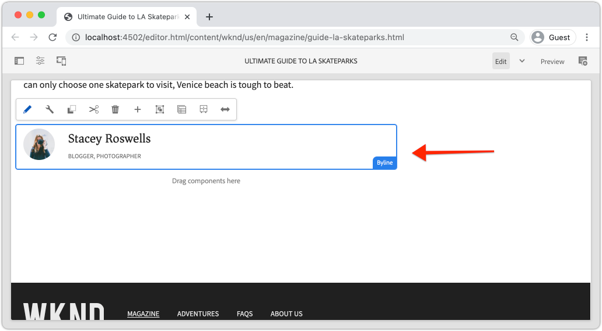

# Aangepaste component {#custom-component}

In deze zelfstudie wordt uitgelegd hoe u een aangepaste `Byline` AEM-component maakt die inhoud weergeeft die is geschreven in een dialoogvenster, en wordt uitgelegd hoe u een Sling-model ontwikkelt om bedrijfslogica in te kapselen die de HTML van de component vult.

## Vereisten {#prerequisites}

Herzie het vereiste tooling en de instructies voor vestiging a [ lokale ontwikkelomgeving ](overview.md#local-dev-environment).

### Starter-project

>[!NOTE]
>
> Als u met succes het vorige hoofdstuk voltooide, kunt u het project opnieuw gebruiken en de stappen overslaan voor het uitchecken van het starterproject.

Bekijk de basislijncode waarop de zelfstudie is gebaseerd:

1. Controle uit de `tutorial/custom-component-start` tak van [ GitHub ](https://github.com/adobe/aem-guides-wknd)

   ```shell
   $ cd aem-guides-wknd
   $ git checkout tutorial/custom-component-start
   ```

1. Stel codebasis aan een lokale instantie van AEM op gebruikend uw Maven vaardigheden:

   ```shell
   $ mvn clean install -PautoInstallSinglePackage
   ```

   >[!NOTE]
   >
   > Als u AEM 6.5 of 6.4 gebruikt, voegt u het `classic` -profiel toe aan Maven-opdrachten.

   ```shell
   $ mvn clean install -PautoInstallSinglePackage -Pclassic
   ```

U kunt de gebeëindigde code op [ GitHub ](https://github.com/adobe/aem-guides-wknd/tree/tutorial/custom-component-solution) altijd bekijken of de code plaatselijk controleren door aan de tak `tutorial/custom-component-solution` te schakelen.

## Doelstelling

1. Begrijp hoe u een aangepaste AEM-component maakt
1. Leer om bedrijfslogica met het Verkopen Modellen in te kapselen
1. Begrijp hoe te om een het Verdelen Model van binnen een Manuscript van HTML te gebruiken

## Wat u gaat bouwen {#what-build}

In dit deel van de WKND-zelfstudie wordt een Byline-component gemaakt die wordt gebruikt om geschreven informatie over de auteur van een artikel weer te geven.



*component Byline*

De implementatie van de component Byline bevat een dialoogvenster waarin de inhoud van de bylijn wordt verzameld en een aangepast Sling-model waarin de details als volgt worden opgehaald:

* Naam
* Afbeelding
* Beroepen

## Byline-component maken {#create-byline-component}

Maak eerst de knooppuntstructuur van de component Byline en definieer een dialoogvenster. Dit vertegenwoordigt de Component in AEM en bepaalt impliciet het middeltype van de component door zijn plaats in JCR.

In het dialoogvenster wordt de interface weergegeven waarmee auteurs van inhoud de interface kunnen bieden. Voor deze implementatie, wordt de component van het Beeld van de Component van de Kern van AEM WCM **&#x200B;**&#x200B;gebruikt om het auteursrecht en het teruggeven van het beeld van de Band te behandelen, zodat moet het als 2&rbrace; worden geplaatst van deze component.`sling:resourceSuperType`

### Componentdefinitie maken {#create-component-definition}

1. In de {**module 0} ui.apps, navigeer aan `/apps/wknd/components` en creeer een omslag genoemd `byline`.**
1. Voeg in de map `byline` een bestand met de naam `.content.xml` toe

    te creëren

1. Vul het bestand `.content.xml` met het volgende:

   ```xml
   <?xml version="1.0" encoding="UTF-8"?>
       <jcr:root xmlns:sling="http://sling.apache.org/jcr/sling/1.0" xmlns:cq="http://www.day.com/jcr/cq/1.0" xmlns:jcr="http://www.jcp.org/jcr/1.0"
       jcr:primaryType="cq:Component"
       jcr:title="Byline"
       jcr:description="Displays a contributor's byline."
       componentGroup="WKND Sites Project - Content"
       sling:resourceSuperType="core/wcm/components/image/v2/image"/>
   ```

   Het bovenstaande XML-bestand bevat de definitie voor de component, inclusief de titel, beschrijving en groep. `sling:resourceSuperType` richt aan `core/wcm/components/image/v2/image`, die de [ Component van het Beeld van de Kern ](https://experienceleague.adobe.com/docs/experience-manager-core-components/using/wcm-components/image.html) is.

### HTML-script maken {#create-the-htl-script}

1. Voeg in de map `byline` een bestand `byline.html` toe dat verantwoordelijk is voor de HTML-presentatie van de component. De naam van het bestand moet gelijk zijn aan de naam van de map, omdat dit het standaardscript wordt dat Sling gebruikt om dit brontype te renderen.

1. Voeg de volgende code toe aan `byline.html`.

   ```html
   <!--/* byline.html */-->
   <div data-sly-use.placeholderTemplate="core/wcm/components/commons/v1/templates.html">
   </div>
   <sly data-sly-call="${placeholderTemplate.placeholder @ isEmpty=true}"></sly>
   ```

`byline.html` wordt [ herzien later ](#byline-htl), zodra het het Verdelen Model wordt gecreeerd. Met de huidige status van het HTML-bestand kan de component in een lege staat worden weergegeven in de Pagina-editor van AEM Sites wanneer deze naar de pagina wordt gesleept en neergezet.

### De definitie van het dialoogvenster maken {#create-the-dialog-definition}

Definieer vervolgens een dialoogvenster voor de component Byline met de volgende velden:

* **Naam**: een tekstgebied de naam van de contribuant.
* **Beeld**: een verwijzing naar het biobeeld van de contribuant.
* **Bezetten**: een lijst van beroepen die aan de contribuant worden toegeschreven. De beroepen moeten alfabetisch in oplopende volgorde (a tot en met z) worden gesorteerd.

1. Maak in de map `byline` een map met de naam `_cq_dialog` .
1. Voeg in de `byline/_cq_dialog` een bestand met de naam `.content.xml` toe. Dit is de XML-definitie voor het dialoogvenster. Voeg de volgende XML toe:

   ```xml
   <?xml version="1.0" encoding="UTF-8"?>
   <jcr:root xmlns:sling="http://sling.apache.org/jcr/sling/1.0" xmlns:cq="http://www.day.com/jcr/cq/1.0" xmlns:jcr="http://www.jcp.org/jcr/1.0" xmlns:nt="http://www.jcp.org/jcr/nt/1.0"
           jcr:primaryType="nt:unstructured"
           jcr:title="Byline"
           sling:resourceType="cq/gui/components/authoring/dialog">
       <content
               jcr:primaryType="nt:unstructured"
               sling:resourceType="granite/ui/components/coral/foundation/container">
           <items jcr:primaryType="nt:unstructured">
               <tabs
                       jcr:primaryType="nt:unstructured"
                       sling:resourceType="granite/ui/components/coral/foundation/tabs"
                       maximized="{Boolean}false">
                   <items jcr:primaryType="nt:unstructured">
                       <asset
                               jcr:primaryType="nt:unstructured"
                               sling:hideResource="{Boolean}false"/>
                       <metadata
                               jcr:primaryType="nt:unstructured"
                               sling:hideResource="{Boolean}true"/>
                       <properties
                               jcr:primaryType="nt:unstructured"
                               jcr:title="Properties"
                               sling:resourceType="granite/ui/components/coral/foundation/container"
                               margin="{Boolean}true">
                           <items jcr:primaryType="nt:unstructured">
                               <columns
                                       jcr:primaryType="nt:unstructured"
                                       sling:resourceType="granite/ui/components/coral/foundation/fixedcolumns"
                                       margin="{Boolean}true">
                                   <items jcr:primaryType="nt:unstructured">
                                       <column
                                               jcr:primaryType="nt:unstructured"
                                               sling:resourceType="granite/ui/components/coral/foundation/container">
                                           <items jcr:primaryType="nt:unstructured">
                                               <name
                                                       jcr:primaryType="nt:unstructured"
                                                       sling:resourceType="granite/ui/components/coral/foundation/form/textfield"
                                                       emptyText="Enter the contributor's name to display."
                                                       fieldDescription="The contributor's name to display."
                                                       fieldLabel="Name"
                                                       name="./name"
                                                       required="{Boolean}true"/>
                                               <occupations
                                                       jcr:primaryType="nt:unstructured"
                                                       sling:resourceType="granite/ui/components/coral/foundation/form/multifield"
                                                       fieldDescription="A list of the contributor's occupations."
                                                       fieldLabel="Occupations"
                                                       required="{Boolean}false">
                                                   <field
                                                           jcr:primaryType="nt:unstructured"
                                                           sling:resourceType="granite/ui/components/coral/foundation/form/textfield"
                                                           emptyText="Enter an occupation"
                                                           name="./occupations"/>
                                               </occupations>
                                           </items>
                                       </column>
                                   </items>
                               </columns>
                           </items>
                       </properties>
                   </items>
               </tabs>
           </items>
       </content>
   </jcr:root>
   ```

   Deze definities van de dialoogknoop gebruiken de [ Verzameling van het Middel ](https://sling.apache.org/documentation/bundles/resource-merger.html) om te controleren welke dialooglusjes van de `sling:resourceSuperType` component worden geërft, in dit geval de **component van het Beeld van de Componenten van de Kern**.

   

### Het dialoogvenster Beleid maken {#create-the-policy-dialog}

Na de zelfde benadering zoals met de verwezenlijking van de Dialoog, creeer een dialoog van het Beleid (die vroeger als Dialoog van het Ontwerp wordt bekend) om ongewenste gebieden in de configuratie van het Beleid te verbergen die van de component van het Beeld van de Componenten van de Kern wordt geërft.

1. Maak in de map `byline` een map met de naam `_cq_design_dialog` .
1. Maak binnen de `byline/_cq_design_dialog` een bestand met de naam `.content.xml` . Werk het bestand bij met het volgende: met de volgende XML. Het is het eenvoudigst om de `.content.xml` -code te openen en de onderliggende XML erin te kopiëren/plakken.

   ```xml
   <?xml version="1.0" encoding="UTF-8"?>
   <jcr:root xmlns:sling="http://sling.apache.org/jcr/sling/1.0" xmlns:granite="http://www.adobe.com/jcr/granite/1.0" xmlns:cq="http://www.day.com/jcr/cq/1.0" xmlns:jcr="http://www.jcp.org/jcr/1.0" xmlns:nt="http://www.jcp.org/jcr/nt/1.0"
       jcr:primaryType="nt:unstructured"
       jcr:title="Byline"
       sling:resourceType="cq/gui/components/authoring/dialog">
       <content
               jcr:primaryType="nt:unstructured">
           <items jcr:primaryType="nt:unstructured">
               <tabs
                       jcr:primaryType="nt:unstructured">
                   <items jcr:primaryType="nt:unstructured">
                       <properties
                               jcr:primaryType="nt:unstructured">
                           <items jcr:primaryType="nt:unstructured">
                               <content
                                       jcr:primaryType="nt:unstructured">
                                   <items jcr:primaryType="nt:unstructured">
                                       <decorative
                                               jcr:primaryType="nt:unstructured"
                                               sling:hideResource="{Boolean}true"/>
                                       <altValueFromDAM
                                               jcr:primaryType="nt:unstructured"
                                               sling:hideResource="{Boolean}true"/>
                                       <titleValueFromDAM
                                               jcr:primaryType="nt:unstructured"
                                               sling:hideResource="{Boolean}true"/>
                                       <displayCaptionPopup
                                               jcr:primaryType="nt:unstructured"
                                               sling:hideResource="{Boolean}true"/>
                                       <disableUuidTracking
                                               jcr:primaryType="nt:unstructured"
                                               sling:hideResource="{Boolean}true"/>
                                   </items>
                               </content>
                           </items>
                       </properties>
                       <features
                               jcr:primaryType="nt:unstructured">
                           <items jcr:primaryType="nt:unstructured">
                               <content
                                       jcr:primaryType="nt:unstructured">
                                   <items jcr:primaryType="nt:unstructured">
                                       <accordion
                                               jcr:primaryType="nt:unstructured">
                                           <items jcr:primaryType="nt:unstructured">
                                               <orientation
                                                       jcr:primaryType="nt:unstructured"
                                                       sling:hideResource="{Boolean}true"/>
                                               <crop
                                                       jcr:primaryType="nt:unstructured"
                                                       sling:hideResource="{Boolean}true"/>
                                           </items>
                                       </accordion>
                                   </items>
                               </content>
                           </items>
                       </features>
                   </items>
               </tabs>
           </items>
       </content>
   </jcr:root>
   ```

   De basis voor de voorafgaande **dialoog van het Beleid** XML werd verkregen van de [ component van het Beeld van de Componenten van de Kern ](https://github.com/adobe/aem-core-wcm-components/blob/main/content/src/content/jcr_root/apps/core/wcm/components/image/v2/image/_cq_design_dialog/.content.xml).

   Zoals in de configuratie van de Dialoog, [ wordt de Vergroting van het Middel ](https://sling.apache.org/documentation/bundles/resource-merger.html) gebruikt om irrelevante gebieden te verbergen die anders van `sling:resourceSuperType` worden geërft, zoals gezien door de knoopdefinities met `sling:hideResource="{Boolean}true"` bezit.

### De code implementeren {#deploy-the-code}

1. Synchroniseer de wijzigingen in `ui.apps` met uw IDE of met gebruik van uw Maven vaardigheden.

   

## De component aan een pagina toevoegen {#add-the-component-to-a-page}

Als u de ontwikkeling van AEM-componenten eenvoudig wilt houden en de focus op de ontwikkeling ervan wilt houden, moet u de Byline-component in de huidige toestand toevoegen aan een artikelpagina om te controleren of de nodedefinitie van `cq:Component` correct is. Ook om te controleren of de AEM de definitie van de nieuwe component herkent en of het dialoogvenster van de component werkt voor ontwerpen.

### Een afbeelding toevoegen aan de AEM Assets

Eerst uploadt u een voorbeeldkop die u naar AEM Assets hebt genomen om de afbeelding te vullen met de component Byline.

1. Navigeer aan de omslag van LA Skateparks in AEM Assets: [ http://localhost:4502/assets.html/content/dam/wknd/en/magazine/la-skateparks ](http://localhost:4502/assets.html/content/dam/wknd/en/magazine/la-skateparks).

1. Upload het hoofdschot voor **[stapel-roswells.jpg](assets/custom-component/stacey-roswells.jpg)** aan de omslag.

   

### Auteur van de component {#author-the-component}

Voeg vervolgens de component Byline toe aan een pagina in AEM. Omdat de component van de Naamregel aan het **WKND Project van Plaatsen - de Groep van de Component van de Inhoud**, via de `ui.apps/src/main/content/jcr_root/apps/wknd/components/byline/.content.xml` definitie wordt toegevoegd, is het automatisch beschikbaar aan om het even welke **Container** het waarvan **Beleid** het **Project van de Plaatsen WKND - de componentengroep van Inhoud** toestaat. De pagina is dus beschikbaar in de container voor lay-out van de artikelpagina.

1. Navigeer aan het artikel van LA Skatepark bij: [ http://localhost:4502/editor.html/content/wknd/us/en/magazine/guide-la-skateparks.html ](http://localhost:4502/editor.html/content/wknd/us/en/magazine/guide-la-skateparks.html)

1. Van linkerzijbalk, belemmering en laat vallen a **component van de Byline** op **bodem** van de Container van de Lay-out van de geopende artikelpagina.

    toe

1. Zorg ervoor dat linkerzijbalk open **en zichtbaar is, en** de Vinder van Activa** wordt geselecteerd.

1. Selecteer de **placeholder van de component Byline**, die beurtelings de actiebar toont en het **sleutel** pictogram tikt om de dialoog te openen.

1. Open de linkerzijbalk terwijl het dialoogvenster geopend is en het eerste tabblad (element) actief is. Sleep een afbeelding vanuit de zoekfunctie naar de dropzone Afbeelding. Zoek naar &quot;stapey&quot; om Stacey Roswells biopicture te vinden die in het WKND ui.content pakket wordt verstrekt.

   

1. Na het toevoegen van een beeld, klik op het **Eigenschappen** lusje om de **Naam** in te gaan en **Bezetten**.

   Wanneer het ingaan van beroepen, ga hen in **omgekeerde alfabetische** orde in zodat wordt de alfabetiserende bedrijfslogica die in het het Verdelen Model wordt uitgevoerd geverifieerd.

   Tik **Gedaan** knoop in het bodemrecht om de veranderingen te bewaren.

   

   AEM-auteurs configureren componenten en schrijven ze samen via de dialoogvensters. Op dit punt, in de ontwikkeling van de component Byline zijn de dialogen inbegrepen voor het verzamelen van de gegevens, nochtans is de logica om de geschreven inhoud terug te geven nog niet toegevoegd. Daarom wordt alleen de tijdelijke aanduiding weergegeven.

1. Na het bewaren van de dialoog, navigeer aan [ CRXDE Lite ](http://localhost:4502/crx/de/index.jsp#/content/wknd/us/en/magazine/guide-la-skateparks/jcr%3Acontent/root/container/container/byline) en herzie hoe de inhoud van de component op de de inhoudsknoop van de bylinecomponent onder de pagina van AEM wordt opgeslagen.

   Zoek het inhoudknooppunt van de component Byline onder de pagina LA Skate Parks, d.w.z. `/content/wknd/us/en/magazine/guide-la-skateparks/jcr:content/root/container/container/byline` .

   Merk op de bezitsnamen `name`, `occupations`, en `fileReference` worden opgeslagen op de **byline knoop**.

   U ziet ook dat de `sling:resourceType` van het knooppunt is ingesteld op `wknd/components/content/byline` . Dit is wat dit inhoudsknooppunt bindt aan de implementatie van de Byline-component.

   

## Byline Sling Model maken {#create-sling-model}

Daarna, creëren wij een het Verdelen Model om als gegevensmodel te handelen en de bedrijfslogica voor de component van de Byline te huisvesten.

Sling-modellen zijn door annotaties aangedreven Java™ POJO&#39;s (Plain Old Java™ Objects) die het gemakkelijker maken gegevens van de JCR aan Java™-variabelen toe te wijzen en die efficiëntie bieden bij het ontwikkelen in de AEM-context.

### GeMaven afhankelijkheden controleren {#maven-dependency}

Het Byline Sling-model is gebaseerd op verschillende Java™ API&#39;s van AEM. Deze API&#39;s worden beschikbaar gesteld via de `dependencies` die in het POM-bestand van de module `core` wordt vermeld. Het project dat voor deze zelfstudie wordt gebruikt, is gemaakt voor AEM as a Cloud Service. Het is echter uniek omdat het compatibel is met AEM 6.5/6.4. Daarom zijn zowel afhankelijkheden voor Cloud Service als AEM 6.x opgenomen.

1. Open het bestand `pom.xml` onder `<src>/aem-guides-wknd/core/pom.xml` .
1. Vind het gebiedsdeel voor `aem-sdk-api` - **slechts AEM as a Cloud Service**

   ```xml
   <dependency>
       <groupId>com.adobe.aem</groupId>
       <artifactId>aem-sdk-api</artifactId>
   </dependency>
   ```

   [ aem-sdk-api ](https://experienceleague.adobe.com/docs/experience-manager-cloud-service/content/implementing/developing/aem-as-a-cloud-service-sdk.html?lang=en) bevat alle openbare Java™ APIs die door AEM worden blootgesteld. `aem-sdk-api` wordt standaard gebruikt bij het bouwen van dit project. De versie blijft behouden in de bovenliggende reactorpom vanaf de basis van het project in `aem-guides-wknd/pom.xml` .

1. Vind het gebiedsdeel voor `uber-jar` - **AEM 6.5/6.4 slechts**

   ```xml
   ...
       <dependency>
           <groupId>com.adobe.aem</groupId>
           <artifactId>uber-jar</artifactId>
           <classifier>apis</classifier>
       </dependency>
   ...
   ```

   `uber-jar` wordt alleen opgenomen wanneer het `classic` -profiel wordt aangeroepen, dat wil zeggen `mvn clean install -PautoInstallSinglePackage -Pclassic` . Nogmaals, dit is uniek voor dit project. In een echt project, dat van het Archetype van het Project van AEM wordt geproduceerd is `uber-jar` het gebrek als de gespecificeerde versie van AEM 6.5 of 6.4 is.

   [ uber-jar ](https://experienceleague.adobe.com/docs/experience-manager-65/developing/devtools/ht-projects-maven.html#experience-manager-api-dependencies) bevat alle openbare Java™ APIs die door AEM 6.x worden blootgesteld. De versie blijft behouden in de bovenliggende reactorpom vanaf de basis van het project `aem-guides-wknd/pom.xml` .

1. De afhankelijkheid van `core.wcm.components.core` zoeken:

   ```xml
    <!-- Core Component Dependency -->
       <dependency>
           <groupId>com.adobe.cq</groupId>
           <artifactId>core.wcm.components.core</artifactId>
       </dependency>
   ```

   Dit zijn de volledige openbare Java™ API&#39;s die door AEM Core Components worden weergegeven. AEM Core Components is een project dat buiten AEM wordt onderhouden en heeft daarom een aparte releasecyclus. Om deze reden, is het een gebiedsdeel dat afzonderlijk moet omvatten en **niet** inbegrepen met `uber-jar` of `aem-sdk-api` is.

   Net als de uber-jar blijft de versie voor deze afhankelijkheid behouden in het Parent-reactorpomabestand van `aem-guides-wknd/pom.xml` .

   Verderop in deze zelfstudie wordt de klasse Core Component Image gebruikt om de afbeelding weer te geven in de component Byline. Het is noodzakelijk om de afhankelijkheid van de Component van de Kern te hebben om het het Verkopen Model te bouwen en te compileren.

### Byline-interface {#byline-interface}

Maak een openbare Java™-interface voor de naamregel. In `Byline.java` worden de methoden public gedefinieerd die nodig zijn om het `byline.html` HTML-script te sturen.

1. Binnen maakt de module `core` in de map `core/src/main/java/com/adobe/aem/guides/wknd/core/models` een bestand met de naam `Byline.java` .

   

1. Werk `Byline.java` bij met de volgende methoden:

   ```java
   package com.adobe.aem.guides.wknd.core.models;
   
   import java.util.List;
   
   /**
   * Represents the Byline AEM Component for the WKND Site project.
   **/
   public interface Byline {
       /***
       * @return a string to display as the name.
       */
       String getName();
   
       /***
       * Occupations are to be sorted alphabetically in a descending order.
       *
       * @return a list of occupations.
       */
       List<String> getOccupations();
   
       /***
       * @return a boolean if the component has enough content to display.
       */
       boolean isEmpty();
   }
   ```

   De eerste twee methodes stellen de waarden voor de **naam** en **bezettingen** voor de component van de Naamregel bloot.

   De methode `isEmpty()` wordt gebruikt om te bepalen als de component om het even welke inhoud heeft om terug te geven of als het wacht om worden gevormd.

   Bericht er geen methode voor het Beeld is; [ dit wordt herzien later ](#tackling-the-image-problem).

1. Java™-pakketten die openbare Java™-klassen bevatten, in dit geval een Sling Model, moeten zijn versioned met behulp van het `package-info.java` -bestand van het pakket.

   Aangezien in het Java™-pakket `com.adobe.aem.guides.wknd.core.models` van de WKND-bron de versie van `1.0.0` wordt gedeclareerd en er een vaste openbare interface en methoden worden toegevoegd, moet de versie worden verhoogd naar `1.1.0` . Open het bestand op `core/src/main/java/com/adobe/aem/guides/wknd/core/models/package-info.java` en werk `@Version("1.0.0")` bij `@Version("2.1.0")` .

   ```
   @Version("2.1.0")
   package com.adobe.aem.guides.wknd.core.models;
   
   import org.osgi.annotation.versioning.Version;
   ```

Wanneer een verandering in de dossiers in dit pakket wordt aangebracht, moet de [ pakketversie semantisch ](https://semver.org/) worden aangepast. Als niet, ontdekt het Maven project [ bnd-baseline-maven-plugin ](https://github.com/bndtools/bnd) een ongeldige pakketversie en breekt de gebouwde. Gelukkig meldt de Maven-plug-in bij een storing de ongeldige Java™-pakketversie en de versie die deze moet hebben. Werk de declaratie `@Version("...")` in het overtreden van het Java™-pakket `package-info.java` bij naar de versie die door de plug-in wordt aanbevolen om deze te herstellen.

### Bylineimplementatie {#byline-implementation}

`BylineImpl.java` is de implementatie van het Sling Model dat de `Byline.java` interface uitvoert die vroeger wordt bepaald. De volledige code voor `BylineImpl.java` vindt u onder aan deze sectie.

1. Maak een map met de naam `impl` onder `core/src/main/java/com/adobe/aem/guides/core/models` .
1. Maak een bestand `BylineImpl.java` in de map `impl` .

   

1. Openen `BylineImpl.java` . Geef op of de interface `Byline` moet worden geïmplementeerd. Gebruik de functies voor automatisch aanvullen van de IDE of werk het bestand handmatig bij en voeg de methoden toe die nodig zijn om de interface `Byline` te implementeren:

   ```java
   package com.adobe.aem.guides.wknd.core.models.impl;
   import java.util.List;
   import com.adobe.aem.guides.wknd.core.models.Byline;
   
   public class BylineImpl implements Byline {
   
       @Override
       public String getName() {
           // TODO Auto-generated method stub
           return null;
       }
   
       @Override
       public List<String> getOccupations() {
           // TODO Auto-generated method stub
           return null;
       }
   
       @Override
       public boolean isEmpty() {
           // TODO Auto-generated method stub
           return false;
       }
   }
   ```

1. Voeg de annotaties van het verkoopmodel toe door `BylineImpl.java` bij te werken met de volgende annotaties op klasseniveau. Deze `@Model(..)` aantekening is wat de klasse in een het Verschilderen Model verandert.

   ```java
   import org.apache.sling.api.SlingHttpServletRequest;
   import org.apache.sling.models.annotations.Model;
   import org.apache.sling.models.annotations.DefaultInjectionStrategy;
   ...
   @Model(
           adaptables = {SlingHttpServletRequest.class},
           adapters = {Byline.class},
           resourceType = {BylineImpl.RESOURCE_TYPE},
           defaultInjectionStrategy = DefaultInjectionStrategy.OPTIONAL
   )
   public class BylineImpl implements Byline {
       protected static final String RESOURCE_TYPE = "wknd/components/byline";
       ...
   }
   ```

   Laten we deze annotatie en de bijbehorende parameters bekijken:

   * De `@Model` -annotatie registreert BylineImpl als een Sling-model wanneer deze wordt geïmplementeerd in AEM.
   * Met de parameter `adaptables` wordt opgegeven dat dit model door de aanvraag kan worden aangepast.
   * Met de parameter `adapters` kan de implementatieklasse worden geregistreerd onder de interface Byline. Hierdoor kan het HTML-script het Sling Model via de interface aanroepen (in plaats van de implementatie rechtstreeks). [ Meer details over adapters kunnen hier ](https://sling.apache.org/documentation/bundles/models.html#specifying-an-alternate-adapter-class-since-110) worden gevonden.
   * `resourceType` verwijst naar het brontype van de component Byline (eerder gecreeerd) en helpt om het correcte model op te lossen als er veelvoudige implementaties zijn. [ Meer details over het associëren van een modelklasse met een middeltype kunnen hier ](https://sling.apache.org/documentation/bundles/models.html#associating-a-model-class-with-a-resource-type-since-130) worden gevonden.

### Implementatie van de methoden van het verkoopmodel {#implementing-the-sling-model-methods}

#### getName() {#implementing-get-name}

De eerste methode die wordt geïmplementeerd, is `getName()` . Hierin wordt de waarde geretourneerd die is opgeslagen in het JCR-inhoudsknooppunt van de byline onder de eigenschap `name` .

Hiervoor wordt de `@ValueMapValue` Sling Model-annotatie gebruikt om de waarde in een Java™-veld te injecteren met behulp van de ValueMap van de bron van het verzoek.


```java
import org.apache.sling.models.annotations.injectorspecific.ValueMapValue;

public class BylineImpl implements Byline {
    ...
    @ValueMapValue
    private String name;

    ...
    @Override
    public String getName() {
        return name;
    }
    ...
}
```

Omdat de JCR-eigenschap de naam deelt als het Java™-veld (beide zijn &quot;name&quot;), lost `@ValueMapValue` deze koppeling automatisch op en injecteert de waarde van de eigenschap in het Java™-veld.

#### getOccupations() {#implementing-get-occupations}

De volgende methode die moet worden geïmplementeerd, is `getOccupations()` . Deze methode laadt de beroepen die in de eigenschap JCR `occupations` zijn opgeslagen en retourneert een gesorteerde (alfabetische) verzameling ervan.

Met dezelfde techniek die in `getName()` wordt beschreven, kan de eigenschapswaarde worden geïnjecteerd in het veld Sling Model.

Zodra de JCR-eigenschapswaarden beschikbaar zijn in het Sling Model via het geïnjecteerde Java™-veld `occupations` , kan de zakelijke logica voor sorteren worden toegepast in de `getOccupations()` -methode.


```java
import java.util.ArrayList;
import java.util.Collections;
  ...

public class BylineImpl implements Byline {
    ...
    @ValueMapValue
    private List<String> occupations;
    ...
    @Override
    public List<String> getOccupations() {
        if (occupations != null) {
            Collections.sort(occupations);
            return new ArrayList<String>(occupations);
        } else {
            return Collections.emptyList();
        }
    }
    ...
}
  ...
```


#### isEmpty() {#implementing-is-empty}

De laatste methode public is `isEmpty()` die bepaalt wanneer de component zichzelf als &#39;authored genoeg&#39; moet beschouwen om te renderen.

Voor deze component, is het bedrijfsvereiste alle drie gebieden, `name, image and occupations` moet worden ingevuld *alvorens* de component kan worden teruggegeven.


```java
import org.apache.commons.lang3.StringUtils;
  ...
public class BylineImpl implements Byline {
    ...
    @Override
    public boolean isEmpty() {
        if (StringUtils.isBlank(name)) {
            // Name is missing, but required
            return true;
        } else if (occupations == null || occupations.isEmpty()) {
            // At least one occupation is required
            return true;
        } else if (/* image is not null, logic to be determined */) {
            // A valid image is required
            return true;
        } else {
            // Everything is populated, so this component is not considered empty
            return false;
        }
    }
    ...
}
```


#### Het probleem van de &quot;afbeelding&quot; aanpakken {#tackling-the-image-problem}

Het controleren van de naam en bezettingsvoorwaarden zijn triviaal en Apache Commons Lang3 verstrekt de handige [&#128279;](https://commons.apache.org/proper/commons-lang/apidocs/org/apache/commons/lang3/StringUtils.html) klasse 0&rbrace; StringUtils.  Nochtans, is het onduidelijk hoe de **aanwezigheid van het Beeld** kan worden bevestigd aangezien de component van het Beeld van de Componenten van de Kern aan oppervlakte het beeld wordt gebruikt.

Er zijn twee manieren om dit aan te pakken:

Controleer of de JCR-eigenschap `fileReference` wordt omgezet in een element. *OF* zet dit middel in een Model van het Afgeven van het Beeld van de Component van de Kern om en zorg ervoor de `getSrc()` methode niet leeg is.

Laten wij de **tweede** benadering gebruiken. De eerste aanpak is waarschijnlijk voldoende, maar in deze zelfstudie wordt deze laatste gebruikt om andere kenmerken van Sling Models te verkennen.

1. Maak een methode van het type private waarmee de afbeelding wordt opgehaald. Deze methode blijft privé, omdat het afbeeldingsobject niet in de HTML zelf hoeft te worden weergegeven en alleen wordt gebruikt om te besturen `isEmpty().`

   Voeg de volgende methode van het type private toe voor `getImage()` :

   ```java
   import com.adobe.cq.wcm.core.components.models.Image;
   ...
   private Image getImage() {
       Image image = null;
       // Figure out how to populate the image variable!
       return image;
   }
   ```

   Zoals hierboven vermeld, zijn er twee meer benaderingen om het **Beeld Verzamelen Model** te krijgen:

   De eerste toepassing gebruikt de annotatie `@Self` om de huidige aanvraag automatisch aan te passen aan de toepassing van de Core Component `Image.class`

   De tweede gebruikt de [ Sling ModelFactory van Apache ](https://sling.apache.org/apidocs/sling10/org/apache/sling/models/factory/ModelFactory.html) dienst OSGi, die de handige dienst is, en helpt ons Sling Models van andere types in code tot stand brengen Java™.

   Laten we de tweede aanpak gebruiken.

   >[!NOTE]
   >
   >In een real-world implementatie, de benadering &quot;Één&quot;, het gebruiken van `@Self` wordt geprefereerd aangezien het de eenvoudigere, elegantere oplossing is. In deze zelfstudie wordt de tweede aanpak gebruikt, omdat er meer facetten van Sling Models moeten worden verkend die handig zijn: complexere componenten!

   Aangezien het Verdelen Modellen POJO&#39;s Java™ zijn, en niet OSGi Services, kunnen de gebruikelijke OSGi injectieannotaties `@Reference` **niet** worden gebruikt, in plaats daarvan verstrekken het Verdelen Modellen een speciale **[@OSGiService ](https://sling.apache.org/documentation/bundles/models.html#injector-specific-annotations)** annotatie die gelijkaardige functionaliteit verstrekt.

1. Werk `BylineImpl.java` bij om de `OSGiService` -annotatie voor het injecteren van de `ModelFactory` op te nemen:

   ```java
   import org.apache.sling.models.factory.ModelFactory;
   import org.apache.sling.models.annotations.injectorspecific.OSGiService;
   ...
   public class BylineImpl implements Byline {
       ...
       @OSGiService
       private ModelFactory modelFactory;
   }
   ```

   Met de beschikbare `ModelFactory`, kan een Model van de Verzameling van het Beeld van de Component van de Kern worden gecreeerd gebruikend:

   ```java
   modelFactory.getModelFromWrappedRequest(SlingHttpServletRequest request, Resource resource, java.lang.Class<T> targetClass)
   ```

   Nochtans, vereist deze methode zowel een verzoek als een middel, nog niet beschikbaar in het het Verdelen Model. Om deze te verkrijgen, worden meer verkoopmodelannotaties gebruikt!

   Om het huidige verzoek te krijgen kan de **[@Self ](https://sling.apache.org/documentation/bundles/models.html#injector-specific-annotations)** aantekening worden gebruikt om `adaptable` (die in `@Model(..)` als `SlingHttpServletRequest.class` wordt bepaald, in een Java™ klassengebied te injecteren.

1. Voeg de **@Self** aantekening toe om het **verzoek SlingHttpServletRequest** te krijgen:

   ```java
   import org.apache.sling.models.annotations.injectorspecific.Self;
   ...
   @Self
   private SlingHttpServletRequest request;
   ```

   Vergeet niet dat het gebruik van `@Self Image image` om het Core Component Image Sling Model te injecteren hierboven een optie was - de `@Self` -aantekening probeert het aanpasbare object te injecteren (in dit geval een SlingHttpServletRequest) en zich aan te passen aan het type annotatieveld. Aangezien het model voor het instellen van de afbeelding van de kerncomponent kan worden aangepast aan SlingHttpServletRequest-objecten, zou dit hebben gewerkt en is het minder code dan meer verkennende `modelFactory` aanpak.

   Nu worden de variabelen die nodig zijn om het afbeeldingsmodel te instantiëren via de ModelFactory-API geïnjecteerd. Laten wij het Verschuiven Model **[@PostConstruct ](https://sling.apache.org/documentation/bundles/models.html#postconstruct-methods) gebruiken** aantekening om dit voorwerp te verkrijgen nadat het het Verzamelen Model concretiseert.

   `@PostConstruct` is ongelooflijk nuttig en werkt in een vergelijkbare hoedanigheid als een constructor, maar wordt aangeroepen nadat de klasse is geïnstantieerd en alle Java™-velden met aantekeningen zijn geïnjecteerd. Terwijl andere annotaties van het Model van het Sling aan de klassengebieden van Java™ (variabelen) aantekeningen maken, `@PostConstruct` annoteert een void, nulparametermethode, typisch genoemd `init()` (maar kan om het even wat worden genoemd).

1. Voeg de methode **@PostConstruct** toe:

   ```java
   import javax.annotation.PostConstruct;
   ...
   public class BylineImpl implements Byline {
       ...
       private Image image;
   
       @PostConstruct
       private void init() {
           image = modelFactory.getModelFromWrappedRequest(request,
                                                           request.getResource(),
                                                           Image.class);
       }
       ...
   }
   ```

   Herinner me, zijn het Verdelen Modellen **NIET** OSGi Services, zodat is het veilig om klassenstaat te handhaven. `@PostConstruct` leidt vaak de klassestatus Sling Model af en stelt deze in voor toekomstig gebruik, vergelijkbaar met wat een gewone constructor doet.

   Als de methode `@PostConstruct` een uitzondering genereert, wordt het Sling-model niet geïnstantieerd en is het null.

1. **getImage ()** kan nu worden bijgewerkt om het beeldvoorwerp eenvoudig terug te keren.

   ```java
   /**
       * @return the Image Sling Model of this resource, or null if the resource cannot create a valid Image Sling Model.
   */
   private Image getImage() {
       return image;
   }
   ```

1. Laten we terugkeren naar `isEmpty()` en de implementatie voltooien:

   ```java
   @Override
   public boolean isEmpty() {
      final Image componentImage = getImage();
   
       if (StringUtils.isBlank(name)) {
           // Name is missing, but required
           return true;
       } else if (occupations == null || occupations.isEmpty()) {
           // At least one occupation is required
           return true;
       } else if (componentImage == null || StringUtils.isBlank(componentImage.getSrc())) {
           // A valid image is required
           return true;
       } else {
           // Everything is populated, so this component is not considered empty
           return false;
       }
   }
   ```

   Meerdere aanroepen van `getImage()` zijn niet problematisch omdat de geïnitialiseerde variabele `image` class wordt geretourneerd en `modelFactory.getModelFromWrappedRequest(...)` niet wordt aangeroepen, wat niet te duur is, maar het onnodig aanroepen waard is.

1. De uiteindelijke `BylineImpl.java` moet er als volgt uitzien:


   ```java
   package com.adobe.aem.guides.wknd.core.models.impl;
   
   import java.util.ArrayList;
   import java.util.Collections;
   import java.util.List;
   import javax.annotation.PostConstruct;
   import org.apache.commons.lang3.StringUtils;
   import org.apache.sling.api.SlingHttpServletRequest;
   import org.apache.sling.models.annotations.DefaultInjectionStrategy;
   import org.apache.sling.models.annotations.Model;
   import org.apache.sling.models.annotations.injectorspecific.OSGiService;
   import org.apache.sling.models.annotations.injectorspecific.Self;
   import org.apache.sling.models.annotations.injectorspecific.ValueMapValue;
   import org.apache.sling.models.factory.ModelFactory;
   import com.adobe.aem.guides.wknd.core.models.Byline;
   import com.adobe.cq.wcm.core.components.models.Image;
   
   @Model(
           adaptables = {SlingHttpServletRequest.class},
           adapters = {Byline.class},
           resourceType = {BylineImpl.RESOURCE_TYPE},
           defaultInjectionStrategy = DefaultInjectionStrategy.OPTIONAL
   )
   public class BylineImpl implements Byline {
       protected static final String RESOURCE_TYPE = "wknd/components/byline";
   
       @Self
       private SlingHttpServletRequest request;
   
       @OSGiService
       private ModelFactory modelFactory;
   
       @ValueMapValue
       private String name;
   
       @ValueMapValue
       private List<String> occupations;
   
       private Image image;
   
       /**
       * @PostConstruct is immediately called after the class has been initialized
       * but BEFORE any of the other public methods. 
       * It is a good method to initialize variables that is used by methods in the rest of the model
       *
       */
       @PostConstruct
       private void init() {
           // set the image object
           image = modelFactory.getModelFromWrappedRequest(request, request.getResource(), Image.class);
       }
   
       @Override
       public String getName() {
           return name;
       }
   
       @Override
       public List<String> getOccupations() {
           if (occupations != null) {
               Collections.sort(occupations);
               return new ArrayList<String>(occupations);
           } else {
               return Collections.emptyList();
           }
       }
   
       @Override
       public boolean isEmpty() {
           final Image componentImage = getImage();
   
           if (StringUtils.isBlank(name)) {
               // Name is missing, but required
               return true;
           } else if (occupations == null || occupations.isEmpty()) {
               // At least one occupation is required
               return true;
           } else if (componentImage == null || StringUtils.isBlank(componentImage.getSrc())) {
               // A valid image is required
               return true;
           } else {
               // Everything is populated, so this component is not considered empty
               return false;
           }
       }
   
       /**
       * @return the Image Sling Model of this resource, or null if the resource cannot create a valid Image Sling Model.
       */
       private Image getImage() {
           return image;
       }
   }
   ```


## Naamregel HTL {#byline-htl}

Open in de module `ui.apps` `/apps/wknd/components/byline/byline.html` die is gemaakt in de eerdere setup van de AEM-component.

```html
<div data-sly-use.placeholderTemplate="core/wcm/components/commons/v1/templates.html">
</div>
<sly data-sly-call="${placeholderTemplate.placeholder @ isEmpty=false}"></sly>
```

Laten we bekijken wat dit HTML-script tot nu toe doet:

* `placeholderTemplate` verwijst naar de tijdelijke aanduiding voor kerncomponenten, die wordt weergegeven wanneer de component niet volledig is geconfigureerd. Dit wordt in de AEM Sites Page Editor weergegeven als een vak met de componenttitel, zoals hierboven gedefinieerd in de eigenschap `cq:Component` s `jcr:title` .

* `data-sly-call="${placeholderTemplate.placeholder @ isEmpty=false}` laadt de hierboven gedefinieerde `placeholderTemplate` en geeft een booleaanse waarde (momenteel gecodeerd als `false` ) door in de tijdelijke aanduiding. Als `isEmpty` true is, wordt het grijze vak weergegeven als de plaatsaanduidingssjabloon geen waarde heeft.

### Byline HTML bijwerken

1. Update **byline.html** met de volgende skeletale structuur van HTML:

   ```html
   <div data-sly-use.placeholderTemplate="core/wcm/components/commons/v1/templates.html"
       class="cmp-byline">
           <div class="cmp-byline__image">
               <!--/* Include the Core Components Image Component */-->
           </div>
           <h2 class="cmp-byline__name"><!--/* Include the name */--></h2>
           <p class="cmp-byline__occupations"><!--/* Include the occupations */--></p>
   </div>
   <sly data-sly-call="${placeholderTemplate.placeholder @ isEmpty=true}"></sly>
   ```

   Merk op de CSS klassen de [ BEM noemende overeenkomst ](https://getbem.com/naming/) volgen. Hoewel het gebruik van BEM-conventies niet verplicht is, wordt BEM aanbevolen omdat het wordt gebruikt in CSS-klassen voor kerncomponenten en doorgaans resulteert in schone, leesbare CSS-regels.

### Instantiëren van objecten van het Sling Model in HTML {#instantiating-sling-model-objects-in-htl}

De [ het blokverklaring van het Gebruik ](https://github.com/adobe/htl-spec/blob/master/SPECIFICATION.md#221-use) wordt gebruikt om het schrapen modelvoorwerpen in het manuscript te concretiseren HTML en het toe te wijzen aan een variabele van HTML.

`data-sly-use.byline="com.adobe.aem.guides.wknd.models.Byline"` gebruikt de interface Byline (com.adobe.aem.guides.wknd.models.Byline) die door BylineImpl wordt uitgevoerd en past het huidige SlingHttpServletRequest aan het aan, en het resultaat wordt opgeslagen in een HTML veranderlijke naam byline ( `data-sly-use.<variable-name>`).

1. Werk buiten `div` bij om naar het **Byline** het Verdelen Model door zijn openbare interface te verwijzen:

   ```xml
   <div data-sly-use.byline="com.adobe.aem.guides.wknd.core.models.Byline"
       data-sly-use.placeholderTemplate="core/wcm/components/commons/v1/templates.html"
       class="cmp-byline">
       ...
   </div>
   ```

### Methoden van het verkoopmodel openen {#accessing-sling-model-methods}

HTML leent vanuit JSTL en gebruikt dezelfde verkorting van namen van Java™ getter-methoden.

Het aanroepen van de methode `getName()` van het Byline Sling Model kan bijvoorbeeld worden ingekort tot `byline.name` , op dezelfde manier in plaats van `byline.isEmpty` , maar dit kan worden ingekort tot `byline.empty` . Het gebruik van volledige methodenamen, `byline.getName` of `byline.isEmpty` , werkt ook. Let op: `()` worden nooit gebruikt om methoden in HTML aan te roepen (vergelijkbaar met JSTL).

Java™ de methodes die een parameter **vereisen kunnen niet** in HTML worden gebruikt. Dit is door ontwerp om de logica in HTML eenvoudig te houden.

1. De naam van de Naamregel kan aan de component worden toegevoegd door de methode `getName()` op te roepen in het Byline Sling-model of in HTML: `${byline.name}` .

   Werk de tag `h2` bij:

   ```xml
   <h2 class="cmp-byline__name">${byline.name}</h2>
   ```

### HTML-expressieopties gebruiken {#using-htl-expression-options}

[ de Opties van Uitdrukkingen HTML ](https://github.com/adobe/htl-spec/blob/master/SPECIFICATION.md#12-available-expression-options) handelen als bepalingen op inhoud in HTML, en waaier van datum-het formatteren aan i18n vertaling. Expressies kunnen ook worden gebruikt om lijsten of arrays met waarden met elkaar te verbinden. Dit zijn de expressies die nodig zijn om de beroepen in een door komma&#39;s gescheiden indeling weer te geven.

Expressies worden toegevoegd via de operator `@` in de HTML-expressie.

1. Als u de lijst met beroepen wilt samenvoegen met &quot;, &quot;, wordt de volgende code gebruikt:

   ```html
   <p class="cmp-byline__occupations">${byline.occupations @ join=', '}</p>
   ```

### De tijdelijke aanduiding voorwaardelijk weergeven {#conditionally-displaying-the-placeholder}

De meeste manuscripten HTML voor de Componenten van AEM gebruiken het **placeholder paradigm** om visuele richtsnoer aan auteurs **te verstrekken die op een component wijzen verkeerd wordt geschreven en het wordt niet getoond op AEM publiceren**. De conventie die deze beslissing aanstuurt, is het implementeren van een methode op het back-upmodel van de component, in dit geval: `Byline.isEmpty()` .

De methode `isEmpty()` wordt aangeroepen op het Byline Sling-model en het resultaat (of liever gezegd negatief, via de operator `!` ) wordt opgeslagen naar een HTML-variabele met de naam `hasContent` :

1. Werk de buitenste `div` bij om een HTML-variabele met de naam `hasContent` op te slaan:

   ```html
    <div data-sly-use.byline="com.adobe.aem.guides.wknd.core.models.Byline"
         data-sly-use.placeholderTemplate="core/wcm/components/commons/v1/templates.html"
         data-sly-test.hasContent="${!byline.empty}"
         class="cmp-byline">
         ...
   </div>
   ```

   Let op het gebruik van `data-sly-test`, het HTL `test` -blok is key, het stelt beide een HTML-variabele in en rendert/rendert het HTML-element niet. Het is gebaseerd op het resultaat van de evaluatie van de HTL-expressie. Indien &quot;true&quot;, wordt het HTML-element weergegeven, anders wordt het niet gerenderd.

   Deze HTML-variabele `hasContent` kan nu opnieuw worden gebruikt om de tijdelijke aanduiding voorwaardelijk weer te geven of te verbergen.

1. Werk de voorwaardelijke aanroep naar de `placeholderTemplate` onder aan het bestand bij met het volgende:

   ```html
   <sly data-sly-call="${placeholderTemplate.placeholder @ isEmpty=!hasContent}"></sly>
   ```

### De afbeelding weergeven met behulp van kerncomponenten {#using-the-core-components-image}

Het HTML-script voor `byline.html` is nu bijna voltooid en er ontbreekt alleen de afbeelding.

Aangezien `sling:resourceSuperType` aan de component van het Beeld van de Component van de Kern wijst om het beeld te ontwerpen, kan de component van het Beeld van de Component van de Kern worden gebruikt om het beeld terug te geven.

Voor dit, laten wij het huidige bylinemiddel omvatten, maar dwingen het middeltype van de component van het Beeld van de Component van de Kern, gebruikend middeltype `core/wcm/components/image/v2/image`. Dit is een krachtig patroon voor hergebruik van componenten. Hiervoor wordt het blok `data-sly-resource` van HTML gebruikt.

1. Vervang `div` door een klasse van `cmp-byline__image` door het volgende:

   ```html
   <div class="cmp-byline__image"
       data-sly-resource="${ '.' @ resourceType = 'core/wcm/components/image/v2/image' }"></div>
   ```

   Deze `data-sly-resource` bevat de huidige bron via het relatieve pad `'.'` en dwingt u de huidige bron (of de bron van de bylineinhoud) op te nemen met het resourcetype `core/wcm/components/image/v2/image` .

   Het middeltype van de Component van de Kern wordt gebruikt direct, en niet via een volmacht, omdat dit een in-manuscriptgebruik is, en het nooit aan de inhoud voortgeduurd.

2. Voltooid `byline.html` hieronder:

   ```html
   <!--/* byline.html */-->
   <div data-sly-use.byline="com.adobe.aem.guides.wknd.core.models.Byline" 
       data-sly-use.placeholderTemplate="core/wcm/components/commons/v1/templates.html"
       data-sly-test.hasContent="${!byline.empty}"
       class="cmp-byline">
       <div class="cmp-byline__image"
           data-sly-resource="${ '.' @ resourceType = 'core/wcm/components/image/v2/image' }">
       </div>
       <h2 class="cmp-byline__name">${byline.name}</h2>
       <p class="cmp-byline__occupations">${byline.occupations @ join=', '}</p>
   </div>
   <sly data-sly-call="${placeholderTemplate.placeholder @ isEmpty=!hasContent}"></sly>
   ```

3. Implementeer de basis van de code naar een lokale AEM-instantie. Aangezien er wijzigingen zijn aangebracht in `core` en `ui.apps` , moeten beide modules worden geïmplementeerd.

   ```shell
   $ cd aem-guides-wknd/ui.apps
   $ mvn clean install -PautoInstallPackage
   ```

   ```shell
   $ cd ../core
   $ mvn clean install -PautoInstallBundle
   ```

   Als u wilt implementeren naar AEM 6.5/6.4, roept u het `classic` -profiel aan:

   ```shell
   $ cd ../core
   $ mvn clean install -PautoInstallBundle -Pclassic
   ```

   >[!CAUTION]
   >
   > U kunt ook het volledige project vanaf de hoofdmap maken met het profiel Geweven `autoInstallSinglePackage` , maar hierdoor kunnen de wijzigingen in de inhoud op de pagina worden overschreven. De reden hiervoor is dat de `ui.content/src/main/content/META-INF/vault/filter.xml` is gewijzigd voor de begincode van de zelfstudie om de bestaande AEM-inhoud op een zuivere manier te overschrijven. In een echt scenario is dit geen kwestie.

### De naamloze component Byline bekijken {#reviewing-the-unstyled-byline-component}

1. Na het opstellen van de update, navigeer aan de [ Gids van Ultimate aan LA Skateparks ](http://localhost:4502/editor.html/content/wknd/us/en/magazine/guide-la-skateparks.html) pagina, of waar u de component van de Byline vroeger in het hoofdstuk toevoegde.

1. Het **beeld**, **naam**, en **bezettingen** verschijnen nu en unstyled, maar het werken de component van de Byline is aanwezig.

   

### De registratie van het verkoopmodel bekijken {#reviewing-the-sling-model-registration}

De [ het Verdelen van Modellen van de Console van het Web van AEM ](http://localhost:4502/system/console/status-slingmodels) toont alle geregistreerde het Verdelen Modellen in AEM. Het Byline Sling-model kan worden gevalideerd als geïnstalleerd en herkend door deze lijst te herzien.

Als **BylineImpl** niet in deze lijst wordt getoond, is het waarschijnlijk een kwestie met de het Schipen van Model annotaties of het Model werd niet toegevoegd aan het correcte pakket (`com.adobe.aem.guides.wknd.core.models`) in het kernproject.


*<http://localhost:4502/system/console/status-slingmodels>*

## Byline-stijlen {#byline-styles}

Als u de component Byline wilt uitlijnen met het meegeleverde creatieve ontwerp, moet u deze stijl gebruiken. Dit wordt bereikt door het dossier te gebruiken SCSS en het dossier in **ui.frontend** module bij te werken.

### Een standaardstijl toevoegen

Standaardstijlen toevoegen voor de component Byline.

1. Terugkeer naar winde en het {**project 0} ui.frontend onder `/src/main/webpack/components`:**
1. Maak een bestand met de naam `_byline.scss` .

   

1. Voeg de Byline implementaties CSS (geschreven als SCSS) in `_byline.scss` toe:

   ```scss
   .cmp-byline {
       $imageSize: 60px;
   
       .cmp-byline__image {
           float: left;
   
       /* This class targets a Core Component Image CSS class */
       .cmp-image__image {
           width: $imageSize;
           height: $imageSize;
           border-radius: $imageSize / 2;
           object-fit: cover;
           }
       }
   
       .cmp-byline__name {
           font-size: $font-size-medium;
           font-family: $font-family-serif;
           padding-top: 0.5rem;
           margin-left: $imageSize + 25px;
           margin-bottom: .25rem;
           margin-top:0rem;
       }
   
       .cmp-byline__occupations {
           margin-left: $imageSize + 25px;
           color: $gray;
           font-size: $font-size-xsmall;
           text-transform: uppercase;
       }
   }
   ```

1. Open een terminal en navigeer naar de module `ui.frontend` .
1. Start het `watch` -proces met de volgende npm-opdracht:

   ```shell
   $ cd ui.frontend/
   $ npm run watch
   ```

1. Terugkeer aan browser en navigeer aan het [ artikel LA SkateParks ](http://localhost:4502/editor.html/content/wknd/us/en/magazine/guide-la-skateparks.html). De bijgewerkte stijlen worden weergegeven in de component.

   

   >[!TIP]
   >
   > Mogelijk moet u de cache van de browser wissen om ervoor te zorgen dat CSS niet wordt weergegeven en moet u de pagina vernieuwen met de component Byline om de volledige stijl te verkrijgen.

## Gefeliciteerd! {#congratulations}

Gefeliciteerd, u hebt een volledig nieuw aangepast onderdeel gemaakt met Adobe Experience Manager!

### Volgende stappen {#next-steps}

Ga verder met de ontwikkeling van AEM Component door te verkennen hoe u JUnit-tests voor de Byline Java™-code schrijft om te controleren of alles goed is ontwikkeld en of de geïmplementeerde bedrijfslogica correct en volledig is.

* [Eenheidstests of AEM-componenten schrijven](unit-testing.md)

Bekijk de gebeëindigde code op [ GitHub ](https://github.com/adobe/aem-guides-wknd) of herzie en stel plaatselijk de code bij de tak van het Git `tutorial/custom-component-solution` op.

1. Kloon de [ github.com/adobe/aem-guides-wknd ](https://github.com/adobe/aem-guides-wknd) bewaarplaats.
1. De vertakking `tutorial/custom-component-solution` uitchecken
