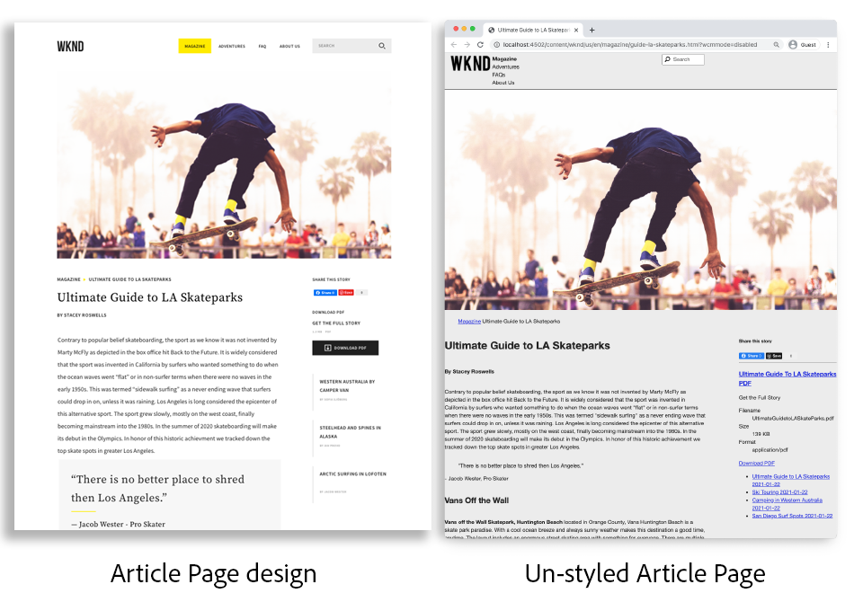
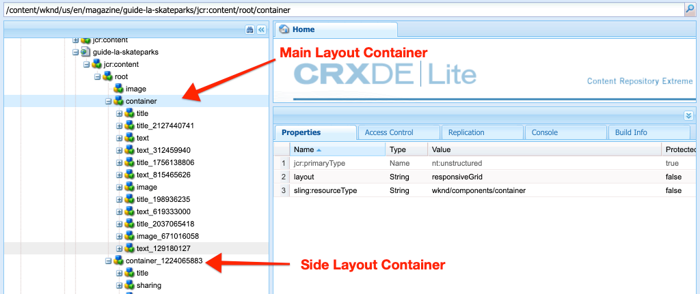

# Pagina&#39;s en sjablonen {#pages-and-template}

{{edge-delivery-services-and-page-editor}}

In dit hoofdstuk, onderzoeken wij de verhouding tussen een component van de basispagina en editable malplaatjes. Leer om een ongestileerd malplaatje van het Artikel te bouwen dat op sommige modellen van [ wordt gebaseerd Adobe XD ](https://helpx.adobe.com/nl/support/xd.html). In het proces om het malplaatje uit te bouwen, zijn de Componenten van de Kern en de geavanceerde beleidsconfiguraties van de Bewerkbare Malplaatjes behandeld.

## Vereisten {#prerequisites}

Herzie het vereiste tooling en de instructies voor vestiging a [ lokale ontwikkelomgeving ](overview.md#local-dev-environment).

### Starter-project

>[!NOTE]
>
> Als u met succes het vorige hoofdstuk voltooide, kunt u het project opnieuw gebruiken en de stappen overslaan voor het uitchecken van het starterproject.

Bekijk de basislijncode waarop de zelfstudie is gebaseerd:

1. Controle uit de `tutorial/pages-templates-start` tak van [ GitHub ](https://github.com/adobe/aem-guides-wknd)

   ```shell
   $ cd ~/code/aem-guides-wknd
   $ git checkout tutorial/pages-templates-start
   ```

1. Stel codebasis aan een lokale AEM instantie op gebruikend uw Maven vaardigheden:

   ```shell
   $ mvn clean install -PautoInstallSinglePackage
   ```

   >[!NOTE]
   >
   > Als u AEM 6.5 of 6.4 gebruikt, voegt u het `classic` -profiel toe aan Maven-opdrachten.

   ```shell
   $ mvn clean install -PautoInstallSinglePackage -Pclassic
   ```

U kunt de gebeëindigde code op [ GitHub ](https://github.com/adobe/aem-guides-wknd/tree/tutorial/pages-templates-solution) altijd bekijken of de code plaatselijk controleren door aan de tak `tutorial/pages-templates-solution` te schakelen.

## Doelstelling

1. Inspect a page design created in Adobe XD and map it to Core Components.
1. Begrijp de details van Bewerkbare Malplaatjes en hoe het beleid kan worden gebruikt om korrelige controle van paginainhoud af te dwingen.
1. Leer hoe sjablonen en pagina&#39;s zijn gekoppeld

## Wat u gaat bouwen {#what-build}

In dit gedeelte van de zelfstudie maakt u een nieuwe artikelpaginasjabloon die u kunt gebruiken om artikelpagina&#39;s te maken en deze uit te lijnen met een gemeenschappelijke structuur. Het sjabloon voor artikelpagina is gebaseerd op ontwerpen en een UI-kit die in Adobe XD is gemaakt. Dit hoofdstuk is alleen gericht op het opbouwen van de structuur of het skelet van de sjabloon. Er worden geen stijlen geïmplementeerd, maar de sjabloon en pagina&#39;s zijn functioneel.



## UI-planning met Adobe XD {#adobexd}

Gewoonlijk begint het plannen voor een nieuwe website met modellen en statische ontwerpen. [ Adobe XD ](https://helpx.adobe.com/nl/support/xd.html) is een ontwerphulpmiddel bouwend gebruikerservaring. Vervolgens inspecteren we een UI-kit en -modellen om de structuur van het sjabloon voor artikelpagina te plannen.

>[!VIDEO](https://video.tv.adobe.com/v/30214?quality=12&learn=on)

**Download het [ WKND Dossier van het Ontwerp van het Artikel ](https://github.com/adobe/aem-guides-wknd/releases/download/aem-guides-wknd-0.0.2/AEM_UI-kit-WKND-article-design.xd)**.

>[!NOTE]
>
> Een generische [ AEM Kit UI van de Componenten van de Kern is ook beschikbaar ](https://experienceleague.adobe.com/docs/experience-manager-learn/assets/AEM-CoreComponents-UI-Kit.xd?lang=nl-NL) als uitgangspunt voor douaneprojecten.

## De sjabloon voor artikelpagina maken

Wanneer u een pagina maakt, moet u een sjabloon selecteren die wordt gebruikt als basis voor het maken van de pagina. De sjabloon definieert de structuur van de resulterende pagina, de initiële inhoud en de toegestane componenten.

Er zijn drie belangrijkste gebieden van [ Bewerkbare Malplaatjes ](https://experienceleague.adobe.com/docs/experience-manager-65/developing/platform/templates/page-templates-editable.html?lang=nl-NL):

1. **Structuur** - bepaalt componenten die een deel van het malplaatje zijn. Deze kunnen niet worden bewerkt door de auteurs van de inhoud.
1. **Aanvankelijke Inhoud** - bepaalt componenten die het malplaatjebegin met, deze kan worden uitgegeven en/of door inhoudauteurs worden geschrapt
1. **Beleid** - bepaalt configuraties op hoe de componenten zich gedragen en welke optiesauteurs hebben.

Maak vervolgens een sjabloon in AEM die overeenkomt met de structuur van de modellen. Dit gebeurt in een lokale instantie van AEM. Voer de stappen in de onderstaande video uit:

>[!VIDEO](https://video.tv.adobe.com/v/330991?quality=12&learn=on)

Stappen op hoog niveau voor de bovenstaande video:

### Structuurconfiguraties

1. Creeer een malplaatje gebruikend het **Type van Malplaatje van de Pagina**, genoemd **Pagina van het Artikel**.
1. Schakelaar in **de wijze van de Structuur**.
1. Voeg een **component van het Fragment van de Ervaring** toe om als **Kopbal** bij de bovenkant van het malplaatje te handelen.
   * Configureer de component die naar `/content/experience-fragments/wknd/us/en/site/header/master` moet wijzen.
   * Plaats het beleid aan **Kopbal van de Pagina** en zorg ervoor dat het **StandaardElement** aan `header` wordt geplaatst. Het `header` element wordt gericht met CSS in het volgende hoofdstuk.
1. Voeg een **component van het Fragment van de Ervaring** toe om als **Voettekst** bij de bodem van het malplaatje te handelen.
   * Configureer de component die naar `/content/experience-fragments/wknd/us/en/site/footer/master` moet wijzen.
   * Plaats het beleid aan **Voettekst van de Pagina** en zorg ervoor dat het **StandaardElement** aan `footer` wordt geplaatst. Het element `footer` wordt in het volgende hoofdstuk gebruikt voor CSS.
1. Vergrendel de **belangrijkste** container die inbegrepen was toen het malplaatje aanvankelijk werd gecreeerd.
   * Plaats het beleid aan **Hoofd van de Pagina** en zorg ervoor dat het **StandaardElement** aan `main` wordt geplaatst. Het element `main` wordt in het volgende hoofdstuk gebruikt voor CSS.
1. Voeg een **component van het Beeld** aan de **belangrijkste** container toe.
   * Ontgrendel de **component van het Beeld**.
1. Voeg a **component Breadcrumb** onder de **component van het Beeld** in de belangrijkste container toe.
   * Creeer een beleid voor de **genoemde component 0&rbrace; Breadcrumb** Artikel Pagina - Breadcrumb **.** Plaats het **Niveau van het Begin van de Navigatie** aan **4**.
1. Voeg de component van de a **Container** onder de **Breadcrumb** component en binnen de **belangrijkste** container toe. Dit doet dienst als **container van de Inhoud** voor het malplaatje.
   * Ontgrendel de **container van de Inhoud**.
   * Plaats het beleid aan **Inhoud van de Pagina**.
1. Voeg een andere **component van de Container** onder de **container van de Inhoud** toe. Dit doet dienst als **Zijspoor** container voor het malplaatje.
   * Ontgrendel de **container van het Rail van de Kant**.
   * Creeer een beleid genoemd **Pagina van het Artikel - zij Rail**.
   * Vorm **Toegestane Componenten** onder **Project van de Plaatsen WKND - Inhoud** om te omvatten: **Knoop**, **Download**, **Beeld**, **Lijst**, **Scheidingsteken**, **Sociale Media die** delen, **&#x200B;**&#x200B;Tekst, en **Titel**.
1. Werk het beleid van de container van de Wortel van de Pagina bij. Dit is de buitenste container op de sjabloon. Plaats het beleid aan **Wortel van de Pagina**.
   * Onder **de Montages van de Container**, plaats de **Lay-out** aan **Responsieve Net**.
1. De Wijze van de Lay-out van de Modus van de Modus van de Modus van de Inzameling voor de **container**. Sleep de handgreep van rechts naar links en krimpt de container tot acht kolommen breed.
1. De Wijze van de Lay-out van de Invoeging voor de **container van het Kernspoor**. Sleep de greep van rechts naar links en krimpt de container in tot vier kolommen breed. Dan sleep het linkerhandvat van links naar rechts één kolom om container 3 kolommen breed te maken en een 1 kolomhiaat tussen de **container van de Inhoud** te verlaten.
1. Open de mobiele emulator en schakel over naar een mobiel onderbrekingspunt. Modus van de de lay-out van de macht opnieuw en maak de **container van de Inhoud** en de **container van het Spoorspoor van de Kant** de volledige breedte van de pagina. Hierdoor worden de containers verticaal in het mobiele onderbrekingspunt gestapeld.
1. Werk het beleid van de **component van de Tekst** in de **container van de Inhoud** bij.
   * Plaats het beleid aan **tekst van de Inhoud**.
   * Onder **Insteekmodules** > **Stijlen van de Paragraaf**, controle **laat paragraafstijlen** toe en zorgt ervoor dat het **blok van het Citaat** wordt toegelaten.

### Aanvankelijke inhoudsconfiguraties

1. Schakelaar aan **Aanvankelijke wijze van de Inhoud**.
1. Voeg a **component van de Titel 0&rbrace; &lbrace;aan de** container van de Inhoud **toe.** Dit is de titel van artikel. Als de pagina leeg blijft, wordt automatisch de titel van de huidige pagina weergegeven.
1. Voeg een tweede **component van de Titel** onder de eerste component van de Titel toe.
   * Configureer de component met de tekst &quot;Door auteur&quot;. Dit is een tijdelijke aanduiding voor tekst.
   * Stel het type in op `H4` .
1. Voeg de component van de a **Tekst** onder **door de component van de Titel van de Auteur** toe.
1. Voeg de component van de Titel van a **&#x200B;**&#x200B;aan de **Zijde Container van het Spoorspoor** toe.
   * Configureer de component met de tekst &quot;Dit artikel delen&quot;.
   * Stel het type in op `H5` .
1. Voeg a **Sociale Media toe die** component onder **delen deze component van de Titel van het Verhaal** delen.
1. Voeg de component van de Scheidingsteken van de a **&#x200B;**&#x200B;onder de **Sociale Media toe die** component delen.
1. Voeg de component van de a **Download** onder de **Scheidingsteken** component toe.
1. Voeg de component van de a **Lijst** onder de **3&rbrace; component van de Download &lbrace;toe.**
1. Werk **Aanvankelijke Eigenschappen van de Pagina** voor het malplaatje bij.
   * Onder **Sociale Media** > **Sociale Media die** delen, controleer **Facebook** en **Pinterest**

### De sjabloon inschakelen en een miniatuur toevoegen

1. Bekijk het malplaatje in de console van het Malplaatje door aan [ http://localhost:4502/libs/wcm/core/content/sites/templates.html/conf/wknd ](http://localhost:4502/libs/wcm/core/content/sites/templates.html/conf/wknd) te navigeren
1. **laat** het malplaatje van de Pagina van het Artikel toe.
1. Bewerk de eigenschappen van de sjabloon Artikelpagina en upload de volgende miniatuur om snel pagina&#39;s te identificeren die zijn gemaakt met de sjabloon Artikelpagina:

   

## Koptekst en voettekst bijwerken met ervaringsfragmenten {#experience-fragments}

Een gemeenschappelijke praktijk wanneer het creëren van globale inhoud, zoals een kopbal of footer, moet een [ Fragment van de Ervaring gebruiken ](https://experienceleague.adobe.com/docs/experience-manager-learn/sites/experience-fragments/experience-fragments-feature-video-use.html?lang=nl-NL). Met de functie Fragmenten van ervaring kunnen gebruikers meerdere componenten combineren om één component te maken die geschikt is voor referentie. De Fragmenten van de ervaring hebben het voordeel om multi-site beheer en [ localisatie ](https://experienceleague.adobe.com/docs/experience-manager-core-components/using/wcm-components/experience-fragment.html?lang=nl-NL) te steunen.

Het AEM Projectarchetype produceerde een Kopbal en Voettekst. Werk vervolgens de Experience Fragments bij zodat deze overeenkomen met de modellen. Voer de stappen in de onderstaande video uit:

>[!VIDEO](https://video.tv.adobe.com/v/330992?quality=12&learn=on)

Stappen op hoog niveau voor de bovenstaande video:

1. Download het pakket van de steekproefinhoud **[WKND-PagesTemplates-Content-Assets.zip](assets/pages-templates/WKND-PagesTemplates-Content-Assets-1.1.zip)**.
1. Upload en installeer het inhoudspakket gebruikend de Manager van het Pakket in [ http://localhost:4502/crx/packmgr/index.jsp ](http://localhost:4502/crx/packmgr/index.jsp)
1. Werk het malplaatje van de Variatie van het Web bij, dat het malplaatje voor de Fragmenten van de Ervaring in [ http://localhost:4502/editor.html/conf/wknd/settings/wcm/templates/xf-web-variation/structure.html ](http://localhost:4502/editor.html/conf/wknd/settings/wcm/templates/xf-web-variation/structure.html) wordt gebruikt
   * Werk het beleid bij de **component van de Container** op het malplaatje.
   * Plaats het beleid aan **XF Wortel**.
   * Onder, **Toegelaten Componenten** selecteren de componentengroep **het Project van Plaatsen WKND - Structuur** om **Navigatie van de Taal**, **Navigatie**, en **Snelle componenten van het Onderzoek** te omvatten.

### Fragment voor koptekstervaring bijwerken

1. Open het Fragment van de Ervaring dat de Kopbal in [ http://localhost:4502/editor.html/content/experience-fragments/wknd/us/en/site/header/master.html ](http://localhost:4502/editor.html/content/experience-fragments/wknd/us/en/site/header/master.html) teruggeeft
1. Vorm de wortel **Container** van het fragment. Dit is de buitenste meest **Container**.
   * Plaats de **Lay-out** aan **Responsief Net**
1. Voeg het **Donkere Logo van WKND** als beeld aan de bovenkant van de **Container** toe. Het logo is opgenomen in het pakket dat in een vorige stap is geïnstalleerd.
   * Wijzig de lay-out van het **Donkere Logo WKND** om **twee** kolommen breed te zijn. Sleep de handgrepen van rechts naar links.
   * Vorm het embleem met **Alternatieve Tekst** van &quot;Logo WKND&quot;.
   * Vorm het embleem aan **Verbinding** aan `/content/wknd/us/en` de pagina van het Huis.
1. Vorm de **component van de Navigatie** die reeds op de pagina wordt geplaatst.
   * Plaats de **Exclude Niveaus van de Wortel** aan **1**.
   * Plaats de **Diepte van de Structuur van de Navigatie** aan **1**.
   * Wijzig de lay-out van de **component van de Navigatie** om **acht** kolommen breed te zijn. Sleep de handgrepen van rechts naar links.
1. Verwijder de **component van de Navigatie van de Taal 0&rbrace;.**
1. Wijzig de lay-out van de **component van het Onderzoek** om **twee** kolommen breed te zijn. Sleep de handgrepen van rechts naar links. Alle componenten moeten nu horizontaal op één rij worden uitgelijnd.

### Fragment Voettekstervaring bijwerken

1. Open het Fragment van de Ervaring dat de Voettekst in [ http://localhost:4502/editor.html/content/experience-fragments/wknd/us/en/site/footer/master.html ](http://localhost:4502/editor.html/content/experience-fragments/wknd/us/en/site/footer/master.html) teruggeeft
1. Vorm de wortel **Container** van het fragment. Dit is de buitenste meest **Container**.
   * Plaats de **Lay-out** aan **Responsief Net**
1. Voeg het **Lichte Logo van WKND** als beeld aan de bovenkant van de **Container** toe. Het logo is opgenomen in het pakket dat in een vorige stap is geïnstalleerd.
   * Wijzig de lay-out van het **Lichte Logo WKND** om **twee** kolommen breed te zijn. Sleep de handgrepen van rechts naar links.
   * Vorm het embleem met **Alternatieve Tekst** van &quot;het Licht van het Logo van WKND&quot;.
   * Vorm het embleem aan **Verbinding** aan `/content/wknd/us/en` de pagina van het Huis.
1. Voeg de component van de a **Navigatie** onder het embleem toe. Vorm de **component van de Navigatie**:
   * Plaats de **Exclude Niveaus van de Wortel** aan **1**.
   * Uncheck **verzamel alle kindpagina&#39;s**.
   * Plaats de **Diepte van de Structuur van de Navigatie** aan **1**.
   * Wijzig de lay-out van de **component van de Navigatie** om **acht** kolommen breed te zijn. Sleep de handgrepen van rechts naar links.

## Een artikelpagina maken

Maak vervolgens een pagina met de sjabloon Artikelpagina. Maak de inhoud van de pagina zodat deze overeenkomt met de sitemakken. Voer de stappen in de onderstaande video uit:

>[!VIDEO](https://video.tv.adobe.com/v/330993?quality=12&learn=on)

Stappen op hoog niveau voor de bovenstaande video:

1. Navigeer aan de console van Plaatsen in [ http://localhost:4502/sites.html/content/wknd/us/en/magazine ](http://localhost:4502/sites.html/content/wknd/us/en/magazine).
1. Creeer een pagina onder **WKND** > **V.S.** > **EN** > **Tijdschrift**.
   * Kies het **malplaatje van de Pagina van het Artikel**.
   * Onder **Eigenschappen** plaats de **Titel** aan &quot;Ultieme Gids aan LA Skateparks&quot;
   * Plaats de **Naam** aan &quot;gids-la-skateparks&quot;
1. Vervang **door de Titel van de Auteur** met de tekst &quot;door Stacey Roswells&quot;.
1. Werk de **component van de Tekst** bij om een paragraaf te omvatten om het artikel te bevolken. U kunt het volgende tekstdossier als exemplaar gebruiken: [ la-skate-parks-copy.txt ](assets/pages-templates/la-skateparks-copy.txt).
1. Voeg een andere **component van de Tekst** toe.
   * Werk de component bij om het aanhalingsteken op te nemen: &quot;Er is geen betere plaats om te delen dan Los Angeles.&quot;.
   * Bewerk de Rijke Redacteur van de Tekst op het volledig-schermwijze en wijzig het bovengenoemde citaat om het **element van het Blok van 0&rbrace; Citaat te gebruiken.**
1. Blijf de tekst van het artikel vullen om deze aan te passen aan de modellen.
1. Vorm de **component van de Download** om een versie van de PDF van het artikel te gebruiken.
   * Onder **Download** > **Eigenschappen**, klik checkbox aan **krijgt de titel van de activa DAM**.
   * Plaats de **Beschrijving** aan: &quot;krijg het Volledige Artikel&quot;.
   * Plaats de **Tekst van de Actie** aan: &quot;PDF van de Download&quot;.
1. Vorm de **component van de Lijst**.
   * Onder **de Montages van de Lijst** > **Bouwt Lijst Gebruikend**, uitgezochte **Pagina&#39;s van het Kind**.
   * Plaats de **Ouderlijke Pagina** aan `/content/wknd/us/en/magazine`.
   * Onder, de **controle** van de Montages van het Punt 0&rbrace; **en controle** tonen datum **.**

## Inspect de nodestructuur {#node-structure}

Op dit punt is de artikelpagina duidelijk ongeopend. De basisstructuur is echter aanwezig. Controleer vervolgens de knooppuntstructuur van de artikelpagina om meer inzicht te krijgen in de rol van de sjabloon, pagina en componenten.

Gebruik het hulpmiddel CRXDE-Lite op een lokale AEM instantie om de onderliggende knoopstructuur te bekijken.

1. Open [ CRXDE-Lite ](http://localhost:4502/crx/de/index.jsp#/content/wknd/us/en/magazine/guide-la-skateparks/jcr%3Acontent) en gebruik de boomnavigatie om aan `/content/wknd/us/en/magazine/guide-la-skateparks` te navigeren.

1. Klik op het knooppunt `jcr:content` onder de pagina `la-skateparks` en bekijk de eigenschappen:

   

   Let op de waarde voor `cq:template` , die verwijst naar `/conf/wknd/settings/wcm/templates/article-page` , de sjabloon voor artikelpagina die u eerder hebt gemaakt.

   Let ook op de waarde van `sling:resourceType` , die naar `wknd/components/page` wijst. Dit is de paginacomponent die door het AEM projectarchetype wordt gecreeerd en is verantwoordelijk voor het teruggeven van pagina die op het malplaatje wordt gebaseerd.

1. Vouw het knooppunt `jcr:content` onder `/content/wknd/us/en/magazine/guide-la-skateparks/jcr:content` uit en bekijk de hiërarchie van het knooppunt:

   

   U zou elk van de knopen aan componenten moeten kunnen losjes in kaart brengen die werden authored. Controleer of u de verschillende containers voor lay-out kunt identificeren die worden gebruikt door de knooppunten te inspecteren die vooraf zijn ingesteld op `container` .

1. Controleer vervolgens de paginacomponent bij `/apps/wknd/components/page` . De componenteigenschappen weergeven in CRXDE Lite:

   

   Er staan slechts twee HTML-scripts, `customfooterlibs.html` en `customheaderlibs.html` onder de paginacomponent. *zo hoe geeft deze component de pagina terug?*

   De eigenschap `sling:resourceSuperType` verwijst naar `core/wcm/components/page/v2/page` . Dit bezit staat de de paginacomponent van WKND toe om **alle** de functionaliteit van de de paginacomponent van de Component van de Kern te erven. Dit is het eerste voorbeeld van iets genoemd het [ Patroon van de Component van de Volmacht ](https://experienceleague.adobe.com/docs/experience-manager-core-components/using/developing/guidelines.html?lang=nl-NL#ProxyComponentPattern). Meer informatie kan [ hier ](https://experienceleague.adobe.com/docs/experience-manager-core-components/using/developing/guidelines.html?lang=nl-NL) worden gevonden.

1. Inspect een andere component binnen de WKND-componenten, de `Breadcrumb` -component van: `/apps/wknd/components/breadcrumb` . Dezelfde eigenschap `sling:resourceSuperType` kan worden gevonden, maar deze keer verwijst deze naar `core/wcm/components/breadcrumb/v2/breadcrumb` . Dit is een ander voorbeeld van het gebruiken van het de componentenpatroon van de Volmacht om een Component van de Kern te omvatten. In feite, zijn alle componenten in de WKND codebasis volmachten van AEMComponenten van de Kern (behalve de component van douane demo HelloWorld). Het is beste praktijken om zoveel mogelijk van de functionaliteit van de Componenten van de Kern te hergebruiken *alvorens* douanecode te schrijven.

1. Controleer vervolgens de pagina Core Component op `/libs/core/wcm/components/page/v2/page` met behulp van CRXDE Lite:

   >[!NOTE]
   >
   > In AEM 6.5/6.4 bevinden de Core Components zich onder `/apps/core/wcm/components`. In AEM as a Cloud Service bevinden de Core Components zich onder `/libs` en worden deze automatisch bijgewerkt.

   

   U ziet dat er veel scriptbestanden onder deze pagina staan. De pagina Core Component bevat een groot aantal functies. Deze functionaliteit is opgedeeld in meerdere scripts voor eenvoudiger onderhoud en leesbaarheid. U kunt de opname van de HTML-scripts overtrekken door de `page.html` te openen en naar `data-sly-include` te zoeken:

   ```html
   <!--/* /libs/core/wcm/components/page/v2/page/page.html */-->
   <!DOCTYPE HTML>
   <html data-sly-use.page="com.adobe.cq.wcm.core.components.models.Page" lang="${page.language}"
       data-sly-use.head="head.html"
       data-sly-use.footer="footer.html"
       data-sly-use.redirect="redirect.html">
       <head data-sly-call="${head.head @ page = page}"></head>
       <body class="${page.cssClassNames}"
           id="${page.id}"
           data-cmp-data-layer-enabled="${page.data ? true : false}">
           <script data-sly-test.dataLayerEnabled="${page.data}">
           window.adobeDataLayer = window.adobeDataLayer || [];
           adobeDataLayer.push({
               page: JSON.parse("${page.data.json @ context='scriptString'}"),
               event:'cmp:show',
               eventInfo: {
                   path: 'page.${page.id @ context="scriptString"}'
               }
           });
           </script>
           <sly data-sly-test.isRedirectPage="${page.redirectTarget && (wcmmode.edit || wcmmode.preview)}"
               data-sly-call="${redirect.redirect @ redirectTarget = page.redirectTarget}"></sly>
           <sly data-sly-test="${!isRedirectPage}">
               <sly data-sly-include="body.skiptomaincontent.html"></sly>
               <sly data-sly-include="body.socialmedia_begin.html"></sly>
               <sly data-sly-include="body.html"></sly>
               <sly data-sly-call="${footer.footer @ page = page}"></sly>
               <sly data-sly-include="body.socialmedia_end.html"></sly>
           </sly>
       </body>
   </html>
   ```

   De andere reden om HTML in veelvoudige manuscripten uit te breken is de volmachtscomponenten toe te staan om individuele manuscripten met voeten te treden om douanebedrijfslogica uit te voeren. De HTML-scripts `customfooterlibs.html` en `customheaderlibs.html` worden gemaakt voor het expliciete doel dat moet worden overschreven door het implementeren van projecten.

   U kunt meer over leren hoe de Bewerkbare factoren van het Malplaatje in het teruggeven van de [ inhoudspagina door dit artikel ](https://experienceleague.adobe.com/docs/experience-manager-65/developing/platform/templates/page-templates-editable.html?lang=nl-NL) te lezen.

1. Inspect nog een Core-component, zoals de Breadcrumb op `/libs/core/wcm/components/breadcrumb/v2/breadcrumb` . Bekijk het `breadcrumb.html` manuscript om te begrijpen hoe de prijsverhoging voor de component Breadcrumb uiteindelijk wordt geproduceerd.

## Configuraties opslaan in Source-besturing {#configuration-persistence}

Vaak, vooral aan het begin van een AEM project is het waardevol om configuraties, zoals malplaatjes en verwant inhoudsbeleid, aan broncontrole voort te zetten. Dit zorgt ervoor dat alle ontwikkelaars tegen de zelfde reeks inhoud en configuraties werken en extra consistentie tussen milieu&#39;s kunnen verzekeren. Wanneer een project een bepaald ontwikkelingsniveau heeft bereikt, kan het beheren van sjablonen worden overgedragen aan een speciale groep van energiegebruikers.


Voor nu, worden de malplaatjes behandeld als andere stukken van code en synchroniseer neer het **Malplaatje van de Pagina van het Artikel** als deel van het project.
Tot nu toe wordt de code geduwd van het AEM project aan een lokaal geval van AEM. Het **Malplaatje van de Pagina van het Artikel** werd gecreeerd direct op een lokaal geval van AEM, zodat moet het **&#x200B;**&#x200B;het malplaatje in het AEM project invoeren. De {**module 0} ui.content is inbegrepen in het AEM project voor dit specifieke doel.**

De volgende paar stappen worden gedaan in winde VSCode gebruikend [ VSCode AEM de stop van de Synchronisatie ](https://marketplace.visualstudio.com/items?itemName=yamato-ltd.vscode-aem-sync&amp;ssr=false#overview). Maar zij konden doen gebruikend om het even welke winde die u aan **invoert** of inhoud van een lokale instantie van AEM hebt gevormd.

1. In, opent VSCode het `aem-guides-wknd` project.

1. Breid **ui.content** module in de ontdekkingsreiziger van het Project uit. Vouw de map `src` uit en navigeer naar `/conf/wknd/settings/wcm/templates` .

1. [!UICONTROL Right+Click] de `templates` omslag en selecteer **Invoer van AEM Server**:

   

   De sjablonen `article-page` moeten worden geïmporteerd en `page-content` , `xf-web-variation` moeten ook worden bijgewerkt.

   

1. Herhaal de stappen om inhoud in te voeren maar selecteer de **beleid** omslag van `/conf/wknd/settings/wcm/policies`.

   

1. Inspect het `filter.xml` -bestand van `ui.content/src/main/content/META-INF/vault/filter.xml` .

   ```xml
   <!--ui.content filter.xml-->
   <?xml version="1.0" encoding="UTF-8"?>
   <workspaceFilter version="1.0">
       <filter root="/conf/wknd" mode="merge"/>
       <filter root="/content/wknd" mode="merge"/>
       <filter root="/content/dam/wknd" mode="merge"/>
       <filter root="/content/experience-fragments/wknd" mode="merge"/>
   </workspaceFilter>
   ```

   Het bestand `filter.xml` identificeert de paden van knooppunten die met het pakket zijn geïnstalleerd. Let op `mode="merge"` op elk van de filters die aangeeft dat bestaande inhoud niet moet worden gewijzigd, alleen nieuwe inhoud wordt toegevoegd. Aangezien de inhoudsauteurs deze wegen kunnen bijwerken, is het belangrijk dat een codeplaatsing **&#x200B;**&#x200B;geen inhoud overschrijft. Zie de [ documentatie FileVault ](https://jackrabbit.apache.org/filevault/filter.html) voor meer details bij het werken met filterelementen.

   Vergelijk `ui.content/src/main/content/META-INF/vault/filter.xml` en `ui.apps/src/main/content/META-INF/vault/filter.xml` om inzicht te krijgen in de verschillende knooppunten die door elke module worden beheerd.

   >[!WARNING]
   >
   > Om consistente plaatsingen voor de plaats van de Verwijzing te verzekeren WKND zijn sommige takken van het project opstelling dusdanig dat `ui.content` om het even welke veranderingen in JCR beschrijft. Dit is door ontwerp, d.w.z. voor de Tak van de Oplossing, aangezien de code/de stijlen voor specifiek beleid worden geschreven.

## Gefeliciteerd! {#congratulations}

U hebt een sjabloon en pagina met Adobe Experience Manager Sites gemaakt.

### Volgende stappen {#next-steps}

Op dit punt is de artikelpagina duidelijk ongeopend. Volg de [ cliënt-Kant Bibliotheken en Voorste-end van het Werkschema ](client-side-libraries.md) leerprogramma om de beste praktijken voor het omvatten van CSS en JavaScript te leren om globale stijlen op de plaats toe te passen en een specifieke front-end bouwstijl te integreren.

Bekijk de gebeëindigde code op [ GitHub ](https://github.com/adobe/aem-guides-wknd) of herzie en stel plaatselijk de code bij de tak van het Git `tutorial/pages-templates-solution` op.

1. Kloon de [ github.com/adobe/aem-wknd-guides ](https://github.com/adobe/aem-guides-wknd) bewaarplaats.
1. Bekijk de `tutorial/pages-templates-solution` -vertakking.
