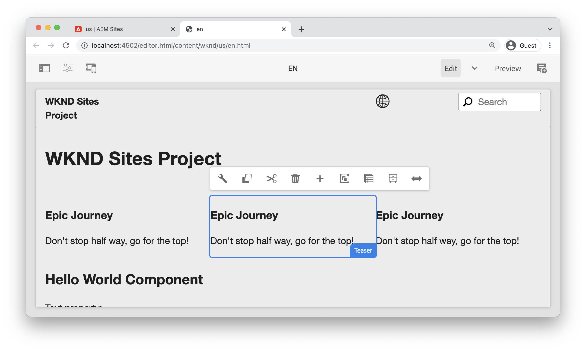
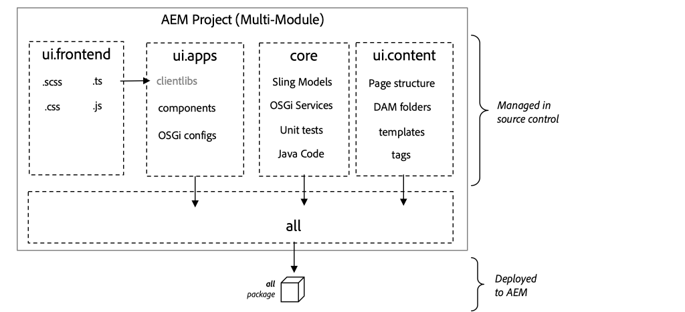
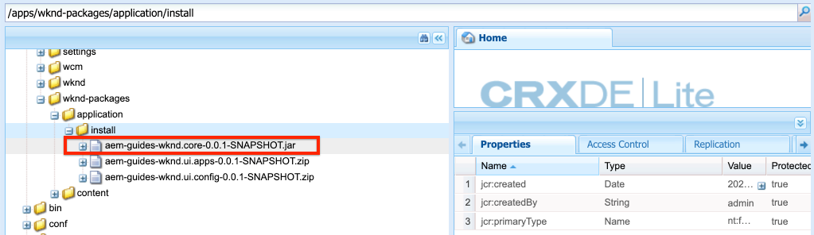

# Projectinstelling {#project-setup}

Deze zelfstudie behandelt het maken van een Maven Multi Module Project om de code en configuraties voor een Adobe Experience Manager Site te beheren.

## Vereisten {#prerequisites}

Controleer de vereiste gereedschappen en instructies voor het instellen van een [lokale ontwikkelomgeving](../overview.md#local-dev-environment). Zorg ervoor dat u een nieuw exemplaar van Adobe Experience Manager lokaal beschikbaar hebt en dat er geen extra sample/demo-pakketten zijn geïnstalleerd (behalve de vereiste Servicepacks).

## Doelstelling {#objective}

1. Leer hoe u een nieuw AEM project kunt genereren met een Maven-archetype.
1. Begrijp de verschillende modules die door het AEM Archetype van het Project worden geproduceerd en hoe zij samenwerken.
1. Begrijp hoe AEM de Componenten van de Kern in een AEM Project inbegrepen zijn.

## Wat u gaat maken {#what-build}

>[!VIDEO](https://video.tv.adobe.com/v/30152/?quality=12&learn=on)

In dit hoofdstuk, zult u een nieuw project van Adobe Experience Manager produceren gebruikend [AEM Project Archetype](https://github.com/adobe/aem-project-archetype). Uw AEM project bevat alle code, inhoud, en configuraties die voor een implementatie van Plaatsen worden gebruikt. Het in dit hoofdstuk gegenereerde project zal als basis dienen voor een implementatie van de WKND-site en zal in toekomstige hoofdstukken worden opgenomen.

**Wat is een Maven-project?** -  [Apache ](https://maven.apache.org/) Mavenis een hulpprogramma voor softwarebeheer voor het opzetten van projecten. *Alle implementaties van het* Managergebruik van de Ervaring van Adobe Maven projecten om douanecode bovenop AEM te bouwen, te beheren en op te stellen.

**Wat is een Maven archetype?** - Een  [Maven-](https://maven.apache.org/archetype/index.html) archetypis is een sjabloon of een patroon voor het genereren van nieuwe projecten. Het AEM archetype van het Project staat ons toe om een nieuw project met een douane te produceren namespace en een projectstructuur te omvatten die beste praktijken volgt, zeer versnellend ons project.

## Het project maken {#create}

Er zijn een paar opties voor het creëren van een Maven Multi-module project voor AEM. Deze zelfstudie maakt gebruik van het [Maven AEM Project Archetype **26**](https://github.com/adobe/aem-project-archetype). Cloud Manager biedt ook [een UI-wizard](https://experienceleague.adobe.com/docs/experience-manager-cloud-manager/using/getting-started/create-application-project/using-the-wizard.html) om het maken van een AEM toepassingsproject te starten. Het onderliggende project dat door de UI van de Manager van de Wolk wordt geproduceerd resulteert in de zelfde structuur zoals direct het gebruiken van archetype.

>[!NOTE]
>
>Deze zelfstudie gebruikt versie **26** van het archetype. Het is altijd een beste praktijk om de **recentste** versie van archetype te gebruiken om een nieuw project te produceren.

De volgende reeks stappen zal plaatsvinden gebruikend een op UNIX gebaseerde terminal van de bevellijn, maar zou gelijkaardig moeten zijn als het gebruiken van een terminal van Vensters.

1. Open een opdrachtregelterminal. Controleer of Maven is geïnstalleerd:

   ```shell
   $ mvn --version
   Apache Maven 3.6.2
   Maven home: /Library/apache-maven-3.6.2
   Java version: 11.0.4, vendor: Oracle Corporation, runtime: /Library/Java/JavaVirtualMachines/jdk-11.0.4.jdk/Contents/Home
   ```

1. Controleer of het profiel **adobe-public** actief is door de volgende opdracht uit te voeren:

   ```shell
   $ mvn help:effective-settings
       ...
   <activeProfiles>
       <activeProfile>adobe-public</activeProfile>
   </activeProfiles>
   <pluginGroups>
       <pluginGroup>org.apache.maven.plugins</pluginGroup>
       <pluginGroup>org.codehaus.mojo</pluginGroup>
   </pluginGroups>
   </settings>
   [INFO] ------------------------------------------------------------------------
   [INFO] BUILD SUCCESS
   [INFO] ------------------------------------------------------------------------
   [INFO] Total time:  0.856 s
   ```

   Als u **not** **adobe-public** ziet, is het een aanwijzing dat de Adobe repo niet behoorlijk in uw `~/.m2/settings.xml` dossier van verwijzingen wordt voorzien. Herzie de stappen voor het installeren en configureren van Apache Maven in [een lokale ontwikkelomgeving](https://experienceleague.adobe.com/docs/experience-manager-learn/foundation/development/set-up-a-local-aem-development-environment.html#install-apache-maven).

1. Navigeer naar een map waarin u het AEM project wilt genereren. Dit kan om het even welke folder zijn waarin u de broncode van uw project wilt handhaven. Bijvoorbeeld een map met de naam `code` onder de thuismap van de gebruiker:

   ```shell
   $ cd ~/code
   ```

1. Plak het volgende in de opdrachtregel om het project in batchmodus te genereren](https://maven.apache.org/archetype/maven-archetype-plugin/examples/generate-batch.html):[

   ```shell
   mvn -B archetype:generate \
       -D archetypeGroupId=com.adobe.aem \
       -D archetypeArtifactId=aem-project-archetype \
       -D archetypeVersion=26 \
       -D appTitle="WKND Sites Project" \
       -D appId="wknd" \
       -D groupId="com.adobe.aem.guides.wknd" \
       -D artifactId="aem-guides-wknd" \
       -D version="0.0.1-SNAPSHOT" \
       -D aemVersion="cloud"
   ```

   >[!NOTE]
   >
   > Bij AEM 6.5.5+ vervangt u `aemVersion="cloud"` door `aemVersion="6.5.5"`. Gebruik `aemVersion="6.4.8"` als u zich richt op 6.4.8+.

   Een volledige lijst van beschikbare eigenschappen voor het vormen van een project [kan hier ](https://github.com/adobe/aem-project-archetype#available-properties) worden gevonden.

1. De volgende map en bestandsstructuur worden gegenereerd door het Maven archetype op uw lokale bestandssysteem:

   ```plain
    ~/code/
       |--- aem-guides-wknd/
           |--- all/
           |--- core/
           |--- ui.apps/
           |--- ui.apps.structure/
           |--- ui.config/
           |--- ui.content/
           |--- ui.frontend/
           |--- ui.tests /
           |--- it.tests/
           |--- dispatcher/
           |--- analyse/
           |--- pom.xml
           |--- README.md
           |--- .gitignore
   ```

## Het project implementeren en bouwen {#build}

Bouw en stel de projectcode aan een lokaal geval van AEM op.

1. Zorg ervoor dat u een auteurinstantie hebt van AEM die lokaal op poort **4502** wordt uitgevoerd.
1. Van de bevellijn navigeer in de `aem-guides-wknd` projectfolder.

   ```shell
   $ cd aem-guides-wknd
   ```

1. Stel het volgende bevel in werking om het volledige project te bouwen en op te stellen aan AEM:

   ```shell
   $ mvn clean install -PautoInstallSinglePackage
   ```

   De build zal ongeveer een minuut in beslag nemen en zal eindigen met het volgende bericht:

   ```
   ...
   [INFO] ------------------------------------------------------------------------
   [INFO] Reactor Summary for aem-guides-wknd 0.0.1-SNAPSHOT:
   [INFO]
   [INFO] aem-guides-wknd .................................... SUCCESS [  0.269 s]
   [INFO] WKND Sites Project - Core .......................... SUCCESS [  8.047 s]
   [INFO] WKND Sites Project - UI Frontend ................... SUCCESS [01:02 min]
   [INFO] WKND Sites Project - Repository Structure Package .. SUCCESS [  1.985 s]
   [INFO] WKND Sites Project - UI apps ....................... SUCCESS [  8.037 s]
   [INFO] WKND Sites Project - UI content .................... SUCCESS [  4.672 s]
   [INFO] WKND Sites Project - UI config ..................... SUCCESS [  0.313 s]
   [INFO] WKND Sites Project - All ........................... SUCCESS [  0.270 s]
   [INFO] WKND Sites Project - Integration Tests ............. SUCCESS [ 15.571 s]
   [INFO] WKND Sites Project - Dispatcher .................... SUCCESS [  0.232 s]
   [INFO] WKND Sites Project - UI Tests ...................... SUCCESS [  0.728 s]
   [INFO] WKND Sites Project - Project Analyser .............. SUCCESS [ 33.398 s]
   [INFO] ------------------------------------------------------------------------
   [INFO] BUILD SUCCESS
   [INFO] ------------------------------------------------------------------------
   [INFO] Total time:  02:18 min
   [INFO] Finished at: 2021-01-31T12:33:56-08:00
   [INFO] ------------------------------------------------------------------------
   ```

   Het profiel Maven `autoInstallSinglePackage` compileert de individuele modules van het project en stelt één enkel pakket aan de AEM instantie op. Dit pakket wordt standaard geïmplementeerd op een AEM instantie die lokaal op poort **4502** wordt uitgevoerd en met de referenties van `admin:admin`.

1. Navigeer naar Package Manager op uw lokale AEM-instantie: [http://localhost:4502/crx/packmgr/index.jsp](http://localhost:4502/crx/packmgr/index.jsp). U moet pakketten voor `aem-guides-wknd.ui.apps`, `aem-guides-wknd.ui.config`, `aem-guides-wknd.ui.content`, en `aem-guides-wknd.all` zien.

1. Navigeer naar de Sites-console: [http://localhost:4502/sites.html/content](http://localhost:4502/sites.html/content). De WKND-site wordt een van de sites. Dit omvat een sitestructuur met een hiërarchie voor Amerikaanse en taalmeesters. Deze sitehiërarchie is gebaseerd op de waarden voor `language_country` en `isSingleCountryWebsite` bij het genereren van het project met het archetype.

1. Open de pagina **US** `>` **English** door de pagina te selecteren en op de knop **Edit** in de menubalk te klikken:

   

1. Starter-inhoud is al gemaakt en er zijn verschillende componenten beschikbaar die aan een pagina moeten worden toegevoegd. Experimenteer met deze componenten om een idee te krijgen van de functionaliteit. In het volgende hoofdstuk leert u de grondbeginselen van een component.

   

   *Voorbeeldinhoud gegenereerd door Archetype*

## Inspect het project {#project-structure}

Het geproduceerde AEM project bestaat uit individuele Geproduceerde modules, elk met een verschillende rol. Deze zelfstudie en een meerderheid van de ontwikkelingsprogramma&#39;s zijn gericht op de volgende modules:

* [core](https://experienceleague.adobe.com/docs/experience-manager-core-components/using/developing/archetype/core.html) - Java Code, voornamelijk back-end ontwikkelaars.
* [ui.front](https://experienceleague.adobe.com/docs/experience-manager-core-components/using/developing/archetype/uifrontend.html) - Bevat broncode voor CSS, JavaScript, Sass, Type Script, voornamelijk voor front-end ontwikkelaars.
* [ui.apps](https://experienceleague.adobe.com/docs/experience-manager-core-components/using/developing/archetype/uiapps.html)  - Bevat component- en dialoogdefinities, sluit gecompileerde CSS en JavaScript in als clientbibliotheken.
* [ui.content](https://experienceleague.adobe.com/docs/experience-manager-core-components/using/developing/archetype/uicontent.html)  - bevat structurele inhoud en configuraties zoals bewerkbare sjablonen, metagegevensschema&#39;s (/content, /conf).

* **alles**  - dit is een lege Geweven module die de bovengenoemde modules in één enkel pakket combineert dat aan een AEM milieu kan worden opgesteld.



Zie [AEM documentatie van Archetype van het Project](https://experienceleague.adobe.com/docs/experience-manager-core-components/using/developing/archetype/overview.html) om meer details van **all** de Geweven modules te leren.

### Opname van kerncomponenten {#core-components}

[AEM de ](https://experienceleague.adobe.com/docs/experience-manager-core-components/using/introduction.html) Componenten van de Kern zijn een reeks gestandaardiseerde componenten van het Beheer van de Inhoud van het Web (WCM) voor AEM. Deze componenten bieden een basislijnset van een functionaliteit en zijn ontworpen om te worden vormgegeven, aangepast en uitgebreid voor afzonderlijke projecten.

AEM als een Cloud Service milieu&#39;s omvat de recentste versie van [AEM de Componenten van de Kern](https://experienceleague.adobe.com/docs/experience-manager-core-components/using/introduction.html). Daarom omvatten de projecten die voor AEM als Cloud Service worden geproduceerd **not** een bed van AEM Componenten van de Kern omvatten.

Voor AEM 6.5/6.4 geproduceerde projecten, sluit archetype automatisch [AEM de Componenten van de Kern ](https://experienceleague.adobe.com/docs/experience-manager-core-components/using/introduction.html) in het project in. Het is aan te raden AEM 6.5/6.4 AEM Core Components in te sluiten om ervoor te zorgen dat de nieuwste versie wordt geïmplementeerd met uw project. Meer informatie over hoe de Componenten van de Kern [inbegrepen in het project zijn kan hier worden gevonden](https://experienceleague.adobe.com/docs/experience-manager-core-components/using/developing/archetype/using.html#core-components).

## Beheer van bronbeheer {#source-control}

Het is altijd een goed idee om een of andere vorm van broncontrole te gebruiken om de code in uw toepassing te beheren. Dit leerprogramma gebruikt git en GitHub. Er zijn verscheidene dossiers die door Geweven en/of winde van keus worden geproduceerd die door SCM zouden moeten worden genegeerd.

Maven maakt een doelmap wanneer u het codepakket maakt en installeert. De doelmap en -inhoud moeten worden uitgesloten van SCM.

Hieronder `ui.apps` ziet u dat er veel `.content.xml` bestanden zijn gemaakt. Deze XML-bestanden geven de knooppunttypen en eigenschappen weer van inhoud die in de JCR is geïnstalleerd. Deze bestanden zijn van essentieel belang en moeten **not** worden genegeerd.

Het AEM projectarchetype zal een steekproef `.gitignore` dossier produceren dat als uitgangspunt kan worden gebruikt waarvoor de dossiers veilig kunnen worden genegeerd. Het bestand wordt gegenereerd op `<src>/aem-guides-wknd/.gitignore`.

## Gefeliciteerd! {#congratulations}

Gefeliciteerd, u hebt zojuist uw eerste AEM Project gemaakt!

### Volgende stappen {#next-steps}

Met de zelfstudie [Basisbeginselen van componenten](component-basics.md) begrijpt u de onderliggende technologie van een Adobe Experience Manager (AEM) Sites Component via een eenvoudig `HelloWorld`-voorbeeld.

## Geavanceerde Maven-opdrachten (Bonus) {#advanced-maven-commands}

Tijdens ontwikkeling kunt u met enkel één van de modules werken en wilt vermijden bouw het volledige project om tijd te besparen. U kunt ook rechtstreeks aan een AEM publiceren instantie of misschien aan een geval van AEM willen opstellen die niet op haven 4502 loopt.

Vervolgens bekijken we enkele extra Maven-profielen en -opdrachten die u tijdens de ontwikkeling kunt gebruiken voor meer flexibiliteit.

### Kernmodule {#core-module}

De **[core](https://experienceleague.adobe.com/docs/experience-manager-core-components/using/developing/archetype/core.html)** module bevat alle code van Java verbonden aan het project. Wanneer gebouwd stelt het een bundel OSGi aan AEM op. Alleen deze module samenstellen:

1. Navigeer in de `core` omslag (onder `aem-guides-wknd`):

   ```shell
   $ cd core/
   ```

1. Voer de volgende opdracht uit:

   ```shell
   $ mvn clean install -PautoInstallBundle
   ...
   [INFO] --- sling-maven-plugin:2.4.0:install (install-bundle) @ aem-guides-wknd.core ---
   [INFO] Installing Bundle aem-guides-wknd.core(~/code/aem-guides-wknd/core/target/aem-guides-wknd.core-0.0.1-SNAPSHOT.jar) to http://localhost:4502/system/console via WebConsole
   [INFO] Bundle installed
   [INFO] ------------------------------------------------------------------------
   [INFO] BUILD SUCCESS
   [INFO] ------------------------------------------------------------------------
   [INFO] Total time:  8.558 s
   ```

1. Navigeer naar [http://localhost:4502/system/console/bundles](http://localhost:4502/system/console/bundles). Dit is de console OSGi van het Web en bevat informatie over alle bundels die op de AEM instantie worden geïnstalleerd.

1. Schakel de sorteerkolom **Id** in en u ziet dat de WKND-bundel is geïnstalleerd en actief is.

   

1. U kunt de &#39;fysieke&#39; locatie van de jar zien in [CRXDE-Lite](http://localhost:4502/crx/de/index.jsp#/apps/wknd-packages/application/install/aem-guides-wknd.core-1.0.0-SNAPSHOT.jar):

   

### Ui.apps en Ui.content-modules {#apps-content-module}

De gemaakte module **[ui.apps](https://experienceleague.adobe.com/docs/experience-manager-core-components/using/developing/archetype/uiapps.html)** bevat alle renderingcode die nodig is voor de site onder `/apps`. Dit omvat CSS/JS die in een AEM formaat genoemd [clientlibs](https://experienceleague.adobe.com/docs/experience-manager-cloud-service/implementing/developing/clientlibs.html) zal worden opgeslagen. Dit omvat ook [HTML](https://experienceleague.adobe.com/docs/experience-manager-htl/using/overview.html)-scripts voor het renderen van dynamische HTML. U kunt de **ui.apps** module als kaart aan de structuur in JCR maar in een formaat denken dat op een dossiersysteem kan worden opgeslagen en aan broncontrole wordt geëngageerd. De module **ui.apps** bevat alleen code.

Om enkel deze module te bouwen:

1. Via de opdrachtregel. Navigeer in de `ui.apps` omslag (onder `aem-guides-wknd`):

   ```shell
   $ cd ../ui.apps
   ```

1. Voer de volgende opdracht uit:

   ```shell
   $ mvn clean install -PautoInstallPackage
   ...
   Package installed in 122ms.
   [INFO] ------------------------------------------------------------------------
   [INFO] BUILD SUCCESS
   [INFO] ------------------------------------------------------------------------
   [INFO] Total time:  6.972 s
   [INFO] Finished at: 2019-12-06T14:44:12-08:00
   [INFO] ------------------------------------------------------------------------
   ```

1. Navigeer naar [http://localhost:4502/crx/packmgr/index.jsp](http://localhost:4502/crx/packmgr/index.jsp). Het `ui.apps`-pakket wordt als het eerste geïnstalleerde pakket weergegeven en het moet een recentere tijdstempel hebben dan een van de andere pakketten.

   

1. Ga terug naar de bevellijn en stel het volgende bevel (binnen de `ui.apps` omslag) in werking:

   ```shell
   $ mvn -PautoInstallPackagePublish clean install
   ...
   [INFO] --- content-package-maven-plugin:1.0.2:install (install-package-publish) @ aem-guides-wknd.ui.apps ---
   [INFO] Installing aem-guides-wknd.ui.apps (/Users/dgordon/code/aem-guides-wknd/ui.apps/target/aem-guides-wknd.ui.apps-0.0.1-SNAPSHOT.zip) to http://localhost:4503/crx/packmgr/service.jsp
   [INFO] I/O exception (java.net.ConnectException) caught when processing request: Connection refused (Connection refused)
   [INFO] Retrying request
   [INFO] I/O exception (java.net.ConnectException) caught when processing request: Connection refused (Connection refused)
   [INFO] Retrying request
   [INFO] I/O exception (java.net.ConnectException) caught when processing request: Connection refused (Connection refused)
   [INFO] Retrying request
   [INFO] ------------------------------------------------------------------------
   [INFO] BUILD FAILURE
   [INFO] ------------------------------------------------------------------------
   [INFO] Total time:  6.717 s
   [INFO] Finished at: 2019-12-06T14:51:45-08:00
   [INFO] ------------------------------------------------------------------------
   ```

   Het profiel `autoInstallPackagePublish` is bedoeld om het pakket te implementeren in een publicatieomgeving die wordt uitgevoerd op poort **4503**. De bovenstaande fout wordt verwacht als er geen AEM op http://localhost:4503 wordt uitgevoerd.

1. Voer ten slotte de volgende opdracht uit om het `ui.apps`-pakket op poort **4504** te implementeren:

   ```shell
   $ mvn -PautoInstallPackage clean install -Daem.port=4504
   ...
   [INFO] --- content-package-maven-plugin:1.0.2:install (install-package) @ aem-guides-wknd.ui.apps ---
   [INFO] Installing aem-guides-wknd.ui.apps (/Users/dgordon/code/aem-guides-wknd/ui.apps/target/aem-guides-wknd.ui.apps-0.0.1-SNAPSHOT.zip) to http://localhost:4504/crx/packmgr/service.jsp
   [INFO] I/O exception (java.net.ConnectException) caught when processing request: Connection refused (Connection refused)
   [INFO] Retrying request
   [INFO] I/O exception (java.net.ConnectException) caught when processing request: Connection refused (Connection refused)
   [INFO] Retrying request
   [INFO] I/O exception (java.net.ConnectException) caught when processing request: Connection refused (Connection refused)
   [INFO] Retrying request
   [INFO] ------------------------------------------------------------------------
   [INFO] BUILD FAILURE
   [INFO] --------------------------------------------------------------------
   ```

   Opnieuw wordt een bouwstijlmislukking verwacht om voor te komen als geen AEM instantie die op haven **4504** loopt beschikbaar is. De parameter `aem.port` wordt gedefinieerd in het POM-bestand op `aem-guides-wknd/pom.xml`.

De **[ui.content](https://experienceleague.adobe.com/docs/experience-manager-core-components/using/developing/archetype/uicontent.htm)** module is op dezelfde manier gestructureerd als de **ui.apps** module. Het enige verschil is dat de **ui.content** module het zogenaamde **mutable**-gehalte bevat. **** Mutablecontent verwijst hoofdzakelijk naar niet-codeconfiguraties zoals Malplaatjes, Beleid, of omslagstructuren die in bron-controle  **** maar worden opgeslagen zou op een AEM instantie direct kunnen worden gewijzigd. Dit zal in het hoofdstuk over Pagina&#39;s en Malplaatjes veel gedetailleerder worden onderzocht.

De zelfde Gemaakt bevelen die worden gebruikt om **ui.apps** module te bouwen kunnen worden gebruikt om **ui.content** module te bouwen. U kunt de bovenstaande stappen vrij herhalen vanuit de map **ui.content**.
