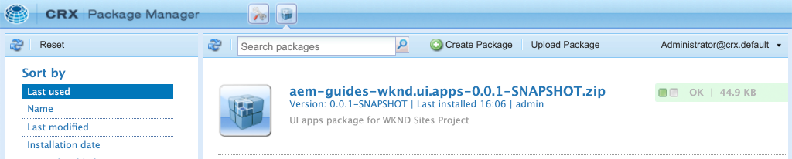

# Projectinstelling {#project-setup}

Deze zelfstudie behandelt het maken van een Maven Multi Module Project om de code en configuraties voor een Adobe Experience Manager Site te beheren.

## Vereisten {#prerequisites}

Herzie het vereiste tooling en de instructies voor vestiging a [ lokale ontwikkelomgeving ](./overview.md#local-dev-environment). Zorg ervoor dat u een nieuw exemplaar van Adobe Experience Manager lokaal beschikbaar hebt en dat er geen extra sample/demo-pakketten zijn geïnstalleerd (behalve de vereiste Servicepacks).

## Doelstelling {#objective}

1. Leer hoe u een nieuw AEM-project kunt genereren met een Maven-archetype.
1. Begrijp de verschillende modules die door het Archetype van het Project van AEM worden geproduceerd en hoe zij samenwerken.
1. Begrijp hoe AEM Core Components in een AEM Project zijn opgenomen.

## Wat u gaat bouwen {#what-build}

>[!VIDEO](https://video.tv.adobe.com/v/30152?quality=12&learn=on)

In dit hoofdstuk, produceert u een nieuw project van Adobe Experience Manager gebruikend het [ Archetype van het Project van AEM ](https://github.com/adobe/aem-project-archetype). Uw AEM-project bevat volledige code, inhoud en configuraties die worden gebruikt voor een Sites-implementatie. Het in dit hoofdstuk gegenereerde project dient als basis voor een implementatie van de WKND-site en wordt in toekomstige hoofdstukken verder ontwikkeld.

**wat is een Maven project?** - [ Apache Maven ](https://maven.apache.org/) is een hulpmiddel van het softwarebeheer om projecten te bouwen. *Alle Adobe Experience Manager* implementaties gebruiken GeMaven projecten om, douanecode bovenop AEM te bouwen te beheren en op te stellen.

**wat is een Maven archetype?** - A [ Maven archetype ](https://maven.apache.org/archetype/index.html) is een malplaatje of een patroon voor het produceren van nieuwe projecten. Het archetype van het Project van AEM helpt om een nieuw project met een douane te produceren namespace en een projectstructuur te omvatten die beste praktijken volgt, zeer versnellend de projectontwikkeling.

## Het project maken {#create}

Er zijn een paar opties voor het maken van een Maven Multi-module project voor AEM. Dit leerprogramma gebruikt [ Gemaakt Archetype van het Project van AEM **35** ](https://github.com/adobe/aem-project-archetype). Cloud Manager [ verstrekt ook een tovenaar UI ](https://experienceleague.adobe.com/docs/experience-manager-cloud-manager/content/getting-started/project-creation/using-the-wizard.html?lang=nl-NL) om de verwezenlijking van een de toepassingsproject van AEM in werking te stellen. Het onderliggende project dat door Cloud Manager UI wordt geproduceerd resulteert in de zelfde structuur zoals direct het gebruiken van archetype.

>[!NOTE]
>
>Dit leerprogramma gebruikt versie **35** van archetype. Het is altijd een beste praktijk om de **recentste** versie van archetype te gebruiken om een nieuw project te produceren.

De volgende reeks stappen zal plaatsvinden gebruikend op UNIX® gebaseerde bevel-lijn terminal, maar zou gelijkaardig moeten zijn als het gebruiken van een terminal van Vensters.

1. Open een opdrachtregelterminal. Controleer of Maven is geïnstalleerd:

   ```shell
   $ mvn --version
   Apache Maven 3.6.2
   Maven home: /Library/apache-maven-3.6.2
   Java version: 11.0.4, vendor: Oracle Corporation, runtime: /Library/Java/JavaVirtualMachines/jdk-11.0.4.jdk/Contents/Home
   ```

1. Navigeer naar een map waarin u het AEM-project wilt genereren. Dit kan om het even welke folder zijn waarin u de broncode van uw project wilt handhaven. Bijvoorbeeld een map met de naam `code` onder de homemap van de gebruiker:

   ```shell
   $ cd ~/code
   ```

1. Plak het volgende in de bevellijn om [ het project op partijwijze ](https://maven.apache.org/archetype/maven-archetype-plugin/examples/generate-batch.html) te produceren:

   ```shell
   mvn -B org.apache.maven.plugins:maven-archetype-plugin:3.2.1:generate \
       -D archetypeGroupId=com.adobe.aem \
       -D archetypeArtifactId=aem-project-archetype \
       -D archetypeVersion=39 \
       -D appTitle="WKND Sites Project" \
       -D appId="wknd" \
       -D groupId="com.adobe.aem.guides" \
       -D artifactId="aem-guides-wknd" \
       -D package="com.adobe.aem.guides.wknd" \
       -D version="0.0.1-SNAPSHOT" \
       -D aemVersion="cloud"
   ```

   >[!NOTE]
   >
   > Als u AEM 6.5.14+ als doel wilt instellen, vervangt u `aemVersion="cloud"` door `aemVersion="6.5.14"` .
   >
   > Ook, gebruik altijd recentste `archetypeVersion` door naar [ te verwijzen AEM Project Archetype > Gebruik ](https://github.com/adobe/aem-project-archetype#usage)

   Een volledige lijst van beschikbare eigenschappen voor het vormen van een project [ kan hier ](https://github.com/adobe/aem-project-archetype#available-properties) worden gevonden.

1. De volgende map en bestandsstructuur worden gegenereerd door het Maven archetype op uw lokale bestandssysteem:

   ```plain
    ~/code/
       |--- aem-guides-wknd/
           |--- all/
           |--- core/
           |--- ui.apps/
           |--- ui.apps.structure/
           |--- ui.config/
           |--- ui.content/
           |--- ui.frontend/
           |--- ui.tests /
           |--- it.tests/
           |--- dispatcher/
           |--- pom.xml
           |--- README.md
           |--- .gitignore
   ```

## Het project implementeren en bouwen {#build}

Bouw en stel de projectcode aan een lokaal geval van AEM op.

1. Verzeker u een auteursgeval van AEM hebt die plaatselijk op haven **4502** lopen.
1. Navigeer vanaf de opdrachtregel naar de projectmap `aem-guides-wknd` .

   ```shell
   $ cd aem-guides-wknd
   ```

1. Voer het volgende bevel in werking om het volledige project aan AEM te bouwen en op te stellen:

   ```shell
   $ mvn clean install -PautoInstallSinglePackage
   ```

   De build neemt ongeveer een minuut in beslag en moet eindigen met het volgende bericht:

   ```
   ...
   [INFO] ------------------------------------------------------------------------
   [INFO] Reactor Summary for WKND Sites Project 0.0.1-SNAPSHOT:
   [INFO] 
   [INFO] WKND Sites Project ................................. SUCCESS [  0.113 s]
   [INFO] WKND Sites Project - Core .......................... SUCCESS [  3.136 s]
   [INFO] WKND Sites Project - UI Frontend ................... SUCCESS [  4.461 s]
   [INFO] WKND Sites Project - Repository Structure Package .. SUCCESS [  0.359 s]
   [INFO] WKND Sites Project - UI apps ....................... SUCCESS [  1.732 s]
   [INFO] WKND Sites Project - UI content .................... SUCCESS [  0.956 s]
   [INFO] WKND Sites Project - UI config ..................... SUCCESS [  0.064 s]
   [INFO] WKND Sites Project - All ........................... SUCCESS [  8.229 s]
   [INFO] WKND Sites Project - Integration Tests ............. SUCCESS [  3.329 s]
   [INFO] WKND Sites Project - Dispatcher .................... SUCCESS [  0.027 s]
   [INFO] WKND Sites Project - UI Tests ...................... SUCCESS [  0.032 s]
   [INFO] ------------------------------------------------------------------------
   [INFO] BUILD SUCCESS
   [INFO] ------------------------------------------------------------------------
   [INFO] Total time:  23.189 s
   [INFO] Finished at: 2023-01-10T11:12:23-05:00
   [INFO] ------------------------------------------------------------------------    
   ```

   Met het profiel Maven `autoInstallSinglePackage` worden de afzonderlijke modules van het project gecompileerd en wordt één pakket geïmplementeerd voor de AEM-instantie. Door gebrek wordt dit pakket opgesteld aan een instantie van AEM die plaatselijk op haven **4502** en met de geloofsbrieven van `admin:admin` loopt.

1. Navigeer aan de Manager van het Pakket op uw lokale instantie van AEM: [ http://localhost:4502/crx/packmgr/index.jsp ](http://localhost:4502/crx/packmgr/index.jsp). Pakketten voor `aem-guides-wknd.ui.apps` , `aem-guides-wknd.ui.config` , `aem-guides-wknd.ui.content` en `aem-guides-wknd.all` worden weergegeven.

1. Navigeer aan de console van Plaatsen: [ http://localhost:4502/sites.html/content ](http://localhost:4502/sites.html/content). De WKND-site is een van de sites. Het bevat een sitestructuur met een hiërarchie voor Amerikaanse en taalmeesters. Deze sitehiërarchie is gebaseerd op de waarden voor `language_country` en `isSingleCountryWebsite` bij het genereren van het project met het archetype.

1. Open de **Amerikaanse** `>` **Engelse** pagina door de pagina te selecteren en **te klikken geef** knoop in de menubar uit:

   

1. Starter-inhoud is al gemaakt en er zijn verschillende componenten beschikbaar die aan een pagina moeten worden toegevoegd. Experimenteer met deze componenten om een idee te krijgen van de functionaliteit. In het volgende hoofdstuk leert u de grondbeginselen van een component.

   

   *inhoud van de Steekproef die door Archetype* wordt geproduceerd

## Het project inspecteren {#project-structure}

Het gegenereerde AEM-project bestaat uit afzonderlijke Maven-modules, elk met een andere rol. Deze zelfstudie en de meeste ontwikkelingsprogramma&#39;s richten zich op deze modules:

* [ kern ](https://experienceleague.adobe.com/docs/experience-manager-core-components/using/developing/archetype/core.html?lang=nl-NL) - de Code van Java, hoofdzakelijk achterste deelontwikkelaars.
* [ ui.frontend ](https://experienceleague.adobe.com/docs/experience-manager-core-components/using/developing/archetype/uifrontend.html?lang=nl-NL) - bevat broncode voor CSS, JavaScript, Sass, TypeScript, hoofdzakelijk voor front-end ontwikkelaars.
* [ ui.apps ](https://experienceleague.adobe.com/docs/experience-manager-core-components/using/developing/archetype/uiapps.html?lang=nl-NL) - bevat component en dialoogdefinities, sluit gecompileerde CSS en JavaScript als cliëntbibliotheken in.
* [ ui.content ](https://experienceleague.adobe.com/docs/experience-manager-core-components/using/developing/archetype/uicontent.html?lang=nl-NL) - bevat structurele inhoud en configuraties zoals editable malplaatjes, meta-gegevensschema&#39;s (/content, /conf).

* **allen** - dit is een lege Gemaakt module die de bovengenoemde modules in één enkel pakket combineert dat aan een milieu van AEM kan worden opgesteld.


Zie de [ documentatie van het Archetype van het Project van AEM ](https://experienceleague.adobe.com/docs/experience-manager-core-components/using/developing/archetype/overview.html?lang=nl-NL) om meer details van **te leren alle** de GeMaven modules.

### Opname van kerncomponenten {#core-components}

[ de Componenten van de Kern van AEM ](https://experienceleague.adobe.com/docs/experience-manager-core-components/using/introduction.html?lang=nl-NL) zijn een reeks gestandaardiseerde componenten van het Beheer van de Inhoud van het Web (WCM) voor AEM. Deze componenten verstrekken een basislijnreeks van een functionaliteit en worden gestileerd, aangepast, en uitgebreid voor individuele projecten.

Het milieu van AEM as a Cloud Service omvat de recentste versie van [ de Componenten van de Kern van AEM ](https://experienceleague.adobe.com/docs/experience-manager-core-components/using/introduction.html?lang=nl-NL). Daarom omvatten de projecten die voor AEM as a Cloud Service worden geproduceerd **&#x200B;**&#x200B;geen inbedden van de Componenten van de Kern van AEM.

Voor AEM 6.5/6.4 produceerde projecten, sluit archetype {de Componenten van de Kern van 0} AEM [&#128279;](https://experienceleague.adobe.com/docs/experience-manager-core-components/using/introduction.html?lang=nl-NL) automatisch in het project in.  Het is aan te raden om AEM 6.5/6.4 AEM Core Components in te sluiten om ervoor te zorgen dat de nieuwste versie wordt geïmplementeerd met uw project. Meer informatie over hoe de Componenten van de Kern [ inbegrepen in het project kan worden gevonden hier ](https://experienceleague.adobe.com/docs/experience-manager-core-components/using/developing/archetype/using.html?lang=nl-NL#core-components).

## Source Control Management {#source-control}

Het is altijd een goed idee om een of andere vorm van broncontrole te gebruiken om de code in uw toepassing te beheren. Dit leerprogramma gebruikt git en GitHub. Er zijn verscheidene dossiers die door Geweven en/of winde van keus worden geproduceerd die door SCM zouden moeten worden genegeerd.

Maven leidt tot een doelomslag wanneer u het codepakket bouwt en installeert. De doelmap en -inhoud moeten worden uitgesloten van SCM.

In de module `ui.apps` ziet u dat er veel `.content.xml` -bestanden worden gemaakt. Deze XML-bestanden geven de knooppunttypen en eigenschappen weer van inhoud die in de JCR is geïnstalleerd. Deze dossiers zijn kritiek en **kan** niet worden genegeerd.

Het AEM-projectarchetype genereert een voorbeeldbestand `.gitignore` dat kan worden gebruikt als beginpunt voor het veilig negeren van bestanden. Het bestand wordt gegenereerd bij `<src>/aem-guides-wknd/.gitignore` .

## Gefeliciteerd! {#congratulations}

Gefeliciteerd, je hebt je eerste AEM Project gemaakt!

### Volgende stappen {#next-steps}

Begrijp de onderliggende technologie van een Component van de Plaatsen van Adobe Experience Manager (AEM) door een eenvoudig `HelloWorld` voorbeeld met de [ Grondbeginselen van de Component ](component-basics.md) leerprogramma.

## Geavanceerde Maven-opdrachten (Bonus) {#advanced-maven-commands}

Tijdens ontwikkeling, kunt u met enkel één van de modules werken en wilt vermijden bouw het volledige project om tijd te besparen. U kunt ook rechtstreeks implementeren naar een AEM Publish-instantie of wellicht naar een instantie van AEM die niet wordt uitgevoerd op poort 4502.

Laten we nu enkele extra Maven-profielen en -opdrachten bekijken die u tijdens de ontwikkeling kunt gebruiken voor meer flexibiliteit.

### Kernmodule {#core-module}

De **[kern ](https://experienceleague.adobe.com/docs/experience-manager-core-components/using/developing/archetype/core.html?lang=nl-NL)** module bevat alle code Java™ verbonden aan het project. De bouw van **kern** module stelt een bundel OSGi aan AEM op. Alleen deze module samenstellen:

1. Navigeer naar de map `core` (onder `aem-guides-wknd` ):

   ```shell
   $ cd core/
   ```

1. Voer de volgende opdracht uit:

   ```shell
   $ mvn clean install -PautoInstallBundle
   ...
   [INFO] --- sling-maven-plugin:2.4.0:install (install-bundle) @ aem-guides-wknd.core ---
   [INFO] Installing Bundle aem-guides-wknd.core(~/code/aem-guides-wknd/core/target/aem-guides-wknd.core-0.0.1-SNAPSHOT.jar) to http://localhost:4502/system/console via WebConsole
   [INFO] Bundle installed
   [INFO] ------------------------------------------------------------------------
   [INFO] BUILD SUCCESS
   [INFO] ------------------------------------------------------------------------
   [INFO] Total time:  8.558 s
   ```

1. Navigeer aan [ http://localhost:4502/system/console/bundles ](http://localhost:4502/system/console/bundles). Dit is de console OSGi van het Web en bevat informatie over alle bundels die op de instantie van AEM worden geïnstalleerd.

1. Wissel de **Identiteitskaart** sorteerkolom in-/uitschakelen en u zou de geïnstalleerde en actieve bundel moeten zien WKND.

   

1. U kunt de &quot;fysieke&quot;plaats van de pot in [ CRXDE-Lite ](http://localhost:4502/crx/de/index.jsp#/apps/wknd-packages/application/install/aem-guides-wknd.core-1.0.0-SNAPSHOT.jar) zien:

   

### UI.apps en modules Ui.content {#apps-content-module}

De [&#128279;](https://experienceleague.adobe.com/docs/experience-manager-core-components/using/developing/archetype/uiapps.html?lang=nl-NL) **Gemaakte module 0&rbrace; ui.apps bevat alle het teruggeven code nodig voor de plaats onder `/apps`.** Dit omvat CSS/JS die in een formaat van AEM genoemd [ clientlibs ](https://experienceleague.adobe.com/docs/experience-manager-65/developing/introduction/clientlibs.html?lang=nl-NL) wordt opgeslagen. Dit omvat ook [ HTML ](https://experienceleague.adobe.com/docs/experience-manager-htl/content/overview.html?lang=nl-NL) manuscripten voor het teruggeven van dynamische HTML. U kunt aan de {**module 0} ui.apps als kaart aan de structuur in JCR maar in een formaat denken dat op een dossiersysteem kan worden opgeslagen en aan broncontrole worden geëngageerd.** De {**module 0} ui.apps bevat slechts code.**

Alleen deze module samenstellen:

1. Via de opdrachtregel. Navigeer naar de map `ui.apps` (onder `aem-guides-wknd` ):

   ```shell
   $ cd ../ui.apps
   ```

1. Voer de volgende opdracht uit:

   ```shell
   $ mvn clean install -PautoInstallPackage
   ...
   Package installed in 70ms.
   [INFO] ------------------------------------------------------------------------
   [INFO] BUILD SUCCESS
   [INFO] ------------------------------------------------------------------------
   [INFO] Total time:  2.987 s
   [INFO] Finished at: 2023-01-10T11:35:28-05:00
   [INFO] ------------------------------------------------------------------------
   ```

1. Navigeer aan [ http://localhost:4502/crx/packmgr/index.jsp ](http://localhost:4502/crx/packmgr/index.jsp). Het `ui.apps` -pakket moet het eerste geïnstalleerde pakket zijn en het moet een recentere tijdstempel hebben dan een van de andere pakketten.

   

1. Ga terug naar de opdrachtregel en voer de volgende opdracht uit (in de map `ui.apps` ):

   ```shell
   $ mvn -PautoInstallPackagePublish clean install
   ...
   [INFO] --- content-package-maven-plugin:1.0.2:install (install-package-publish) @ aem-guides-wknd.ui.apps ---
   [INFO] Installing aem-guides-wknd.ui.apps (/Users/sachinmali/Desktop/code/wknd-tutorial/aem-guides-wknd/ui.apps/target/aem-guides-wknd.ui.apps-0.0.1-SNAPSHOT.zip) to http://localhost:4503/crx/packmgr/service.jsp
   [INFO] I/O exception (java.net.ConnectException) caught when processing request: Connection refused (Connection refused)
   [INFO] Retrying request
   [INFO] I/O exception (java.net.ConnectException) caught when processing request: Connection refused (Connection refused)
   [INFO] Retrying request
   [INFO] I/O exception (java.net.ConnectException) caught when processing request: Connection refused (Connection refused)
   [INFO] Retrying request
   [INFO] ------------------------------------------------------------------------
   [INFO] BUILD FAILURE
   [INFO] ------------------------------------------------------------------------
   [INFO] Total time:  2.812 s
   [INFO] Finished at: 2023-01-10T11:37:28-05:00
   [INFO] ------------------------------------------------------------------------
   [ERROR] Failed to execute goal com.day.jcr.vault:content-package-maven-plugin:1.0.2:install (install-package-publish) on project aem-guides-wknd.ui.apps: Connection refused (Connection refused) -> [Help 1]
   ```

   Het profiel `autoInstallPackagePublish` is bedoeld om het pakket aan een Publish milieu op haven **in werking te stellen 4503**. De bovenstaande fout wordt verwacht als een AEM-instantie die wordt uitgevoerd op http://localhost:4503 niet wordt gevonden.

1. Tot slot stel het volgende bevel in werking om het `ui.apps` pakket op haven **4504** op te stellen:

   ```shell
   $ mvn -PautoInstallPackage clean install -Daem.port=4504
   ...
   [INFO] --- content-package-maven-plugin:1.0.2:install (install-package) @ aem-guides-wknd.ui.apps ---
   [INFO] Installing aem-guides-wknd.ui.apps (/Users/dgordon/code/aem-guides-wknd/ui.apps/target/aem-guides-wknd.ui.apps-0.0.1-SNAPSHOT.zip) to http://localhost:4504/crx/packmgr/service.jsp
   [INFO] I/O exception (java.net.ConnectException) caught when processing request: Connection refused (Connection refused)
   [INFO] Retrying request
   [INFO] I/O exception (java.net.ConnectException) caught when processing request: Connection refused (Connection refused)
   [INFO] Retrying request
   [INFO] I/O exception (java.net.ConnectException) caught when processing request: Connection refused (Connection refused)
   [INFO] Retrying request
   [INFO] ------------------------------------------------------------------------
   [INFO] BUILD FAILURE
   [INFO] --------------------------------------------------------------------
   ```

   Opnieuw wordt een bouwstijlmislukking verwacht om voor te komen als geen instantie van AEM die op haven **loopt 4504** beschikbaar is. De parameter `aem.port` wordt gedefinieerd in het POM-bestand op `aem-guides-wknd/pom.xml` .

De [&#128279;](https://experienceleague.adobe.com/docs/experience-manager-core-components/using/developing/archetype/uicontent.html?lang=nl-NL) **module 0&rbrace; ui.content is gestructureerd de zelfde manier zoals de** ui.apps **module.** Het enige verschil is dat de {**module 0} ui.content bevat wat als** veranderbare **inhoud wordt bekend.** **Mutable** inhoud verwijst hoofdzakelijk naar niet-codeconfiguraties zoals Malplaatjes, Beleid, of omslagstructuren die in bron-controle **worden opgeslagen maar** kon op een instantie van AEM direct worden gewijzigd. Dit wordt meer in detail besproken in het hoofdstuk over Pagina&#39;s en Malplaatjes.

De zelfde Gemaakte bevelen die worden gebruikt om de {**module te bouwen 0} ui.apps kunnen worden gebruikt om de** module te bouwen 2&rbrace; ui.content. **&#x200B;**&#x200B;Voel vrij om de bovengenoemde stappen van binnen de {**omslag te herhalen 0} ui.content.**

## Problemen oplossen

Als er kwestie die het project produceert gebruikend het Archetype van het Project van AEM ziet de lijst van [ bekende kwesties ](https://github.com/adobe/aem-project-archetype#known-issues) en lijst van open [ kwesties ](https://github.com/adobe/aem-project-archetype/issues).

## Nogmaals gefeliciteerd! {#congratulations-bonus}

Gefeliciteerd met het feit dat u de bonusinformatie hebt doorlopen.

### Volgende stappen {#next-steps-bonus}

Begrijp de onderliggende technologie van een Component van de Plaatsen van Adobe Experience Manager (AEM) door een eenvoudig `HelloWorld` voorbeeld met de [ Grondbeginselen van de Component ](component-basics.md) leerprogramma.
