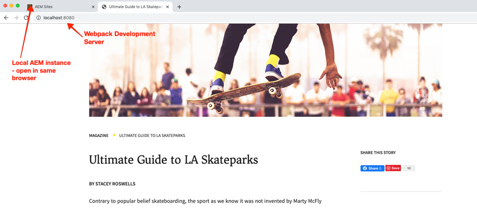
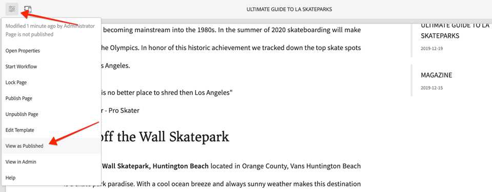

# Ontwikkelen met het Stijlsysteem {#developing-with-the-style-system}

Leer hoe te om individuele stijlen uit te voeren en de Componenten van de Kern te hergebruiken gebruikend het Systeem van de Stijl van de Experience Manager. Deze zelfstudie behandelt het ontwikkelen voor het Systeem van de Stijl om de Componenten van de Kern met merkspecifieke CSS en geavanceerde beleidsconfiguraties van de Redacteur van het Malplaatje uit te breiden.

## Vereisten {#prerequisites}

Controleer de vereiste gereedschappen en instructies voor het instellen van een [lokale ontwikkelomgeving](overview.md#local-dev-environment).

Het wordt ook geadviseerd om de [Client-side Bibliotheken en het Voorste-eind Werkschema](client-side-libraries.md) leerprogramma te herzien om de grondbeginselen van cliënt-zijbibliotheken en de diverse front-end hulpmiddelen te begrijpen die in het AEM project worden gebouwd.

### Starter-project

>[!NOTE]
>
> Als u met succes het vorige hoofdstuk voltooide kunt u het project hergebruiken en de stappen overslaan voor het uitchecken van het starterproject.

Bekijk de basislijncode waarop de zelfstudie is gebaseerd:

1. Ontdek de `tutorial/style-system-start`-vertakking van [GitHub](https://github.com/adobe/aem-guides-wknd)

   ```shell
   $ cd aem-guides-wknd
   $ git checkout tutorial/style-system-start
   ```

1. Stel codebasis aan een lokale AEM instantie op gebruikend uw Maven vaardigheden:

   ```shell
   $ mvn clean install -PautoInstallSinglePackage
   ```

   >[!NOTE]
   >
   > Als u AEM 6.5 of 6.4 gebruikt, voegt u het `classic`-profiel toe aan alle Maven-opdrachten.

   ```shell
   $ mvn clean install -PautoInstallSinglePackage -Pclassic
   ```

U kunt de gebeëindigde code op [GitHub](https://github.com/adobe/aem-guides-wknd/tree/tutorial/style-system-solution) altijd bekijken of de code plaatselijk controleren door aan de tak `tutorial/style-system-solution` te schakelen.

## Doelstelling

1. Begrijp hoe te om het Systeem van de Stijl te gebruiken om merkspecifieke CSS op AEM Componenten van de Kern toe te passen.
1. Leer meer over BEM-notatie en hoe u deze kunt gebruiken om stijlen zorgvuldig in bereik te brengen.
1. Geavanceerde beleidsconfiguraties toepassen met bewerkbare sjablonen.

## Wat u {#what-you-will-build} wilt maken

In dit hoofdstuk gebruiken wij [de eigenschap van het Systeem van de Stijl](https://docs.adobe.com/content/help/en/experience-manager-learn/sites/page-authoring/style-system-feature-video-use.html) om variaties van **Title** en **Text** te creëren die op de pagina van het Artikel worden gebruikt.


*Onderstrepingsstijl beschikbaar voor component Title*

## Achtergrond {#background}

Met het [Stijlsysteem](https://docs.adobe.com/content/help/en/experience-manager-65/developing/components/style-system.html) kunnen ontwikkelaars en sjablooneditors meerdere visuele variaties van een component maken. Auteurs kunnen vervolgens bepalen welke stijl moet worden gebruikt bij het samenstellen van een pagina. Tijdens de rest van de zelfstudie gebruiken we het Stijlsysteem om verschillende unieke stijlen te maken en tegelijk gebruik te maken van Core Components in een aanpak met lage code.

Het algemene idee met het Stijlsysteem is dat ontwerpers verschillende stijlen kunnen kiezen van hoe een component eruit moet zien. De &quot;stijlen&quot; worden ondersteund door extra CSS-klassen die in de buitenste div van een component worden geïnjecteerd. In de clientbibliotheken worden CSS-regels toegevoegd op basis van deze stijlklassen, zodat de vormgeving van de component verandert.

U kunt [gedetailleerde documentatie voor het Systeem van de Stijl hier](https://experienceleague.adobe.com/docs/experience-manager-cloud-service/sites/authoring/features/style-system.html) vinden. Er is ook een grote [technische video voor het begrijpen van het Systeem van de Stijl](https://experienceleague.adobe.com/docs/experience-manager-learn/sites/developing/style-system-technical-video-understand.html).

## Onderstrepingsstijl - Titel {#underline-style}

De [Titelcomponent](https://experienceleague.adobe.com/docs/experience-manager-core-components/using/components/title.html) is als onderdeel van de module **ui.apps** toegevoegd aan het project onder `/apps/wknd/components/title`. De standaardstijlen van Kop-elementen (`H1`, `H2`, `H3`...) zijn al geïmplementeerd in de module **ui.frontend**.

De [WKND-artikelontwerpen](assets/pages-templates/wknd-article-design.xd) bevatten een unieke stijl voor de component Title met een onderstreping. In plaats van twee componenten te maken of het dialoogvenster van de component te wijzigen, kunt u het Stijlsysteem gebruiken om auteurs de optie toe te staan een onderstrepingsstijl toe te voegen.


### Opmaak Inspect-titel

Als front-end ontwikkelaar is de eerste stap aan het stileren van een Component van de Kern de prijsverhoging te begrijpen die door de component wordt geproduceerd.

1. Open een nieuwe browser en bekijk de component Title op de site AEM Core Component Library: [https://www.aemcomponents.dev/content/core-components-examples/library/page-authoring/title.html](https://www.aemcomponents.dev/content/core-components-examples/library/page-authoring/title.html)

1. Hieronder ziet u de markering voor de component Title:

   ```html
   <div class="cmp-title">
       <h1 class="cmp-title__text">Lorem Ipsum</h1>
   </div>
   ```

   De BEM-notatie van de component Title:

   ```plain
   BLOCK cmp-title
       ELEMENT cmp-title__text
   ```

1. Het Stijlsysteem voegt een CSS-klasse toe aan de buitenste div rondom de component. Daarom zal de prijsverhoging die wij zullen richten op iets als het volgende lijken:

   ```html
   <div class="STYLE-SYSTEM-CLASS-HERE"> <!-- Custom CSS class - implementation gets to define this -->
       <div class="cmp-title">
           <h1 class="cmp-title__text">Lorem Ipsum</h1>
       </div>
   </div>
   ```

### Implementeer de onderstrepingsstijl - ui.frontend

Implementeer vervolgens de onderstrepingsstijl met de module **ui.frontend** van ons project. Wij zullen de webpack ontwikkelingsserver gebruiken die met **ui.frontend** module wordt gebundeld om de stijlen *before* aan een lokale instantie van AEM voor te vertonen.

1. Start de webpack Dev-server met de volgende opdracht vanuit de module **ui.frontend**:

   ```shell
   $ cd ~/code/aem-guides-wknd/ui.frontend/
   $ npm start
   
   > aem-maven-archetype@1.0.0 start code/aem-guides-wknd/ui.frontend
   > webpack-dev-server --open --config ./webpack.dev.js
   ```

   Hiermee opent u een browser op [http://localhost:8080](http://localhost:8080).

   >[!NOTE]
   >
   > Als de beelden gebroken lijken, zorg ervoor dat het starterproject aan een lokaal geval van AEM (lopend op haven 4502) is opgesteld en browser gebruikt ook in de lokale AEM instantie heeft het programma geopend.

   

1. In winde open het dossier `index.html` dat zich bevindt bij: `ui.frontend/src/main/webpack/static/index.html`. Dit is de statische prijsverhoging die door de webpack ontwikkelingsserver wordt gebruikt.
1. Zoek in `index.html` een instantie van de component Title waaraan u de onderstrepingsstijl wilt toevoegen door in het document te zoeken naar *cmp-title*. Kies de component van de Titel met de tekst *&quot;Vans van het Wandskatepark&quot;* (lijn 218). Voeg de klasse `cmp-title--underline` aan omringende div toe:

   ```diff
   - <div class="title aem-GridColumn--phone--12 aem-GridColumn aem-GridColumn--default--8">
   + <div class="cmp-title--underline title aem-GridColumn--phone--12 aem-GridColumn aem-GridColumn--default--8">
        <div data-cmp-data-layer="{&#34;title-8bea562fa0&#34;:{&#34;@type&#34;:&#34;wknd/components/title&#34;,&#34;repo:modifyDate&#34;:&#34;2021-01-22T18:54:20Z&#34;,&#34;dc:title&#34;:&#34;Vans Off the Wall&#34;}}" id="title-8bea562fa0" class="cmp-title">
            <h2 class="cmp-title__text">Vans Off the Wall</h2>
        </div>
    </div>
   ```

1. Ga terug naar de browser en controleer of de extra klasse wordt weerspiegeld in de markering.
1. Ga terug naar de **ui.frontend** module en werk het bestand `title.scss` bij dat zich bevindt op: `ui.frontend/src/main/webpack/components/_title.scss`:

   ```css
   /* Add Title Underline Style */
   .cmp-title--underline {
       .cmp-title__text {
           &:after {
           display: block;
               width: 84px;
               padding-top: 8px;
               content: '';
               border-bottom: 2px solid $brand-primary;
           }
       }
   }
   ```

   >[!NOTE]
   >
   >Het wordt beschouwd als beste praktijken om werkingsgebiedstijlen aan de doelcomponent altijd strak te maken. Dit zorgt ervoor dat extra stijlen andere gebieden van de pagina niet beïnvloeden.
   >
   >Alle kerncomponenten voldoen aan **[BEM-notatie](https://github.com/adobe/aem-core-wcm-components/wiki/css-coding-conventions)**. Het wordt aanbevolen de buitenste CSS-klasse als doel in te stellen wanneer u een standaardstijl voor een component maakt. Een andere beste manier is om klassennamen te richten die door de aantekening van de Component BEM van de Kern eerder dan de elementen van HTML worden gespecificeerd.

1. Keer opnieuw naar browser en u zou de onderstreepte stijl moeten zien worden toegevoegd:

   

1. Stop de webpack-ontwikkelingsserver.

### Titelbeleid toevoegen

Vervolgens moet een nieuw beleid voor de componenten Titel worden toegevoegd, zodat de auteurs van de inhoud de stijl Onderstrepen kunnen kiezen en op specifieke componenten kunnen toepassen. Dit wordt gedaan gebruikend de Redacteur van het Malplaatje binnen AEM.

1. Stel het codebasis aan een lokale AEM instantie op gebruikend uw Maven vaardigheden:

   ```shell
   $ cd ~/code/aem-guides-wknd
   $ mvn clean install -PautoInstallSinglePackage
   ```

1. Navigeer naar de **Article Page**-sjabloon in: [http://localhost:4502/editor.html/conf/wknd/settings/wcm/templates/article-page/structure.html](http://localhost:4502/editor.html/conf/wknd/settings/wcm/templates/article-page/structure.html)

1. In **Structuur** wijze, in de belangrijkste **Lay-outcontainer**, selecteer **Beleid** pictogram naast **Title** component die onder *Toegestane Componenten* wordt vermeld:

   

1. Maak een nieuw beleid voor de component Title met de volgende waarden:

   *Beleidstitel **:  **WKND-titel**

   *Eigenschappen*  > tabblad  *Stijlen*  > Een nieuwe stijl  *toevoegen*

   **Onderstrepen** :  `cmp-title--underline`

   

   Klik **Done** om de wijzigingen in het titelbeleid op te slaan.

   >[!NOTE]
   >
   > De waarde `cmp-title--underline` komt overeen met de CSS-klasse die we eerder als doel hadden tijdens de ontwikkeling in de module **ui.frontend**.

### De stijl Onderstrepen toepassen

Tot slot kunnen wij als auteur ervoor kiezen om de onderstrepingsstijl toe te passen op bepaalde componenten van de Titel.

1. Navigeer naar het artikel **La Skateparks** in de redacteur van AEM Sites bij: [http://localhost:4502/editor.html/content/wknd/us/en/magazine/guide-la-skateparks.html](http://localhost:4502/editor.html/content/wknd/us/en/magazine/guide-la-skateparks.html)
1. Kies in de modus **Bewerken** een component Title. Klik op het pictogram **Tekenpenseel** en selecteer de stijl **Onderstrepen**:

   

   Als auteur moet u de stijl in- en uitschakelen.

1. Klik op het pictogram **Pagina-informatie** > **Weergeven als gepubliceerd** om de pagina buiten AEM editor te inspecteren.

   

   Gebruik de browsergereedschappen om te controleren of de markering rondom de component Title de CSS-klasse `cmp-title--underline` heeft toegepast op de buitenste div.

## Stijl prijsblok - Tekst {#text-component}

Herhaal vervolgens vergelijkbare stappen om een unieke stijl toe te passen op de [Tekstcomponent](https://experienceleague.adobe.com/docs/experience-manager-core-components/using/components/text.html). De component van de Tekst is proxied in het project onder `/apps/wknd/components/text` als deel van **ui.apps** module. De standaardstijlen van alinea-elementen zijn al geïmplementeerd in **ui.frontend**.

De [WKND-artikelontwerpen](assets/pages-templates/wknd-article-design.xd) bevatten een unieke stijl voor de component Text met een aanhalingsteken:


### Markeringen Inspect-tekstcomponent

Opnieuw inspecteren we de opmaak van de component Text.

1. Bekijk de markering voor de component Text op: [https://www.aemcomponents.dev/content/core-components-examples/library/page-authoring/text.html](https://www.aemcomponents.dev/content/core-components-examples/library/page-authoring/text.html)

1. Hieronder ziet u de markering voor de component Text:

   ```html
   <div class="text">
       <div class="cmp-text" data-cmp-data-layer="{&quot;text-2d9d50c5a7&quot;:{&quot;@type&quot;:&quot;core/wcm/components/text/v2/text&quot;,&quot;repo:modifyDate&quot;:&quot;2019-01-22T11:56:17Z&quot;,&quot;xdm:text&quot;:&quot;<p>Lorem ipsum dolor sit amet, consectetur adipiscing elit, sed do eiusmod tempor incididunt ut labore et dolore magna aliqua. Eu mi bibendum neque egestas congue quisque egestas. Varius morbi enim nunc faucibus a pellentesque. Scelerisque eleifend donec pretium vulputate sapien nec sagittis.</p>\n&quot;}}" id="text-2d9d50c5a7">
           <p>Lorem ipsum dolor sit amet, consectetur adipiscing elit, sed do eiusmod tempor incididunt ut labore et dolore magna aliqua. Eu mi bibendum neque egestas congue quisque egestas. Varius morbi enim nunc faucibus a pellentesque. Scelerisque eleifend donec pretium vulputate sapien nec sagittis.</p>
       </div>
   </div>
   ```

   De BEM-notatie van de component Text:

   ```plain
   BLOCK cmp-text
       ELEMENT
   ```

1. Het Stijlsysteem voegt een CSS-klasse toe aan de buitenste div rondom de component. Daarom zal de prijsverhoging die wij zullen richten op iets als het volgende lijken:

   ```html
   <div class="text STYLE-SYSTEM-CLASS-HERE"> <!-- Custom CSS class - implementation gets to define this -->
       <div class="cmp-text" data-cmp-data-layer="{&quot;text-2d9d50c5a7&quot;:{&quot;@type&quot;:&quot;core/wcm/components/text/v2/text&quot;,&quot;repo:modifyDate&quot;:&quot;2019-01-22T11:56:17Z&quot;,&quot;xdm:text&quot;:&quot;<p>Lorem ipsum dolor sit amet, consectetur adipiscing elit, sed do eiusmod tempor incididunt ut labore et dolore magna aliqua. Eu mi bibendum neque egestas congue quisque egestas. Varius morbi enim nunc faucibus a pellentesque. Scelerisque eleifend donec pretium vulputate sapien nec sagittis.</p>\n&quot;}}" id="text-2d9d50c5a7">
           <p>Lorem ipsum dolor sit amet, consectetur adipiscing elit, sed do eiusmod tempor incididunt ut labore et dolore magna aliqua. Eu mi bibendum neque egestas congue quisque egestas. Varius morbi enim nunc faucibus a pellentesque. Scelerisque eleifend donec pretium vulputate sapien nec sagittis.</p>
       </div>
   </div>
   ```

### Implementeer de stijl voor het aanhalingsteken - ui.frontend

Daarna zullen wij de stijl van het Blok van het Citaat uitvoeren gebruikend **ui.frontend** module van ons project.

1. Start de webpack Dev-server met de volgende opdracht vanuit de module **ui.frontend**:

   ```shell
   $ cd ~/code/aem-guides-wknd/ui.frontend/
   $ npm start
   ```

1. Open in IDE het bestand `index.html` dat zich bevindt op: `ui.frontend/src/main/webpack/static/index.html`.
1. Zoek in `index.html` een instantie van de tekstcomponent door te zoeken naar de tekst *&quot;Jacob Wester&quot;* (regel 210). Voeg de klasse `cmp-text--quote` aan omringende div toe:

   ```diff
   - <div class="text aem-GridColumn--phone--12 aem-GridColumn aem-GridColumn--default--8">
   + <div class="cmp-text--quote text aem-GridColumn--phone--12 aem-GridColumn aem-GridColumn--default--8">
        <div data-cmp-data-layer="{&#34;text-a15f39a83a&#34;:{&#34;@type&#34;:&#34;wknd/components/text&#34;,&#34;repo:modifyDate&#34;:&#34;2021-01-22T00:23:27Z&#34;,&#34;xdm:text&#34;:&#34;&lt;blockquote>&amp;quot;There is no better place to shred then Los Angeles.”&lt;/blockquote>\r\n&lt;p>- Jacob Wester, Pro Skater&lt;/p>\r\n&#34;}}" id="text-a15f39a83a" class="cmp-text">
            <blockquote>&quot;There is no better place to shred then Los Angeles.”</blockquote>
            <p>- Jacob Wester, Pro Skater</p>
        </div>
    </div>
   ```

1. Werk het bestand `text.scss` bij dat zich bevindt op: `ui.frontend/src/main/webpack/components/_text.scss`:

   ```css
   /* WKND Text Quote style */
   .cmp-text--quote {
       .cmp-text {
           background-color: $brand-third;
           margin: 1em 0em;
           padding: 1em;
   
           blockquote {
               border: none;
               font-size: $font-size-large;
               font-family: $font-family-serif;
               padding: 14px 14px;
               margin: 0;
               margin-bottom: 0.5em;
   
               &:after {
                   border-bottom: 2px solid $brand-primary; /*yellow border */
                   content: '';
                   display: block;
                   position: relative;
                   top: 0.25em;
                   width: 80px;
               }
           }
           p {
               font-family:  $font-family-serif;
           }
       }
   }
   ```

   >[!CAUTION]
   >
   > In dit geval worden onbewerkte HTML-elementen bepaald door de stijlen. De reden hiervoor is dat de component Text een Rich Text Editor biedt voor inhoudsauteurs. Het rechtstreeks maken van stijlen tegen RTE-inhoud moet met de nodige voorzichtigheid gebeuren en het is nog belangrijker om de stijlen strak uit te breiden.

1. Keer opnieuw naar browser en u zou de toegevoegde het blokstijl van het Citaat moeten zien:

   

1. Stop de webpack-ontwikkelingsserver.

### Tekstbeleid toevoegen

Voeg vervolgens een nieuw beleid toe voor de tekstcomponenten.

1. Stel codebasis aan een lokale AEM instantie op gebruikend uw Maven vaardigheden:

   ```shell
   $ cd ~/code/aem-guides-wknd
   $ mvn clean install -PautoInstallSinglePackage
   ```

1. Navigeer naar **Article Page Template** op de locatie: [http://localhost:4502/editor.html/conf/wknd/settings/wcm/templates/article-page/structure.html](http://localhost:4502/editor.html/conf/wknd/settings/wcm/templates/article-page/structure.html)).

1. In **Structuur** wijze, in de belangrijkste **Lay-outcontainer**, selecteer **Beleid** pictogram naast **Tekst** component die onder *Toegestane Componenten* wordt vermeld:

   

1. Werk het componentenbeleid van de Tekst met de volgende waarden bij:

   *Beleidstitel **:  **Inhoudstekst**

   *Plugins*  >  *Alineastijlen*  > Alineastijlen  *inschakelen*

   *Tab*  Stijlen >  *Een nieuwe stijl toevoegen*

   **Offerteblok** :  `cmp-text--quote`

   

   

   Klik **Done** om de wijzigingen in het tekstbeleid op te slaan.

### De stijl voor het aanhalingsteken toepassen

1. Navigeer naar het artikel **La Skateparks** in de redacteur van AEM Sites bij: [http://localhost:4502/editor.html/content/wknd/us/en/magazine/guide-la-skateparks.html](http://localhost:4502/editor.html/content/wknd/us/en/magazine/guide-la-skateparks.html)
1. Kies in de modus **Bewerken** een tekstcomponent. Bewerk de component om een aanhalingsteken te plaatsen:

   

1. Selecteer de tekstcomponent en klik op het pictogram **Penseel** en selecteer de stijl **Citaatblok**:

   

   Als auteur moet u de stijl in- en uitschakelen.

## Vaste breedte - Container (Bonus) {#layout-container}

Containercomponenten zijn gebruikt om de basisstructuur van het artikelpaginasjabloon te maken en om de neerzetzones voor inhoudsauteurs te bieden om inhoud aan een pagina toe te voegen. Containers kunnen ook gebruikmaken van het Stijlsysteem, zodat de auteurs van inhoud nog meer opties hebben voor het ontwerpen van lay-outs.

De **Main Container** van de sjabloon Artikelpagina bevat de twee auteurbare containers en heeft een vaste breedte.


*Hoofdcontainer in het sjabloon* voor artikelpagina.

Het beleid van de **Hoofdcontainer** plaatst het standaardelement als `main`:


De CSS die de **Main Container** vast maakt wordt geplaatst in **ui.frontend** module bij `ui.frontend/src/main/webpack/site/styles/container_main.scss`:

```SCSS
main.container {
    padding: .5em 1em;
    max-width: $max-content-width;
    float: unset!important;
    margin: 0 auto!important;
    clear: both!important;
}
```

In plaats van het `main` element van HTML te richten, zou het Systeem van de Stijl kunnen worden gebruikt om een **Vaste breedte** stijl als deel van het beleid van de Container tot stand te brengen. Het Stijlsysteem kan gebruikers de mogelijkheid bieden te schakelen tussen **Vaste breedte**- en **Fluid width**-containers.

1. **De Uitdaging**  van de bonus - gebruiklessen die van de vorige oefeningen worden geleerd en gebruik het Systeem van de Stijl om een  **Vaste** breedtegraad en  **Vloeiende** breedtestijlen voor de component van de Container uit te voeren.

## Gefeliciteerd! {#congratulations}

Gefeliciteerd, de artikelpagina is bijna volledig vormgegeven en u hebt praktijkervaring opgedaan met het systeem AEM stijl.

### Volgende stappen {#next-steps}

Leer de stappen van begin tot eind om een [douane AEM Component](custom-component.md) tot stand te brengen die inhoud toont authored in een Dialoog, en verkent het ontwikkelen van een het Verzamelen Model om bedrijfslogica in te kapselen die HTML van de component bevolkt.

Bekijk de gebeëindigde code op [GitHub](https://github.com/adobe/aem-guides-wknd) of herzie en stel plaatselijk de code bij de schakelaar van de Git `tutorial/style-system-solution` op.

1. Clone the [github.com/adobe/aem-wknd-guides](https://github.com/adobe/aem-guides-wknd) repository.
1. Bekijk de `tutorial/style-system-solution` vertakking.
