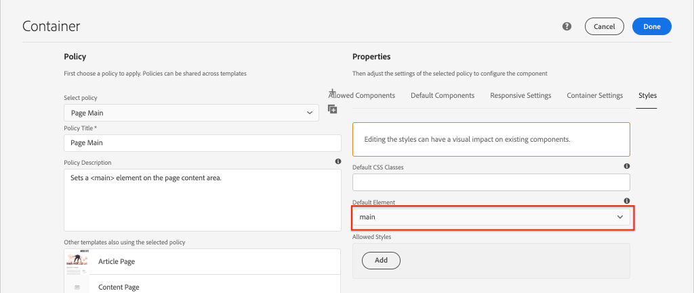

# Ontwikkelen met het Stijlsysteem {#developing-with-the-style-system}

Leer hoe te om individuele stijlen uit te voeren en de Componenten van de Kern te hergebruiken gebruikend het Systeem van de Stijl van de Experience Manager. Deze zelfstudie behandelt het ontwikkelen voor het Systeem van de Stijl om de Componenten van de Kern met merkspecifieke CSS en geavanceerde beleidsconfiguraties van de Redacteur van het Malplaatje uit te breiden.

## Vereisten {#prerequisites}

Controleer de vereiste gereedschappen en instructies voor het instellen van een [plaatselijke ontwikkelomgeving](overview.md#local-dev-environment).

Het wordt ook aanbevolen de [Client-side bibliotheken en front-end workflow](client-side-libraries.md) zelfstudie om inzicht te krijgen in de grondbeginselen van client-side bibliotheken en de verschillende front-end tools die in het AEM project zijn ingebouwd.

### Starter-project

>[!NOTE]
>
> Als u met succes het vorige hoofdstuk voltooide kunt u het project hergebruiken en de stappen overslaan voor het uitchecken van het starterproject.

Bekijk de basislijncode waarop de zelfstudie is gebaseerd:

1. Kijk uit de `tutorial/style-system-start` vertakking van [GitHub](https://github.com/adobe/aem-guides-wknd)

   ```shell
   $ cd aem-guides-wknd
   $ git checkout tutorial/style-system-start
   ```

1. Stel codebasis aan een lokale AEM instantie op gebruikend uw Maven vaardigheden:

   ```shell
   $ mvn clean install -PautoInstallSinglePackage
   ```

   >[!NOTE]
   >
   > Indien u AEM 6.5 of 6.4 gebruikt, voegt u de `classic` aan om het even welke Gemaakt bevelen.

   ```shell
   $ mvn clean install -PautoInstallSinglePackage -Pclassic
   ```

U kunt de voltooide code altijd weergeven op [GitHub](https://github.com/adobe/aem-guides-wknd/tree/tutorial/style-system-solution) of controleer de code plaatselijk door aan de tak over te schakelen `tutorial/style-system-solution`.

## Doelstelling

1. Begrijp hoe te om het Systeem van de Stijl te gebruiken om merkspecifieke CSS op AEM Componenten van de Kern toe te passen.
1. Leer meer over BEM-notatie en hoe u deze kunt gebruiken om stijlen zorgvuldig in bereik te brengen.
1. Geavanceerde beleidsconfiguraties toepassen met bewerkbare sjablonen.

## Wat u gaat maken {#what-you-will-build}

In dit hoofdstuk gebruiken we de [Stijlsysteemfunctie](https://experienceleague.adobe.com/docs/experience-manager-learn/sites/page-authoring/style-system-feature-video-use.html) om variaties van het **Titel** en **Tekst** de componenten die op de pagina Artikel worden gebruikt.


*Onderstrepingsstijl beschikbaar voor component Title*

## Achtergrond {#background}

De [Stijlsysteem](https://experienceleague.adobe.com/docs/experience-manager-65/authoring/siteandpage/style-system.html) kunnen ontwikkelaars en sjablooneditors meerdere visuele variaties van een component maken. Auteurs kunnen vervolgens bepalen welke stijl moet worden gebruikt bij het samenstellen van een pagina. Tijdens de rest van de zelfstudie gebruiken we het Stijlsysteem om verschillende unieke stijlen te maken en tegelijk gebruik te maken van Core Components in een aanpak met lage code.

Het algemene idee met het Stijlsysteem is dat ontwerpers verschillende stijlen kunnen kiezen van hoe een component eruit moet zien. De &quot;stijlen&quot; worden ondersteund door extra CSS-klassen die in de buitenste div van een component worden geïnjecteerd. In de clientbibliotheken worden CSS-regels toegevoegd op basis van deze stijlklassen, zodat de vormgeving van de component verandert.

U kunt zoeken [gedetailleerde documentatie voor het Stijlsysteem hier](https://experienceleague.adobe.com/docs/experience-manager-cloud-service/sites/authoring/features/style-system.html). Er is ook een grote [technische video voor het begrip van het Systeem van de Stijl](https://experienceleague.adobe.com/docs/experience-manager-learn/sites/developing/style-system-technical-video-understand.html).

## Onderstrepingsstijl - Titel {#underline-style}

De [Component Title](https://experienceleague.adobe.com/docs/experience-manager-core-components/using/components/title.html) in het kader van het project `/apps/wknd/components/title` als onderdeel van de **ui.apps** module. De standaardstijlen van Kop-elementen (`H1`, `H2`, `H3`...) reeds in de **ui.frontend** module.

De [WKND-artikelontwerpen](assets/pages-templates/wknd-article-design.xd) bevat een unieke stijl voor de component Title met een onderstreping. In plaats van twee componenten te maken of het dialoogvenster van de component te wijzigen, kunt u het Stijlsysteem gebruiken om auteurs de optie toe te staan een onderstrepingsstijl toe te voegen.


### Titelbeleid toevoegen

Voeg een nieuw beleid voor de componenten van de Titel toe om inhoudsauteurs toe te staan om de onderstreepte stijl te kiezen om op specifieke componenten toe te passen. Dit wordt gedaan gebruikend de Redacteur van het Malplaatje binnen AEM.

1. Ga naar de **Artikelpagina** sjabloon bevindt zich op: [http://localhost:4502/editor.html/conf/wknd/settings/wcm/templates/article-page/structure.html](http://localhost:4502/editor.html/conf/wknd/settings/wcm/templates/article-page/structure.html)

1. In **Structuur** in de hoofdmodus **Layout Container**, selecteert u de **Beleid** pictogram naast **Titel** component vermeld onder *Toegestane componenten*:

   

1. Maak een nieuw beleid voor de component Title met de volgende waarden:

   *Beleidstitel&#42;*: **WKND-titel**

   *Eigenschappen* > *Tabblad Stijlen* > *Een nieuwe stijl toevoegen*

   **Onderstrepen** : `cmp-title--underline`

   

   Klikken **Gereed** om de wijzigingen in het titelbeleid op te slaan.

   >[!NOTE]
   >
   > De waarde `cmp-title--underline` Hiermee wordt de CSS-klasse gevuld op de buitenste div van de markering HTML van de component.

### De stijl Onderstrepen toepassen

Als auteur past u de onderstrepingsstijl toe op bepaalde titelcomponenten.

1. Ga naar de **La Skateparks** artikel in de AEM Sites-editor op: [http://localhost:4502/editor.html/content/wknd/us/en/magazine/guide-la-skateparks.html](http://localhost:4502/editor.html/content/wknd/us/en/magazine/guide-la-skateparks.html)
1. In **Bewerken** kiest u een component Titel. Klik op de knop **penseel** en selecteert u de **Onderstrepen** stijl:

   

   >[!NOTE]
   >
   > Op dit punt vindt geen zichtbare wijziging plaats als de `underline` stijl is niet geïmplementeerd. In de volgende oefening wordt deze stijl uitgevoerd.

1. Klik op de knop **Pagina-informatie** pictogram > **Weergeven als gepubliceerd** om de pagina buiten AEM editor te inspecteren.
1. Gebruik de browsergereedschappen om te controleren of de markering rondom de component Title de CSS-klasse heeft `cmp-title--underline` toegepast op de buitenste div.

   

   ```html
   <div class="title cmp-title--underline">
       <div data-cmp-data-layer="{&quot;title-b6450e9cab&quot;:{&quot;@type&quot;:&quot;wknd/components/title&quot;,&quot;repo:modifyDate&quot;:&quot;2022-02-23T17:34:42Z&quot;,&quot;dc:title&quot;:&quot;Vans Off the Wall Skatepark&quot;}}" 
       id="title-b6450e9cab" class="cmp-title">
           <h2 class="cmp-title__text">Vans Off the Wall Skatepark</h2>
       </div>
   </div>
   ```

### Implementeer de onderstrepingsstijl - ui.frontend

Implementeer vervolgens de stijl Onderstrepen met de **ui.frontend** van ons project. We gebruiken de webpack-ontwikkelingsserver die is meegeleverd bij de **ui.frontend** een voorvertoning van de stijlen weergeven *voor* implementeren naar een lokale instantie van AEM.

1. Start de `watch` van binnen **ui.frontend** module:

   ```shell
   $ cd ~/code/aem-guides-wknd/ui.frontend/
   $ npm run watch
   ```

   Hiermee wordt een proces gestart dat wijzigingen in de `ui.frontend` en synchroniseer de wijzigingen in de AEM-instantie.


1. De IDE retourneren en het bestand openen `_title.scss` gevestigd te: `ui.frontend/src/main/webpack/components/_title.scss`.
1. Introduceer een nieuwe regel gericht op `cmp-title--underline` klasse:

   ```scss
   /* Default Title Styles */
   .cmp-title {}
   .cmp-title__text {}
   .cmp-title__link {}
   
   /* Add Title Underline Style */
   .cmp-title--underline {
       .cmp-title__text {
           &:after {
           display: block;
               width: 84px;
               padding-top: 8px;
               content: '';
               border-bottom: 2px solid $brand-primary;
           }
       }
   }
   ```

   >[!NOTE]
   >
   >Het wordt beschouwd als beste praktijken om werkingsgebiedstijlen aan de doelcomponent altijd strak te maken. Dit zorgt ervoor dat extra stijlen andere gebieden van de pagina niet beïnvloeden.
   >
   >Alle kerncomponenten voldoen aan **[BEM-notatie](https://github.com/adobe/aem-core-wcm-components/wiki/css-coding-conventions)**. Het wordt aanbevolen de buitenste CSS-klasse als doel in te stellen wanneer u een standaardstijl voor een component maakt. Een andere beste manier is om klassennamen te richten die door de aantekening van de Component van de Kern worden gespecificeerd BEM eerder dan HTML elementen.

1. Ga terug naar de browser en de AEM pagina. De onderstrepingsstijl wordt toegevoegd:

   

1. In de AEM editor moet u nu in- en uitschakelen **Onderstrepen** en bekijk de wijzigingen visueel.

## Stijl prijsblok - Tekst {#text-component}

Herhaal vervolgens vergelijkbare stappen om een unieke stijl toe te passen op de [Tekstcomponent](https://experienceleague.adobe.com/docs/experience-manager-core-components/using/components/text.html). De component Text is uitgebreid naar het project onder `/apps/wknd/components/text` als onderdeel van de **ui.apps** module. De standaardstijlen van alinea-elementen zijn al geïmplementeerd in de **ui.frontend**.

De [WKND-artikelontwerpen](assets/pages-templates/wknd-article-design.xd) bevat een unieke stijl voor de component Text met een aanhalingsteken:


### Tekstbeleid toevoegen

Voeg vervolgens een nieuw beleid toe voor de tekstcomponenten.

1. Ga naar de **Artikelpaginasjabloon** gevestigd te: [http://localhost:4502/editor.html/conf/wknd/settings/wcm/templates/article-page/structure.html](http://localhost:4502/editor.html/conf/wknd/settings/wcm/templates/article-page/structure.html).

1. In **Structuur** in de hoofdmodus **Layout Container**, selecteert u de **Beleid** pictogram naast **Tekst** component vermeld onder *Toegestane componenten*:

   

1. Werk het componentenbeleid van de Tekst met de volgende waarden bij:

   *Beleidstitel&#42;*: **Inhoudstekst**

   *Plug-ins* > *Alineastijlen* > *Alineastijlen inschakelen*

   *Tabblad Stijlen* > *Een nieuwe stijl toevoegen*

   **Offerteblok** : `cmp-text--quote`

   

   

   Klikken **Gereed** om de wijzigingen in het tekstbeleid op te slaan.

### De stijl voor het aanhalingsteken toepassen

1. Ga naar de **La Skateparks** artikel in de AEM Sites-editor op: [http://localhost:4502/editor.html/content/wknd/us/en/magazine/guide-la-skateparks.html](http://localhost:4502/editor.html/content/wknd/us/en/magazine/guide-la-skateparks.html)
1. In **Bewerken** kiest u een tekstcomponent. Bewerk de component om een aanhalingsteken te plaatsen:

   

1. Selecteer de tekstcomponent en klik op de knop **penseel** en selecteert u de **Offerteblok** stijl:

   

1. Gebruik de ontwikkelaarsgereedschappen van de browser om de markering te inspecteren. De klassenaam wordt weergegeven `cmp-text--quote` is toegevoegd aan de buitenste div van de component:

   ```html
   <!-- Quote Block style class added -->
   <div class="text cmp-text--quote">
       <div data-cmp-data-layer="{&quot;text-60910f4b8d&quot;:{&quot;@type&quot;:&quot;wknd/components/text&quot;,&quot;repo:modifyDate&quot;:&quot;2022-02-24T00:55:26Z&quot;,&quot;xdm:text&quot;:&quot;<blockquote>&amp;nbsp; &amp;nbsp; &amp;nbsp;&amp;quot;There is no better place to shred then Los Angeles&amp;quot;</blockquote>\r\n<p>- Jacob Wester, Pro Skater</p>\r\n&quot;}}" id="text-60910f4b8d" class="cmp-text">
           <blockquote>&nbsp; &nbsp; &nbsp;"There is no better place to shred then Los Angeles"</blockquote>
           <p>- Jacob Wester, Pro Skater</p>
       </div>
   </div>
   ```

### Implementeer de stijl voor het aanhalingsteken - ui.frontend

Daarna zullen wij de stijl van het Blok van het Citaat uitvoeren gebruikend **ui.frontend** van ons project.

1. Als deze nog niet actief is, start u de `watch` van binnen **ui.frontend** module:

   ```shell
   $ npm run watch
   ```

1. Het bestand bijwerken `text.scss` gevestigd te: `ui.frontend/src/main/webpack/components/_text.scss`:

   ```css
   /* Default text style */
   .cmp-text {}
   .cmp-text__paragraph {}
   
   /* WKND Text Quote style */
   .cmp-text--quote {
       .cmp-text {
           background-color: $brand-third;
           margin: 1em 0em;
           padding: 1em;
   
           blockquote {
               border: none;
               font-size: $font-size-large;
               font-family: $font-family-serif;
               padding: 14px 14px;
               margin: 0;
               margin-bottom: 0.5em;
   
               &:after {
                   border-bottom: 2px solid $brand-primary; /*yellow border */
                   content: '';
                   display: block;
                   position: relative;
                   top: 0.25em;
                   width: 80px;
               }
           }
           p {
               font-family:  $font-family-serif;
           }
       }
   }
   ```

   >[!CAUTION]
   >
   > In dit geval worden onbewerkte HTML-elementen bepaald door de stijlen. De reden hiervoor is dat de component Text een Rich Text Editor biedt voor inhoudsauteurs. Het rechtstreeks maken van stijlen tegen RTE-inhoud moet met de nodige voorzichtigheid gebeuren en het is nog belangrijker om de stijlen strak uit te breiden.

1. Keer opnieuw naar browser en u zou de toegevoegde het blokstijl van het Citaat moeten zien:

   

1. Stop de webpack-ontwikkelingsserver.

## Vaste breedte - Container (Bonus) {#layout-container}

Containercomponenten zijn gebruikt om de basisstructuur van het artikelpaginasjabloon te maken en om de neerzetzones voor inhoudsauteurs te bieden om inhoud aan een pagina toe te voegen. Containers kunnen ook gebruikmaken van het Stijlsysteem, zodat de auteurs van inhoud nog meer opties hebben voor het ontwerpen van lay-outs.

De **Hoofdcontainer** van de artikelpaginamalplaatje bevat de twee voor de auteur geschikte containers en heeft een vaste breedte.


*Hoofdcontainer in het sjabloon voor artikelpagina*.

Het beleid van de **Hoofdcontainer** stelt het standaardelement in als `main`:



De CSS die de **Hoofdcontainer** vast wordt ingesteld in de **ui.frontend** module bij `ui.frontend/src/main/webpack/site/styles/container_main.scss` :

```SCSS
main.container {
    padding: .5em 1em;
    max-width: $max-content-width;
    float: unset!important;
    margin: 0 auto!important;
    clear: both!important;
}
```

In plaats van zich op `main` HTML-element, kan het Stijlsysteem worden gebruikt om een **Vaste breedte** stijl als onderdeel van het containerbeleid. Met het Stijlsysteem kunnen gebruikers schakelen tussen **Vaste breedte** en **Dynamische breedte** containers.

1. **Bonus Challenge** - lering uit de voorgaande oefeningen gebruiken en het Stijlsysteem gebruiken om een **Vaste breedte** en **Dynamische breedte** stijlen voor de component Container.

## Gefeliciteerd! {#congratulations}

Gefeliciteerd, de artikelpagina is bijna volledig vormgegeven en u hebt praktijkervaring opgedaan met het systeem AEM stijl.

### Volgende stappen {#next-steps}

Leer de stappen van begin tot eind om een [Aangepaste AEM](custom-component.md) die inhoud die in een Dialoog wordt geschreven toont, en verkent het ontwikkelen van een het Verkopen Model om bedrijfslogica in te kapselen die HTML van de component bevolkt.

De voltooide code weergeven op [GitHub](https://github.com/adobe/aem-guides-wknd) of bekijk en stel de code plaatselijk bij de slag van de Git in werking `tutorial/style-system-solution`.

1. Klonen met [github.com/adobe/aem-wknd-guides](https://github.com/adobe/aem-guides-wknd) opslagplaats.
1. Kijk uit de `tutorial/style-system-solution` vertakking.
