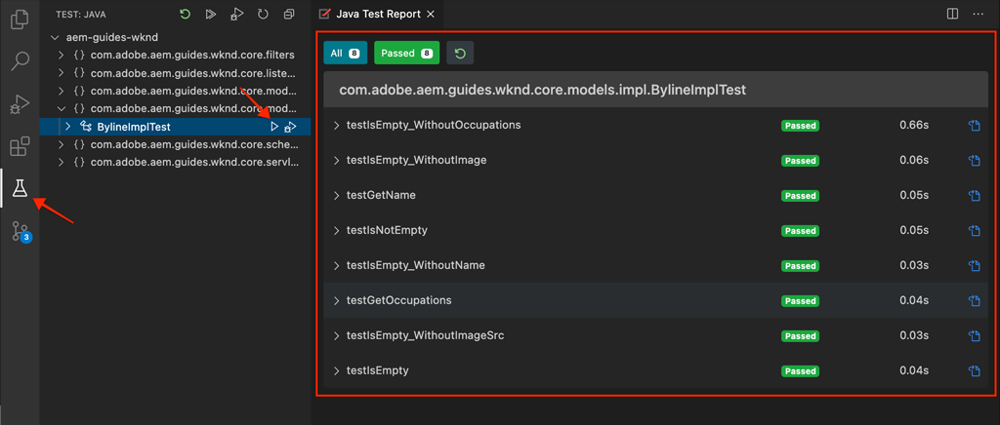

# Eenheid testen {#unit-testing}

Deze zelfstudie behandelt de implementatie van een eenheidstest die het gedrag van het Sling Model van de component Byline bevestigt, dat in het [Aangepaste component](./custom-component.md) zelfstudie.

## Vereisten {#prerequisites}

Controleer de vereiste gereedschappen en instructies voor het instellen van een [plaatselijke ontwikkelomgeving](overview.md#local-dev-environment).

_Als zowel Java™ 8 als Java™ 11 op het systeem zijn geïnstalleerd, kan de testruntime van de Code van VS de lagere runtime van Java™ kiezen wanneer het uitvoeren van de tests, resulterend in testmislukkingen. Als dit gebeurt, verwijdert u Java™ 8._

### Starter-project

>[!NOTE]
>
> Als u met succes het vorige hoofdstuk voltooide, kunt u het project opnieuw gebruiken en de stappen overslaan voor het uitchecken van het starterproject.

Bekijk de basislijncode waarop de zelfstudie is gebaseerd:

1. Kijk uit de `tutorial/unit-testing-start` vertakking van [GitHub](https://github.com/adobe/aem-guides-wknd)

   ```shell
   $ cd aem-guides-wknd
   $ git checkout tutorial/unit-testing-start
   ```

1. Stel codebasis aan een lokale AEM instantie op gebruikend uw Maven vaardigheden:

   ```shell
   $ mvn clean install -PautoInstallSinglePackage
   ```

   >[!NOTE]
   >
   > Indien u AEM 6.5 of 6.4 gebruikt, voegt u de `classic` aan om het even welke Gemaakt bevelen.

   ```shell
   $ mvn clean install -PautoInstallSinglePackage -Pclassic
   ```

U kunt de voltooide code altijd weergeven op [GitHub](https://github.com/adobe/aem-guides-wknd/tree/tutorial/unit-testing-start) of controleer de code plaatselijk door aan de tak over te schakelen `tutorial/unit-testing-start`.

## Doelstelling

1. Begrijp de grondbeginselen van eenheidstests.
1. Leer over kaders en hulpmiddelen algemeen worden gebruikt om AEM code te testen die.
1. Begrijp opties voor het verplaatsen of simuleren van AEM middelen wanneer het schrijven van eenheidstests.

## Achtergrond {#unit-testing-background}

In deze zelfstudie bekijken we hoe we schrijven [Eenheidstests](https://en.wikipedia.org/wiki/Unit_testing) voor onze component Byline [Verkoopmodel](https://sling.apache.org/documentation/bundles/models.html) (gemaakt in het dialoogvenster [Een aangepaste AEM maken](custom-component.md)). Eenheidstests zijn in Java™ geschreven ontwikkeltijdstests die het verwachte gedrag van Java™-code controleren. Elke eenheidstest is doorgaans klein en valideert de uitvoer van een methode (of werkeenheden) aan de hand van de verwachte resultaten.

We gebruiken AEM best practices en gebruiken:

* [JUnit 5](https://junit.org/junit5/)
* [Mockito Testing Framework](https://site.mockito.org/)
* [wcm.io-testframework](https://wcm.io/testing/) (die voortbouwt op [Apache Sling Mocks](https://sling.apache.org/documentation/development/sling-mock.html))

## Testen en Adoben van eenheden - Cloud Manager {#unit-testing-and-adobe-cloud-manager}

[Adobe Cloud Manager](https://experienceleague.adobe.com/docs/experience-manager-cloud-manager/content/introduction.html) de uitvoering van de eenheidstest integreren en [rapportage van codedekking](https://experienceleague.adobe.com/docs/experience-manager-cloud-manager/content/using/code-quality-testing.html) in de CI/CD-pijpleiding om de beste praktijk van eenheidstests AEM code te bevorderen en te bevorderen.

Hoewel code voor eenheidstests een goede praktijk is voor elke codebasis, is het bij het gebruik van Cloud Manager belangrijk om te profiteren van de mogelijkheden voor het testen en rapporteren van de codekwaliteit door eenheidstests op te geven voor Cloud Manager om te worden uitgevoerd.

## Werk de test Geweven gebiedsdelen bij {#inspect-the-test-maven-dependencies}

De eerste stap is Geweven gebiedsdelen te inspecteren om het schrijven en het runnen van de tests te steunen. Er zijn vier vereiste afhankelijkheden:

1. JUnit5
1. Mockito Test Framework
1. Apache Sling Mocks
1. AEM Mocks Test Framework (per io.wcm)

De **JUnit5**, **Mockito, en **AEM** de testgebiedsdelen worden automatisch toegevoegd aan het project tijdens opstelling gebruikend [AEM Maven archetype](project-setup.md).

1. Om deze gebiedsdelen te bekijken, open het ParentReactor POM bij **aem-guides-wknd/pom.xml**, navigeert u naar de `<dependencies>..</dependencies>` en bekijk de afhankelijkheden voor JUnit, Mockito, Apache Sling Mocks en AEM Mock Tests via io.wcm onder `<!-- Testing -->`.
1. Zorg ervoor dat `io.wcm.testing.aem-mock.junit5` is ingesteld op **4.1.0.**:

   ```xml
   <dependency>
       <groupId>io.wcm</groupId>
       <artifactId>io.wcm.testing.aem-mock.junit5</artifactId>
       <version>4.1.0</version>
       <scope>test</scope>
   </dependency>
   ```

   >[!CAUTION]
   >
   > Archetype **35** genereert het project met `io.wcm.testing.aem-mock.junit5` versie **4.1.8.**. Verlaag naar **4.1.0.** om de rest van dit hoofdstuk te volgen.

1. Openen **aem-guides-wknd/core/pom.xml** en te bekijken dat de overeenkomstige het testen gebiedsdelen beschikbaar zijn.

   Een parallelle bronmap in het dialoogvenster **kern** het project zal de eenheidstests en alle ondersteunende testbestanden bevatten . Dit **test** de omslag verstrekt scheiding van testklassen van de broncode maar staat de tests toe om te handelen alsof zij in de zelfde pakketten zoals de broncode leven.

## De JUnit-test maken {#creating-the-junit-test}

De tests van de eenheid brengen typisch 1-aan-1 met klassen Java™ in kaart. In dit hoofdstuk schrijven we een JUnit-test voor de **BylineImpl.java**, het verkoopmodel dat de Byline-component ondersteunt.


*Locatie waar eenheidstests worden opgeslagen.*

1. Een eenheidstest maken voor de `BylineImpl.java` door een nieuwe Java™-klasse onder te maken `src/test/java` in een Java™-pakketmapstructuur die de locatie weerspiegelt van de Java™-klasse die moet worden getest.

   

   Aangezien we testen

   * `src/main/java/com/adobe/aem/guides/wknd/core/models/impl/BylineImpl.java`

   een overeenkomende eenheidstest voor een Java™-klasse maken op

   * `src/test/java/com/adobe/aem/guides/wknd/core/models/impl/BylineImplTest.java`

   De `Test` achtervoegsel op het testbestand van de eenheid, `BylineImplTest.java` is een conventie die ons in staat stelt

   1. Identificeer het gemakkelijk als testdossier _for_ `BylineImpl.java`
   1. U kunt echter ook het testbestand onderscheiden _van_ de klasse die wordt getest; `BylineImpl.java`

## BylineImplTest.java evalueren {#reviewing-bylineimpltest-java}

Het JUnit-testbestand is nu een lege Java™-klasse.

1. Werk het bestand bij met de volgende code:

   ```java
   package com.adobe.aem.guides.wknd.core.models.impl;
   
   import static org.junit.jupiter.api.Assertions.*;
   
   import org.junit.jupiter.api.BeforeEach;
   import org.junit.jupiter.api.Test;
   
   public class BylineImplTest {
   
       @BeforeEach
       void setUp() throws Exception {
   
       }
   
       @Test 
       void testGetName() { 
           fail("Not yet implemented");
       }
   
       @Test 
       void testGetOccupations() { 
           fail("Not yet implemented");
       }
   
       @Test 
       void testIsEmpty() { 
           fail("Not yet implemented");
       }
   }
   ```

1. De eerste methode `public void setUp() { .. }` is geannoteerd met JUnit `@BeforeEach`, die de JUnit-testruntime de instructie geeft deze methode uit te voeren voordat elke testmethode in deze klasse wordt uitgevoerd. Dit verstrekt een handige plaats om gemeenschappelijke het testen staat te initialiseren die door alle tests wordt vereist.

1. De volgende methoden zijn de testmethoden waarvan de namen vooraf zijn vastgesteld `test` bij overeenkomst en met de `@Test` aantekening. U ziet dat al onze tests standaard mislukken, omdat we ze nog niet hebben uitgevoerd.

   Om te beginnen, beginnen wij met één enkele testmethode voor elke openbare methode op de klasse wij testen, zo:

   | BylineImpl.java |              | BylineImplTest.java |
   | ------------------|--------------|---------------------|
   | getName() | wordt getest door | testGetName() |
   | getOccupations() | wordt getest door | testGetOccupations() |
   | isEmpty() | wordt getest door | testIsEmpty() |

   Deze methoden kunnen zo nodig worden uitgebreid, zoals verderop in dit hoofdstuk wordt weergegeven.

   Wanneer deze JUnit-testklasse (ook wel JUnit Test Case genoemd) wordt uitgevoerd, wordt elke methode gemarkeerd met de `@Test` wordt uitgevoerd als een test die kan slagen of mislukken.


*`core/src/test/java/com/adobe/aem/guides/wknd/core/models/impl/BylineImplTest.java`*

1. Voer de JUnit-testcase uit door met de rechtermuisknop op de knop `BylineImplTest.java` bestand en tikken **Uitvoeren**.
Zoals verwacht, mislukken alle tests, omdat ze nog niet zijn uitgevoerd.

   

   *Klik met de rechtermuisknop op BylineImplTests.java > Uitvoeren*

## BylineImpl.java evalueren {#reviewing-bylineimpl-java}

Bij het schrijven van eenheidstests zijn er twee primaire benaderingen:

* [TDD of testontwikkeling](https://en.wikipedia.org/wiki/Test-driven_development), waarbij de eenheidstests stapsgewijs worden geschreven, onmiddellijk voordat de implementatie wordt ontwikkeld; een test schrijven, de implementatie schrijven om de test te laten slagen.
* Implementatie-eerste Ontwikkeling, die het ontwikkelen van werkende code eerst en dan het schrijven tests impliceert die genoemde code bevestigen.

In deze zelfstudie wordt de laatste aanpak gebruikt (omdat we al een werkende **BylineImpl.java** in een vorig hoofdstuk). Daarom moeten we het gedrag van de openbare methoden van het systeem, maar ook een aantal van de toepassingsdetails ervan, herzien en begrijpen. Dit kan tegendeel klinken, aangezien een goede test alleen de inputs en outputs moet betreffen, maar wanneer men in AEM werkt, zijn er verschillende implementatieoverwegingen die moeten worden begrepen om werktests te kunnen uitvoeren.

TDD in de context van AEM vereist een niveau van deskundigheid en kan het best worden aangenomen door AEM ontwikkelaars die deskundig zijn in AEM ontwikkeling en eenheidstests van AEM code.

## Opzetten AEM testcontext  {#setting-up-aem-test-context}

De meeste code die voor AEM wordt geschreven, is afhankelijk van API&#39;s van het type JCR, Sling of AEM. Deze API&#39;s vereisen dat de context van een actieve AEM correct wordt uitgevoerd.

Aangezien de eenheidstests bij bouwstijl, buiten de context van een lopende AEM instantie worden uitgevoerd, is er geen dergelijke context. Om dit te vergemakkelijken, [AEM Mocks van wcm.io](https://wcm.io/testing/aem-mock/usage.html) maakt een mock-context waarin deze API&#39;s _meestal_ doen alsof ze in AEM lopen.

1. Een AEM context maken met **wcm.io&#39;s** `AemContext` in **BylineImplTest.java** door deze toe te voegen als een JUnit-extensie die is ingericht met `@ExtendWith` aan de **BylineImplTest.java** bestand. De extensie zorgt voor alle vereiste initialisatie- en opschoningstaken. Een klassevariabele maken voor `AemContext` die voor alle testmethoden kunnen worden gebruikt.

   ```java
   import org.junit.jupiter.api.extension.ExtendWith;
   import io.wcm.testing.mock.aem.junit5.AemContext;
   import io.wcm.testing.mock.aem.junit5.AemContextExtension;
   ...
   
   @ExtendWith(AemContextExtension.class)
   class BylineImplTest {
   
       private final AemContext ctx = new AemContext();
   ```

   Deze variabele, `ctx`, maakt een AEM context bloot die sommige AEM en het Schuiven abstracties verstrekt:

   * Het BylineImpl-opmaakmodel is in deze context geregistreerd
   * In deze context worden structuur voor JCR-inhoud van Mock gemaakt
   * Aangepaste OSGi-services kunnen in deze context worden geregistreerd
   * Verschillende veelvoorkomende vereiste modelobjecten en hulpelementen, zoals SlingHttpServletRequest-objecten, diverse services voor modelschaling en AEM OSGi, zoals ModelFactory, PageManager, Page, Template, ComponentManager, Component, TagManager, Tag, enzovoort.
      * *Niet alle methoden voor deze objecten zijn geïmplementeerd.*
   * en [veel meer](https://wcm.io/testing/aem-mock/usage.html)!

   De **`ctx`** -object zal fungeren als toegangspunt voor het grootste deel van onze modelcontext.

1. In de `setUp(..)` methode, die vóór elke methode wordt uitgevoerd `@Test` een algemene teststatus voor modellen definiëren:

   ```java
   @BeforeEach
   public void setUp() throws Exception {
       ctx.addModelsForClasses(BylineImpl.class);
       ctx.load().json("/com/adobe/aem/guides/wknd/core/models/impl/BylineImplTest.json", "/content");
   }
   ```

   * **`addModelsForClasses`** registreert het Te testen Model van de Schelling, in de AEMContext, zodat kan het in `@Test` methoden.
   * **`load().json`** laadt middelstructuren in de modelcontext, toestaand de code om met deze middelen in wisselwerking te staan alsof zij door een echte bewaarplaats werden verstrekt. De brondefinities in het bestand **`BylineImplTest.json`** worden geladen in de standaard-JCR-context onder **/content**.
   * **`BylineImplTest.json`** bestaat nog niet, dus laten we het maken en de JCR-bronstructuren definiëren die nodig zijn voor de test.

1. De JSON-bestanden die de modelbronstructuren vertegenwoordigen, worden opgeslagen onder **core/src/test/resources** hetzelfde pakketpad volgen als het Java™-testbestand van de JUnit.

   Een JSON-bestand maken op `core/test/resources/com/adobe/aem/guides/wknd/core/models/impl` benoemd **BylineImplTest.json** met de volgende inhoud:

   ```json
   {
       "byline": {
       "jcr:primaryType": "nt:unstructured",
       "sling:resourceType": "wknd/components/content/byline"
       }
   }
   ```

   

   Deze JSON definieert een modelbron (JCR-knooppunt) voor de eenheidstest van de Byline-component. Op dit punt, heeft JSON de minimumreeks eigenschappen die worden vereist om een de inhoudsmiddel van de component van de Byline te vertegenwoordigen, `jcr:primaryType` en `sling:resourceType`.

   Een algemene regel bij het werken met eenheidstests is het maken van de minimale set met mock-inhoud, -context en -code die nodig is om aan elke test te voldoen. Vermijd de verleiding om een complete mock-context op te bouwen voordat de tests worden geschreven, aangezien dit vaak tot ongewenste artefacten leidt.

   Met het bestaan van **BylineImplTest.json**, wanneer `ctx.json("/com/adobe/aem/guides/wknd/core/models/impl/BylineImplTest.json", "/content")` wordt uitgevoerd, worden de modelmiddeldefinities geladen in de context bij de weg **/content.**

## getName() testen {#testing-get-name}

Nu we een basismodelcontext hebben, schrijven we onze eerste test voor **getName() van BylineImpl**. Deze test moet de methode waarborgen **getName()** retourneert de correct geschreven naam die is opgeslagen bij de bron &quot;**name&quot;** eigenschap.

1. Werk de **testGetName**() in **BylineImplTest.java** als volgt:

   ```java
   import com.adobe.aem.guides.wknd.core.models.Byline;
   ...
   @Test
   public void testGetName() {
       final String expected = "Jane Doe";
   
       ctx.currentResource("/content/byline");
       Byline byline = ctx.request().adaptTo(Byline.class);
   
       String actual = byline.getName();
   
       assertEquals(expected, actual);
   }
   ```

   * **`String expected`** stelt de verwachte waarde in. We stellen dit in op &quot;**Jane Done**&quot;.
   * **`ctx.currentResource`** plaatst de context van het mock middel om de code tegen te evalueren, zodat wordt dit geplaatst aan **/content/byline** aangezien dat is waar het mock byline inhoudsmiddel wordt geladen.
   * **`Byline byline`** instantieert het Byline Sling Model door het van het modelvoorwerp van het Verzoek aan te passen.
   * **`String actual`** roept de methode aan die wij testen, `getName()`, op het object Byline Sling Model.
   * **`assertEquals`** Geeft aan dat de verwachte waarde overeenkomt met de waarde die wordt geretourneerd door het byline Sling Model-object. Als deze waarden niet gelijk zijn, zal de test mislukken.

1. Voer de test uit... en deze mislukt met een `NullPointerException`.

   Deze test mislukt NIET omdat we nooit een `name` eigenschap in de mock JSON, die de test zal laten mislukken, maar de uitvoering van de test is op dat punt nog niet bereikt! Deze test is mislukt als gevolg van een `NullPointerException` op het byline-object zelf.

1. In de `BylineImpl.java`, als `@PostConstruct init()` genereert een uitzondering die voorkomt dat het Sling Model wordt geïnstantieerd en die ervoor zorgt dat het Sling Model-object null is.

   ```java
   @PostConstruct
   private void init() {
       image = modelFactory.getModelFromWrappedRequest(request, request.getResource(), Image.class);
   }
   ```

   Het blijkt dat de ModelFactory OSGi-service wordt geleverd via de `AemContext` (in de context van Apache Sling) worden niet alle methoden geïmplementeerd, inclusief `getModelFromWrappedRequest(...)` die in BylineImpl wordt geroepen `init()` methode. Dit leidt tot een [AbstractMethodError](https://docs.oracle.com/en/java/javase/11/docs/api/java.base/java/lang/AbstractMethodError.html), die op termijn `init()` en de daaruit voortvloeiende aanpassing van de `ctx.request().adaptTo(Byline.class)` is een null-object.

   Aangezien de geleverde modellen onze code niet kunnen aanpassen, moeten wij de modelcontext zelf uitvoeren voor dit, kunnen wij Mockito gebruiken om een modelobject ModelFactory te creëren, dat een modelvoorwerp van het Beeld terugkeert wanneer `getModelFromWrappedRequest(...)` wordt er op aangeroepen.

   Omdat deze modelcontext aanwezig moet zijn om zelfs maar een instantie van het Byline Sling-model te kunnen maken, kunnen we deze toevoegen aan de `@Before setUp()` methode. We moeten ook de `MockitoExtension.class` aan de `@ExtendWith` aantekening boven de **BylineImplTest** klasse.

   ```java
   package com.adobe.aem.guides.wknd.core.models.impl;
   
   import org.mockito.junit.jupiter.MockitoExtension;
   import org.mockito.Mock;
   
   import com.adobe.aem.guides.wknd.core.models.Byline;
   import com.adobe.cq.wcm.core.components.models.Image;
   
   import io.wcm.testing.mock.aem.junit5.AemContext;
   import io.wcm.testing.mock.aem.junit5.AemContextExtension;
   
   import org.apache.sling.models.factory.ModelFactory;
   import org.junit.jupiter.api.BeforeEach;
   import org.junit.jupiter.api.Test;
   import org.junit.jupiter.api.extension.ExtendWith;
   
   import static org.junit.jupiter.api.Assertions.*;
   import static org.mockito.Mockito.*;
   import org.apache.sling.api.resource.Resource;
   
   @ExtendWith({ AemContextExtension.class, MockitoExtension.class })
   public class BylineImplTest {
   
       private final AemContext ctx = new AemContext();
   
       @Mock
       private Image image;
   
       @Mock
       private ModelFactory modelFactory;
   
       @BeforeEach
       public void setUp() throws Exception {
           ctx.addModelsForClasses(BylineImpl.class);
   
           ctx.load().json("/com/adobe/aem/guides/wknd/core/models/impl/BylineImplTest.json", "/content");
   
           lenient().when(modelFactory.getModelFromWrappedRequest(eq(ctx.request()), any(Resource.class), eq(Image.class)))
                   .thenReturn(image);
   
           ctx.registerService(ModelFactory.class, modelFactory, org.osgi.framework.Constants.SERVICE_RANKING,
                   Integer.MAX_VALUE);
       }
   
       @Test
       void testGetName() { ...
   }
   ```

   * **`@ExtendWith({AemContextExtension.class, MockitoExtension.class})`** markeert de klasse van het Geval van de Test om met te lopen [Mockito JUnit Jupiter Extension](https://www.javadoc.io/static/org.mockito/mockito-junit-jupiter/4.11.0/org/mockito/junit/jupiter/MockitoExtension.html) Hiermee kunt u de @Mock-annotaties gebruiken om mock-objecten op klasseniveau te definiëren.
   * **`@Mock private Image`** maakt een mock-object van het type `com.adobe.cq.wcm.core.components.models.Image`. Dit wordt op klasseniveau zo gedefinieerd dat, indien nodig, `@Test` de methoden kunnen het gedrag naar behoefte wijzigen.
   * **`@Mock private ModelFactory`** Maakt een mock-object van het type ModelFactory. Dit is een puur Mockito-mock en er zijn geen methoden op toegepast. Dit wordt op klasseniveau zo gedefinieerd dat, indien nodig, `@Test`de methoden kunnen het gedrag naar behoefte wijzigen.
   * **`when(modelFactory.getModelFromWrappedRequest(..)`** registreert mock-gedrag voor wanneer `getModelFromWrappedRequest(..)` wordt aangeroepen voor het modelobject ModelFactory. Het in `thenReturn (..)` moet het modelafbeeldingsobject retourneren. Dit gedrag wordt alleen aangeroepen wanneer: de eerste parameter is gelijk aan `ctx`Het verzoekvoorwerp van &#39;s, tweede param is om het even welk voorwerp van het Middel, en derde param moet de klasse van het Beeld van de Componenten van de Kern zijn. Wij aanvaarden om het even welke Middel omdat wij door onze tests plaatsen `ctx.currentResource(...)` aan diverse in de **BylineImplTest.json**. Opmerking: we voegen de **lenient()** striktheid omdat wij later dit gedrag van ModelFactory zullen willen met voeten treden.
   * **`ctx.registerService(..)`.** Registreert het modelobject ModelFactory in AemContext, met de hoogste de dienstrangschikking. Dit is vereist omdat ModelFactory in BylineImpl wordt gebruikt `init()` via de `@OSGiService ModelFactory model` veld. Voor injectie van AemContext **ons** mock-object, dat aanroepen van `getModelFromWrappedRequest(..)`, moeten wij het als hoogste rangordeDienst van dat type (ModelFactory) registreren.

1. Voer de test opnieuw uit, en nogmaals, het mislukt, maar dit keer is de boodschap duidelijk waarom de test is mislukt.

   

   *testGetName() mislukt door bewering*

   We ontvangen een **AssertionError** wat betekent dat de voorwaarde van de bevestiging in de test is mislukt, en het vertelt ons de **verwachte waarde is &quot;Jane Doe&quot;** maar de **werkelijke waarde is null**. Dit is logisch omdat &quot;**name&quot;** eigenschap is niet toegevoegd aan mock **/content/byline** resourcedefinitie in **BylineImplTest.json**, dus laten wij het toevoegen:

1. Bijwerken **BylineImplTest.json** om `"name": "Jane Doe".`

   ```json
   {
       "byline": {
       "jcr:primaryType": "nt:unstructured",
       "sling:resourceType": "wknd/components/content/byline",
       "name": "Jane Doe"
       }
   }
   ```

1. de test opnieuw uitvoeren, en **`testGetName()`** nu gaat het!

   


## getOccupations() testen {#testing-get-occupations}

Ok, geweldig! De eerste test is geslaagd! Laten we verder gaan en testen `getOccupations()`. Sinds de initialisatie van de modelcontext in de `@Before setUp()`methode is beschikbaar voor iedereen `@Test` methoden in deze testcase, inclusief `getOccupations()`.

Onthoud dat deze methode een alfabetisch gesorteerde lijst met beroepen (aflopend) moet retourneren die is opgeslagen in de eigenschap bezettingen.

1. Bijwerken **`testGetOccupations()`** als volgt:

   ```java
   import java.util.List;
   import com.google.common.collect.ImmutableList;
   ...
   @Test
   public void testGetOccupations() {
       List<String> expected = new ImmutableList.Builder<String>()
                               .add("Blogger")
                               .add("Photographer")
                               .add("YouTuber")
                               .build();
   
       ctx.currentResource("/content/byline");
       Byline byline = ctx.request().adaptTo(Byline.class);
   
       List<String> actual = byline.getOccupations();
   
       assertEquals(expected, actual);
   }
   ```

   * **`List<String> expected`** het verwachte resultaat te definiëren.
   * **`ctx.currentResource`** plaatst het huidige middel om de context tegen de modelmiddeldefinitie bij /content/byline te evalueren. Dit zorgt ervoor dat **BylineImpl.java** wordt uitgevoerd in de context van onze mock resource.
   * **`ctx.request().adaptTo(Byline.class)`** instantieert het Byline Sling Model door het van het modelvoorwerp van het Verzoek aan te passen.
   * **`byline.getOccupations()`** roept de methode aan die wij testen, `getOccupations()`, op het object Byline Sling Model.
   * **`assertEquals(expected, actual)`** De verwachte lijst van berichten is het zelfde als de daadwerkelijke lijst.

1. Herinner me, enkel **`getName()`** de **BylineImplTest.json** geen beroepen definieert, dus deze test zal mislukken als we ze uitvoeren, omdat `byline.getOccupations()` retourneert een lege lijst.

   Bijwerken **BylineImplTest.json** om een lijst van beroepen op te nemen, en zij worden geplaatst in niet alfabetische orde om ervoor te zorgen dat onze tests bevestigen dat de beroepen alfabetisch door worden gesorteerd **`getOccupations()`**.

   ```json
   {
       "byline": {
       "jcr:primaryType": "nt:unstructured",
       "sling:resourceType": "wknd/components/content/byline",
       "name": "Jane Doe",
       "occupations": ["Photographer", "Blogger", "YouTuber"]
       }
   }
   ```

1. Voer de test uit, en nogmaals, we slagen! Het lijkt alsof de gesorteerde beroepen werken!

   

   *testGetOccupations() geslaagd*

## Testing isEmpty() {#testing-is-empty}

De laatste testmethode **`isEmpty()`**.

Testen `isEmpty()` Dit is interessant omdat het testen op verschillende omstandigheden vereist. Reviseren **BylineImpl.java** s `isEmpty()` methode moeten de volgende voorwaarden worden getest:

* Retourneer true wanneer de naam leeg is
* Retourneer true wanneer de bezettingen null of leeg zijn
* Retourneer true wanneer de afbeelding null is of geen src-URL heeft
* Retourneer false wanneer de naam, de bezetting en de afbeelding (met een URL voor de bron) aanwezig zijn

Hiervoor moeten we testmethoden maken, waarbij elke test een specifieke voorwaarde en nieuwe modelbronstructuren in `BylineImplTest.json` om deze tests uit te voeren.

Met deze controle konden we het testen overslaan als `getName()`, `getOccupations()` en `getImage()` leeg zijn omdat het verwachte gedrag van die toestand via `isEmpty()`.

1. De eerste test zal de voorwaarde van een gloednieuwe component testen, die geen eigenschappen heeft geplaatst.

   Een nieuwe brondefinitie toevoegen aan `BylineImplTest.json`, met de semantische naam &quot;**leeg**&quot;

   ```json
   {
       "byline": {
           "jcr:primaryType": "nt:unstructured",
           "sling:resourceType": "wknd/components/content/byline",
           "name": "Jane Doe",
           "occupations": ["Photographer", "Blogger", "YouTuber"]
       },
       "empty": {
           "jcr:primaryType": "nt:unstructured",
           "sling:resourceType": "wknd/components/content/byline"
       }
   }
   ```

   **`"empty": {...}`** een nieuwe brondefinitie definiëren met de naam &quot;empty&quot; die alleen een `jcr:primaryType` en `sling:resourceType`.

   Onthoud dat we laden `BylineImplTest.json` in `ctx` vóór de uitvoering van elke testmethode in `@setUp`, zodat deze nieuwe hulpmiddeldefinitie onmiddellijk beschikbaar voor ons is in tests op **/content/empty.**

1. Bijwerken `testIsEmpty()` als volgt de huidige bron instellen op de nieuwe &quot;**leeg**&quot; mock resource definition.

   ```java
   @Test
   public void testIsEmpty() {
       ctx.currentResource("/content/empty");
       Byline byline = ctx.request().adaptTo(Byline.class);
   
       assertTrue(byline.isEmpty());
   }
   ```

   Voer de test uit en controleer of deze slaagt.

1. Maak vervolgens een set methoden om ervoor te zorgen dat een van de vereiste gegevenspunten (naam, beroep of afbeelding) leeg is. `isEmpty()` retourneert true.

   Voor elke test wordt een discrete modelbrondefinitie gebruikt, update **BylineImplTest.json** met de aanvullende brondefinities voor **zonder naam** en **onbezet**.

   ```json
   {
       "byline": {
           "jcr:primaryType": "nt:unstructured",
           "sling:resourceType": "wknd/components/content/byline",
           "name": "Jane Doe",
           "occupations": ["Photographer", "Blogger", "YouTuber"]
       },
       "empty": {
           "jcr:primaryType": "nt:unstructured",
           "sling:resourceType": "wknd/components/content/byline"
       },
       "without-name": {
           "jcr:primaryType": "nt:unstructured",
           "sling:resourceType": "wknd/components/content/byline",
           "occupations": "[Photographer, Blogger, YouTuber]"
       },
       "without-occupations": {
           "jcr:primaryType": "nt:unstructured",
           "sling:resourceType": "wknd/components/content/byline",
           "name": "Jane Doe"
       }
   }
   ```

   Maak de volgende testmethoden om deze statussen te testen.

   ```java
   @Test
   public void testIsEmpty() {
       ctx.currentResource("/content/empty");
   
       Byline byline = ctx.request().adaptTo(Byline.class);
   
       assertTrue(byline.isEmpty());
   }
   
   @Test
   public void testIsEmpty_WithoutName() {
       ctx.currentResource("/content/without-name");
   
       Byline byline = ctx.request().adaptTo(Byline.class);
   
       assertTrue(byline.isEmpty());
   }
   
   @Test
   public void testIsEmpty_WithoutOccupations() {
       ctx.currentResource("/content/without-occupations");
   
       Byline byline = ctx.request().adaptTo(Byline.class);
   
       assertTrue(byline.isEmpty());
   }
   
   @Test
   public void testIsEmpty_WithoutImage() {
       ctx.currentResource("/content/byline");
   
       lenient().when(modelFactory.getModelFromWrappedRequest(eq(ctx.request()),
           any(Resource.class),
           eq(Image.class))).thenReturn(null);
   
       Byline byline = ctx.request().adaptTo(Byline.class);
   
       assertTrue(byline.isEmpty());
   }
   
   @Test
   public void testIsEmpty_WithoutImageSrc() {
       ctx.currentResource("/content/byline");
   
       when(image.getSrc()).thenReturn("");
   
       Byline byline = ctx.request().adaptTo(Byline.class);
   
       assertTrue(byline.isEmpty());
   }
   ```

   **`testIsEmpty()`** test tegen de lege modelmiddeldefinitie en beweert dat `isEmpty()` is waar.

   **`testIsEmpty_WithoutName()`** test tegen een mock middeldefinitie die beroepen maar geen naam heeft.

   **`testIsEmpty_WithoutOccupations()`** test tegen een mock middeldefinitie die een naam maar geen beroepen heeft.

   **`testIsEmpty_WithoutImage()`** test tegen een modelmiddeldefinitie met een naam en bezinkingen maar plaatst het modelBeeld om aan ongeldig terug te keren. Let op: we willen de `modelFactory.getModelFromWrappedRequest(..)`gedrag gedefinieerd in `setUp()` om ervoor te zorgen dat het voorwerp van het Beeld door deze vraag is teruggekeerd ongeldig is. De functie Mockito-stubs is strikt en wil geen dubbele code. Daarom hebben wij de zaak **`lenient`** instellingen om expliciet op te merken dat het gedrag in de `setUp()` methode.

   **`testIsEmpty_WithoutImageSrc()`** test tegen een modelmiddeldefinitie met een naam en bezet, maar plaatst het modelBeeld om een leeg koord terug te keren wanneer `getSrc()` wordt aangeroepen.

1. Ten slotte moet u een test schrijven om ervoor te zorgen dat **isEmpty()** retourneert false wanneer de component correct is geconfigureerd. Voor deze voorwaarde kunnen we opnieuw gebruiken **/content/byline** die een volledig geconfigureerde Byline-component vertegenwoordigt.

   ```java
   @Test
   public void testIsNotEmpty() {
       ctx.currentResource("/content/byline");
       when(image.getSrc()).thenReturn("/content/bio.png");
   
       Byline byline = ctx.request().adaptTo(Byline.class);
   
       assertFalse(byline.isEmpty());
   }
   ```

1. Voer nu alle eenheidstests in het bestand BylineImplTest.java uit en bekijk de uitvoer van het Java™-testrapport.



## Tests van de eenheid als onderdeel van de constructie {#running-unit-tests-as-part-of-the-build}

Eenheidstests worden uitgevoerd en moeten als onderdeel van de gefabriceerde build slagen. Dit zorgt ervoor dat alle tests met succes overgaan alvorens een toepassing wordt opgesteld. Het uitvoeren van Gemaakte doelstellingen zoals pakket of installeert roept automatisch en vereist de overgaan van alle eenheidstests in het project.

```shell
$ mvn package
```


```shell
$ mvn package
```

Op dezelfde manier, als wij een testmethode veranderen om te ontbreken, ontbreekt de bouwstijl en rapporten die test ontbrak en waarom.


## De code controleren {#review-the-code}

De voltooide code weergeven op [GitHub](https://github.com/adobe/aem-guides-wknd) of herzie en stel plaatselijk de code bij de tak van de it op `tutorial/unit-testing-solution`.
