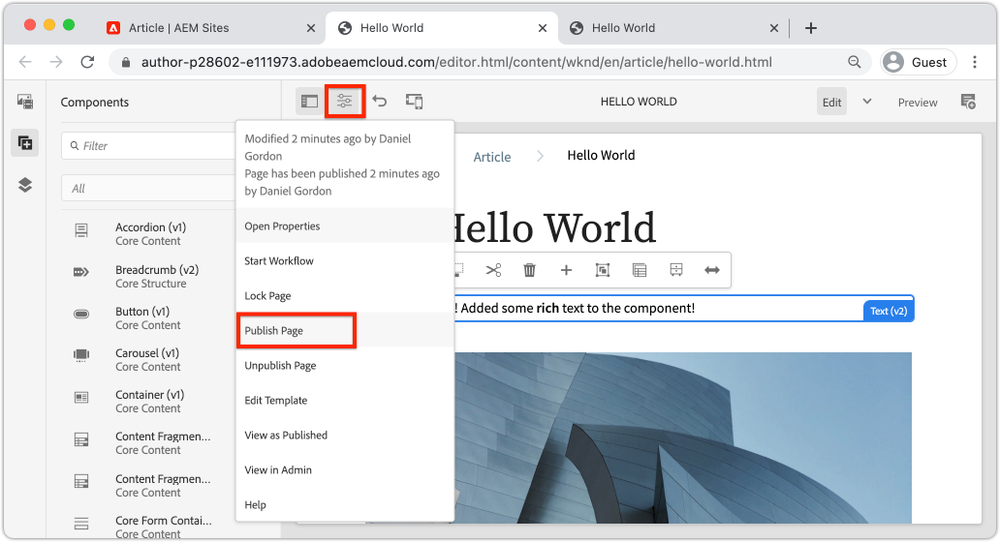

# Inleiding tot ontwerpen en publiceren {#author-content-publish}

Het is belangrijk om te begrijpen hoe een gebruiker inhoud voor de website zal bijwerken. In dit hoofdstuk zullen we de persoon van een **Inhoudsauteur** en brengt u enkele redactionele wijzigingen aan in de site die in het vorige hoofdstuk is gegenereerd. Aan het einde van het hoofdstuk publiceren we de wijzigingen om te begrijpen hoe de livesite wordt bijgewerkt.

## Vereisten {#prerequisites}

Dit is een meerdelige zelfstudie en er wordt aangenomen dat de stappen die in het dialoogvenster [Een site maken](./create-site.md) hoofdstuk is voltooid.

## Doelstelling {#objective}

1. Begrijp de concepten van **Pagina&#39;s** en **Componenten** in AEM Sites.
1. Leer hoe u de inhoud van de website kunt bijwerken.
1. Leer hoe u wijzigingen op de livesite publiceert.

## Een nieuwe pagina maken {#create-page}

Een website wordt doorgaans opgedeeld in pagina&#39;s en vormt zo een ervaring van meerdere pagina&#39;s. AEM de inhoud van structuren op dezelfde manier. Maak vervolgens een nieuwe pagina voor de site.

1. Aanmelden bij de AEM **Auteur** De dienst die in het vorige hoofdstuk wordt gebruikt.
1. Klik in het scherm AEM starten op **Sites** > **WKND-site** > **Engels** > **Artikel**
1. Klik in de rechterbovenhoek op **Maken** > **Pagina**.

   

   Dit zal de **Pagina maken** wizard.

1. Kies de optie **Artikelpagina** sjabloon en klik op **Volgende**.

   Pagina&#39;s in AEM worden gemaakt op basis van een paginasjabloon. Paginasjablonen worden in het dialoogvenster [Paginasjablonen](page-templates.md) hoofdstuk.

1. Onder **Eigenschappen** Voer een **Titel** van &quot;Hello World&quot;.
1. Stel de **Naam** te worden `hello-world` en klik op **Maken**.

   

1. Klik in het dialoogvenster op **Openen** om de nieuwe pagina te openen.

## Auteur een component {#author-component}

AEM Componenten kunnen worden beschouwd als kleine modulaire bouwstenen van een webpagina. Door UI in logische brokken of Componenten te breken, maakt het het veel gemakkelijker te beheren. Om componenten opnieuw te gebruiken, moeten de componenten configureerbaar zijn. Dit gebeurt via het dialoogvenster van de auteur.

AEM biedt een set [Kernonderdelen](https://experienceleague.adobe.com/docs/experience-manager-core-components/using/introduction.html) die klaar zijn voor gebruik. De **Kernonderdelen** variëren van basiselementen zoals [Tekst](https://experienceleague.adobe.com/docs/experience-manager-core-components/using/components/text.html) en [Afbeelding](https://experienceleague.adobe.com/docs/experience-manager-core-components/using/components/image.html) naar complexere UI-elementen zoals een [Carousel](https://experienceleague.adobe.com/docs/experience-manager-core-components/using/components/carousel.html).

Vervolgens maakt u enkele componenten met de AEM Pagina-editor.

1. Ga naar de **Hallo wereld** pagina die is gemaakt in de vorige exercitie.
1. Zorg ervoor dat u **Bewerken** en in de linkerzijbalk klikt u op de **Componenten** pictogram.

   

   Hiermee wordt de componentbibliotheek geopend en worden de beschikbare componenten weergegeven die op de pagina kunnen worden gebruikt.

1. Omlaag en **Drag+Drop** a **Tekst (v2)** op het hoofdbewerkbare gebied van de pagina.

   

1. Klik op de knop **Tekst** om te markeren en klik vervolgens op **moersleutel** pictogram  om het dialoogvenster Component te openen. Voer tekst in en sla de wijzigingen op in het dialoogvenster.

   

   De **Tekst** moet nu de tekst met opmaak op de pagina weergeven.

1. Herhaal de bovenstaande stappen, behalve een instantie van het gereedschap **Afbeelding (v2)** op de pagina. Open de **Afbeelding** het dialoogvenster van de component.

1. Schakel in de linkerspoorstaaf over naar de **Asset Finder** door op de knop **Activa** pictogram .
1. **Drag+Drop** een afbeelding in het dialoogvenster van de component en klik op **Gereed** om de wijzigingen op te slaan

   

1. Merk op dat er componenten op de pagina zijn, zoals **Titel**, **Navigatie**, **Zoeken** die vast zijn. Deze gebieden zijn geconfigureerd als onderdeel van het paginasjabloon en kunnen niet worden gewijzigd op een afzonderlijke pagina. Dit wordt meer onderzocht in het volgende hoofdstuk.

Voel u vrij om te experimenteren met enkele andere componenten. Documentatie over elke [Kerncomponent vindt u hier](https://experienceleague.adobe.com/docs/experience-manager-core-components/using/introduction.html). Een gedetailleerde videoreeks over [Hier kunt u de pagina ontwerpen](https://experienceleague.adobe.com/docs/experience-manager-learn/sites/page-authoring/aem-sites-authoring-overview.html).

## Updates publiceren {#publish-updates}

AEM omgevingen worden opgesplitst tussen **Auteursservice** en **Service voor publiceren**. In dit hoofdstuk hebben we verschillende wijzigingen aangebracht op de site op de website **Auteursservice**. Bezoekers van de site kunnen de wijzigingen bekijken die ze moeten publiceren naar de **Service voor publiceren**.

*Stroominhoud op hoog niveau van auteur naar publicatie*

**1.** Inhoudsauteurs maken updates van de site-inhoud. De updates kunnen worden voorvertoond, gecontroleerd en goedgekeurd om live te worden gezet.

**2.** Inhoud wordt gepubliceerd. Publicatie kan op aanvraag worden uitgevoerd of voor een toekomstige datum worden gepland.

**3.** De bezoekers van de site zien de wijzigingen die worden weerspiegeld in de service Publiceren.

### Wijzigingen publiceren

Laten we nu de wijzigingen publiceren.

1. Navigeer van het scherm AEM Start naar **Sites** en selecteert u de **WKND-site**.
1. Klik op de knop **Publicatie beheren** in de menubalk.

   

   Aangezien dit een gloednieuwe site is, willen we alle pagina&#39;s publiceren en kunnen we met de wizard Publicatie beheren precies bepalen wat er moet worden gepubliceerd.

1. Onder **Opties** de standaardinstellingen laten staan **Publiceren** en deze plannen **Nu**. Klik op **Next**.
1. Onder **Toepassingsgebied**, selecteert u de **WKND-site** en klik op **Inclusief onderliggende instellingen**. Controleer in het dialoogvenster **Inclusief onderliggende items**. Schakel de overige selectievakjes uit om ervoor te zorgen dat de hele site wordt gepubliceerd.

   

1. Klik op de knop **Gepubliceerde verwijzingen** knop. Controleer in het dialoogvenster of alles is gecontroleerd. Hieronder vallen ook de **Standaardsitesjabloon** en diverse configuraties die zijn gegenereerd door het Sjabloon van de site. Klikken **Gereed** om bij te werken.

   

1. Schakel ten slotte het selectievakje naast **WKND-site** en klik op **Volgende** in de rechterbovenhoek
1. In de **Workflows** stap, voer een **Titel werkstroom**. Dit kan om het even welke tekst zijn en als deel van een controletraject later nuttig. Voer &quot;Aanvankelijke publicatie&quot; in en klik op **Publiceren**.

## Gepubliceerde inhoud weergeven {#publish}

Navigeer vervolgens naar de service Publiceren om de wijzigingen weer te geven.

1. Een gemakkelijke manier om URL van de Publish Dienst te krijgen is de Auteur URL te kopiëren en te vervangen `author` woord met `publish`. Bijvoorbeeld:

   * **Auteur-URL** - `https://author-pYYYY-eXXXX.adobeaemcloud.com/`
   * **URL publiceren** - `https://publish-pYYYY-eXXXX.adobeaemcloud.com/`

1. Toevoegen `/content/wknd.html` naar de publicatie-URL zodat de uiteindelijke URL er als volgt uitziet: `https://publish-pYYYY-eXXXX.adobeaemcloud.com/content/wknd.html`.

   >[!NOTE]
   >
   > Wijzigen `wknd.html` om overeen te komen met de naam van uw site, als u een unieke naam hebt opgegeven tijdens [site maken](create-site.md).

1. Als u naar de publicatie-URL navigeert, wordt de site weergegeven zonder dat de AEM ontwerpfunctionaliteit nodig is.

   

1. Met de **Navigatie** menu klikken **Artikel** > **Hallo wereld** om naar de vroeger gemaakte Hello World-pagina te navigeren.
1. Terugkeren naar de **AEM Auteur-service** en brengt u enkele extra inhoudswijzigingen aan in de Pagina-editor.
1. Deze wijzigingen rechtstreeks vanuit de paginaeditor publiceren door op de knop **Pagina-eigenschappen** pictogram > **Pagina publiceren**

   

1. Terugkeren naar de **AEM publicatieservice** om de wijzigingen weer te geven. Waarschijnlijk zult u **niet** zie de updates onmiddellijk. Dit komt omdat de **AEM publicatieservice** include [caching via een Apache-webserver en CDN](https://experienceleague.adobe.com/docs/experience-manager-cloud-service/implementing/content-delivery/caching.html). Standaard wordt HTML-inhoud gedurende ~5 minuten in cache geplaatst.

1. Als u het cachegeheugen voor test- en foutopsporingsdoeleinden wilt omzeilen, voegt u eenvoudig een queryparameter toe, zoals `?nocache=true`. De URL ziet er zo uit `https://publish-pYYYY-eXXXX.adobeaemcloud.com/content/wknd/en/article/hello-world.html?nocache=true`. Meer informatie over de cachestrategie en de beschikbare configuraties [hier te vinden](https://experienceleague.adobe.com/docs/experience-manager-cloud-service/implementing/content-delivery/overview.html).

1. U kunt de URL naar de publicatieservice ook vinden in Cloud Manager. Ga naar de **Cloud Manager-programma** > **Omgevingen** > **Omgeving**.

   

   Onder **Omgevingssegmenten** u vindt koppelingen naar de **Auteur** en **Publiceren** diensten.

## Gefeliciteerd! {#congratulations}

U hebt zojuist wijzigingen in uw AEM-site gemaakt en gepubliceerd.

### Volgende stappen {#next-steps}

In een real-world implementatie die een plaats met modellen en ontwerpen UI plant gaat typisch aan verwezenlijking van de Plaats vooraf. Leer hoe u met Adobe XD UI-kits uw Adobe Experience Manager Sites-implementatie kunt ontwerpen en versnellen in [UI-planning met Adobe XD](./ui-planning-adobe-xd.md).

Wilt u doorgaan met het verkennen van AEM Sites-mogelijkheden? Ga naar het hoofdstuk op [Paginasjablonen](./page-templates.md) om de relatie tussen een paginasjabloon en een pagina te begrijpen.

