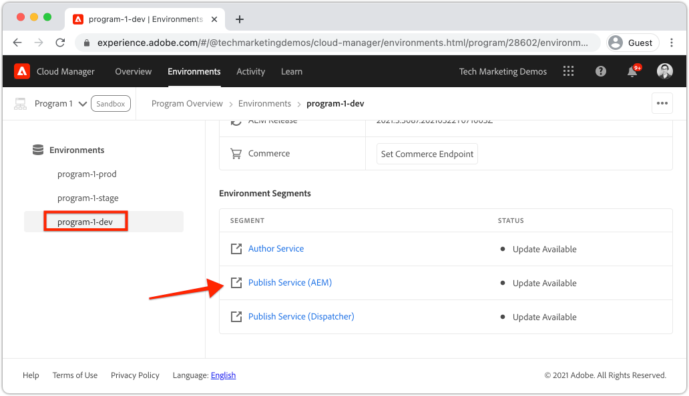

# Inleiding tot ontwerpen en publiceren {#author-content-publish}

Het is belangrijk om te begrijpen hoe een gebruiker inhoud voor de website zal bijwerken. In dit hoofdstuk zullen wij de persoon van de Auteur van de Inhoud van a **goedkeuren** en sommige redactionele updates aan de plaats maken die in het vorige hoofdstuk wordt geproduceerd. Aan het einde van het hoofdstuk publiceren we de wijzigingen om te begrijpen hoe de livesite wordt bijgewerkt.

## Vereisten {#prerequisites}

Dit is een meerdelig leerprogramma en men veronderstelt dat de stappen die in [&#x200B; worden geschetst een plaats &#x200B;](./create-site.md) hoofdstuk zijn voltooid.

## Doelstelling {#objective}

1. Begrijp de concepten **Pagina&#39;s** en **Componenten** in AEM Sites.
1. Leer hoe u de inhoud van de website kunt bijwerken.
1. Leer hoe u wijzigingen op de livesite publiceert.

## Een nieuwe pagina maken {#create-page}

Een website wordt doorgaans opgedeeld in pagina&#39;s en vormt zo een ervaring van meerdere pagina&#39;s. AEM structureert inhoud op dezelfde manier. Maak vervolgens een nieuwe pagina voor de site.

1. Login aan de dienst van de Auteur van AEM **&#x200B;**&#x200B;die in het vorige hoofdstuk wordt gebruikt.
1. Van het scherm van het Begin van AEM klik **Plaatsen** > **Plaats WKND** > **Engels** > **Artikel**
1. In de hogere rechterhoek klikt **&#x200B;**&#x200B;> **Pagina** creëren.

   

   Dit zal omhoog de **creëren tovenaar van de Pagina** brengen.

1. Kies het **malplaatje van de Pagina van het Artikel** en klik **daarna**.

   Pagina&#39;s in AEM worden gemaakt op basis van een paginasjabloon. De Malplaatjes van de pagina worden onderzocht in detail in het [&#x200B; hoofdstuk van de Malplaatjes van de Pagina &#x200B;](page-templates.md).

1. Onder **Eigenschappen** ga a **Titel** van &quot;de Wereld van Hello in.
1. Plaats de **Naam** om `hello-world` te zijn en **te klikken creeert**.

   

1. In de dialoog pop-up klik **Open** om de pas gecreëerde pagina te openen.

## Auteur een component {#author-component}

AEM Components kan worden beschouwd als kleine modulaire bouwstenen van een webpagina. Door UI in logische brokken of Componenten te breken, maakt het het veel gemakkelijker te beheren. Om componenten opnieuw te gebruiken, moeten de componenten configureerbaar zijn. Dit gebeurt via het dialoogvenster van de auteur.

AEM verstrekt een reeks [&#x200B; Componenten van de Kern &#x200B;](https://experienceleague.adobe.com/docs/experience-manager-core-components/using/introduction.html?lang=nl-NL) die productie klaar zijn te gebruiken. De **Componenten van de Kern** waaier van basiselementen zoals [&#x200B; Tekst &#x200B;](https://experienceleague.adobe.com/docs/experience-manager-core-components/using/components/text.html?lang=nl-NL) en [&#x200B; Beeld &#x200B;](https://experienceleague.adobe.com/docs/experience-manager-core-components/using/components/image.html?lang=nl-NL) aan complexere elementen UI zoals a [&#x200B; Carrousel &#x200B;](https://experienceleague.adobe.com/docs/experience-manager-core-components/using/components/carousel.html?lang=nl-NL).

Vervolgens maakt u enkele componenten met de AEM Page Editor.

1. Navigeer aan de **Wereld van Hello** pagina die in de vorige oefening wordt gecreeerd.
1. Zorg ervoor dat u op **uitgeeft** wijze bent en op de linkerkant-spoor klikt het **pictogram van Componenten**.

   

   Hiermee wordt de componentbibliotheek geopend en worden de beschikbare componenten weergegeven die op de pagina kunnen worden gebruikt.

1. De rol neer en **Drag+Drop** a **Tekst (v2)** component op het belangrijkste editable gebied van de pagina.

   

1. Klik de **component van de Tekst** om te benadrukken en dan het **moersleutel** pictogram  te klikken om de dialoog van de Component te openen. Voer tekst in en sla de wijzigingen op in het dialoogvenster.

   

   De **component van de Tekst** zou de rijke tekst op de pagina nu moeten tonen.

1. Herhaal de bovengenoemde stappen, behalve sleep een geval van het **Beeld (v2)** component op de pagina. Open de {**dialoog van de component 1} van het Beeld.**

1. In het linkerspoor, schakelaar aan de **Vinder van Activa** door het **pictogram van Assets** pictogram  te klikken.
1. **Drag+Drop** een beeld in de dialoog van de Component en klik **Gedaan** om de veranderingen te bewaren.

   

1. Merk op dat er componenten op de pagina zijn, als de **Titel**, **Navigatie**, **Onderzoek** die vast zijn. Deze gebieden zijn geconfigureerd als onderdeel van het paginasjabloon en kunnen niet worden gewijzigd op een afzonderlijke pagina. Dit wordt meer onderzocht in het volgende hoofdstuk.

Voel u vrij om te experimenteren met enkele andere componenten. De documentatie over elke [&#x200B; Component van de Kern kan hier &#x200B;](https://experienceleague.adobe.com/docs/experience-manager-core-components/using/introduction.html?lang=nl-NL) worden gevonden. Een gedetailleerde videoreeks over [&#x200B; het auteursrecht van de Pagina kan hier &#x200B;](https://experienceleague.adobe.com/docs/experience-manager-learn/sites/page-authoring/aem-sites-authoring-overview.html?lang=nl-NL) worden gevonden.

## Updates publiceren {#publish-updates}

De milieu&#39;s van AEM zijn gespleten tussen de Dienst van de Auteur **en a** publiceren de Dienst **.** In dit hoofdstuk hebben wij verscheidene wijzigingen aan de plaats op de **Dienst van de Auteur** aangebracht. Opdat plaatsbezoekers om de veranderingen te bekijken moeten wij hen aan de **publiceren de Dienst** publiceren.

*Hoogtepunt stroom van inhoud van Auteur aan Publish*

**1.** Inhoudsauteurs werken de site-inhoud bij. De updates kunnen worden voorvertoond, gecontroleerd en goedgekeurd om live te worden gezet.

**2.** Inhoud wordt gepubliceerd. Publicatie kan op aanvraag worden uitgevoerd of voor een toekomstige datum worden gepland.

**3.** Site-bezoekers zien de wijzigingen die worden weerspiegeld in de service Publiceren.

### Wijzigingen publiceren

Laten we nu de wijzigingen publiceren.

1. Van het scherm van het Begin van AEM navigeert aan **Plaatsen** en selecteert de **Plaats WKND**.
1. Klik **leiden Publicatie** in de menubar.

   

   Aangezien dit een gloednieuwe site is, willen we alle pagina&#39;s publiceren en kunnen we met de wizard Publicatie beheren precies bepalen wat er moet worden gepubliceerd.

1. Onder **Opties** verlaat de standaardmontages aan **publiceren** en het voor **nu** plannen. Klik op **Next**.
1. Onder **Reikwijdte**, selecteer de **Plaats WKND** en klik **omvat de Montages van Kinderen**. In de dialoog, controle **omvat kinderen**. Schakel de overige selectievakjes uit om ervoor te zorgen dat de hele site wordt gepubliceerd.

   

1. Klik de **Gepubliceerde knoop van Verwijzingen**. Controleer in het dialoogvenster of alles is gecontroleerd. Dit zal het **StandaardMalplaatje van de Plaats** en verscheidene configuraties omvatten die door het Malplaatje van de Plaats worden geproduceerd. Klik **Gedaan** om bij te werken.

   

1. Tot slot controleer de doos naast **Plaats WKND** en klik **daarna** in de hogere rechterhoek.
1. In de **stap van de Werkstromen**, ga de titel van het a **Werkschema** in. Dit kan om het even welke tekst zijn en als deel van een controletraject later nuttig. Ga &quot;Aanvankelijke publiceren&quot;in en klik **publiceren**.

## Gepubliceerde inhoud weergeven {#publish}

Navigeer vervolgens naar de service Publiceren om de wijzigingen weer te geven.

1. U kunt de URL van de publicatieservice eenvoudig ophalen door de auteur-URL te kopiëren en het woord `author` te vervangen door `publish` . Bijvoorbeeld:

   * **Auteur URL** - `https://author-pYYYY-eXXXX.adobeaemcloud.com/`
   * **publiceer URL** - `https://publish-pYYYY-eXXXX.adobeaemcloud.com/`

1. Voeg `/content/wknd.html` toe aan de URL voor publiceren, zodat de uiteindelijke URL er als volgt uitziet: `https://publish-pYYYY-eXXXX.adobeaemcloud.com/content/wknd.html` .

   >[!NOTE]
   >
   > Verandering `wknd.html` om de naam van uw plaats aan te passen, als u een unieke naam tijdens [&#x200B; plaatsverwezenlijking &#x200B;](create-site.md) verstrekte.

1. Als u naar de publicatie-URL navigeert, wordt de site weergegeven zonder enige AEM-ontwerpfunctionaliteit.

   

1. Gebruikend het **menu van de Navigatie** klikt **Artikel** > **Wereld van Hello** om aan de vroeger gemaakte pagina van de Wereld van Hello te navigeren.
1. Keer terug naar de **Dienst van de Auteur van AEM** en maak sommige extra inhoudsveranderingen in de Redacteur van de Pagina.
1. Publiceer direct deze veranderingen van binnen de paginaredacteur door het **pictogram van de Eigenschappen van de Pagina** te klikken > **publiceert Pagina**

   

1. Terugkeer aan **AEM publiceer Dienst** om de veranderingen te bekijken. Waarschijnlijk zult u **&#x200B;**&#x200B;niet onmiddellijk de updates zien. Dit is omdat **AEM de Publish Dienst** [&#x200B; caching via een Apache Webserver en CDN &#x200B;](https://experienceleague.adobe.com/docs/experience-manager-cloud-service/implementing/content-delivery/caching.html?lang=nl-NL) omvat. Standaard wordt HTML-inhoud gedurende ~5 minuten in cache geplaatst.

1. Als u de cache wilt overslaan voor test- en foutopsporingsdoeleinden, voegt u gewoon een queryparameter toe, zoals `?nocache=true` . De URL zou er als `https://publish-pYYYY-eXXXX.adobeaemcloud.com/content/wknd/en/article/hello-world.html?nocache=true` uitzien. Meer details over de caching strategie en beschikbare configuraties [&#x200B; kunnen hier &#x200B;](https://experienceleague.adobe.com/docs/experience-manager-cloud-service/implementing/content-delivery/overview.html?lang=nl-NL) worden gevonden.

1. U kunt ook de URL naar de publicatieservice in Cloud Manager vinden. Navigeer aan het **Programma van Cloud Manager** > **Milieu** > **Milieu**.

   

   Onder **Segmenten van het Milieu** kunt u verbindingen aan de **Auteur** vinden en **publiceren** diensten.

## Gefeliciteerd! {#congratulations}

U hebt zojuist wijzigingen in uw AEM-site gemaakt en gepubliceerd.

### Volgende stappen {#next-steps}

In een real-world implementatie die een plaats met modellen en ontwerpen UI plant gaat typisch aan verwezenlijking van de Plaats vooraf. Leer hoe de Kits van UI van Adobe XD kunnen worden gebruikt om uw implementatie van Adobe Experience Manager Sites in [&#x200B; te ontwerpen UI die met Adobe XD &#x200B;](./ui-planning-adobe-xd.md) plant te versnellen.

Wilt u doorgaan met het verkennen van AEM Sites-mogelijkheden? Voel vrij om recht binnen aan het hoofdstuk op [&#x200B; Malplaatjes van de Pagina &#x200B;](./page-templates.md) te springen om het verband tussen een Malplaatje van de Pagina en een Pagina te begrijpen.

