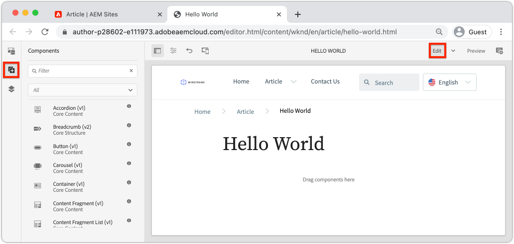
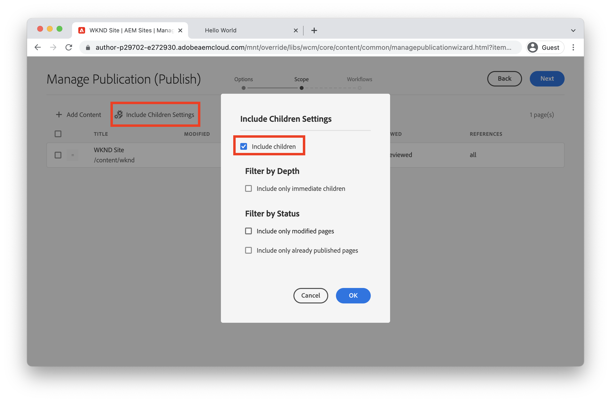

# Inhoud ontwerpen en wijzigingen publiceren {#author-content-publish}

>[!CAUTION]
>
> De functies voor snel maken van sites die hier worden getoond, worden in de tweede helft van 2021 gepubliceerd. De bijbehorende documentatie is beschikbaar voor voorbeelddoeleinden.

Het is belangrijk om te begrijpen hoe een gebruiker inhoud voor de website zal bijwerken. In dit hoofdstuk nemen we de persoon van een **Content Author** aan en brengen we een aantal redactionele wijzigingen aan in de site die in het vorige hoofdstuk is gegenereerd. Aan het einde van het hoofdstuk publiceren we de wijzigingen om te begrijpen hoe de livesite wordt bijgewerkt.

## Vereisten {#prerequisites}

Dit is een meerdelige zelfstudie en er wordt van uitgegaan dat de stappen in het hoofdstuk [Een site maken](./create-site.md) zijn voltooid.

## Doel {#objective}

1. Begrijp de concepten **Pagina&#39;s** en **Componenten** in AEM Sites.
1. Leer hoe u inhoud van de website kunt bijwerken.
1. Leer hoe u wijzigingen op de livesite publiceert.

## Nieuwe pagina maken {#create-page}

Een website wordt doorgaans opgedeeld in pagina&#39;s en vormt zo een ervaring van meerdere pagina&#39;s. AEM de inhoud van structuren op dezelfde manier. Maak vervolgens een nieuwe pagina voor de site.

1. Meld u aan bij de AEM **Auteur**-service die in het vorige hoofdstuk is gebruikt.
1. Klik in het scherm AEM Start op **Sites** > **WKND Site** > **English** > **Artikel**
1. Klik in de rechterbovenhoek op **Maken** > **Pagina**.

   

   Hiermee wordt de wizard **Pagina maken** weergegeven.

1. Kies de sjabloon **Artikel pagina** en klik **Volgende**.

   Pagina&#39;s in AEM worden gemaakt op basis van een paginasjabloon. Paginasjablonen worden in het hoofdstuk [Paginasjablonen](page-templates.md) gedetailleerder besproken.

1. Voer onder **Eigenschappen** een **Titel** van &quot;Hello World&quot; in.
1. Stel de **Naam** in op `hello-world` en klik op **Maken**.

   

1. Klik in het dialoogvenster op **Openen** om de zojuist gemaakte pagina te openen.

## Auteur een Component {#author-component}

AEM Componenten kunnen worden beschouwd als kleine modulaire bouwstenen van een webpagina. Door UI in logische brokken of Componenten te breken, maakt het het veel gemakkelijker te beheren. Om componenten opnieuw te gebruiken, moeten de componenten configureerbaar zijn. Dit gebeurt via het dialoogvenster van de auteur.

AEM verstrekt een reeks van [de Componenten van de Kern](https://experienceleague.adobe.com/docs/experience-manager-core-components/using/introduction.html) die productie klaar aan gebruik zijn. De **Kerncomponenten** variëren van basiselementen zoals [Tekst](https://experienceleague.adobe.com/docs/experience-manager-core-components/using/components/text.html) en [Afbeelding](https://experienceleague.adobe.com/docs/experience-manager-core-components/using/components/image.html) tot complexere UI-elementen zoals een [Carousel](https://experienceleague.adobe.com/docs/experience-manager-core-components/using/components/carousel.html).

Nu gaan we een aantal componenten schrijven met AEM Pagina-editor.

1. Navigeer naar de pagina **Hello World** die in de vorige oefening is gemaakt.
1. Zorg ervoor dat u in **modus Bewerken** werkt en klik in de linkerzijbalk op het pictogram **Componenten**.

   

   Hiermee wordt de componentbibliotheek geopend en worden de beschikbare componenten weergegeven die op de pagina kunnen worden gebruikt.

1. Schuif omlaag en **Drag+Drop** a **Text (v2)** component op aan het belangrijkste editable gebied van de pagina.

   

1. Klik op de **component Text** om te markeren en klik vervolgens op het **moersleutelpictogram  om het dialoogvenster van de component te openen.** Voer tekst in en sla de wijzigingen op in het dialoogvenster.

   

   De **component Text** zou de rijke tekst op de pagina nu moeten tonen.

1. Herhaal de bovenstaande stappen, behalve dat u een exemplaar van de component **Image(v2)** naar de pagina sleept. Open het dialoogvenster van de component **Image**.

1. Schakel in het linkerspoor over naar **Asset finder** door op het pictogram **Assets**  te klikken.
1. **Sleep en** sleep de afbeelding naar het dialoogvenster van de component en klik  **** op Geen om de wijzigingen op te slaan.

   

1. Merk op dat er componenten op de pagina, zoals **Title**, **Navigation**, **Search** zijn die vast zijn. Deze gebieden zijn geconfigureerd als onderdeel van het paginasjabloon en kunnen niet worden gewijzigd op een afzonderlijke pagina. Dit zal meer in het volgende hoofdstuk worden onderzocht.

Voel u vrij om te experimenteren met enkele andere componenten. Documentatie over elke [Core-component vindt u hier](https://experienceleague.adobe.com/docs/experience-manager-core-components/using/introduction.html). Hier vindt u een gedetailleerde videoreeks over [Pagina-authoring.](https://experienceleague.adobe.com/docs/experience-manager-learn/sites/page-authoring/aem-sites-authoring-overview.html)

## Updates publiceren {#publish-updates}

AEM omgevingen worden gesplitst tussen een **Auteur-service** en een **Publish-service**. In dit hoofdstuk hebben we verschillende wijzigingen aangebracht aan de site op de **Auteursservice**. Bezoekers van de site kunnen de wijzigingen bekijken die we nodig hebben om ze te publiceren naar **Service publiceren**.

*Stroominhoud op hoog niveau van auteur naar publicatie*

**1.** Inhoudsauteurs maken updates van de site-inhoud. De updates kunnen worden voorvertoond, gecontroleerd en goedgekeurd om live te worden gezet.

**2.** Inhoud wordt gepubliceerd. Publicatie kan op aanvraag worden uitgevoerd of voor een toekomstige datum worden gepland.

**3.** De bezoekers van de site zien de wijzigingen die worden weerspiegeld in de service Publiceren.

### Wijzigingen publiceren

Laten we nu de wijzigingen publiceren.

1. Navigeer in het scherm AEM Start naar **Sites** en selecteer **WKND Site**.
1. Klik **Publicatie beheren** in de menubar.

   

   Aangezien dit een gloednieuwe site is, willen we alle pagina&#39;s publiceren en kunnen we met de wizard Publicatie beheren precies bepalen wat er moet worden gepubliceerd.

1. Onder **Opties** verlaat de standaardinstellingen aan **Publish** en plant het voor **Now**. Klik op **Next**.
1. Selecteer onder **Bereik** de **WKND-site** en klik **Inclusief onderliggende items**. Schakel in het dialoogvenster alle vakken uit. We willen de volledige site publiceren.

   

1. Klik op de knop **Gepubliceerde verwijzingen**. Controleer in het dialoogvenster of alles is gecontroleerd. Dit omvat de **Basic AEM Sjabloon site** en diverse configuraties die zijn gegenereerd door het Sjabloon Site. Klik **Done** om bij te werken.

   

1. Klik tot slot **Publish** in de hogere juiste hoek om de inhoud te publiceren.

## Gepubliceerde inhoud {#publish} weergeven

Navigeer vervolgens naar de service Publiceren om de wijzigingen weer te geven.

1. U kunt de URL van de publicatieservice eenvoudig ophalen door de auteur-URL te kopiëren en het woord `author` te vervangen door `publish`. Bijvoorbeeld:

   * **URL**  auteur-  `https://author-pYYYY-eXXXX.adobeaemcloud.com/`
   * **URL**  publiceren-  `https://publish-pYYYY-eXXXX.adobeaemcloud.com/`

1. Voeg `/content/wknd.html` aan Publish URL toe zodat definitieve URL als kijkt: `https://publish-pYYYY-eXXXX.adobeaemcloud.com/content/wknd.html`.

   >[!NOTE]
   >
   > Wijzig `wknd.html` om deze aan te passen aan de naam van uw site als u een unieke naam hebt opgegeven tijdens het maken van [sites.](create-site.md)

1. Als u naar de publicatie-URL navigeert, wordt de site weergegeven zonder dat de AEM ontwerpfunctionaliteit nodig is.

   

1. Klik in het menu **Navigatie** op **Artikel** > **Hello World** om naar de vroeger gemaakte Hello World-pagina te navigeren.
1. Ga terug naar **AEM Auteur Service** en breng enkele extra inhoudwijzigingen aan in de Pagina-editor.
1. Publiceer deze wijzigingen rechtstreeks vanuit de pagina-editor door te klikken op het pictogram **Pagina-eigenschappen** > **Pagina publiceren**

   

1. Ga terug naar **AEM-publicatieservice** om de wijzigingen weer te geven. U zult waarschijnlijk **niet** onmiddellijk de updates zien. Dit komt omdat de **AEM-publicatieservice** [caching via een Apache-webserver en CDN](https://experienceleague.adobe.com/docs/experience-manager-cloud-service/implementing/content-delivery/caching.html) bevat. Standaard wordt HTML-inhoud gedurende ~5 minuten in cache geplaatst.

1. Als u het cachegeheugen voor test-/foutopsporingsdoeleinden wilt omzeilen, voegt u eenvoudig een queryparameter toe, zoals `?nocache=true`. De URL zou er als `https://publish-pYYYY-eXXXX.adobeaemcloud.com/content/wknd/en/article/hello-world.html?nocache=true` uitzien. Meer informatie over de cachestrategie en de beschikbare configuraties [vindt u hier](https://experienceleague.adobe.com/docs/experience-manager-cloud-service/implementing/content-delivery/overview.html).

1. U kunt de URL naar de publicatieservice ook vinden in Cloud Manager. Navigeer naar **Cloud Manager Program** > **Environment** > **Environment**.

   

   Onder **Omgevingssegmenten** vindt u koppelingen naar de services **Auteur** en **Publiceren**.

## Gefeliciteerd! {#congratulations}

U hebt zojuist wijzigingen in uw AEM-site gemaakt en gepubliceerd.

### Volgende stappen {#next-steps}

Leer hoe u [Paginasjablonen](./page-templates.md) maakt en wijzigt. Begrijp de verhouding tussen een Malplaatje van de Pagina en een Pagina. Leer hoe u beleid van een paginasjabloon configureert voor korrelig beheer en consistentie van merken voor inhoud.  Een goed gestructureerde sjabloon voor artikel van het tijdschrift wordt gemaakt op basis van een model van Adobe XD.
