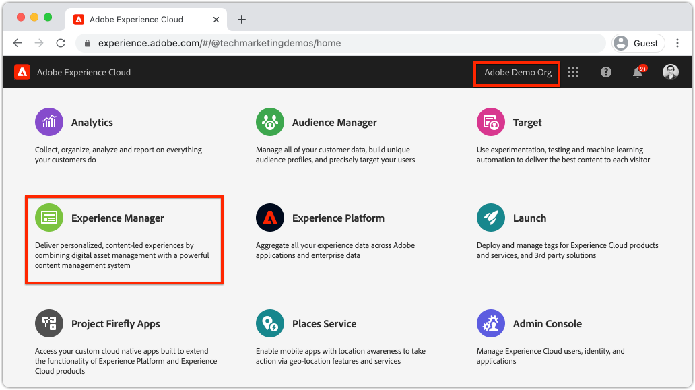
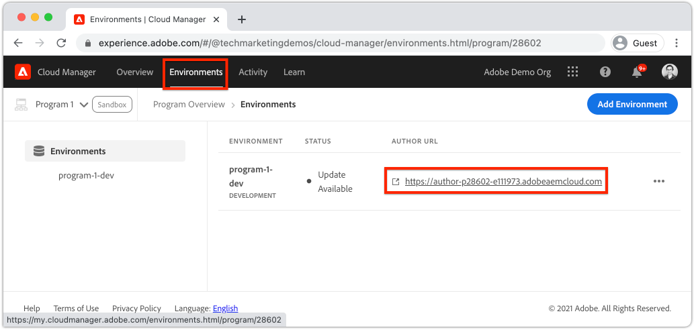
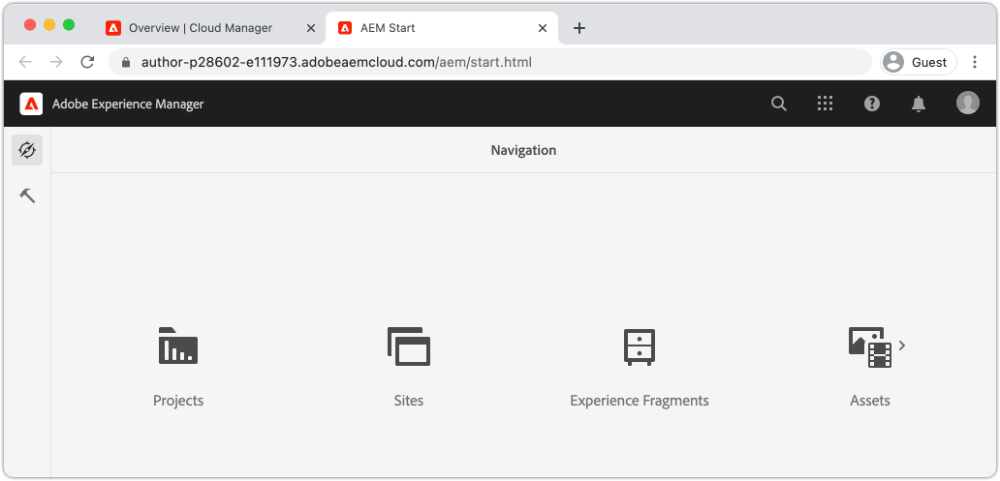
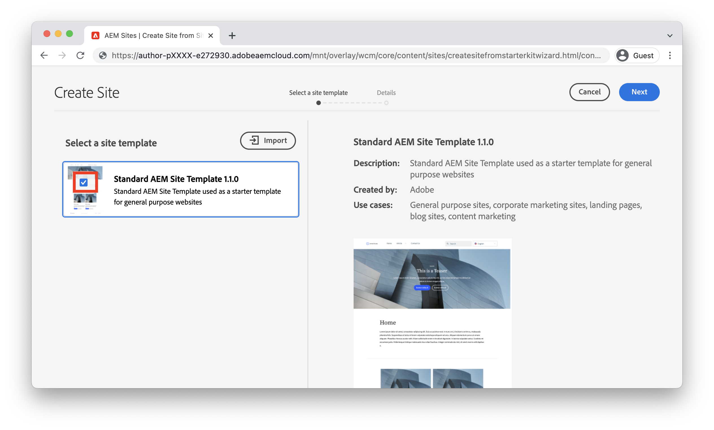
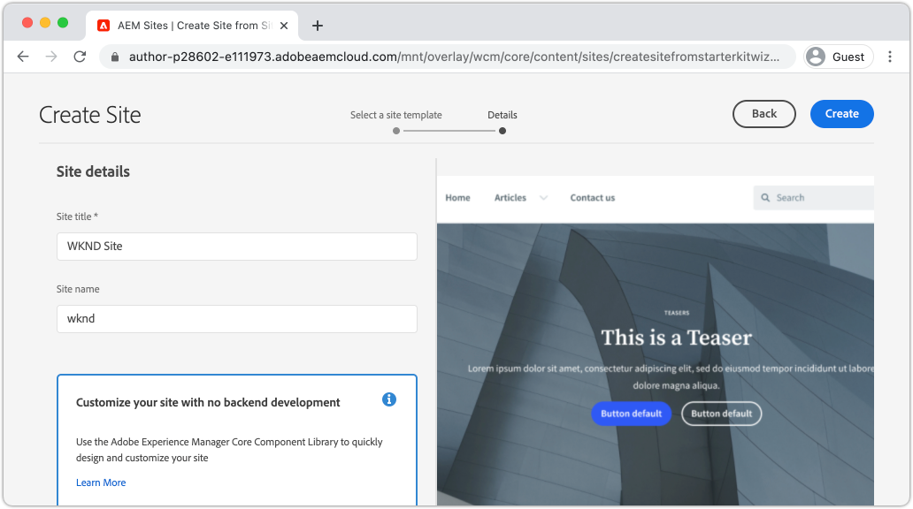

# Een site maken {#create-site}

Als onderdeel van Snel maken kunt u een nieuwe website genereren met de wizard Site maken in Adobe Experience Manager, AEM. De standaardsitesjabloon die door Adobe wordt verschaft, wordt gebruikt als beginpunt voor de nieuwe site.

## Vereisten {#prerequisites}

De stappen in dit hoofdstuk vinden plaats in een Adobe Experience Manager as a Cloud Service-omgeving. Zorg ervoor dat u beheertoegang hebt tot de AEM-omgeving. Het wordt geadviseerd om het programma van de a [ Sandbox ](https://experienceleague.adobe.com/docs/experience-manager-cloud-service/onboarding/getting-access/sandbox-programs/introduction-sandbox-programs.html) en [ Ontwikkeling milieu ](https://experienceleague.adobe.com/docs/experience-manager-cloud-service/implementing/using-cloud-manager/manage-environments.html) te gebruiken wanneer de voltooiing van dit leerprogramma.

[ het programma van de Productie ](https://experienceleague.adobe.com/docs/experience-manager-cloud-service/content/implementing/using-cloud-manager/programs/introduction-production-programs.html) milieu&#39;s kunnen voor dit leerprogramma eveneens worden gebruikt; nochtans, zorg ervoor dat de activiteiten van dit leerprogramma niet het werk zullen beïnvloeden dat op de doelmilieu&#39;s wordt uitgevoerd, aangezien dit leerprogramma inhoud en code aan het milieu van doelAEM opstelt.

[ AEM SDK ](https://experienceleague.adobe.com/docs/experience-manager-learn/cloud-service/local-development-environment-set-up/aem-runtime.html) kan voor delen van dit leerprogramma worden gebruikt. De aspecten van dit leerprogramma die zich op de wolkendiensten baseren, zoals [ opstellend thema&#39;s met Cloud Manager front-end pijpleiding ](https://experienceleague.adobe.com/docs/experience-manager-learn/getting-started-wknd-tutorial-develop/site-template/theming.html), kunnen niet op AEM SDK worden uitgevoerd.

Herzie [ op het instappen documentatie ](https://experienceleague.adobe.com/docs/experience-manager-cloud-service/onboarding/home.html) voor meer details.

## Doelstelling {#objective}

1. Leer hoe u de wizard Site maken kunt gebruiken om een nieuwe site te maken.
1. Begrijp de rol van de Malplaatjes van de Plaats.
1. Ontdek de gegenereerde AEM-site.

## Aanmelden bij Adobe Experience Manager-auteur {#author}

Meld u eerst aan bij uw AEM as a Cloud Service-omgeving. De milieu&#39;s van AEM zijn gespleten tussen de Dienst van de Auteur **en a** publiceren de Dienst **.**

* **Dienst van de Auteur** - waar de plaatsinhoud wordt gecreeerd, wordt geleid en bijgewerkt. Typisch slechts hebben de interne gebruikers toegang tot de **Dienst van de Auteur** en is achter een login scherm.
* **publiceer de Dienst** - gastheren de levende website. Dit is de dienst die de eindgebruikers zullen zien en typisch openbaar beschikbaar zijn.

Een meerderheid van het leerprogramma zal plaatsvinden gebruikend de **Dienst van de Auteur**.

1. Navigeer aan Adobe Experience Cloud [ https://experience.adobe.com/ ](https://experience.adobe.com/). Meld u aan met uw persoonlijke account of een bedrijf-/schoolaccount.
1. Zorg ervoor dat de correcte Organisatie in menu wordt geselecteerd en klik **Experience Manager**.

   

1. Onder **Cloud Manager** klik **Lancering**.
1. Beweeg over het Programma u wenst om het **pictogram van het Programma van Cloud Manager** te gebruiken en te klikken.

   

1. In het hoogste menu klik **Milieu&#39;s** om de provisioned milieu&#39;s te bekijken.

1. Vind het milieu u wenst om **Auteur URL** te gebruiken en te klikken.

   

   >[!NOTE]
   >
   >Het wordt geadviseerd om het milieu van de a **Ontwikkeling** voor dit leerprogramma te gebruiken.

1. Een nieuw lusje wordt gelanceerd aan de Dienst van de Auteur van AEM **&#x200B;**. Klik **Teken binnen met Adobe** en u zou automatisch met de zelfde geloofsbrieven van Experience Cloud moeten worden het programma geopend.

1. Nadat u bent omgeleid en geverifieerd, kunt u nu het AEM-beginscherm weergeven.

   

>[!NOTE]
>
> Heb je problemen met Experience Manager? Herzie [ onboarding documentatie ](https://experienceleague.adobe.com/docs/experience-manager-cloud-service/onboarding/home.html)

## De sjabloon Basissite downloaden

Een Sjabloon voor site biedt een beginpunt voor een nieuwe site. Een Sjabloon van een site bevat enkele basisthema&#39;s, paginasjablonen, configuraties en voorbeeldinhoud. Precies wat in het Sjabloon van de Site is opgenomen, is aan de ontwikkelaar. Adobe verstrekt het Malplaatje van de a **Basis van de Plaats** om nieuwe implementaties te versnellen.

1. Open een nieuw browser lusje en navigeer aan het Basis project van het Malplaatje van de Plaats op GitHub: [ https://github.com/adobe/aem-site-template-standard ](https://github.com/adobe/aem-site-template-standard). Het project is open-sourced en heeft een licentie om door iedereen te worden gebruikt.
1. Klik **Versies** en navigeer aan de [ recentste versie ](https://github.com/adobe/aem-site-template-standard/releases/latest).
1. Breid **Assets** dropdown uit en download het malplaatje zip dossier:

   

   Dit ZIP-bestand wordt gebruikt in de volgende oefening.

   >[!NOTE]
   >
   > Dit leerprogramma wordt geschreven gebruikend versie **1.1.0** van het Basis Malplaatje van de Plaats. Wanneer u een nieuw project voor productiegebruik start, wordt u altijd aangeraden de nieuwste versie te gebruiken.

## Een nieuwe site maken

Daarna, produceer een nieuwe plaats gebruikend het Malplaatje van de Plaats van de vorige oefening.

1. Ga terug naar de AEM-omgeving. Van het scherm van het Begin van AEM navigeert aan **Plaatsen**.
1. In de hogere rechterhoek klik **&#x200B;**&#x200B;> **Plaats (Malplaatje)** creëren. Dit zal omhoog **creëren de Tovenaar van de Plaats** brengen.
1. Onder **selecteer een plaatsmalplaatje** klik de **Invoer** knoop.

   Upload het **.zip** malplaatjedossier dat van de vorige oefening wordt gedownload.

1. Selecteer het **Basis Malplaatje van de Plaats van AEM** en klik **daarna**.

   

1. Onder **Details van de Plaats** > **titel van de Plaats** gaat `WKND Site` binnen.

   In een real-world implementatie zou &quot;Plaats WKND&quot;door de merknaam van uw bedrijf of organisatie worden vervangen. In deze zelfstudie simuleren we het maken van een site voor een fictief levensstijlmerk &quot;WKND&quot;.

1. Onder **naam van de Plaats** gaat `wknd` binnen.

   

   >[!NOTE]
   >
   > Als het gebruiken van een gedeeld milieu van AEM, voeg een uniek herkenningsteken aan de **Naam van de Plaats** toe. Bijvoorbeeld `wknd-site-johndoe` . Dit zal ervoor zorgen dat de veelvoudige gebruikers het zelfde leerprogramma, zonder enige botsingen kunnen voltooien.

1. Klik **creëren** om de Plaats te produceren. Klik **Gedaan** in de **dialoog van het Succes** wanneer AEM het creëren van de website heeft gebeëindigd.

## De nieuwe site verkennen

1. Navigeer naar de AEM Sites-console, als deze nog niet aanwezig is.
1. Een nieuwe **Plaats WKND** is geproduceerd. Dit omvat een sitestructuur met een meertalige hiërarchie.
1. Open de **Engelse** > **3&rbrace; pagina van het Huis door de pagina te selecteren en** te klikken geef **knoop in de menubar uit:**

   

1. Starter-inhoud is al gemaakt en er zijn verschillende componenten beschikbaar die aan een pagina moeten worden toegevoegd. Experimenteer met deze componenten om een idee te krijgen van de functionaliteit. In het volgende hoofdstuk leert u de grondbeginselen van een component.

   

   *inhoud van de Steekproef die door het Malplaatje van de Plaats wordt verstrekt*

## Gefeliciteerd! {#congratulations}

Je hebt zojuist je eerste AEM-site gemaakt.

### Volgende stappen {#next-steps}

Gebruik de redacteur van de Pagina in Adobe Experience Manager, AEM, om inhoud van de plaats in de [ inhoud van de Auteur bij te werken en ](author-content-publish.md) hoofdstuk te publiceren. Leer hoe atoomcomponenten kunnen worden gevormd om inhoud bij te werken. Begrijp het verschil tussen een AEM-auteur- en -publicatieomgeving en leer hoe u updates voor de livesite publiceert.
