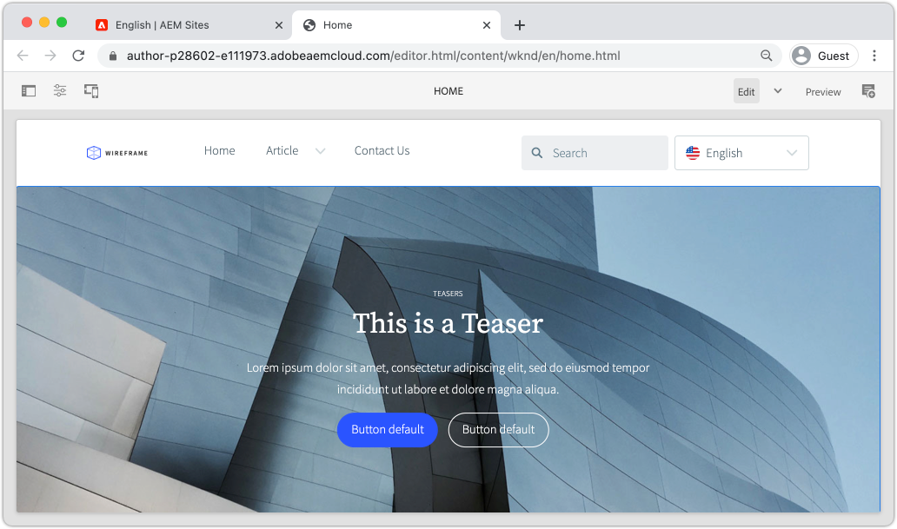

# Een site maken {#create-site}

Als onderdeel van Snel maken kunt u de wizard Site maken in Adobe Experience Manager AEM gebruiken om een nieuwe website te genereren. Het standaardSjabloon voor site dat door Adobe wordt verschaft, wordt gebruikt als beginpunt voor de nieuwe site.

## Vereisten {#prerequisites}

De stappen in dit hoofdstuk vinden plaats in een Adobe Experience Manager as a Cloud Service-omgeving. Zorg ervoor dat u beheertoegang hebt tot de AEM. Het wordt aangeraden een [Sandbox-programma](https://experienceleague.adobe.com/docs/experience-manager-cloud-service/onboarding/getting-access/sandbox-programs/introduction-sandbox-programs.html) en [Ontwikkelingsomgeving](https://experienceleague.adobe.com/docs/experience-manager-cloud-service/implementing/using-cloud-manager/manage-environments.html) als u deze zelfstudie voltooit.

Controleer de [documentatie over instapkaarten](https://experienceleague.adobe.com/docs/experience-manager-cloud-service/onboarding/home.html) voor meer informatie .

## Doelstelling {#objective}

1. Leer hoe u de wizard Site maken kunt gebruiken om een nieuwe site te maken.
1. Begrijp de rol van de Malplaatjes van de Plaats.
1. Ontdek de gegenereerde AEM.

## Aanmelden bij Adobe Experience Manager-auteur {#author}

Als eerste stap, login aan uw AEM as a Cloud Service milieu. AEM omgevingen worden opgesplitst tussen **Auteursservice** en **Service voor publiceren**.

* **Auteursservice** - waar site-inhoud wordt gemaakt, beheerd en bijgewerkt. Doorgaans hebben alleen interne gebruikers toegang tot de **Auteursservice** en bevindt zich achter een aanmeldingsscherm.
* **Service voor publiceren** - host de live website. Dit is de dienst die de eindgebruikers zullen zien en typisch openbaar beschikbaar zijn.

De meeste zelfstudies worden uitgevoerd met de **Auteursservice**.

1. Navigeren naar de Adobe Experience Cloud [https://experience.adobe.com/](https://experience.adobe.com/). Meld u aan met uw persoonlijke account of een bedrijf-/schoolaccount.
1. Zorg ervoor dat de juiste organisatie is geselecteerd in het menu en klik op **Experience Manager**.

   

1. Onder **Cloud Manager** klikken **Starten**.
1. Houd de muisaanwijzer boven het programma dat u wilt gebruiken en klik op de knop **Cloud Manager-programma** pictogram.

   

1. Klik in het bovenste menu op **Omgevingen** om de provisioned omgevingen weer te geven.

1. Zoek de omgeving die u wilt gebruiken en klik op de knop **Auteur-URL**.

   

   >[!NOTE]
   >
   >Het wordt aangeraden een **Ontwikkeling** omgeving voor deze zelfstudie.

1. Er wordt een nieuw tabblad gestart voor de AEM **Auteursservice**. Klikken **Aanmelden met Adobe** en u zou automatisch met de zelfde geloofsbrieven van de Experience Cloud moeten worden aangemeld.

1. Nadat u bent omgeleid en geverifieerd, kunt u nu het AEM startscherm bekijken.

   

>[!NOTE]
>
> Heb je problemen met de toegang tot Experience Manager? Controleer de [documentatie over instapkaarten](https://experienceleague.adobe.com/docs/experience-manager-cloud-service/onboarding/home.html)

## De basissjabloon voor de site downloaden

Een Sjabloon voor site biedt een beginpunt voor een nieuwe site. Een Sjabloon van een site bevat enkele basisthema&#39;s, paginasjablonen, configuraties en voorbeeldinhoud. Precies wat in het Sjabloon van de Site is opgenomen, is aan de ontwikkelaar. Adobe biedt een **Standaardsitemplate** nieuwe implementaties te versnellen.

1. Open een nieuw browser lusje en navigeer aan het Basis project van het Malplaatje van de Plaats op GitHub: [https://github.com/adobe/aem-site-template-standard](https://github.com/adobe/aem-site-template-standard). Het project is open-sourced en heeft een licentie om door iedereen te worden gebruikt.
1. Klikken **Uitstoot** en navigeer naar de [nieuwste release](https://github.com/adobe/aem-site-template-standard/releases/latest).
1. Breid uit **Activa** vervolgkeuzelijst en download het ZIP-bestand voor de sjabloon:

   

   Dit ZIP-bestand wordt gebruikt in de volgende oefening.

   >[!NOTE]
   >
   > Deze zelfstudie is geschreven met een versie **1.1.0.** van de Basic Site Template. Wanneer u een nieuw project voor productiegebruik start, wordt u altijd aangeraden de nieuwste versie te gebruiken.

## Een nieuwe site maken

Daarna, produceer een nieuwe plaats gebruikend het Malplaatje van de Plaats van de vorige oefening.

1. Ga terug naar de AEM. Navigeer van het scherm AEM Start naar **Sites**.
1. Klik in de rechterbovenhoek op **Maken** > **Site (sjabloon)**. Dit zal de **Wizard Site maken**.
1. Onder **Een sitesjabloon selecteren** klik op **Importeren** knop.

   Upload de **.zip** sjabloonbestand dat u uit de vorige exercitie hebt gedownload.

1. Selecteer **Basic AEM Site Template** en klik op **Volgende**.

   

1. Onder **Site-details** > **Titel site** enter `WKND Site`.

   In een real-world implementatie zou &quot;Plaats WKND&quot;door de merknaam van uw bedrijf of organisatie worden vervangen. In deze zelfstudie simuleren we het maken van een site voor een fictief levensstijlmerk &quot;WKND&quot;.

1. Onder **Sitenaam** enter `wknd`.

   

   >[!NOTE]
   >
   > Als u een gedeelde AEM-omgeving gebruikt, voegt u een unieke id toe aan de **Sitenaam**. Bijvoorbeeld `wknd-site-johndoe`. Dit zal ervoor zorgen dat de veelvoudige gebruikers het zelfde leerprogramma, zonder enige botsingen kunnen voltooien.

1. Klikken **Maken** om de site te genereren. Klikken **Gereed** in de **Succes** als AEM het maken van de website heeft voltooid.

## De nieuwe site verkennen

1. Navigeer naar de AEM Sites-console, als deze nog niet aanwezig is.
1. Een nieuwe **WKND-site** is gegenereerd. Dit omvat een sitestructuur met een meertalige hiërarchie.
1. Open de **Engels** > **Home** pagina door de pagina te selecteren en op de **Bewerken** in de menubalk:

   

1. Starter-inhoud is al gemaakt en er zijn verschillende componenten beschikbaar die aan een pagina moeten worden toegevoegd. Experimenteer met deze componenten om een idee te krijgen van de functionaliteit. In het volgende hoofdstuk leert u de grondbeginselen van een component.

   

   *Voorbeeldinhoud van het Sitesjabloon*

## Gefeliciteerd! {#congratulations}

U hebt zojuist uw eerste AEM-site gemaakt.

### Volgende stappen {#next-steps}

Gebruik de pagina-editor in Adobe Experience Manager AEM om de inhoud van de site in de [Inhoud van auteur en publiceren](author-content-publish.md) hoofdstuk Leer hoe atoomcomponenten kunnen worden gevormd om inhoud bij te werken. Begrijp het verschil tussen een auteur AEM en publiceer milieu&#39;s en leer hoe te om updates aan de levende plaats te publiceren.
