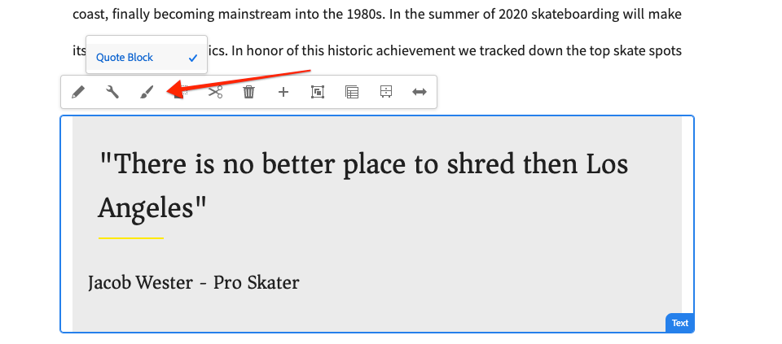

# Ontwikkelen met het Stijlsysteem {#developing-with-the-style-system}

Leer hoe te om individuele stijlen uit te voeren en de Componenten van de Kern te hergebruiken gebruikend het Systeem van de Stijl van de Experience Manager. Deze zelfstudie behandelt het ontwikkelen voor het Systeem van de Stijl om de Componenten van de Kern met merkspecifieke CSS en geavanceerde beleidsconfiguraties van de Redacteur van het Malplaatje uit te breiden.

## Vereisten {#prerequisites}

Controleer de vereiste gereedschappen en instructies voor het instellen van een [lokale ontwikkelomgeving](overview.md#local-dev-environment).

Het wordt ook geadviseerd om de [cliënt-zijBibliotheken en het Voorste-eind](client-side-libraries.md) leerprogramma van het Werkschema te herzien om de grondbeginselen van cliënt-zijbibliotheken en de diverse front-end hulpmiddelen te begrijpen die in het AEM project worden gebouwd.

### Starter-project

Bekijk de basislijncode waarop de zelfstudie is gebaseerd:

1. Clone the [github.com/adobe/aem-guides-wknd](https://github.com/adobe/aem-guides-wknd) repository.
1. De `style-system/start` vertakking uitchecken

   ```shell
   $ git clone git@github.com:adobe/aem-guides-wknd.git ~/code/aem-guides-wknd
   $ cd ~/code/aem-guides-wknd
   $ git checkout style-system/start
   ```

1. Stel codebasis aan een lokale AEM instantie op gebruikend uw Maven vaardigheden:

   ```shell
   $ cd ~/code/aem-guides-wknd
   $ mvn clean install -PautoInstallSinglePackage
   ```

U kunt de gebeëindigde code op [GitHub](https://github.com/adobe/aem-guides-wknd/tree/style-system/solution) altijd bekijken of de code plaatselijk controleren door aan de tak te schakelen `style-system/solution`.

## Doelstelling

1. Begrijp hoe te om het Systeem van de Stijl te gebruiken om merkspecifieke CSS op AEM Componenten van de Kern toe te passen.
1. Leer meer over BEM-notatie en hoe u deze kunt gebruiken om stijlen zorgvuldig in bereik te brengen.
1. Geavanceerde beleidsconfiguraties toepassen met bewerkbare sjablonen.

## Wat u gaat maken {#what-you-will-build}

In dit hoofdstuk gebruiken wij de eigenschap [van het Systeem van de](https://docs.adobe.com/content/help/en/experience-manager-learn/sites/page-authoring/style-system-feature-video-use.html) Stijl om verscheidene variaties van componenten tot stand te brengen die op de pagina van het Artikel worden gebruikt. Met het Stijlsysteem kunt u ook variaties maken voor structuurelementen zoals Koptekst/Voettekst en Container layout.

>[!VIDEO](https://video.tv.adobe.com/v/30386/?quality=12&learn=on)

## Achtergrond {#background}

Met het [Stijlsysteem](https://docs.adobe.com/content/help/en/experience-manager-65/developing/components/style-system.html) kunnen ontwikkelaars en sjablooneditors meerdere visuele variaties van een component maken. Auteurs kunnen vervolgens bepalen welke stijl moet worden gebruikt bij het samenstellen van een pagina. Tijdens de rest van de zelfstudie gebruiken we het Stijlsysteem om verschillende unieke stijlen te maken en tegelijk gebruik te maken van Core Components in een aanpak met lage code.

Het algemene idee met het Stijlsysteem is dat ontwerpers verschillende stijlen kunnen kiezen van hoe een component eruit moet zien. De &quot;stijlen&quot; worden ondersteund door extra CSS-klassen die in de buitenste div van een component worden geïnjecteerd. In de clientbibliotheken worden CSS-regels toegevoegd op basis van deze stijlklassen, zodat de vormgeving van de component verandert.

Hier [vindt u](https://docs.adobe.com/content/help/en/experience-manager-65/developing/components/style-system.html)gedetailleerde documentatie voor het Stijlsysteem. Er is ook een geweldige [technische video voor het begrijpen van het Stijlsysteem](https://docs.adobe.com/content/help/en/experience-manager-learn/sites/developing/style-system-technical-video-understand.html).

## Stijl van component Title {#title-component}

Op dit punt is de component [](https://docs.adobe.com/content/help/en/experience-manager-core-components/using/components/title.html) Title uitgebreid naar het project onder `/apps/wknd/components/content/title` als onderdeel van de module **ui.apps** . De standaardstijlen van Kop-elementen (`H1`, `H2`, `H3`...) zijn al geïmplementeerd in de module **ui.frontend** in het `_elements.scss` bestand `ui.frontend/src/main/webpack/base/sass/_elements.scss`.

### Onderstrepingsstijl

De [WKND-artikelontwerpen](assets/pages-templates/wknd-article-design.xd) bevatten een unieke stijl voor de component Title met een onderstreping. In plaats van twee componenten te maken of het dialoogvenster van de component te wijzigen, kunt u het Stijlsysteem gebruiken om auteurs de optie toe te staan een onderstrepingsstijl toe te voegen.


### Opmaak Inspect-titelcomponent

Als front-end ontwikkelaar is de eerste stap aan het stileren van een Component van de Kern de prijsverhoging te begrijpen die door de component wordt geproduceerd.

Als deel van het geproduceerde project, het archetype ingebedde project van de Voorbeelden **van de Component van de** Kern. Voor ontwikkelaars en makers van inhoud bevat dit een eenvoudige referentie die inzicht biedt in alle functies die beschikbaar zijn met Core Components. Er is ook een live versie [beschikbaar](https://opensource.adobe.com/aem-core-wcm-components/library.html).

1. Open een nieuwe browser en bekijk de component Titel:

   Lokale AEM: [http://localhost:4502/editor.html/content/core-components-examples/library/title.html](http://localhost:4502/editor.html/content/core-components-examples/library/title.html)

   Live voorbeeld: [https://opensource.adobe.com/aem-core-wcm-components/library/title.html](https://opensource.adobe.com/aem-core-wcm-components/library/title.html)

1. Hieronder ziet u de markering voor de component Title:

   ```html
   <div class="cmp-title">
       <h1 class="cmp-title__text">Lorem Ipsum</h1>
   </div>
   ```

   De BEM-notatie van de component Title:

   ```plain
   BLOCK cmp-title
       ELEMENT cmp-title__text
   ```

1. Het Stijlsysteem voegt een CSS-klasse toe aan de buitenste div rondom de component. Daarom zal de prijsverhoging die wij zullen richten op iets als het volgende lijken:

   ```html
   <div class="STYLE-SYSTEM-CLASS-HERE"> <!-- Custom CSS class - implementation gets to define this -->
       <div class="cmp-title">
           <h1 class="cmp-title__text">Lorem Ipsum</h1>
       </div>
   </div>
   ```

### Implementeer de onderstrepingsstijl - ui.frontend

Vervolgens implementeren we de onderstrepingsstijl met behulp van de module **ui.frontend** van ons project. We gebruiken de ontwikkelserver voor webpakketten die is meegeleverd bij de module **ui.frontend** om een voorvertoning van de stijlen weer te geven *voordat* u deze implementeert naar een lokale versie van AEM.

1. Start de webpack-ontwikkelserver met de volgende opdracht vanuit de module **ui.frontend** :

   ```shell
   $ cd ~/code/aem-guides-wknd/ui.frontend/
   $ npm start
   
   > aem-maven-archetype@1.0.0 start code/aem-guides-wknd/ui.frontend
   > webpack-dev-server --open --config ./webpack.dev.js
   ```

   Hiermee opent u een browser op [http://localhost:8080](http://localhost:8080).

   >[!NOTE]
   >
   > Als de beelden gebroken lijken, zorg ervoor dat het starterproject aan een lokaal geval van AEM (lopend op haven 4502) is opgesteld en browser gebruikt ook in de lokale AEM instantie heeft het programma geopend.

   

1. Open het bestand in Eclipse of de IDE van uw keuze `index.html` op: `ui.frontend/src/main/webpack/static/index.html`. Dit is de statische prijsverhoging die door de webpack ontwikkelingsserver wordt gebruikt.
1. Zoek in `index.html` het document naar een instantie van de component Title waaraan u de onderstrepingsstijl wilt toevoegen door te zoeken naar *cmp-title*. Kies de component van de Titel met de tekst *&quot;Vans van het Vuurspark van de muur&quot;* (lijn 218). Voeg de klasse toe `cmp-title--underline` aan de omringende div:

   ```html
    <!-- before -->
    <div class="title aem-GridColumn aem-GridColumn--default--8">
        <div class="cmp-title">
            <h2 class="cmp-title__text">Vans off the Wall Skatepark</h2>
        </div>
    </div>
   ```

   ```html
    <!-- After -->
    <div class="cmp-title--underline title aem-GridColumn aem-GridColumn--default--8">
        <div class="cmp-title">
            <h2 class="cmp-title__text">Vans off the Wall Skatepark</h2>
        </div>
    </div>
   ```

1. Ga terug naar de browser en controleer of de extra klasse wordt weerspiegeld in de markering.
1. Ga terug naar de module **ui.frontend** en werk het bestand bij `title.scss` in: `ui.frontend/src/main/webpack/components/content/title/scss/title.scss`:

   ```css
   /* Add Title Underline Style */
   .cmp-title--underline {
   
       .cmp-title {
       }
   
       .cmp-title__text {
           &:after {
           display: block;
               width: 84px;
               padding-top: 8px;
               content: '';
               border-bottom: 2px solid $brand-primary;
           }
       }
   }
   ```

   >[!NOTE]
   >
   >Het wordt beschouwd als beste praktijken om werkingsgebiedstijlen aan de doelcomponent altijd strak te maken. Dit zorgt ervoor dat extra stijlen andere gebieden van de pagina niet beïnvloeden.
   >
   >Alle kerncomponenten voldoen aan de **[BEM-notatie](https://github.com/adobe/aem-core-wcm-components/wiki/css-coding-conventions)**. Het wordt aanbevolen de buitenste CSS-klasse als doel in te stellen wanneer u een standaardstijl voor een component maakt. Een andere beste manier is om klassennamen te richten die door de aantekening van de Component BEM van de Kern eerder dan de elementen van HTML worden gespecificeerd.

1. Keer opnieuw naar browser en u zou de onderstreepte stijl moeten zien worden toegevoegd:

   

1. Stop de webpack-ontwikkelingsserver.

### Titelbeleid toevoegen

Vervolgens moet een nieuw beleid voor de componenten Titel worden toegevoegd, zodat de auteurs van de inhoud de stijl Onderstrepen kunnen kiezen en op specifieke componenten kunnen toepassen. Dit wordt gedaan gebruikend de Redacteur van het Malplaatje binnen AEM.

1. Stel codebasis aan een lokale AEM instantie op gebruikend uw Maven vaardigheden:

   ```shell
   $ cd ~/code/aem-guides-wknd
   $ mvn clean install -PautoInstallSinglePackage
   ```

1. Navigeer naar de sjabloon voor **artikelpagina** op: [http://localhost:4502/editor.html/conf/wknd/settings/wcm/templates/article-page-template/structure.html](http://localhost:4502/editor.html/conf/wknd/settings/wcm/templates/article-page-template/structure.html).

1. In de modus **Structuur** selecteert u in de **container** van de hoofdlayout het pictogram **Beleid** naast de component **Titel** onder *Toegestane componenten*:

   

1. Maak een nieuw beleid voor de component Title met de volgende waarden:

   *Beleidstitel **: **WKND-titel**

   *Eigenschappen* > tabblad *Stijlen* > Een nieuwe stijl *toevoegen*

   **Onderstrepen** : `cmp-title--underline`

   

   Klik op **Gereed** om de wijzigingen in het titelbeleid op te slaan.

   >[!NOTE]
   >
   > De waarde komt overeen met de CSS-klasse die we eerder als doel hadden tijdens het ontwikkelen in de module `cmp-title--underline` ui.frontend **** .

### De stijl Onderstrepen toepassen

Tot slot kunnen wij als auteur ervoor kiezen om de onderstrepingsstijl toe te passen op bepaalde componenten van de Titel.

1. Navigeer naar het artikel **La Skateparks** in de AEM Sites-editor op: [http://localhost:4502/editor.html/content/wknd/us/en/magazine/guide-la-skateparks.html](http://localhost:4502/editor.html/content/wknd/us/en/magazine/guide-la-skateparks.html)
1. Kies in de modus **Bewerken** een component Titel. Klik op het pictogram van het **penseel** en selecteer de stijl **Onderstrepen** :

   

   Als auteur moet u de stijl in- en uitschakelen.

1. Klik op het pictogram **Pagina-informatie** > **Weergeven als gepubliceerd** om de pagina buiten AEM editor te inspecteren.

   

   Gebruik de browsergereedschappen om te controleren of de markering rondom de component Title de CSS-klasse heeft `cmp-title--underline` toegepast op de buitenste div.

## Stijl van tekstcomponent {#text-component}

Vervolgens worden vergelijkbare stappen herhaald om een unieke stijl toe te passen op de [tekstcomponent](https://docs.adobe.com/content/help/en/experience-manager-core-components/using/components/text.html). De component Text is uitgebreid naar het project onder `/apps/wknd/components/content/text` als onderdeel van de module **ui.apps** . De standaardstijlen van alinea-elementen zijn al geïmplementeerd in de module **ui.frontend** in het `_elements.scss` bestand `ui.frontend/src/main/webpack/base/sass/_elements.scss`.

### Stijl prijsblok

Het [WKND-artikelontwerp](assets/pages-templates/wknd-article-design.xd) bevat een unieke stijl voor de component Text met een aanhalingsteken:


### Markeringen Inspect-tekstcomponent

Opnieuw inspecteren we de opmaak van de component Text.

1. Open een nieuwe browser en bekijk de component Text als onderdeel van de Core Component Library:
Lokale AEM: [http://localhost:4502/editor.html/content/core-components-examples/library/text.html](http://localhost:4502/editor.html/content/core-components-examples/library/text.html)

   Live voorbeeld: [https://opensource.adobe.com/aem-core-wcm-components/library/text.html](https://opensource.adobe.com/aem-core-wcm-components/library/text.html)

1. Hieronder ziet u de markering voor de component Text:

   ```html
   <div class="cmp-text">
       <p><b>Bold </b>can be used to emphasize a word or phrase, as can <u>underline</u> and <i>italics.&nbsp;</i><sup>Superscript</sup> and <sub>subscript</sub> are useful for mathematical (E = mc<sup>2</sup>) or scientific (h<sub>2</sub>O) expressions. Paragraph styles can provide alternative renderings, such as quote sections:</p>
       <blockquote>"<i>Be yourself; everyone else is already taken"</i></blockquote>
       <b>- Oscar Wilde</b>
   </div>
   ```

   De BEM-notatie van de component Title:

   ```plain
   BLOCK cmp-text
       ELEMENT
   ```

1. Het Stijlsysteem voegt een CSS-klasse toe aan de buitenste div rondom de component. Daarom zal de prijsverhoging die wij zullen richten op iets als het volgende lijken:

   ```html
   <div class="STYLE-SYSTEM-CLASS-HERE"> <!-- Custom CSS class - implementation gets to define this -->
       <div class="cmp-text">
           <p><b>Bold </b>can be used to emphasize a word or phrase, as can <u>underline</u> and <i>italics.&nbsp;</i><sup>Superscript</sup> and <sub>subscript</sub> are useful for mathematical (E = mc<sup>2</sup>) or scientific (h<sub>2</sub>O) expressions. Paragraph styles can provide alternative renderings, such as quote sections:</p>
           <blockquote>"<i>Be yourself; everyone else is already taken"</i></blockquote>
           <b>- Oscar Wilde</b>
       </div>
   </div>
   ```

### Implementeer de stijl voor het aanhalingsteken - ui.frontend

Daarna zullen wij de stijl van het Blok van het Citaat uitvoeren gebruikend de module **ui.frontend** van ons project.

1. Start de webpack-ontwikkelserver met de volgende opdracht vanuit de module **ui.frontend** :

   ```shell
   $ cd ~/code/aem-guides-wknd/ui.frontend/
   $ npm start
   
   > aem-maven-archetype@1.0.0 start code/aem-guides-wknd/ui.frontend
   > webpack-dev-server --open --config ./webpack.dev.js
   ```

1. Open het bestand in Eclipse of de IDE van uw keuze `index.html` op: `ui.frontend/src/main/webpack/static/index.html`. Dit is de statische prijsverhoging die door de webpack ontwikkelingsserver wordt gebruikt.
1. Zoek in `index.html` een instantie van de tekstcomponent naar de tekst *&quot;Jacob Wester&quot;* (regel 210). Voeg de klasse toe `cmp-text--quote` aan de omringende div:

   ```html
    <!-- before -->
    <div class="text aem-GridColumn aem-GridColumn--default--8">
        <div class="cmp-text">
            <blockquote>"There is no better place to shred then Los Angeles"</blockquote>
            <p>Jacob Wester - Pro Skater</p>
        </div>
    </div>
   ```

   ```html
    <!-- After -->
    <div class="cmp-text--quote text aem-GridColumn aem-GridColumn--default--8">
        <div class="cmp-text">
            <blockquote>"There is no better place to shred then Los Angeles"</blockquote>
            <p>Jacob Wester - Pro Skater</p>
        </div>
    </div>
   ```

1. Ga terug naar de browser en controleer of de extra klasse wordt weerspiegeld in de markering.
1. Ga terug naar de module **ui.frontend** en werk het bestand bij `text.scss` in: `ui.frontend/src/main/webpack/components/content/text/scss/text.scss`:

   ```css
   /* WKND Text Quote style */
   
   .cmp-text--quote {
   
       .cmp-text {
           background-color: $brand-third;
           margin: 1em 0em;
           padding: 1em;
   
           blockquote {
               border: none;
               font-size: $font-size-h2;
               font-family: $font-family-serif;
               padding: 14px 14px;
               margin: 0;
               margin-bottom: 0.5em;
   
               &:after {
                   border-bottom: 2px solid $brand-primary; /*yellow border */
                   content: '';
                   display: block;
                   position: relative;
                   top: 0.25em;
                   width: 80px;
               }
           }
   
           p {
               font-size:    $font-size-large;
               font-family:  $font-family-serif;
           }
       }
   }
   ```

   >[!CAUTION]
   >
   > In dit geval worden onbewerkte HTML-elementen bepaald door de stijlen. De reden hiervoor is dat de component Text een Rich Text Editor biedt voor inhoudsauteurs. Het rechtstreeks maken van stijlen tegen RTE-inhoud moet met de nodige voorzichtigheid gebeuren en het is nog belangrijker om de stijlen strak uit te breiden.

1. Keer opnieuw naar browser en u zou de toegevoegde het blokstijl van het Citaat moeten zien:

   

1. Stop de webpack-ontwikkelingsserver.

### Tekstbeleid toevoegen

Voeg vervolgens een nieuw beleid toe voor de tekstcomponenten.

1. Stel codebasis aan een lokale AEM instantie op gebruikend uw Maven vaardigheden:

   ```shell
   $ cd ~/code/aem-guides-wknd
   $ mvn clean install -PautoInstallSinglePackage
   ```

1. Navigeer naar de sjabloon voor **artikelpagina** op: [http://localhost:4502/editor.html/conf/wknd/settings/wcm/templates/article-page-template/structure.html](http://localhost:4502/editor.html/conf/wknd/settings/wcm/templates/article-page-template/structure.html).

1. Selecteer in de modus **Structuur** in de **container** van de hoofdlayout het pictogram **Beleid** naast de **component Text** die onder *Toegestane componenten* wordt weergegeven:

   

1. Maak een nieuw beleid voor de component Text met de volgende waarden:

   *Beleidstitel **: **WKND-tekst**

   *Insteekmodules* > *Alineastijlen* > Alineastijlen *inschakelen*

   *Tabblad* Stijlen > *Een nieuwe stijl toevoegen*

   **Offerteblok** : `cmp-text--quote`

   

   

   Klik op **Gereed** om de wijzigingen in het tekstbeleid op te slaan.

### De stijl voor het aanhalingsteken toepassen

1. Navigeer naar het artikel **La Skateparks** in de AEM Sites-editor op: [http://localhost:4502/editor.html/content/wknd/us/en/magazine/guide-la-skateparks.html](http://localhost:4502/editor.html/content/wknd/us/en/magazine/guide-la-skateparks.html)
1. Kies in de modus **Bewerken** een tekstcomponent. Bewerk de component om een aanhalingsteken te plaatsen:

   

1. Selecteer de tekstcomponent, klik op het pictogram van het **penseel** en selecteer de stijl van het Blok **van het** Citaat:

   

   Als auteur moet u de stijl in- en uitschakelen.

## Layout Container {#layout-container}

Layoutcontainers zijn gebruikt om de basisstructuur van het sjabloon voor artikelpagina te maken en om de neerzetzones voor auteurs van inhoud te bieden om inhoud aan een pagina toe te voegen. Layoutcontainers kunnen ook gebruikmaken van het Stijlsysteem, zodat de auteur van inhoud nog meer opties heeft voor het ontwerpen van lay-outs.

Momenteel wordt een CSS-regel toegepast op de gehele pagina die een vaste breedte afdwingt. In plaats daarvan is het flexibeler om een stijl met een **vaste breedte** te maken die de auteur van de inhoud kan in- en uitschakelen.

### De stijl Vaste breedte implementeren - ui.frontend

We gaan de stijl Vaste breedte implementeren in de module **ui.frontend** van ons project.

1. Start de webpack-ontwikkelserver met de volgende opdracht vanuit de module **ui.frontend** :

   ```shell
   $ cd ~/code/aem-guides-wknd/ui.frontend/
   $ npm start
   ```

1. Open het bestand `index.html` op: `ui.frontend/src/main/webpack/static/index.html`.
1. We willen het hoofdgedeelte van het sjabloon voor artikelpagina een vaste breedte geven, zodat de koptekst en voettekst breder kunnen worden. Daarom willen wij de tweede `<div class='responsivegrid aem-GridColumn aem-GridColumn--default--12'` (container van de Lay-out) in tussen de twee ervaringsfragmenten richten (lijn 136)

   

1. Voeg de klasse toe `cmp-layout-container--fixed` aan de `div` klasse die in de vorige stap is geïdentificeerd.

   ```html
   <!-- Experience Fragment Header -->
   <div class="experiencefragment aem-GridColumn aem-GridColumn--default--12">
       ...
   </div>
   <!-- Main body Layout Container -->
   <div class="responsivegrid cmp-layout-container--fixed aem-GridColumn aem-GridColumn--default--12">
       ...
   </div>
   <!-- Experience Fragment Footer -->
   <div class="experiencefragment aem-GridColumn aem-GridColumn--default--12">
       ...
   </div>
   ```

1. Werk het bestand bij `container.scss` op: `ui.frontend/src/main/webpack/components/content/container/scss/container.scss`:

   ```css
   /* WKND Layout Container - Fixed Width */
   
   .cmp-layout-container--fixed {
       @media (min-width: $screen-medium + 1) {
           display:block;
           max-width:  $max-width !important;
           float: unset !important;
           margin: 0 auto !important;
           padding: 0 $gutter-padding;
           clear: both !important;
       }
   }
   ```

1. Werk het bestand bij `_elements.scss` op: `ui.frontend/src/main/webpack/base/sass/_elements.scss` en wijzig de `.root` regel zodat een nieuwe maximumbreedte wordt ingesteld op de variabele `$max-body-width`.

   ```css
    /* Before */
    body {
        ...
   
        .root {
            max-width: $max-width;
            margin: 0 auto;
            padding-top: 12px;
        }
    }
   ```

   ```css
    /* After */
    body {
        ...
   
        .root {
            max-width: $max-body-width;
            margin: 0 auto;
            padding-top: 12px;
        }
    }
   ```

   >[!NOTE]
   >
   > De volledige lijst van variabelen en waarden is te vinden op: `ui.frontend/src/main/webpack/base/sass/_variables.scss`.

1. Als u terugkeert naar de browser, ziet u dat de hoofdinhoud van de pagina er hetzelfde uitziet, maar dat de koptekst en voettekst veel breder worden uitgerekt. Dit wordt verwacht.

   

### Het containerbeleid voor lay-out bijwerken

Vervolgens voegen we de stijl Vaste breedte toe door het beleid voor de container van de layout in AEM bij te werken.

1. Stel codebasis aan een lokale AEM instantie op gebruikend uw Maven vaardigheden:

   ```shell
   $ cd ~/code/aem-guides-wknd
   $ mvn clean install -PautoInstallSinglePackage
   ```

1. Navigeer naar de sjabloon voor **artikelpagina** op: [http://localhost:4502/editor.html/conf/wknd/settings/wcm/templates/article-page-template/structure.html](http://localhost:4502/editor.html/conf/wknd/settings/wcm/templates/article-page-template/structure.html).

1. Selecteer in de modus **Structuur** de hoofdcontainer **voor** lay-out (tussen de koptekst en voettekst van het fragment van de ervaring) en selecteer het pictogram **Beleid** .

   

1. Werk het standaardbeleid voor **WKND-site** bij en voeg een extra stijl voor **Vaste breedte** toe met de waarde `cmp-layout-container--fixed`:

   

   Sla uw wijzigingen op en verwijs naar de pagina Sjabloon artikelpagina.

1. Selecteer opnieuw de hoofdcontainer voor **lay-out** (tussen de koptekst en voettekst van het fragment van de ervaring). Dit keer wordt het **pictogram van het penseel** weergegeven en kunt u **Vaste breedte** selecteren in de vervolgkeuzelijst Stijl.

   

   U moet de stijlen in- en uitschakelen.

1. Navigeer naar het artikel **La Skateparks** in de AEM Sites-editor op: [http://localhost:4502/editor.html/content/wknd/us/en/magazine/guide-la-skateparks.html](http://localhost:4502/editor.html/content/wknd/us/en/magazine/guide-la-skateparks.html). De container met vaste breedte moet in actie worden gebracht.

## Koptekst/voettekst - Ervaar fragment {#experience-fragment}

Vervolgens voegen we stijlen toe aan de koptekst en voettekst om de sjabloon voor artikelpagina te voltooien. Zowel zijn de Kopbal als de Voettekst uitgevoerd als Fragment van de Ervaring, dat een groepering van componenten binnen een container is. We kunnen een unieke CSS-klasse toepassen op Experience Fragment-componenten, net als andere Core Components-componenten met het Stijlsysteem.

### De koptekststijl implementeren - ui.frontend

De componenten in de component Header zijn al zo opgemaakt dat ze overeenkomen met de [AdobeXD-ontwerpen](assets/pages-templates/wknd-article-design.xd). Er zijn slechts enkele kleine wijzigingen in de layout nodig.

1. Start de webpack-ontwikkelserver met de volgende opdracht vanuit de module **ui.frontend** :

   ```shell
   $ cd ~/code/aem-guides-wknd/ui.frontend/
   $ npm start
   ```

1. Open het bestand `index.html` op: `ui.frontend/src/main/webpack/static/index.html`.
1. Zoek de **eerste** instantie van de component Experience Fragment naar *class=&quot;experience* (regel 48).
1. Voeg de klasse toe `cmp-experiencefragment--header` aan de `div` klasse die in de vorige stap is geïdentificeerd.

   ```html
       ...
       <div class="root responsivegrid">
           <div class="aem-Grid aem-Grid--12 aem-Grid--default--12 ">
   
           <!-- add cmp-experiencefragment--header -->
           <div class="experiencefragment cmp-experiencefragment--header aem-GridColumn aem-GridColumn--default--12">
               ...
   ```

1. Open het bestand `experiencefragment.scss` op: `ui.frontend/src/main/webpack/components/content/experiencefragment/scss/experiencefragment.scss`. Voeg de volgende stijlen toe aan het bestand:

   ```css
   /* Header Style */
   .cmp-experiencefragment--header {
   
       .cmp-experiencefragment {
           max-width: $max-width;
           margin: 0 auto;
       }
   
       /* Logo Image */
       .cmp-image__image {
           max-width: 8rem;
           margin-top: $gutter-padding / 2;
           margin-bottom: $gutter-padding / 2;
       }
   
       @media (max-width: $screen-medium) {
   
           .cmp-experiencefragment {
               padding-top: 1rem;
               padding-bottom: 1rem;
           }
           /* Logo Image */
           .cmp-image__image {
               max-width: 6rem;
               margin-top: .75rem;
           }
       }
   }
   ```

   >[!CAUTION]
   >
   > We gebruiken hier een sneltoets om het logo in de koptekst op te maken. Het logo is eigenlijk slechts een afbeeldingscomponent die zich toevallig in het ervaringsfragment bevindt. Laten we later zeggen dat we een andere afbeelding aan de koptekst moesten toevoegen, we zouden geen onderscheid kunnen maken tussen de twee. Indien nodig kan hier altijd een &quot;logo&quot;-klasse aan de Image-component worden toegevoegd.

1. Ga terug naar de browser en bekijk de webpack-ontwikkelserver. De koptekststijlen moeten worden bijgewerkt zodat ze beter worden uitgelijnd op de rest van de inhoud. Wanneer u de browser verkleint naar een tablet/mobiele apparaatbreedte, is de grootte van het logo beter afgestemd.

   

### De voettekststijl implementeren - ui.frontend

De voettekst in de [AdobeXD-ontwerpen](assets/pages-templates/wknd-article-design.xd) bevat een zwarte achtergrond met lichte tekst. We moeten de inhoud opmaken in onze Experience Fragment Footer om dit te weerspiegelen.

1. Open het bestand `index.html` op: `ui.frontend/src/main/webpack/static/index.html`.

1. Zoek de **tweede** instantie van de component Experience Fragment naar *class=&quot;experience* (regel 385).

1. Voeg de klasse toe `cmp-experiencefragment--footer` aan de `div` klasse die in de vorige stap is geïdentificeerd.

   ```html
   <!-- add cmp-experiencefragment--footer -->
   <div class="experiencefragment cmp-experiencefragment--footer aem-GridColumn aem-GridColumn--default--12">
   ```

1. Open het bestand `experiencefragment.scss` op: `ui.frontend/src/main/webpack/components/content/experiencefragment/scss/experiencefragment.scss`. **Voeg** de volgende stijlen toe aan het bestand:

   ```css
   /* Footer Style */
   .cmp-experiencefragment--footer {
   
       background-color: $black;
       color: $gray-light;
       margin-top: 5rem;
   
       p {
           font-size: $font-size-small;
       }
   
       .cmp-experiencefragment {
           max-width: $max-width;
           margin: 0 auto;
           padding-bottom: 0rem;
       }
   
       /* Separator */
       .cmp-separator {
           margin-top: 2rem;
           margin-bottom: 2rem;
       }
   
       .cmp-separator__horizontal-rule {
           border: 0;
       }
   
       /* Navigation */
       .cmp-navigation__item-link {
           color: $nav-link-inverse;
           &:hover,
           &:focus {
               background-color: unset;
               text-decoration: underline;
           }
       }
   
       .cmp-navigation__item--level-1.cmp-navigation__item--active .cmp-navigation__item-link {
           background-color: unset;
           color: $gray-lighter;
           text-decoration: underline;
       }
   
   }
   ```

   >[!CAUTION]
   >
   > Ook hier maken we een beetje van een sneltoets door de standaardstijlen van de navigatiecomponent te overschrijven vanuit de CSS van de Experience Fragment-voettekst. Het is onwaarschijnlijk dat er ooit meerdere navigatiecomponenten in de voettekst zouden zijn en even onwaarschijnlijk dat een inhoudsauteur een navigatiestijl zou willen in- en uitschakelen. Een betere praktijk zou zijn om een footer stijl enkel voor de component van de Navigatie tot stand te brengen.

1. Ga terug naar de browser en webpack-ontwikkelserver. De voettekststijlen worden bijgewerkt zodat ze dichter bij de XD komen te staan.

   

1. Stop de webpack-ontwikkelingsserver.

### Beleid voor ervaringsfragmenten bijwerken

Vervolgens voegen we de stijlen Koptekst en Voettekst toe door het componentbeleid van Experience Fragment bij te werken in AEM.

1. Stel codebasis aan een lokale AEM instantie op gebruikend uw Maven vaardigheden:

   ```shell
   $ cd ~/code/aem-guides-wknd
   $ mvn clean install -PautoInstallSinglePackage
   ```

1. Navigeer naar de sjabloon voor **artikelpagina** op: [http://localhost:4502/editor.html/conf/wknd/settings/wcm/templates/article-page-template/structure.html](http://localhost:4502/editor.html/conf/wknd/settings/wcm/templates/article-page-template/structure.html).

1. Selecteer in de modus **Structuur** de optie **Fragment** voor koptekstervaring en selecteer het pictogram **Beleid** .

   

1. Werk het fragment van de Ervaring van de **Plaats WKND - het beleid van de Kopbal** bij om een **StandaardCSS Klasse** met een waarde van toe te voegen `cmp-experiencefragment--header`:

   

   Sla uw wijzigingen op en u moet nu de juiste CSS-stijlen voor koptekst zien die zijn toegepast.

   >[!NOTE]
   >
   > Aangezien de koptekststijl alleen in de sjabloon hoeft te worden gebruikt, kunnen we deze eenvoudig instellen als de standaard-CSS-stijl.

1. Selecteer vervolgens het fragment **Voettekstervaring en klik op het pictogram** Beleid **** om de beleidsconfiguratie te openen.

1. Werk het Fragment van de Ervaring van de **Plaats WKND bij - het beleid van de Voettekst** om een **StandaardCSS Klasse** met een waarde van toe te voegen `cmp-experiencefragment--footer`:

   

   Sla de wijzigingen op en u ziet dat de CSS-stijlen voor voettekst zijn toegepast.

   

1. Navigeer naar het artikel **La Skateparks** in de AEM Sites-editor op: [http://localhost:4502/editor.html/content/wknd/us/en/magazine/guide-la-skateparks.html](http://localhost:4502/editor.html/content/wknd/us/en/magazine/guide-la-skateparks.html). De bijgewerkte kop- en voettekst moet worden toegepast.

## Controleren {#review}

Bekijk de stijlen en functies die als onderdeel van het hoofdstuk zijn geïmplementeerd.

>[!VIDEO](https://video.tv.adobe.com/v/30378/?quality=12&learn=on)

## Gefeliciteerd! {#congratulations}

Gefeliciteerd, de artikelpagina is bijna volledig vormgegeven en u hebt praktijkervaring opgedaan met het systeem AEM stijl.

### Volgende stappen {#next-steps}

Leer de stappen van begin tot eind om een [douane AEM Component](custom-component.md) tot stand te brengen die inhoud toont authored in een Dialoog, en verkent het ontwikkelen van een het Verkopen Model om bedrijfslogica in te kapselen die HTML van de component bevolkt.

Bekijk de gebeëindigde code op [GitHub](https://github.com/adobe/aem-guides-wknd) of herzie en stel plaatselijk de code bij de schakelaar van de Git in `style-system/solution`.

1. Clone the [github.com/adobe/aem-wknd-guides](https://github.com/adobe/aem-guides-wknd) repository.
1. Bekijk de `style-system/solution` vertakking.
