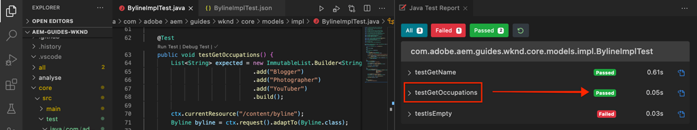

# Eenheidstest {#unit-testing}

Deze zelfstudie behandelt de implementatie van een eenheidstest die het gedrag van het Sling Model van de component Byline bevestigt, dat in [Aangepaste Component](./custom-component.md) zelfstudie wordt gecreeerd.

## Vereisten {#prerequisites}

Controleer de vereiste gereedschappen en instructies voor het instellen van een [lokale ontwikkelomgeving](overview.md#local-dev-environment).

_Als zowel Java 8 als Java 11 op het systeem zijn geïnstalleerd, kan de testruntime van de Code van VS lagere runtime van Java kiezen wanneer het uitvoeren van de tests, resulterend in testmislukkingen. Als dit gebeurt, verwijdert u Java 8._

### Starter-project

>[!NOTE]
>
> Als u met succes het vorige hoofdstuk voltooide kunt u het project hergebruiken en de stappen overslaan voor het uitchecken van het starterproject.

Bekijk de basislijncode waarop de zelfstudie is gebaseerd:

1. Ontdek de `tutorial/unit-testing-start`-vertakking van [GitHub](https://github.com/adobe/aem-guides-wknd)

   ```shell
   $ cd aem-guides-wknd
   $ git checkout tutorial/unit-testing-start
   ```

1. Stel codebasis aan een lokale AEM instantie op gebruikend uw Maven vaardigheden:

   ```shell
   $ mvn clean install -PautoInstallSinglePackage
   ```

   >[!NOTE]
   >
   > Als u AEM 6.5 of 6.4 gebruikt, voegt u het `classic`-profiel toe aan alle Maven-opdrachten.

   ```shell
   $ mvn clean install -PautoInstallSinglePackage -Pclassic
   ```

U kunt de gebeëindigde code op [GitHub](https://github.com/adobe/aem-guides-wknd/tree/tutorial/unit-testing-start) altijd bekijken of de code plaatselijk controleren door aan de tak `tutorial/unit-testing-start` te schakelen.

## Doelstelling

1. Begrijp de grondbeginselen van eenheidstests.
1. Leer over kaders en hulpmiddelen algemeen worden gebruikt om AEM code te testen die.
1. Begrijp opties voor het verplaatsen of simuleren van AEM middelen wanneer het schrijven van eenheidstests.

## Achtergrond {#unit-testing-background}

In deze zelfstudie bekijken we hoe we [Eenheid Tests](https://en.wikipedia.org/wiki/Unit_testing) voor het [Sling Model](https://sling.apache.org/documentation/bundles/models.html) van onze Byline-component schrijven (gemaakt in [Een aangepaste AEM Component maken](custom-component.md)). De tests van de eenheid zijn bouwstijltijdtests die in Java worden geschreven die verwacht gedrag van code van Java verifiëren. Elke eenheidstest is doorgaans klein en valideert de uitvoer van een methode (of werkeenheden) aan de hand van de verwachte resultaten.

We gebruiken AEM best practices en gebruiken:

* [JUnit 5](https://junit.org/junit5/)
* [Mockito Testing Framework](https://site.mockito.org/)
* [wcm.io Test Framework](https://wcm.io/testing/)  (dat voortbouwt op  [Apache Sling Mocks](https://sling.apache.org/documentation/development/sling-mock.html))

## Unit Testing and Adobe Cloud Manager {#unit-testing-and-adobe-cloud-manager}

[Adobe Cloud ](https://docs.adobe.com/content/help/en/experience-manager-cloud-manager/using/introduction-to-cloud-manager.html) Managerintegreert de uitvoering van eenheidstests en de  [code-dekking in de ](https://docs.adobe.com/content/help/en/experience-manager-cloud-manager/using/how-to-use/understand-your-test-results.html#code-quality-testing) rapportage in de CI/CD-pijpleiding om de beste praktijk van eenheidstests AEM code aan te moedigen en te bevorderen.

Hoewel code voor eenheidstests een goede praktijk is voor elke codebasis, is het bij het gebruik van Cloud Manager belangrijk om te profiteren van de mogelijkheden voor het testen en rapporteren van de codekwaliteit door eenheidstests op te geven voor Cloud Manager om te worden uitgevoerd.

## Inspect de test Geweven gebiedsdelen {#inspect-the-test-maven-dependencies}

De eerste stap is Geweven gebiedsdelen te inspecteren om het schrijven en het runnen van de tests te steunen. Er zijn vier vereiste afhankelijkheden:

1. JUnit5
1. Mockito Test Framework
1. Apache Sling Mocks
1. AEM Mocks Test Framework (per io.wcm)

De **JUnit5**, **Mockito** en **AEM Mocks** testafhankelijkheden worden automatisch toegevoegd aan het project tijdens de installatie met behulp van [AEM Maven archetype](project-setup.md).

1. Als u deze afhankelijkheden wilt weergeven, opent u de Parent Reactor POM op **aem-guides-wknd/pom.xml**, navigeert u naar `<dependencies>..</dependencies>` en zorgt u ervoor dat de volgende afhankelijkheden zijn gedefinieerd:

   ```xml
   <dependencies>
       ...       
       <!-- Testing -->
       <dependency>
           <groupId>org.junit</groupId>
           <artifactId>junit-bom</artifactId>
           <version>5.6.2</version>
           <type>pom</type>
           <scope>import</scope>
       </dependency>
       <dependency>
           <groupId>org.mockito</groupId>
           <artifactId>mockito-core</artifactId>
           <version>3.3.3</version>
           <scope>test</scope>
       </dependency>
       <dependency>
           <groupId>org.mockito</groupId>
           <artifactId>mockito-junit-jupiter</artifactId>
           <version>3.3.3</version>
           <scope>test</scope>
       </dependency>
       <dependency>
           <groupId>junit-addons</groupId>
           <artifactId>junit-addons</artifactId>
           <version>1.4</version>
           <scope>test</scope>
       </dependency>
       <dependency>
           <groupId>io.wcm</groupId>
           <artifactId>io.wcm.testing.aem-mock.junit5</artifactId>
           <!-- Prefer the latest version of AEM Mock Junit5 dependency -->
           <version>3.0.2</version>
           <scope>test</scope>
       </dependency>        
       ...
   </dependencies>
   ```

1. Open **aem-guides-wknd/core/pom.xml** en bekijk dat de overeenkomstige testgebiedsdelen beschikbaar zijn:

   ```xml
   ...
   <!-- Testing -->
   <dependency>
       <groupId>org.junit.jupiter</groupId>
       <artifactId>junit-jupiter</artifactId>
       <scope>test</scope>
   </dependency>
   <dependency>
       <groupId>org.mockito</groupId>
       <artifactId>mockito-core</artifactId>
       <scope>test</scope>
   </dependency>
   <dependency>
       <groupId>org.mockito</groupId>
       <artifactId>mockito-junit-jupiter</artifactId>
       <scope>test</scope>
   </dependency>
   <dependency>
       <groupId>junit-addons</groupId>
       <artifactId>junit-addons</artifactId>
       <scope>test</scope>
   </dependency>
   <dependency>
       <groupId>io.wcm</groupId>
       <artifactId>io.wcm.testing.aem-mock.junit5</artifactId>
       <exclusions>
           <exclusion>
               <groupId>org.apache.sling</groupId>
               <artifactId>org.apache.sling.models.impl</artifactId>
           </exclusion>
           <exclusion>
               <groupId>org.slf4j</groupId>
               <artifactId>slf4j-simple</artifactId>
           </exclusion>
       </exclusions>
       <scope>test</scope>
   </dependency>
   <!-- Required to be able to support injection with @Self and @Via -->
   <dependency>
       <groupId>org.apache.sling</groupId>
       <artifactId>org.apache.sling.models.impl</artifactId>
       <version>1.4.4</version>
       <scope>test</scope>
   </dependency>
   ...
   ```

   Een parallelle bronomslag in het **core** project zal de eenheidstests en om het even welke ondersteunende testdossiers bevatten. Deze **test** omslag verstrekt scheiding van testklassen van de broncode maar staat de tests toe om te handelen alsof zij in de zelfde pakketten zoals de broncode leven.

## De JUnit-test maken {#creating-the-junit-test}

Eenheidstests wijzen doorgaans 1-op-1 toe met Java-klassen. In dit hoofdstuk, zullen wij een test JUnit voor **BylineImpl.java** schrijven, die het het Verlenen Model is dat de component van de Byline steunt.


*Locatie waar eenheidstests worden opgeslagen.*

1. Maak een eenheidstest voor de `BylineImpl.java` door een nieuwe Java-klasse onder `src/test/java` te maken in een Java-pakketmapstructuur die de locatie weerspiegelt van de Java-klasse die moet worden getest.

   

   Aangezien we testen

   * `src/main/java/com/adobe/aem/guides/wknd/core/models/impl/BylineImpl.java`

   Maak een overeenkomende eenheidstest voor een Java-klasse op

   * `src/test/java/com/adobe/aem/guides/wknd/core/models/impl/BylineImplTest.java`

2. U kunt echter ook het testbestand onderscheiden    Het achtervoegsel `Test` in het eenheidstestbestand, `BylineImplTest.java` is een conventie die ons in staat stelt
1. Identificeer het gemakkelijk als testdossier _for_ `BylineImpl.java`
2. U kunt echter ook het testbestand _onderscheiden van_ de klasse die wordt getest, `BylineImpl.java`

## BylineImplTest.java {#reviewing-bylineimpltest-java} reviseren

Op dit punt is het JUnit-testbestand een lege Java-klasse. Werk het bestand bij met de volgende code:

```java
package com.adobe.aem.guides.wknd.core.models.impl;

import static org.junit.jupiter.api.Assertions.*;

import org.junit.jupiter.api.BeforeEach;
import org.junit.jupiter.api.Test;

public class BylineImplTest {

    @BeforeEach
    void setUp() throws Exception {

    }

    @Test 
    void testGetName() { 
        fail("Not yet implemented");
    }
    
    @Test 
    void testGetOccupations() { 
        fail("Not yet implemented");
    }

    @Test 
    void testIsEmpty() { 
        fail("Not yet implemented");
    }
}
```

1. De eerste methode `public void setUp() { .. }` is geannoteerd met `@BeforeEach` van JUnit, die de JUnit testrunner opdraagt om deze methode uit te voeren alvorens elke testmethode in deze klasse in werking te stellen. Dit verstrekt een handige plaats om gemeenschappelijke het testen staat te initialiseren die door alle tests wordt vereist.

2. De volgende methoden zijn de testmethoden, waarvan de namen worden voorafgegaan door `test` conventie en worden gemarkeerd met de `@Test`-annotatie. U ziet dat al onze tests standaard mislukken, omdat we ze nog niet hebben uitgevoerd.

   Om te beginnen, beginnen wij met één enkele testmethode voor elke openbare methode op de klasse wij testen, zo:

   | BylineImpl.java |  | BylineImplTest.java |
   | ------------------|--------------|---------------------|
   | getName() | wordt getest door | testGetName() |
   | getOccupations() | wordt getest door | testGetOccupations() |
   | isEmpty() | wordt getest door | testIsEmpty() |

   Deze methoden kunnen zo nodig worden uitgebreid, zoals verderop in dit hoofdstuk wordt weergegeven.

   Wanneer deze JUnit-testklasse (ook wel JUnit Test Case genoemd) wordt uitgevoerd, wordt elke met `@Test` gemarkeerde methode uitgevoerd als een test die geslaagd of gezakt kan worden.


*`core/src/test/java/com/adobe/aem/guides/wknd/core/models/impl/BylineImplTest.java`*

1. Voer de JUnit-testcase uit door met de rechtermuisknop op het `BylineImplTest.java`-bestand te klikken en op **Run** te tikken.
Zoals verwacht, mislukken alle tests, omdat ze nog niet zijn uitgevoerd.

   

   *Klik met de rechtermuisknop op BylineImplTests.java > Uitvoeren*

## BylineImpl.java controleren {#reviewing-bylineimpl-java}

Bij het schrijven van eenheidstests zijn er twee primaire benaderingen:

* [TDD of testontwikkeling](https://en.wikipedia.org/wiki/Test-driven_development), waarbij de eenheidstests stapsgewijs worden geschreven, onmiddellijk voordat de implementatie wordt ontwikkeld; Schrijf een test, schrijf de implementatie om de testpas te maken.
* Implementatie-eerste Ontwikkeling, die het ontwikkelen van werkende code eerst en dan het schrijven tests impliceert die genoemde code bevestigen.

In deze zelfstudie wordt de laatste benadering gebruikt (aangezien we al een werkende **BylineImpl.java** in een vorig hoofdstuk hebben gecreeerd). Daarom moeten we het gedrag van de openbare methoden van het systeem, maar ook een aantal van de toepassingsdetails ervan, herzien en begrijpen. Dit kan tegendeel klinken, aangezien een goede test alleen de inputs en outputs moet behandelen, maar wanneer het werken in AEM, zijn er een verscheidenheid aan implementatieoverwegingen die moeten worden begrepen voor het opstellen van werktests.

TDD in de context van AEM vereist een niveau van deskundigheid en kan het best worden aangenomen door AEM ontwikkelaars die deskundig zijn in AEM ontwikkeling en eenheidstests van AEM code.

## AEM testcontext instellen {#setting-up-aem-test-context}

De meeste code die voor AEM wordt geschreven, is gebaseerd op API&#39;s van het type JCR, Sling of AEM. Deze API&#39;s vereisen dat de context van een actieve AEM correct wordt uitgevoerd.

Aangezien de eenheidstests bij bouwstijl, buiten de context van een lopende AEM instantie worden uitgevoerd, is er geen dergelijke context. Om dit gemakkelijker te maken, leidt de AEM Mocks](https://wcm.io/testing/aem-mock/usage.html) van [wcm.io tot mock context die deze APIs aan _veelal_ dienst toestaat alsof zij in AEM lopen.

1. Maak een AEM met **wcm.io&#39;s** `AemContext` in **BylineImplTest.java** door deze toe te voegen als een JUnit-extensie die is versierd met `@ExtendWith` aan het **BylineImplTest.java**-bestand. De extensie zorgt voor alle vereiste initialisatie- en opschoningstaken. Maak een klassevariabele voor `AemContext` die voor alle testmethoden kan worden gebruikt.

   ```java
   import org.junit.jupiter.api.extension.ExtendWith;
   import io.wcm.testing.mock.aem.junit5.AemContext;
   import io.wcm.testing.mock.aem.junit5.AemContextExtension;
   ...
   
   @ExtendWith(AemContextExtension.class)
   class BylineImplTest {
   
       private final AemContext ctx = new AemContext();
   ```

   Deze variabele, `ctx`, stelt een mock AEM context bloot die een aantal AEM en het Schuiven abstracties verstrekt:

   * Het BylineImpl Sling-model wordt in deze context geregistreerd
   * In deze context worden structuur voor JCR-inhoud van Mock gemaakt
   * Aangepaste OSGi-services kunnen in deze context worden geregistreerd
   * Verstrekt een verscheidenheid van gemeenschappelijke vereiste mock voorwerpen en helpers zoals voorwerpen SlingHttpServletRequest, een verscheidenheid van de AEMdiensten van het Sling en OSGi zoals ModelFactory, PageManager, Pagina, Malplaatje, ComponentManager, Component, TagManager, Markering, enz.
      * *Niet alle methoden voor deze objecten zijn geïmplementeerd.*
   * En [nog veel meer](https://wcm.io/testing/aem-mock/usage.html)!

   Het object **`ctx`** fungeert als ingangspunt voor het grootste deel van onze modelcontext.

1. In de `setUp(..)` methode, die voorafgaand aan elke `@Test` methode wordt uitgevoerd, bepaal een gemeenschappelijke modelteststaat:

   ```java
   @BeforeEach
   public void setUp() throws Exception {
       ctx.addModelsForClasses(BylineImpl.class);
       ctx.load().json("/com/adobe/aem/guides/wknd/core/models/impl/BylineImplTest.json", "/content");
   }
   ```

   * **`addModelsForClasses`** registreert het Te testen Model van de Schelling, in de AEMContext, zodat kan het in de  `@Test` methodes worden geconcretiseerd.
   * **`load().json`** laadt middelstructuren in de modelcontext, toestaand de code om met deze middelen in wisselwerking te staan alsof zij door een echte bewaarplaats werden verstrekt. De brondefinities in het bestand **`BylineImplTest.json`** worden in de JCR-modelcontext geladen onder **/content**.
   * **`BylineImplTest.json`** bestaat nog niet, dus laten we het maken en de JCR-bronstructuren definiëren die nodig zijn voor de test.

1. De JSON-bestanden die de modelbronstructuren vertegenwoordigen, worden opgeslagen onder **core/src/test/resources** volgens hetzelfde pakketpad als het JUnit Java-testbestand.

   Maak een nieuw JSON-bestand op **core/test/resources/com/adobe/aem/guides/wknd/core/models/impl** met de naam **BylineImplTest.json** en voeg de volgende inhoud toe:

   ```json
   {
       "byline": {
       "jcr:primaryType": "nt:unstructured",
       "sling:resourceType": "wknd/components/content/byline"
       }
   }
   ```

   

   Deze JSON definieert een modelbron (JCR-knooppunt) voor de eenheidstest van de Byline-component. Op dit punt, heeft JSON de minimumreeks eigenschappen die wordt vereist om een de inhoudsmiddel van de component van de Byline, `jcr:primaryType` en `sling:resourceType` te vertegenwoordigen.

   Een algemene regel bij het werken met eenheidstests is het maken van de minimale set met mock-inhoud, -context en -code die nodig is om aan elke test te voldoen. Vermijd de verleiding om een complete mock-context op te bouwen voordat de tests worden geschreven, aangezien dit vaak tot ongewenste artefacten leidt.

   Nu met het bestaan van **BylineImplTest.json**, wanneer `ctx.json("/com/adobe/aem/guides/wknd/core/models/impl/BylineImplTest.json", "/content")` wordt uitgevoerd, worden de modelmiddeldefinities geladen in de context bij de weg **/content.**

## getName() {#testing-get-name} testen

Nu wij een basismodelcontextopstelling hebben, schrijven wij onze eerste test voor **getName van BylineImpl ()**. Deze test moet ervoor zorgen dat de methode **getName()** de juiste geschreven naam retourneert die is opgeslagen bij de eigenschap &quot;**name&quot;** van de bron.

1. Werk de **testGetName** () methode in **BylineImplTest.java** als volgt bij:

   ```java
   import com.adobe.aem.guides.wknd.core.components.Byline;
   ...
   @Test
   public void testGetName() {
       final String expected = "Jane Doe";
   
       ctx.currentResource("/content/byline");
       Byline byline = ctx.request().adaptTo(Byline.class);
   
       String actual = byline.getName();
   
       assertEquals(expected, actual);
   }
   ```

   * **`String expected`** Hiermee stelt u de verwachte waarde in. Dit wordt ingesteld op &quot;**Jane Done**&quot;.
   * **`ctx.currentResource`** plaatst de context van het modelmiddel om de code tegen te evalueren, zodat wordt dit geplaatst aan  **/content/** bylineas die is waar de mock byline inhoudsmiddel wordt geladen.
   * **`Byline byline`** instantieert het Byline Sling Model door het van het modelvoorwerp van het Verzoek aan te passen.
   * **`String actual`** Roept de methode aan die we testen,  `getName()`op het Byline Sling Model-object.
   * **`assertEquals`** Geeft aan dat de verwachte waarde overeenkomt met de waarde die wordt geretourneerd door het byline Sling Model-object. Als deze waarden niet gelijk zijn, zal de test mislukken.

1. Test uitvoeren... en mislukt met een `NullPointerException`.

   Merk op dat deze test NIET ontbreekt omdat wij nooit een `name` bezit in het mock JSON bepaalde, die de test zal veroorzaken om te ontbreken hoewel de testuitvoering niet aan dat punt heeft gekregen! Deze test mislukt als gevolg van een `NullPointerException` op het byline-object zelf.

1. Als `BylineImpl.java` in `@PostConstruct init()` een uitzondering genereert, voorkomt dit dat het Sling Model wordt geïnstantieerd en dat Sling Model-object null wordt.

   ```java
   @PostConstruct
   private void init() {
       image = modelFactory.getModelFromWrappedRequest(request, request.getResource(), Image.class);
   }
   ```

   Hoewel de OSGi-service ModelFactory via de `AemContext` (als Apache Sling-context) wordt aangeboden, worden niet alle methoden geïmplementeerd, inclusief `getModelFromWrappedRequest(...)` die in de `init()`-methode van de BylineImpl wordt aangeroepen. Dit resulteert in een [AbstractMethodError](https://docs.oracle.com/en/java/javase/11/docs/api/java.base/java/lang/AbstractMethodError.html), die op termijn `init()` om veroorzaakt te ontbreken, en de resulterende aanpassing van `ctx.request().adaptTo(Byline.class)` is een ongeldig voorwerp.

   Aangezien de verstrekte modellen onze code niet kunnen aanpassen, moeten wij de modelcontext zelf uitvoeren voor dit, kunnen wij Mockito gebruiken om een modelvoorwerp te creëren ModelFactory, dat een modelvoorwerp van het Beeld terugkeert wanneer `getModelFromWrappedRequest(...)` op het wordt aangehaald.

   Omdat deze modelcontext aanwezig moet zijn om zelfs maar een instantie van het Byline Sling-model te kunnen maken, kunnen we deze toevoegen aan de `@Before setUp()`-methode. We moeten ook de `MockitoExtension.class` toevoegen aan de `@ExtendWith`-annotatie boven de **BylineImplTest**-klasse.

   ```java
   package com.adobe.aem.guides.wknd.core.models.impl;
   
   import org.mockito.junit.jupiter.MockitoExtension;
   import org.mockito.Mock;
   
   import com.adobe.aem.guides.wknd.core.models.Byline;
   import com.adobe.cq.wcm.core.components.models.Image;
   
   import io.wcm.testing.mock.aem.junit5.AemContext;
   import io.wcm.testing.mock.aem.junit5.AemContextExtension;
   
   import org.apache.sling.models.factory.ModelFactory;
   import org.junit.jupiter.api.BeforeEach;
   import org.junit.jupiter.api.Test;
   import org.junit.jupiter.api.extension.ExtendWith;
   
   import static org.junit.jupiter.api.Assertions.*;
   import static org.mockito.Mockito.*;
   import org.apache.sling.api.resource.Resource;
   
   @ExtendWith({ AemContextExtension.class, MockitoExtension.class })
   public class BylineImplTest {
   
       private final AemContext ctx = new AemContext();
   
       @Mock
       private Image image;
   
       @Mock
       private ModelFactory modelFactory;
   
       @BeforeEach
       public void setUp() throws Exception {
           ctx.addModelsForClasses(BylineImpl.class);
   
           ctx.load().json("/com/adobe/aem/guides/wknd/core/models/impl/BylineImplTest.json", "/content");
   
           lenient().when(modelFactory.getModelFromWrappedRequest(eq(ctx.request()), any(Resource.class), eq(Image.class)))
                   .thenReturn(image);
   
           ctx.registerService(ModelFactory.class, modelFactory, org.osgi.framework.Constants.SERVICE_RANKING,
                   Integer.MAX_VALUE);
       }
   
       @Test
       void testGetName() { ...
   }
   ```

   * **`@ExtendWith({AemContextExtension.class, MockitoExtension.class})`** markeert de klasse van het Geval van de Test die met de  [Mockito JUnit ](https://www.javadoc.io/page/org.mockito/mockito-junit-jupiter/latest/org/mockito/junit/jupiter/MockitoExtension.html) Uitbreiding van Jupiter moet worden in werking gesteld die voor het gebruik van de @Mock aantekeningen toestaat om mock voorwerpen op het niveau van de Klasse te bepalen.
   * **`@Mock private Image`** maakt een mock-object van het type  `com.adobe.cq.wcm.core.components.models.Image`. Merk op dat dit op klassenniveau wordt bepaald zodat, zoals nodig, de methodes `@Test` zijn gedrag kunnen veranderen zoals nodig.
   * **`@Mock private ModelFactory`** Maakt een mock-object van het type ModelFactory. Merk op dat dit een zuiver Mockito mock is en dat er geen methoden op zijn toegepast. Merk op dat dit op klassenniveau wordt bepaald zodat, zoals nodig, `@Test`de methodes zijn gedrag kunnen veranderen zoals nodig.
   * **`when(modelFactory.getModelFromWrappedRequest(..)`** registreert modelgedrag voor wanneer  `getModelFromWrappedRequest(..)` wordt geroepen op het modelvoorwerp ModelFactory. Het resultaat dat wordt gedefinieerd in `thenReturn (..)` is het retourneren van het modelafbeeldingsobject. Dit gedrag wordt alleen aangeroepen wanneer: de eerste parameter is gelijk aan `ctx`&#39;s verzoekvoorwerp, 2nd param is om het even welk voorwerp van het Middel, en de 3de param moet de klasse van het Beeld van de Componenten van de Kern zijn. Wij aanvaarden om het even welke Middel omdat door onze tests wij `ctx.currentResource(...)` aan diverse modelmiddelen plaatsen die in **BylineImplTest.json** worden bepaald. Merk op dat wij **lenient ()** strengheid toevoegen omdat wij later dit gedrag van ModelFactory zullen willen met voeten treden.
   * **`ctx.registerService(..)`.** Registreert het modelobject ModelFactory in AemContext, met de hoogste de dienstrangschikking. Dit is vereist omdat ModelFactory die in BylineImpl `init()` wordt gebruikt via het `@OSGiService ModelFactory model` gebied wordt ingespoten. Opdat AemContext **ons** mock voorwerp injecteert, dat vraag aan `getModelFromWrappedRequest(..)` behandelt, moeten wij het als hoogste rangschikkende Dienst van dat type (ModelFactory) registreren.

1. Voer de test opnieuw uit, en nogmaals, het mislukt, maar dit keer is het bericht duidelijk waarom de test is mislukt.

   

   *testGetName() mislukt door bewering*

   We ontvangen een **AssertionError** wat betekent dat de voorwaarde van de bevestiging in de test is mislukt, en het vertelt ons dat de **verwachte waarde &quot;Jane Doe&quot;** is, maar de **werkelijke waarde is null**. Dit is logisch omdat de eigenschap &quot;**name&quot;** niet is toegevoegd aan mock **/content/byline** resourcedefinitie in **BylineImplTest.json**, dus laten we het toevoegen:

1. **BylineImplTest.json** bijwerken om `"name": "Jane Doe".` te definiëren

   ```json
   {
       "byline": {
       "jcr:primaryType": "nt:unstructured",
       "sling:resourceType": "wknd/components/content/byline",
       "name": "Jane Doe"
       }
   }
   ```

1. Voer de test opnieuw uit en **`testGetName()`** slaagt nu!

   


## getOccupations() testen {#testing-get-occupations}

Goed zo! Onze eerste test is geslaagd! Laten we verder gaan en `getOccupations()` testen. Aangezien de initialisatie van de modelcontext in de `@Before setUp()`methode was, zal dit aan alle `@Test` methodes in dit Geval van de Test, met inbegrip van `getOccupations()` beschikbaar zijn.

Onthoud dat deze methode een alfabetisch gesorteerde lijst met beroepen (aflopend) moet retourneren die is opgeslagen in de eigenschap bezettingen.

1. **`testGetOccupations()`** als volgt bijwerken:

   ```java
   import java.util.List;
   import com.google.common.collect.ImmutableList;
   ...
   @Test
   public void testGetOccupations() {
       List<String> expected = new ImmutableList.Builder<String>()
                               .add("Blogger")
                               .add("Photographer")
                               .add("YouTuber")
                               .build();
   
       ctx.currentResource("/content/byline");
       Byline byline = ctx.request().adaptTo(Byline.class);
   
       List<String> actual = byline.getOccupations();
   
       assertEquals(expected, actual);
   }
   ```

   * **`List<String> expected`** het verwachte resultaat te definiëren.
   * **`ctx.currentResource`** plaatst het huidige middel om de context tegen de modelmiddeldefinitie bij /content/byline te evalueren. Dit zorgt ervoor dat **BylineImpl.java** in de context van onze modelbron uitvoert.
   * **`ctx.request().adaptTo(Byline.class)`** instantieert het Byline Sling Model door het van het modelvoorwerp van het Verzoek aan te passen.
   * **`byline.getOccupations()`** Roept de methode aan die we testen,  `getOccupations()`op het Byline Sling Model-object.
   * **`assertEquals(expected, actual)`** De verwachte lijst van berichten is het zelfde als de daadwerkelijke lijst.

1. Herinner me, enkel zoals **`getName()`** hierboven, **BylineImplTest.json** geen beroepen bepaalt, zodat zal deze test ontbreken als wij het in werking stellen, aangezien `byline.getOccupations()` een lege lijst zal terugkeren.

   **BylineImplTest.json** bijwerken om een lijst met beroepen op te nemen, en zij zullen in niet alfabetische orde worden geplaatst om ervoor te zorgen dat onze tests bevestigen dat de beroepen alfabetisch door **`getOccupations()`** worden gesorteerd.

   ```json
   {
       "byline": {
       "jcr:primaryType": "nt:unstructured",
       "sling:resourceType": "wknd/components/content/byline",
       "name": "Jane Doe",
       "occupations": ["Photographer", "Blogger", "YouTuber"]
       }
   }
   ```

1. Voer de test uit, en nogmaals, we slagen! Het lijkt alsof de gesorteerde beroepen werken!

   

   *testGetOccupations() geslaagd*

## Testing isEmpty() {#testing-is-empty}

De laatste methode om **`isEmpty()`** te testen.

Het testen `isEmpty()` is interessant omdat het het testen voor een verscheidenheid van voorwaarden vereist. Als u de **BylineImpl.java**-methode `isEmpty()` controleert, moeten de volgende voorwaarden worden getest:

* Retourneer true wanneer de naam leeg is
* Retourneer true wanneer de bezettingen null of leeg zijn
* Retourneer true wanneer de afbeelding null is of geen src-URL heeft
* Retourneer false wanneer de naam, de bezetting en de afbeelding (met een URL voor de bron) aanwezig zijn

Hiervoor moeten we nieuwe testmethoden maken, waarbij elke test een specifieke voorwaarde en nieuwe modelbronstructuren in `BylineImplTest.json` test om deze tests te starten.

Met deze controle konden we het testen overslaan als `getName()`, `getOccupations()` en `getImage()` leeg zijn, omdat het verwachte gedrag van die status via `isEmpty()` wordt getest.

1. De eerste test zal de voorwaarde van een gloednieuwe component testen, die geen eigenschappen heeft geplaatst.

   Voeg een nieuwe middeldefinitie aan `BylineImplTest.json` toe, die het de semantische naam &quot;**empty** geeft

   ```json
   {
       "byline": {
           "jcr:primaryType": "nt:unstructured",
           "sling:resourceType": "wknd/components/content/byline",
           "name": "Jane Doe",
           "occupations": ["Photographer", "Blogger", "YouTuber"]
       },
       "empty": {
           "jcr:primaryType": "nt:unstructured",
           "sling:resourceType": "wknd/components/content/byline"
       }
   }
   ```

   **`"empty": {...}`** definieert een nieuwe brondefinitie met de naam &quot;empty&quot; die alleen een  `jcr:primaryType` en- `sling:resourceType`.

   Onthoud dat we `BylineImplTest.json` in `ctx` laden voordat elke testmethode in `@setUp` wordt uitgevoerd. Deze nieuwe brondefinitie is dus direct beschikbaar voor ons in tests op **/content/empty.**

1. Werk `testIsEmpty()` als volgt bij, plaatsend de huidige bron aan de nieuwe &quot;**empty**&quot;modelmiddeldefinitie.

   ```java
   @Test
   public void testIsEmpty() {
       ctx.currentResource("/content/empty");
       Byline byline = ctx.request().adaptTo(Byline.class);
   
       assertTrue(byline.isEmpty());
   }
   ```

   Voer de test uit en controleer of deze slaagt.

1. Maak vervolgens een set methoden om ervoor te zorgen dat `isEmpty()` true retourneert wanneer een van de vereiste gegevenspunten (naam, bezigheid of afbeelding) leeg is.

   Voor elke test, wordt een discrete mock middeldefinitie gebruikt, update **BylineImplTest.json** met de extra middeldefinities voor **zonder-naam** en **zonder-bezetaties**.

   ```json
   {
       "byline": {
           "jcr:primaryType": "nt:unstructured",
           "sling:resourceType": "wknd/components/content/byline",
           "name": "Jane Doe",
           "occupations": ["Photographer", "Blogger", "YouTuber"]
       },
       "empty": {
           "jcr:primaryType": "nt:unstructured",
           "sling:resourceType": "wknd/components/content/byline"
       },
       "without-name": {
           "jcr:primaryType": "nt:unstructured",
           "sling:resourceType": "wknd/components/content/byline",
           "occupations": "[Photographer, Blogger, YouTuber]"
       },
       "without-occupations": {
           "jcr:primaryType": "nt:unstructured",
           "sling:resourceType": "wknd/components/content/byline",
           "name": "Jane Doe"
       }
   }
   ```

   Maak de volgende testmethoden om deze statussen te testen.

   ```java
   @Test
   public void testIsEmpty() {
       ctx.currentResource("/content/empty");
   
       Byline byline = ctx.request().adaptTo(Byline.class);
   
       assertTrue(byline.isEmpty());
   }
   
   @Test
   public void testIsEmpty_WithoutName() {
       ctx.currentResource("/content/without-name");
   
       Byline byline = ctx.request().adaptTo(Byline.class);
   
       assertTrue(byline.isEmpty());
   }
   
   @Test
   public void testIsEmpty_WithoutOccupations() {
       ctx.currentResource("/content/without-occupations");
   
       Byline byline = ctx.request().adaptTo(Byline.class);
   
       assertTrue(byline.isEmpty());
   }
   
   @Test
   public void testIsEmpty_WithoutImage() {
       ctx.currentResource("/content/byline");
   
       lenient().when(modelFactory.getModelFromWrappedRequest(eq(ctx.request()),
           any(Resource.class),
           eq(Image.class))).thenReturn(null);
   
       Byline byline = ctx.request().adaptTo(Byline.class);
   
       assertTrue(byline.isEmpty());
   }
   
   @Test
   public void testIsEmpty_WithoutImageSrc() {
       ctx.currentResource("/content/byline");
   
       when(image.getSrc()).thenReturn("");
   
       Byline byline = ctx.request().adaptTo(Byline.class);
   
       assertTrue(byline.isEmpty());
   }
   ```

   **`testIsEmpty()`** test tegen de lege mock middeldefinitie, en beweert dat waar  `isEmpty()` is.

   **`testIsEmpty_WithoutName()`** test tegen een mock middeldefinitie die beroepen maar geen naam heeft.

   **`testIsEmpty_WithoutOccupations()`** test tegen een mock middeldefinitie die een naam maar geen beroepen heeft.

   **`testIsEmpty_WithoutImage()`** test tegen een modelmiddeldefinitie met een naam en bezinkingen maar plaatst het modelBeeld om aan ongeldig terug te keren. Merk op dat wij `modelFactory.getModelFromWrappedRequest(..)`gedrag willen met voeten treden dat in `setUp()` wordt bepaald om het voorwerp van het Beeld te verzekeren dat door deze vraag is teruggekeerd ongeldig is. De functie Mockito-stubs is strikt en wil geen dubbele code. Daarom plaatsen wij het mock met **`lenient`** montages om uitdrukkelijk te merken wij het gedrag in de `setUp()` methode met voeten treden.

   **`testIsEmpty_WithoutImageSrc()`** test tegen een modelmiddeldefinitie met een naam en bezinkingen, maar plaatst het modelBeeld om een leeg koord terug te keren wanneer  `getSrc()` wordt aangehaald.

1. Ten slotte, schrijf een test om ervoor te zorgen dat **isEmpty ()** vals terugkeert wanneer de component behoorlijk wordt gevormd. Voor deze voorwaarde, kunnen wij **/content/byline** opnieuw gebruiken die een volledig gevormde component van de Byline vertegenwoordigt.

   ```java
   @Test
   public void testIsNotEmpty() {
       ctx.currentResource("/content/byline");
       when(image.getSrc()).thenReturn("/content/bio.png");
   
       Byline byline = ctx.request().adaptTo(Byline.class);
   
       assertFalse(byline.isEmpty());
   }
   ```

1. Voer nu alle eenheidstests in het BylineImplTest.java-bestand uit en bekijk de uitvoer van het Java Test Report.


## Eenheidstests uitvoeren als onderdeel van de build {#running-unit-tests-as-part-of-the-build}

Eenheidstests worden uitgevoerd om te slagen als onderdeel van de gefabriceerde build. Dit zorgt ervoor dat alle tests met succes overgaan alvorens een toepassing wordt opgesteld. Het uitvoeren van Gemaakte doelstellingen zoals pakket of installeert roept automatisch en vereist de overgaan van alle eenheidstests in het project.

```shell
$ mvn package
```


```shell
$ mvn package
```

Op dezelfde manier, als wij een testmethode veranderen om te ontbreken, ontbreekt de bouwstijl en rapporten die test ontbrak en waarom.


## Controleer de code {#review-the-code}

Bekijk de gebeëindigde code op [GitHub](https://github.com/adobe/aem-guides-wknd) of herzie en stel plaatselijk de code bij de schakelaar van de Git `tutorial/unit-testing-solution` op.
