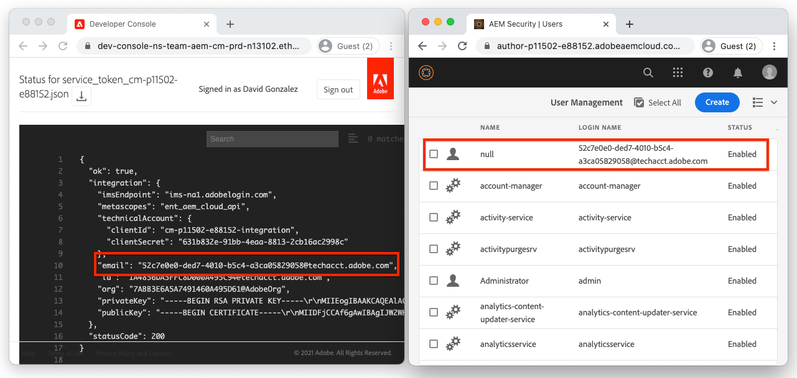

# Servicegegevens

Integraties met Adobe Experience Manager (AEM) as a Cloud Service moeten veilig kunnen worden geverifieerd voor de AEM-service. AEM Developer Console verleent toegang tot Service Credentials, die worden gebruikt om externe toepassingen, systemen en diensten te vergemakkelijken om programmatically met de Auteur van AEM of de Publicatie diensten over HTTP in wisselwerking te staan.

AEM integreert met andere producten van Adobe gebruikend [ S2S OAuth die via Adobe Developer Console ](https://experienceleague.adobe.com/nl/docs/experience-manager-cloud-service/content/security/setting-up-ims-integrations-for-aem-as-a-cloud-service) wordt beheerd. Voor aangepaste integratie met serviceaccounts worden JWT-referenties gebruikt en beheerd in de AEM Developer Console.

>[!VIDEO](https://video.tv.adobe.com/v/330519?quality=12&learn=on)

De Referenties van de dienst kunnen gelijkaardige [ Lokale Tokens van de Toegang van de Ontwikkeling ](./local-development-access-token.md) lijken maar zijn verschillend op een paar zeer belangrijke manieren:

+ Servicekredieten zijn gekoppeld aan technische accounts. De veelvoudige de dienstgeloofsbrieven kunnen voor een Technische Rekening actief zijn.
+ De Verantwoordelijkheden van de dienst zijn _niet_ toegangstokens, eerder zijn zij geloofsbrieven die worden gebruikt om __ toegangstokens te verkrijgen.
+ De geloofsbrieven van de dienst zijn duurder (hun certificaat verloopt om de 365 dagen), en veranderen niet tenzij ingetrokken, terwijl de Lokale Tokens van de Toegang van de Ontwikkeling dagelijks verlopen.
+ De geloofsbrieven van de dienst voor een milieu van AEM as a Cloud Service kaart aan één enkele gebruiker van de technische rekening van AEM, terwijl de Tokens van de Toegang van de Toegang van de Lokale Ontwikkeling voor authentiek verklaren als de gebruiker van AEM die het toegangstoken produceerde.
+ Een AEM as a Cloud Service-omgeving kan maximaal tien technische accounts hebben, elk met hun eigen servicekredieten, waarbij elke account wordt toegewezen aan een afzonderlijke AEM-gebruiker.

Zowel dienen de Geloofsbrieven van de Dienst als de toegangstoken zij produceren, en de Lokale Tokens van de Toegang van de Ontwikkeling, geheim worden gehouden. Aangezien alle drie kunnen worden gebruikt om, toegang tot hun respectieve milieu van AEM as a Cloud Service te verkrijgen.

## Servicekredieten genereren

Het genereren van servicekredieten wordt in twee stappen opgedeeld:

1. Een eenmalige technische account aanmaken door een Adobe IMS-beheerder
1. Het downloaden en gebruiken van JSON (Service Credentials) van de technische account

### Een technische account maken

In tegenstelling tot tokens voor lokale ontwikkelingstoegang moet een technische account worden aangemaakt door een Adobe Org IMS-beheerder voordat deze kunnen worden gedownload. Voor elke klant die programmatische toegang tot AEM nodig heeft, moeten aparte technische accounts worden aangemaakt.


De technische Rekeningen worden gecreeerd eens, nochtans het gebruik van Privé Sleutels om de Verantwoordelijkheden van de Dienst verbonden aan de Technische Rekening te beheren kan in tijd worden beheerd. Bijvoorbeeld, moeten de nieuwe Persoonlijke Sleutel/de Credentials van de Dienst vóór het verstrijken van de huidige Privé Sleutel worden geproduceerd, om voor ononderbroken toegang door een gebruiker van de Credentials van de Dienst toe te staan.

1. Controleer of u bent aangemeld als een:
   + __Beheerder van het Systeem van Adobe IMS Org__
   + Lid van de __Beheerders van AEM__ IMS Profiel van het Product op __Auteur van AEM__
1. Login aan [ Adobe Cloud Manager ](https://my.cloudmanager.adobe.com)
1. Open het programma dat de AEM as a Cloud Service-omgeving bevat om de instelling van de servicekredieten voor
1. Tik de ellips naast het milieu in de __sectie van Milieu__, en selecteer __Developer Console__
1. Tik in het __lusje van de Integraties__
1. Tik de __Technische Rekeningen__ tabel
1. Tik __creeer nieuwe technische rekening__ knoop
1. De servicekredieten van de technische account worden geïnitialiseerd en weergegeven als JSON


Nadat de AEM as Cloud Service environment&#39;s Service Credentials is geïnitialiseerd, kunnen andere AEM-ontwikkelaars in uw Adobe IMS Org deze downloaden.

### Referenties van service downloaden


Het downloaden van de Referentieformals van de Dienst volgt de gelijkaardige stappen zoals de initialisering.

1. Controleer of u bent aangemeld als een:
   + __Beheerder van IMS van Adobe van Org__
   + Lid van de __Beheerders van AEM__ IMS Profiel van het Product op __Auteur van AEM__
1. Login aan [ Adobe Cloud Manager ](https://my.cloudmanager.adobe.com)
1. Open het programma dat de AEM as a Cloud Service-omgeving bevat om mee te integreren
1. Tik de ellips naast het milieu in de __sectie van Milieu__, en selecteer __Developer Console__
1. Tik in het __lusje van de Integraties__
1. Tik de __Technische Rekeningen__ tabel
1. Breid __Technische Rekening__ uit die moet worden gebruikt
1. Breid __Persoonlijke Sleutel__ uit de waarvan Credentials van de Dienst zullen worden gedownload, en verifieer dat de status __Actief__ is
1. Tik op __..__ > __Mening__ verbonden aan de __Privé Sleutel__, die de Credentials JSON van de Dienst toont
1. Tik op de downloadknop in de linkerbovenhoek om het JSON-bestand met de waarde Servicekredieten te downloaden en het bestand op een veilige locatie op te slaan

## De servicereferenties installeren

De servicekredieten bevatten de gegevens die nodig zijn om een JWT te genereren, die wordt uitgewisseld voor een toegangstoken dat wordt gebruikt voor verificatie met AEM as a Cloud Service. De servicekredieten moeten worden opgeslagen op een beveiligde locatie die toegankelijk is voor externe toepassingen, systemen of services die deze gebruiken om toegang te krijgen tot AEM. Hoe en waar de Credentials van de Dienst worden beheerd zijn uniek per klant.

Voor eenvoud, gaat dit leerprogramma de Credentials van de Dienst binnen via de bevellijn over. Werk echter samen met uw IT-beveiligingsteam om te begrijpen hoe deze gegevens moeten worden opgeslagen en geopend in overeenstemming met de beveiligingsrichtlijnen van uw organisatie.

1. Kopieer [ downloadde Referenties JSON van de Dienst ](#download-service-credentials) aan een dossier genoemd `service_token.json` in de wortel van het project
   + Herinner me, begaat nooit _om het even welke geloofsbrieven_ aan Git!

## Servicereferenties gebruiken

De servicekredieten, een volledig samengesteld JSON-object, zijn niet hetzelfde als de JWT of het toegangstoken. In plaats daarvan worden de servicekredieten (die een persoonlijke sleutel bevatten) gebruikt om een JWT te genereren, die wordt uitgewisseld met Adobe IMS API&#39;s voor een toegangstoken.


1. Download de servicekredieten van AEM Developer Console naar een veilige locatie
1. De externe toepassing moet programmatisch communiceren met de AEM as a Cloud Service-omgeving
1. De externe toepassing leest in de Referenties van de Dienst van een veilige plaats
1. De externe toepassing gebruikt informatie van de Referenties van de Dienst om een Token te construeren JWT
1. De JWT Token wordt naar Adobe IMS verzonden voor uitwisseling voor een toegangstoken
1. Adobe IMS retourneert een toegangstoken dat kan worden gebruikt voor toegang tot AEM as a Cloud Service
   + Toegangstokens kunnen een vervaltijd niet veranderen.
1. De externe toepassing doet HTTP-aanvragen aan AEM as a Cloud Service, waarbij het toegangstoken als een token voor Drager wordt toegevoegd aan de header voor HTTP-aanvragen.
1. AEM as a Cloud Service ontvangt de HTTP-aanvraag, verifieert de aanvraag en voert het werk uit dat door de HTTP-aanvraag wordt aangevraagd en retourneert een HTTP-reactie terug naar de externe toepassing

### Updates voor de externe toepassing

Als u AEM as a Cloud Service wilt benaderen met de servicekredieten, moet de externe toepassing op drie manieren worden bijgewerkt:

1. Lees in de Referenties van de Dienst

+ Voor eenvoud, worden de Credentials van de Dienst gelezen van het gedownloade JSON dossier, nochtans in real-use scenario&#39;s, moeten de Referenties van de Dienst veilig worden opgeslagen in overeenstemming met de veiligheidsrichtlijnen van uw organisatie

1. Een JWT genereren op basis van de servicerecertificaten
1. Uitwisseling JWT voor een toegangstoken

+ Wanneer Service Credentials aanwezig is, gebruikt de externe toepassing dit toegangstoken in plaats van het token Local Development Access (Lokale ontwikkelingstoken) bij de toegang tot AEM as a Cloud Service

In deze zelfstudie wordt de Adobe `@adobe/jwt-auth` npm-module gebruikt om (1) de JWT te genereren op basis van de servicereferentials en (2) deze te ruilen voor een toegangstoken, in één functieaanroep. Als uw toepassing niet JavaScript gebaseerd is, te herzien gelieve de [ steekproefcode in andere talen ](https://developer.adobe.com/developer-console/docs/guides/authentication/JWT/samples/) voor hoe te om JWT van de Referenties van de Dienst tot stand te brengen, en het voor een toegangstoken met Adobe IMS te ruilen.

## Lees de Referenties van de Dienst

Controleer `getCommandLineParams()` zodat zie hoe het dossier van de Verantwoordelijkheid JSON van de Dienst gebruikend de zelfde code wordt gelezen die wordt gebruikt om in het Token JSON van de Toegang van de Lokale Ontwikkeling te lezen.

```javascript
function getCommandLineParams() {
    ...

    // Read in the credentials from the provided JSON file
    // Since both the Local Development Access Token and Service Credentials files are JSON, this same approach can be re-used
    if (parameters.file) {
        parameters.developerConsoleCredentials = JSON.parse(fs.readFileSync(parameters.file));
    }

    ...
    return parameters;
}
```

## Creeer JWT en ruil voor een Token van de Toegang

Nadat de servicekredieten zijn gelezen, worden deze gebruikt om een JWT te genereren die vervolgens wordt uitgewisseld met Adobe IMS API&#39;s voor een toegangstoken. Dit toegangstoken kan dan worden gebruikt om tot AEM as a Cloud Service toegang te hebben.

Deze voorbeeldtoepassing is gebaseerd op Node.js, dus het is beter om [@adobe/jwt-auth ](https://www.npmjs.com/package/@adobe/jwt-auth) npm module te gebruiken om de (1) productie van JWT en (20 uitwisseling met Adobe IMS te vergemakkelijken. Als uw toepassing gebruikend een andere taal wordt ontwikkeld, te herzien gelieve [ de aangewezen codesteekproeven ](https://developer.adobe.com/developer-console/docs/guides/authentication/JWT/samples) op hoe te om het verzoek van HTTP aan Adobe IMS te construeren gebruikend andere programmeertalen.

1. Werk `getAccessToken(..)` bij om de inhoud van het JSON-bestand te inspecteren en te bepalen of dit een token of servicerecertificaat voor lokale ontwikkelingstoegang vertegenwoordigt. Dit kan eenvoudig worden bereikt door te controleren op het bestaan van de eigenschap `.accessToken` , die alleen bestaat voor Local Development Access Token JSON.

   Als Service Credentials is opgegeven, genereert de toepassing een JWT en wisselt deze uit met Adobe IMS voor een toegangstoken. Gebruik de [@adobe/jwt-auth ](https://www.npmjs.com/package/@adobe/jwt-auth) `auth(...)` functie die een JWT produceert en het voor een toegangstoken in één enkele functievraag ruilt. De parameters aan `auth(..)` methode zijn a [ JSON voorwerp dat van specifieke informatie ](https://www.npmjs.com/package/@adobe/jwt-auth#config-object) wordt samengesteld beschikbaar bij de Referenties JSON van de Dienst, zoals hieronder in code wordt beschreven.

```javascript
 async function getAccessToken(developerConsoleCredentials) {

     if (developerConsoleCredentials.accessToken) {
         // This is a Local Development access token
         return developerConsoleCredentials.accessToken;
     } else {
         // This is the Service Credentials JSON object that must be exchanged with Adobe IMS for an access token
         let serviceCredentials = developerConsoleCredentials.integration;

         // Use the @adobe/jwt-auth library to pass the service credentials generated a JWT and exchange that with Adobe IMS for an access token.
         // If other programming languages are used, please see these code samples: https://www.adobe.io/authentication/auth-methods.html#!AdobeDocs/adobeio-auth/master/JWT/samples/samples.md
         let { access_token } = await auth({
             clientId: serviceCredentials.technicalAccount.clientId, // Client Id
             technicalAccountId: serviceCredentials.id,              // Technical Account Id
             orgId: serviceCredentials.org,                          // Adobe IMS Org Id
             clientSecret: serviceCredentials.technicalAccount.clientSecret, // Client Secret
             privateKey: serviceCredentials.privateKey,              // Private Key to sign the JWT
             metaScopes: serviceCredentials.metascopes.split(','),   // Meta Scopes defining level of access the access token should provide
             ims: `https://${serviceCredentials.imsEndpoint}`,       // IMS endpoint used to obtain the access token from
         });

         return access_token;
     }
 }
```

     nu, afhankelijk van welk JSON dossier - of het Lokale Token JSON van de Toegang van de Ontwikkeling of de Referentie JSON van de Dienst - binnen via die het bevellijnparameter van file &grave; wordt overgegaan, zal de toepassing een toegangstoken afleiden.
    
     Herinner me, dat terwijl de Referenties van de Dienst elke 365 dagen verlopen, JWT en het overeenkomstige toegangstoken vaak verlopen, en moeten worden verfrist alvorens zij verlopen. Dit kan worden gedaan door ` te gebruiken verfrist_token ` [verstrekt door Adobe IMS] (https://www.adobe.io/authentication/auth-methods.html#!AdobeDocs/adobeio-auth/master/OAuth/OAuth.md#access-tokens).

1. Als deze wijzigingen zijn aangebracht, is Service Credentials JSON gedownload van de AEM Developer Console en voor de eenvoud opgeslagen als `service_token.json` in dezelfde map als deze `index.js` . Laten we nu de toepassing uitvoeren, waarbij de opdrachtregelparameter `file` wordt vervangen door `service_token.json` , en de `propertyValue` wordt bijgewerkt naar een nieuwe waarde, zodat de effecten zichtbaar zijn in AEM.

   ```shell
   $ node index.js \
       aem=https://author-p1234-e5678.adobeaemcloud.com \
       folder=/wknd-shared/en/adventures/napa-wine-tasting \
       propertyName=metadata/dc:rights \
       propertyValue="WKND Restricted Use" \
       file=service_token.json
   ```

   De output aan de terminal kijkt als:

   ```shell
   200 - OK @ https://author-p1234-e5678.adobeaemcloud.com/api/assets/wknd-shared/en/adventures/napa-wine-tasting.json
   403 - Forbidden @ https://author-p1234-e5678.adobeaemcloud.com/api/assets/wknd-shared/en/adventures/napa-wine-tasting/AdobeStock_277654931.jpg.json
   403 - Forbidden @ https://author-p1234-e5678.adobeaemcloud.com/api/assets/wknd-shared/en/adventures/napa-wine-tasting/AdobeStock_239751461.jpg.json
   403 - Forbidden @ https://author-p1234-e5678.adobeaemcloud.com/api/assets/wknd-shared/en/adventures/napa-wine-tasting/AdobeStock_280313729.jpg.json
   403 - Forbidden @ https://author-p1234-e5678.adobeaemcloud.com/api/assets/wknd-shared/en/adventures/napa-wine-tasting/AdobeStock_286664352.jpg.json
   ```

   __403 - de verboden__ lijnen, wijzen op fouten in de vraag van HTTP API aan AEM as a Cloud Service. Deze 403 Verboden fouten treden op wanneer wordt geprobeerd de metagegevens van de elementen bij te werken.

   De reden hiervoor is het toegangstoken dat is afgeleid van servicekredieten, verifieert de aanvraag aan AEM met behulp van een automatisch aangemaakte AEM-gebruiker van een technische account, die standaard alleen leestoegang heeft. Om de toepassing te verlenen schrijf toegang tot AEM, moet de gebruiker van technische rekening AEM verbonden aan het toegangstoken toestemming in AEM worden verleend.

## Toegang configureren in AEM

Het de toegangsteken van de Dienst van Credentials-afgeleide gebruik een technische rekeningAEM Gebruiker die lidmaatschap in de __Medewerkers__ gebruikersgroep van AEM heeft.



Zodra de gebruiker van de technische rekening AEM in AEM (na eerste HTTP- verzoek met het toegangstoken) bestaat, kunnen de toestemmingen van deze gebruiker van AEM het zelfde als andere gebruikers van AEM worden beheerd.

1. Zoek eerst de AEM-aanmeldnaam van de technische account door de Service Credentials te openen die JSON van AEM Developer Console heeft gedownload en zoek de `integration.email` -waarde, die er ongeveer als volgt moet uitzien: `12345678-abcd-9000-efgh-0987654321c@techacct.adobe.com` .
1. Meld u aan bij de corresponderende AEM-service Auteur als AEM Administrator
1. Ga aan __Hulpmiddelen__ > __Veiligheid__ > __Gebruikers__
1. Plaats de gebruiker van AEM met de __Login Naam__ die in Stap 1 wordt geïdentificeerd, en open zijn __Eigenschappen__
1. Navigeer aan de __Groepen__ tabel, en voeg de __Gebruikers DAM__ groep toe (die als toegang tot activa schrijven)
   + [ zie de lijst van AEM verstrekte gebruikersgroepen ](https://experienceleague.adobe.com/docs/experience-manager-65/administering/security/security.html?lang=nl-NL#built-in-users-and-groups) om de de dienstgebruiker aan voor de optimale toestemmingen toe te voegen. Als geen door AEM opgegeven gebruikersgroep voldoende is, maakt u uw eigen gebruikersgroep en voegt u de juiste machtigingen toe.
1. Tik __sparen en Sluiten__

Voer de toepassing opnieuw uit terwijl de technische account in AEM schrijfmachtigingen voor middelen toestaat:

```shell
$ node index.js \
    aem=https://author-p1234-e5678.adobeaemcloud.com \
    folder=/wknd-shared/en/adventures/napa-wine-tasting \
    propertyName=metadata/dc:rights \
    propertyValue="WKND Restricted Use" \
    file=service_token.json
```

De output aan de terminal kijkt als:

```
200 - OK @ https://author-p1234-e5678.adobeaemcloud.com/api/assets/wknd-shared/en/adventures/napa-wine-tasting.json
200 - OK @ https://author-p1234-e5678.adobeaemcloud.com/api/assets/wknd-shared/en/adventures/napa-wine-tasting/AdobeStock_277654931.jpg.json
200 - OK @ https://author-p1234-e5678.adobeaemcloud.com/api/assets/wknd-shared/en/adventures/napa-wine-tasting/AdobeStock_286664352.jpg.json
200 - OK @ https://author-p1234-e5678.adobeaemcloud.com/api/assets/wknd-shared/en/adventures/napa-wine-tasting/AdobeStock_239751461.jpg.json
200 - OK @ https://author-p1234-e5678.adobeaemcloud.com/api/assets/wknd-shared/en/adventures/napa-wine-tasting/AdobeStock_280313729.jpg.json
```

## Wijzigingen controleren

1. Meld u aan bij de AEM as a Cloud Service-omgeving die is bijgewerkt (met dezelfde hostnaam die in de opdrachtregelparameter `aem` is opgegeven)
1. Ga aan __Assets__ > __Dossiers__
1. Navigeer het de activaomslag die door de `folder` bevel-lijn parameter, bijvoorbeeld __wordt gespecificeerd WKND__ > __Engels__ > __avonturen__ > __het Tasting van de Wijn van Napa__
1. Open __Eigenschappen__ voor om het even welk element in de omslag
1. Navigeer aan het __Geavanceerde__ lusje
1. Herzie de waarde van het bijgewerkte bezit, bijvoorbeeld __Copyright__ dat aan het bijgewerkte `metadata/dc:rights` bezit JCR in kaart wordt gebracht, dat nu op de waarde wijst die in de `propertyValue` parameter wordt verstrekt, bijvoorbeeld __Beperkt Gebruik WKND__


## Gefeliciteerd!

Nu wij programmatically AEM as a Cloud Service gebruikend een lokaal toegangstoken van de ontwikkelingstoegang, en een productie-klaar dienst-aan-dienst toegangstoken hebben betreden!
