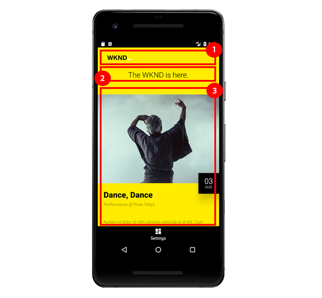

# Hoofdstuk 7 - AEM inhoudsservices van een mobiele app gebruiken

Hoofdstuk 7 van de zelfstudie gebruikt een native Android Mobile-app om inhoud van AEM Content Services te verbruiken.

## De Android Mobile-toepassing

Dit leerprogramma gebruikt a **eenvoudige inheemse Android Mobile App** om de inhoud van de Gebeurtenis te verbruiken en te tonen die door AEM Diensten van de Inhoud wordt blootgesteld.

Het gebruik van [ Android ](https://developer.android.com/) is grotendeels onbelangrijk, en de het verbruiken mobiele app zou in om het even welk kader voor om het even welk mobiel platform, bijvoorbeeld iOS kunnen worden geschreven.

Android wordt gebruikt voor zelfstudie omdat een Android Emulator in Windows, macOs en Linux kan worden uitgevoerd en omdat het populair is en kan worden geschreven als Java, een taal die AEM ontwikkelaars goed begrijpen.

*Android Mobile App van de zelfstudie is **niet**&#x200B;bedoeld om te instrueren hoe te om de Mobiele apps van Android te bouwen of Android ontwikkelingsbeste praktijken over te brengen, maar eerder om te illustreren hoe AEM de Diensten van de Inhoud van een Mobiele Toepassing kunnen worden verbruikt.*

### De manier waarop AEM Content Services de Mobile App Experience



1. Het **embleem** zoals die door de [!DNL Events API] component van het Beeld van de pagina **&#x200B;**&#x200B;wordt bepaald.
1. De **markeringslijn** zoals bepaald op de [!DNL Events API] component van de Tekst van de pagina **&#x200B;**.
1. Deze **lijst van de Gebeurtenis** wordt afgeleid uit de rangschikking van de Fragmenten van de Inhoud van de Gebeurtenis, die via de gevormde **component van de Lijst van het Fragment van de Inhoud** worden blootgesteld.

## Mobiele-toepassingsdemonstratie

>[!VIDEO](https://video.tv.adobe.com/v/28345?quality=12&learn=on)

### De mobiele app configureren voor gebruik buiten de landinstelling

Als AEM Publish niet op **http://localhost:4503** in werking wordt gesteld kunnen de gastheer en de haven in Mobiele App [!DNL Settings] worden bijgewerkt om aan het bezit AEM de gastheer/de haven van Publish te richten.

>[!VIDEO](https://video.tv.adobe.com/v/28344?quality=12&learn=on)

## De mobiele toepassing lokaal uitvoeren

1. Download en installeer de [ Studio van Android ](https://developer.android.com/studio/install) om de Mededinger van Android te installeren.
1. **Download** het dossier van Android [!DNL APK] [ GitHub > Assets > wknd-mobile.x.x.xapk ](https://github.com/adobe/aem-guides-wknd-mobile/releases/latest)
1. Open **de Studio van Android**
   * Bij de eerste keer dat Android Studio wordt gestart, verschijnt de vraag om [!DNL Android SDK] te installeren. Accepteer de standaardinstellingen en voltooi de installatie.
1. Open Android Studio en selecteer **Profiel of zuivert APK**
1. Selecteer het APK- dossier (**wknd-mobile.x.x.x.apk**) dat in Stap 2 wordt gedownload en klik **O.K.**
   * Als ertoe aangezet om **een Nieuwe Omslag** te creëren, of **Bestaand Gebruik**, uitgezocht **Bestaand Gebruik**.
1. Op de aanvankelijke lancering van de Studio van Android, klik op **wknd-mobile.x.x.x** in de lijst van Projecten met de rechtermuisknop aan, en selecteer **Open de Montages van de Module**.
   * Onder **Modules > wknd-mobile.x.x > het lusje van Afhankelijkheden**, uitgezochte **Android API 29 Platform**. Tik op OK om de wijzigingen te sluiten en op te slaan.
   * Als u dit niet doet, wordt de fout &quot;Selecteer Android SDK&quot; weergegeven wanneer u de emulator probeert te starten.
1. Open de **Manager AVD** door **Hulpmiddelen te selecteren > Manager AVD** of het tikken van het **AVD pictogram van de Manager** in de hoogste bar.
1. In het **venster van de Manager AVD**, klik **+ creeer Virtueel Apparaat...** als u nog geen apparaat hebt geregistreerd.
   1. In de linkerzijde, selecteer de **categorie van de Telefoon**.
   1. Selecteer a **Pixel 2**.
   1. Klik de **Volgende** knoop.
   1. Selecteer **Q** met **API Niveau 29**.
      * Wanneer u AVD Manager voor de eerste keer start, wordt u gevraagd de versioned API te downloaden. Klik op de koppeling Downloaden naast de release Q en voltooi het downloaden en installeren.
   1. Klik de **Volgende** knoop.
   1. Klik de **Afwerking** knoop.
1. Sluit het **AVD Manager** venster.
1. In de hoogste menubar selecteert **wknd-mobile.x.x.x** van de **looppas/geef Configuraties** daling uit.
1. Tik de **looppas** knoop naast de geselecteerde **Looppas/geef Configuratie** uit
1. In pop-up, selecteer het pas gecreëerde **[!DNL Pixel 2 API 29]** virtuele apparaat en tik **OK**
1. Als de app [!DNL WKND Mobile] niet direct wordt geladen, zoekt en tikt u op het pictogram **[!DNL WKND]** vanuit het Android-beginscherm in de emulator.
   * Als de emulator start maar het scherm van de emulator zwart blijft, tikt u op de **macht** knop in het gereedschapsvenster van de emulator naast het emulatorvenster.
   * Klik en sleep om binnen het virtuele apparaat te schuiven.
   * Als u de inhoud van AEM wilt vernieuwen, trekt u van boven naar beneden tot het pictogram Vernieuwen
en geeft deze weer.

>[!VIDEO](https://video.tv.adobe.com/v/28341?quality=12&learn=on)

## De mobiele toepassingscode

In deze sectie wordt de Android Mobile App-code gemarkeerd die het meest interageert en afhankelijk is van AEM Content Services en die JSON-uitvoer is.

Tijdens het laden maakt de Mobile App `HTTP GET` naar `/content/wknd-mobile/en/api/events.model.json` . Dit is het eindpunt voor AEM Content Services dat is geconfigureerd om de inhoud te leveren waarmee de Mobile App kan worden gestart.

Omdat het Bewerkbare Malplaatje van de Gebeurtenis API (`/content/wknd-mobile/en/api/events.model.json`) wordt gesloten, kan de Mobiele App worden gecodeerd om naar specifieke informatie in specifieke plaatsen in de reactie te zoeken JSON.

### Codestroom op hoog niveau

1. Als u de [!DNL WKND Mobile] -app opent, wordt een `HTTP GET` aanvraag naar de AEM Publish op `/content/wknd-mobile/en/api/events.model.json` aangeroepen om de inhoud te verzamelen en de gebruikersinterface van de Mobile App te vullen.
2. Op het ontvangen van de inhoud van AEM, worden elk van de drie meningselementen van Mobiele App, het **embleem, de markeringslijn en de gebeurtenislijst**, geïnitialiseerd met de inhoud van AEM.
   * Om aan de AEM inhoud aan het de meningselement van de Mobiele App te binden, wordt JSON die elke AEM component vertegenwoordigt, voorwerp in kaart gebracht aan een POJO van Java, die beurtelings aan het element van de Mening van Android verbindend is.
      * Afbeeldingscomponent JSON → Logo POJO → Logo ImageView
      * Tekstcomponent JSON → TagLine POJO → Text ImageView
      * JSON → Events POJO Events RecyclerView
   * *de Mobiele code van de App kan JSON aan POJOs wegens de bekende plaatsen binnen de grotere reactie JSON in kaart brengen. Onthoud dat de JSON-toetsen &quot;image&quot;, &quot;text&quot; en &quot;contentfragmentlist&quot; worden gedicteerd door de namen van de knooppunten van AEM. Als deze knooppuntnamen veranderen, dan zal Mobiele App breken aangezien het niet zal weten hoe te om de vereiste inhoud van de JSON gegevens te bron.*

#### Het aanhalen van het eindpunt van de Diensten van de Inhoud van de AEM

Hieronder volgt een destillatie van de code in de Mobile App `MainActivity` die verantwoordelijk is voor het aanroepen van AEM Content Services om de inhoud te verzamelen die de Mobile App-ervaring aandrijft.

```
protected void onCreate(Bundle savedInstanceState) {
    ...
    // Create the custom objects that will map the JSON -> POJO -> View elements
    final List<ViewBinder> viewBinders = new ArrayList<>();

    viewBinders.add(new LogoViewBinder(this, getAemHost(), (ImageView) findViewById(R.id.logo)));
    viewBinders.add(new TagLineViewBinder(this, (TextView) findViewById(R.id.tagLine)));
    viewBinders.add(new EventsViewBinder(this, getAemHost(), (RecyclerView) findViewById(R.id.eventsList)));
    ...
    initApp(viewBinders);
}

private void initApp(final List<ViewBinder> viewBinders) {
    final String aemUrl = getAemUrl(); // -> http://localhost:4503/content/wknd-mobile/en/api/events.mobile.json
    JsonObjectRequest request = new JsonObjectRequest(aemUrl, null,
        new Response.Listener<JSONObject>() {
            @Override
            public void onResponse(JSONObject response) {
                for (final ViewBinder viewBinder : viewBinders) {
                    viewBinder.bind(response);
                }
            }
        },
        ...
    );
}
```

`onCreate(..)` is de initialisatiehaak voor de Mobile-app en registreert de 3 aangepaste `ViewBinders` die verantwoordelijk is voor het parseren van de JSON en het binden van de waarden aan de `View` -elementen.

`initApp(...)` wordt vervolgens aangeroepen, zodat de HTTP-GET bij het eindpunt van AEM Content Services voor AEM Publish een aanvraag indient om de inhoud te verzamelen. Na ontvangst van een geldige JSON-respons wordt de JSON-respons doorgegeven aan elke `ViewBinder` die verantwoordelijk is voor het parseren van de JSON en het binden ervan aan de mobiele `View` -elementen.

#### De JSON-respons parseren

Hierna bekijken we de `LogoViewBinder` . Dit is eenvoudig, maar er worden enkele belangrijke overwegingen benadrukt.

```
public class LogoViewBinder implements ViewBinder {
    ...
    public void bind(JSONObject jsonResponse) throws JSONException, IOException {
        final JSONObject components = jsonResponse.getJSONObject(":items").getJSONObject("root").getJSONObject(":items");

        if (components.has("image")) {
            final Image image = objectMapper.readValue(components.getJSONObject("image").toString(), Image.class);

            final String imageUrl = aemHost + image.getSrc();
            Glide.with(context).load(imageUrl).into(logo);
        } else {
            Log.d("WKND", "Missing Logo");
        }
    }
}
```

De eerste lijn van `bind(...)` navigeert onderaan de Reactie JSON via de sleutels **:punten → wortel → :items** die de AEM Container van de Lay-out vertegenwoordigt de componenten werden toegevoegd aan.

Van hier wordt een controle gemaakt voor een zeer belangrijke genoemd **beeld**, dat de component van het Beeld vertegenwoordigt (opnieuw, is het belangrijk deze knoopnaam → sleutel JSON stabiel). Als dit voorwerp bestaat, leest het en in kaart gebracht aan [ POJO van het douanebeeld ](#image-pojo) via de bibliotheek van het Jackson `ObjectMapper`. De POJO van de afbeelding wordt hieronder besproken.

Ten slotte wordt het logo `src` in de Android ImageView geladen met behulp van de [!DNL Glide] hulplijnbibliotheek.

U ziet dat we het AEM schema, de host en de poort (via `aemHost`) aan de AEM Publish-instantie moeten leveren, omdat AEM Content Services alleen het JCR-pad (dat wil zeggen: `/content/dam/wknd-mobile/images/wknd-logo.png` ) naar de inhoud waarnaar wordt verwezen.

#### De afbeeldingspo{#image-pojo}

Terwijl facultatief, het gebruik van [ Jackson ObjectMapper ](https://fasterxml.github.io/jackson-databind/javadoc/2.9/com/fasterxml/jackson/databind/ObjectMapper.html) of gelijkaardige mogelijkheden die door andere bibliotheken zoals Gson worden verstrekt, helpt complexe structuren JSON aan POJOs van Java in kaart te brengen zonder het middel om direct met de inheemse JSON voorwerpen zelf te behandelen. In dit eenvoudige geval wijzen we de `src` -toets van het `image` JSON-object rechtstreeks via de `@JSONProperty` -annotatie toe aan het `src` -kenmerk in de afbeeldingspo.

```
package com.adobe.aem.guides.wknd.mobile.android.models;

import com.fasterxml.jackson.annotation.JsonProperty;

public class Image {
    @JsonProperty(value = "src")
    private String src;

    public String getSrc() {
        return src;
    }
}
```

De POJO van de Gebeurtenis, die het selecteren van vele meer gegevenspunten van het voorwerp JSON vereist, profiteert van deze techniek meer dan het eenvoudige Beeld, wat wij allen willen is `src`.

## Ontdek de Mobile App Experience

Nu u weet hoe AEM Content Services native mobiele ervaring kan aansturen, kunt u gebruiken wat u hebt geleerd om de volgende stappen uit te voeren en uw wijzigingen te bekijken in de mobiele app.

Na elke stap vernieuwt u de Mobile-app en controleert u de update van de mobiele ervaring.

1. Creeer en publiceer **nieuw [!DNL Event] Fragment van de Inhoud**
1. Publiceer **bestaand [!DNL Event] het Fragment van de Inhoud**
1. Publish een update aan de **Lijn van de Markering**

## Gefeliciteerd

**u hebt voltooid met het AEM Hoofdloze leerprogramma!**

Voor meer informatie over AEM Content Services en AEM als een Headless CMS raadpleegt u de andere documentatie en materialen voor activering van de Adobe:

* [ Gebruikend Inhoudsfragmenten ](https://experienceleague.adobe.com/docs/experience-manager-learn/sites/content-fragments/understand-content-fragments-and-experience-fragments.html?lang=nl-NL)
* [ AEM WCM de Gids van de Gebruiker van de Componenten van de Kern ](https://experienceleague.adobe.com/docs/experience-manager-core-components/using/introduction.html?lang=nl-NL)
* [ AEM WCM de Bibliotheek van de Component van de Kern van Componenten ](https://opensource.adobe.com/aem-core-wcm-components/library.html)
* [ AEM het Project van GitHub van de Componenten van de Kern WCM ](https://github.com/adobe/aem-core-wcm-components)
* [ Steekproef van de Code van de Exporteur van de Component ](https://github.com/Adobe-Consulting-Services/acs-aem-samples/blob/master/core/src/main/java/com/adobe/acs/samples/models/SampleComponentExporter.java)
