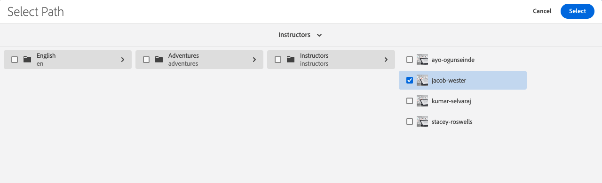

# Inhoudsfragmenten auteur

In het [ vorige hoofdstuk ](/help/headless-tutorial/graphql/advanced-graphql/create-content-fragment-models.md), creeerde u vijf Modellen van het Fragment van de Inhoud: Persoon, Team, Plaats, Adres, en Info van het Contact. Dit hoofdstuk doorloopt u de stappen om Inhoudsfragmenten tot stand te brengen die op die modellen worden gebaseerd. Ook wordt uitgelegd hoe u mapbeleid kunt maken om te beperken welke modellen van inhoudsfragmenten in de map kunnen worden gebruikt.

## Vereisten {#prerequisites}

Dit document is onderdeel van een zelfstudie met meerdere onderdelen. Gelieve te zorgen ervoor dat het [ vorige hoofdstuk ](create-content-fragment-models.md) is voltooid alvorens met dit hoofdstuk te werk te gaan.

## Doelstellingen {#objectives}

Leer in dit hoofdstuk hoe te:

* Mappen maken en limieten instellen met behulp van mapbeleid
* Fragmentverwijzingen rechtstreeks maken vanuit de Inhoudsfragmenteditor
* Gegevenstypen Tab, Date en JSON-object gebruiken
* Inhoud- en fragmentverwijzingen invoegen in de teksteditor met meerdere regels
* Meerdere fragmentverwijzingen toevoegen
* Inhoudsfragmenten nesten

## Voorbeeldinhoud installeren {#sample-content}

Installeer een AEM-pakket dat meerdere mappen en voorbeeldafbeeldingen bevat die worden gebruikt om de zelfstudie te versnellen.

1. Download [ geavanceerd-GraphQL-Tutorial-Starter-Pakket-1.1.zip ](/help/headless-tutorial/graphql/advanced-graphql/assets/tutorial-files/Advanced-GraphQL-Tutorial-Starter-Package-1.1.zip)
1. In AEM, navigeer aan **Hulpmiddelen** > **Plaatsing** > **Pakketten** om tot **de Manager van het Pakket** toegang te hebben.
1. Upload en installeer het pakket (ZIP-bestand) dat u in de vorige stap hebt gedownload.

   

## Mappen maken en limieten instellen met behulp van mapbeleid

Van de homepage van AEM, uitgezochte **Assets** > **Dossiers** > **Gedeelde WKND** > **Engels**. Hier ziet u de verschillende categorieën van het Fragment van de Inhoud, met inbegrip van avonturen en Medewerkers.

### Mappen maken {#create-folders}

Navigeer in de **omslag Adventures**. U ziet dat er al mappen voor teams en locaties zijn gemaakt voor het opslaan van de fragmenten voor teams en locaties.

Creeer een omslag voor de Fragmenten van de Inhoud van Instructeurs die op het Model van het Fragment van de Inhoud van de Persoon gebaseerd zijn.

1. Van de pagina van avonturen, creeer **&#x200B;**&#x200B;> **Omslag** in de hoger-juiste hoek.

   

1. In Create de modale van de Omslag die verschijnt, ga &quot;Instructeurs&quot;op het **gebied van de Titel** in. Noteer de &#39;s&#39; aan het einde. Titels van de mappen die veel fragmenten bevatten, moeten meervoudig zijn. Selecteer **creeer**.

   

   U hebt nu een map gemaakt voor de opslag van Adventure-instructeurs.

### Limieten instellen met behulp van mapbeleid

Met AEM kunt u machtigingen en beleid voor mappen met inhoudsfragmenten definiëren. Door toestemmingen te gebruiken, kunt u slechts bepaalde gebruikers (auteurs) of groepen auteurs toegang tot bepaalde omslagen verlenen. Met behulp van mapbeleid kunt u beperken welke modellen van inhoudsfragmenten auteurs in die mappen kunnen gebruiken. In dit voorbeeld, beperken wij een omslag tot de Persoon en de modellen van Info van het Contact. Een mapbeleid configureren:

1. Selecteer de **omslag van Instructeurs** die u hebt gecreeerd, dan selecteren **Eigenschappen** van de hoogste navigatiebar.

   

1. Selecteer het **Beleid** lusje, toen de-uitgezochte **Geërft van /content/dam/wknd-shared**. In het **Toegestane Modellen van het Fragment van de Inhoud door het gebied van de Weg**, selecteer het omslagpictogram.

   

1. In de Uitgezochte dialoog van de Weg die opent, volg de weg **conf** > **Gedeelde WKND**. Het model van het Fragmentmodel van de Inhoud van de Persoon, dat in het vorige hoofdstuk wordt gecreeerd, bevat een verwijzing naar het Model van het Fragment van de Fragment van de Inhoud van het Contact van Info. Zowel moeten Person als de modellen van Info van het Contact in de omslag van Instructeurs worden toegestaan om een Fragment van de Inhoud van de Instructeur tot stand te brengen. Selecteer **Persoon** en **Info van het Contact**, dan pers **Uitgezocht** om de dialoog te sluiten.

   

1. Selecteer **sparen en Sluiten** en selecteer **O.K.** in de succesdialoog die verschijnt.

1. U hebt nu een omslagbeleid voor de omslag van Instructeurs gevormd. Navigeer in de **omslag van Instructeurs** en selecteer **creeer** > **het Fragment van de Inhoud**. De enige modellen die u kunt nu selecteren zijn **Persoon** en **Info van het Contact**.

   

## Inhoudsfragmenten auteur voor instructeurs

Navigeer in de **omslag van Instructeurs**. Van hier, creëren wij een genestelde omslag om de contactinformatie van de Instructeurs op te slaan.

Volg de stappen in de sectie over [ worden geschetst creërend omslagen ](#create-folders) om een omslag tot stand te brengen die &quot;Info van het Contact&quot;wordt genoemd. De geneste map overerft het mapbeleid van de bovenliggende map. Voel vrij om specifieker beleid te vormen zodat laat de pas gecreëerde omslag slechts het model van Info van het Contact toe worden gebruikt.

### Een instructiefragment maken

Laten we vier mensen maken die aan een team van Adventure-instructeurs kunnen worden toegevoegd.

1. Maak in de map Instructors een inhoudsfragment op basis van het Person Content Fragment-model en geef dit de titel &quot;Jacob Wester&quot;.

   Het nieuwe inhoudsfragment ziet er als volgt uit:

   

1. Voer de volgende inhoud in de velden in:

   * **Volledige Naam**: Jacob Wester
   * **Biografie**: Jacob Wester is een wandelende instructeur tien jaar geweest en heeft van elke minuut van het gehouden! Jacob is een avontuurzoeker met talent voor het klimmen en terugpakken van rotsen. Jacob is de winnaar van de beklimmingswedstrijden, waaronder de veetel van de bouldering-wedstrijd. Jacob woont momenteel in Californië.
   * **Niveau van de Ervaring van de Instructeur**: Expert
   * **Vaardigheden**: Klimmen van de steen, Surfen, Achterverpakking
   * **Details van de Beheerder**: Jacob Wester heeft backpackaging avventures voor drie jaar gecoördineerd.

1. Op het **gebied van het Beeld van het 1&rbrace; Profiel van 0&rbrace;, voeg een inhoudsverwijzing naar een beeld toe.** Blader aan **Gedeelde WKND** > **Engels** > **Medewerkers** > **jacob_wester.jpg** om een weg aan het beeld tot stand te brengen.

### Een fragmentverwijzing maken met de editor voor fragmentfragmenten {#fragment-reference-from-editor}

Met AEM kunt u rechtstreeks vanuit de Inhoudsfragmenteditor een fragmentverwijzing maken. Laten we een verwijzing naar de contactgegevens van Jacob maken.

1. Selecteer **Nieuw Fragment van de Inhoud** onder het **Info van het Contact** gebied.

   

1. De modus Nieuw inhoudsfragment wordt geopend. Onder het Uitgezochte lusje van de Bestemming, volg de weg **avonturen** > **Instructeurs** en selecteer checkbox naast de **omslag van Info van het Contact**. Selecteer **daarna** om aan het lusje van Eigenschappen te werk te gaan.

   

1. Onder het lusje van Eigenschappen, ga &quot;Info van het Contact van het Wester van Jacob&quot;op het **gebied van de Titel** in. Selecteer **creeer**, dan druk **Open** in de succesdialoog die verschijnt.

   

   Er worden nieuwe velden weergegeven waarmee u het inhoudsfragment Contactinfo kunt bewerken.

   

1. Voer de volgende inhoud in de velden in:

   * **Telefoon**: 209-888-0000
   * **E-mail**: jwester@wknd.com

   Wanneer voltooid, uitgezocht **sparen**. U hebt nu een fragment met contactinfo-inhoud gemaakt.

1. Om terug naar het Fragment van de Inhoud van de Instructeur te navigeren, uitgezochte **Wester van de Jacob** in de hoogste-linkerhoek van de redacteur.

   

   Het **gebied van Info van het Contact** bevat nu de weg aan het referenced fragment van Info van het Contact. Dit is een geneste fragmentverwijzing. Het voltooide Fragment van de Inhoud van de Instructeur kijkt als dit:

   

1. Selecteer **sparen en Sluiten** om het Fragment van de Inhoud te bewaren. U hebt nu een nieuw Fragment van de Inhoud van de Instructeur.

### Aanvullende fragmenten maken

Volg door het zelfde proces zoals die in de [ vorige sectie ](#fragment-reference-from-editor) worden geschetst om drie meer Fragmenten van de Inhoud van Instructeurs en drie de Inhoudsfragmenten van Info van het Contact voor deze Instructeurs tot stand te brengen. Voeg de volgende inhoud in de fragmenten van Instructors toe:

**Stacey Roswells**

| Velden | Waarden |
| --- | --- |
| Titel van inhoudsfragment | Stacey Roswells |
| Volledige naam | Stacey Roswells |
| Contactinfo | /content/dam/wknd-shared/nl/avventures/instructors/contact-info/stack-roswells-contact-info |
| Profielafbeelding | /content/dam/wknd-shared/en/contributors/stacey-roswells.jpg |
| Biografie | Stacey Roswells is een volmaakte rockklimmer en alpenavonturer. Geboren in Baltimore, Maryland, Stacey is de jongste van zes kinderen. De vader van Stacey was een luitenant-kolonel bij de Amerikaanse marine en de moeder was een moderne dansinstructeur. De familie van Stacey verhuisde regelmatig met de taken van de vader en nam de eerste foto toen de vader in Thailand was gestationeerd. Dit is ook waar Stacey leerde klimmen. |
| Erviteitsniveau instructeur | Geavanceerd |
| Vaardigheden | Rotsklimmen | Skieten | Achteruitpakken |

**Kumar Selvaraj**

| Velden | Waarden |
| --- | --- |
| Titel van inhoudsfragment | Kumar Selvaraj |
| Volledige naam | Kumar Selvaraj |
| Contactinfo | /content/dam/wknd-shared/nl/adventures/instructors/contact-info/kumar-selvaraj-contact-info |
| Profielafbeelding | /content/dam/wknd-shared/en/contributors/kumar-selvaraj.jpg |
| Biografie | Kumar Selvaraj is een ervaren AMGA-gecertificeerde professionele instructeur die als belangrijkste doel heeft studenten te helpen hun klimmen- en wandelvaardigheden te verbeteren. |
| Erviteitsniveau instructeur | Geavanceerd |
| Vaardigheden | Rotsklimmen | Achteruitpakken |

**Ayo Ogunsede**

| Velden | Waarden |
| --- | --- |
| Titel van inhoudsfragment | Ayo Ogunsede |
| Volledige naam | Ayo Ogunsede |
| Contactinfo | /content/dam/wknd-shared/nl/adventures/instructors/contact-info/ayo-ogunsede-contact-info |
| Profielafbeelding | /content/dam/wknd-shared/en/contributors/ayo-ogunseinde-237739.jpg |
| Biografie | Ayo Ogunsede is een professionele klimmer- en achtergrondinstructeur die in Fresno, Centraal-Californië woont. Ayo&#39;s doel is om fietsers te begeleiden op hun meest episch-nationale park avonturen. |
| Erviteitsniveau instructeur | Geavanceerd |
| Vaardigheden | Rotsklimmen | Cycli | Achteruitpakken |

Laat het **Extra gebied van de Informatie** leeg.

Voeg de volgende informatie toe aan de fragmenten Contactinfo:

| Titel van inhoudsfragment | Telefoon | E-mail |
| ------- | -------- | -------- |
| Contactinfo Stacey Roswells | 2009-888-0011 | sroswells@wknd.com |
| Contactinfo Kumar Selvaraj | 2009-888-0002 | kselvaraj@wknd.com |
| Contactinfo Ayo Ogunsede | 2009-888-0304 | aogunseinde@wknd.com |

U bent nu klaar om een Team te creëren!

## Inhoudsfragmenten voor auteur voor locaties

Navigeer in de **omslag van Plaatsen**. Hier ziet u twee geneste mappen die al zijn gemaakt: Yosemite National Park en Yosemite Valley Lodge.


Negeer de map Yosemite Valley Lodge voorlopig. Wij keren aan het later in deze sectie terug wanneer wij een plaats creëren die als Basis van het Huis voor ons team van instructeurs dienst doet.

Navigeer in de **omslag van het Nationaal Park van 0&rbrace; Yosemite.** Op dit moment bevat het slechts een foto van het Yosemite National Park. Laten we een inhoudsfragment maken met behulp van het Locatie-inhoudsfragmentmodel en dit &#39;Yosemite National Park&#39; noemen.

### Plaatsaanduidingen voor tabbladen

Met AEM kunt u plaatsaanduidingen op tabbladen gebruiken om verschillende typen inhoud te groeperen en uw inhoudsfragmenten leesbaarder en eenvoudiger te beheren. In het vorige hoofdstuk hebt u tabplaatsaanduidingen toegevoegd aan het locatiemodel. Dientengevolge, heeft het Fragment van de Inhoud van de Plaats nu twee lusjesecties: **Details van de Plaats** en **Adres van de Plaats**.


Het **lusje van de Details van de Plaats** bevat de **Naam**, **Beschrijving**, **Info van het Contact**, **Beeld van de Plaats**, en **Weer door de gebieden van de Seizoen**, terwijl het **Adres van de Plaats** lusje een verwijzing naar een Fragment van de Inhoud van het Adres bevat. Op de tabbladen wordt duidelijk aangegeven in welke typen inhoud de inhoud moet worden ingevuld. Het is dus gemakkelijker om inhoud te schrijven.

### JSON Object, gegevenstype

Het **Weather door Sason** gebied is een gegevenstype van Objecten JSON, zo betekent het dat het gegevens in formaat JSON goedkeurt. Dit gegevenstype is flexibel en kan worden gebruikt voor alle gegevens die u in de inhoud wilt opnemen.

U kunt de veldbeschrijving zien die in het vorige hoofdstuk is gemaakt door de muisaanwijzer op het informatiepictogram rechts van het veld te plaatsen.


In dit geval moeten we het gemiddelde weer voor de locatie opgeven. Voer de volgende gegevens in:

```json
{
    "summer": "81 / 89°F",
    "fall": "56 / 83°F",
    "winter": "46 / 51°F",
    "spring": "57 / 71°F"
}
```

Het **Weather door Seizoen** gebied zou nu als dit moeten kijken:


### Inhoud toevoegen

Voeg de rest van de inhoud toe aan het fragment Locatie-inhoud om de informatie met GraphQL in het volgende hoofdstuk op te vragen.

1. In het **lusje van de Details van de Plaats**, ga de volgende informatie in de gebieden in:

   * **Naam**: Yosemite Nationaal Park
   * **Beschrijving**: Het Nationale Park van Yosemite is in de bergen van Sierra Nevada van Californië. Het is beroemd om zijn prachtige watervallen, gigantische sequoia-bomen en iconische weergaven van El Capitan en Half Dome-kliffen. Wandelen en kamperen zijn de beste manieren om Josemite te ervaren. Talloze sporen bieden eindeloze kansen voor avontuur en exploratie.

1. Van het **gebied van Info van het Contact**, creeer een Fragment van de Inhoud dat op het model van Info van het Contact wordt gebaseerd en titel het &quot;Informatie van het Contact van het Nationaal Park Yosemite&quot;. Volg het zelfde proces zoals die in de vorige sectie worden geschetst op [ creërend een fragmentverwijzing van de redacteur ](#fragment-reference-from-editor) en ga de volgende gegevens in de gebieden in:

   * **Telefoon**: 209-999-0000
   * **E-mail**: yosemite@wknd.com

1. Van het **gebied van het Beeld van de Plaats van de Plaats**, doorblader aan **avonturen** > **Plaats** > **Yosemite Nationaal Park** > **yosemite-national-park.jpeg** om een weg aan het beeld tot stand te brengen.

   Herinner me, in het vorige hoofdstuk dat u de beeldbevestiging vormde, zodat moeten de afmetingen van het beeld van de Plaats minder dan 2560 x 1800 zijn, en zijn dossiergrootte moet minder dan 3 MB zijn.

1. Met alle toegevoegde informatie, kijkt het **lusje van de Details van de Plaats** nu als dit:

   

1. Navigeer in het **Adres van de Plaats** lusje. Van het **gebied van het Adres**, creeer een Fragment van de Inhoud getiteld &quot;het Adres van het Nationaal Park Yosemite&quot;gebruikend het Model van het Fragment van de Inhoud van het Adres dat u in het vorige hoofdstuk creeerde. Volg het zelfde proces zoals die in de sectie op [ worden geschetst creërend een fragmentverwijzing van de redacteur ](#fragment-reference-from-editor) en ga de volgende gegevens in de gebieden in:

   * **Adres van de Straat**: 9010 Curry Village Drive
   * **Stad**: Yosemite Valley
   * **Staat**: CA
   * **Postcode**: 95389
   * **Land**: Verenigde Staten

1. Het voltooide **lusje van het Adres van de Plaats** van het fragment van het Nationaal Park van Yosemite kijkt als dit:

   

1. Selecteer **sparen en Sluiten**.

### Nog een fragment maken

1. Navigeer in de **omslag van de Lodge van de Vallei Yosemite**. Maak een inhoudsfragment met het Locatie-inhoudsfragmentmodel en noem dit &#39;Yosemite Valley Lodge&#39;.

1. In het **lusje van de Details van de Plaats**, ga de volgende informatie in de gebieden in:

   * **Naam**: Josemite Valley Lodge
   * **Beschrijving**: Yosemite Valley Lodge is een hub voor groepsvergaderingen en allerlei activiteiten, zoals winkelen, dineren, vissen, wandelend, en vele meer.

1. Van het **gebied van Info van het Contact**, creeer een Fragment van de Inhoud dat op het model van Info van het Contact wordt gebaseerd en titel het &quot;Info van het Contact van de Lodge van de Vallei Yosemite&quot;. Volg het zelfde proces zoals die in de sectie op [ worden geschetst creërend een fragmentverwijzing van de redacteur ](#fragment-reference-from-editor) en ga de volgende gegevens in de gebieden van het nieuwe Fragment van de Inhoud in:

   * **Telefoon**: 209-992-0000
   * **E-mail**: yosemitelodge@wknd.com

   Sla het nieuwe inhoudsfragment op.

1. Navigeer terug naar **Yosemite Valley Lodge** en ga naar het **Adres van de Plaats** lusje. Van het **gebied van het Adres**, creeer een Fragment van de Inhoud getiteld &quot;het Adres van de Lodge van de Vallei van Yosemite&quot;gebruikend het Model van het Fragment van de Inhoud van het Adres dat u in het vorige hoofdstuk creeerde. Volg het zelfde proces zoals die in de sectie op [ worden geschetst creërend een fragmentverwijzing van de redacteur ](#fragment-reference-from-editor) en ga de volgende gegevens in de gebieden in:

   * **Adres van de Straat**: De Aandrijving van 9006 Yosemite
   * **Stad**: Nationaal Park Yosemite
   * **Staat**: CA
   * **Postcode**: 95389
   * **Land**: Verenigde Staten

   Sla het nieuwe inhoudsfragment op.

1. Navigeer terug naar **Yosemite Valley Lodge**, dan uitgezocht **sparen en sluit**. De {**omslag van de Lodge van de Lodge van de Vallei 0} Yosemite bevat nu drie Fragments van de Inhoud: de Lodge van de Vallei van Yosemite, de Informatie van het Contact van de Lodge van de Lodge van Yosemite, en het Adres van de Lodge van de Lodge van de Vallei van Yosemite.**

   

## Auteur a Team Content Fragment

Blader omslagen aan **Teams** > **Team Yosemite**. U ziet dat de map Yosemite Team momenteel alleen het teamlogo bevat.


Laten we een inhoudsfragment maken met behulp van het model voor het fragment met teaminhoud en dit de titel &quot;Yosemite Team&quot; geven.

### Inhoud- en fragmentverwijzingen in de teksteditor met meerdere regels

Met AEM kunt u inhoud en fragmentverwijzingen rechtstreeks toevoegen aan de teksteditor met meerdere regels en deze later ophalen met GraphQL-query&#39;s. Laten wij zowel inhoud als fragmentverwijzingen in het **gebied van de Beschrijving** toevoegen.

1. Eerst, voeg de volgende tekst in het **gebied van de Beschrijving** toe: &quot;Het team van professionele avonturers en het trekken instructeurs die in het Nationale Park van Josemite werken.&quot;

1. Om een inhoudsverwijzing toe te voegen, selecteer het **activa van het Tussenvoegsel** pictogram in de toolbar van de multi-lijn tekstredacteur.

   

1. In modaal die verschijnt, selecteer **team-yosemite-logo.png** en druk **Uitgezocht**.

   

   De inhoudsverwijzing wordt nu toegevoegd aan het **gebied van de Beschrijving**.

Herinner me, in het vorige hoofdstuk u fragmentverwijzingen toe om aan het **gebied van de Beschrijving** worden toegevoegd. Laten we er een toevoegen.

1. Selecteer het **pictogram van het Fragment van de Inhoud van het Tussenvoegsel** in de toolbar van de multi-lijn tekstredacteur.

   

1. Blader aan **Gedeelde WKND** > **Engels** > **Vluchtelingen** > **Plaatsen** > **Yosemite Valley Lodge** > **Yosemite Valley Lodge**. Pers **Uitgezocht** om het Fragment van de Inhoud op te nemen.

    toe

   Het **gebied van de Beschrijving** kijkt nu als het volgende:

   

U hebt nu de inhoud en fragmentverwijzingen rechtstreeks toegevoegd aan de teksteditor met meerdere regels.

### Gegevenstype datum en tijd

Laten we eens kijken naar het gegevenstype Datum en tijd. Selecteer het **pictogram van de Kalender** op de rechterkant van het **Begeleidende gebied van de Datum van het Team** om de kalendermening te openen.


De datums in het verleden of in de toekomst kunnen worden ingesteld met de pijlen naar voren en naar achteren aan weerszijden van de maand. Laten we zeggen dat het team Yosemite op 24 mei 2016 is opgericht, dus we zullen de datum daarvoor vaststellen.

### Meerdere fragmentverwijzingen toevoegen

Laten wij Instructeurs aan de het fragmentverwijzing van de Leden van het Team toevoegen.

1. Selecteer **toevoegen** op het **3&rbrace; gebied van de Leden van het Team &lbrace;.**

    toe

1. Selecteer in het nieuwe veld dat wordt weergegeven het mappictogram om het modaal pad selecteren te openen. Doorblader door omslagen aan **Gedeelde WKND** > **Engels** > **Vluchtelingen** > **Instructeurs**, dan selecteren checkbox naast **jangob-wester**. Pers **Uitgezocht** om de weg te bewaren.

   

1. Selecteer **voeg** knoop nog drie keer toe. Gebruik de nieuwe gebieden om de resterende drie Instructeurs aan het team toe te voegen. Het **gebied van de Leden van het Team** kijkt nu als dit:

   

1. Selecteer **sparen en Sluiten** om het Fragment van de Inhoud van het Team te bewaren.

### Fragmentverwijzingen toevoegen aan een Adventure Content-fragment

Tot slot voegen onze pas gecreëerde Fragments van de Inhoud aan een Avontuur toe.

1. Navigeer aan **avonturen** > **Yosemite Backpackaging** en open het Fragment van de Inhoud van de Achterverpakking van Yosemite. Bij de bodem van de vorm, kunt u de drie gebieden zien die u in het vorige hoofdstuk hebt gecreeerd: **Plaats**, **Team van de Instructeur**, en **Beheerder**.

1. Voeg de fragmentverwijzing op het **gebied van de Plaats** toe. Het Locatiepad verwijst naar het Yosemite National Park Content Fragment dat u hebt gemaakt: `/content/dam/wknd-shared/en/adventures/locations/yosemite-national-park/yosemite-national-park` .

1. Voeg de fragmentverwijzing op het **gebied van het Team van de Instructeur 1&rbrace; toe.** Het pad Team moet verwijzen naar het Content Fragment Yosemite Team dat u hebt gemaakt: `/content/dam/wknd-shared/en/adventures/teams/yosemite-team/yosemite-team` . Dit is een geneste fragmentverwijzing. Het fragment van de Inhoud van het Team bevat een verwijzing naar het model van de Persoon dat verwijzingenInfo en de modellen van het Adres van het Contact. Daarom hebt u geneste inhoudsfragmenten drie niveaus omlaag.

1. Voeg de fragmentverwijzing op het **gebied van de Beheerder** toe. Laten we zeggen dat Jacob Wester een beheerder is voor het Yosemite Backpackaging Adventure. Het pad moet leiden naar het Jacob Wester-inhoudsfragment en er als volgt uitzien: `/content/dam/wknd-shared/en/adventures/instructors/jacob-wester` .

1. U hebt nu drie fragmentverwijzingen toegevoegd aan een Adventure Content-fragment. De velden zien er als volgt uit:

   

1. Selecteer **sparen en Sluiten** om uw inhoud te bewaren.

## Gefeliciteerd!

Gefeliciteerd! U hebt nu inhoudsfragmenten gemaakt op basis van de geavanceerde modellen van inhoudsfragmenten die in het vorige hoofdstuk zijn gemaakt. U hebt ook een mapbeleid gemaakt om te beperken welke modellen van inhoudsfragmenten in een map kunnen worden geselecteerd.

## Volgende stappen

In het [ volgende hoofdstuk ](/help/headless-tutorial/graphql/advanced-graphql/explore-graphql-api.md), leert u over het verzenden van geavanceerde vragen van GraphQL gebruikend GrahiQL Geïntegreerde Milieu van de Ontwikkeling (winde). Met deze query&#39;s kunnen we de gegevens bekijken die in dit hoofdstuk zijn gemaakt en deze query&#39;s uiteindelijk toevoegen aan de WKND-app.
