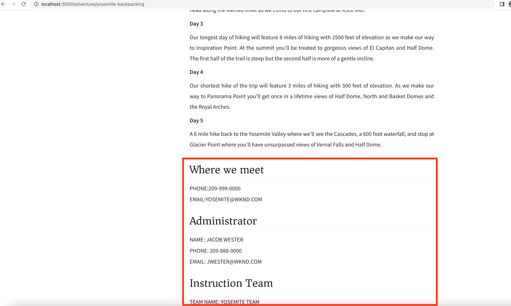

# Integratie van clienttoepassingen

In het vorige hoofdstuk, creeerde en bijwerkte voortgeduurde vragen gebruikend Ontdekkingsreiziger GraphiQL.

In dit hoofdstuk worden de stappen doorlopen waarmee u de voortgezette query&#39;s kunt integreren met de WKND-clienttoepassing (ook wel WKND App genoemd) met gebruik van HTTP-GET-aanvragen binnen bestaande toepassingen **Reageren op componenten**. Het biedt ook een optionele uitdaging om uw AEM headless lessen toe te passen, codeerexpertise om de WKND-clienttoepassing te verbeteren.

## Vereisten {#prerequisites}

Dit document is onderdeel van een zelfstudie met meerdere onderdelen. Controleer of de vorige hoofdstukken zijn voltooid voordat u verdergaat met dit hoofdstuk. De WKND cliënttoepassing verbindt met AEM publicatieservice, zodat is het belangrijk dat u **heeft het volgende gepubliceerd naar de AEM-publicatieservice**.

* Projectconfiguraties
* GraphQL-eindpunten
* Modellen van inhoudsfragmenten
* Geautoriseerde inhoudsfragmenten
* GraphQL blijft vragen

De _IDE screenshots in dit hoofdstuk komen van [Visual Studio-code](https://code.visualstudio.com/)_

### Hoofdstuk 1-4 Oplossingspakket (optioneel) {#solution-package}

Er is een oplossingspakket beschikbaar om te worden geïnstalleerd dat de stappen in AEM UI voor hoofdstukken 1-4 voltooit. Dit pakket is **niet nodig** indien de vorige hoofdstukken zijn afgesloten.

1. Downloaden [Advanced-GraphQL-Tutorial-Solution-Package-1.2.zip](/help/headless-tutorial/graphql/advanced-graphql/assets/tutorial-files/Advanced-GraphQL-Tutorial-Solution-Package-1.2.zip).
1. Navigeer in AEM naar **Gereedschappen** > **Implementatie** > **Pakketten** toegang tot **Pakketbeheer**.
1. Upload en installeer het pakket (ZIP-bestand) dat u in de vorige stap hebt gedownload.
1. Repliceer het pakket naar de AEM-service Publiceren

## Doelstellingen {#objectives}

In deze zelfstudie leert u hoe u de aanvragen voor voortgezette query&#39;s kunt integreren in de voorbeeldtoepassing WKND GraphQL React met de opdracht [AEM headless-client voor JavaScript](https://github.com/adobe/aem-headless-client-js).

## De voorbeeldclienttoepassing klonen en uitvoeren {#clone-client-app}

Om de zelfstudie te versnellen, wordt een startapp van React JS geleverd.

1. Klonen met [adobe/aem-guides-wknd-graphql](https://github.com/adobe/aem-guides-wknd-graphql) opslagplaats:

   ```shell
   $ git clone git@github.com:adobe/aem-guides-wknd-graphql.git
   ```

1. Bewerk de `aem-guides-wknd-graphql/advanced-tutorial/.env.development` bestand en set `REACT_APP_HOST_URI` om naar uw doel te wijzen AEM publicatieservice.

   Werk de authentificatiemethode bij als het verbinden met een auteursinstantie.

   ```plain
   # Server namespace
   REACT_APP_HOST_URI=https://publish-pxx-eyy.adobeaemcloud.com
   
   #AUTH (Choose one method)
   # Authentication methods: 'service-token', 'dev-token', 'basic' or leave blank to use no authentication
   REACT_APP_AUTH_METHOD=
   
   # For Bearer auth, use DEV token (dev-token) from Cloud console
   REACT_APP_DEV_TOKEN=
   
   # For Service toke auth, provide path to service token file (download file from Cloud console)
   REACT_APP_SERVICE_TOKEN=auth/service-token.json
   
   # For Basic auth, use AEM ['user','pass'] pair (eg for Local AEM Author instance)
   REACT_APP_BASIC_AUTH_USER=
   REACT_APP_BASIC_AUTH_PASS=
   ```

   


   >[!NOTE]
   > 
   > De bovenstaande instructies zijn om de React-app te verbinden met de **AEM-publicatieservice**, echter om verbinding te maken met de **AEM Auteur-service** verkrijg een lokale ontwikkelingstoken voor uw doel AEM as a Cloud Service milieu.
   >
   > Het is ook mogelijk om de app te verbinden met een [lokale instantie van Auteur die AEMaaCS SDK gebruikt](/help/headless-tutorial/graphql/quick-setup/local-sdk.md) basisverificatie gebruiken.


1. Open een terminal en voer de opdrachten uit:

   ```shell
   $ cd aem-guides-wknd-graphql/advanced-tutorial
   $ npm install
   $ npm start
   ```

1. Een nieuw browservenster moet worden geladen op [http://localhost:3000](http://localhost:3000)


1. Tikken **Kamperen** > **Yosemite-achtergrondverpakking** om de Yosemite Backpackaging adventure details te bekijken.

   

1. Open de ontwikkelaarsgereedschappen van de browser en controleer de `XHR` verzoek

   

   U moet `GET` verzoeken aan het eindpunt van GraphQL met project config naam (`wknd-shared`), naam van blijvende query (`adventure-by-slug`), variabelenaam (`slug`), waarde (`yosemite-backpacking`) en speciale tekencoderingen.

>[!IMPORTANT]
>
>    Als u zich afvraagt waarom de GraphQL API-aanvraag is ingediend tegen de `http://localhost:3000` en NIET tegen het AEM Publish Service domein, overzicht [Onder de hood](../multi-step/graphql-and-react-app.md#under-the-hood) uit de basiszelfstudie.


## De code controleren

In de [Basiszelfstudie - Een React-app ontwikkelen die gebruikmaakt van AEM GraphQL API&#39;s](https://experienceleague.adobe.com/docs/experience-manager-learn/getting-started-with-aem-headless/graphql/multi-step/graphql-and-react-app.html#review-the-aemheadless-object) We hadden weinig belangrijke bestanden gereviseerd en uitgebreid om praktische expertise te krijgen. Controleer de belangrijkste bestanden voordat u de WKND-app verbetert.

* [Het object AEMHeadless controleren](https://experienceleague.adobe.com/docs/experience-manager-learn/getting-started-with-aem-headless/graphql/multi-step/graphql-and-react-app.html#review-the-aemheadless-object)

* [Implementeren om AEM GraphQL doorlopende query&#39;s uit te voeren](https://experienceleague.adobe.com/docs/experience-manager-learn/getting-started-with-aem-headless/graphql/multi-step/graphql-and-react-app.html#implement-to-run-aem-graphql-persisted-queries)

### Controleren `Adventures` Component Reageren

De hoofdweergave van de WKND React-app is de lijst met alle avonturen en u kunt deze avonturen filteren op basis van het type activiteit, zoals _Kamperen, fietsen_. Deze weergave wordt gerenderd door de `Adventures` component. Hieronder vindt u de belangrijkste implementatiedetails:

* De `src/components/Adventures.js` oproepen `useAllAdventures(adventureActivity)` haak en hier `adventureActivity` argument is activity type.

* De `useAllAdventures(adventureActivity)` haak wordt gedefinieerd in het dialoogvenster `src/api/usePersistedQueries.js` bestand. Gebaseerd op `adventureActivity` waarde, bepaalt het welke blijvende vraag te roepen. Als de waarde niet null is, wordt deze aangeroepen `wknd-shared/adventures-by-activity`, anders krijgt alle beschikbare avonturen `wknd-shared/adventures-all`.

* De haak gebruikt het hoofdmenu `fetchPersistedQuery(..)` functie die de vraaguitvoering aan delegeert `AEMHeadless` via `aemHeadlessClient.js`.

* De haak retourneert ook alleen de relevante gegevens van de reactie van AEM GraphQL op `response.data?.adventureList?.items`, waarbij de `Adventures` Reageer de weergavecomponenten om niet op de hoogte te zijn van de bovenliggende JSON-structuren.

* Bij een geslaagde query-uitvoering wordt de opdracht `AdventureListItem(..)` renderfunctie van `Adventures.js` voegt HTML-element toe om het _Afbeelding, Lengte van reisband, Prijs en Titel_ informatie.

### Controleren `AdventureDetail` Component Reageren

De `AdventureDetail` De component React geeft de details van het avontuur terug. Hieronder vindt u de belangrijkste implementatiedetails:

* De `src/components/AdventureDetail.js` oproepen `useAdventureBySlug(slug)` haak en hier `slug` argument is queryparameter.

* Zoals hierboven, `useAdventureBySlug(slug)` haak wordt gedefinieerd in het dialoogvenster `src/api/usePersistedQueries.js` bestand. Het roept `wknd-shared/adventure-by-slug` persistente query door te delegeren aan `AEMHeadless` via `aemHeadlessClient.js`.

* Bij een geslaagde query-uitvoering wordt de opdracht `AdventureDetailRender(..)` renderfunctie van `AdventureDetail.js` voegt HTML toe element om de details van het Avontuur te tonen.


## De code verbeteren

### Gebruiken `adventure-details-by-slug` voortgezette query

In het vorige hoofdstuk creëerden we de `adventure-details-by-slug` voortgezette vraag, verstrekt het extra informatie van het avontuur zoals _locatie, instructeurTeam en beheerder_. Laten we vervangen `adventure-by-slug` with `adventure-details-by-slug` blijvende vraag om deze extra informatie terug te geven.

1. Open `src/api/usePersistedQueries.js`.

1. De functie zoeken `useAdventureBySlug()` en query bijwerken als

```javascript
 ...

 // Call the AEM GraphQL persisted query named "wknd-shared/adventure-details-by-slug" with parameters
 response = await fetchPersistedQuery(
 "wknd-shared/adventure-details-by-slug",
 queryParameters
 );

 ...
```

### Aanvullende informatie weergeven

1. Om extra avontuurinformatie te tonen, open `src/components/AdventureDetail.js`

1. De functie zoeken `AdventureDetailRender(..)` en de terugkeerfunctie bijwerken als

   ```javascript
   ...
   
   return (<>
       <h1 className="adventure-detail-title">{title}</h1>
       <div className="adventure-detail-info">
   
           <LocationInfo {...location} />
   
           ...
   
           <Location {...location} />
   
           <Administrator {...administrator} />
   
           <InstructorTeam {...instructorTeam} />
   
       </div>
   </>); 
   
   ...
   ```

1. Definieer ook de corresponderende renderfuncties:

   **LocationInfo**

   ```javascript
   function LocationInfo({name}) {
   
       if (!name) {
           return null;
       }
   
       return (
           <>
               <div className="adventure-detail-info-label">Location</div>
               <div className="adventure-detail-info-description">{name}</div>
           </>
       );
   
   }
   ```

   **Locatie**

   ```javascript
   function Location({ contactInfo }) {
   
       if (!contactInfo) {
           return null;
       }
   
       return (
           <>
               <div className='adventure-detail-location'>
                   <h2>Where we meet</h2>
                   <hr />
                   <div className="adventure-detail-addtional-info">Phone:{contactInfo.phone}</div>
                   <div className="adventure-detail-addtional-info">Email:{contactInfo.email}</div>
               </div>
           </>);
   }
   ```

   **InstructorTeam**

   ```javascript
   function InstructorTeam({ _metadata }) {
   
       if (!_metadata) {
           return null;
       }
   
       return (
           <>
               <div className='adventure-detail-team'>
                   <h2>Instruction Team</h2>
                   <hr />
                   <div className="adventure-detail-addtional-info">Team Name: {_metadata.stringMetadata[0].value}</div>
               </div>
           </>);
   }
   ```

   **Beheerder**

   ```javascript
   function Administrator({ fullName, contactInfo }) {
   
       if (!fullName || !contactInfo) {
           return null;
       }
   
       return (
           <>
               <div className='adventure-detail-administrator'>
                   <h2>Administrator</h2>
                   <hr />
                   <div className="adventure-detail-addtional-info">Name: {fullName}</div>
                   <div className="adventure-detail-addtional-info">Phone: {contactInfo.phone}</div>
                   <div className="adventure-detail-addtional-info">Email: {contactInfo.email}</div>
               </div>
           </>);
   }
   ```

### Nieuwe stijlen definiëren

1. Openen `src/components/AdventureDetail.scss` en voeg volgende klassendefinities toe

   ```CSS
   .adventure-detail-administrator,
   .adventure-detail-team,
   .adventure-detail-location {
   margin-top: 1em;
   width: 100%;
   float: right;
   }
   
   .adventure-detail-addtional-info {
   padding: 10px 0px 5px 0px;
   text-transform: uppercase;
   }
   ```

>[!TIP]
>
>De bijgewerkte bestanden zijn beschikbaar onder **AEM Guides WKND - GraphQL** project, zie [Geavanceerde zelfstudie](https://github.com/adobe/aem-guides-wknd-graphql/tree/main/advanced-tutorial) sectie.


Nadat de bovenstaande verbeteringen zijn voltooid, ziet de WKND-app er als volgt uit en toont de ontwikkelaarsgereedschappen van de browser `adventure-details-by-slug` voortgezette vraagvraag.



## Uitdaging voor uitbreiding (optioneel)

Met de hoofdweergave van de WKND React-app kunt u deze avonturen filteren op basis van het type activiteit, zoals _Kamperen, fietsen_. Het WKND-zakelijke team wil echter een extra _Locatie_ gebaseerde filtermogelijkheden. De eisen zijn:

* Voeg in de hoofdweergave van de WKND-app linksboven of rechtsboven toe _Locatie_ filterpictogram.
* Klikken _Locatie_ filterpictogram moet een lijst met locaties weergeven.
* Als u op een gewenste locatie in de lijst klikt, worden alleen overeenkomende avonturen weergegeven.
* Als er slechts één passend avontuur is, wordt de mening van de Details van het Avontuur getoond.

## Gefeliciteerd

Gefeliciteerd! U hebt de voortgezette query&#39;s nu geïntegreerd en geïmplementeerd in de WKND-voorbeeldapp.
