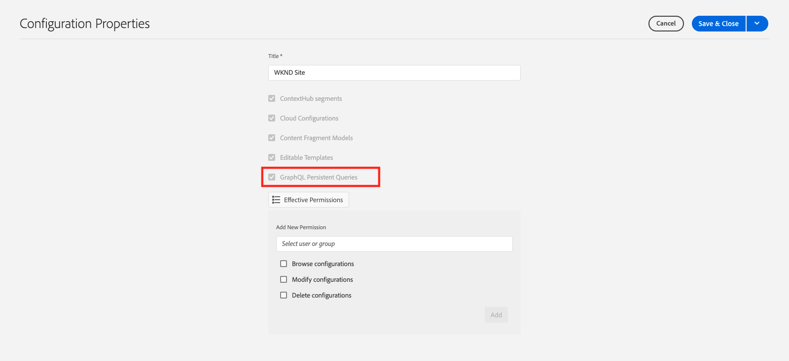

# Blijvende GraphQL-query&#39;s

Blijvende query&#39;s zijn query&#39;s die zijn opgeslagen op de Adobe Experience Manager-server (AEM). Clients kunnen een HTTP-GET-aanvraag met de naam van de query verzenden om deze uit te voeren. Het voordeel van deze aanpak is cacheability. Terwijl client-side GraphQL query&#39;s ook kunnen worden uitgevoerd met HTTP POST request, dat niet in cache kan worden geplaatst, kunnen persisted query&#39;s in cache worden geplaatst door HTTP caches of een CDN, waardoor de prestaties verbeteren. De gepersisteerde vragen staan u toe om uw verzoeken te vereenvoudigen en veiligheid te verbeteren omdat uw vragen op de server worden ingekapseld en de AEM beheerder volledige controle over hen heeft. Het is **beste praktijken en hoogst geadviseerd** om persisted vragen te gebruiken wanneer het werken met AEM GraphQL API.

In het vorige hoofdstuk hebt u enkele geavanceerde GraphQL-query&#39;s onderzocht om gegevens voor de WKND-app te verzamelen. In dit hoofdstuk, blijft u de vragen aan AEM en leert hoe te om geheim voorgeheugencontrole op persisted query te gebruiken.

## Vereisten {#prerequisites}

Dit document is onderdeel van een zelfstudie met meerdere onderdelen. Gelieve te zorgen ervoor dat het [ vorige hoofdstuk ](explore-graphql-api.md) is voltooid alvorens met dit hoofdstuk te werk te gaan.

## Doelstellingen {#objectives}

Leer in dit hoofdstuk hoe te:

* GraphQL-query&#39;s met parameters blijven gebruiken
* De cache-control parameters van het gebruik met persistente vragen

## Herzie _GraphQL het Verlengde 1} configuratie plaatsen van Vragen {_

Laat herzien dat _GraphQL de Verlengde Vragen_ voor het project van de Plaats WKND in uw AEM instantie worden toegelaten.

1. Navigeer aan **Hulpmiddelen** > **Algemeen** > **Browser van de Configuratie**.

1. Selecteer **Gedeelde WKND**, dan selecteren **Eigenschappen** in de hoogste navigatiebar om configuratieeigenschappen te openen. Op de pagina van de Eigenschappen van de Configuratie, zou u moeten zien dat de **Persistente Vragen van GraphQL** toestemming wordt toegelaten.

   

## Handhaaf GraphQL-query&#39;s met het gereedschap GraphiQL Explorer

In deze sectie, laten wij de vraag van GraphQL voortzetten die later in de cliënttoepassing wordt gebruikt om de gegevens van het Fragment van de Inhoud van de Avontuur te halen en terug te geven.

1. Ga de volgende vraag in de Ontdekkingsreiziger GraphiQL in:

   ```graphql
   query getAdventureDetailsBySlug($slug: String!) {
   adventureList(filter: {slug: {_expressions: [{value: $slug}]}}) {
       items {
       _path
       title
       activity
       adventureType
       price
       tripLength
       groupSize
       difficulty
       primaryImage {
           ... on ImageRef {
           _path
           mimeType
           width
           height
           }
       }
       description {
           html
           json
       }
       itinerary {
           html
           json
       }
       location {
           _path
           name
           description {
           html
           json
           }
           contactInfo {
           phone
           email
           }
           locationImage {
           ... on ImageRef {
               _path
           }
           }
           weatherBySeason
           address {
           streetAddress
           city
           state
           zipCode
           country
           }
       }
       instructorTeam {
           _metadata {
           stringMetadata {
               name
               value
           }
           }
           teamFoundingDate
           description {
           json
           }
           teamMembers {
           fullName
           contactInfo {
               phone
               email
           }
           profilePicture {
               ... on ImageRef {
               _path
               }
           }
           instructorExperienceLevel
           skills
           biography {
               html
           }
           }
       }
       administrator {
           fullName
           contactInfo {
           phone
           email
           }
           biography {
           html
           }
       }
       }
       _references {
       ... on ImageRef {
           _path
           mimeType
       }
       ... on LocationModel {
           _path
           __typename
       }
       }
   }
   }
   ```

   Controleer of de query werkt voordat u deze opslaat.

1. Tik vervolgens op Opslaan als en voer `adventure-details-by-slug` in als naam voor de query.

   

## Doorlopende query uitvoeren met variabelen door speciale tekens te coderen

Laten we begrijpen hoe voortgezette query&#39;s met variabelen worden uitgevoerd door de toepassing aan de clientzijde door de speciale tekens te coderen.

Om een voortgezette vraag uit te voeren, doet de cliënttoepassing een verzoek van de GET gebruikend de volgende syntaxis:

```
GET <AEM_HOST>/graphql/execute.json/<Project-Config-Name>/<Persisted-Query-Name>
```

Om een voortgezette vraag _met een variabele_ uit te voeren, verandert de bovengenoemde syntaxis in:

```
GET <AEM_HOST>/graphql/execute.json/<Project-Config-Name>/<Persisted-Query-Name>;variable1=value1;variable2=value2
```

De speciale tekens zoals puntkomma&#39;s (;), gelijkteken (=), slashes (/) en spatie moeten worden omgezet om de overeenkomstige UTF-8-codering te gebruiken.

Door `getAllAdventureDetailsBySlug` vraag van de bevel-lijn terminal in werking te stellen, herzien wij deze concepten in actie.

1. Open de Ontdekkingsreiziger GraphiQL en klik de **ellipsen** (...) naast de blijvende vraag `getAllAdventureDetailsBySlug`, dan klik **Exemplaar URL**. Plak gekopieerde URL in een tekstblok en ziet er als volgt uit:

   ```code
       http://<AEM_HOST>/graphql/execute.json/wknd-shared/getAllAdventureDetailsBySlug;slug=
   ```

1. `yosemite-backpacking` toevoegen als variabele waarde

   ```code
       http://<AEM_HOST>/graphql/execute.json/wknd-shared/getAllAdventureDetailsBySlug;slug=yosemite-backpacking
   ```

1. De puntkomma&#39;s (;) en speciale tekens voor het gelijkteken (=) coderen

   ```code
       http://<AEM_HOST>/graphql/execute.json/wknd-shared/getAllAdventureDetailsBySlug%3Bslug%3Dyosemite-backpacking
   ```

1. Open een bevel-lijn terminal en het gebruiken van [ Kromme ](https://curl.se/) stelt de vraag in werking

   ```shell
   $ curl -X GET http://<AEM_HOST>/graphql/execute.json/wknd-shared/getAllAdventureDetailsBySlug%3Bslug%3Dyosemite-backpacking
   ```

>[!TIP]
>
>    Als het runnen van de bovengenoemde vraag tegen het milieu van de AEM Auteur, moet u de geloofsbrieven verzenden. Zie ](https://experienceleague.adobe.com/docs/experience-manager-learn/getting-started-with-aem-headless/authentication/local-development-access-token.html) Token van de Toegang van de Lokale Ontwikkeling 1} voor demonstratie van het en [ roepend AEM API ](https://experienceleague.adobe.com/docs/experience-manager-cloud-service/content/implementing/developing/generating-access-tokens-for-server-side-apis.html#calling-the-aem-api) voor documentatiedetails.[

Ook, herzie [ hoe te om een Gepersisteerde vraag ](https://experienceleague.adobe.com/docs/experience-manager-cloud-service/content/headless/graphql-api/persisted-queries.html#execute-persisted-query) uit te voeren, [ Gebruikend vraagvariabelen ](https://experienceleague.adobe.com/docs/experience-manager-cloud-service/content/headless/graphql-api/persisted-queries.html#query-variables), en [ Coderend vraag URL voor gebruik door app ](https://experienceleague.adobe.com/docs/experience-manager-cloud-service/content/headless/graphql-api/persisted-queries.html#encoding-query-url) om persisted vraaguitvoering door cliënttoepassingen te leren.

## De cache-control parameters van de update in persistente query&#39;s {#cache-control-all-adventures}

Met de AEM GraphQL API kunt u de standaardparameters voor het beheren van cache bijwerken naar uw query&#39;s om de prestaties te verbeteren. De standaardwaarden voor cachebeheer zijn:

* 60 seconden is het gebrek (maxage=60) TTL voor de cliënt (bijvoorbeeld, browser)

* 7200 seconden is het gebrek (s-maxage=7200) TTL voor Dispatcher en CDN; ook gekend als gedeelde geheime voorgeheugens

Gebruik de query `adventures-all` om de cache-besturingsparameters bij te werken. De vraagreactie is groot en het is nuttig om zijn `age` in het geheime voorgeheugen te controleren. Deze voortgezette vraag wordt gebruikt later om de [ cliënttoepassing ](/help/headless-tutorial/graphql/advanced-graphql/client-application-integration.md) bij te werken.

1. Open de Ontdekkingsreiziger GraphiQL en klik de **ellipsen** (...) naast de blijvende vraag, dan klik **Kopballen** om **de Configuratie van het Geheime voorgeheugen** modaal te openen.

   


1. In de **modaal van de Configuratie van het 0} Geheime voorgeheugen, werk de `max-age` kopbalwaarde aan `600 ` seconden (10 mins) bij, dan klik** sparen ****

   


Het overzicht [ Caching van uw voortgeduurde vragen ](https://experienceleague.adobe.com/docs/experience-manager-cloud-service/content/headless/graphql-api/persisted-queries.html#caching-persisted-queries) voor meer informatie over gebrek cache-controle parameters.


## Gefeliciteerd!

Gefeliciteerd! U hebt nu geleerd hoe te om de vragen van GraphQL met parameters voort te zetten, voortgeduurde vragen bij te werken, en cache-controle parameters met voortgezette vragen te gebruiken.

## Volgende stappen

In het [ volgende hoofdstuk ](/help/headless-tutorial/graphql/advanced-graphql/client-application-integration.md), zult u de verzoeken om voortgezette vragen in WKND uitvoeren app.
