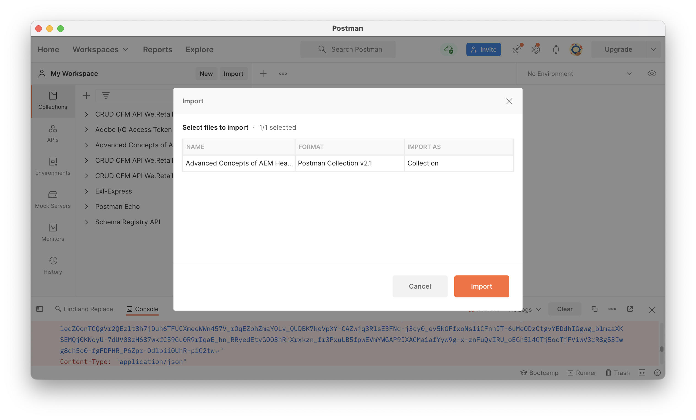

# Blijvende query&#39;s voor GraphQL

Blijvende query&#39;s zijn query&#39;s die zijn opgeslagen op de Adobe Experience Manager-server (AEM). Clients kunnen een HTTP-GET-aanvraag met de naam van de query verzenden om deze uit te voeren. Het voordeel van deze aanpak is cacheability. Terwijl de cliënt-zijvragen GraphQL ook kunnen worden uitgevoerd gebruikend de verzoeken van de POST van HTTP, die niet in het voorgeheugen kunnen worden opgeslagen, kunnen de voortgeduurde vragen door de geheime voorgeheugens van HTTP of een CDN worden in het voorgeheugen ondergebracht, verbeterend prestaties. De gepersisteerde vragen staan u toe om uw verzoeken te vereenvoudigen en veiligheid te verbeteren omdat uw vragen op de server worden ingekapseld en de AEM beheerder volledige controle over hen heeft. Het is beste praktijken en hoogst geadviseerd om persisted query&#39;s te gebruiken wanneer het werken met AEM GraphQL API.

In het vorige hoofdstuk hebt u enkele geavanceerde GraphQL-query&#39;s onderzocht om gegevens voor de WKND-app te verzamelen. In dit hoofdstuk, zult u deze vragen aan AEM voortzetten, hen bijwerken, en leren hoe te om geheim voorgeheugencontrole op persisted query te gebruiken.

## Vereisten {#prerequisites}

Dit document is onderdeel van een zelfstudie met meerdere onderdelen. Controleer of de vorige hoofdstukken zijn voltooid voordat u verdergaat met dit hoofdstuk.

Deze zelfstudie gebruikt [Postman](https://www.postman.com/) om HTTP-aanvragen uit te voeren. Controleer of u zich hebt aangemeld bij de service voordat u dit hoofdstuk start. Deze zelfstudie vereist ook praktische kennis van de Postman-app, zoals het instellen van een verzameling, het maken van variabelen en het indienen van aanvragen. Zie de documentatie van Postman op [aanvragen voor samenstellen](https://learning.postman.com/docs/sending-requests/requests/) en [verzenden, eerste aanvraag](https://learning.postman.com/docs/getting-started/sending-the-first-request/) voor meer informatie over het maken van API-aanvragen in de app.

In dit hoofdstuk, worden de vragen die in het vorige hoofdstuk worden onderzocht voortgeduurd aan AEM. U kunt een tekstbestand downloaden met deze standaard GraphQL-query&#39;s [hier](assets/graphql-persisted-queries/advanced-concepts-aem-headless-graphql-queries.txt) voor eenvoudige referentie.

## Doelstellingen {#objectives}

Leer in dit hoofdstuk hoe te:

* GraphQL-query&#39;s met parameters behouden
* Voortdurende query&#39;s bijwerken
* De cache-control parameters van het gebruik met persistente vragen

## Overzicht van aanhoudende query&#39;s

Deze video verstrekt een overzicht van hoe te om vragen voort te zetten GraphQL, hen bij te werken, en gebruiksgeheim voorgeheugencontrole.

>[!VIDEO](https://video.tv.adobe.com/v/340036/?quality=12&learn=on)

## Voortdurende query&#39;s inschakelen

Eerst, zorg ervoor dat de voortgeduurde vragen voor het project van de Plaats WKND in uw AEM instantie worden toegelaten.

1. Navigeren naar **Gereedschappen** > **Algemeen** > **Configuratiebrowser**.

1. Selecteren **WKND-site** selecteert u vervolgens **Eigenschappen** in de bovenste navigatiebalk om configuratie-eigenschappen te openen.

   

   Op de pagina van de Eigenschappen van de Configuratie, zou u moeten zien dat **GrafiekQL blijvende vragen** machtiging is ingeschakeld.

   

## Postmanverzameling importeren

Om het gemakkelijker te maken om de zelfstudie te volgen wordt een inzameling Postman verstrekt. U kunt ook opdrachtregelprogramma&#39;s gebruiken, zoals `curl` kan worden gebruikt.

1. Downloaden en installeren [Postman](https://www.postman.com/)
1. Download de [AdvancedConceptsofAEMHeadless.postman_collection.json](/help/headless-tutorial/graphql/advanced-graphql/assets/tutorial-files/AdvancedConceptsofAEMHeadless.postman_collection.json)
1. De Postman-app openen
1. Selecteren **Bestand** > **Importeren** > **Bestand uploaden** en kiest u `AdvancedConceptsofAEMHeadless.postman_collection.json` om de verzameling te importeren.

   

### Verificatie

De authentificatie wordt vereist om vragen tegen een AEM auteursinstantie te verzenden. Deze zelfstudie is gebaseerd op de AEM as a Cloud Service omgeving en gebruikt de verificatie aan toonder met een ontwikkelingstoken. Om authentificatie voor uw inzameling van Postman te vormen, gebruik de volgende stappen:

1. Als u een ontwikkelingstoken wilt ophalen, navigeert u naar uw Cloud Developer Console en opent u het dialoogvenster **Integraties** en selecteert u **Token voor lokale ontwikkeling ophalen**.

   

1. Navigeer in uw Postman-verzameling naar de **Verificatie** en selecteert u **Dragertoken** in de **Type** vervolgkeuzemenu.

   

1. Voer het ontwikkelingstoken in de **Token** veld. U kunt het token doorgeven via een variabele, zoals wordt uitgelegd in de volgende sectie.

   

### Variabelen {#variables}

U kunt waarden zoals authentificatietokens en de componenten van URI door variabelen binnen uw inzameling van Postman overgaan om het proces te vereenvoudigen. Gebruik voor deze zelfstudie de volgende stappen om variabelen te maken:

1. Ga naar de **Variabelen** binnen uw inzameling Postman en creeer de volgende variabelen:

   | Variabele | Waarde |
   | --- | --- |
   | `AEM_SCHEME` | `https` |
   | `AEM_AUTH_TOKEN` | (Uw ontwikkelingstoken) |
   | `AEM_HOST` | (De hostnaam van uw AEM-instantie) |
   | `AEM_PROJECT` | `wknd` |

1. U kunt ook variabelen toevoegen voor elke query die u wilt maken. Voor dit leerprogramma, vervolg de volgende vragen: `getAdventureAdministratorDetailsByAdministratorName`, `getTeamByAdventurePath`, `getLocationDetailsByLocationPath`, `getTeamMembersByAdventurePath`, `getLocationPathByAdventurePath`, en `getTeamLocationByLocationPath`.

   Maak de volgende variabelen:

   * `AEM_GET_ADVENTURE_ADMINISTRATOR_DETAILS_BY_ADMINISTRATOR_NAME` : `adventure-administrator-details-by-administrator-name`
   * `AEM_GET_ADVENTURE_ADMINISTRATOR_DETAILS_BY_ADMINISTRATOR_NAME` : `adventure-administrator-details-by-administrator-name`
   * `AEM_GET_TEAM_LOCATION_BY_LOCATION_PATH` : `team-location-by-location-path`
   * `AEM_GET_TEAM_MEMBERS_BY_ADVENTURE_PATH` : `team-members-by-adventure-path`
   * `AEM_GET_LOCATION_DETAILS_BY_LOCATION_PATH` : `location-details-by-location-path`
   * `AEM_GET_LOCATION_PATH_BY_ADVENTURE_PATH` : `location-path-by-adventure-path`
   * `AEM_GET_TEAM_BY_ADVENTURE_PATH` : `team-by-adventure-path`

   Na voltooiing, **Variabelen** zou het lusje in uw inzameling van Postman aan het volgende gelijkaardig moeten kijken:

   

## GraphQL-query&#39;s met parameters behouden

In de [AEM headless en GraphQL videoreeks](../video-series/graphql-persisted-queries.md), leerde u hoe te om voortgeduurde vragen te creëren GraphQL. In deze sectie, laten wij voortbestaan en een vraag GraphQL met een parameter uitvoeren.

### Een voortgezette query maken {#create-persisted-query}

In dit voorbeeld blijven de opties `getAdventureAdministratorDetailsByAdministratorName` vraag die u in het vorige hoofdstuk creeerde.

>[!NOTE]
>
>De methode van de PUT van HTTP wordt gebruikt om tot een persisted vraag te leiden, en de methode van de POST van HTTP wordt gebruikt om het bij te werken.

1. Voeg eerst een nieuw verzoek toe aan uw Postman-collectie. Selecteer de methode van de PUT van HTTP om een voortgezette vraag tot stand te brengen en het volgende verzoek URI te gebruiken:

   ```plaintext
   {{AEM_SCHEME}}://{{AEM_HOST}}/graphql/persist.json/{{AEM_PROJECT}}/{{AEM_GET_ADVENTURE_ADMINISTRATOR_DETAILS_BY_ADMINISTRATOR_NAME}}
   ```

   Let op: de URI gebruikt de `/graphql/persist.json` handeling.

1. Plak de `getAdventureAdministratorDetailsByAdministratorName` GraphQL vraag in het verzoeklichaam. Merk op dat het de standaardvraag GraphQL met een variabele is `name` die een `String`.

   

1. Voer het verzoek uit. U dient het volgende antwoord te ontvangen:

   

   U hebt met succes een voortgezette vraag genoemd gecreeerd `adventure-administrator-details-by-administrator-name`.

### Een voortgezette query uitvoeren

Laten we de voortgezette query uitvoeren die u hebt gemaakt.

1. Creeer een nieuw verzoek van de GET binnen uw inzameling Postman, gebruikend volgende verzoek URI:

   ```plaintext
   {{AEM_SCHEME}}://{{AEM_HOST}}/graphql/execute.json/{{AEM_PROJECT}}/{{AEM_GET_ADVENTURE_ADMINISTRATOR_DETAILS_BY_ADMINISTRATOR_NAME}}
   ```

   Merk op dat de aanvraag-URI nu de `execute.json` handeling.

   Als u dit verzoek zo uitvoert wordt een fout geworpen omdat de vraag een variabele vereist `name`. U moet deze variabele als parameter in het verzoekURI overgaan.

   

1. Vervolgens haalt u een beheerder op met de naam Jacob Wester. De parameters voor de voortgezette vragen GraphQL moeten van de vorige componenten van URI door worden gescheiden `;` en gecodeerd voordat deze worden doorgegeven aan de aanvraag-URI. Voer in uw browserconsole de volgende opdracht uit:

   ```js
   encodeURIComponent(";name=Jacob Wester")
   ```

   

1. Kopieer het resultaat van de console en plak het aan het einde van de aanvraag-URI in Postman. U zou het volgende verzoek URI moeten hebben:

   ```plaintext
   {{AEM_SCHEME}}://{{AEM_HOST}}/graphql/execute.json/{{AEM_PROJECT}}/{{AEM_GET_ADVENTURE_ADMINISTRATOR_DETAILS_BY_ADMINISTRATOR_NAME}}%3Bname%3DJacob%20Wester
   ```

1. Voer het verzoek van de GET uit. U dient het volgende antwoord te ontvangen:

   

U hebt nu een voortgezette vraag GraphQL met een parameter gecreeerd en uitgevoerd.

U kunt de stappen volgen hierboven worden geschetst om de rest vragen GraphQL van te blijven [tekstbestand](assets/graphql-persisted-queries/advanced-concepts-aem-headless-graphql-queries.txt) met de variabelen die u hebt gemaakt op het tabblad [begin van dit hoofdstuk](#variables).

De volledige [Postboeking](/help/headless-tutorial/graphql/advanced-graphql/assets/tutorial-files/AdvancedConceptsofAEMHeadless.postman_collection.json) kan ook worden gedownload en geïmporteerd.

## Voortdurende query&#39;s bijwerken

Terwijl de voortgeduurde vragen gebruikend een verzoek van de PUT worden gecreeerd, moet u een verzoek van de POST gebruiken om een bestaande voortgeduurde vraag bij te werken. Voor deze zelfstudie, werken de persisted query genaamd bij `adventure-administrator-details-by-administrator-name` die u hebt gemaakt in het dialoogvenster [vorige sectie](#create-persisted-query).

1. Dupliceer het lusje dat u voor het verzoek van de PUT in de vorige sectie gebruikte. Wijzig in de kopie de HTTP-methode in POST.

1. In de vraag GraphQL, verwijderen wij `plaintext` van de `administratorDetails` veld.

   

1. Voer het verzoek uit. U krijgt het volgende antwoord:

   

U hebt nu de `adventure-administrator-details-by-administrator-name` voortgezette query. Het is belangrijk om uw vragen GraphQL in AEM altijd bij te werken als de veranderingen worden aangebracht.

## De geheime voorgeheugen-controle parameters van de doorgang in persistente vragen {#cache-control-all-adventures}

AEM GraphQL API staat u toe om cache-controle parameters aan uw vragen toe te voegen om prestaties te verbeteren.

Gebruik de `getAllAdventureDetails` query die in het vorige hoofdstuk is gemaakt. De vraagreactie is groot en het is nuttig om zijn te controleren `age` in de cache.

Deze voortgezette query wordt later gebruikt om de [clienttoepassing](/help/headless-tutorial/graphql/advanced-graphql/client-application-integration.md).

1. Maak een nieuwe variabele in uw Postman-verzameling:

   ```plaintext
   AEM_GET_ALL_AT_ONCE: all-adventure-details
   ```

1. Creeer een nieuw verzoek van de PUT om deze vraag voort te zetten.

1. In de **Lichaam** selecteert u de **ruw** gegevenstype.

   

1. Om geheim voorgeheugencontrole in een vraag te gebruiken, moet u de vraag in een structuur verpakken JSON en cache-control parameters aan het eind toevoegen. Kopieer en plak de volgende query in de hoofdtekst van uw verzoek:

   ```json
   {
   "query": " query getAllAdventureDetails($fragmentPath: String!) { adventureByPath(_path: $fragmentPath){ item { _path adventureTitle adventureActivity adventureType adventurePrice adventureTripLength adventureGroupSize adventureDifficulty adventurePrice adventurePrimaryImage{ ...on ImageRef{ _path mimeType width height } } adventureDescription { html json } adventureItinerary { html json } location { _path name description { html json } contactInfo{ phone email } locationImage{ ...on ImageRef{ _path } } weatherBySeason address{ streetAddress city state zipCode country } } instructorTeam { _metadata{ stringMetadata{ name value } } teamFoundingDate description { json } teamMembers { fullName contactInfo { phone email } profilePicture{ ...on ImageRef { _path } } instructorExperienceLevel skills biography { html } } } administrator { fullName contactInfo { phone email } biography { html } } } _references { ...on ImageRef { _path mimeType } ...on LocationModel { _path __typename } } } }", 
   "cache-control": { "max-age": 300 }
   }
   ```

   >[!CAUTION]
   >
   >De omvattende query mag geen regeleinden bevatten.

   Uw verzoek zou nu als het volgende moeten kijken:

   

1. Voer het verzoek uit. U moet de reactie krijgen die aangeeft dat de `all-adventure-details` De voortgezette query is gemaakt.

   

## Gefeliciteerd!

Gefeliciteerd! U hebt nu geleerd hoe te om vragen GraphQL met parameters voort te zetten, voortgeduurde vragen bij te werken, en cache-controle parameters met voortgeduurde vragen te gebruiken.

## Volgende stappen

In de [volgende hoofdstuk](/help/headless-tutorial/graphql/advanced-graphql/client-application-integration.md), implementeert u de aanvragen voor doorlopende query&#39;s in de WKND-app.

Hoewel dit optioneel is voor deze zelfstudie, dient u alle inhoud te publiceren in situaties waarin de inhoud in de praktijk wordt geproduceerd. Raadpleeg voor een overzicht van de auteur- en publicatie-omgevingen in AEM de [AEM headless en GraphQL videoreeks](../video-series/author-publish-architecture.md).