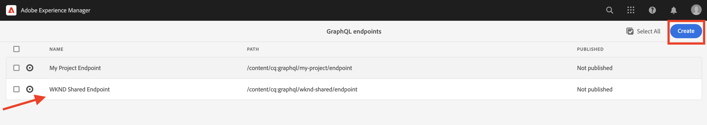

# Geavanceerde concepten van AEM headless

Deze end-to-end zelfstudie vervolgt de [basiszelfstudie](../multi-step/overview.md) die betrekking hadden op de basisbeginselen van Adobe Experience Manager (AEM) Headless en GraphQL. Het geavanceerde leerprogramma illustreert diepgaande aspecten van het werken met de Modellen van het Fragment van de Inhoud, de Fragmenten van de Inhoud, en AEM GraphQL voortgezette vragen, met inbegrip van het gebruiken van GraphQL voortgeduurde vragen in een cliënttoepassing.

## Vereisten

Voltooi de [snelle installatie voor AEM as a Cloud Service](../quick-setup/cloud-service.md) om uw AEM as a Cloud Service omgeving te configureren.

U wordt ten zeerste aangeraden het vorige [basiszelfstudie](../multi-step/overview.md) en [videoreeks](../video-series/modeling-basics.md) zelfstudies voordat u verdergaat met deze geavanceerde zelfstudie. Hoewel u de zelfstudie kunt voltooien met een lokale AEM, wordt in deze zelfstudie alleen ingegaan op de workflow voor AEM as a Cloud Service.

>[!CAUTION]
>
>Als u geen toegang hebt tot AEM as a Cloud Service omgeving, kunt u [Snelle installatie AEM zonder koppen met de lokale SDK](https://experienceleague.adobe.com/docs/experience-manager-learn/getting-started-with-aem-headless/graphql/quick-setup/local-sdk.html). Het is echter belangrijk om op te merken dat sommige productpagina&#39;s van UI zoals de navigatie van de Fragmenten van de Inhoud verschillend zijn.

## Doelstellingen

Deze zelfstudie behandelt de volgende onderwerpen:

* Maak modellen van inhoudsfragmenten met behulp van validatieregels en meer geavanceerde gegevenstypen, zoals tijdelijke aanduidingen voor tabbladen, geneste fragmentverwijzingen, JSON-objecten en gegevenstypen voor datum en tijd.
* Inhoudsfragmenten schrijven terwijl u werkt met geneste inhoud en fragmentverwijzingen, en mapbeleid configureren voor governance voor het schrijven van inhoudsfragmenten.
* Ontdek AEM GraphQL API mogelijkheden gebruikend vragen GraphQL met variabelen en richtlijnen.
* Blijft VRAAG GraphQL met parameters in AEM en leer hoe te om cache-controle parameters met persisted vragen te gebruiken.
* Integreer verzoeken voor voortgezette query&#39;s in de voorbeeldtoepassing WKND GraphQL React met de AEM Headless JavaScript SDK.

## Geavanceerde concepten van AEM overzicht zonder kop

De volgende video biedt een overzicht op hoog niveau van de concepten die in deze zelfstudie worden behandeld. De zelfstudie bevat het definiëren van Content Fragment Models met geavanceerdere gegevenstypen, het nesten van Content Fragments en het voortduren van GraphQL-query&#39;s in AEM.

>[!VIDEO](https://video.tv.adobe.com/v/340035/?quality=12&learn=on)

>[!CAUTION]
>
>Deze video (bij 2:25) bespreekt over het installeren van de GraphiQL vraagredacteur via de Manager van het Pakket om vragen te onderzoeken GraphQL. Nochtans in nieuwere versies van AEM als Cloud Service ingebouwde **GraphiQL Explorer** wordt geleverd, zodat de installatie van het pakket niet vereist is. Zie [GraphiQL IDE gebruiken](https://experienceleague.adobe.com/docs/experience-manager-cloud-service/content/headless/graphql-api/graphiql-ide.html) voor meer informatie .

## Projectinstelling

Het project van de Plaats WKND heeft alle noodzakelijke configuraties, zodat kunt u het leerprogramma beginnen net nadat u voltooit [snelle installatie](../quick-setup/cloud-service.md). In deze sectie worden alleen enkele belangrijke stappen gemarkeerd die u kunt gebruiken bij het maken van uw eigen AEM Headless-project.

### Bestaande configuratie controleren

De eerste stap aan de aanvang van om het even welk nieuw project in AEM is zijn configuratie, als werkruimte tot stand te brengen en eindpunten te creëren GraphQL API. Als u een configuratie wilt bekijken of maken, navigeert u naar **Gereedschappen** > **Algemeen** > **Configuratiebrowser**.

Waarnemen dat de `WKND Shared` de plaatsconfiguratie is reeds gecreeerd voor het leerprogramma. Om een configuratie voor uw eigen project tot stand te brengen, selecteer **Maken** in de rechterbovenhoek en vul het formulier in in de modus Configuratie maken die wordt weergegeven.

### GraphQL API-eindpunten controleren

Daarna, moet u API eindpunten vormen om vragen te verzenden GraphQL naar. Als u bestaande eindpunten wilt bekijken of maken, navigeert u naar **Gereedschappen** > **Algemeen** > **GraphQL**.

Waarnemen dat de `WKND Shared Endpoint` is al gemaakt. Om een eindpunt voor uw project tot stand te brengen, selecteer **Maken** in de rechterbovenhoek en volg de workflow.

>[!NOTE]
>
> Na het bewaren van het eindpunt, zult u een modaal over het bezoeken van de Console van de Veiligheid zien, die u toestaat om veiligheidsmontages aan te passen als u wenst om toegang tot het eindpunt te vormen. De toestemmingen van de veiligheid zelf zijn buiten het werkingsgebied van dit leerprogramma, echter. Raadpleeg voor meer informatie de [AEM](https://experienceleague.adobe.com/docs/experience-manager-64/administering/security/security.html).

### WKND-inhoudsstructuur en taalhoofdmap controleren

Een goed gedefinieerde inhoudsstructuur is essentieel voor het succes van AEM implementatie zonder kop. Dit is handig voor schaalbaarheid, bruikbaarheid en toegangsbeheer van uw inhoud.

Een hoofdmap voor de taal is een map met als naam de ISO-taalcode EN FR. Het AEM vertaalbeheersysteem gebruikt deze mappen om de primaire taal van uw inhoud en talen voor het vertalen van inhoud te definiëren.

Ga naar **Navigatie** > **Activa** > **Bestanden**.

Navigeer in de **WKND gedeeld** map. Neem de map waar met de titel &quot;Engels&quot; en de naam &quot;EN&quot;. Deze map is de hoofdmap van de taal voor het WKND-siteproject.

Voor uw eigen project, creeer een omslag van de taalwortel binnen uw configuratie. Zie de sectie over [mappen maken](/help/headless-tutorial/graphql/advanced-graphql/author-content-fragments.md#create-folders) voor meer informatie .

### Een configuratie toewijzen aan de geneste map

Tot slot moet u de configuratie van uw project aan de omslag van de taalwortel toewijzen. Deze toewijzing laat de verwezenlijking van de Fragmenten van de Inhoud toe die op de Modellen worden gebaseerd van het Fragment van de Inhoud in de configuratie van uw project wordt bepaald.

Als u de hoofdmap van de taal aan de configuratie wilt toewijzen, selecteert u de map en selecteert u **Eigenschappen** in de bovenste navigatiebalk.

Navigeer vervolgens naar de **Cloud Services** en selecteert u het mappictogram in het dialoogvenster **Cloud Configuration** veld.

In modaal die verschijnt, selecteer uw eerder gecreeerde configuratie om de taalwortelomslag aan het toe te wijzen.

### Aanbevolen procedures

Hier volgt een overzicht van aanbevolen procedures voor het maken van uw eigen project in AEM:

* De maphiërarchie moet zijn gebaseerd op lokalisatie en vertaling. Met andere woorden, taalmappen moeten in configuratiemappen worden genest, zodat de inhoud in die configuratiemappen gemakkelijk kan worden vertaald.
* De maphiërarchie moet vlak en eenvoudig worden gehouden. Vermijd het later verplaatsen of hernoemen van mappen en fragmenten, vooral na publicatie voor live gebruik, omdat paden worden gewijzigd die fragmentverwijzingen en GraphQL-query&#39;s kunnen beïnvloeden.

## Starter- en oplossingspakketten

Twee AEM **pakketten** zijn beschikbaar en kunnen worden geïnstalleerd via [Pakketbeheer](/help/headless-tutorial/graphql/advanced-graphql/author-content-fragments.md#sample-content)

* [Advanced-GraphQL-Tutorial-Starter-Package-1.1.zip](/help/headless-tutorial/graphql/advanced-graphql/assets/tutorial-files/Advanced-GraphQL-Tutorial-Starter-Package-1.1.zip) wordt later in de zelfstudie gebruikt en bevat voorbeeldafbeeldingen en mappen.
* [Advanced-GraphQL-Tutorial-Solution-Package-1.2.zip](/help/headless-tutorial/graphql/advanced-graphql/assets/tutorial-files/Advanced-GraphQL-Tutorial-Solution-Package-1.2.zip) Bevat de gebeëindigde oplossing voor Hoofdstuk 1-4 met inbegrip van nieuwe Modellen van het Fragment van de Inhoud, de Fragmenten van de Inhoud, en de Persisted vragen GraphQL. Nuttig voor degenen die naar de [Integratie van clienttoepassingen](/help/headless-tutorial/graphql/advanced-graphql/client-application-integration.md) hoofdstuk

De **React App - Advanced Tutorial - WKND Adventures**(https://github.com/adobe/aem-guides-wknd-graphql/blob/main/advanced-tutorial/README.md) is beschikbaar om de voorbeeldtoepassing te beoordelen en te verkennen. Deze steekproeftoepassing wint de inhoud van AEM terug door de voortgeduurde vragen aan te halen GraphQL en geeft het in een overweldigende ervaring terug.

## Aan de slag

Ga als volgt te werk om aan de slag te gaan met deze geavanceerde zelfstudie:

1. Een ontwikkelomgeving instellen met [AEM as a Cloud Service](../quick-setup/cloud-service.md).
1. Het hoofdstuk met zelfstudie starten op [Modellen voor inhoudsfragmenten maken](/help/headless-tutorial/graphql/advanced-graphql/create-content-fragment-models.md).
