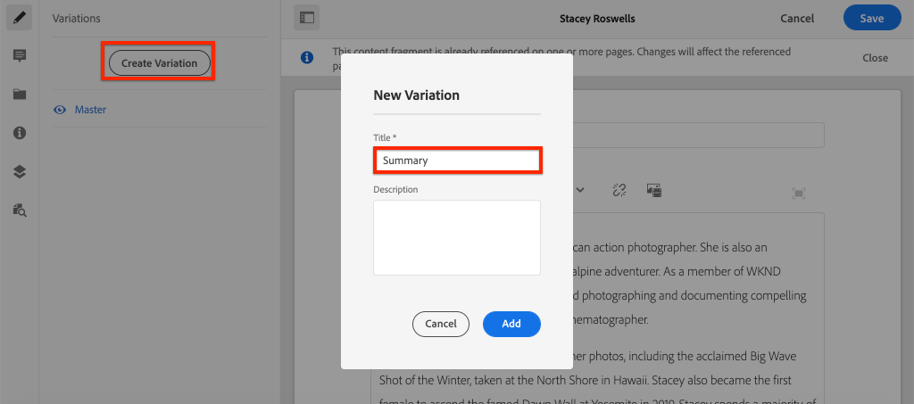

# Inhoudsfragment {#authoring-content-fragments} ontwerpen

In dit hoofdstuk maakt en bewerkt u een nieuw inhoudsfragment op basis van het [net gedefinieerde Contribute-inhoudsfragmentmodel](./content-fragment-models.md). U leert ook hoe u variaties van inhoudsfragmenten kunt maken.

## Vereisten {#prerequisites}

Dit is een meerdelige zelfstudie en er wordt van uitgegaan dat de stappen die worden beschreven in [Modellen van inhoudsfragmenten definiëren](./content-fragment-models.md) zijn voltooid.

## Doelstellingen {#objectives}

* Een inhoudsfragment maken op basis van een model van een inhoudsfragment
* Een variatie in een inhoudsfragment maken

## Overzicht van het schrijven van inhoudsfragmenten {#overview}

>[!VIDEO](https://video.tv.adobe.com/v/22451/?quality=12&learn=on)

De bovenstaande video biedt een uitgebreid overzicht van het ontwerpen van inhoudsfragmenten.

## Een inhoudsfragment maken {#create-content-fragment}

In het vorige hoofdstuk, [Defining Content Fragment Models](./content-fragment-models.md), werd een **Contributor** model gecreeerd. Maak een nieuw inhoudsfragment met dit model.

1. Navigeer in het menu **AEM Start** naar **Middelen** > **Bestanden**.
1. Klik door de omslagen om aan **WKND Plaats** > **English** > **Medewerkers** te navigeren. Deze map bevat een lijst met opnamen voor contribuanten van het WKND-merk.

1. Klik **Maken** in de rechterbovenhoek en selecteer **Inhoudsfragment**:

   

1. Selecteer het model **Contributor** en klik **Next**.

   

   Dit is het zelfde model **Contributor** dat in het vorige hoofdstuk werd gecreeerd.

1. Typ **Stacey Roswells** voor de titel en klik **Maken**.
1. Klik **Open** in **Success** dialoog om het nieuwe fragment te openen.

   

   Let op: de velden die door het model worden gedefinieerd, zijn nu beschikbaar voor het schrijven van dit exemplaar van het inhoudsfragment.

1. Voer voor **Volledige naam** het volgende in: **Stacey Roswells**.
1. Voer voor **Biografie** een korte biografie in. Heb je enige inspiratie nodig? U kunt dit [tekstbestand](assets/author-content-fragments/stacey-roswells-bio.txt) opnieuw gebruiken.
1. Voor **Referentieafbeelding** klikt u op het pictogram **folder** en bladert u naar **WKND Site** > **English** > **Medewerkers** > **Stapelwells.jpg**. Hierdoor wordt het pad geëvalueerd: `/content/dam/wknd/en/contributors/stacey-roswells.jpg`.
1. Kies **Fotograaf** voor **Beroep**.

   

1. Klik **Opslaan** om de wijzigingen op te slaan.

## Een fragmentvariatie van inhoud maken

Alle inhoudsfragmenten beginnen met een **Master** variatie. De **Master** variatie kan worden beschouwd als de *standaard* inhoud van het fragment en wordt automatisch gebruikt wanneer de inhoud via GraphQL APIs wordt blootgesteld. Het is ook mogelijk om variaties van een inhoudsfragment te maken. Deze functie biedt extra flexibiliteit voor het ontwerpen van een implementatie.

Variaties kunnen worden gebruikt voor specifieke kanalen. Er kan bijvoorbeeld een **mobiele**-variatie worden gemaakt die een kleinere hoeveelheid tekst bevat of verwijst naar een kanaalspecifieke afbeelding. De manier waarop variaties worden gebruikt, is echt tot aan de implementatie. Zoals om het even welke eigenschap, zou de zorgvuldige planning moeten worden gedaan alvorens te gebruiken.

Maak vervolgens een nieuwe variatie om een idee te krijgen van de beschikbare mogelijkheden.

1. Open het inhoudsfragment **Stacey Roswells** opnieuw.
1. Klik in de linkerzijbalk op **Variatie maken**.
1. Typ in het modaal **Nieuwe variatie** een titel van **Samenvatting**.

   

1. Klik in het veld **Biografie** met meerdere regels en klik op de knop **Uitbreiden** om de weergave Volledig scherm voor het veld met meerdere regels in te voeren.

   

1. Klik **Samenvatting Tekst** in het hogere juiste menu.

1. Voer een **Doel** van **50** woorden in en klik **Begin**.

   

   Hiermee wordt een voorvertoning van een overzicht geopend. AEM machinetaal taalprocessor probeert de tekst samen te vatten op basis van het aantal doelwoorden. U kunt ook verschillende zinnen selecteren die u wilt verwijderen.

1. Klik **Samenvatten** wanneer u met de samenvatting gelukkig bent. Klik in het tekstveld met meerdere regels en schakel de knop **Uitbreiden** in om terug te keren naar de hoofdweergave.

1. Klik **Opslaan** om de wijzigingen op te slaan.

## Een extra inhoudsfragment maken

Herhaal de stappen die worden beschreven in [Een inhoudsfragment maken](#create-content-fragment) om een extra **Contribute** te maken. Dit zal in het volgende hoofdstuk als voorbeeld van worden gebruikt hoe te om veelvoudige fragmenten te vragen.

1. Klik in de map **Medewerkers** op **Maken** in de rechterbovenhoek en selecteer **Inhoudsfragment**:
1. Selecteer het model **Contributor** en klik **Next**.
1. Voer **Jacob Wester** in voor de titel en klik op **Maken**.
1. Klik **Open** in **Success** dialoog om het nieuwe fragment te openen.
1. Voer voor **Volledige naam** het volgende in: **Jacob Wester**.
1. Voer voor **Biografie** een korte biografie in. Heb je enige inspiratie nodig? U kunt dit [tekstbestand](assets/author-content-fragments/jacob-wester.txt) opnieuw gebruiken.
1. Voor **Referentieafbeelding** klikt u op het pictogram **folder** en bladert u naar **WKND Site** > **English** > **Contributors** > **jacob_wester.jpg**. Hierdoor wordt het pad geëvalueerd: `/content/dam/wknd/en/contributors/jacob_wester.jpg`.
1. Kies **Schrijver** voor **Beroep**.
1. Klik **Opslaan** om de wijzigingen op te slaan. U hoeft alleen een variatie te maken als u dat wilt!

   

   U moet nu twee **Contributors** fragmenten hebben.

## Gefeliciteerd! {#congratulations}

U hebt zojuist meerdere inhoudsfragmenten gemaakt en een variatie gemaakt.

## Volgende stappen {#next-steps}

In het volgende hoofdstuk, [Onderzoek GraphQL APIs](explore-graphql-api.md), zult u AEM GraphQL APIs gebruikend het ingebouwde hulpmiddel GraphQL onderzoeken. Leer hoe AEM automatisch een GrafiekQL-schema genereert dat op een model van het Fragment van de Inhoud wordt gebaseerd. U zult het construeren van basisvragen gebruikend de syntaxis GraphQL experimenteren.