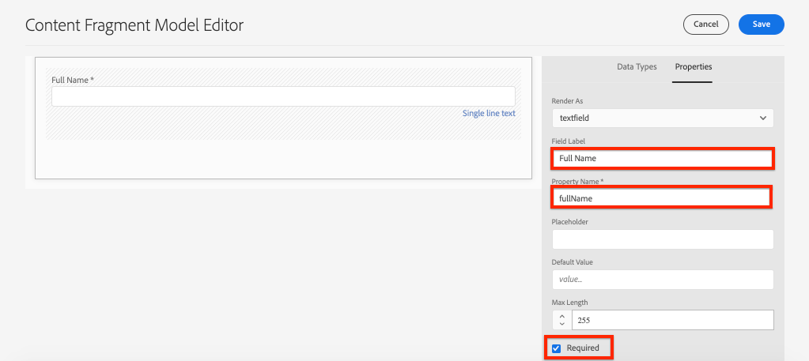
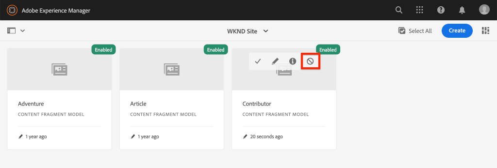

# Modellen voor inhoudsfragmenten {#content-fragment-models} definiëren

In dit hoofdstuk leert u hoe u inhoud modelleert en een schema bouwt met **Content Fragment Models**. U controleert bestaande modellen en maakt een nieuw model. U zult ook over de verschillende gegevenstypes leren die kunnen worden gebruikt om een schema als deel van het model te bepalen.

In dit hoofdstuk maakt u een nieuw model voor een **Contributor**. Dit is het gegevensmodel voor gebruikers die tijdschrift- en avontuurinhoud schrijven als onderdeel van het WKND-merk.

## Vereisten {#prerequisites}

Dit is een meerdelige zelfstudie en er wordt van uitgegaan dat de stappen in de [Snelle installatie](./setup.md) zijn voltooid.

## Doelstellingen {#objectives}

* Maak een nieuw model voor inhoudsfragmenten.
* Beschikbare gegevenstypen en validatieopties identificeren voor het samenstellen van modellen.
* Begrijp hoe het Model van het Fragment van de Inhoud **zowel** het gegevensschema en het auteursmalplaatje voor een Fragment van de Inhoud bepaalt.

## Overzicht van het inhoudsfragmentmodel {#overview}

>[!VIDEO](https://video.tv.adobe.com/v/22452/?quality=12&learn=on)

De video hierboven biedt een uitgebreid overzicht van het werken met Content Fragment Models.

## Inspect the Adventure Content Fragment Model

In het vorige hoofdstuk zijn verschillende Adventures Content Fragments bewerkt en weergegeven op een externe toepassing. Controleer het Model van het Fragment van de Inhoud van de Avontuur om het onderliggende gegevensschema van deze fragmenten te begrijpen.

1. Navigeer in het menu **AEM Start** naar **Tools** > **Assets** > **Content Fragment Models**.

   

1. Navigeer naar de map **WKND Site** en houd de muisaanwijzer boven **Adventure** Content Fragment Model en klik op het pictogram **Edit** (potlood) om het model te openen.

   

1. Hiermee opent u de **Inhoudsfragmentmodeleditor**. Houd er rekening mee dat de velden die het Adventure-model definiëren, verschillende **Gegevenstypen** bevatten, zoals **Tekst met één regel**, **Tekst met meerdere regels**, **Opsomming** en **Content Reference**.

1. In de rechterkolom van de editor worden de beschikbare **Gegevenstypen** weergegeven die de formuliervelden definiëren die worden gebruikt voor het ontwerpen van inhoudsfragmenten.

1. Selecteer het veld **Titel** in het hoofddeelvenster. Klik in de rechterkolom op het tabblad **Eigenschappen**:

   

   Neem het **gebied van de Naam van het Bezit** aan `adventureTitle` wordt geplaatst. Dit bepaalt de naam van het bezit dat aan AEM wordt voortgeduurd. De **Naam van het Bezit** bepaalt ook **key** naam voor dit bezit als deel van het gegevensschema. Deze **sleutel** wordt gebruikt wanneer de gegevens van het Fragment van de Inhoud via GraphQL APIs worden blootgesteld.

   >[!CAUTION]
   >
   > Als u de **Eigenschapnaam** van een veld **after** Inhoudsfragmenten wijzigt, worden deze van het model afgeleid. Dit heeft downstreameffecten. Er wordt niet langer verwezen naar veldwaarden in bestaande fragmenten en het gegevensschema dat door GraphQL wordt weergegeven, wordt gewijzigd, wat invloed heeft op bestaande toepassingen.

1. Schuif omlaag op het tabblad **Eigenschappen** en bekijk het vervolgkeuzemenu **Validatietype**.

   

   Formuliervalidaties in het vak zijn beschikbaar voor **E-mail** en **URL**. Het is ook mogelijk om een **Aangepaste** bevestiging te bepalen gebruikend een regelmatige uitdrukking.

1. Klik **Annuleren** om de Editor van het inhoudsfragmentmodel te sluiten.

## Een bijdragemodel maken

Maak vervolgens een nieuw model voor een **Contributor**. Dit is het gegevensmodel voor gebruikers die tijdschriften en avontuurlijke inhoud maken als onderdeel van het WKND-merk.

1. Klik **Create** in de hogere juiste hoek om de **Create Model** tovenaar omhoog te brengen.
1. Voer voor **Modeltitel** in: **Medewerker** en klik op **Maken**

   

   Klik **Open** om het nieuwe model te openen.

1. Sleep een **element met één regel tekst** naar het hoofddeelvenster. Voer de volgende eigenschappen in op het tabblad **Eigenschappen**:

   * **Veldlabel**:  **Volledige naam**
   * **Naam** eigenschap:  `fullName`
   * **Vereist** controleren

   

1. Klik op de tab **Gegevenstypen** en sleep een veld **Meerdere regels tekst** onder het veld **Volledige naam**. Voer de volgende eigenschappen in:

   * **Veldlabel**:  **Biografie**
   * **Naam** eigenschap:  `biographyText`
   * **Standaardtype**:  **RTF**

1. Klik op de tab **Gegevenstypen** en sleep een veld **Content Reference**. Voer de volgende eigenschappen in:

   * **Veldlabel**:  **Referentie afbeelding**
   * **Naam** eigenschap:  `pictureReference`
   * **Hoofdpad**:  `/content/dam/wknd`

   Wanneer u het **Basispad** configureert, kunt u op het pictogram **map** klikken om een modaal pad weer te geven en het pad te selecteren. Hierdoor wordt beperkt welke mappen auteurs kunnen gebruiken om het pad te vullen.

   

1. Voeg een validatie toe aan de **Referentieafbeelding**, zodat alleen inhoudstypen van **Afbeeldingen** kunnen worden gebruikt om het veld te vullen.

   

1. Klik op de tab **Gegevenstypen** en sleep een gegevenstype **Opsomming** onder het veld **Referentie afbeelding**. Voer de volgende eigenschappen in:

   * **Veldlabel**:  **Beroep**
   * **Naam** eigenschap:  `occupation`

1. Voeg verschillende **Opties** toe gebruikend **voeg een optie** knoop toe. Gebruik dezelfde waarde voor **Optie Label** en **Optiewaarde**:

   **Artiest**,  **Influencer**,  **Fotograaf**,  **Traveler**,  **Schrijver**,  **YouTuber**

   

1. Het definitieve **Contributor** model zou als het volgende moeten kijken:

   

1. Klik **Opslaan** om de wijzigingen op te slaan.

## Enable the Contributor Model

Modellen van inhoudsfragmenten moeten **Ingeschakeld** zijn voordat de auteurs van de inhoud het kunnen gebruiken. Het is mogelijk om **een model van het Fragment van de Inhoud onbruikbaar te maken**, waarbij auteurs worden verhinderd het te gebruiken. Rappel dat het wijzigen van **de Naam van het Bezit** van een gebied in het model het onderliggende gegevensschema verandert en significante stroomafwaartse gevolgen op bestaande fragmenten en externe toepassingen kan hebben. U wordt aangeraden de naamgevingsconventie die wordt gebruikt voor de **Eigenschapnaam** van velden zorgvuldig te plannen voordat u het inhoudsfragmentmodel voor gebruikers inschakelt.

1. Zorg ervoor dat het **Contributor** model momenteel in een **Enabled** staat is.

   

   U kunt de status van een inhoudsfragmentmodel in- of uitschakelen door de muisaanwijzer op de kaart te plaatsen en op het pictogram **Uitschakelen** / **Inschakelen** te klikken.

## Gefeliciteerd! {#congratulations}

U hebt zojuist het eerste inhoudsfragmentmodel gemaakt.

## Volgende stappen {#next-steps}

In het volgende hoofdstuk, [Modellen van inhoudsfragmenten ontwerpen](author-content-fragments.md), zult u een nieuw die Fragment van de Inhoud tot stand brengen en uitgeven op een Model van het Fragment van de Inhoud wordt gebaseerd. U leert ook hoe u variaties van inhoudsfragmenten kunt maken.