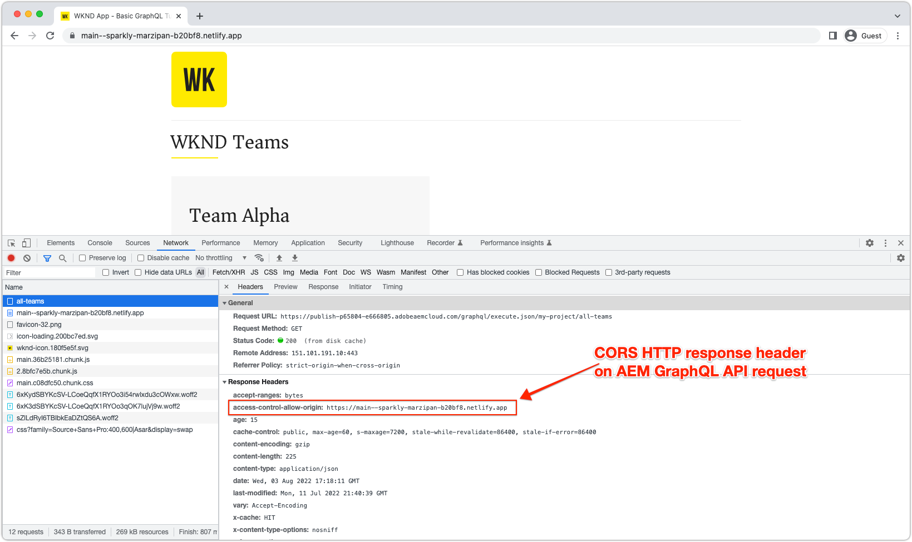

# Implementaties SPA zonder kop AEM

AEM Headless single-page app (SPA)-implementaties zijn gebaseerd op JavaScript-toepassingen die zijn gebouwd met behulp van frameworks zoals React of Vue, die op een krantenloze manier inhoud verbruiken en interageren in AEM.

Bij het implementeren van een SPA die zonder kop AEM interageert, moet u de SPA hosten en toegankelijk maken via een webbrowser.

## De SPA hosten

Een SPA bestaat uit een verzameling native webbronnen: **HTML, CSS en JavaScript**. Deze bronnen worden gegenereerd tijdens de _build_ proces (bijvoorbeeld `npm run build`) en op een host geïmplementeerd voor gebruik door eindgebruikers.

Er zijn verschillende **hosten** afhankelijk van de vereisten van uw organisatie:

1. **Cloud-providers** zoals **Azure** of **AWS**.

2. **Op locatie** in een bedrijf **datacenter**

3. **Front-end hostingplatforms** zoals **AWS Amplify**, **Azure App Service**, **Netlify**, **Heroku**, **Verzenden**, enz.

## Implementatieconfiguraties

De belangrijkste overweging bij het hosten van een SPA die met AEM zonder kop in wisselwerking staat, is als de SPA via AEM domein (of gastheer), of op een verschillend domein wordt betreden.  De reden hiervoor SPA webtoepassingen die in webbrowsers worden uitgevoerd en die daarom onderworpen zijn aan beveiligingsbeleid voor webbrowsers.

### Gedeeld domein

Een SPA en AEM delen domeinen wanneer beide toegang door eind - gebruikers van het zelfde domein zijn. Bijvoorbeeld:

+ AEM is toegankelijk via: `https://wknd.site/`
+ SPA is toegankelijk via `https://wknd.site/spa`

Omdat zowel AEM als de SPA vanuit hetzelfde domein worden benaderd, kunnen webbrowsers de SPA XHR maken naar AEM eindpunten zonder dat CORS nodig is en kunnen HTTP-cookies (zoals AEM) worden gedeeld `login-token` cookie).

Hoe SPA en AEM verkeer op het gedeelde domein wordt verpletterd, is aan u: CDN met veelvoudige oorsprong, de server van HTTP met omgekeerde volmacht, die de SPA direct in AEM ontvangen, etc.

Hieronder vindt u implementatieconfiguraties die vereist zijn voor SPA productieimplementaties, wanneer deze worden gehost op hetzelfde domein als AEM.

| SPA maakt verbinding met | AEM auteur | AEM publiceren | Voorvertoning AEM |
|---------------------------------------------------:|:----------:|:-----------:|:-----------:|
| [Verzendingsfilters](./configurations/dispatcher-filters.md) | ✘ | ✔ | ✔ |
| Delen van bronnen van oorsprong (CORS) | ✘ | ✘ | ✘ |
| AEM | ✘ | ✘ | ✘ |

### Verschillende domeinen

Een SPA en AEM hebben verschillende domeinen wanneer zij door eind - gebruikers van het verschillende domein worden betreden. Bijvoorbeeld:

+ AEM is toegankelijk via: `https://wknd.site/`
+ SPA is toegankelijk via `https://wknd-app.site/`

Omdat AEM en de SPA vanuit verschillende domeinen worden benaderd, passen webbrowsers beveiligingsbeleid toe, zoals [delen van bronnen tussen verschillende bronnen (CORS)](./configurations/cors.md)en voorkomen dat HTTP-cookies worden gedeeld (zoals AEM `login-token` cookie).

Hieronder vindt u implementatieconfiguraties die vereist zijn voor SPA productieimplementaties, wanneer deze worden gehost op een ander domein dan AEM.

| SPA maakt verbinding met | AEM auteur | AEM publiceren | Voorvertoning AEM |
|---------------------------------------------------:|:----------:|:-----------:|:-----------:|
| [Verzendingsfilters](./configurations/dispatcher-filters.md) | ✘ | ✔ | ✔ |
| [Delen van bronnen van oorsprong (CORS)](./configurations/cors.md) | ✔ | ✔ | ✔ |
| [AEM](./configurations/aem-hosts.md) | ✔ | ✔ | ✔ |

#### Voorbeeld SPA implementatie op verschillende domeinen

In dit voorbeeld wordt de SPA geïmplementeerd in een Netlify-domein (`https://main--sparkly-marzipan-b20bf8.netlify.app/`) en de SPA gebruikt AEM GraphQL API&#39;s van het AEM publicatiedomein (`https://publish-p65804-e666805.adobeaemcloud.com`). In de onderstaande schermafbeeldingen wordt de vereiste CORS benadrukt.

1. De SPA wordt bediend van een domein van Netlify, maar maakt een XHR vraag aan AEM GraphQL APIs op een verschillend domein. Dit verzoek voor meerdere sites is vereist [CORS](./configurations/cors.md) op AEM moet worden ingesteld om verzoeken van het Netlify-domein toegang te verlenen tot de inhoud ervan.

   

2. Inspecteer het XHR-verzoek aan de AEM GraphQL API, de `Access-Control-Allow-Origin` aanwezig is, die aan Webbrowser erop wijzen dat AEM verzoek van dit domein van Netlify om tot zijn inhoud toestaat toegang te hebben.

   Als de AEM [CORS](./configurations/cors.md) het Netlify-domein ontbreekt of er is geen Netlify-domein in opgenomen, mislukt de webbrowser het XHR-verzoek en rapporteert een CORS-fout.

   

## Voorbeeld-app van één pagina

Adobe biedt een voorbeeld van een app van één pagina die in React is gecodeerd.

<!-- React app -->

   

       

           <figure class="image is-16by9">
               
           </figure>
       

       

           

               
<a href="../example-apps/react-app.md" title="Toepassingen Reageren">Toepassingen Reageren</a>

               
Een voorbeeld van een app van één pagina, geschreven in React, die inhoud van AEM GraphQL-API's zonder koppen verbruikt.

               <a href="../example-apps/react-app.md" class="spectrum-Button spectrum-Button--outline spectrum-Button--primary spectrum-Button--sizeM">
                   Voorbeeld weergeven
               </a>
           

       

   

<!-- Next.js app -->

   

       

           <figure class="image is-16by9">
               
           </figure>
       

       

           

               
<a href="../example-apps/next-js.md" title="De app Next.js">De app Next.js</a>

               
Een voorbeeld van een app van één pagina, geschreven in Next.js, die inhoud van AEM GraphQL-API's zonder koppen verbruikt.

               <a href="../example-apps/next-js.md" class="spectrum-Button spectrum-Button--outline spectrum-Button--primary spectrum-Button--sizeM">
                   Voorbeeld weergeven
               </a>
           

       

   

