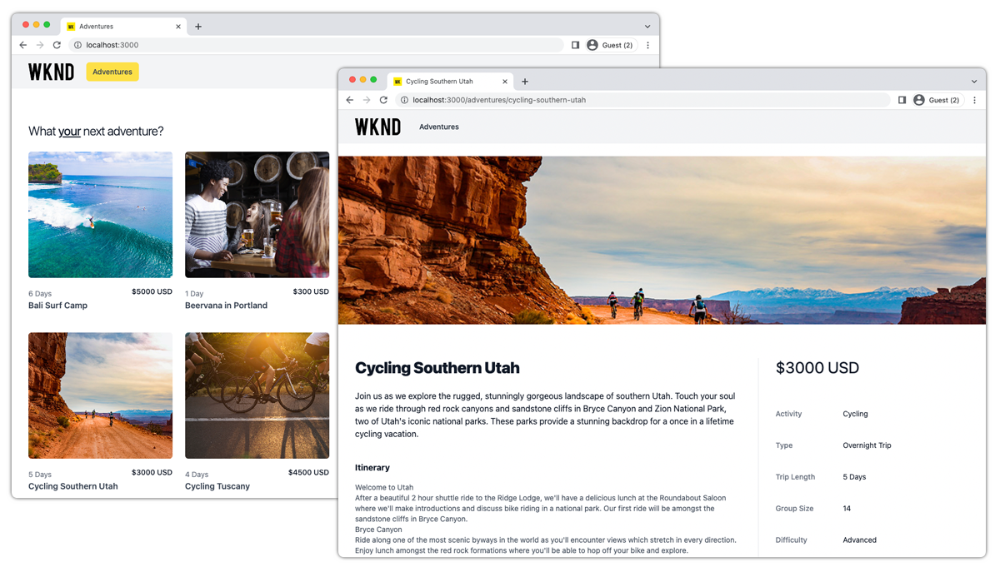

# Next.js-app

Voorbeeldtoepassingen zijn een geweldige manier om de mogelijkheden zonder kop van Adobe Experience Manager (AEM) te verkennen. Deze toepassing Next.js demonstreert hoe u query&#39;s kunt uitvoeren op inhoud met AEM GraphQL API&#39;s met behulp van doorlopende query&#39;s. De AEM Headless-client voor JavaScript wordt gebruikt om de GraphQL-query&#39;s uit te voeren die de toepassing blijven activeren.



Bekijk de [ broncode op GitHub ](https://github.com/adobe/aem-guides-wknd-graphql/tree/main/next-js)

## Vereisten {#prerequisites}

De volgende gereedschappen moeten lokaal worden geïnstalleerd:

+ [ Node.js v18 ](https://nodejs.org/)
+ [ Git ](https://git-scm.com/)

## AEM-vereisten

De app Next.js werkt met de volgende AEM-implementatieopties. Alle plaatsingen vereisen [ Gedeelde v3.0.0+ ](https://github.com/adobe/aem-guides-wknd-shared/releases/latest) WKND van de Plaats v3.0.0+ [&#128279;](https://github.com/adobe/aem-guides-wknd/releases/latest) om op het milieu van AEM as a Cloud Service worden geïnstalleerd.

Dit voorbeeld Next.js app wordt ontworpen om met __AEM te verbinden publiceert__ dienst.

### AEM-autorisatievereisten

Next.js wordt ontworpen om met __te verbinden AEM publiceer__ dienst, en toegang onbeschermde inhoud. Next.js kan worden gevormd om met de Auteur van AEM via de `.env` hieronder beschreven eigenschappen te verbinden. Voor afbeeldingen die worden aangeboden via de AEM-auteur is verificatie vereist. De gebruiker die de Next.js-app opent, moet zich dus ook aanmelden bij de AEM-auteur.

## Hoe wordt het gebruikt

1. De gegevensopslagruimte `adobe/aem-guides-wknd-graphql` klonen:

   ```shell
   $ git clone git@github.com:adobe/aem-guides-wknd-graphql.git
   ```

1. Bewerk het `aem-guides-wknd-graphql/next-js/.env.local` -bestand en stel `NEXT_PUBLIC_AEM_HOST` in op de AEM-service.

   ```plain
   # AEM service
   NEXT_PUBLIC_AEM_HOST=https://publish-p123-e456.adobeaemcloud.com/
   ...
   ```

   Als u verbinding maakt met de AEM Author-service, moet verificatie worden opgegeven omdat de AEM Author-service standaard is beveiligd.

   Een lokale AEM-accountset gebruiken `AEM_AUTH_METHOD=basic` en de gebruikersnaam en het wachtwoord opgeven in de eigenschappen `AEM_AUTH_USER` en `AEM_AUTH_PASSWORD` .

   ```plain
   ...
   # The variables are not prefixed with NEXT_PUBLIC so they are only available server-side
   AEM_AUTH_METHOD=basic
   AEM_AUTH_USER=aem-user-account 
   AEM_AUTH_PASSWORD=password-for-the-aem-user-account
   ```

   Om een [ AEM as a Cloud Service lokaal ontwikkelingstoken ](https://experienceleague.adobe.com/docs/experience-manager-cloud-service/content/implementing/developing/generating-access-tokens-for-server-side-apis.html?lang=nl-NL#generating-the-access-token) te gebruiken plaats `AEM_AUTH_METHOD=dev-token` en de volledige dev symbolische waarde in het `AEM_AUTH_DEV_TOKEN` bezit te verstrekken.

   ```plain
   ...
   # The variables are not prefixed with NEXT_PUBLIC so they are only available server-side
   AEM_AUTH_METHOD=dev-token
   AEM_AUTH_DEV_TOKEN=my-dev-token
   ```

1. Bewerk het `aem-guides-wknd-graphql/next-js/.env.local` -bestand en valideer `NEXT_PUBLIC_AEM_GRAPHQL_ENDPOINT` op het juiste AEM GraphQL-eindpunt.

   Wanneer het gebruiken van [ Gedeelde WKND ](https://github.com/adobe/aem-guides-wknd-shared/releases/latest) of [ Plaats WKND ](https://github.com/adobe/aem-guides-wknd/releases/latest), gebruik het `wknd-shared` GraphQL API eindpunt.

   ```plain
   ...
   NEXT_PUBLIC_AEM_GRAPHQL_ENDPOINT=wknd-shared
   ...
   ```

1. Open een bevelherinnering en begin volgende.js app gebruikend de volgende bevelen:

   ```shell
   $ cd aem-guides-wknd-graphql/next-js
   $ npm install
   $ npm run dev
   ```

1. Een nieuw browser venster opent Next.js app in [ http://localhost:3000](http://localhost:3000)
1. De app Next.js geeft een lijst met avonturen weer. Als u een avontuur selecteert, worden de details op een nieuwe pagina weergegeven.

## De code

Hieronder vindt u een overzicht van de manier waarop de app Next.js is gemaakt, de manier waarop deze verbinding maakt met AEM Headless om inhoud op te halen met behulp van GraphQL persisted query&#39;s en de manier waarop deze gegevens worden gepresenteerd. De volledige code kan op [ GitHub ](https://github.com/adobe/aem-guides-wknd-graphql/tree/main/next-js) worden gevonden.

### Blijvende query&#39;s

Volgens de best practices van AEM Headless gebruikt de app Next.js AEM GraphQL persisted query&#39;s voor query&#39;s op avontuurgegevens. De toepassing gebruikt twee doorlopende query&#39;s:

+ `wknd/adventures-all` bleef query uitvoeren, die alle avonturen in AEM retourneert met een verkorte set eigenschappen. Deze hardnekkige vraag drijft de aanvankelijke lijst van het avontuur van de mening.

```
# Retrieves a list of all Adventures
#
# Optional query variables:
# - { "offset": 10 }
# - { "limit": 5 }
# - { 
#    "imageFormat": "JPG",
#    "imageWidth": 1600,
#    "imageQuality": 90 
#   }
query ($offset: Int, $limit: Int, $sort: String, $imageFormat: AssetTransformFormat=JPG, $imageWidth: Int=1200, $imageQuality: Int=80) {
  adventureList(
    offset: $offset
    limit: $limit
    sort: $sort
    _assetTransform: {
      format: $imageFormat
      width: $imageWidth
      quality: $imageQuality
      preferWebp: true
  }) {
    items {
      _path
      slug
      title
      activity
      price
      tripLength
      primaryImage {
        ... on ImageRef {
          _path
          _dynamicUrl
        }
      }
    }
  }
}
```

+ `wknd/adventure-by-slug` persisted query, die één avontuur retourneert van `slug` (een aangepaste eigenschap die een avontuur op unieke wijze identificeert) met een volledige set eigenschappen. Dit bleef vraagbevoegdheden de meningen van het avontuurdetail.

```
# Retrieves an Adventure Fragment based on it's unique slug.
#
# Required query variables:
# - {"slug": "bali-surf-camp"}
#
# Optional query variables:
# - { 
#     "imageFormat": "JPG",
#     "imageSeoName": "my-adventure",
#     "imageWidth": 1600,
#     "imageQuality": 90 
#   }
#  
# This query returns an adventure list but since the the slug property is set to be unique in the Content Fragment Model, only a single Content Fragment is expected.

query ($slug: String!, $imageFormat:AssetTransformFormat=JPG, $imageSeoName: String, $imageWidth: Int=1200, $imageQuality: Int=80) {
  adventureList(
    filter: {slug: {_expressions: [{value: $slug}]}}
    _assetTransform: {
      format: $imageFormat
      seoName: $imageSeoName
      width: $imageWidth
      quality: $imageQuality
      preferWebp: true
  }) {
    items {
      _path
      title
      slug
      activity
      adventureType
      price
      tripLength
      groupSize
      difficulty
      price
      primaryImage {
        ... on ImageRef {
          _path
          _dynamicUrl
        }
      }
      description {
        json
        plaintext
        html
      }
      itinerary {
        json
        plaintext
        html
      }
    }
    _references {
      ... on AdventureModel {
        _path
        slug
        title
        price
        __typename
      }
    }
  }
}
```

### GraphQL-query uitgevoerd

AEM voortgeduurde vragen worden uitgevoerd over HTTP GET en zo, wordt de [ Hoofdloze cliënt van AEM voor JavaScript ](https://github.com/adobe/aem-headless-client-js) gebruikt om [ de voortgeduurde vragen van GraphQL ](https://github.com/adobe/aem-headless-client-js/blob/main/api-reference.md#aemheadlessrunpersistedquerypath-variables-options--promiseany) tegen AEM uit te voeren en de avontuurinhoud in app te laden.

Elke voortgezette query heeft een corresponderende functie in `src/lib//aem-headless-client.js`, die het AEM GraphQL-eindpunt aanroept en de avontuurgegevens retourneert.

Elke functie roept op zijn beurt de `aemHeadlessClient.runPersistedQuery(...)` aan, die de voortgezette GraphQL query uitvoert.

```js
// src/lib/aem-headless-client.js

...
/**
 * Invokes the 'adventures-all` persisted query using the parameterizable namespace.
 * 
 * @returns a GraphQL response of all adventures.
 */
async getAllAdventures() {
  const queryAdventuresAll = process.env.NEXT_PUBLIC_AEM_GRAPHQL_ENDPOINT + '/adventures-all';
    
  try {
    return await this.aemHeadlessClient.runPersistedQuery(queryAdventuresAll);
  } catch(e) {
    console.error(e)
  }    
}

// And so on, and so forth ... 

async getAdventureSlugs(queryVariables) { ... }

async getAdventuresBySlug(slug, queryVariables) { ... }
...
```

### Pagina&#39;s

De app Next.js gebruikt twee pagina&#39;s om de avontuurgegevens te presenteren.

+ `src/pages/index.js`

  Gebruikt [ Next.js getServerSideProps () ](https://nextjs.org/docs/basic-features/data-fetching/get-server-side-props) om `getAllAdventures()` te roepen en toont elk avontuur als kaart.

  Het gebruik van `getServerSiteProps()` staat voor server-zij Rendering van deze pagina Next.js toe.

+ `src/pages/adventures/[...slug].js`

  A [ Next.js Dynamische Route ](https://nextjs.org/docs/routing/dynamic-routes) die de details van één enkel avontuur toont. Deze dynamische route prefetches de gegevens van elk avontuur gebruikend [ Next.js getStaticProps () ](https://nextjs.org/docs/basic-features/data-fetching/get-static-props) via een vraag aan `getAdventureBySlug(slug, queryVariables)` gebruikend `slug` param dat via de avontuurselectie op de `adventures/index.js` pagina wordt overgegaan, en `queryVariables` om het beeldformaat, de breedte, en de kwaliteit te controleren.

  De dynamische route kan de details voor alle avonturen pre-halen door [ te gebruiken Next.js getStaticPaths () ](https://nextjs.org/docs/basic-features/data-fetching/get-static-paths) en het bevolken van alle mogelijke routepermutaties die op de volledige lijst van avonturen worden gebaseerd door de vraag van GraphQL `getAdventurePaths()` zijn teruggekeerd

  Het gebruik van `getStaticPaths()` en `getStaticProps(..)` stond de Statische Generatie van de Plaats van deze pagina&#39;s toe Next.js.

## Implementatieconfiguratie

Voor Next.js-apps, met name in de context van server-side rendering (SSR) en server-side generation (SSG), zijn geen geavanceerde beveiligingsconfiguraties vereist, zoals Cross-origin Resource Sharing (CORS).

Nochtans, als Next.js HTTP- verzoeken aan AEM van de context van de cliënt doet, kunnen de veiligheidsconfiguraties in AEM worden vereist. Herzie het [ Hoofdloze enige-pagina de plaatsingsleerprogramma van de app van AEM ](../deployment/spa.md) voor meer details.
