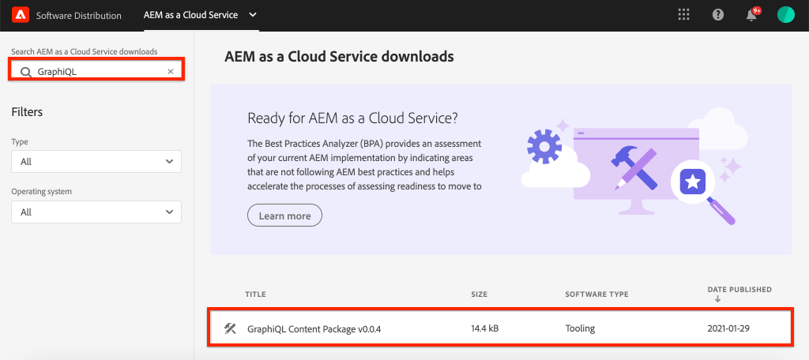
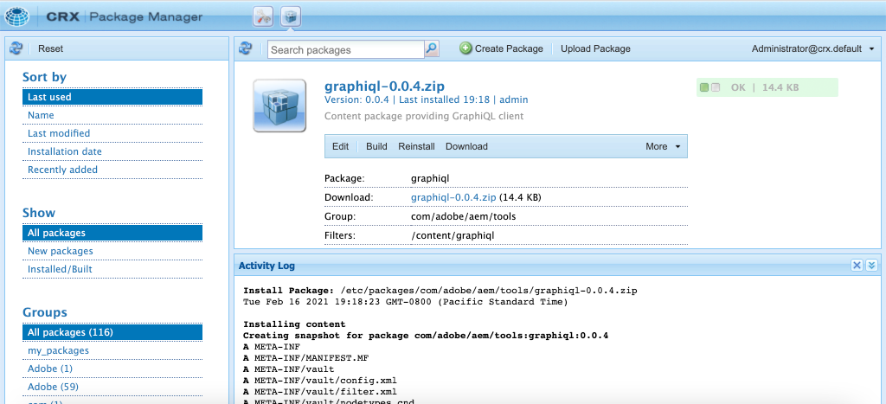

# GraphQL API&#39;s {#explore-graphql-apis} verkennen

De GraphQL API van AEM verstrekt een krachtige vraagtaal om gegevens van de Fragmenten van de Inhoud aan stroomafwaartse toepassingen bloot te stellen. De modellen van het Fragment van de inhoud bepalen het gegevensschema dat door de Fragmenten van de Inhoud wordt gebruikt. Wanneer een model van het Fragment van de Inhoud wordt gecreeerd of bijgewerkt, wordt het schema vertaald en toegevoegd aan de &quot;grafiek&quot;die omhoog GraphQL API maakt.

In dit hoofdstuk, zullen wij sommige gemeenschappelijke vragen GraphQL onderzoeken om inhoud te verzamelen gebruikend winde genoemd [GraphiQL](https://github.com/graphql/graphiql). Met GraphiQL IDE kunt u snel de geretourneerde query&#39;s en gegevens testen en verfijnen. GraphiQL biedt ook eenvoudige toegang tot de documentatie, waardoor u gemakkelijk kunt leren welke methoden beschikbaar zijn en begrijpen.

## Vereisten {#prerequisites}

Dit is een meerdelige zelfstudie en er wordt van uitgegaan dat de stappen die worden beschreven in [Inhoudsfragmenten ontwerpen](./author-content-fragments.md) zijn voltooid.

## Doelstellingen {#objectives}

* Leer om het hulpmiddel te gebruiken GraphiQL om een vraag te construeren gebruikend syntaxis GraphQL.
* Leer hoe u een lijst met inhoudsfragmenten en één inhoudsfragment kunt opvragen.
* Leer hoe u specifieke gegevenskenmerken kunt filteren en aanvragen.
* Leer hoe u een variatie van een inhoudsfragment kunt opvragen.
* Leer hoe u verbinding maakt met een query voor meerdere modellen van inhoudsfragmenten

## Het gereedschap GraphiQL {#install-graphiql} installeren

GrahiQL winde is een ontwikkelingshulpmiddel en nodig slechts op laag-vlakke milieu&#39;s zoals een ontwikkeling of lokale instantie. Daarom is het niet opgenomen in het AEM-project, maar als een afzonderlijk pakket dat op ad-hocbasis kan worden geïnstalleerd.

1. Navigeer naar **[Software Distribution Portal](https://experience.adobe.com/#/downloads/content/software-distribution/en/aemcloud.html)** > **AEM als Cloud Service**.
1. Zoek naar &quot;GraphiQL&quot;(ben zeker om **i** in **GraphiQL** te omvatten.
1. Download de nieuwste **GraphiQL Content Package v.x.x.x**

   

   Het ZIP-bestand is een AEM pakket dat rechtstreeks kan worden geïnstalleerd.

1. Navigeer in het menu **AEM Start** naar **Extra** > **Implementatie** > **Pakketten**.
1. Klik **Pakket uploaden** en kies het pakket dat in de vorige stap is gedownload. Klik **Installeren** om het pakket te installeren.

   

## Vraag een lijst van Inhoudsfragmenten {#query-list-cf}

Een algemene vereiste zal zijn om voor veelvoudige Fragments van de Inhoud te vragen.

1. Navigeer aan GrahiQL winde bij [http://localhost:4502/content/graphiql.html](http://localhost:4502/content/graphiql.html).
1. Plak de volgende query in het linkervenster (onder de lijst met opmerkingen):

   ```graphql
   {
     contributorList {
       items {
           _path
         }
     }
   }
   ```

1. Druk **Spel** knoop in het hoogste menu om de vraag uit te voeren. U zou de resultaten van de de inhoudsfragmenten van Medewerkers van het vorige hoofdstuk moeten zien:

   

1. Plaats de cursor onder de tekst `_path` en voer **CTRL+Space** in om codehints te activeren. Voeg `fullName` en `occupation` aan de vraag toe.

   

1. Voer de vraag opnieuw uit door **Spel** knoop te drukken en u zou de resultaten moeten zien omvatten de extra eigenschappen van `fullName` en `occupation`.

   

   `fullName` en  `occupation` zijn eenvoudige eigenschappen. Herhaal uit het hoofdstuk [Modellen van inhoudsfragmenten definiëren](./content-fragment-models.md) dat `fullName` en `occupation` de waarden zijn die worden gebruikt bij het definiëren van de **Eigenschapnaam** van de respectievelijke velden.

1. `pictureReference` en complexere velden  `biographyText` vertegenwoordigen. Werk de vraag met het volgende bij om gegevens over de `pictureReference` en `biographyText` gebieden terug te keren.

   ```graphql
   {
   contributorList {
       items {
         _path
         fullName
         occupation
         biographyText {
           html
         }
         pictureReference {
           ... on ImageRef {
               _path
               width
               height
               }
           }
       }
     }
   }
   ```

   `biographyText` is een tekstveld met meerdere regels en met de GraphQL API kunnen we verschillende indelingen kiezen voor de resultaten zoals  `html`,  `markdown`of  `json`   `plaintext`.

   `pictureReference` is een inhoudsverwijzing en het wordt verwacht een afbeelding te zijn, daarom wordt een ingebouwd  `ImageRef` object gebruikt. Hierdoor kunnen we aanvullende gegevens opvragen over de afbeelding waarnaar wordt verwezen, zoals `width` en `height`.

1. Experimenteer vervolgens met zoeken naar een lijst met **avonturen**. Voer de volgende vraag uit:

   ```graphql
   {
     adventureList {
       items {
         adventureTitle
         adventureType
         adventurePrimaryImage {
           ...on ImageRef {
             _path
             mimeType
           }
         }
       }
     }
   }
   ```

   U zou een lijst van **teruggekeerde avonturen** moeten zien. U kunt experimenteren door extra velden aan de query toe te voegen.

## Een lijst met inhoudsfragmenten filteren {#filter-list-cf}

Daarna, kijken hoe het mogelijk is om de resultaten aan een ondergroep van Inhoudsfragmenten te filtreren die op een bezitswaarde worden gebaseerd.

1. Ga de volgende vraag in GraphiQL UI in:

   ```graphql
   {
   contributorList(filter: {
     occupation: {
       _expressions: {
         value: "Photographer"
         }
       }
     }) {
       items {
         _path
         fullName
         occupation
       }
     }
   }
   ```

   De bovenstaande query voert een zoekopdracht uit tegen alle Medewerkers in het systeem. Het toegevoegde filter aan het begin van de vraag zal een vergelijking op `occupation` gebied en het koord &quot;**Photographer**&quot;uitvoeren.

1. Voer de vraag uit, wordt verwacht dat slechts één **Medewerker** is teruggekeerd.
1. Voer de volgende query in om een lijst met **Adventures** op te vragen, waarbij `adventureActivity` **not** gelijk is aan **&quot;Surfing&quot;**:

   ```graphql
   {
     adventureList(filter: {
       adventureActivity: {
           _expressions: {
               _operator: EQUALS_NOT
               value: "Surfing"
           }
       }
   }) {
       items {
       _path
       adventureTitle
       adventureActivity
       }
     }
   }
   ```

1. Voer de vraag uit en inspecteer de resultaten. Merk op dat geen van de resultaten een `adventureType` gelijk aan **&quot;Surfen&quot;** omvat.

Er zijn vele andere opties voor het filtreren en het creëren van complexe vragen, hierboven zijn slechts een paar voorbeelden.

## Vraag één enkel inhoudsfragment {#query-single-cf}

Het is ook mogelijk rechtstreeks een query uit te voeren op één inhoudsfragment. Inhoud in AEM wordt hiërarchisch opgeslagen en de unieke id voor een fragment is gebaseerd op het pad van het fragment. Als het doel is om gegevens over één enkel fragment terug te keren, heeft het de voorkeur om de weg te gebruiken en het model direct te vragen. Als u deze syntaxis gebruikt, is de complexiteit van de query erg laag en wordt het resultaat sneller.

1. Ga de volgende vraag in de redacteur GraphiQL in:

   ```graphql
   {
    contributorByPath(_path: "/content/dam/wknd/en/contributors/stacey-roswells") {
       item {
         _path
         fullName
         biographyText {
           html
         }
       }
     }
   }
   ```

1. Voer de vraag uit en neem waar dat het enige resultaat voor het **Stacey Roswells** fragment is teruggekeerd.

   In de vorige oefening, gebruikte u een filter om een lijst van resultaten te versmallen. U kunt een vergelijkbare syntaxis gebruiken om per pad te filteren, maar de bovenstaande syntaxis heeft de voorkeur vanwege de prestaties.

1. Herinnering in [Authoring Content Fragments](./author-content-fragments.md) hoofdstuk dat een **Summary** variatie voor **Stacey Roswells** werd gecreeerd. Werk de vraag bij om de **Summiere** variatie terug te keren:

   ```graphql
   {
   contributorByPath
   (
       _path: "/content/dam/wknd/en/contributors/stacey-roswells"
       variation: "summary"
   ) {
       item {
         _path
         fullName
         biographyText {
           html
         }
       }
     }
   }
   ```

   Hoewel de variatie **Summary** werd genoemd, blijven de variaties in kleine letters voortbestaan en daarom wordt `summary` gebruikt.

1. Voer de vraag uit en neem waar dat het `biography` gebied een veel korter `html` resultaat bevat.

## Query voor meerdere modellen van inhoudsfragmenten {#query-multiple-models}

Het is ook mogelijk om afzonderlijke vragen in één enkele vraag te combineren. Dit is nuttig om het aantal HTTP-verzoeken te minimaliseren dat nodig is om de toepassing van stroom te voorzien. De weergave *Home* van een toepassing kan bijvoorbeeld inhoud weergeven die is gebaseerd op **twee** verschillende modellen van inhoudsfragmenten. In plaats van **two** afzonderlijke vragen uit te voeren, kunnen wij de vragen in één enkel verzoek combineren.

1. Ga de volgende vraag in de redacteur GraphiQL in:

   ```graphql
   {
     adventureList {
       items {
         _path
         adventureTitle
       }
     }
     contributorList {
       items {
         _path
         fullName
       }
     }
   }
   ```

1. Voer de vraag uit en zie dat de resultaatreeks gegevens van **Adventures** en **Medewerkers** bevat:

```json
{
  "data": {
    "adventureList": {
      "items": [
        {
          "_path": "/content/dam/wknd/en/adventures/bali-surf-camp/bali-surf-camp",
          "adventureTitle": "Bali Surf Camp"
        },
        {
          "_path": "/content/dam/wknd/en/adventures/beervana-portland/beervana-in-portland",
          "adventureTitle": "Beervana in Portland"
        },
        ...
      ]
    },
    "contributorList": {
      "items": [
        {
          "_path": "/content/dam/wknd/en/contributors/jacob-wester",
          "fullName": "Jacob Wester"
        },
        {
          "_path": "/content/dam/wknd/en/contributors/stacey-roswells",
          "fullName": "Stacey Roswells"
        }
      ]
    }
  }
}
```

## Aanvullende bronnen

Voor veel meer voorbeelden van vragen GraphQL zie: [Leren om GraphQL met AEM te gebruiken - Inhoud en Vragen van het Monster](https://experienceleague.adobe.com/docs/experience-manager-cloud-service/assets/admin/content-fragments-graphql-samples.html).

## Gefeliciteerd! {#congratulations}

Gefeliciteerd, u creeerde en uitvoerde enkel verscheidene vragen GraphQL!

## Volgende stappen {#next-steps}

In het volgende hoofdstuk, [het vragen van AEM van React app](./graphql-and-external-app.md), zult u onderzoeken hoe een externe toepassing AEM eindpunten kan vragen GraphQL. De externe toepassing die de voorbeeldtoepassing WKND GraphQL React wijzigt om filtreerde GraphQL-query&#39;s toe te voegen, zodat de gebruiker van de app avonturen op activiteit kan filteren. Er wordt ook een aantal standaardfoutafhandeling geïntroduceerd.
