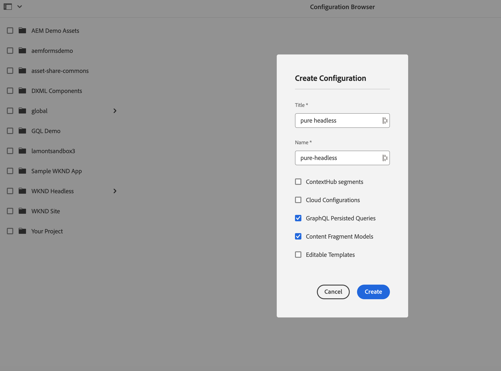
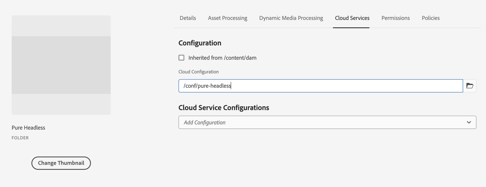

# Modellering van inhoud

Welkom bij de zelfstudie over inhoudsfragmenten en GraphQL-eindpunten in Adobe Experience Manager (AEM). We zullen het gebruiken van Content Fragments, het creëren van Fragmentmodellen, en het gebruiken van GraphQL eindpunten in AEM behandelen.

Inhoudsfragmenten bieden een gestructureerde aanpak voor het beheer van inhoud tussen kanalen, zodat u over meer flexibiliteit en herbruikbaarheid beschikt. Als u Content Fragments inschakelt in AEM, kunt u modulaire inhoud maken, waardoor de consistentie en het aanpassingsvermogen worden vergroot.

Eerst begeleiden we u door het inschakelen van Content Fragments in AEM, waarbij de benodigde configuraties en instellingen voor naadloze integratie worden behandeld.

Vervolgens gaat het maken van fragmentmodellen, waarmee structuur en kenmerken worden gedefinieerd, aan de orde komen. Leer hoe u modellen ontwerpt die zijn afgestemd op uw inhoudsvereisten en deze effectief beheert.

Dan, zullen wij het creëren van de Fragmenten van de Inhoud van de modellen aantonen, die geleidelijke begeleiding op creatie en het publiceren verstrekken.

Bovendien gaan we verder met het definiëren van AEM GraphQL-eindpunten. GraphQL haalt op efficiënte wijze gegevens op uit AEM en wij stellen eindpunten in en configureren deze om de gewenste gegevens beschikbaar te maken. Met permanente query&#39;s worden de prestaties en caching geoptimaliseerd.

Tijdens de gehele zelfstudie geven we uitleg, codevoorbeelden en praktische tips. Tegen het eind, zult u de vaardigheden hebben om de Fragmenten van de Inhoud toe te laten, de Modellen van het Fragment tot stand te brengen, Fragments te produceren, en AEM GraphQL eindpunten en voortgezette vragen te bepalen. Laten we beginnen!

## Contextbewuste configuratie

1. Navigeer aan __Hulpmiddelen > Browser van de Configuratie__ om een configuratie voor de headless ervaring tot stand te brengen.

   

   Verstrek a __titel__ en __naam__, en controleer __GraphQL de Verlengde Vragen__ en __Modellen van het Fragment van de Inhoud__.


## Modellen van inhoudsfragmenten

1. Navigeer aan __Hulpmiddelen > de Modellen van het Fragment van de Inhoud__ en selecteer de omslag met de naam van de configuratie die in stap 1 wordt gecreeerd.

   

1. Binnen de omslag, creeert de uitgezochte ____ en noemt het model __Taser__. Voeg de volgende datatypes aan het __1} model van het Taser {toe.__

   | Datatype | Naam | Vereist | Opties |
   |----------|------|----------|---------|
   | Content Reference | Element | ja | Voeg desgewenst een standaardafbeelding toe. Voorbeeld: /content/dam/wknd-headless/assets/AdobeStock_307513975.mp4 |
   | Tekst met één regel | Titel | ja | |
   | Tekst met één regel | Voortitel | nee | |
   | Tekst met meerdere regels | Beschrijving | nee | Zorg ervoor dat het standaardtype tekst met opmaak is |
   | Opsomming | Stijl | ja | Renderen als vervolgkeuzelijst. Opties zijn Hero -> hero en Topaanbieding -> aanbevolen |

   

1. Binnen de omslag, creeer een tweede model genoemd __Aanbieding__. Klik op Maken en geef het model de naam &quot;Aanbieding&quot; en voeg de volgende datatypen toe:

   | Datatype | Naam | Vereist | Opties |
   |----------|------|----------|---------|
   | Content Reference | Element | ja | Standaardafbeelding toevoegen. Voorbeeld: `/content/dam/wknd-headless/assets/AdobeStock_238607111.jpeg` |
   | Tekst met meerdere regels | Beschrijving | nee |  |
   | Tekst met meerdere regels | Artikel | nee |  |

   

1. Binnen de omslag, creeer een derde model genoemd __Lijst van het Beeld__. Klik op Maken en geef het model de naam &quot;Lijst van afbeeldingen&quot; en voeg de volgende datatypen toe:

   | Datatype | Naam | Vereist | Opties |
   |----------|------|----------|---------|
   | Fragmentverwijzing | Items weergeven | ja | Renderen als meerdere velden. Toegestaan inhoudsfragmentmodel is aangeboden. |

   

## Inhoudsfragmenten

1. Navigeer nu naar Assets en maak een map voor de nieuwe site. Klik op Maken en geef de map een naam.

    toe

1. Nadat de omslag wordt gecreeerd, selecteer de omslag en open zijn __Eigenschappen__.
1. In het lusje van de Configuraties van de Wolk van de omslag ____, selecteer de configuratie [ vroeger ](#enable-content-fragments-and-graphql) gecreeerd.

   

   Klik in de nieuwe map en maak een teaser. Klik __creëren__ en __het Fragment van de Inhoud__ en selecteren het __Taser__ model. Noem het model __Hero__ en klik __creeer__.

   | Naam | Notities |
   |----------|------|
   | Element | Als standaardwaarde behouden of een ander element kiezen (video of afbeelding) |
   | Titel | `Explore. Discover. Live.` |
   | Voortitel | `Join use for your next adventure.` |
   | Beschrijving | Leeg laten |
   | Stijl | `Hero` |

   

## GraphQL-eindpunten

1. Ga aan __Hulpmiddelen > GraphQL__

   

1. Klik __creëren__ en geef het nieuwe eindpunt een naam en kies de pas gecreëerde configuratie.

   

## Aangehouden GraphQL-query&#39;s

1. Laten we het nieuwe eindpunt testen. Navigeer aan __Hulpmiddelen > de Redacteur van de Vraag van GraphQL__ en kies ons eindpunt voor de daling neer in het hoogste recht van het venster.

1. In de vraagredacteur, creeer een paar verschillende vragen.


   ```graphql
   {
       teaserList {
           items {
           title
           }
       }
   }
   ```

   U zou een lijst moeten krijgen die het enige gemaakte fragment [ hierboven ](#create-content) bevatten.

   Voor deze oefening maakt u een volledige query die de AEM-app zonder kop gebruikt. Maak een query die één teaser per pad retourneert. Voer de volgende query in in de query-editor:

   ```graphql
   query TeaserByPath($path: String!) {
   component: teaserByPath(_path: $path) {
       item {
       __typename
       _path
       _metadata {
           stringMetadata {
           name
           value
           }
       }
       title
       preTitle
       style
       asset {
           ... on MultimediaRef {
           __typename
           _authorUrl
           _publishUrl
           format
           }
           ... on ImageRef {
           __typename
           _authorUrl
           _publishUrl
           mimeType
           width
           height
           }
       }
       description {
           html
           plaintext
       }
       }
   }
   }
   ```

   In de __input van vraagvariabelen__ bij de bodem, ga binnen:

   ```json
   {
       "path": "/content/dam/pure-headless/hero"
   }
   ```

   >[!NOTE]
   >
   > Mogelijk moet u de queryvariabele `path` aanpassen op basis van de map- en fragmentnamen.


   Voer de query uit om de resultaten van het eerder gemaakte inhoudsfragment te ontvangen.

1. Klik __sparen__ om (sparen) de vraag voort te zetten en de vraag __teaser__ te noemen. Hierdoor kunnen we de query op naam weergeven in de toepassing.

## Volgende stappen

Gefeliciteerd! U hebt AEM as a Cloud Service geconfigureerd om het maken van Content Fragments en GraphQL-eindpunten toe te staan. U hebt ook een model van het Fragment van de Inhoud en een Fragment van de Inhoud, en bepaald een eindpunt van GraphQL en persisted vraag gecreeerd. U bent nu klaar om naar het volgende zelfstudie- hoofdstuk te gaan, waar u leert hoe u een AEM Headless React-toepassing kunt maken die de Content Fragments en het GraphQL-eindpunt gebruikt die u in dit hoofdstuk hebt gemaakt.

[Volgende hoofdstuk: AEM Headless API&#39;s en Reageren](./2-aem-headless-apis-and-react.md)
