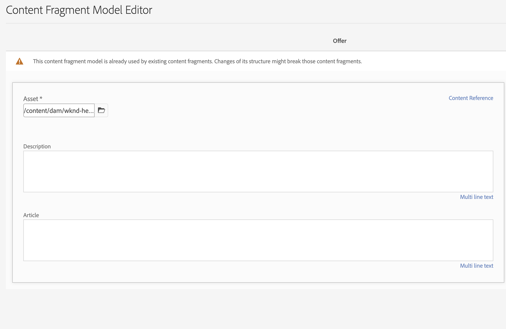

# Modellering van inhoud

Welkom bij de zelfstudie over inhoudsfragmenten en GraphQL-eindpunten in Adobe Experience Manager (AEM). We zullen het gebruik van Content Fragments, het maken van Fragmentmodellen en het gebruik van GraphQL-eindpunten in AEM behandelen.

Inhoudsfragmenten bieden een gestructureerde aanpak voor het beheer van inhoud tussen kanalen, zodat u over meer flexibiliteit en herbruikbaarheid beschikt. Als u Content Fragments in AEM inschakelt, kunt u modulaire inhoud maken, waardoor de consistentie en het aanpassingsvermogen worden vergroot.

Eerst, zullen wij u door het toelaten van de Fragmenten van de Inhoud in AEM begeleiden, die noodzakelijke configuraties en montages voor naadloze integratie behandelen.

Vervolgens gaat het maken van fragmentmodellen, waarmee structuur en kenmerken worden gedefinieerd, aan de orde komen. Leer hoe u modellen ontwerpt die zijn afgestemd op uw inhoudsvereisten en deze effectief beheert.

Dan, zullen wij het creëren van de Fragmenten van de Inhoud van de modellen aantonen, die geleidelijke begeleiding op creatie en het publiceren verstrekken.

Daarnaast zullen we zoeken naar het definiëren van eindpunten voor AEM GraphQL. GraphQL haalt efficiënt gegevens op uit AEM en wij stellen eindpunten in en configureren deze om de gewenste gegevens beschikbaar te maken. Met permanente query&#39;s worden de prestaties en caching geoptimaliseerd.

Tijdens de gehele zelfstudie geven we uitleg, codevoorbeelden en praktische tips. Tegen het eind, zult u de vaardigheden hebben om de Fragmenten van de Inhoud toe te laten, tot de Modellen van het Fragment te leiden, Fragments te produceren, en AEM eindpunten van GraphQL en voortgezette vragen te bepalen. Laten we beginnen!

## Contextbewuste configuratie

1. Navigeren naar __Gereedschappen > Configuratiebrowser__ om een configuratie voor de headless ervaring tot stand te brengen.

   

   Geef een __titel__ en __name__ en controleren __Aangehouden GraphQL-query&#39;s__ en __Modellen van inhoudsfragmenten__.


## Modellen van inhoudsfragmenten

1. Navigeren naar __Gereedschappen > Modellen van inhoudsfragmenten__ en selecteer de map met de naam van de configuratie die in stap 1 is gemaakt.

   

1. Binnen de map selecteert u __Maken__ en geef het model een naam __Teaser__. Voeg de volgende datatypen aan toe __Teaser__ model.

   | Datatype | Naam | Vereist | Opties |
   |----------|------|----------|---------|
   | Content Reference | Element | ja | Voeg desgewenst een standaardafbeelding toe. Voorbeeld: /content/dam/wknd-headless/assets/AdobeStock_307513975.mp4 |
   | Tekst met één regel | Titel | ja |
   | Tekst met één regel | Voortitel | nee |
   | Tekst met meerdere regels | Beschrijving | nee | Zorg ervoor dat het standaardtype tekst met opmaak is |
   | Opsomming | Stijl | ja | Renderen als vervolgkeuzelijst. Opties zijn Hero -> hero en Topaanbieding -> aanbevolen |

   

1. Maak binnen de map een tweede model met de naam __Voorstel__. Klik op Maken en geef het model de naam &quot;Aanbieding&quot; en voeg de volgende datatypen toe:

   | Datatype | Naam | Vereist | Opties |
   |----------|------|----------|---------|
   | Content Reference | Element | ja | Standaardafbeelding toevoegen. Voorbeeld: `/content/dam/wknd-headless/assets/AdobeStock_238607111.jpeg` |
   | Tekst met meerdere regels | Beschrijving | nee |  |
   | Tekst met meerdere regels | Artikel | nee |  |

   

1. Maak in de map een derde model met de naam __Afbeeldingslijst__. Klik op Maken en geef het model de naam &quot;Lijst van afbeeldingen&quot; en voeg de volgende datatypen toe:

   | Datatype | Naam | Vereist | Opties |
   |----------|------|----------|---------|
   | Fragmentverwijzing | Items weergeven | ja | Renderen als meerdere velden. Toegestaan inhoudsfragmentmodel is aangeboden. |

   

## Inhoudsfragmenten

1. Navigeer nu naar Middelen en maak een map voor de nieuwe site. Klik op Maken en geef de map een naam.

   

1. Nadat de map is gemaakt, selecteert u de map en opent u de bijbehorende map __Eigenschappen__.
1. In de map __Cloudconfiguraties__ tabblad selecteert u de configuratie [eerder gemaakt](#enable-content-fragments-and-graphql).

   

   Klik in de nieuwe map en maak een teaser. Klikken __Maken__ en __Inhoudsfragment__ en selecteert u de __Teaser__ model. Geef het model een naam __Hero__ en klik op __Maken__.

   | Naam | Notities |
   |----------|------|
   | Element | Als standaardwaarde behouden of een ander element kiezen (video of afbeelding) |
   | Titel | `Explore. Discover. Live.` |
   | Voortitel | `Join use for your next adventure.` |
   | Beschrijving | Leeg laten |
   | Stijl | `Hero` |

   

## GraphQL-eindpunten

1. Navigeren naar __Gereedschappen > GraphQL__

   

1. Klikken __Maken__ en geef het nieuwe eindpunt een naam en kies de pas gecreëerde configuratie.

   

## Aangehouden GraphQL-query&#39;s

1. Laten we het nieuwe eindpunt testen. Navigeren naar __Gereedschappen > GraphQL Query Editor__ en kiest u ons eindpunt voor de vervolgkeuzelijst rechtsboven in het venster.

1. In de vraagredacteur, creeer een paar verschillende vragen.


   ```graphql
   {
       teaserList {
           items {
           title
           }
       }
   }
   ```

   Er moet een lijst met één fragment worden gemaakt [boven](#create-content).

   Voor deze oefening, creeer een volledige vraag die de AEM headless app gebruikt. Maak een query die één teaser per pad retourneert. Voer de volgende query in in de query-editor:

   ```graphql
   query TeaserByPath($path: String!) {
   component: teaserByPath(_path: $path) {
       item {
       __typename
       _path
       _metadata {
           stringMetadata {
           name
           value
           }
       }
       title
       preTitle
       style
       asset {
           ... on MultimediaRef {
           __typename
           _authorUrl
           _publishUrl
           format
           }
           ... on ImageRef {
           __typename
           _authorUrl
           _publishUrl
           mimeType
           width
           height
           }
       }
       description {
           html
           plaintext
       }
       }
   }
   }
   ```

   In de __queryvariabelen__ Voer onderaan de invoer in:

   ```json
   {
       "path": "/content/dam/pure-headless/hero"
   }
   ```

   >[!NOTE]
   >
   > Mogelijk moet u de queryvariabele aanpassen `path` op basis van de map- en fragmentnamen.


   Voer de query uit om de resultaten van het eerder gemaakte inhoudsfragment te ontvangen.

1. Klikken __Opslaan__  om de query voort te zetten (op te slaan) en de query een naam te geven __tepel__. Hierdoor kunnen we de query op naam weergeven in de toepassing.

## Volgende stappen

Gefeliciteerd! U hebt met succes gevormd AEM as a Cloud Service om voor de verwezenlijking van de Fragmenten van de Inhoud en eindpunten van GraphQL toe te staan. U hebt ook een model van het Fragment van de Inhoud en een Fragment van de Inhoud, en bepaald een eindpunt van GraphQL en persisted vraag gecreeerd. U bent nu bereid om zich op het volgende zelfstudie- hoofdstuk te bewegen, waar u zult leren hoe te om een AEM toepassing van de Reactie van de Zwaartepunt tot stand te brengen die de Fragments van de Inhoud en het eindpunt van GraphQL verbruikt u in dit hoofdstuk creeerde.

[Volgend hoofdstuk: AEM headless API&#39;s en Reageer](./2-aem-headless-apis-and-react.md)
