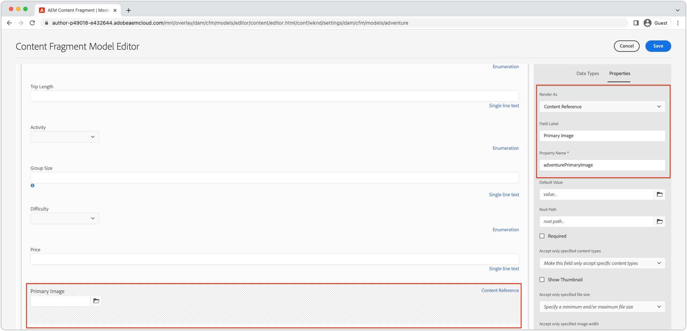

# Geoptimaliseerde afbeeldingen met AEM headless {#images-with-aem-headless}

Afbeeldingen zijn een essentieel aspect van [ontwikkeling van rijke, overtuigende AEM eindeloze ervaringen](https://experienceleague.adobe.com/docs/experience-manager-learn/getting-started-with-aem-headless/graphql/multi-step/overview.html). AEM Headless ondersteunt het beheer van afbeeldingselementen en de geoptimaliseerde levering ervan.

Inhoudsfragmenten die worden gebruikt in AEM modellering van inhoud zonder kop, verwijzen vaak naar afbeeldingselementen die zijn bedoeld voor weergave in de headless-ervaring. AEM GraphQL-query&#39;s kunnen worden geschreven om URL&#39;s aan te bieden voor afbeeldingen op basis van de locatie waar naar de afbeelding wordt verwezen.

De `ImageRef` type heeft vier URL-opties voor inhoudsverwijzingen:

+ `_path` is het referenced weg in AEM, en omvat geen AEM oorsprong (gastheernaam)
+ `_dynamicUrl` is de volledige URL naar het voorkeursafbeeldingselement dat voor het web is geoptimaliseerd.
   + De `_dynamicUrl` bevat geen AEM oorsprong, zodat het domein (AEM Auteur of AEM publicatieservice) moet worden opgegeven door de clienttoepassing.
+ `_authorUrl` is de volledige URL naar het afbeeldingselement op AEM auteur
   + [AEM auteur](https://experienceleague.adobe.com/docs/experience-manager-learn/cloud-service/underlying-technology/introduction-author-publish.html) kan worden gebruikt om een voorvertoning van de toepassing zonder kop weer te geven.
+ `_publishUrl` is de volledige URL naar het afbeeldingselement bij AEM Publiceren
   + [AEM publiceren](https://experienceleague.adobe.com/docs/experience-manager-learn/cloud-service/underlying-technology/introduction-author-publish.html) is typisch waar de productie plaatsing van de hoofdloze toepassing beelden van toont.

De `_dynamicUrl` is de voorkeurs-URL die voor afbeeldingselementen moet worden gebruikt en moet het gebruik van `_path`, `_authorUrl`, en `_publishUrl` waar mogelijk.

|                                | AEM as a Cloud Service | as a Cloud Service RDE AEM | AEM SDK | AEM 6,5 |
| ------------------------------ |:----------------------:|:--------------------------:|:-------:|:-------:|
| Ondersteunt webgeoptimaliseerde afbeeldingen? | ✔ | ✔ | ✘ | ✘ |


>[!CONTEXTUALHELP]
>id="aemcloud_learn_headless_graphql_images"
>title="Afbeeldingen met AEM zonder kop"
>abstract="Leer hoe AEM Headless het beheer van beeldactiva en hun geoptimaliseerde levering steunt."

## Inhoudsfragmentmodel

Zorg ervoor dat het veld Inhoudsfragment dat de afbeeldingsverwijzing bevat, zich bevindt in het veld __inhoudsverwijzing__ gegevenstype.

Veldtypen worden gecontroleerd in het dialoogvenster [Inhoudsfragmentmodel](https://experienceleague.adobe.com/docs/experience-manager-cloud-service/content/assets/content-fragments/content-fragments-models.html)door het veld te selecteren en de __Eigenschappen__ rechts.



## GraphQL-query voortgezet

Retourneer het veld in de GraphQL-query als de `ImageRef` type, en verzoek om `_dynamicUrl` veld. U kunt bijvoorbeeld een avontuur opvragen in het dialoogvenster [WKND-siteproject](https://github.com/adobe/aem-guides-wknd) en de afbeeldings-URL opnemen voor de verwijzingen naar afbeeldingselementen in de `primaryImage` veld, kan worden uitgevoerd met een nieuwe, voortgezette query `wknd-shared/adventure-image-by-path` gedefinieerd als:

```graphql {highlight="11"}
query($path: String!, $imageFormat: AssetTransformFormat=JPG, $imageSeoName: String, $imageWidth: Int, $imageQuality: Int) {
  adventureByPath(
    _path: $path
    _assetTransform: {
      format: $imageFormat
      width: $imageWidth
      quality: $imageQuality
      preferWebp: true
    }
  ) {
    item {
      _path
      title
      primaryImage {
        ... on ImageRef {
          _dynamicUrl
        }
      }
    }
  }
}
```

### Query-variabelen

```json
{ 
  "path": "/content/dam/wknd-shared/en/adventures/bali-surf-camp/bali-surf-camp",
  "imageFormat": "JPG",
  "imageWidth": 1000,
}
```

De `$path` in de `_path` filter vereist het volledige pad naar het inhoudsfragment (bijvoorbeeld `/content/dam/wknd-shared/en/adventures/bali-surf-camp/bali-surf-camp`).

De `_assetTransform` bepaalt hoe `_dynamicUrl` is ontworpen om de weergegeven afbeelding te optimaliseren. URL&#39;s met webgeoptimaliseerde afbeeldingen kunnen ook op de client worden aangepast door de queryparameters van de URL te wijzigen.

| GraphQL, parameter | URL-parameter | Beschrijving | Vereist | Variabele GraphQL-waarden | URL-parameterwaarden | Voorbeeld-URL, parameter |
|:---------|:----------|:-------------------------------|:--:|:--------------------------|:---|:--|
| `format` | NVT | De indeling van het afbeeldingselement. | ✔ | `GIF`, `PNG`, `PNG8`, `JPG`, `PJPG`, `BJPG`,  `WEBP`, `WEBPLL`, `WEBPLY` | NVT | NVT |
| `seoName` | NVT | Naam van bestandssegment in URL. Indien niet opgegeven, wordt de naam van het afbeeldingselement gebruikt. | ✘ | Alphanumeric `-`, of `_` | NVT | NVT |
| `crop` | `crop` | Het uitsnijdkader dat uit de afbeelding is genomen, moet binnen de grootte van de afbeelding vallen | ✘ | Positieve gehele getallen die een snijgebied binnen de grenzen van de afmetingen van de oorspronkelijke afbeelding definiëren | Door komma&#39;s afgebakende reeks numerieke coördinaten `<X_ORIGIN>,<Y_ORIGIN>,<CROP_WIDTH>,<CROP_HEIGHT>` | `?crop=10,20,300,400` |
| `size` | `size` | Grootte van de uitvoerafbeelding (zowel hoogte als breedte) in pixels. | ✘ | Positieve gehele getallen | Door komma&#39;s gescheiden positieve gehele getallen in de volgorde `<WIDTH>,<HEIGHT>` | `?size=1200,800` |
| `rotation` | `rotate` | Rotatie van de afbeelding in graden. | ✘ | `R90`, `R180`, `R270` | `90`, `180`, `270` | `?rotate=90` |
| `flip` | `flip` | Draai de afbeelding om. | ✘ | `HORIZONTAL`, `VERTICAL`, `HORIZONTAL_AND_VERTICAL` | `h`, `v`, `hv` | `?flip=h` |
| `quality` | `quality` | Afbeeldingskwaliteit in procenten van oorspronkelijke kwaliteit. | ✘ | 1-100 | 1-100 | `?quality=80` |
| `width` | `width` | Breedte van de uitvoerafbeelding in pixels. Wanneer `size` wordt verstrekt `width` wordt genegeerd. | ✘ | Positief geheel getal | Positief geheel getal | `?width=1600` |
| `preferWebP` | `preferwebp` | Indien `true` en AEM een WebP dienen als browser het, ongeacht `format`. | ✘ | `true`, `false` | `true`, `false` | `?preferwebp=true` |

## GraphQL-reactie

Het resulterende JSON-antwoord bevat de aangevraagde velden met de voor het web geoptimaliseerde URL naar de afbeeldingselementen.

```json {highlight="8"}
{
  "data": {
    "adventureByPath": {
      "item": {
        "_path": "/content/dam/wknd-shared/en/adventures/bali-surf-camp/bali-surf-camp",
        "title": "Bali Surf Camp",
        "primaryImage": {
          "_dynamicUrl": "/adobe/dynamicmedia/deliver/dm-aid--a38886f7-4537-4791-aa20-3f6ef0ac3fcd/adobestock_175749320.jpg?preferwebp=true&width=1000&quality=80"
        }
      }
    }
  }
}
```

Als u de webgeoptimaliseerde afbeelding van de referentieafbeelding in uw toepassing wilt laden, gebruikt u de opdracht `_dynamicUrl` van de `primaryImage` als de bron-URL van de afbeelding.

In React ziet het weergeven van een webgeoptimaliseerde afbeelding uit AEM Publiceren er als volgt uit:

```jsx
// The AEM host is usually read from a environment variable of the SPA.
const AEM_HOST = "https://publish-p123-e456.adobeaemcloud.com";
...
let dynamicUrl = AEM_HOST + data.adventureByPath.item.primaryImage._dynamicUrl;
...

```

Onthoud, `_dynamicUrl` bevat niet het AEM domein, dus u moet de gewenste oorsprong opgeven voor de afbeeldings-URL die moet worden opgelost.

## Responsieve URL&#39;s

In het bovenstaande voorbeeld ziet u hoe u een afbeelding van één formaat gebruikt, maar in webervaringen zijn responsieve afbeeldingssets vaak vereist. Responsieve afbeeldingen kunnen worden geïmplementeerd met [img-srcsets](https://css-tricks.com/a-guide-to-the-responsive-images-syntax-in-html/#using-srcset) of [afbeeldingselementen](https://css-tricks.com/a-guide-to-the-responsive-images-syntax-in-html/#using-srcset). Het volgende codefragment laat zien hoe u het `_dynamicUrl` als een basis, en voeg verschillende breedteparameters toe, aan macht verschillende ontvankelijke meningen. Niet alleen kan de `width` de vraagparameter wordt gebruikt, maar andere vraagparameters kunnen door de cliënt worden toegevoegd om het beeldactiva verder te optimaliseren die op zijn behoeften worden gebaseerd.

```javascript
// The AEM host is usually read from a environment variable of the SPA.
const AEM_HOST = "https://publish-p123-e456.adobeaemcloud.com";
...
// Read the data from GraphQL response
let dynamicUrl = AEM_HOST + data.adventureByPath.item.primaryImage._dynamicUrl;
let alt = data.adventureByPath.item.title;
...
{/*-- Example img srcset --*/}
document.body.innerHTML=`
    alt="${alt}"
    src="${dynamicUrl}&width=1000}"
    srcset="`
      ${dynamicUrl}&width=1000 1000w,
      ${dynamicUrl}&width=1600 1600w,
      ${dynamicUrl}&width=2000 2000w,
      `"
    sizes="calc(100vw - 10rem)"/>`;
...
{/*-- Example picture --*/}
document.body.innerHTML=`<picture>
      <source srcset="${dynamicUrl}&width=2600" media="(min-width: 2001px)"/>
      <source srcset="${dynamicUrl}&width=2000" media="(min-width: 1000px)"/>
      
    </picture>`;
```

## Voorbeeld Reageren

Laten we een eenvoudige React-toepassing maken waarmee voor het web geoptimaliseerde afbeeldingen worden weergegeven in de volgende [responsieve afbeeldingspatronen](https://css-tricks.com/a-guide-to-the-responsive-images-syntax-in-html/). Er zijn twee hoofdpatronen voor responsieve afbeeldingen:

+ [Img-element met script](https://css-tricks.com/a-guide-to-the-responsive-images-syntax-in-html/#using-srcset) voor betere prestaties
+ [Figuurelement](https://css-tricks.com/a-guide-to-the-responsive-images-syntax-in-html/#using-picture) voor ontwerpcontrole

### Img-element met script

>[!VIDEO](https://video.tv.adobe.com/v/3418556/?quality=12&learn=on)

[Img-elementen met srcset](https://css-tricks.com/a-guide-to-the-responsive-images-syntax-in-html/#using-srcset) worden gebruikt met de `sizes` voor verschillende afbeeldingselementen voor verschillende schermgrootten. Img-sets zijn handig wanneer u verschillende afbeeldingselementen voor verschillende schermgrootten aanbiedt.

### Figuurelement

[Afbeeldingselementen](https://css-tricks.com/a-guide-to-the-responsive-images-syntax-in-html/#using-picture) worden gebruikt met meerdere `source` elementen om verschillende afbeeldingselementen voor verschillende schermgrootten te bieden. Afbeeldingselementen zijn handig voor verschillende afbeeldingsuitvoeringen voor verschillende schermgrootten.

>[!VIDEO](https://video.tv.adobe.com/v/3418555/?quality=12&learn=on)

### Voorbeeldcode

Deze eenvoudige React-app gebruikt de [AEM headless SDK](./aem-headless-sdk.md) om AEM Headless APIs voor een inhoud van het Avontuur te vragen, en het Web-geoptimaliseerde beeld te tonen gebruikend [img-element met srcset](#img-element-with-srcset) en [afbeeldingselement](#picture-element). De `srcset` en `sources` een aangepaste `setParams` functie om de web-optimized parameter van de leveringsvraag aan toe te voegen `_dynamicUrl` van de afbeelding, wijzigt u de geleverde afbeeldingsuitvoering op basis van de behoeften van de webclient.

Het vragen tegen AEM wordt uitgevoerd in de haak van de douane React [useAdventureByPath die de AEM Headless SDK gebruikt](./aem-headless-sdk.md#graphql-persisted-queries).

```javascript
// src/App.js

import "./App.css";
import { useAdventureByPath } from './api/persistedQueries'

const AEM_HOST = process.env.AEM_HOST;

function App() {

  /**
   * Update the dynamic URL with client-specific query parameters
   * @param {*} imageUrl the image URL
   * @param {*} params the AEM web-optimized image query parameters
   * @returns the dynamic URL with the query parameters
   */
  function setOptimizedImageUrlParams(imageUrl, params) {
    let url = new URL(imageUrl);
    Object.keys(params).forEach(key => {
      url.searchParams.set(key, params[key]);
    });
    return url.toString();
  }

  // Get data from AEM using GraphQL persisted query as defined above 
  // The details of defining a React useEffect hook are explored in How to > AEM Headless SDK
  // The 2nd parameter define the base GraphQL query parameters used to request the web-optimized image
  let { data, error } = useAdventureByPath(
        "/content/dam/wknd-shared/en/adventures/bali-surf-camp/bali-surf-camp", 
        { imageFormat: "JPG" }
      );

  // Wait for AEM Headless APIs to provide data
  if (!data) { return <></> }

  const alt = data.adventureByPath.item.title;
  const imageUrl =  AEM_HOST + data.adventureByPath.item.primaryImage._dynamicUrl;

  return (
    <div className="app">
      
      <h1>Web-optimized images</h1>

      {/* Render the web-optimized image img with srcset for the Adventure Primary Image */}
      <h2>Img srcset</h2>

      

       {/* Render the web-optimized picture for the Adventure Primary Image */}
        <h2>Picture element</h2>

        <picture>
          {/* When viewport width is greater than 2001px */}
          <source srcSet={setOptimizedImageUrlParams(imageUrl, { width : 2600 })} media="(min-width: 2001px)"/>        
          {/* When viewport width is between 1000px and 2000px */}
          <source srcSet={setOptimizedImageUrlParams(imageUrl, { width : 2000})} media="(min-width: 1000px)"/>
          {/* When viewport width is less than 799px */}
          
        </picture>
    </div>
  );
}

export default App;
```
