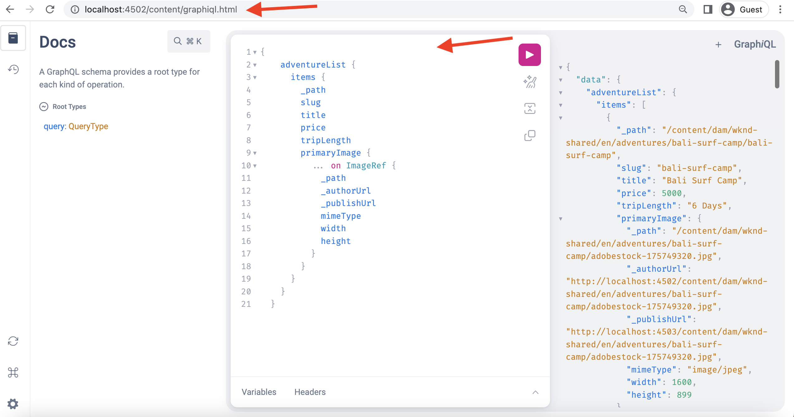

# GraphiQL IDE installeren op AEM 6.5

In AEM 6.5 moet het hulpmiddel GraphiQL IDE manueel worden geïnstalleerd.

1. Navigeer aan het **[Portaal van de Distributie van de Software ](https://experience.adobe.com/#/downloads/content/software-distribution/en/aemcloud.html)** > **AEM as a Cloud Service**.
1. Onderzoek naar &quot;GraphiQL&quot;(ben zeker om **i** in **GraphiQL** te omvatten).
1. Download het recentste **GrahiQL Pakket van de Inhoud v.x.x.x.x**.

   

   Het ZIP-bestand is een AEM pakket dat rechtstreeks kan worden geïnstalleerd.

1. Van het AEM menu van het Begin, navigeer aan **Hulpmiddelen** > **Plaatsing** > **Pakketten**.
1. Klik **Upload Pakket** en kies het pakket in de vroegere stap wordt gedownload dat. Klik **installeren** om het pakket te installeren.

   

1. Navigeer aan **CRXDE Lite** > **het Comité van de Bewaarplaats** > selecteert `/content/graphiql` knoop (bijvoorbeeld, <http://localhost:4502/crx/de/index.jsp#/content/graphiql>).
1. In het **bezit van Eigenschappen** lusje verandert waarde van `endpoint` bezit in `/content/_cq_graphql/wknd-shared/endpoint.json`.
   

1. Navigeer aan de **Configuratie van de Console van het Web** UI > Onderzoek naar **CSRF de configuratie van de Filter** (bijvoorbeeld, <http://localhost:4502/system/console/configMgr/com.adobe.granite.csrf.impl.CSRFFilter)>
1. In de `Excluded Paths` update van het gebied van de bezitsnaam, het WKND GraphQL eindpuntweg aan `/content/cq:graphql/wknd-shared/endpoint`.

 uit

1. Heb toegang tot de redacteur GraphiQL gebruikend `//HOST:PORT/content/graphiql.html`, en verifieer u een nieuwe vraag kunt construeren of een bestaande vraag uitvoeren. (bijvoorbeeld <http://localhost:4502/content/graphiql.html>)

>[!TIP]
>
>Als u uw projectspecifieke GraphQL-schema en query-uitvoering wilt ondersteunen, moet u de overeenkomende wijzigingen voor de `endpoint` - en `Excluded Paths` -waarden in de bovenstaande stappen doorvoeren.
